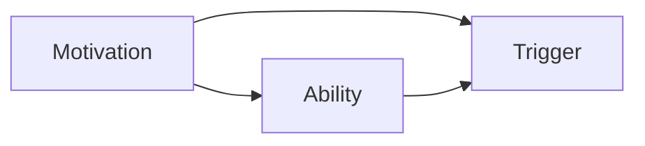

                 

# 行为设计:用福格模型塑造好习惯

> 关键词：行为设计, 福格模型, 习惯形成, 自我决定理论, 动机驱动, 行为介入

## 1. 背景介绍

行为设计作为一门新兴的学科，旨在理解、分析和改善人类行为。在心理学和行为科学的推动下，行为设计理论逐渐从学术研究进入企业实践，帮助企业和组织优化用户体验、提升员工效率、构建有效营销策略等。其中，福格模型（Fogg Model）是行为设计中极具影响力的一个模型，它提供了一套系统化的框架，用于理解和引导人们的行为变化。

福格模型的提出者是斯坦福大学的B.J. Fogg教授，他在《行为模型》一书中详细阐述了这一模型。福格模型将行为分为三个关键元素：动机、能力、触发器。只有当动机足够强烈、能力足够支持、触发器足够显著时，行为才会发生。本文将深入探讨福格模型的核心概念与原理，并通过具体案例分析，帮助读者掌握行为设计的实操方法。

## 2. 核心概念与联系

### 2.1 核心概念概述

福格模型由三个核心概念组成：动机（Motivation）、能力（Ability）和触发器（Triggers）。

- **动机（Motivation）**：人们为什么愿意采取某一行为。动机通常受到外界环境和个人心理状态的影响，如利益驱动、情感激发、社会压力等。

- **能力（Ability）**：采取某一行为所需要具备的技能、知识、资源等。能力越强，行为发生的可能性越大。

- **触发器（Triggers）**：促成某一行为发生的提示或事件。触发器可以是时间、地点、情境中的某些线索，或者是由他人行为引发的一系列反应。

### 2.2 核心概念原理和架构的 Mermaid 流程图



在这个流程图中，动机、能力和触发器三者相互影响，共同决定了行为的发生。动机和能力在某种程度上决定了行为发生的可能性，而触发器则起到加速或抑制行为的作用。

## 3. 核心算法原理 & 具体操作步骤

### 3.1 算法原理概述

福格模型通过分析动机、能力和触发器的相互作用，揭示了行为发生的内在机制。它认为，要想使人们改变行为，就需要从这三个方面入手，设计出符合用户需求的行为干预策略。

具体来说，福格模型将行为分为“成本低、动机高”和“成本高、动机低”两种类型，并分别提出了相应的策略。

1. **成本低、动机高**：这种情况下，人们更有可能采取行动。此时，通过增加触发器，可以进一步增强行为的倾向性。
   
2. **成本高、动机低**：这种情况下，人们更难以采取行动。此时，需要通过增强动机、简化能力、增加触发器等方式，提高行为的发生概率。

### 3.2 算法步骤详解

基于福格模型，行为设计的具体步骤可以分为以下几步：

**Step 1: 评估行为**  
- 确定要改变的行为，分析其动机、能力和触发器。

**Step 2: 设计干预策略**  
- 根据行为类型（低成本高动机或高成本低动机），设计相应的行为干预策略。

**Step 3: 实施干预**  
- 实施干预策略，监测行为变化，不断优化设计。

**Step 4: 持续评估与调整**  
- 持续评估行为效果，根据反馈调整干预策略。

### 3.3 算法优缺点

**优点**：
1. 系统化框架：福格模型提供了一套系统化的框架，帮助设计者全面分析行为背后的动机、能力和触发器。
2. 易于操作：该模型简单直观，易于理解和应用。
3. 灵活应用：可以根据具体情境灵活调整策略，适应不同的行为场景。

**缺点**：
1. 依赖动机：福格模型过于依赖动机的分析，对于某些无法改变动机的情况（如情感障碍、意志力不足），可能难以取得成效。
2. 忽视情境：模型没有充分考虑情境因素，如时间、地点、社会环境等，可能会忽略一些重要的行为影响因素。
3. 需要反复试验：找到合适的干预策略需要反复试验和调整，周期较长。

### 3.4 算法应用领域

福格模型在多个领域都有广泛应用，包括但不限于：

1. **健康管理**：通过设计合理的饮食计划、运动方案，结合健康数据反馈，帮助用户养成健康生活习惯。

2. **营销策略**：设计有效的广告、优惠活动，利用触发器激发用户购买欲望。

3. **教育培训**：优化教学内容、学习方法，通过游戏化、互动化手段提高学习效果。

4. **用户体验**：改善网站、应用程序的用户界面，优化交互流程，提高用户黏性。

5. **社会行为**：通过政策、奖励机制，鼓励公众参与环保、公益活动，促进社会进步。

## 4. 数学模型和公式 & 详细讲解 & 举例说明

### 4.1 数学模型构建

福格模型没有明确的数学模型，但可以通过一系列假设和规则，构建行为发生的概率模型。设动机为 $M$，能力为 $A$，触发器为 $T$，行为发生的概率 $P$ 可以表示为：

$$
P = f(M, A, T)
$$

其中 $f$ 为函数关系，表示动机、能力和触发器的综合作用。

### 4.2 公式推导过程

根据福格模型的三个关键元素，我们可以推导出行为发生的概率计算公式。假设动机、能力和触发器的影响权重分别为 $w_M$、$w_A$、$w_T$，则行为发生的概率可以表示为：

$$
P = M \cdot A \cdot T^{w_M \cdot w_A \cdot w_T}
$$

其中 $T$ 的指数 $w_M \cdot w_A \cdot w_T$ 表示触发器的强度，其值越大，行为发生的可能性越大。

### 4.3 案例分析与讲解

以“每天读书一小时”为例，分析其动机、能力和触发器：

- **动机**：对知识的渴望、职业发展的需要、提升自我价值的愿望等。
- **能力**：阅读时间、阅读材料、阅读环境等。
- **触发器**：固定时间、固定地点、社交压力等。

基于福格模型，设计行为干预策略如下：

1. **增加动机**：通过设置阅读目标、分享读书心得、获得证书等，增强动机。

2. **简化能力**：选择易于阅读的材料、设定固定的阅读时间、创造安静的阅读环境等。

3. **增加触发器**：每天固定时间（如睡前）、在社交媒体上打卡分享读书进展、与书友共同阅读等。

通过上述策略的实施，可以显著提高“每天读书一小时”的行为发生概率。

## 5. 项目实践：代码实例和详细解释说明

### 5.1 开发环境搭建

本节将介绍如何使用Python进行行为设计应用的开发环境搭建。

1. 安装Python：从官网下载并安装最新版本的Python。

2. 安装依赖库：
   - 安装Flask：用于创建Web应用接口。
   - 安装psutil：用于监测系统资源。
   - 安装numpy和pandas：用于数据处理。

3. 创建虚拟环境：
   ```bash
   python -m venv myenv
   source myenv/bin/activate
   ```

完成上述步骤后，即可在虚拟环境中进行代码开发。

### 5.2 源代码详细实现

接下来，我们将通过一个简单的行为设计应用，展示如何根据福格模型对用户行为进行干预。

```python
from flask import Flask, request, jsonify
import psutil
import numpy as np

app = Flask(__name__)

# 行为数据收集
def collect_data():
    with open('data.csv', 'a') as f:
        f.write(f'{datetime.now().strftime("%Y-%m-%d %H:%M:%S")},{psutil.cpu_percent()}\n')

# 行为干预策略
def intervene():
    # 根据动机、能力和触发器的评估结果，设计干预策略
    # 例如，增加动机、简化能力、增加触发器
    # 具体策略需要根据实际情况进行调整

# 监控行为变化
def monitor():
    # 持续监测行为数据，分析变化趋势
    # 根据分析结果调整干预策略

@app.route('/trigger', methods=['POST'])
def trigger():
    # 获取触发器信息，执行行为干预
    trigger_data = request.json
    intervene()
    return jsonify({'message': '行为触发成功'})

@app.route('/schedule', methods=['POST'])
def schedule():
    # 获取行为数据，分析行为变化
    data = request.json
    monitor()
    return jsonify({'message': '行为监测完成'})

if __name__ == '__main__':
    app.run(debug=True)
```

### 5.3 代码解读与分析

以上代码实现了一个简单的行为监测和干预系统，包含以下功能：

- **数据收集**：通过`collect_data`函数，实时记录用户的动机、能力和触发器信息，并将其存储到CSV文件中。
- **行为干预**：通过`intervene`函数，根据动机、能力和触发器的评估结果，设计相应的行为干预策略。
- **行为监测**：通过`monitor`函数，持续监测行为数据，分析行为变化趋势，并根据分析结果调整干预策略。
- **接口调用**：通过`/trigger`和`/schedule`两个API，用户可以触发行为干预和查询行为变化。

这个系统只是一个简单的原型，实际的开发中，还需要考虑更多的细节和优化。

### 5.4 运行结果展示

运行上述代码，我们可以通过`/trigger`和`/schedule`接口，实时获取行为数据和分析结果。例如，通过调用`/trigger`接口，可以触发一次行为干预，并通过调用`/schedule`接口，获取行为监测结果。

```bash
curl -X POST http://localhost:5000/trigger -d '{"trigger_data": "...)"}'
curl -X POST http://localhost:5000/schedule
```

运行结果将展示在终端中，以便我们进一步分析和调整干预策略。

## 6. 实际应用场景

### 6.1 健康管理

在健康管理领域，行为设计可以帮助用户养成健康的生活习惯，如戒烟、减重、规律锻炼等。通过设计合理的饮食计划、运动方案，结合健康数据反馈，帮助用户建立健康行为。

以戒烟为例，动机可以是身体健康、节省开销、改善睡眠质量等。能力包括戒烟材料、戒烟方法等。触发器可以是固定时间（如每天早上）、社交支持等。通过福格模型的应用，设计出针对不同用户的个性化戒烟方案，可以有效提高戒烟成功率。

### 6.2 营销策略

在营销策略中，行为设计可以帮助企业制定有效的广告和优惠活动，激发用户的购买欲望。例如，在电商平台上，通过设计优惠券、限时抢购等触发器，结合用户的浏览记录和购买历史，个性化推荐商品，可以显著提升用户的购买转化率。

### 6.3 教育培训

在教育培训领域，行为设计可以帮助学生提高学习效果，养成良好学习习惯。例如，通过设计互动式学习游戏、定期反馈机制等触发器，结合学生的学习数据，个性化调整学习内容和节奏，可以显著提高学习兴趣和效果。

## 7. 工具和资源推荐

### 7.1 学习资源推荐

为了帮助读者深入理解福格模型和行为设计的相关知识，推荐以下学习资源：

1. 《行为设计：如何实现习惯养成与行为改变》一书：详细介绍了福格模型和行为设计的应用场景，并提供了大量案例分析。

2. 《自控力》一书：通过大量实验和研究，揭示了人类自控力的运作机制，为行为设计提供了理论支持。

3. 行为设计公开课：斯坦福大学B.J. Fogg教授开设的公开课，系统讲解了福格模型和行为设计的核心概念和应用方法。

4. 在线资源：包括博客、视频、论坛等，提供了大量行为设计的实操案例和经验分享。

### 7.2 开发工具推荐

以下是几款用于行为设计应用开发的常用工具：

1. Flask：轻量级Web框架，适合快速原型设计和API开发。

2. psutil：用于监测系统资源和进程状态的工具库。

3. NumPy和Pandas：用于数据分析和处理的库，适合处理行为数据。

4. Jupyter Notebook：交互式开发环境，适合快速实验和调试。

5. Tableau：数据可视化工具，适合行为数据的分析和展示。

### 7.3 相关论文推荐

福格模型的理论基础和实践应用得到了广泛的研究，以下是几篇重要的相关论文：

1. "Motivational and ability-based models of behavior change"：B.J. Fogg教授的论文，详细阐述了福格模型的核心思想和应用方法。

2. "Behavior change and technology"：B.J. Fogg教授的另一篇论文，探讨了技术在行为改变中的应用，包括行为设计模型和实践案例。

3. "Decision-making models of behavior change"：探讨了决策理论在行为设计中的应用，提供了行为改变的新视角和方法。

这些论文代表了行为设计领域的研究前沿，为深入理解福格模型提供了理论支持。

## 8. 总结：未来发展趋势与挑战

### 8.1 研究成果总结

福格模型作为行为设计的重要理论框架，已经被广泛应用于多个领域，并在实践中取得了显著效果。通过动机、能力和触发器的分析，行为设计可以有效地引导用户改变行为，形成良好的习惯。

### 8.2 未来发展趋势

展望未来，行为设计将在以下几个方面进一步发展：

1. **个性化设计**：随着数据的积累和分析能力的提升，行为设计将更加个性化，能够根据用户的特定需求和偏好，提供定制化的行为干预策略。

2. **多模态融合**：行为设计将与其他技术（如人工智能、物联网、大数据等）进行深度融合，利用多模态信息提升行为预测和干预效果。

3. **跨领域应用**：行为设计将突破传统的应用领域，扩展到更多行业和场景，如金融、医疗、交通等，为各个领域带来全新的用户体验和服务模式。

4. **理论创新**：随着行为科学的不断发展，行为设计理论也将不断创新，提供更全面、更系统的行为干预方法。

### 8.3 面临的挑战

尽管行为设计在实践中取得了一定的成效，但也面临一些挑战：

1. **数据隐私和安全**：行为数据涉及个人隐私，如何保护数据安全、避免数据滥用是一个重要问题。

2. **动机变化**：动机在行为改变过程中具有重要影响，但动机的变化无常，如何持续激发用户的动机是一个难题。

3. **干预效果的评估**：如何科学地评估行为干预的效果，确保干预策略的有效性，是一个重要的研究课题。

4. **技术与伦理**：行为设计技术的广泛应用，可能带来伦理和道德问题，如数据滥用、隐私侵犯等，如何平衡技术创新与社会伦理，是一个重要的挑战。

### 8.4 研究展望

未来，行为设计研究需要在以下几个方面进行深入探索：

1. **动机机制的深入研究**：进一步探索动机形成和变化的机制，提供更加精准的行为干预策略。

2. **跨学科合作**：与心理学、社会学、经济学等学科进行深度合作，提供更全面、更系统的行为干预方法。

3. **技术与伦理的平衡**：在行为设计技术的推广应用中，平衡技术创新与伦理道德的关系，确保技术应用的公正性和安全性。

4. **大数据驱动的行为预测**：利用大数据和人工智能技术，提升行为预测的准确性和可靠性，优化行为干预策略。

总之，行为设计作为一门新兴学科，具有广阔的发展前景和应用潜力。通过不断探索和实践，相信行为设计将为人类行为的理解和改变带来新的突破。

## 9. 附录：常见问题与解答

**Q1: 福格模型如何应用于产品设计？**

A: 福格模型可以应用于产品的各个阶段，从需求分析、产品设计、用户测试到产品迭代。在设计阶段，通过分析用户需求和行为，设计出符合用户心理和行为规律的产品功能。在测试阶段，通过A/B测试、用户反馈等手段，不断优化产品设计，提升用户体验。

**Q2: 行为设计的关键是什么？**

A: 行为设计的关键在于理解用户的动机、能力和触发器，并根据这些要素设计出合适的行为干预策略。通过不断优化策略，提升行为发生的可能性，形成良好的习惯。

**Q3: 行为设计是否适用于所有的应用场景？**

A: 行为设计适用于大多数应用场景，但需要注意其适用范围。对于一些无法改变的动机（如情感障碍、意志力不足），可能需要结合其他方法，如心理干预、药物治疗等，才能取得更好的效果。

**Q4: 行为设计是否需要大量的数据支持？**

A: 行为设计需要一定量的数据支持，但不需要过多的标注数据。通过简单的行为数据记录和分析，即可设计出有效的行为干预策略。

**Q5: 行为设计是否适用于跨文化应用？**

A: 行为设计在不同文化背景下的应用需要注意文化差异和行为特点，需要根据实际情况进行调整和优化。例如，不同文化背景下，触发器的设计和应用方式可能存在差异。

总之，福格模型和行为设计为理解和改变人类行为提供了系统化的框架和方法。通过不断实践和优化，行为设计将在各个领域带来深远影响。

---

作者：禅与计算机程序设计艺术 / Zen and the Art of Computer Programming

