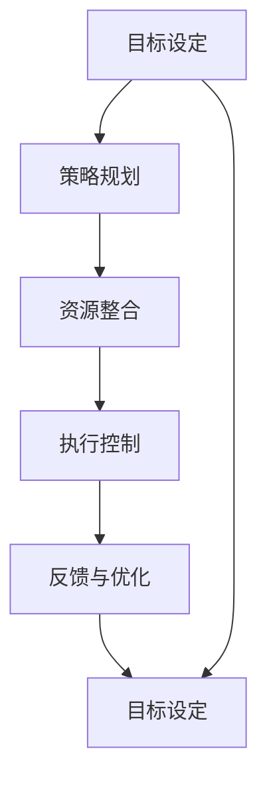

                 

## 1. 背景介绍

在当今快速变化、高度竞争的商业环境中，执行力已成为企业成功的关键因素之一。无论在项目管理、产品开发、市场营销还是客户服务等领域，强大的执行力都能显著提升团队的工作效率和业绩表现。然而，许多组织在推动执行力方面遇到了挑战，特别是在信息技术和自动化普及的背景下。本文将深入探讨行动体系如何提升执行力，通过系统性的方法与技术，帮助企业实现高效的决策和执行过程。

## 2. 核心概念与联系

### 2.1 核心概念概述

行动体系是一个系统性的框架，旨在通过明确目标、设计策略、整合资源和评估反馈，提升组织的执行力。以下是关键概念及其相互联系的概述：

- **目标设定（Goal Setting）**：明确组织的战略目标和执行目标，确保所有行动都围绕核心目标进行。
- **策略规划（Strategy Planning）**：根据目标设计具体的行动策略，确定关键步骤和资源需求。
- **资源整合（Resource Integration）**：整合内部与外部资源，包括人力、财务、技术等，支持策略的实施。
- **执行控制（Execution Control）**：通过项目管理工具、自动化系统和实时监控，确保执行过程按照预定计划进行。
- **反馈与优化（Feedback & Optimization）**：收集执行结果与预期目标的差距，不断优化策略和执行方法，提升未来执行效率。

### 2.2 核心概念原理和架构的 Mermaid 流程图

这个流程图展示了行动体系的关键组成部分及其相互关系。从目标设定开始，通过策略规划和资源整合，进入执行控制阶段，最后通过反馈与优化不断迭代改进，形成闭环。

## 3. 核心算法原理 & 具体操作步骤

### 3.1 算法原理概述

行动体系的核心理论源于项目管理方法论，特别是敏捷方法论和精益管理。这些方法强调通过小步快跑、迭代改进的方式，逐步实现目标。核心算法原理包括：

- **迭代规划**：将大型项目拆分成多个小周期，每个周期内设定明确的目标和交付成果，通过多次迭代逐步逼近最终目标。
- **反馈循环**：通过实时监控和数据反馈，识别执行过程中的偏差和问题，及时进行调整和优化。
- **自动化工具**：利用项目管理软件、协同工具和自动化系统，提升执行效率和质量。

### 3.2 算法步骤详解

以下是一个典型的行动体系执行流程，包含五个关键步骤：

1. **目标设定**：
    - **明确目标**：定义具体、可衡量、可实现的目标，如提高销售额20%、减少客户流失率30%等。
    - **分解目标**：将大目标分解为可管理的子目标，分配到各个部门和团队。

2. **策略规划**：
    - **设计策略**：针对每个子目标，设计具体的行动策略，如市场推广、产品优化、客户服务提升等。
    - **资源评估**：评估策略实施所需的资源，包括人力、财务、技术等。

3. **资源整合**：
    - **资源分配**：根据策略需求，整合内部和外部资源，确保资源配置合理。
    - **工具选择**：选择合适的项目管理工具和自动化系统，支持策略执行。

4. **执行控制**：
    - **任务分配**：将策略分解为具体的执行任务，分配给相应的团队和个人。
    - **进度跟踪**：使用项目管理软件或看板工具，实时监控任务进展，确保按计划进行。
    - **风险管理**：识别潜在风险，制定应对措施，确保执行过程中的稳定性。

5. **反馈与优化**：
    - **数据收集**：收集执行结果与预期目标的差距，包括关键指标的对比分析。
    - **复盘分析**：定期召开复盘会议，总结执行过程中的成功经验和改进点。
    - **持续改进**：根据反馈结果，优化策略和执行方法，提升未来执行效率。

### 3.3 算法优缺点

行动体系的优势在于其系统性和迭代性，能帮助组织在复杂环境中快速调整策略和资源，实现高效的执行。其缺点主要包括：

- **复杂度较高**：行动体系需要详细规划和持续监控，对管理层和技术实现要求较高。
- **灵活性受限**：过度依赖于规划和流程，可能在快速变化的市场环境中显得不够灵活。
- **资源需求高**：需要整合大量资源和工具，初期投入较大。

### 3.4 算法应用领域

行动体系在多个领域都有广泛应用，包括但不限于：

- **项目管理**：通过明确目标、分解任务、实时监控和持续反馈，提升项目执行效率和质量。
- **产品开发**：通过迭代规划和快速验证，快速响应市场需求，提升产品竞争力。
- **市场营销**：通过策略规划和资源整合，优化营销活动，提升客户转化率。
- **客户服务**：通过执行控制和反馈优化，提升客户满意度和服务效率。

## 4. 数学模型和公式 & 详细讲解 & 举例说明

### 4.1 数学模型构建

行动体系的核心目标是通过量化指标和数据驱动决策，确保执行过程的可控性和高效性。数学模型可以从以下几个方面构建：

- **关键指标（KPIs）**：定义与目标相关的关键绩效指标，如销售额、客户满意度、项目完成率等。
- **权重分配**：对不同指标赋予不同权重，反映其对目标的重要程度。
- **进度跟踪**：使用数学模型监控任务进展，确保每个阶段的目标达成。

### 4.2 公式推导过程

以提高销售额为例，我们可以建立以下数学模型：

- **目标函数**：$\maximize \text{Sales Revenue}$
- **约束条件**：$\text{Sales Revenue} = \sum_{i=1}^n \text{Unit Sales}_i \times \text{Unit Price}_i$
- **资源约束**：$\sum_{i=1}^n \text{Unit Sales}_i \leq \text{Total Capacity}$
- **时间约束**：$\text{Time}_i \leq \text{Deadline}$

通过优化上述模型，可以找到最优的销售策略组合，最大化销售收益。

### 4.3 案例分析与讲解

某电商平台为了提升销售额，设定了每月增加销售额10%的目标。通过分解目标，将任务分配到各个部门：市场部负责推广活动，销售部负责产品优化，客服部负责客户满意度提升。

- **市场部**：设计了多种营销策略，如广告投放、社交媒体营销、邮件营销等，每月预算为100万元。通过A/B测试，评估每种策略的效果。
- **销售部**：优化了产品包装、推出新功能，并改善了用户体验。通过用户反馈，持续迭代产品设计。
- **客服部**：通过优化客户服务流程，提升客户满意度。使用自动化工具，实时监控和处理客户投诉。

通过以上步骤，平台在三个月内实现了销售额增长20%的目标。

## 5. 项目实践：代码实例和详细解释说明

### 5.1 开发环境搭建

在进行行动体系实践前，需要准备以下开发环境：

- **项目管理工具**：如JIRA、Trello、Asana等，用于任务分配和进度跟踪。
- **自动化工具**：如Zapier、IFTTT、UiPath等，用于自动化流程和数据收集。
- **数据分析工具**：如Excel、Tableau、Power BI等，用于数据可视化和分析。
- **版本控制工具**：如Git、SVN等，用于代码版本管理和协作。

### 5.2 源代码详细实现

以下是一个基于JIRA和Zapier的行动体系项目示例：

1. **JIRA项目配置**：
    - 创建项目板，定义任务类型和状态。
    - 添加自定义字段，如任务负责人、预算、预计完成时间等。
    - 配置工作流，设定任务转态的触发规则。

2. **Zapier自动化流程**：
    - 创建Zap，连接JIRA和Google Sheets。
    - 设定触发条件，如任务状态变化。
    - 自动将任务数据保存到Google Sheets中，供后续分析使用。

### 5.3 代码解读与分析

JIRA的配置主要涉及项目板和自定义字段的设置，通过界面拖拽即可完成。Zapier则通过API实现数据的自动同步和处理，需要编写一些简单的Python代码或使用Zapier的可视化配置工具。

### 5.4 运行结果展示

以下是JIRA项目板和Google Sheets数据的示例：

- **JIRA项目板**：显示了各个任务的当前状态、负责人和进度。
- **Google Sheets数据**：记录了任务的开始时间、完成时间和实际完成时间，供后续分析和优化。

## 6. 实际应用场景

### 6.1 智能制造

在智能制造领域，行动体系可以帮助企业优化生产流程，提升生产效率和产品质量。通过制定详细的生产计划和资源分配策略，实时监控生产线状态，快速响应设备故障和生产异常，确保生产任务按时完成。

### 6.2 智慧城市

智慧城市建设需要协调多个部门和系统，涉及城市规划、交通管理、环境监测等多个方面。通过行动体系，可以明确各部门的任务和责任，整合各类数据资源，实现高效的协同管理。

### 6.3 医疗健康

在医疗健康领域，行动体系可以帮助医院提升患者护理和医疗服务质量。通过设定明确的医疗流程和护理标准，实时监控和评估医疗服务效果，快速调整和优化服务策略，提升患者满意度。

### 6.4 未来应用展望

随着信息技术的进一步发展，行动体系将在更多领域得到应用，为组织带来更高的执行效率和业绩表现。未来，行动体系将进一步融合人工智能和物联网技术，实现更智能、更高效的执行过程。

## 7. 工具和资源推荐

### 7.1 学习资源推荐

为了帮助开发者系统掌握行动体系的理论基础和实践技巧，以下是一些优质的学习资源：

1. **《敏捷项目管理》**：介绍敏捷方法论的基本概念和实践技巧，适合项目管理领域的从业人员。
2. **《精益管理》**：讲解精益管理的关键原则和工具，提升组织的执行效率。
3. **《行动体系设计与实施》**：详细阐述行动体系的构建方法和应用案例，适合企业决策层和管理层阅读。
4. **Coursera《项目管理基础》课程**：提供系统的项目管理知识，包括规划、执行和监控等多个环节。
5. **Udemy《行动体系与敏捷方法论》课程**：讲解行动体系的核心原理和实际应用，适合各个层级的从业人员。

### 7.2 开发工具推荐

高效的开发离不开优秀的工具支持。以下是几款用于行动体系开发的常用工具：

1. **JIRA**：功能强大的项目管理工具，支持任务分配、进度跟踪和报表生成。
2. **Trello**：简单易用的看板工具，适合小团队和敏捷项目。
3. **Zapier**：强大的自动化工具，支持多种应用的集成，实现流程自动化。
4. **Git**：版本控制工具，支持代码管理和协作。
5. **Tableau**：数据分析工具，提供丰富的数据可视化和分析功能。
6. **Excel**：常用的数据处理工具，适合小型数据集的分析和管理。

### 7.3 相关论文推荐

行动体系的研究涉及多个领域，以下是几篇奠基性的相关论文，推荐阅读：

1. **《敏捷方法论》**：介绍敏捷项目管理的基本原则和实践方法，成为敏捷方法论的经典之作。
2. **《精益管理》**：阐述精益管理的方法论，成为企业管理的重要参考。
3. **《行动体系设计与实施》**：详细讨论行动体系的构建方法和应用案例，成为行动体系研究的重要文献。
4. **《敏捷项目管理在IT领域的实践》**：介绍敏捷方法论在IT领域的实际应用案例，具有很强的实践指导意义。
5. **《精益管理在制造业的应用》**：讲解精益管理在制造业中的应用，提升生产效率和产品质量。

## 8. 总结：未来发展趋势与挑战

### 8.1 研究成果总结

本文对行动体系如何提升执行力进行了全面的探讨，通过明确目标、策略规划、资源整合、执行控制和反馈优化五个关键步骤，系统性地构建了行动体系。通过量化指标和数据驱动决策，确保执行过程的可控性和高效性。

### 8.2 未来发展趋势

展望未来，行动体系将在以下领域得到进一步发展：

1. **智能自动化**：引入人工智能和机器学习技术，提升行动体系的智能化水平，实现更精准的决策和执行。
2. **数据驱动**：通过大数据和实时数据反馈，进一步提升行动体系的执行效率和效果。
3. **跨领域融合**：融合不同领域的最佳实践，提升行动体系的普适性和灵活性。
4. **人机协同**：通过人机协同系统，提升执行过程的智能化和自动化水平。

### 8.3 面临的挑战

尽管行动体系在提升执行力方面取得了显著效果，但仍面临以下挑战：

1. **复杂度管理**：行动体系涉及多个环节和工具，管理复杂度较高，需要系统化的规划和管理。
2. **技术整合**：行动体系需要整合多种技术和工具，初期投入较大。
3. **数据安全**：在数据驱动的行动体系中，数据安全问题不容忽视，需要建立有效的数据保护机制。
4. **文化转变**：推动行动体系需要组织文化上的变革，需要时间和管理层的支持。

### 8.4 研究展望

未来，行动体系的研究需要在以下几个方面进一步深化：

1. **技术创新**：引入新的技术和方法，提升行动体系的执行效率和效果。
2. **文化融合**：通过培训和宣传，提升员工对行动体系的认同和接受度。
3. **国际化应用**：将行动体系推广到国际市场，提升全球执行力。

通过不断优化和创新，行动体系必将在更多领域发挥更大的作用，提升组织和个人的执行力，推动企业和社会的发展。

## 9. 附录：常见问题与解答

**Q1：行动体系如何与敏捷方法论结合？**

A: 行动体系和敏捷方法论有很强的互补性。行动体系强调系统性的目标设定和执行控制，而敏捷方法论注重快速迭代和灵活调整。结合两者的优点，可以提升组织的执行效率和响应能力。

**Q2：行动体系如何适应快速变化的市场环境？**

A: 行动体系通过实时监控和反馈优化，可以快速识别市场变化并调整策略。通过设定多个快速迭代周期，保持策略的灵活性和敏捷性，适应市场变化。

**Q3：行动体系对资源的需求是否过高？**

A: 行动体系需要整合大量资源，但通过合理的资源规划和利用，可以实现高效的资源配置。同时，利用自动化工具和项目管理软件，可以降低人工投入和管理成本。

**Q4：行动体系是否适用于创新驱动的企业？**

A: 行动体系强调系统性的目标设定和执行控制，适合具有明确战略目标和执行计划的企业。对于创新驱动的企业，可以在行动体系的基础上，引入更灵活的创新机制和激励机制。

**Q5：行动体系是否可以与远程工作相结合？**

A: 行动体系可以通过项目管理工具和自动化系统，支持远程团队的工作协作和执行监控。通过设定明确的任务和目标，远程团队可以高效协同，提升执行力。

通过深入探索行动体系的理论和实践，企业可以更好地提升执行力，应对市场变化，实现持续发展和创新。

