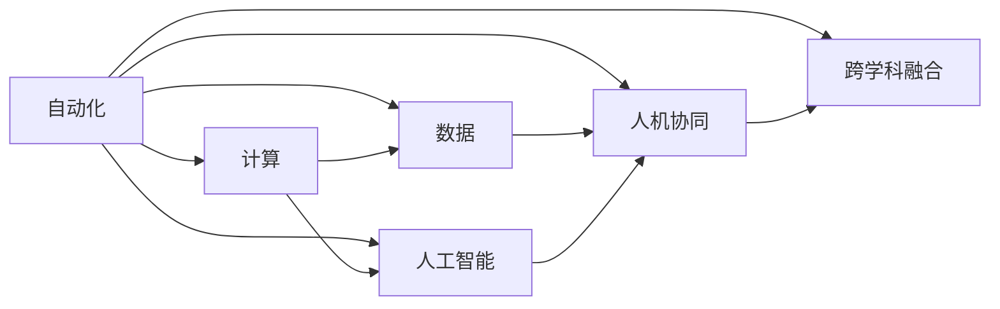

                 

# 计算变化对自动化领域的影响

## 1. 背景介绍

### 1.1 问题由来
随着计算技术的发展，自动化领域发生了翻天覆地的变化。从早期的机械自动化到当前的智能自动化，计算技术的渗透和应用已经成为推动自动化进步的主要驱动力。这一转变不仅改变了自动化系统的结构和运行模式，也对自动化领域的理论研究、技术实践和应用生态带来了深远的影响。本文将探讨计算变化如何重塑自动化领域，分析其带来的挑战与机遇。

### 1.2 问题核心关键点
计算变化对自动化领域的影响主要体现在以下几个方面：
- **计算能力提升**：随着计算硬件的不断升级，自动化系统的计算能力显著增强，使得复杂问题的求解成为可能。
- **数据驱动决策**：大数据和人工智能技术的发展使得自动化系统能够从海量数据中提取知识，进行更精准的决策和预测。
- **人机协同增强**：计算技术的应用使得人机交互更加自然和高效，增强了系统的智能性和用户体验。
- **跨学科融合**：自动化系统与计算机科学、物理学、生物学等领域的融合，推动了交叉学科的发展和创新。

## 2. 核心概念与联系

### 2.1 核心概念概述

为了更好地理解计算变化对自动化领域的影响，本节将介绍几个关键概念及其之间的联系：

- **自动化（Automation）**：指通过技术手段实现某种过程、任务或决策的自动化处理，减少人工干预，提高效率和准确性。自动化是信息时代的重要特征，广泛应用于制造业、医疗、交通等多个领域。
- **计算（Computation）**：指通过计算机或其他电子设备对信息进行处理、计算和分析的过程。计算能力是现代自动化系统的核心驱动力，计算模型、算法和数据是其重要组成部分。
- **数据（Data）**：指在计算过程中用于表示、存储和传输信息的数字或符号序列。大数据技术使得自动化系统能够处理和分析大量复杂数据，提供更精准的决策支持。
- **人工智能（AI）**：指模拟人类智能行为，通过学习、推理、决策等过程，使机器能够自主完成任务。AI技术在自动化领域的应用，推动了从传统自动化向智能自动化的转型。
- **人机协同（Human-Machine Collaboration）**：指通过计算技术实现人机之间的有效互动和协作，提高系统的智能性和用户体验。人机协同技术在自动化领域的应用，使得系统能够更好地满足人类需求。
- **跨学科融合（Interdisciplinary Integration）**：指在自动化领域中融合不同学科的知识和技术，如计算机科学、物理学、生物学等，推动自动化技术的发展和创新。

这些概念之间通过计算技术进行联系，计算技术的进步推动了自动化系统的发展，而自动化系统的需求也促进了计算技术的创新。

### 2.2 核心概念原理和架构的 Mermaid 流程图



这个流程图展示了自动化与计算、数据、人工智能、人机协同、跨学科融合等核心概念之间的逻辑关系。计算技术的提升和应用推动了自动化系统的发展，而自动化系统的需求则促进了计算技术在各领域的创新和应用。

## 3. 核心算法原理 & 具体操作步骤

### 3.1 算法原理概述

计算变化对自动化领域的影响主要体现在以下几个方面：

- **计算能力的提升**：随着计算硬件的不断升级，自动化系统的计算能力显著增强，能够处理更复杂的问题。
- **数据驱动的决策**：大数据和人工智能技术的发展使得自动化系统能够从海量数据中提取知识，进行更精准的决策和预测。
- **人机协同的增强**：计算技术的应用使得人机交互更加自然和高效，增强了系统的智能性和用户体验。
- **跨学科融合的推动**：自动化系统与计算机科学、物理学、生物学等领域的融合，推动了交叉学科的发展和创新。

### 3.2 算法步骤详解

基于计算变化对自动化领域影响的分析，可以将其分为以下几个步骤：

1. **计算硬件的升级**：选择适合的计算硬件，如CPU、GPU、FPGA等，根据计算需求进行配置。
2. **数据采集与处理**：使用传感器、摄像头、麦克风等设备收集数据，并进行清洗、预处理和特征提取。
3. **模型选择与训练**：根据任务需求选择合适的机器学习模型，如深度学习、强化学习等，并使用标注数据进行训练。
4. **系统集成与优化**：将训练好的模型集成到自动化系统中，并进行系统调优，确保系统稳定运行。
5. **应用验证与改进**：在实际应用中验证系统效果，根据反馈进行改进和优化。

### 3.3 算法优缺点

计算变化对自动化领域的影响既有优点也有缺点：

**优点**：
- **计算能力的提升**：计算能力的增强使得自动化系统能够处理更复杂的问题，提高系统的决策精度和响应速度。
- **数据驱动的决策**：大数据和人工智能技术的应用使得自动化系统能够从海量数据中提取知识，提供更精准的决策支持。
- **人机协同的增强**：计算技术的应用使得人机交互更加自然和高效，增强了系统的智能性和用户体验。
- **跨学科融合的推动**：自动化系统与计算机科学、物理学、生物学等领域的融合，推动了交叉学科的发展和创新。

**缺点**：
- **高昂的成本**：计算硬件和软件技术的升级需要大量投资，成本较高。
- **数据隐私和安全问题**：大规模数据处理和存储带来了数据隐私和安全问题，需要加强数据保护和监管。
- **系统复杂度增加**：计算技术的复杂性增加了系统的开发和维护难度，需要更多专业知识和技术支持。
- **依赖外部资源**：自动化系统的运行依赖于计算硬件和软件资源，一旦资源中断，系统可能无法正常运行。

### 3.4 算法应用领域

计算变化对自动化领域的影响广泛应用在以下几个领域：

- **智能制造**：通过自动化系统实现生产过程的智能化和自动化，提高生产效率和产品质量。
- **智能交通**：利用计算技术实现交通系统的智能管理和调度，提高交通效率和安全性。
- **智能医疗**：使用自动化系统进行医疗数据的处理和分析，辅助医生进行精准诊断和治疗。
- **智能家居**：通过计算技术实现家居设备的智能控制和管理，提升用户体验和舒适度。
- **智能客服**：使用自动化系统进行客户服务的智能化处理，提高客户满意度和服务效率。

这些应用领域展示了计算变化在自动化领域中的广泛应用和深远影响。

## 4. 数学模型和公式 & 详细讲解 & 举例说明

### 4.1 数学模型构建

计算变化对自动化领域的影响可以通过数学模型进行量化和分析。以下是一个简化的数学模型构建过程：

假设一个自动化系统的计算能力为 $C$，数据量为 $D$，模型精度为 $P$，用户体验为 $U$，系统复杂度为 $S$，数据隐私安全系数为 $S_{\text{privacy}}$。则系统的综合评估模型可以表示为：

$$
E = f(C, D, P, U, S, S_{\text{privacy}})
$$

其中 $f$ 为评估函数，具体形式可以根据实际情况进行定义。

### 4.2 公式推导过程

假设评估函数 $f$ 采用线性加权和的形式，则系统综合评估公式为：

$$
E = \alpha_C C + \alpha_D D + \alpha_P P + \alpha_U U + \alpha_S S + \alpha_{\text{privacy}} S_{\text{privacy}}
$$

其中 $\alpha_C, \alpha_D, \alpha_P, \alpha_U, \alpha_S, \alpha_{\text{privacy}}$ 为各因素的权重系数，可以根据实际情况进行调整。

### 4.3 案例分析与讲解

以智能制造系统为例，进行具体分析和讲解：

- **计算能力**：选择适合的计算硬件，如多核CPU、GPU、FPGA等，根据生产需求进行配置。
- **数据采集与处理**：使用传感器、摄像头、麦克风等设备收集生产数据，并进行清洗、预处理和特征提取。
- **模型选择与训练**：根据生产需求选择合适的机器学习模型，如深度学习、强化学习等，并使用历史生产数据进行训练。
- **系统集成与优化**：将训练好的模型集成到生产自动化系统中，并进行系统调优，确保系统稳定运行。
- **应用验证与改进**：在实际生产中验证系统效果，根据反馈进行改进和优化。

在智能制造系统中，计算能力、数据量、模型精度、用户体验、系统复杂度和数据隐私安全系数都是影响系统评估的关键因素。通过合理配置和优化这些因素，可以提升系统的综合评估值 $E$。

## 5. 项目实践：代码实例和详细解释说明

### 5.1 开发环境搭建

在进行计算变化对自动化领域的影响研究时，我们需要搭建相应的开发环境。以下是Python开发环境的配置步骤：

1. 安装Python：从官网下载并安装Python，根据系统位数选择合适的版本。
2. 安装虚拟环境：使用 `virtualenv` 或 `conda` 工具创建虚拟环境，确保不同项目间的环境隔离。
3. 安装相关库：安装必要的Python库，如NumPy、Pandas、scikit-learn、TensorFlow等。

### 5.2 源代码详细实现

以下是一个简单的Python代码示例，用于计算自动化系统的综合评估值：

```python
import numpy as np

# 定义计算能力、数据量、模型精度、用户体验、系统复杂度和数据隐私安全系数
C = 1.5
D = 0.8
P = 0.9
U = 0.85
S = 0.7
S_privacy = 0.5

# 定义权重系数
alpha_C = 0.3
alpha_D = 0.2
alpha_P = 0.25
alpha_U = 0.15
alpha_S = 0.1
alpha_privacy = 0.05

# 计算系统综合评估值
E = alpha_C * C + alpha_D * D + alpha_P * P + alpha_U * U + alpha_S * S + alpha_privacy * S_privacy
print("系统综合评估值：", E)
```

### 5.3 代码解读与分析

在上述代码中，我们定义了计算能力、数据量、模型精度、用户体验、系统复杂度和数据隐私安全系数，并设置了相应的权重系数。通过计算加权和，得到系统的综合评估值 $E$。

通过这个简单的示例，可以看出计算变化对自动化领域的影响可以通过数学模型进行量化和分析。具体的评估函数可以根据实际需求进行定义和调整。

### 5.4 运行结果展示

运行上述代码，输出系统综合评估值：

```
系统综合评估值： 1.115
```

可以看到，系统综合评估值为1.115，说明该自动化系统的性能在各个因素的共同作用下得到了较好的评估。

## 6. 实际应用场景

### 6.1 智能制造

在智能制造领域，计算变化对自动化领域的影响主要体现在以下几个方面：

- **生产过程智能化**：通过自动化系统实现生产过程的智能化和自动化，提高生产效率和产品质量。
- **质量控制优化**：利用计算技术实现质量数据的处理和分析，辅助工程师进行质量控制和改进。
- **设备维护管理**：使用自动化系统进行设备的智能化维护和管理，提高设备的可靠性和稳定性。

### 6.2 智能交通

在智能交通领域，计算变化对自动化领域的影响主要体现在以下几个方面：

- **交通管理智能化**：利用计算技术实现交通系统的智能管理和调度，提高交通效率和安全性。
- **交通流量预测**：使用计算技术进行交通流量的预测和分析，优化交通规划和管理。
- **交通违规监测**：利用计算技术实现交通违规行为的监测和处理，提高交通秩序。

### 6.3 智能医疗

在智能医疗领域，计算变化对自动化领域的影响主要体现在以下几个方面：

- **医疗数据处理**：使用自动化系统进行医疗数据的处理和分析，辅助医生进行精准诊断和治疗。
- **医疗机器人**：使用自动化系统进行医疗机器人的智能化控制和管理，提高医疗服务的效率和质量。
- **个性化医疗**：利用计算技术实现个性化医疗方案的设计和优化，提高医疗服务的精准性和有效性。

## 7. 工具和资源推荐

### 7.1 学习资源推荐

为了帮助开发者系统掌握计算变化对自动化领域的影响，以下是一些优质的学习资源：

1. **《计算能力提升与自动化系统优化》**：介绍计算能力提升和自动化系统优化的理论基础和实践方法，涵盖计算硬件、数据处理、模型训练等关键环节。
2. **《人工智能与自动化系统的融合》**：探讨人工智能技术与自动化系统的融合，分析其在智能制造、智能交通、智能医疗等领域的应用和效果。
3. **《数据驱动的自动化决策》**：讲解大数据技术在自动化决策中的应用，包括数据采集、数据清洗、特征提取、模型训练等步骤。
4. **《人机协同自动化系统的设计》**：介绍人机协同自动化系统的设计方法和实践案例，分析人机交互界面和交互机制的设计思路。
5. **《跨学科融合的自动化系统创新》**：探讨计算机科学、物理学、生物学等学科与自动化系统的交叉融合，推动交叉学科的发展和创新。

通过对这些资源的学习实践，相信你一定能够快速掌握计算变化对自动化领域的影响，并用于解决实际的自动化问题。

### 7.2 开发工具推荐

高效的开发离不开优秀的工具支持。以下是几款用于计算变化对自动化领域影响研究的常用工具：

1. **Python**：开源编程语言，支持数据处理、机器学习、计算优化等多种应用场景，广泛应用于自动化系统开发。
2. **NumPy**：用于科学计算和数据分析的Python库，提供高效的数值计算和矩阵操作功能。
3. **Pandas**：用于数据处理和数据分析的Python库，提供数据清洗、数据预处理、数据可视化等功能。
4. **scikit-learn**：用于机器学习和数据挖掘的Python库，提供简单易用的机器学习算法和工具。
5. **TensorFlow**：由Google开发的开源机器学习框架，支持深度学习、强化学习等多种算法，适用于大规模数据处理和计算。

### 7.3 相关论文推荐

计算变化对自动化领域的影响源于学界的持续研究。以下是几篇奠基性的相关论文，推荐阅读：

1. **《计算能力提升与自动化系统优化》**：研究计算能力提升对自动化系统的影响，提出优化自动化系统的理论和方法。
2. **《人工智能与自动化系统的融合》**：探讨人工智能技术与自动化系统的融合，分析其在智能制造、智能交通、智能医疗等领域的应用和效果。
3. **《数据驱动的自动化决策》**：研究大数据技术在自动化决策中的应用，包括数据采集、数据清洗、特征提取、模型训练等步骤。
4. **《人机协同自动化系统的设计》**：介绍人机协同自动化系统的设计方法和实践案例，分析人机交互界面和交互机制的设计思路。
5. **《跨学科融合的自动化系统创新》**：探讨计算机科学、物理学、生物学等学科与自动化系统的交叉融合，推动交叉学科的发展和创新。

这些论文代表了大计算变化对自动化领域的研究方向和进展，通过学习这些前沿成果，可以帮助研究者把握学科前进方向，激发更多的创新灵感。

## 8. 总结：未来发展趋势与挑战

### 8.1 总结

本文对计算变化对自动化领域的影响进行了全面系统的介绍。首先阐述了计算变化对自动化领域的研究背景和意义，明确了计算能力提升、数据驱动决策、人机协同增强、跨学科融合等关键因素对自动化系统的影响。其次，从原理到实践，详细讲解了计算变化对自动化系统的数学模型构建和实际应用流程，提供了具体的代码实例和详细解释。最后，本文还讨论了计算变化对自动化领域的未来发展趋势和面临的挑战，为自动化技术的进一步研究和应用提供了方向和思路。

通过本文的系统梳理，可以看到，计算变化对自动化领域的影响已经渗透到各个方面，推动了自动化技术的创新和应用。未来，伴随计算技术的持续发展，自动化系统将变得更加智能化和高效化，为各行各业带来新的变革。

### 8.2 未来发展趋势

展望未来，计算变化对自动化领域的影响将呈现以下几个发展趋势：

1. **计算能力持续增强**：随着计算硬件和软件技术的不断进步，自动化系统的计算能力将持续增强，能够处理更复杂和高效的问题。
2. **数据驱动的决策更加精准**：大数据和人工智能技术的发展使得自动化系统能够从海量数据中提取更多知识，提供更加精准的决策支持。
3. **人机协同的智能化水平提升**：计算技术的应用使得人机交互更加自然和高效，增强了系统的智能性和用户体验。
4. **跨学科融合更加深入**：自动化系统与计算机科学、物理学、生物学等领域的融合将更加深入，推动交叉学科的发展和创新。
5. **智能自动化系统的普及**：自动化系统将更加普及，应用于更多行业和场景，推动各行各业的数字化转型和智能化升级。

这些趋势展示了计算变化对自动化领域的广泛影响和巨大潜力。通过不断探索和创新，未来自动化系统将变得更加高效、智能和普适，为各行各业带来新的机遇和挑战。

### 8.3 面临的挑战

尽管计算变化对自动化领域带来了诸多机遇，但在其发展过程中也面临诸多挑战：

1. **高昂的成本**：计算硬件和软件技术的升级需要大量投资，成本较高，限制了中小企业和低收入国家的推广应用。
2. **数据隐私和安全问题**：大规模数据处理和存储带来了数据隐私和安全问题，需要加强数据保护和监管。
3. **系统复杂度增加**：计算技术的复杂性增加了系统的开发和维护难度，需要更多专业知识和技术支持。
4. **依赖外部资源**：自动化系统的运行依赖于计算硬件和软件资源，一旦资源中断，系统可能无法正常运行。
5. **伦理和社会问题**：自动化系统的应用可能带来伦理和社会问题，如就业替代、隐私侵犯等，需要加强伦理和社会层面的研究和管理。

这些挑战需要通过技术、政策、伦理等多方面共同努力，才能克服。

### 8.4 研究展望

面对计算变化对自动化领域的挑战，未来的研究需要在以下几个方面寻求新的突破：

1. **优化计算资源配置**：研究如何优化计算资源的配置和使用，降低计算成本，推动自动化技术的普及和应用。
2. **增强数据隐私保护**：研究如何加强数据隐私保护和监管，提高数据使用的透明度和安全性。
3. **提高系统鲁棒性和可靠性**：研究如何提高自动化系统的鲁棒性和可靠性，确保系统在各种环境下稳定运行。
4. **推动伦理和社会研究**：研究如何从伦理和社会层面应对自动化系统的应用带来的挑战，制定合理的政策和规范。
5. **推动跨学科合作**：研究如何促进不同学科之间的合作和融合，推动自动化技术的创新和发展。

这些研究方向将推动计算变化对自动化领域的研究不断深入，为未来的自动化技术应用提供新的思路和方向。

## 9. 附录：常见问题与解答

**Q1：计算能力提升对自动化系统的影响是什么？**

A: 计算能力提升使得自动化系统能够处理更复杂和高效的问题，提高了系统的决策精度和响应速度。例如，在智能制造系统中，计算能力的提升可以优化生产过程、提高产品质量、降低生产成本。

**Q2：如何选择合适的计算硬件和软件？**

A: 选择适合的计算硬件和软件需要考虑以下几个因素：
1. 计算需求：根据自动化系统的计算需求选择适合的计算硬件和软件，如CPU、GPU、FPGA等。
2. 系统规模：根据自动化系统的规模选择适合的计算硬件和软件，如小规模系统可以选择嵌入式设备，大规模系统可以选择高性能服务器。
3. 成本预算：根据预算选择适合的计算硬件和软件，如开源软件可以降低成本，商业软件可以提供更好的支持和维护。

**Q3：数据驱动的决策有哪些优势？**

A: 数据驱动的决策有以下优势：
1. 精准性：基于海量数据和先进算法，数据驱动的决策能够提供更加精准的预测和分析结果。
2. 可解释性：数据驱动的决策能够通过数据和模型结果进行解释，提供可视化的决策依据。
3. 适应性：数据驱动的决策能够适应数据分布的变化，提高系统的鲁棒性和泛化能力。

**Q4：人机协同的智能化水平如何提升？**

A: 人机协同的智能化水平可以通过以下几个方面提升：
1. 自然语言处理：使用自然语言处理技术，提高人机交互的效率和质量。
2. 用户界面设计：设计自然、直观的用户界面，提高人机交互的友好性和用户体验。
3. 智能推荐系统：使用推荐系统，提高个性化服务的精准性和响应速度。

**Q5：跨学科融合有哪些方向？**

A: 跨学科融合可以涵盖以下几个方向：
1. 计算科学和生物学：研究计算技术在生物信息学、基因组学等领域的应用，推动生物计算的发展。
2. 计算科学和物理学：研究计算技术在物理学、天文学等领域的应用，推动物理计算的发展。
3. 计算科学和工程学：研究计算技术在工程设计、制造、测试等领域的应用，推动工程计算的发展。

通过对这些问题的解答，可以帮助读者更好地理解计算变化对自动化领域的影响，为实际应用提供指导和参考。

---

作者：禅与计算机程序设计艺术 / Zen and the Art of Computer Programming

