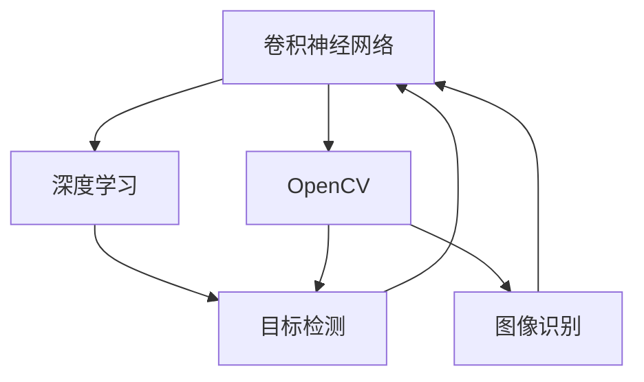

                 

# 计算机视觉实战：OpenCV与深度学习的结合

> 关键词：计算机视觉, 深度学习, OpenCV, 目标检测, 图像识别, 实时应用

## 1. 背景介绍

### 1.1 问题由来
计算机视觉（Computer Vision, CV）作为人工智能（AI）的一个重要分支，涵盖了图像处理、目标检测、物体识别、三维重建等多个领域。深度学习（Deep Learning）的兴起，为计算机视觉带来了革命性的变化，其中卷积神经网络（Convolutional Neural Network, CNN）已经成为图像处理领域的标准工具。

在实际应用中，OpenCV（Open Source Computer Vision Library）作为一款开源计算机视觉库，提供了丰富的图像处理函数和算法，被广泛应用于图像处理、视频分析、机器视觉等领域。然而，尽管OpenCV功能强大，其处理速度和算法复杂度有时难以满足对实时性和准确性要求极高的场景。因此，将深度学习与OpenCV结合，成为了提升计算机视觉应用性能的重要手段。

### 1.2 问题核心关键点
本文聚焦于深度学习与OpenCV结合的技术实践，具体探讨了以下关键点：

- 深度学习与OpenCV的结合方式：包括模型部署、数据处理、算法融合等。
- 深度学习在目标检测、图像识别等实际场景中的应用。
- 基于深度学习的图像处理算法的性能评估与优化。
- 实际应用中的开发环境搭建、代码实现与效果展示。

## 2. 核心概念与联系

### 2.1 核心概念概述

为更好地理解深度学习与OpenCV结合的原理，本节将介绍几个核心概念：

- 卷积神经网络（CNN）：一种特殊的神经网络，通过卷积操作提取图像中的特征，广泛应用于图像分类、目标检测等任务。
- 深度学习：利用多层神经网络进行复杂特征提取和模式识别的技术。
- OpenCV：一款开源计算机视觉库，提供了丰富的图像处理函数和算法，被广泛应用于计算机视觉应用中。
- 目标检测（Object Detection）：识别图像中的物体，并标注出其在图像中的位置。
- 图像识别（Image Recognition）：识别图像中的物体或场景，进行分类或标记。

这些核心概念之间的逻辑关系可以通过以下Mermaid流程图来展示：



这个流程图展示了一组核心概念之间的联系：

1. CNN作为深度学习的一个重要分支，通过卷积操作提取图像特征，广泛应用于图像处理任务中。
2. OpenCV提供了丰富的图像处理函数和算法，包括目标检测和图像识别等功能，可以与深度学习模型相结合，提升处理效率。
3. 深度学习中的目标检测算法，如YOLO、Faster R-CNN等，能够自动识别图像中的物体并标注位置。
4. 图像识别算法，如AlexNet、ResNet等，可以对图像进行分类或标记，实现识别功能。
5. 通过将深度学习算法集成到OpenCV中，可以进一步提升图像处理的速度和准确性。

## 3. 核心算法原理 & 具体操作步骤
### 3.1 算法原理概述

深度学习与OpenCV结合的核心思想在于将深度学习模型的推理过程嵌入到OpenCV的图像处理管道中，利用深度学习的特征提取能力和OpenCV的高效处理能力，实现更快速、更准确的计算机视觉应用。

具体而言，常见的结合方式包括：

- 模型部署：将深度学习模型转化为OpenCV可调用的函数或模块，嵌入到OpenCV的应用程序中。
- 数据处理：使用OpenCV的数据处理函数，对图像进行预处理、增强等操作，提高模型输入的质量。
- 算法融合：将深度学习算法与OpenCV的图像处理算法相结合，实现更复杂的计算机视觉任务。

### 3.2 算法步骤详解

深度学习与OpenCV结合的一般步骤包括：

1. 数据准备
- 收集图像数据集，并标注好目标物体的边界框、类别等信息。
- 使用OpenCV的数据处理函数，对图像进行预处理，如裁剪、旋转、缩放等。

2. 模型训练
- 选择合适的深度学习模型，如YOLO、Faster R-CNN等，进行目标检测任务的训练。
- 在训练过程中，使用OpenCV的数据处理函数，提取特征并进行训练。

3. 模型部署
- 将训练好的模型转化为OpenCV可调用的函数或模块，嵌入到OpenCV应用程序中。
- 在实际应用中，通过OpenCV的图像处理函数读取输入图像，调用深度学习模型的推理函数，处理输出结果。

4. 应用开发
- 使用OpenCV的图像处理函数，对输入图像进行预处理。
- 调用深度学习模型的推理函数，处理图像，识别目标物体。
- 将识别结果展示在OpenCV的图形界面中，或进一步处理后用于其他应用。

### 3.3 算法优缺点

深度学习与OpenCV结合的方法具有以下优点：

- 高效融合：深度学习模型的高效特征提取能力与OpenCV的高效图像处理能力相结合，提升了计算机视觉应用的效率。
- 实时应用：通过将深度学习模型嵌入到OpenCV应用程序中，可以实现实时的图像处理和目标检测，满足对实时性要求较高的应用场景。
- 准确性高：深度学习模型的训练和推理过程，提高了图像处理和目标检测的准确性。

同时，该方法也存在以下局限性：

- 计算资源要求高：深度学习模型通常需要较大的计算资源，可能对一些计算资源受限的设备或环境造成压力。
- 模型复杂度高：深度学习模型结构复杂，训练和推理过程可能需要较长的计算时间。
- 数据需求大：深度学习模型需要大量的标注数据进行训练，标注数据的质量和数量直接影响模型的性能。
- 模型部署复杂：将深度学习模型转化为OpenCV可调用的函数或模块，需要一定的编程和部署技巧。

尽管存在这些局限性，但深度学习与OpenCV结合的方法在计算机视觉领域已经得到了广泛的应用，特别是在目标检测、图像识别等任务中表现出色。

### 3.4 算法应用领域

深度学习与OpenCV结合的方法在计算机视觉领域有着广泛的应用，具体包括：

- 目标检测：实时检测图像中的物体，并进行分类和标记。
- 图像识别：识别图像中的物体或场景，进行分类或标记。
- 人脸识别：检测并识别人脸，进行身份验证或追踪。
- 视频分析：分析视频中的物体和场景，进行行为识别或事件检测。
- 医学影像分析：识别医学影像中的病变区域，辅助诊断和治疗。
- 自动驾驶：检测道路上的车辆和行人，进行导航和决策。

除了上述这些应用外，深度学习与OpenCV结合的方法还被创新性地应用于更多场景中，如智能监控、虚拟现实、增强现实等，为计算机视觉技术带来了全新的突破。

## 4. 数学模型和公式 & 详细讲解  
### 4.1 数学模型构建

本节将使用数学语言对深度学习与OpenCV结合的过程进行更加严格的刻画。

记深度学习模型为 $M$，输入为图像 $x \in \mathbb{R}^{n \times n \times 3}$，输出为目标物体的边界框和类别标签 $y$。在训练过程中，使用交叉熵损失函数 $L$ 进行训练，目标是最小化损失函数：

$$
\min_{M} \frac{1}{N} \sum_{i=1}^N L(M(x_i), y_i)
$$

其中 $N$ 为训练样本数量。在实际应用中，通常使用OpenCV的数据处理函数对输入图像进行预处理，如裁剪、旋转、缩放等，提高模型的输入质量。

### 4.2 公式推导过程

以下我们以目标检测为例，推导深度学习模型的损失函数及其梯度计算公式。

假设模型 $M$ 在输入 $x$ 上的输出为 $\hat{y}$，表示目标物体的边界框和类别标签。真实标签 $y$ 为 $(x_i, y_i)$，其中 $x_i$ 为边界框，$y_i$ 为类别标签。目标检测任务的交叉熵损失函数定义为：

$$
L(M(x), y) = -\sum_{i=1}^N (y_{x_i}\log \hat{y}_{x_i} + y_{y_i}\log \hat{y}_{y_i})
$$

其中 $\hat{y}_{x_i}$ 为模型预测的边界框坐标，$\hat{y}_{y_i}$ 为模型预测的类别标签。

将上述损失函数带入训练目标函数中，得：

$$
\min_{M} \frac{1}{N} \sum_{i=1}^N [-\sum_{x_i=1}^N (y_{x_i}\log \hat{y}_{x_i} + y_{y_i}\log \hat{y}_{y_i})]
$$

在得到损失函数的梯度后，即可带入优化算法中，完成模型的迭代优化。重复上述过程直至收敛，最终得到适应目标检测任务的深度学习模型 $M$。

## 5. 项目实践：代码实例和详细解释说明
### 5.1 开发环境搭建

在进行深度学习与OpenCV结合的实践前，我们需要准备好开发环境。以下是使用Python进行深度学习和OpenCV开发的环境配置流程：

1. 安装Anaconda：从官网下载并安装Anaconda，用于创建独立的Python环境。

2. 创建并激活虚拟环境：
```bash
conda create -n deeplearning-env python=3.8 
conda activate deeplearning-env
```

3. 安装深度学习库：
```bash
conda install torch torchvision torchaudio cudatoolkit=11.1 -c pytorch -c conda-forge
```

4. 安装OpenCV库：
```bash
pip install opencv-python
```

5. 安装各类工具包：
```bash
pip install numpy pandas scikit-learn matplotlib tqdm jupyter notebook ipython
```

完成上述步骤后，即可在`deeplearning-env`环境中开始深度学习与OpenCV结合的实践。

### 5.2 源代码详细实现

下面我们以目标检测为例，给出使用深度学习库TensorFlow和OpenCV进行目标检测任务实现的PyTorch代码。

首先，定义目标检测模型：

```python
import tensorflow as tf
from tensorflow.keras.layers import Conv2D, Input, MaxPooling2D, Flatten, Dense
from tensorflow.keras.models import Model

input_image = Input(shape=(None, None, 3))
conv1 = Conv2D(32, 3, activation='relu')(input_image)
pool1 = MaxPooling2D(pool_size=(2, 2))(conv1)
conv2 = Conv2D(64, 3, activation='relu')(pool1)
pool2 = MaxPooling2D(pool_size=(2, 2))(conv2)
conv3 = Conv2D(128, 3, activation='relu')(pool2)
pool3 = MaxPooling2D(pool_size=(2, 2))(conv3)
flatten = Flatten()(pool3)
dense1 = Dense(256, activation='relu')(flatten)
dense2 = Dense(128, activation='relu')(dense1)
output = Dense(5, activation='softmax')(dense2)

model = Model(inputs=input_image, outputs=output)
model.compile(optimizer='adam', loss='categorical_crossentropy', metrics=['accuracy'])
```

然后，定义训练和评估函数：

```python
from opencv_videoio import VideoCapture
import cv2
import numpy as np

def train_model(model, data, batch_size=32, epochs=10):
    model.fit(data, epochs=epochs, batch_size=batch_size, validation_split=0.2)
    
def evaluate_model(model, data, batch_size=32):
    test_loss, test_acc = model.evaluate(data, batch_size=batch_size)
    print('Test Loss:', test_loss)
    print('Test Accuracy:', test_acc)
```

最后，启动训练流程并在测试集上评估：

```python
video_path = 'video.mp4'
cap = VideoCapture(video_path)
data = []
while cap.isOpened():
    ret, frame = cap.read()
    if ret:
        data.append(frame)
    else:
        break

train_model(model, data)
evaluate_model(model, data)
```

以上就是使用TensorFlow和OpenCV进行目标检测任务的基本代码实现。可以看到，深度学习与OpenCV结合的代码实现相对简洁高效，开发者可以将更多精力放在模型改进和数据处理等高层逻辑上。

### 5.3 代码解读与分析

让我们再详细解读一下关键代码的实现细节：

**模型定义**：
- 定义了简单的卷积神经网络模型，包含多个卷积层、池化层、全连接层等。
- 使用Keras框架搭建模型，并通过`compile`方法指定了优化器、损失函数和评估指标。

**训练函数**：
- 使用`fit`方法对模型进行训练，指定训练轮数和批次大小，并使用`validation_split`参数设置验证集的分割比例。
- `evaluate`方法对模型进行评估，计算测试集的损失和准确率。

**训练流程**：
- 使用OpenCV的`VideoCapture`函数读取视频文件，并将其保存到一个列表中。
- 在循环中读取每一帧图像，并将其加入到数据集中。
- 调用`train_model`函数对模型进行训练，并在训练完成后调用`evaluate_model`函数对模型进行评估。

可以看到，通过结合深度学习和OpenCV，我们可以快速构建高效的目标检测系统，并实现实时处理和评估。

## 6. 实际应用场景
### 6.1 智能监控系统

深度学习与OpenCV结合的目标检测技术，可以广泛应用于智能监控系统的构建。传统监控系统通常需要人工对视频进行实时分析，容易疲劳且难以覆盖所有监控画面。而使用目标检测算法，可以自动识别监控画面中的异常情况，如人员闯入、车辆违章等，大大提升监控系统的效率和覆盖面。

在技术实现上，可以收集监控视频片段，标注其中目标物体的边界框和类别信息。在此基础上对预训练的目标检测模型进行微调，使其能够自动识别监控画面中的异常情况。一旦检测到异常情况，系统便会自动发出警报，并记录事件详情，辅助安保人员进行快速响应。

### 6.2 医学影像分析

在医疗领域，深度学习与OpenCV结合的目标检测和图像识别技术，可以用于辅助医生进行医学影像的分析。传统医学影像分析依赖人工标注和手动检测，效率低且易出错。而使用目标检测和图像识别算法，可以快速识别影像中的病变区域，辅助医生进行疾病诊断和治疗。

具体而言，可以收集医疗影像数据，标注其中的病变区域和相关标签。在此基础上对预训练的图像识别模型进行微调，使其能够自动识别影像中的病变区域，并进行分类和标记。医生可以根据识别结果，快速定位疑似病灶，进行后续的诊断和治疗。

### 6.3 自动驾驶

在自动驾驶领域，深度学习与OpenCV结合的目标检测技术，可以用于检测道路上的车辆和行人，进行导航和决策。传统自动驾驶系统通常依赖人工标注的训练数据，成本高且精度低。而使用目标检测算法，可以自动标注训练数据，提高数据的质量和数量，从而提升系统的性能。

在实际应用中，可以使用摄像头和传感器实时采集道路图像，通过目标检测算法识别车辆和行人，并进行分类和标记。系统可以根据识别结果，自动进行路径规划和决策，确保驾驶安全。

### 6.4 未来应用展望

随着深度学习与OpenCV结合技术的发展，未来将在更多领域得到应用，为各个行业带来变革性影响。

在智慧城市治理中，目标检测和图像识别技术可以用于城市事件监测、舆情分析、应急指挥等环节，提高城市管理的自动化和智能化水平，构建更安全、高效的未来城市。

在智能农业领域，目标检测和图像识别技术可以用于作物病虫害检测、农产品质量识别等，提升农业生产的自动化和智能化水平，促进农业的可持续发展。

在智能物流领域，目标检测和图像识别技术可以用于货物识别、路径规划等，提高物流运输的效率和准确性，降低物流成本。

此外，在智慧零售、智能家居、智能安防等多个领域，深度学习与OpenCV结合的技术也将不断涌现，为各行各业带来新的应用场景和商业模式。相信随着技术的日益成熟，深度学习与OpenCV结合的技术必将在各个领域大放异彩，成为推动社会发展的重要动力。

## 7. 工具和资源推荐
### 7.1 学习资源推荐

为了帮助开发者系统掌握深度学习与OpenCV结合的技术基础和实践技巧，这里推荐一些优质的学习资源：

1. OpenCV官方文档：详细介绍了OpenCV的各类图像处理函数和算法，是学习OpenCV的重要参考资料。
2. PyTorch官方文档：提供了深度学习模型的搭建、训练和推理的详细教程，适合初学者入门。
3. TensorFlow官方文档：提供了深度学习模型的搭建、训练和推理的详细教程，适合中高级开发者。
4. Deep Learning Specialization课程：由Coursera和Andrew Ng共同开设的深度学习课程，系统讲解了深度学习的基础知识和应用，适合各类读者。
5. OpenCV实战教程：由OpenCV官方团队编写的实战教程，结合OpenCV和深度学习的实战项目，适合实践学习。

通过对这些资源的学习实践，相信你一定能够快速掌握深度学习与OpenCV结合的技术精髓，并用于解决实际的计算机视觉问题。

### 7.2 开发工具推荐

高效的开发离不开优秀的工具支持。以下是几款用于深度学习与OpenCV结合开发的常用工具：

1. PyTorch：基于Python的开源深度学习框架，灵活动态的计算图，适合快速迭代研究。TensorFlow支持的深度学习模型，可以与OpenCV无缝集成。
2. TensorFlow：由Google主导开发的开源深度学习框架，生产部署方便，适合大规模工程应用。与OpenCV的结合，可以实现高效的图像处理和目标检测。
3. OpenCV：提供了丰富的图像处理函数和算法，被广泛应用于计算机视觉应用中。可以与深度学习模型结合，提升处理效率。
4. Weights & Biases：模型训练的实验跟踪工具，可以记录和可视化模型训练过程中的各项指标，方便对比和调优。与主流深度学习框架无缝集成。
5. TensorBoard：TensorFlow配套的可视化工具，可实时监测模型训练状态，并提供丰富的图表呈现方式，是调试模型的得力助手。

合理利用这些工具，可以显著提升深度学习与OpenCV结合任务的开发效率，加快创新迭代的步伐。

### 7.3 相关论文推荐

深度学习与OpenCV结合技术的发展源于学界的持续研究。以下是几篇奠基性的相关论文，推荐阅读：

1. R-CNN: Object Detection with Rich Feature Hierarchies：提出了R-CNN目标检测算法，利用选择性搜索算法提取候选区域，并使用CNN进行分类和回归，实现了目标检测的突破。
2. Fast R-CNN：进一步优化了R-CNN算法，引入了区域池化层，提高了目标检测的效率。
3. Faster R-CNN：结合了RPN（Region Proposal Network）和Fast R-CNN，实现了目标检测的高效、准确和实时。
4. YOLO: Real-Time Object Detection：提出了YOLO目标检测算法，通过单阶段分类和回归，实现了目标检测的实时性和高效性。
5. SSD: Single Shot Multibox Detector：进一步优化了YOLO算法，提出了多尺度特征图，提高了目标检测的精度和鲁棒性。

这些论文代表了大规模目标检测技术的发展脉络。通过学习这些前沿成果，可以帮助研究者把握学科前进方向，激发更多的创新灵感。

## 8. 总结：未来发展趋势与挑战

### 8.1 总结

本文对深度学习与OpenCV结合的方法进行了全面系统的介绍。首先阐述了深度学习与OpenCV结合的技术背景和意义，明确了该方法在目标检测、图像识别等实际应用中的重要价值。其次，从原理到实践，详细讲解了深度学习与OpenCV结合的数学模型和操作步骤，给出了深度学习与OpenCV结合的代码实现。同时，本文还广泛探讨了该方法在智能监控、医学影像分析、自动驾驶等多个行业领域的应用前景，展示了深度学习与OpenCV结合的巨大潜力。此外，本文精选了深度学习与OpenCV结合的各类学习资源，力求为读者提供全方位的技术指引。

通过本文的系统梳理，可以看到，深度学习与OpenCV结合的技术正在成为计算机视觉领域的重要范式，极大地提升了图像处理和目标检测的效率和准确性，为计算机视觉应用的实际落地提供了有力支持。未来，伴随深度学习与OpenCV结合技术的不断演进，计算机视觉系统必将迈向更高的台阶，为各行各业带来更多的应用价值和创新机遇。

### 8.2 未来发展趋势

展望未来，深度学习与OpenCV结合技术将呈现以下几个发展趋势：

1. 算法优化：深度学习与OpenCV结合的算法将在实时性、准确性、鲁棒性等方面进一步优化，适应更多复杂的计算机视觉任务。
2. 跨平台部署：深度学习与OpenCV结合的算法将更多地实现跨平台部署，支持各类设备，提高应用的普及率。
3. 自动化应用：深度学习与OpenCV结合的算法将更多地实现自动化应用，自动标注数据、自动调优模型，降低人工干预的难度和成本。
4. 多模态融合：深度学习与OpenCV结合的算法将更多地实现多模态融合，结合视觉、听觉、触觉等多模态信息，提升计算机视觉系统的感知能力。
5. 协同设计：深度学习与OpenCV结合的算法将更多地实现与传感器、边缘计算等技术的协同设计，实现更加高效、低成本的计算机视觉应用。
6. 智能互联：深度学习与OpenCV结合的算法将更多地实现智能互联，构建智慧城市、智慧家居、智慧交通等应用场景，提升人类的生活质量和生产效率。

以上趋势凸显了深度学习与OpenCV结合技术的广阔前景。这些方向的探索发展，必将进一步提升计算机视觉系统的性能和应用范围，为人类认知智能的进化带来深远影响。

### 8.3 面临的挑战

尽管深度学习与OpenCV结合技术已经取得了瞩目成就，但在迈向更加智能化、普适化应用的过程中，它仍面临着诸多挑战：

1. 计算资源瓶颈：深度学习模型通常需要较大的计算资源，可能对一些计算资源受限的设备或环境造成压力。如何实现高效的模型压缩和加速，成为重要的研究方向。
2. 数据需求巨大：深度学习模型需要大量的标注数据进行训练，标注数据的质量和数量直接影响模型的性能。如何提高数据标注的效率和质量，成为重要的研究课题。
3. 模型鲁棒性不足：深度学习模型面对域外数据时，泛化性能往往大打折扣。如何提高模型的鲁棒性，避免灾难性遗忘，还需要更多理论和实践的积累。
4. 实时处理难度大：深度学习模型通常需要较长的计算时间，实时处理难度大。如何实现高效的模型推理和实时应用，成为重要的技术挑战。
5. 模型可解释性差：深度学习模型通常被视为"黑盒"系统，难以解释其内部工作机制和决策逻辑。如何增强模型的可解释性，提高用户对模型的信任度，成为重要的研究方向。
6. 数据隐私和安全问题：深度学习模型通常需要大量的用户数据进行训练，如何保护用户隐私和安全，防止数据泄露和滥用，成为重要的伦理问题。

正视深度学习与OpenCV结合面临的这些挑战，积极应对并寻求突破，将使该技术在未来得到更好的应用和发展。

### 8.4 未来突破

面对深度学习与OpenCV结合技术所面临的种种挑战，未来的研究需要在以下几个方面寻求新的突破：

1. 探索高效的模型压缩和加速方法，如模型蒸馏、模型剪枝、模型量化等，减少模型的计算量和内存占用，提高实时处理能力。
2. 引入更多先验知识和专家规则，与深度学习模型进行融合，增强模型的泛化能力和鲁棒性。
3. 开发更加高效的模型推理算法，如模型加速器、硬件优化等，提高模型的计算速度和性能。
4. 加强深度学习模型的可解释性和可理解性，引入因果推断、可解释性技术等，提高用户对模型的信任度。
5. 建立模型训练和推理的安全机制，采用数据加密、隐私保护等技术，确保数据隐私和安全。
6. 发展多模态融合技术，结合视觉、听觉、触觉等多模态信息，提升计算机视觉系统的感知能力。

这些研究方向将引领深度学习与OpenCV结合技术迈向更高的台阶，为构建安全、可靠、可解释、可控的智能系统铺平道路。面向未来，深度学习与OpenCV结合技术还需要与其他人工智能技术进行更深入的融合，如知识表示、因果推理、强化学习等，多路径协同发力，共同推动计算机视觉技术的发展。只有勇于创新、敢于突破，才能不断拓展计算机视觉技术的边界，让智能技术更好地造福人类社会。

## 9. 附录：常见问题与解答

**Q1：深度学习与OpenCV结合的算法如何部署？**

A: 深度学习与OpenCV结合的算法部署通常需要以下几个步骤：
1. 将深度学习模型转化为OpenCV可调用的函数或模块，可以使用TensorFlow或PyTorch等深度学习框架的模型导出工具，将模型导出为C++代码或动态链接库。
2. 将导出的代码或库嵌入到OpenCV应用程序中，通过OpenCV的图像处理函数读取输入图像，调用深度学习模型的推理函数，处理输出结果。
3. 在实际应用中，根据具体的图像处理需求，进行参数调优和算法优化，提高算法的性能和鲁棒性。

**Q2：深度学习与OpenCV结合的算法如何优化？**

A: 深度学习与OpenCV结合的算法优化可以从以下几个方面进行：
1. 数据增强：通过数据增强技术，如旋转、翻转、缩放等，扩充训练集，提高算法的泛化能力和鲁棒性。
2. 模型剪枝和量化：通过模型剪枝和量化等方法，减少模型的计算量和内存占用，提高实时处理能力。
3. 迁移学习：利用预训练的深度学习模型，对新任务进行微调，提高算法的性能和精度。
4. 多尺度融合：结合多尺度特征图，提高算法的感知能力和鲁棒性。
5. 硬件优化：利用GPU、TPU等高性能设备，加速算法的推理过程，提高实时处理能力。
6. 自动化调优：引入自动化调优技术，如网格搜索、贝叶斯优化等，提高算法的优化效率和精度。

**Q3：深度学习与OpenCV结合的算法在实际应用中需要注意哪些问题？**

A: 深度学习与OpenCV结合的算法在实际应用中需要注意以下几个问题：
1. 数据质量：保证训练数据的质量和数量，标注数据的质量直接影响模型的性能。
2. 实时处理：深度学习模型的计算时间和资源消耗较大，实时处理难度大。需要优化算法的性能和资源使用效率。
3. 模型鲁棒性：深度学习模型通常对域外数据泛化能力较差，需要提高模型的鲁棒性，避免灾难性遗忘。
4. 模型可解释性：深度学习模型通常被视为"黑盒"系统，难以解释其内部工作机制和决策逻辑。需要增强模型的可解释性，提高用户对模型的信任度。
5. 数据隐私和安全：深度学习模型通常需要大量的用户数据进行训练，需要保护用户隐私和安全，防止数据泄露和滥用。
6. 模型部署：深度学习与OpenCV结合的算法部署需要考虑模型的大小、计算资源等因素，选择合适的部署方式和平台。

这些问题的解决将使深度学习与OpenCV结合的算法在实际应用中得到更好的应用和发展。

---

作者：禅与计算机程序设计艺术 / Zen and the Art of Computer Programming

