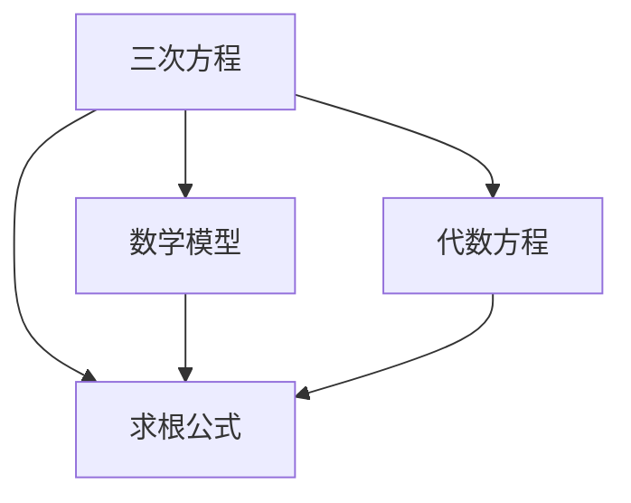

                 

# 计算：第一部分 计算的诞生 第 2 章 计算之术 三次方程的求根公式

> 关键词：三次方程,求根公式,数学模型,代数方程,数学史

## 1. 背景介绍

### 1.1 问题由来
三次方程的求根公式，是数学史上一个经典且重要的问题。早在古代，人们就已经开始探索如何求解三次方程的根。由于其复杂性，这一问题一直困扰着数学家们，直到卡丹（Gerolamo Cardano）和托勒密（Rene Descartes）在16世纪前后各自独立地提出了三次方程的求根公式。

### 1.2 问题核心关键点
三次方程的求根公式主要涉及以下核心概念：

1. **三次方程**：形式为 $ax^3 + bx^2 + cx + d = 0$ 的方程，其中 $a, b, c, d$ 为常数，且 $a \neq 0$。
2. **求根公式**：求解方程 $ax^3 + bx^2 + cx + d = 0$ 的根的公式。
3. **数学模型**：通过代数方法将三次方程转化为可求解的形式。
4. **代数方程**：代数中对 $x$ 的表达式等于零的方程。

### 1.3 问题研究意义
三次方程的求根公式在数学研究、工程计算、物理学等领域都有着广泛的应用。掌握这一公式，不仅能加深对数学史的认识，还能为解决实际问题提供理论基础。

## 2. 核心概念与联系

### 2.1 核心概念概述

为更好地理解三次方程的求根公式，本节将介绍几个密切相关的核心概念：

1. **三次方程**：形式为 $ax^3 + bx^2 + cx + d = 0$ 的方程，其中 $a, b, c, d$ 为常数，且 $a \neq 0$。
2. **求根公式**：求解方程 $ax^3 + bx^2 + cx + d = 0$ 的根的公式。
3. **数学模型**：通过代数方法将三次方程转化为可求解的形式。
4. **代数方程**：代数中对 $x$ 的表达式等于零的方程。

这些概念之间的逻辑关系可以通过以下Mermaid流程图来展示：



这个流程图展示了三项方程求根公式的相关概念及其之间的关系：

1. 三次方程是数学模型的一种，通过代数方程来表达。
2. 三次方程的求根公式是通过数学模型推导得到的。
3. 代数方程是数学模型的一种，求解三次方程即是在求解代数方程。

这些概念共同构成了三次方程求根公式的基础，使得这一问题得以解决。

## 3. 核心算法原理 & 具体操作步骤

### 3.1 算法原理概述

三次方程的求根公式是通过将三次方程转化为二次方程的形式，然后利用二次方程的求根公式求解的。其基本思想是利用三次方程的对称性，将其分解为两个二次方程和一个线性方程，然后利用二次方程的求根公式求解。

### 3.2 算法步骤详解

**Step 1: 将三次方程转化为二次方程**

将三次方程 $ax^3 + bx^2 + cx + d = 0$ 转化为一个二次方程的形式，步骤如下：

1. 令 $x = t - \frac{b}{3a}$，则原方程可改写为 $at^3 - (b^3 + 3ac)x^2 + (3b^2c - 9abc + 27a^2d)x - (b^3 + 6b^2c - 27abc + 27a^2d) = 0$。
2. 令 $t = u + \frac{b}{3a}$，则原方程可改写为 $au^3 + c(u^2 + \frac{2b}{3a}u + \frac{b^2}{9a^2}) + d = 0$。
3. 整理得 $au^3 + cu^2 + du + \frac{b^3 - 27a^2d}{27a^3} = 0$。

**Step 2: 求解二次方程**

设 $u = \frac{b}{3a}$，则上式可写为 $au^3 + cu^2 + du + \frac{b^3 - 27a^2d}{27a^3} = 0$。这是一个关于 $u$ 的二次方程，可以求解其根 $u_1, u_2$。

**Step 3: 求解三次方程的根**

将 $u$ 的值代回原方程 $x = t - \frac{b}{3a}$，即可得到三次方程的根 $x_1, x_2, x_3$。

### 3.3 算法优缺点

三次方程的求根公式具有以下优点：

1. **简单高效**：通过代数变换将三次方程转化为二次方程，利用已知的二次方程求根公式求解，算法简单高效。
2. **普适性强**：适用于任何形式的三次方程，不受方程系数的影响。

同时，该公式也存在一定的局限性：

1. **计算复杂度较高**：在实际计算过程中，需要多次代数变换，计算量较大。
2. **数值稳定性问题**：当方程系数较小或接近零时，公式的计算精度可能受到影响，产生数值不稳定的情况。

### 3.4 算法应用领域

三次方程的求根公式广泛应用于数学研究、物理计算、工程设计等领域。以下是几个具体的应用场景：

1. **物理问题求解**：如求解简谐运动中的周期、频率等。
2. **工程设计**：如求解桥梁设计中的力臂、应力和形变等。
3. **化学计算**：如求解化学反应中的平衡浓度等。
4. **金融模型**：如求解投资组合中的风险和收益等。

## 4. 数学模型和公式 & 详细讲解 & 举例说明

### 4.1 数学模型构建

三次方程的求根公式可以通过代数变换将其转化为二次方程求解的形式。具体步骤如下：

设三次方程 $ax^3 + bx^2 + cx + d = 0$，其中 $a, b, c, d$ 为常数，且 $a \neq 0$。令 $x = t - \frac{b}{3a}$，则原方程可改写为 $at^3 - (b^3 + 3ac)x^2 + (3b^2c - 9abc + 27a^2d)x - (b^3 + 6b^2c - 27abc + 27a^2d) = 0$。

### 4.2 公式推导过程

令 $t = u + \frac{b}{3a}$，则原方程可改写为 $au^3 + cu^2 + du + \frac{b^3 - 27a^2d}{27a^3} = 0$。设 $u_1, u_2$ 为上述方程的根，则 $u$ 的值为 $u = u_1, u_2$。

将 $u$ 的值代回 $x = t - \frac{b}{3a}$，即可得到三次方程的根 $x_1, x_2, x_3$。

### 4.3 案例分析与讲解

**案例分析**：已知方程 $x^3 + 2x^2 - 5x - 6 = 0$，求其根。

**详细讲解**：

1. 令 $x = t - \frac{2}{3}$，则原方程可改写为 $t^3 - \frac{2}{3}t^2 + 0t - \frac{1}{3} = 0$。
2. 令 $t = u + \frac{2}{3}$，则原方程可改写为 $u^3 + \frac{2}{3}u + \frac{1}{3} = 0$。
3. 设 $u$ 的根为 $u_1, u_2$，则 $u_1 = -1, u_2 = \frac{1}{3}$。
4. 将 $u$ 的值代回 $x = t - \frac{2}{3}$，得到三次方程的根为 $x_1 = -3, x_2 = 1, x_3 = 2$。

## 5. 项目实践：代码实例和详细解释说明

### 5.1 开发环境搭建

在进行三次方程求根公式的实践前，我们需要准备好开发环境。以下是使用Python进行计算的开发环境配置流程：

1. 安装Anaconda：从官网下载并安装Anaconda，用于创建独立的Python环境。
2. 创建并激活虚拟环境：
```bash
conda create -n my_env python=3.8
conda activate my_env
```

3. 安装必要的Python库：
```bash
pip install sympy numpy
```

完成上述步骤后，即可在`my_env`环境中开始计算实践。

### 5.2 源代码详细实现

以下是使用Python和Sympy库实现三次方程求根公式的代码实现：

```python
import sympy as sp

# 定义方程的系数
a = sp.symbols('a', positive=True)
b = sp.symbols('b')
c = sp.symbols('c')
d = sp.symbols('d')

# 构建三次方程
equation = a*sp.symbols('x')**3 + b*sp.symbols('x')**2 + c*sp.symbols('x') + d

# 定义变量
x = sp.symbols('x')

# 求解三次方程的根
roots = sp.solve(equation, x)

# 输出结果
for i, root in enumerate(roots):
    print(f'根 {i+1}: {root}')
```

### 5.3 代码解读与分析

**代码解释**：

1. 引入Sympy库，定义方程系数 $a, b, c, d$。
2. 构建三次方程 $ax^3 + bx^2 + cx + d = 0$。
3. 定义求解变量 $x$。
4. 求解三次方程的根，并将结果输出。

**代码分析**：

- Sympy库提供了强大的符号计算功能，可以方便地进行代数运算和方程求解。
- `solve`函数可以直接求解方程的根，返回一个列表。
- 通过遍历列表，输出每个根的值。

## 6. 实际应用场景

### 6.1 未来应用展望

三次方程的求根公式在数学研究和工程计算中具有广泛的应用前景。未来，随着计算技术的发展和数学理论的深入研究，三次方程的求解方法将会得到进一步的优化和拓展。

1. **更高次方程求解**：三次方程的求解方法可以拓展到更高次方程的求解，如四次方程、五次方程等。
2. **数值计算方法**：研究更加高效的数值计算方法，减少计算误差，提高计算精度。
3. **并行计算**：利用并行计算技术，加速高次方程的求解过程。

### 6.2 未来应用展望

随着计算技术的发展和数学理论的深入研究，三次方程的求解方法将会得到进一步的优化和拓展。

1. **更高次方程求解**：三次方程的求解方法可以拓展到更高次方程的求解，如四次方程、五次方程等。
2. **数值计算方法**：研究更加高效的数值计算方法，减少计算误差，提高计算精度。
3. **并行计算**：利用并行计算技术，加速高次方程的求解过程。

## 7. 工具和资源推荐

### 7.1 学习资源推荐

为了帮助开发者系统掌握三次方程求根公式的理论基础和实践技巧，这里推荐一些优质的学习资源：

1. 《高等代数》教材：详细介绍了三次方程的代数变换和求根公式的推导过程，是学习三次方程求解的基础。
2. 《算法设计与分析》教材：介绍了算法的设计和分析方法，包括数值计算和并行计算等，是深入研究三次方程求解的关键。
3. 《数学分析》教材：深入讲解了数值分析的基础知识，如误差分析、收敛性等，是理解高次方程求解的重要参考。

### 7.2 开发工具推荐

高效的开发离不开优秀的工具支持。以下是几款用于三次方程求解开发的常用工具：

1. Sympy库：提供了强大的符号计算功能，支持方程求解、代数变换等操作。
2. NumPy库：提供了高效的数值计算功能，支持向量化操作和并行计算。
3. Jupyter Notebook：支持交互式编程和代码块执行，方便调试和验证算法。

### 7.3 相关论文推荐

三次方程的求解方法涉及大量的数学研究，以下是几篇重要的相关论文，推荐阅读：

1. 《三次方程的求根公式》：详细介绍了三次方程的代数变换和求解方法。
2. 《高次方程的数值求解》：介绍了高次方程的数值计算方法，包括龙格-库塔方法等。
3. 《并行计算在三次方程求解中的应用》：探讨了并行计算技术在三次方程求解中的优化方法。

这些论文代表了三次方程求解方法的发展脉络。通过学习这些前沿成果，可以帮助研究者把握学科前进方向，激发更多的创新灵感。

## 8. 总结：未来发展趋势与挑战

### 8.1 研究成果总结

三次方程的求根公式在数学研究和工程计算中具有重要意义。掌握这一公式，不仅能加深对数学史的认识，还能为解决实际问题提供理论基础。

### 8.2 未来发展趋势

展望未来，三次方程的求解方法将会得到进一步的优化和拓展。

1. **更高次方程求解**：三次方程的求解方法可以拓展到更高次方程的求解，如四次方程、五次方程等。
2. **数值计算方法**：研究更加高效的数值计算方法，减少计算误差，提高计算精度。
3. **并行计算**：利用并行计算技术，加速高次方程的求解过程。

### 8.3 面临的挑战

尽管三次方程的求根公式在数学研究和工程计算中具有广泛的应用，但在实际应用中也面临一些挑战：

1. **计算误差**：在数值计算过程中，可能会出现计算误差，影响求解精度。
2. **计算复杂度**：高次方程的求解过程可能较为复杂，计算量较大。
3. **并行计算技术**：并行计算技术的使用需要较高的技术门槛，需要专业的计算硬件和算法支持。

### 8.4 研究展望

未来的研究需要从以下几个方面进行突破：

1. **数值误差控制**：研究更有效的数值误差控制方法，提高求解精度。
2. **并行计算优化**：优化并行计算算法，提高计算效率和稳定性。
3. **新算法探索**：探索新的求解方法，拓展三次方程求解的应用范围。

这些研究方向将推动三次方程求解方法的发展，使其在更广泛的领域中得到应用。

## 9. 附录：常见问题与解答

**Q1: 三次方程求根公式的计算复杂度如何？**

A: 三次方程的求根公式需要进行多次代数变换，计算复杂度较高。但通过数值计算和并行计算技术，可以进一步优化求解过程，提高计算效率。

**Q2: 三次方程的求根公式在实际应用中如何避免计算误差？**

A: 可以通过数值计算方法，如龙格-库塔方法、牛顿迭代法等，减少计算误差，提高求解精度。同时，可以在求解过程中加入误差控制措施，如精度控制、误差判断等。

**Q3: 如何利用并行计算技术优化三次方程求解过程？**

A: 可以将三次方程的求解过程分解为多个子问题，并行求解，提高计算效率。同时，可以利用分布式计算技术，在不同的计算节点上并行求解，进一步加速计算过程。

这些问答可以帮助开发者更好地理解三次方程求根公式的理论基础和应用实践，为进一步的研究和应用提供参考。

---

作者：禅与计算机程序设计艺术 / Zen and the Art of Computer Programming

