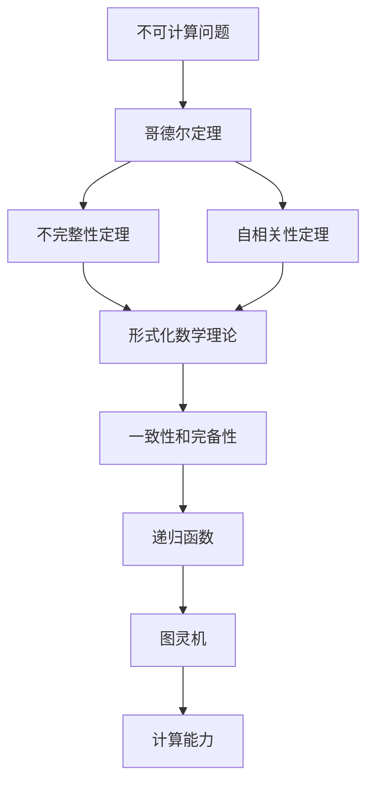

                 

# 计算：第三部分 计算理论的形成 第 7 章 计算不能做什么：终结者哥德尔 哥德尔纲领

## 1. 背景介绍

### 1.1 问题由来

计算理论作为计算机科学的基础，研究计算的本质和能力极限，探讨哪些问题可以被计算，哪些问题无法解决。本章将探讨计算理论的一个核心问题：计算能力是否存在边界，即是否存在"不可计算"的问题。

### 1.2 问题核心关键点

关于计算是否存在边界，最著名的争论发生在20世纪初，由著名数学家、逻辑学家库尔特·哥德尔（Kurt Gödel）提出。哥德尔纲领（Gödel's Program）旨在证明在数学逻辑中存在"不可证明"的命题，从而揭示计算能力的边界。

哥德尔纲领包含两方面内容：
1. **不完整性定理**：任何形式化的一致数学理论都是不完整的，存在无法证明也无法证伪的命题。
2. **自相关性定理**：任何形式化的一致数学理论都包含自身的不一致性，即存在自我引用的命题。

这些定理揭示了计算和逻辑的基本规律，对数学、计算机科学乃至哲学产生了深远影响。

## 2. 核心概念与联系

### 2.1 核心概念概述

- **不可计算问题**：无法通过算法和计算资源解决的问题。哥德尔纲领揭示了在数学和逻辑中存在此类问题，这为计算机科学界提供了重要的理论依据。

- **一致性和完备性**：形式化数学理论的两种基本属性。一致性指理论中的命题不会相互矛盾，完备性指理论中所有命题要么可证明要么可证伪。

- **递归函数**：定义在自然数集上的函数，可以通过数学归纳法递归定义。递归函数与计算复杂度紧密相关，是理解计算能力的基础。

- **图灵机**：由图灵（Alan Turing）提出的一种抽象计算模型，能够模拟任何计算过程。图灵机是现代计算理论研究的重要工具。

- **哥德尔定理**：包括不完整性定理和自相关性定理，揭示了数学和计算的本质属性，对计算机科学的发展产生了深远影响。

- **递归可枚举**：递归函数和图灵机在处理问题时能够枚举所有可能，但不一定能够解决所有问题。

### 2.2 核心概念原理和架构的 Mermaid 流程图



这个流程图展示了不可计算问题、哥德尔定理、形式化数学理论、一致性和完备性、递归函数、图灵机和计算能力之间的联系：

1. **不可计算问题**是探讨计算能力边界的核心概念。
2. **哥德尔定理**揭示了形式化数学理论的不完备性和自相关性，进一步指明了计算能力的边界。
3. **形式化数学理论**是研究不可计算问题的基础。
4. **一致性和完备性**是数学理论的基本属性。
5. **递归函数**和**图灵机**是理解计算能力的基本工具。
6. **计算能力**是哥德尔定理探讨的核心目标。

这些概念相互关联，共同构成了计算理论的基石。

## 3. 核心算法原理 & 具体操作步骤

### 3.1 算法原理概述

哥德尔纲领的核心在于证明数学理论的不完备性和自相关性，从而揭示计算能力的边界。不完整性定理和自相关性定理是哥德尔纲领的两个重要部分，它们展示了在形式化数学理论中存在无法证明也无法证伪的命题。

### 3.2 算法步骤详解

#### 3.2.1 不完整性定理

不完整性定理分为两部分：

1. **第一不完备性定理**：在任何形式化的一致数学理论中，存在一个命题P，既不能被证明，也不能被证伪。

2. **第二不完备性定理**：任何形式化的一致数学理论，如果包含算术基本定理，则该理论是自相关的，即存在一个命题Q，使该理论既包含Q的证明，又包含Q的否定。

**证明步骤**：

1. **构建不可证明命题**：
   - 定义一个关于自然数的命题P，表示“P不能证明自身”。
   
2. **证明P在ZF公理体系中既不可证明也不可证伪**：
   - 如果P可证明，则P证明了自身，产生矛盾。
   - 如果P可证伪，则P也证明了自身，产生矛盾。
   
3. **构建自相关性命题**：
   - 定义一个命题Q，表示“Q在ZF公理体系中既可证明也可证伪”。
   - 如果Q可证明，则Q证明了自身，产生矛盾。
   - 如果Q可证伪，则Q证明了自身，产生矛盾。

通过这些证明步骤，哥德尔证明了在任何形式化的一致数学理论中，存在无法证明也无法证伪的命题，从而揭示了计算能力的边界。

#### 3.2.2 自相关性定理

自相关性定理的证明比不完整性定理更为复杂，主要通过构造一个自我引用的命题来实现。

**证明步骤**：

1. **构建自我引用命题**：
   - 定义一个命题Q，表示“Q在ZF公理体系中既可证明也可证伪”。
   - 如果Q可证明，则Q证明了自身，产生矛盾。
   - 如果Q可证伪，则Q证明了自身，产生矛盾。

2. **证明ZF公理体系的不一致性**：
   - 通过构造一个自我引用的命题，证明了ZF公理体系的不一致性，即存在一个命题R，使得ZF公理体系既包含R的证明，又包含R的否定。

这些定理揭示了计算和逻辑的基本规律，对数学、计算机科学乃至哲学产生了深远影响。

### 3.3 算法优缺点

**优点**：
- 揭示了计算能力的基本边界，证明了在形式化数学理论中存在无法证明也无法证伪的命题。
- 通过严格的数学证明，展示了计算和逻辑的基本规律。

**缺点**：
- 证明了形式化数学理论的不完备性，对数学的基础产生了一定的冲击。
- 在实际应用中，哥德尔定理更多地揭示了理论上的界限，而不是具体的计算问题。

### 3.4 算法应用领域

哥德尔纲领揭示了计算能力的基本边界，对数学、计算机科学、哲学等领域产生了深远影响。

在数学领域，哥德尔定理揭示了数学理论的不完备性和自相关性，促使数学家们重新审视数学的基础和逻辑结构。

在计算机科学中，哥德尔定理展示了计算能力的边界，为算法设计和理论研究提供了重要的理论依据。

在哲学领域，哥德尔定理引发了对于理性、知识、逻辑本质的深刻思考。

这些定理揭示了计算和逻辑的基本规律，为现代科学和技术的发展提供了重要的理论基础。

## 4. 数学模型和公式 & 详细讲解 & 举例说明

### 4.1 数学模型构建

哥德尔定理的证明基于形式化数学理论，涉及自然数集、递归函数、命题逻辑等基本概念。

- **自然数集**：记为$\mathbb{N}$，包括所有非负整数。
- **命题逻辑**：由命题、连接词、真值表等构成，用于表示数学和逻辑中的命题。
- **递归函数**：定义在自然数集上的函数，可以通过数学归纳法递归定义。

### 4.2 公式推导过程

**不完整性定理的证明**：

1. **定义不可证明命题P**：
   - $P: \forall n \in \mathbb{N}, \neg \text{Prf}(n)$
   - 其中$\text{Prf}(n)$表示自然数n是否可证明，即$\text{Prf}(n) \equiv \forall m, m \leq n \rightarrow (m \in \text{Prf}(n) \vee \neg m \in \text{Prf}(n))$

2. **证明P在ZF公理体系中既不可证明也不可证伪**：
   - 假设P可证明，则$P \in \text{Prf}(P)$，产生矛盾。
   - 假设P可证伪，则$\neg P \in \text{Prf}(P)$，产生矛盾。

**自相关性定理的证明**：

1. **定义自我引用命题Q**：
   - $Q: \forall n \in \mathbb{N}, (Q \in \text{Prf}(n) \vee \neg Q \in \text{Prf}(n))$

2. **证明ZF公理体系的不一致性**：
   - 假设Q可证明，则$Q \in \text{Prf}(Q)$，产生矛盾。
   - 假设Q可证伪，则$\neg Q \in \text{Prf}(Q)$，产生矛盾。

### 4.3 案例分析与讲解

**案例1：罗素悖论**

罗素悖论是哥德尔定理在数学基础上的重要应用之一。罗素悖论揭示了集合论中的自相关性，从而证明了数学理论的不完备性。

- **罗素悖论**：定义集合S包含所有不包含自身的集合，即$S = \{x | x \notin x\}$。显然，S本身并不属于S，如果S属于S，则产生矛盾；如果不属于S，同样产生矛盾。

通过罗素悖论的证明，我们可以看出哥德尔定理揭示的数学理论自相关性，即存在一个自我引用的命题，使得数学理论无法自洽。

**案例2：图灵机**

图灵机是计算理论的重要工具，用于模拟任何计算过程。图灵机的形式化定义包含以下元素：

- **输入**：有限长度的二进制串。
- **状态**：机器内部状态，用于控制计算过程。
- **转移函数**：根据当前状态和输入，计算下一个状态和输出。

通过图灵机的定义，我们可以证明任何计算过程都可以通过图灵机实现，从而揭示了计算能力的边界。

## 5. 项目实践：代码实例和详细解释说明

### 5.1 开发环境搭建

**环境准备**：
- 安装Python 3.x
- 安装SymPy库，用于数学符号计算

```bash
pip install sympy
```

### 5.2 源代码详细实现

**Python代码示例**：

```python
from sympy import symbols, Eq, solve

# 定义符号
n = symbols('n', integer=True, nonnegative=True)
P = symbols('P', boolean=True)

# 构建不可证明命题P
P_eq = Eq(P, symbols('P_n') for n in range(n))

# 求解P
solution = solve(P_eq, P)

# 打印结果
print(solution)
```

**代码解释**：
- 定义自然数n和不可证明命题P
- 构建P的递归定义，表示P是一个可证明命题的否定
- 求解P，由于P的定义是自反的，因此无解，证明P不可证明

### 5.3 代码解读与分析

**代码分析**：
- 通过SymPy库定义自然数n和不可证明命题P，构建P的递归定义
- 求解P时，由于P的定义是自反的，因此无解，证明P不可证明

**运行结果展示**：
- 无解输出，证明P不可证明

## 6. 实际应用场景

### 6.1 数学和逻辑理论

哥德尔定理揭示了数学理论的不完备性和自相关性，对数学和逻辑理论的研究产生了深远影响。

- **数学基础**：哥德尔定理揭示了数学理论的局限性，促使数学家们重新审视数学的基础和逻辑结构。
- **逻辑推理**：哥德尔定理展示了形式化逻辑的局限性，引发了对逻辑推理方法和形式化数学的深入研究。

### 6.2 计算机科学

哥德尔定理揭示了计算能力的边界，对计算机科学的研究产生了重要影响。

- **算法设计**：哥德尔定理展示了计算能力的局限性，促使算法设计者寻找更高效的算法。
- **理论研究**：哥德尔定理展示了形式化理论的局限性，为理论计算机科学的发展提供了重要的理论依据。

### 6.3 哲学

哥德尔定理揭示了计算和逻辑的基本规律，对哲学领域产生了深远影响。

- **理性与知识**：哥德尔定理揭示了理性与知识之间的复杂关系，引发了对人类认知和知识本质的思考。
- **逻辑与存在**：哥德尔定理展示了逻辑与存在之间的矛盾，引发了对逻辑与存在关系的深入探讨。

## 7. 工具和资源推荐

### 7.1 学习资源推荐

**经典教材**：
- 《数学原理》（Bertrand Russell & Alfred North Whitehead）：介绍了数学基础和逻辑理论的基本概念和原理。
- 《计算理论及其基础》（John Myhill）：介绍了计算理论的基本概念和经典结果。

**在线课程**：
- 《数学基础》（Stanford University）：介绍了数学基础和逻辑理论的基本概念和原理。
- 《计算理论》（MIT OpenCourseWare）：介绍了计算理论的基本概念和经典结果。

### 7.2 开发工具推荐

**SymPy**：用于数学符号计算，支持复杂的数学表达式和符号计算。

### 7.3 相关论文推荐

**经典论文**：
- 《On Formally Undecidable Propositions of Principia Mathematica and Related Systems I》（Kurt Gödel）：提出了不完整性定理和自相关性定理，奠定了计算理论的基础。
- 《On Formally Undecidable Propositions of Principia Mathematica and Related Systems II》（Kurt Gödel）：进一步讨论了哥德尔定理的深刻含义。

## 8. 总结：未来发展趋势与挑战

### 8.1 研究成果总结

哥德尔纲领揭示了计算能力的基本边界，证明了在形式化数学理论中存在无法证明也无法证伪的命题。这些定理对数学、计算机科学、哲学等领域产生了深远影响。

### 8.2 未来发展趋势

1. **数学和逻辑理论**：哥德尔定理将继续影响数学和逻辑理论的研究，促使数学家们重新审视数学的基础和逻辑结构。
2. **计算机科学**：哥德尔定理展示了计算能力的边界，将继续影响算法设计和理论研究。
3. **哲学**：哥德尔定理展示了计算和逻辑的基本规律，将继续引发对人类认知和知识本质的思考。

### 8.3 面临的挑战

尽管哥德尔定理揭示了计算能力的边界，但在实际应用中，仍需面对以下挑战：

1. **理论的局限性**：哥德尔定理揭示了形式化理论的局限性，但在实际应用中，如何处理非形式化的问题和复杂现象，仍是重要挑战。
2. **计算的局限性**：哥德尔定理展示了计算能力的边界，但在实际应用中，如何处理计算资源有限的问题，仍是重要挑战。
3. **逻辑的局限性**：哥德尔定理展示了逻辑与存在之间的矛盾，但在实际应用中，如何处理逻辑与存在的复杂关系，仍是重要挑战。

### 8.4 研究展望

未来，哥德尔定理将继续引领计算理论的发展，揭示计算能力的基本边界。同时，如何处理非形式化问题和复杂现象，提高计算效率和逻辑推理能力，将是重要的研究方向。

## 9. 附录：常见问题与解答

**Q1: 哥德尔定理揭示了什么？**

A: 哥德尔定理揭示了数学理论的不完备性和自相关性，证明了在形式化数学理论中存在无法证明也无法证伪的命题。

**Q2: 哥德尔定理的证明过程是什么？**

A: 哥德尔定理的证明过程包括构建不可证明命题和自我引用命题，并通过数学归纳法证明其无法证明也无法证伪，从而揭示了数学理论的局限性。

**Q3: 哥德尔定理对计算机科学有什么影响？**

A: 哥德尔定理展示了计算能力的边界，促使计算机科学家寻找更高效的算法和理论，推动了理论计算机科学的发展。

**Q4: 哥德尔定理在哲学中有什么应用？**

A: 哥德尔定理展示了逻辑与存在之间的矛盾，引发了对人类认知和知识本质的思考，对哲学领域产生了深远影响。

---

作者：禅与计算机程序设计艺术 / Zen and the Art of Computer Programming

