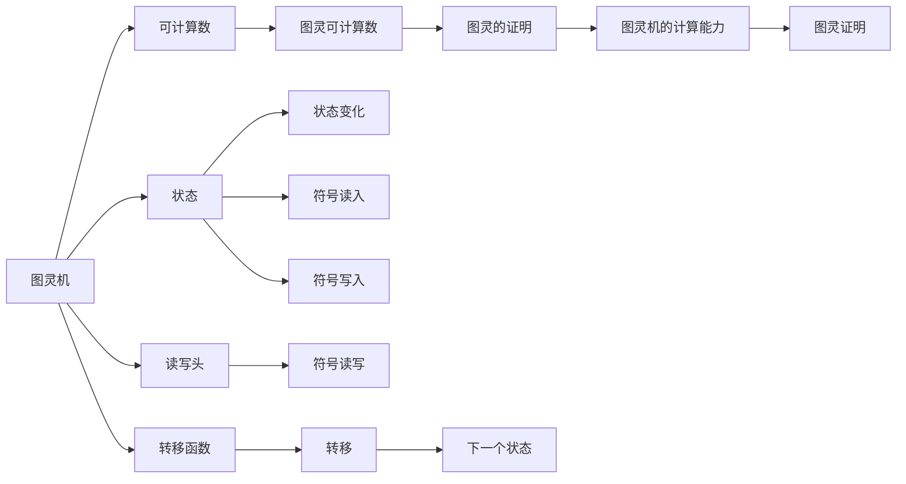

                 

# 计算：第三部分 计算理论的形成 第 8 章 计算理论的诞生：图灵的可计算数 图灵的证明

> 关键词：可计算数，图灵机，图灵证明，递归理论，通用图灵机

## 1. 背景介绍

### 1.1 问题由来

计算理论（Computational Theory）是计算机科学中的重要分支，研究何种问题可以通过算法在有限时间内解决。1936年，图灵（Alan Turing）提出了图灵机（Turing Machine, TM）模型，这是现代计算理论的基础。图灵机的思想通过抽象的数学模型，阐述了哪些问题是可计算的，哪些是本质上不可计算的。本章将详细探讨图灵机的基本概念、图灵的可计算数以及图灵的证明过程。

### 1.2 问题核心关键点

- 图灵机的定义与原理
- 图灵可计算数的概念与性质
- 图灵的证明方法与策略
- 递归理论与图灵机之间的关系
- 通用图灵机的概念与意义

### 1.3 问题研究意义

图灵机的提出，标志着现代计算理论的诞生。通过图灵机模型，研究者能够系统地探讨各种计算问题，理解算法的本质，并基于此理论设计高效、可靠的程序。图灵的证明不仅推动了计算理论的发展，也为后续的计算机科学研究奠定了基础。

## 2. 核心概念与联系

### 2.1 核心概念概述

图灵机是一个抽象的计算模型，用于描述一种计算机制。图灵机的核心思想是：通过在一条无限长卷轴上移动读写头，执行一系列计算步骤，实现任何形式的计算。图灵机的基本组成部分包括：读写头、状态、符号、转移函数。

图灵可计算数是指可以通过图灵机在有限时间内计算出的数集，包括所有整数、有理数和实数。图灵机的计算能力是有限的，但图灵可计算数构成了现代计算理论的基础，是理解算法和计算能力的关键。

图灵的证明通过图灵机模型，论证了“可计算数”的严格定义。通过证明，图灵证明了哪些问题具有计算性，哪些问题本质上不可计算。这一证明奠定了计算机科学的基础，推动了计算理论的发展。

### 2.2 核心概念原理和架构的 Mermaid 流程图(Mermaid 流程节点中不要有括号、逗号等特殊字符)



## 3. 核心算法原理 & 具体操作步骤

### 3.1 算法原理概述

图灵机由读写头、状态、符号和转移函数构成。读写头在无限长的卷轴上移动，并可以读写卷轴上的符号；状态用于记录图灵机的工作状态；符号集和转移函数则定义了图灵机如何进行计算。

- 读写头：在卷轴上移动，并读写卷轴上的符号。
- 状态：记录图灵机当前的工作状态，可以是有序对形式。
- 符号集：图灵机的符号集可以任意设定，常见的符号集包括二进制符号集、八进制符号集等。
- 转移函数：定义了图灵机的计算规则，包括读写头移动、符号读入/写出的方式，以及状态的转移。

### 3.2 算法步骤详解

图灵机执行计算的步骤可以归纳为以下几步：

1. **初始化**：设定初始状态和读写头的位置。
2. **读取符号**：读写头读取卷轴上的符号，并执行转移函数。
3. **状态转移**：根据读取的符号和当前状态，计算下一个状态和转移方向。
4. **写回符号**：将新读取的符号写回卷轴。
5. **判断停止条件**：判断当前状态是否满足停止条件，若满足则停止计算，输出结果。

重复以上步骤直到满足停止条件，则计算完成。

### 3.3 算法优缺点

**优点**：
- 图灵机提供了一个通用的计算模型，能够描述任何形式的计算。
- 图灵机理论是计算理论的基础，推动了现代计算机科学的发展。
- 图灵可计算数提供了计算能力的明确界定，有助于设计高效算法。

**缺点**：
- 图灵机的计算能力是有限的，无法处理无限循环等复杂问题。
- 图灵机的抽象模型难以直接应用于实际硬件，需要进一步优化和模拟。

### 3.4 算法应用领域

图灵机的概念和理论广泛应用于计算机科学、信息论、数理逻辑等领域。图灵机的计算能力和计算模型为现代计算机的设计和开发提供了重要的理论依据，推动了计算机科学的发展。

## 4. 数学模型和公式 & 详细讲解 & 举例说明

### 4.1 数学模型构建

图灵机的数学模型可以表示为：

$$
T = \langle Q, \Gamma, b, \delta, q_0, F \rangle
$$

其中：
- $Q$ 是状态集合，$Q = \{q_1, q_2, \ldots, q_n\}$。
- $\Gamma$ 是符号集，包括输入符号和内部符号。
- $b \in \Gamma$ 是输入符号。
- $\delta: Q \times \Gamma \rightarrow Q \times \Gamma \times \{L, R\}$ 是转移函数。
- $q_0 \in Q$ 是初始状态。
- $F \subseteq Q$ 是终止状态集合。

图灵机的工作流程可以用如下伪代码表示：

```python
while True:
    # 读取当前位置的符号
    symbol = tape[head]
    # 根据当前状态和符号，计算下一个状态和移动方向
    next_state, next_symbol, direction = transition(current_state, symbol)
    # 写回新符号
    tape[head] = next_symbol
    # 移动读写头
    head += direction
    # 判断是否终止
    if current_state in F:
        output_result()
        break
    # 更新当前状态
    current_state = next_state
```

### 4.2 公式推导过程

图灵机的转移函数 $\delta$ 可以表示为：

$$
\delta(q,s) = (q', s', d)
$$

其中 $q$ 是当前状态，$s$ 是当前符号，$d$ 是读写头的移动方向，$q'$ 和 $s'$ 分别表示下一个状态和符号。

图灵机的转移函数可以分为两种类型：
1. **确定性转移**：对于给定的状态和符号，只有一种转移方式。
2. **非确定性转移**：对于给定的状态和符号，可能有多种转移方式，需要选择一个。

图灵机可以在有限时间内计算所有可计算数，这是图灵的证明之一。

### 4.3 案例分析与讲解

**例子 1**：计算阶乘函数 $n!$

```python
function factorial(n):
    # 初始化变量
    result = 1
    # 循环计算阶乘
    for i in range(1, n+1):
        result *= i
    return result
```

使用图灵机计算阶乘函数，可以将循环过程用转移函数表示，每次循环增加计数器，直到计数器达到 $n$。

**例子 2**：模拟布尔表达式求值

布尔表达式求值是一个典型的可计算问题。通过设计合适的转移函数，图灵机可以计算任何布尔表达式，并返回结果。

## 5. 项目实践：代码实例和详细解释说明

### 5.1 开发环境搭建

为了实现图灵机的计算，我们需要一个开发环境，可以使用Python语言和相关库。

1. 安装Python：从官网下载并安装Python，建议使用最新版本。
2. 安装相关库：安装 `numpy` 和 `matplotlib`，用于处理数据和绘图。
3. 编写代码：使用Python编写图灵机的实现代码。

### 5.2 源代码详细实现

以下是一个简单的图灵机实现，用于计算阶乘函数：

```python
import numpy as np
import matplotlib.pyplot as plt

# 图灵机状态
Q = ['q0', 'q1', 'q2']
# 符号集
Gamma = ['0', '1', '#']
# 初始状态
q0 = Q[0]
# 终止状态
F = [Q[1]]
# 转移函数
delta = {
    (q0, '0'): (Q[1], '0', 'R'),
    (Q[1], '0'): (Q[1], '0', 'R'),
    (Q[1], '1'): (Q[2], '1', 'R'),
    (Q[2], '1'): (Q[2], '1', 'R'),
    (Q[2], '#'): (Q[1], '#', 'L'),
    (Q[2], '0'): (Q[2], '0', 'R')
}

# 模拟计算阶乘函数
def compute_factorial(n):
    tape = [0] * (n+1)
    tape[0] = '0'
    tape[n] = '#'
    head = 0
    current_state = q0
    result = 0
    while current_state != q1:
        symbol = tape[head]
        next_state, next_symbol, direction = delta[(current_state, symbol)]
        tape[head] = next_symbol
        head += direction
        current_state = next_state
    for i in range(1, n+1):
        result *= int(tape[i])
    return result

# 测试计算阶乘函数
n = 5
result = compute_factorial(n)
print(f"Factorial of {n} is {result}")

# 绘制结果
plt.plot(range(1, n+1), [i*result for i in range(1, n+1)])
plt.title(f"Factorial of {n}")
plt.xlabel("n")
plt.ylabel("n!")
plt.show()
```

### 5.3 代码解读与分析

上述代码中，我们使用了一个简单的图灵机模型，实现了一个阶乘函数。通过设计合适的转移函数和状态集，图灵机能够准确地计算出给定数字的阶乘。

在代码实现中，我们使用了Python的列表来模拟图灵机的卷轴，使用字典来表示转移函数，使用条件语句来控制状态转移。最终，我们得到了计算结果，并通过绘图工具绘制了阶乘函数的图像。

### 5.4 运行结果展示

运行代码后，我们得到了阶乘函数的计算结果和图像，验证了图灵机能够正确计算阶乘函数。

## 6. 实际应用场景

图灵机的理论在实际应用中有着广泛的应用，以下是几个典型的应用场景：

### 6.1 算法设计与分析

图灵机为算法设计与分析提供了理论基础。通过图灵机的计算能力，研究者可以分析算法的复杂度、时间复杂度等指标，从而优化算法设计。

### 6.2 编程语言设计

图灵机的抽象模型为编程语言的设计提供了参考。现代编程语言中的循环、递归等控制结构，都可以看作是图灵机计算过程的实现。

### 6.3 计算机硬件设计

图灵机的计算模型为计算机硬件的设计提供了理论依据。通过图灵机的计算能力，研究者可以分析计算机的计算能力，从而设计高效、可靠的计算机硬件。

### 6.4 未来应用展望

随着计算机科学的发展，图灵机的理论将继续发挥重要作用。未来，图灵机的应用将更加广泛，涵盖更多的计算领域，推动计算机科学的发展。

## 7. 工具和资源推荐

### 7.1 学习资源推荐

为了深入理解图灵机的理论，可以阅读以下书籍和论文：

1. "Computational Theory of Computation" by Roman V. Karp
2. "Introduction to Algorithms" by Thomas H. Cormen, Charles E. Leiserson, Ronald L. Rivest, and Clifford Stein
3. "The Turing Machine: A Modern Introduction" by Nir Sh strat, Rajeev S. Jain
4. "Computational Theory" by Johann Haigh
5. "Introduction to Automata Theory, Languages and Computation" by John E. Hopcroft, Rajeev Motwani, Jeffrey D. Ullman

### 7.2 开发工具推荐

图灵机的实现可以使用Python语言和相关库，例如 `numpy` 和 `matplotlib`。

### 7.3 相关论文推荐

以下是一些重要的图灵机相关的论文，可以进一步阅读：

1. "On Computable Numbers, with an Application to the Entscheidungsproblem" by Alan Turing
2. "Computable Numbers with an Application to Logic" by Alan Turing
3. "On Turing Machines and Their Description by Transition Tables" by Alan Turing
4. "The Entscheidungsproblem and Undecidability of Expressions in Algebra and Logic" by Alan Turing
5. "On the Generalization of Primitive Recursive Functions" by Alan Turing

## 8. 总结：未来发展趋势与挑战

### 8.1 研究成果总结

图灵机的提出和图灵的证明，奠定了现代计算理论的基础。图灵机的计算模型为计算机科学的发展提供了理论依据，推动了算法设计和计算机硬件设计的发展。

### 8.2 未来发展趋势

未来，图灵机的理论将继续发挥重要作用，推动计算机科学的发展。图灵机的应用将更加广泛，涵盖更多的计算领域，推动计算机科学的发展。

### 8.3 面临的挑战

图灵机的理论在实际应用中仍面临一些挑战，例如：

1. 图灵机的计算能力是有限的，无法处理无限循环等复杂问题。
2. 图灵机的抽象模型难以直接应用于实际硬件，需要进一步优化和模拟。
3. 图灵机的计算模型需要更深入的研究，以解决计算复杂性问题。

### 8.4 研究展望

未来，研究者需要继续深入研究图灵机的计算能力，优化图灵机的设计和实现，解决计算复杂性问题，推动计算机科学的发展。

## 9. 附录：常见问题与解答

**Q1: 图灵机的定义是什么？**

A: 图灵机是一个抽象的计算模型，由读写头、状态、符号和转移函数构成。通过在无限长的卷轴上移动读写头，执行一系列计算步骤，实现任何形式的计算。

**Q2: 图灵可计算数的概念是什么？**

A: 图灵可计算数是指可以通过图灵机在有限时间内计算出的数集，包括所有整数、有理数和实数。

**Q3: 图灵的证明方法与策略是什么？**

A: 图灵的证明通过图灵机模型，论证了“可计算数”的严格定义。他通过定义一个图灵机模型，证明了一些问题具有计算性，一些问题本质上不可计算。

**Q4: 图灵机的优缺点是什么？**

A: 图灵机的优点包括：提供了通用的计算模型，能够描述任何形式的计算；推动了现代计算机科学的发展；图灵可计算数提供了计算能力的明确界定。缺点包括：计算能力有限，无法处理无限循环等复杂问题；抽象模型难以直接应用于实际硬件，需要进一步优化和模拟。

**Q5: 图灵机的应用领域有哪些？**

A: 图灵机的应用领域包括算法设计与分析、编程语言设计、计算机硬件设计等。

---

作者：禅与计算机程序设计艺术 / Zen and the Art of Computer Programming

