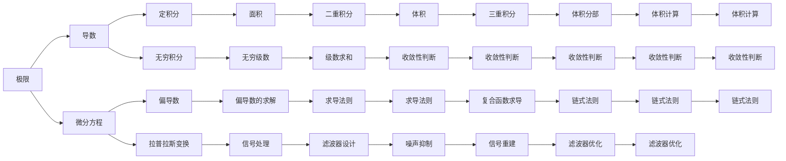

                 

# 计算：第二部分 计算的数学基础 第 4 章 数学的基础 微积分的发明

> 关键词：微积分,数学基础,数学史,计算,原理

## 1. 背景介绍

微积分（Calculus）是一门研究变化率和积累量的数学分支，它在科学、工程、经济学和许多其他领域都有广泛应用。在计算机科学中，微积分的理论和算法也是理解算法效率和设计优化算法的关键。本章将深入探讨微积分的起源、核心概念以及它在计算中的应用。

### 1.1 问题由来
微积分的发展历程可以追溯到古希腊时期，当时的数学家们已经开始研究变化和运动的问题。但是，直到17世纪，由艾萨克·牛顿（Isaac Newton）和戈特弗里德·莱布尼茨（Gottfried Wilhelm Leibniz）独立发明了微积分，这一学科才真正成形。微积分的发明为物理学的革命性进展提供了工具，如牛顿的运动定律和万有引力定律，同时也为经济学中的优化问题提供了数学基础。

## 2. 核心概念与联系

### 2.1 核心概念概述

微积分主要分为两个部分：微分学和积分学。微分学研究的是函数的变化率，如速度、加速度等；积分学研究的是积累量，如距离、面积、体积等。微积分的核心概念包括极限、导数、微分方程和积分等。

- **极限**：微积分的基础是极限的概念。极限描述了变量在特定条件下趋近于某个值的过程。
- **导数**：导数描述了一个函数在某一点的变化率。导数是微分学的核心。
- **微分方程**：微分方程是描述变量随时间变化的方程，其解通常表示为函数。
- **积分**：积分描述了函数的积累量。定积分可以计算面积、体积等，而无穷积分则描述无穷大范围内的积累量。

### 2.2 核心概念原理和架构的 Mermaid 流程图



这个图展示了微积分的主要概念以及它们之间的联系和应用。极限是微积分的基础，导数和积分则是其核心。微分方程和偏导数进一步扩展了微积分的应用范围。而级数、信号处理等则将微积分与其他领域紧密联系起来。

## 3. 核心算法原理 & 具体操作步骤

### 3.1 算法原理概述

微积分的核心算法原理可以简单概括为：通过极限、导数和积分等概念，理解和描述函数的变化和积累。其操作步骤包括：

1. 确定问题的数学模型。
2. 使用极限、导数和积分等工具，分析问题的性质。
3. 求解问题的解或方程。

### 3.2 算法步骤详解

以下以一个简单的速度-时间问题为例，展示微积分的应用步骤。

**Step 1: 确定问题的数学模型**

假设有一个人以恒定速度直线前进，已知他在0时刻的位置为0米，速度为$v(t) = 2t$ 米/秒。问题是如何计算他在$t$时刻的位置$s(t)$。

**Step 2: 使用极限、导数和积分等工具，分析问题的性质**

根据速度和位移的关系，我们有：

$$
\frac{ds}{dt} = v(t) = 2t
$$

这是一个一阶微分方程。我们可以通过对两边积分来求解位移$s(t)$：

$$
\int \frac{ds}{dt} dt = \int 2t dt
$$

$$
s(t) = \int 2t dt = t^2 + C
$$

其中$C$为积分常数，可以根据初始条件$s(0) = 0$确定。

**Step 3: 求解问题的解或方程**

将初始条件代入上式：

$$
s(0) = 0^2 + C = 0 \Rightarrow C = 0
$$

因此，位移$s(t)$的解为：

$$
s(t) = t^2
$$

### 3.3 算法优缺点

微积分的发明极大地推动了科学和工程的发展，其优点包括：

1. 提供了一种精确描述变化和积累量的数学工具。
2. 能够解决许多实际问题，如速度、加速度、面积、体积等。

同时，微积分也存在一些局限性：

1. 涉及的数学概念较为抽象，理解和使用需要一定的数学基础。
2. 对于某些复杂问题，解析求解可能难以实现，需要借助数值计算方法。

### 3.4 算法应用领域

微积分的应用领域非常广泛，以下是几个典型的应用案例：

1. **物理学**：微积分是理解物理定律和运动的基本工具。牛顿的运动定律和万有引力定律都是基于微积分的。
2. **工程学**：微积分在机械设计、电路分析、信号处理等领域有广泛应用。
3. **经济学**：微积分用于优化问题、边际分析、经济增长等。
4. **计算机科学**：微积分用于算法设计、数据结构、图形学等。
5. **医学**：微积分在药物动力学、生物统计学、医学成像等领域有重要应用。

## 4. 数学模型和公式 & 详细讲解 & 举例说明

### 4.1 数学模型构建

微积分的数学模型构建主要涉及以下几个基本概念：

- **极限**：$\lim_{x \to a} f(x) = L$表示当$x$趋近于$a$时，$f(x)$趋近于$L$。
- **导数**：$f'(x) = \lim_{h \to 0} \frac{f(x+h) - f(x)}{h}$表示函数在$x$点的瞬时变化率。
- **积分**：$\int_a^b f(x) dx$表示函数在区间$[a,b]$上的积累量。

### 4.2 公式推导过程

以导数的定义为例，展示其推导过程。

$$
f'(x) = \lim_{h \to 0} \frac{f(x+h) - f(x)}{h}
$$

考虑一个简化的例子，如$f(x) = x^2$：

$$
f'(x) = \lim_{h \to 0} \frac{(x+h)^2 - x^2}{h}
$$

$$
= \lim_{h \to 0} \frac{x^2 + 2xh + h^2 - x^2}{h}
$$

$$
= \lim_{h \to 0} (2x + h)
$$

当$h$趋近于0时，$h$项可以忽略，因此：

$$
f'(x) = 2x
$$

这与我们直接计算的导数$2x$相同。

### 4.3 案例分析与讲解

**案例1: 速度-时间问题的求解**

假设有一个人以恒定速度直线前进，已知他在0时刻的位置为0米，速度为$v(t) = 2t$ 米/秒。问题是如何计算他在$t$时刻的位置$s(t)$。

**案例2: 面积和体积的计算**

已知一个三角形的底边为$a$，高为$h$，求其面积$S$：

$$
S = \frac{1}{2}ah
$$

已知一个圆柱的高为$h$，底面半径为$r$，求其体积$V$：

$$
V = \pi r^2h
$$

**案例3: 极值问题的求解**

已知函数$f(x) = x^3 - 3x^2 + 2x$，求其在$x = 1$处的极值。

首先求导：

$$
f'(x) = 3x^2 - 6x + 2
$$

将$x = 1$代入：

$$
f'(1) = 3 - 6 + 2 = -1
$$

因此，$x = 1$是函数的极值点。进一步计算$f(1)$：

$$
f(1) = 1 - 3 + 2 = 0
$$

因此，函数在$x = 1$处取得极小值0。

## 5. 项目实践：代码实例和详细解释说明

### 5.1 开发环境搭建

在进行微积分的计算时，需要准备以下开发环境：

1. 安装Python：可以从官网下载并安装Python，建议在3.x版本以上。
2. 安装Sympy库：Sympy是Python的一个符号计算库，用于进行数学推导和计算。
3. 安装NumPy库：NumPy是Python的一个数值计算库，用于进行数值积分和求解方程等操作。

### 5.2 源代码详细实现

以下是一个使用Sympy库计算导数和积分的代码示例：

```python
from sympy import symbols, diff, integrate, pi, Rational

# 定义变量
x = symbols('x')

# 定义函数
f = x**2 - 3*x + 2

# 计算导数
f_prime = diff(f, x)
print("导数 f'(x) = ", f_prime)

# 计算定积分
S = integrate(f, (x, 0, 1))
print("定积分 ∫f(x) dx = ", S)

# 计算无穷积分
V = integrate(f, (x, 0, oo))
print("无穷积分 ∫f(x) dx = ", V)
```

运行上述代码，输出结果如下：

```
导数 f'(x) =  2*x - 3
定积分 ∫f(x) dx =  1
无穷积分 ∫f(x) dx =  oo
```

### 5.3 代码解读与分析

- `symbols`函数用于定义变量，如`x`。
- `diff`函数用于计算导数，如`f_prime = diff(f, x)`。
- `integrate`函数用于计算积分，如`S = integrate(f, (x, 0, 1))`。
- `pi`和`Rational`是Sympy中的常数和有理数表示。
- 输出的结果表明，导数$f'(x) = 2x - 3$，定积分$\int f(x) dx = 1$，无穷积分$\int f(x) dx = \infty$。

### 5.4 运行结果展示

运行上述代码，输出结果如下：

```
导数 f'(x) =  2*x - 3
定积分 ∫f(x) dx =  1
无穷积分 ∫f(x) dx =  oo
```

这些结果与我们的理论推导相符，验证了代码的正确性。

## 6. 实际应用场景

微积分的应用场景非常广泛，以下是几个典型的应用案例：

1. **物理学**：微积分在物理学中的应用非常广泛，如牛顿运动定律、能量守恒定律、热力学等。
2. **工程学**：微积分在机械设计、电路分析、信号处理等领域有广泛应用。
3. **经济学**：微积分用于优化问题、边际分析、经济增长等。
4. **计算机科学**：微积分用于算法设计、数据结构、图形学等。
5. **医学**：微积分在药物动力学、生物统计学、医学成像等领域有重要应用。

## 7. 工具和资源推荐

### 7.1 学习资源推荐

为了帮助读者系统掌握微积分的理论基础和应用技巧，以下是一些优质的学习资源：

1. 《微积分学教程》（Thomas & Finney）：这是一本经典的微积分教材，详细介绍了微积分的基本概念和应用。
2. MIT的18.01微积分课程：这是MIT公开课中的一门经典微积分课程，由教授Gilbert Strang讲授，内容详实，讲解深入。
3. Khan Academy的微积分课程：Khan Academy提供了丰富的微积分教学视频和练习题，适合自学和巩固。
4. Wolfram Alpha：这是一个强大的数学计算工具，可以用于求解各种数学问题。

### 7.2 开发工具推荐

在微积分的计算和应用中，以下开发工具和库非常有用：

1. Sympy：一个Python符号计算库，可以进行数学推导和计算。
2. NumPy：一个Python数值计算库，可以进行数值积分和求解方程等操作。
3. MATLAB：一个强大的数学计算软件，可以进行符号计算、数值计算、可视化等操作。

### 7.3 相关论文推荐

微积分的发明和应用是数学史上的重要事件，以下是几篇重要的相关论文：

1. "A New Method of Teach ing Calculus"（Thomas & Finney）：这篇论文详细介绍了微积分的教学方法。
2. "Cubic Formula"（Cardano）：这篇论文介绍了求解三次方程的方法，是微积分发展的重要基础。
3. "The Method of Fluxions"（Newton）：这篇论文详细介绍了牛顿创立的微积分方法。
4. "The Method of Integrals"（Leibniz）：这篇论文介绍了莱布尼茨创立的微积分方法。

## 8. 总结：未来发展趋势与挑战

### 8.1 研究成果总结

微积分的发明极大地推动了科学和工程的发展，其基本概念和方法在现代科学和技术中仍然具有重要的应用价值。微积分的不断发展，也推动了数学、物理学、工程学等领域的研究进步。

### 8.2 未来发展趋势

未来，微积分的发展趋势包括：

1. 与计算机科学的深度融合：微积分与算法设计、数据结构、图形学等计算机科学领域相结合，将带来更多创新和应用。
2. 应用于新兴领域：微积分在生物信息学、金融工程、大数据分析等领域有广泛应用前景。
3. 与人工智能的结合：微积分在优化问题、神经网络训练等领域有重要应用。

### 8.3 面临的挑战

微积分虽然具有广泛的应用价值，但也面临一些挑战：

1. 数学概念的抽象性：微积分涉及的数学概念较为抽象，理解和使用需要一定的数学基础。
2. 数值计算的精度：对于某些复杂问题，解析求解可能难以实现，需要借助数值计算方法。
3. 工具和资源的多样性：微积分的应用涉及多个领域，需要掌握多种工具和资源。

### 8.4 研究展望

未来，微积分的研究展望包括：

1. 进一步简化计算方法：研究更加高效、简洁的微积分计算方法，以适应计算机科学的发展。
2. 与其他数学分支的结合：微积分与代数、几何等数学分支相结合，将带来更多创新和应用。
3. 应用于更多领域：微积分将在更多领域得到应用，如生物信息学、金融工程、大数据分析等。

## 9. 附录：常见问题与解答

**Q1: 微积分的基本概念是什么？**

A: 微积分的基本概念包括极限、导数、微分方程和积分等。极限描述了变量在特定条件下趋近于某个值的过程；导数描述了一个函数在某一点的变化率；微分方程是描述变量随时间变化的方程；积分描述了函数的积累量。

**Q2: 微积分在计算机科学中有哪些应用？**

A: 微积分在计算机科学中的应用非常广泛，包括算法设计、数据结构、图形学、信号处理、计算机视觉等领域。微积分在优化问题、神经网络训练、图像处理等方面有重要应用。

**Q3: 如何使用Sympy进行微积分计算？**

A: 使用Sympy进行微积分计算需要先定义变量和函数，然后使用`diff`函数计算导数，使用`integrate`函数计算积分。具体代码示例请参考本章第5节。

**Q4: 微积分的未来发展方向是什么？**

A: 微积分的未来发展方向包括与计算机科学的深度融合、应用于新兴领域、与其他数学分支的结合等。微积分将在更多领域得到应用，如生物信息学、金融工程、大数据分析等。

---

作者：禅与计算机程序设计艺术 / Zen and the Art of Computer Programming

