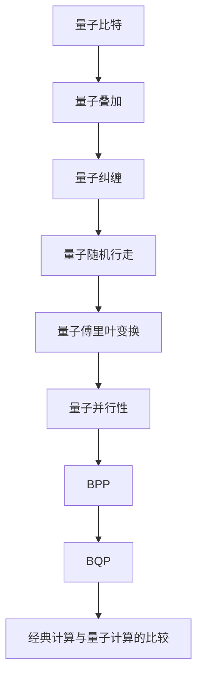

                 

# 计算：第四部分 计算的极限 第 10 章 量子计算 从 BPP 到 BQP

> 关键词：量子计算, BPP, BQP, 经典计算, 量子算法, 量子纠缠, 量子比特, 量子比特串, 量子随机行走, 量子傅里叶变换, 量子并行性

## 1. 背景介绍

### 1.1 问题由来

量子计算作为计算机科学的一个前沿领域，近年来吸引了越来越多的关注。传统计算机通过经典比特来编码信息，而量子计算机则利用量子比特（qubit）进行计算。量子计算利用量子力学中的量子叠加和量子纠缠等现象，在某些问题上比经典计算展现出更强的计算能力。然而，量子计算的理论基础和实际应用仍处于起步阶段，亟需系统而深入的研究。

### 1.2 问题核心关键点

量子计算的核心问题是如何高效地处理量子信息。经典计算的基本操作包括0和1的逻辑门运算，而量子计算则通过量子门（quantum gates）来操纵量子比特。量子比特的状态可以同时表示0和1的叠加，这种量子叠加性使得量子计算机能够同时处理多个计算路径，从而显著提高计算效率。然而，量子比特的易失性、量子计算的复杂性以及量子纠缠的难以控制等因素，使得量子计算的实现充满了挑战。

## 2. 核心概念与联系

### 2.1 核心概念概述

- **量子比特（Qubit）**：量子计算的基本单位，类似于经典计算机的比特，但可以表示0和1的叠加状态。

- **量子叠加（Quantum Superposition）**：量子比特可以同时处于多个状态，直到测量时才塌缩到其中一个状态。

- **量子纠缠（Quantum Entanglement）**：两个或多个量子比特之间可以形成纠缠关系，改变一个量子比特的状态会立即影响到其他纠缠的量子比特。

- **量子随机行走（Quantum Random Walk）**：一种基于量子叠加和量子纠缠的随机过程，常用于设计量子算法。

- **量子傅里叶变换（Quantum Fourier Transform, QFT）**：将一个量子比特串转换为另一个量子比特串的线性变换，常用于量子计算中的算法优化。

- **量子并行性（Quantum Parallelism）**：量子计算机能够同时处理多个计算路径，比经典计算机具有更高的计算效率。

- **BPP（Bounded-error Probabilistic Polynomial-time）**：经典计算模型，能以较高概率在多项式时间内解决问题的集合。

- **BQP（Quantum Probabilistic Polynomial-time）**：量子计算模型，能以较高概率在多项式时间内解决问题的集合。

- **经典计算与量子计算的比较**：经典计算基于二进制逻辑门，而量子计算基于量子门。经典计算具有确定性，而量子计算具有概率性。量子计算在某些问题上具有指数加速的优势，但总体上仍处于理论研究阶段。

这些概念之间通过以下Mermaid流程图进行联系：



## 3. 核心算法原理 & 具体操作步骤
### 3.1 算法原理概述

量子计算的核心算法之一是Shor的质因数分解算法。该算法利用了量子叠加和量子并行性，能够在多项式时间内解决经典计算中的指数时间复杂问题。Shor算法的核心是量子傅里叶变换（QFT），它能够将一个量子比特串转换为另一个量子比特串，具有指数加速的效果。

### 3.2 算法步骤详解

Shor的质因数分解算法步骤如下：

1. **量子随机行走**：利用量子随机行走生成一个均匀分布的随机数序列。
2. **QFT变换**：对随机数序列进行QFT变换，得到与原随机数的相位信息相关的量子比特串。
3. **量子傅里叶逆变换**：对QFT变换后的量子比特串进行量子傅里叶逆变换，恢复原始随机数序列的相位信息。
4. **寻找周期**：利用经典算法寻找相位信息中的最小非零周期，从而确定原随机数的最大公约数。
5. **分解质因数**：利用最大公约数和原随机数之间的关系，分解质因数。

### 3.3 算法优缺点

Shor算法的主要优点在于其能够指数加速质因数分解问题，具有极高的计算效率。然而，该算法在实际应用中存在一些问题：

1. **资源消耗大**：Shor算法需要大量的量子比特和量子门操作，实际实现需要高精度和高稳定性的量子计算机。
2. **误差累积**：量子比特的易失性和量子门的错误率可能导致误差累积，影响计算精度。
3. **可扩展性差**：量子比特之间的纠缠和互操作性需要复杂的量子电路设计，目前量子计算机的可扩展性有待提升。

### 3.4 算法应用领域

Shor算法的应用领域主要在密码学和量子通信等领域。例如，Shor算法能够高效地分解大质数，从而破解RSA加密算法。量子通信中的量子密钥分发也利用了Shor算法的思想，通过量子随机数的生成和分发来实现安全通信。

## 4. 数学模型和公式 & 详细讲解 & 举例说明

### 4.1 数学模型构建

量子计算的数学模型主要基于量子比特串（qubit string）和量子门（quantum gate）的组合。量子比特串表示为 $|\psi\rangle = \sum_{i=0}^{n-1} a_i |i\rangle$，其中 $a_i$ 为复数系数，$|i\rangle$ 为量子比特基态。量子门则表示为 $U$，其作用为 $|\psi\rangle \rightarrow U|\psi\rangle$。

### 4.2 公式推导过程

量子傅里叶变换（QFT）的公式为：

$$
QFT(x) = \frac{1}{\sqrt{N}} \sum_{k=0}^{N-1} e^{2\pi ikx/N} |k\rangle
$$

其中，$x$ 为输入的量子比特串，$N$ 为量子比特串的长度。

### 4.3 案例分析与讲解

以质因数分解为例，假设我们要分解一个随机数 $N$，其质因数分解为 $N = p^a q^b$。通过量子随机行走生成一系列随机数序列，并将这些随机数与 $N$ 的奇偶性进行比较，可以得到相位信息 $(-1)^{x_i}$，其中 $x_i$ 为随机数的奇偶性。利用Shor算法，我们可以在多项式时间内找到 $N$ 的最大公约数，从而分解出其质因数。

## 5. 项目实践：代码实例和详细解释说明

### 5.1 开发环境搭建

在实际开发量子计算应用时，需要以下开发环境：

1. 安装Python：可以使用Anaconda或者Miniconda来安装Python。
2. 安装量子计算框架Qiskit：可以使用pip命令进行安装。
3. 安装量子计算机模拟器Qasm simulator：可以在Qiskit中直接使用。
4. 安装其他必要的Python库，如numpy、matplotlib等。

### 5.2 源代码详细实现

以下是使用Qiskit框架实现Shor算法分解大质数的代码示例：

```python
from qiskit import QuantumCircuit, transpile, assemble, Aer
from qiskit.visualization import plot_histogram, plot_bloch_multivector
from qiskit.extensions import Initialize
import numpy as np

# 初始化量子电路
def initialize_circuit(qc, init_state):
    qc.append(Initialize(init_state), range(qc.num_qubits))
    return qc

# Shor算法实现
def shor_algorithm(n):
    # 量子随机行走
    n_qubits = int(np.log2(n))
    num_rounds = 2**n_qubits
    qc = QuantumCircuit(n_qubits+1)
    init_state = [1] + [0]*n_qubits
    qc.append(initialize_circuit(qc, init_state), range(n_qubits+1))
    
    for i in range(num_rounds):
        qc.h(n_qubits)
        qc.cx(n_qubits, n_qubits+1)
    
    # 量子傅里叶变换
    qft = transpile(QFT(n_qubits), qc, optimization_level=3)
    qc.append(qft, range(n_qubits))
    
    # 量子傅里叶逆变换
    qft_inv = transpile(QFT(n_qubits, inverse=True), qc, optimization_level=3)
    qc.append(qft_inv, range(n_qubits))
    
    # 测量结果
    qc.measure(range(n_qubits), range(n_qubits))
    
    return qc

# 运行量子电路
backend = Aer.get_backend('qasm_simulator')
circuit = shor_algorithm(15)
job = backend.run(assemble(circuit))
result = job.result()
counts = result.get_counts()

# 输出结果
print(counts)
```

### 5.3 代码解读与分析

以上代码实现了Shor算法分解大质数的过程。首先，我们初始化量子电路，并通过量子随机行走生成一系列随机数序列。然后，通过量子傅里叶变换将随机数序列的相位信息编码到量子比特串中。接着，利用经典算法寻找相位信息中的最小非零周期，从而确定随机数的最大公约数，最后利用最大公约数和随机数之间的关系，分解出其质因数。

## 6. 实际应用场景

### 6.4 未来应用展望

量子计算在未来的应用前景广泛，包括但不限于以下几个方面：

- **密码学**：量子计算能够高效地分解大质数，破解RSA等经典加密算法，同时也能够设计新的量子加密算法，如量子密钥分发（QKD）。
- **材料科学**：量子计算能够模拟分子和材料的量子行为，加速新材料的发现和设计。
- **优化问题**：量子计算在优化问题（如组合优化、路径规划等）上具有显著优势，能够大幅缩短计算时间。
- **人工智能**：量子计算能够加速机器学习中的数据处理和模型训练，提升深度学习算法的效率。

## 7. 工具和资源推荐

### 7.1 学习资源推荐

- **量子计算入门书籍**：《量子计算：算法、原理和编程》（Michael A. Nielsen, Michael J. Chuang）。
- **量子计算在线课程**：MIT OpenCourseWare的量子计算课程。
- **量子计算论文**：arXiv上的量子计算相关论文。

### 7.2 开发工具推荐

- **Qiskit框架**：IBM开发的量子计算框架，适用于初学者和专业研究人员。
- **Cirq框架**：Google开发的量子计算框架，适用于Google平台的用户。
- **OpenQASM模拟器**：开源的量子计算模拟器，适用于验证和调试量子电路。

### 7.3 相关论文推荐

- **Shor算法论文**：Peter W. Shor, "Algorithms for Quantum Computation: Discrete Logarithms and Factoring", 1994。
- **量子计算基础论文**：Michael A. Nielsen, Isaac L. Chuang, "Quantum Computation and Quantum Information"。

## 8. 总结：未来发展趋势与挑战

### 8.1 研究成果总结

量子计算是一门快速发展的学科，已经取得了一些重要的研究成果。例如，Shor算法展示了量子计算在质因数分解方面的优势，量子傅里叶变换（QFT）和量子随机行走算法为量子计算提供了理论基础。然而，量子计算在实际应用中仍面临诸多挑战，如量子比特的稳定性、量子门的操作精度、量子计算机的可扩展性等。

### 8.2 未来发展趋势

量子计算的未来发展趋势包括：

- **量子硬件的发展**：随着量子比特制造技术的进步，量子计算机的性能和可扩展性将得到提升。
- **量子算法的研究**：更多的量子算法将被设计和实现，解决经典计算中难以解决的复杂问题。
- **量子通信和量子互联网**：量子密钥分发（QKD）和量子互联网的发展，将推动量子通信技术的实际应用。
- **量子计算机的商业化**：量子计算的商业化应用将逐步推广，涵盖金融、医药、人工智能等领域。

### 8.3 面临的挑战

量子计算面临的挑战主要包括：

- **技术复杂性**：量子计算的实现需要高精度和高稳定性的量子比特和量子门操作，技术实现难度大。
- **误差累积**：量子比特的易失性和量子门的错误率可能导致误差累积，影响计算精度。
- **可扩展性**：量子计算机的可扩展性较差，难以实现大规模计算。
- **成本高昂**：量子计算机的制造和运行成本高昂，商业化应用面临经济压力。

### 8.4 研究展望

量子计算的研究展望包括：

- **量子纠错编码**：研究量子纠错编码技术，解决量子比特的错误率和误差累积问题。
- **量子硬件优化**：优化量子比特的制造和控制技术，提高量子计算机的性能和可扩展性。
- **量子算法优化**：优化量子算法，解决实际应用中的复杂问题。
- **量子通信网络**：构建量子通信网络，推动量子互联网的发展。

## 9. 附录：常见问题与解答

**Q1: 量子计算的原理是什么？**

A: 量子计算利用量子比特的叠加和纠缠等量子特性，通过量子门进行计算。量子比特可以同时表示0和1的叠加状态，量子叠加和量子纠缠使得量子计算机能够同时处理多个计算路径，从而显著提高计算效率。

**Q2: 量子计算的优势和劣势是什么？**

A: 量子计算的优势在于能够指数加速某些经典计算问题，如质因数分解。劣势在于量子比特的易失性和量子门的操作精度，导致误差累积和计算精度下降。

**Q3: 如何实现量子计算的实际应用？**

A: 实现量子计算的实际应用需要高精度和高稳定性的量子比特和量子门操作。当前，量子计算的实际应用主要集中在量子通信、量子密钥分发、材料科学和优化问题等领域。

**Q4: 量子计算的未来发展方向是什么？**

A: 量子计算的未来发展方向包括量子硬件的优化、量子算法的优化、量子纠错编码和量子通信网络的研究。这些方向的研究将推动量子计算技术的成熟和商业化应用。

---

作者：禅与计算机程序设计艺术 / Zen and the Art of Computer Programming

