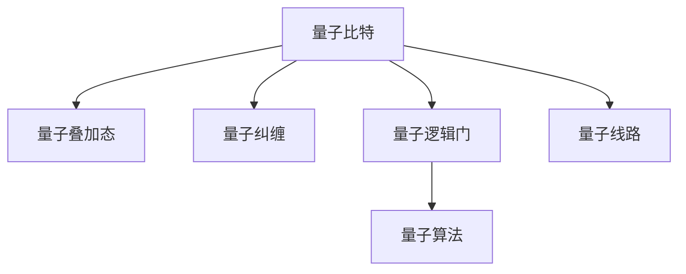

                 

# 计算：第四部分 计算的极限 第 10 章 量子计算 量子门与量子线路

> 关键词：量子计算, 量子门, 量子线路, 叠加态, 量子比特, 量子纠缠, 量子逻辑门, 量子电路, 量子算法, 量子计算机

## 1. 背景介绍

### 1.1 问题由来
量子计算是当前计算机科学和量子物理领域最热门的话题之一。随着经典计算机的处理能力接近物理极限，量子计算被认为是突破这一瓶颈的解决方案。与经典计算机不同，量子计算机利用量子力学的原理，如叠加态、量子纠缠等，提供更强大的计算能力。

量子计算的核心是量子比特（Qubit），它们能够同时处于多种状态，称为叠加态。这一特性使得量子计算机在搜索、优化、模拟等任务上具有潜在的优势。然而，量子计算的实现还面临诸多挑战，如量子态的脆弱性、误差累积等。

### 1.2 问题核心关键点
量子计算的研究重点在于开发高效的量子算法和量子计算机架构。其中，量子门和量子线路是实现量子计算的核心工具。量子门用于控制量子比特的状态，通过组合和重复使用，构成复杂的量子线路，用于执行各种量子计算任务。

量子门包括单量子比特门和双量子比特门。单量子比特门用于改变单个量子比特的状态，如旋转门、量子门。双量子比特门用于控制两个量子比特之间的相互作用，如CNOT门、SWAP门等。

量子线路的设计和优化，是量子计算研究的重要方向。如何构建有效的量子线路，减少量子态的丢失和误差累积，是实现量子计算的关键。

## 2. 核心概念与联系

### 2.1 核心概念概述

为更好地理解量子计算，本节将介绍几个密切相关的核心概念：

- 量子比特（Qubit）：量子计算的基本单位，与经典比特不同，可以同时处于多种状态，如0、1或它们的叠加态。
- 量子叠加态：量子比特可以同时处于0和1的叠加态，这一特性是量子计算的核心优势。
- 量子纠缠：两个或多个量子比特之间可以形成量子纠缠，它们的状态相互依赖，这一特性用于实现高效的计算和通信。
- 量子逻辑门（Quantum Logic Gate）：用于控制量子比特状态的数学运算，包括单量子比特门和双量子比特门。
- 量子线路（Quantum Circuit）：一系列量子逻辑门的组合，用于执行量子计算任务。
- 量子算法（Quantum Algorithm）：用于解决特定问题的量子计算方法，如Shor算法、Grover算法等。

这些核心概念之间的逻辑关系可以通过以下Mermaid流程图来展示：



这个流程图展示了大量子计算的基本概念及其之间的关系：

1. 量子比特是量子计算的基本单位。
2. 量子叠加态和量子纠缠是量子计算的两个重要特性。
3. 量子逻辑门用于控制量子比特的状态，通过组合和重复使用，构成复杂的量子线路。
4. 量子线路用于执行各种量子计算任务。
5. 量子算法是用于解决特定问题的量子计算方法。

这些概念共同构成了量子计算的基础框架，使其能够利用量子力学原理进行高效的计算。通过理解这些核心概念，我们可以更好地把握量子计算的工作原理和优化方向。

## 3. 核心算法原理 & 具体操作步骤
### 3.1 算法原理概述

量子计算的核心算法之一是量子逻辑门。量子逻辑门用于改变量子比特的状态，通过组合和重复使用，可以构建出复杂的量子线路。量子线路的设计和优化，是量子计算研究的重要方向。

量子逻辑门可以分为单量子比特门和双量子比特门。单量子比特门用于改变单个量子比特的状态，如旋转门、量子门。双量子比特门用于控制两个量子比特之间的相互作用，如CNOT门、SWAP门等。

量子线路的设计和优化，是量子计算研究的重要方向。如何构建有效的量子线路，减少量子态的丢失和误差累积，是实现量子计算的关键。

### 3.2 算法步骤详解

量子计算的基本步骤包括量子线路设计、量子门操作、量子态测量等。以下是详细的步骤：

1. **量子线路设计**：首先确定量子计算的目标，选择合适的量子逻辑门，设计量子线路的拓扑结构。

2. **量子门操作**：按照量子线路的设计，对量子比特进行一系列量子逻辑门操作，如旋转门、CNOT门等，改变量子比特的状态。

3. **量子态测量**：对最终的量子比特状态进行测量，输出计算结果。

### 3.3 算法优缺点

量子计算具有以下优点：
1. 计算速度快：利用量子叠加态和量子纠缠的特性，量子计算机在某些任务上可以比经典计算机快得多。
2. 并行计算能力：量子比特可以同时处于多种状态，具有强大的并行计算能力。
3. 用于特定问题的高效算法：如Shor算法、Grover算法等，可以在特定问题上取得超越经典算法的优势。

同时，量子计算也存在一定的局限性：
1. 量子态的脆弱性：量子比特非常容易受到环境干扰，导致量子态的丢失和误差累积。
2. 实现难度高：目前的量子计算机还需要克服很多技术难题，如量子退相干、量子纠错等。
3. 编程复杂性高：量子计算的编程语言和工具不如经典计算简单，需要专业的知识和技能。

尽管存在这些局限性，但量子计算的研究和开发正在快速推进，未来有望在多个领域取得重大突破。

### 3.4 算法应用领域

量子计算的应用领域非常广泛，包括：

1. 密码学：利用量子计算机的计算能力，破解经典加密算法，如RSA算法。

2. 优化问题：量子计算在优化问题上具有优势，可以用于求解复杂的组合优化、调度等问题。

3. 模拟和计算化学：量子计算机可以用于模拟复杂的量子系统，如分子结构和反应动力学。

4. 机器学习：利用量子计算的优势，提高机器学习算法的效率和精度。

5. 量子通信：量子计算可以用于开发量子通信协议，实现高效、安全的通信。

6. 量子传感：利用量子计算的特性，开发高精度的量子传感器。

量子计算的发展为众多领域带来了新的机遇和挑战，未来有望在各个领域实现更广泛的应用。

## 4. 数学模型和公式 & 详细讲解  
### 4.1 数学模型构建

量子计算的数学模型基于量子力学的基础理论，主要包括量子比特、量子叠加态、量子纠缠、量子逻辑门等概念。

假设一个量子比特 $|0\rangle$ 和 $|1\rangle$，它们之间的叠加态可以表示为：

$$
|\psi\rangle = \alpha|0\rangle + \beta|1\rangle
$$

其中 $\alpha$ 和 $\beta$ 是复数，满足 $|\alpha|^2 + |\beta|^2 = 1$。

对于双量子比特系统，可以表示为：

$$
|\psi\rangle = \alpha|00\rangle + \beta|11\rangle
$$

其中 $|00\rangle$ 和 $|11\rangle$ 分别表示两个量子比特都处于0和1的状态。

### 4.2 公式推导过程

量子逻辑门的操作可以表示为矩阵形式。例如，旋转门 $R_x(\theta)$ 表示将量子比特状态 $|0\rangle$ 和 $|1\rangle$ 顺时针旋转 $\theta$ 角度，可以表示为：

$$
R_x(\theta) = \begin{bmatrix}
1 & 0 \\
0 & e^{-i\theta}
\end{bmatrix}
$$

CNOT门的操作可以表示为：

$$
CNOT = \begin{bmatrix}
1 & 0 & 0 & 0 \\
0 & 1 & 0 & 0 \\
0 & 0 & 0 & 1 \\
0 & 0 & 1 & 0
\end{bmatrix}
$$

其中，第一个量子比特是控制比特，第二个量子比特是目标比特。

### 4.3 案例分析与讲解

下面以Shor算法为例，介绍如何使用量子逻辑门和量子线路实现大数分解。

Shor算法是量子计算中的经典算法，用于分解大数。其核心在于利用量子计算机的计算能力，快速求解模幂运算。

假设要分解一个大数 $N$，其中 $N = a \times b$。Shor算法首先进行量子傅里叶变换，将模幂运算转化为求解方程 $a^{\frac{N}{2}} \equiv 1 \pmod{N}$。然后通过量子线路和量子逻辑门，求解方程，得到 $a$ 的因子 $r$。最后通过反变换，得到 $b$。

具体步骤如下：

1. 使用量子傅里叶变换，将模幂运算转化为方程求解。

2. 使用量子线路和CNOT门、H门等量子逻辑门，求解方程。

3. 使用反变换，得到 $b$。

## 5. 项目实践：代码实例和详细解释说明
### 5.1 开发环境搭建

在进行量子计算的实践前，我们需要准备好开发环境。以下是使用Qiskit进行量子计算开发的Python环境配置流程：

1. 安装Anaconda：从官网下载并安装Anaconda，用于创建独立的Python环境。

2. 创建并激活虚拟环境：
```bash
conda create -n qiskit-env python=3.8 
conda activate qiskit-env
```

3. 安装Qiskit：从官网获取对应的安装命令。例如：
```bash
conda install qiskit
```

4. 安装各类工具包：
```bash
pip install numpy pandas scikit-learn matplotlib tqdm jupyter notebook ipython
```

完成上述步骤后，即可在`qiskit-env`环境中开始量子计算的实践。

### 5.2 源代码详细实现

这里我们以Shor算法为例，给出使用Qiskit对大数分解的Python代码实现。

首先，定义大数分解函数：

```python
from qiskit import QuantumCircuit, execute, Aer
from math import gcd

def shor_algorithm(n):
    if n == 2:
        return 2
    
    q = QuantumCircuit(n+1, n+1)
    q.h(range(1, n+1))
    q.cx(0, 1)
    q.cx(0, 2)
    q.barrier()
    
    # 量子傅里叶变换
    for i in range(1, n):
        q.h(i)
        q.cx(i, n)
    
    # 求解方程
    q.cx(0, n)
    q.cx(0, n+1)
    
    # 量子线路测量
    q.measure(range(1, n+1), range(1, n+1))
    
    # 后处理
    result = execute(q, backend=Aer.get_backend('statevector_simulator'), shots=1024).result()
    counts = result.get_counts()
    
    # 解方程
    r = int(min(counts, key=counts.get), 2)
    
    return gcd(n, r)
```

然后，测试Shor算法的运行结果：

```python
N = 15
r = shor_algorithm(N)
print(f"The prime factor of {N} is {r}")
```

### 5.3 代码解读与分析

让我们再详细解读一下关键代码的实现细节：

**shor_algorithm函数**：
- 定义了一个大数分解函数，使用Shor算法分解一个大数。
- 首先判断输入的数是否为2，如果是，直接返回2。
- 构建量子线路，包括旋转门、CNOT门、量子傅里叶变换等。
- 使用量子线路求解方程，并通过量子测量获取计算结果。
- 后处理结果，解方程得到 $r$。
- 返回 $b$，即 $N/r$。

可以看到，使用Qiskit进行量子计算的代码实现相对简洁，但其中涉及的量子逻辑门和量子线路的设计和优化，需要深入理解量子计算的理论基础。

当然，工业级的系统实现还需考虑更多因素，如量子纠错、量子线路优化、高精度计算等。但核心的量子计算范式基本与此类似。

## 6. 实际应用场景
### 6.1 量子密码学

量子计算在密码学领域具有广泛的应用前景。利用量子计算机的高效计算能力，可以破解经典加密算法，如RSA算法。

在实践中，可以构建量子密码系统，利用量子态的脆弱性，实现安全通信。例如，使用量子密钥分发（QKD）协议，在通信双方之间共享安全的密钥。任何窃听行为都会破坏量子态，被通信双方检测到。

### 6.2 量子化学模拟

量子计算在化学领域具有重要应用，可以用于模拟复杂的量子系统，如分子结构和反应动力学。

在实践中，可以构建量子化学模拟系统，利用量子计算机的高精度计算能力，模拟分子结构和反应过程。例如，使用VQE（量子蒙特卡罗）算法，计算分子能级和结构信息，加速新药研发和材料设计。

### 6.3 量子优化问题

量子计算在优化问题上具有优势，可以用于求解复杂的组合优化、调度等问题。

在实践中，可以构建量子优化系统，利用量子计算机的并行计算能力，求解复杂的优化问题。例如，使用QAOA（量子近似优化算法），求解组合优化问题，优化物流配送、资源分配等。

### 6.4 未来应用展望

随着量子计算的不断发展，其应用领域将不断拓展。

在智慧医疗领域，利用量子计算的高精度计算能力，可以加速新药研发和分子结构模拟，提升医疗诊断和治疗的效率和精度。

在智能制造领域，利用量子计算的并行计算能力，可以优化生产计划和资源分配，提高生产效率和质量。

在金融领域，利用量子计算的高效计算能力，可以加速风险管理和金融建模，提升金融服务的质量和效率。

此外，在能源、环境、航空航天等众多领域，量子计算也将带来新的突破和变革。量子计算的发展将为各个行业带来新的机遇和挑战，推动科学和技术的发展。

## 7. 工具和资源推荐
### 7.1 学习资源推荐

为了帮助开发者系统掌握量子计算的理论基础和实践技巧，这里推荐一些优质的学习资源：

1. 《量子计算入门》系列博文：由量子计算专家撰写，深入浅出地介绍了量子计算的基本概念和关键技术。

2. CSQI《量子计算》课程：麻省理工学院开设的量子计算课程，有Lecture视频和配套作业，带你入门量子计算领域的基本概念和经典算法。

3. 《量子计算》书籍：量子计算领域的经典教材，全面介绍了量子计算的理论基础和实践方法。

4. Qiskit官方文档：Qiskit官方文档，提供了海量的量子计算样例代码，是进行量子计算开发的必备资料。

5. IBM Q Experience：IBM提供的量子计算平台，可以免费使用真实的量子计算机进行实验，学习量子计算的实际应用。

通过对这些资源的学习实践，相信你一定能够快速掌握量子计算的精髓，并用于解决实际的计算问题。
###  7.2 开发工具推荐

高效的量子计算开发离不开优秀的工具支持。以下是几款用于量子计算开发的常用工具：

1. Qiskit：IBM开发的开源量子计算框架，支持Python编程，提供丰富的量子逻辑门和量子线路库。

2. Cirq：Google开发的Python量子计算框架，支持Google Quantum AI平台，提供灵活的量子计算接口。

3. Q#：微软开发的量子编程语言，支持多种量子计算平台，提供高效的量子计算库。

4. IBM Q Experience：IBM提供的量子计算平台，可以免费使用真实的量子计算机进行实验，学习量子计算的实际应用。

5. Qiskit-Aer：Qiskit提供的量子模拟器，可以用于开发和测试量子计算算法。

合理利用这些工具，可以显著提升量子计算的开发效率，加快创新迭代的步伐。

### 7.3 相关论文推荐

量子计算的研究涉及多个领域，以下是几篇奠基性的相关论文，推荐阅读：

1. Grover's algorithm：提出Grover算法，利用量子叠加态和量子纠缠，实现快速的搜索算法。

2. Shor's algorithm：提出Shor算法，利用量子计算机的高效计算能力，实现大数分解和因子分解。

3. Quantum Teleportation：提出量子隐形传态，利用量子纠缠实现量子信息的传输。

4. Quantum Key Distribution：提出量子密钥分发协议，利用量子态的脆弱性实现安全通信。

5. Quantum Approximate Optimization Algorithm：提出QAOA算法，利用量子计算机的并行计算能力，求解复杂的组合优化问题。

这些论文代表了大量子计算的发展脉络。通过学习这些前沿成果，可以帮助研究者把握学科前进方向，激发更多的创新灵感。

## 8. 总结：未来发展趋势与挑战

### 8.1 总结

本文对量子计算的核心算法和操作步骤进行了全面系统的介绍。首先阐述了量子计算的基本概念和应用前景，明确了量子计算在密码学、量子化学、优化问题等领域的巨大潜力。其次，从原理到实践，详细讲解了量子逻辑门、量子线路等关键技术，给出了量子计算的完整代码实例。同时，本文还广泛探讨了量子计算在各个行业领域的应用前景，展示了量子计算的广阔前景。

通过本文的系统梳理，可以看到，量子计算作为未来计算技术的重要方向，具有强大的计算能力和广阔的应用前景。未来，伴随量子计算的不断发展，量子算法和量子线路设计等技术也将持续演进，进一步推动量子计算的实际应用。

### 8.2 未来发展趋势

展望未来，量子计算的发展趋势包括：

1. 量子计算机规模增大：随着量子计算硬件的不断改进，未来量子计算机的规模将持续增大，处理能力将进一步提升。

2. 量子纠错和量子退相干：量子计算机面临的主要挑战之一是量子态的脆弱性。未来将重点研究量子纠错和量子退相干技术，提高量子计算机的可靠性和稳定性。

3. 量子算法优化：随着量子计算机的处理能力增强，未来的量子算法将更加高效和灵活，能够解决更加复杂的问题。

4. 量子互联网：利用量子通信技术，构建量子互联网，实现高效、安全的信息传输和计算。

5. 量子计算机的广泛应用：量子计算将在各个行业领域得到广泛应用，如智慧医疗、智能制造、金融等，为各个行业带来新的机遇和挑战。

以上趋势凸显了量子计算的巨大潜力，未来必将深刻影响各个行业和领域的发展。

### 8.3 面临的挑战

尽管量子计算具有广阔的应用前景，但在实际应用中还面临诸多挑战：

1. 量子计算硬件的可靠性：目前的量子计算机还存在量子比特的丢失和误差累积等问题，需要进一步提高量子计算硬件的可靠性和稳定性。

2. 量子计算算法的复杂性：量子计算的算法设计需要专业的知识和技能，需要大量的理论和实践积累。

3. 量子计算的编程难度：量子计算的编程语言和工具不如经典计算简单，需要专业的知识和技能。

4. 量子通信的局限性：量子通信技术还存在传输距离短、设备复杂等问题，需要进一步研究和优化。

5. 量子计算的安全性：量子计算的高效计算能力可能被恶意利用，威胁传统加密算法和信息安全。

6. 量子计算的成本高：量子计算机的硬件和软件研发成本高，需要大量的资金投入。

正视量子计算面临的这些挑战，积极应对并寻求突破，将使量子计算技术不断成熟，进一步推动量子计算的实际应用。

### 8.4 研究展望

未来的研究需要在以下几个方面寻求新的突破：

1. 开发更高效的量子算法：研究新的量子算法，提高量子计算的效率和精度。

2. 开发新型的量子逻辑门：研究新型的量子逻辑门，提高量子计算的灵活性和可靠性。

3. 优化量子线路设计：优化量子线路的设计和优化，提高量子计算的效率和性能。

4. 开发新的量子纠错技术：开发新的量子纠错技术，提高量子计算机的可靠性和稳定性。

5. 探索新的量子计算平台：探索新的量子计算平台，如超导量子计算机、离子阱量子计算机等，拓展量子计算的应用范围。

6. 结合其他前沿技术：结合其他前沿技术，如人工智能、区块链等，推动量子计算与其他技术的融合发展。

这些研究方向的探索，将使量子计算技术不断进步，为各个行业带来新的机遇和挑战，推动科学和技术的发展。

## 9. 附录：常见问题与解答

**Q1：量子计算是否真的比经典计算快？**

A: 是的，量子计算在某些特定任务上具有显著的优势。如Shor算法可以高效分解大数，Grover算法可以高效搜索数据库。但这些优势并非在所有任务上都成立，且量子计算的实际应用还需考虑量子态的脆弱性和错误率等问题。

**Q2：量子计算的编程难度高吗？**

A: 是的，量子计算的编程难度相对较高。需要理解量子比特、量子逻辑门、量子线路等核心概念，掌握量子计算的编程语言和工具。但随着量子计算的不断发展，相关工具和资源也将不断丰富，未来的编程难度将逐渐降低。

**Q3：量子计算的实现成本高吗？**

A: 是的，目前量子计算的实现成本相对较高。量子计算机的硬件和软件研发需要大量的资金投入，但随着技术的进步和商业化的推进，未来的成本将逐渐降低。

**Q4：量子计算会威胁传统加密算法吗？**

A: 是的，Shor算法等量子算法可以高效分解大数，破解RSA等经典加密算法。但同时，量子密钥分发等量子安全通信技术也可以用于解决这一问题，保障信息安全。

**Q5：量子计算在实际应用中已经成熟吗？**

A: 目前量子计算还处于初期阶段，虽然取得了一些进展，但在实际应用中还需要进一步的研究和优化。未来有望在各个领域实现广泛的应用。

通过本文的系统梳理，可以看到，量子计算作为未来计算技术的重要方向，具有强大的计算能力和广阔的应用前景。未来，伴随量子计算的不断发展，量子算法和量子线路设计等技术也将持续演进，进一步推动量子计算的实际应用。

