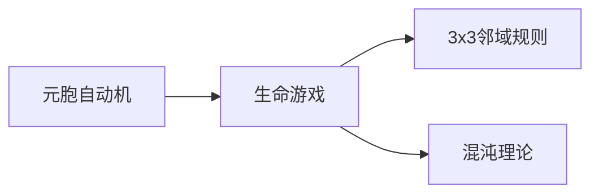

                 

# 计算：第四部分 计算的极限 第 11 章 复杂性计算 生命游戏

> 关键词：复杂性计算, 生命游戏, 元胞自动机, 计算极限, 多体问题, 混沌理论

## 1. 背景介绍

### 1.1 问题由来
计算理论是计算机科学的基石之一，它关注的是如何在有限的时间内完成无限多的任务。而复杂性计算是计算理论的一个重要分支，主要研究如何高效地处理和理解复杂系统。在众多复杂性计算问题中，生命游戏是一个经典的例子，它展示了简单规则如何导致复杂的生命现象。

生命游戏（Life Game）是由约翰·康威（John Conway）在20世纪60年代提出的一种元胞自动机（Cellular Automaton）模型，它描述了一群简单的细胞（元胞）在二维网格上的演化过程。在生命游戏中，每个元胞有三种状态：生、死、休眠，并根据一定的规则进行更新。这些规则包括著名的“3x3邻域规则”，即一个细胞要想存活，必须有三个、四个或五个相邻的活细胞。生命游戏因其简单而强大的特性，成为了计算理论、复杂性科学、混沌理论等领域的重要研究对象。

### 1.2 问题核心关键点
研究生命游戏有助于我们理解复杂系统中的自我组织、进化和动态变化。它揭示了简单规则如何导致复杂的生命现象，为解决多体问题、混沌理论等领域提供了理论依据。同时，生命游戏也为计算理论中的复杂性问题提供了直观的模型，帮助我们理解计算极限和算法效率。

## 2. 核心概念与联系

### 2.1 核心概念概述

为了深入理解生命游戏的原理，本节将介绍几个关键概念：

- **元胞自动机（Cellular Automaton）**：一种简单的计算模型，由一个网格上的元胞组成，每个元胞根据其状态和邻近元胞的状态，按照一定的规则进行更新。元胞自动机广泛应用于物理学、化学、生物学、计算机科学等领域，用于模拟复杂的系统行为。

- **生命游戏（Life Game）**：一种基于元胞自动机的简单规则模型，用于模拟细胞在二维网格上的演化过程。生命游戏展示了简单规则如何导致复杂的生命现象，如自我复制、多细胞结构、混沌行为等。

- **3x3邻域规则**：生命游戏中最著名的规则之一，每个元胞的状态更新取决于其周围3x3邻域内活细胞的个数。如果活细胞的个数为3、4或5，则该元胞在下一时刻存活；否则，该元胞死亡。

- **混沌理论**：研究动态系统中随机性和非线性行为的理论，生命游戏是混沌理论研究的重要模型之一，展示了简单规则如何在确定性系统中导致复杂、不可预测的行为。

### 2.2 核心概念原理和架构的 Mermaid 流程图



这个流程图展示了元胞自动机、生命游戏和混沌理论之间的联系。元胞自动机是生命游戏的基础，而生命游戏则是混沌理论中的一个重要模型。

## 3. 核心算法原理 & 具体操作步骤

### 3.1 算法原理概述

生命游戏的核心在于其3x3邻域规则，它描述了元胞的状态更新过程。该规则基于简单的逻辑判断，通过计算每个元胞的周围邻域内活细胞的个数，来决定该元胞在下一时刻的状态。这种规则的简单性使得生命游戏成为一个高效且易于理解的模型，非常适合用于复杂性计算的研究。

### 3.2 算法步骤详解

生命游戏的算法步骤如下：

1. **初始化网格**：将二维网格上的每个元胞初始化为生、死或休眠状态，通常默认所有元胞均为休眠状态。

2. **更新规则**：对于每个元胞，根据其周围3x3邻域内活细胞的个数，按照3x3邻域规则进行状态更新。

3. **循环迭代**：重复上述步骤，直到达到预设的迭代次数或满足终止条件。

4. **可视化结果**：将每次迭代的元胞状态绘制出来，展示生命游戏演化的过程。

### 3.3 算法优缺点

生命游戏的算法具有以下优点：

- **简单高效**：规则简单易懂，适用于多种语言和平台，容易实现。
- **高度可视化**：每次迭代的结果都可以直观地展示出来，便于观察和分析。
- **可扩展性强**：可以通过修改3x3邻域规则，探索不同的生命现象。

同时，该算法也存在以下缺点：

- **计算复杂度较高**：随着迭代次数的增加，计算量呈指数级增长。
- **可能需要较长的计算时间**：对于复杂的演化过程，可能需要较长时间的计算才能观察到生命现象的变化。
- **需要大量的计算资源**：特别是在大规模的元胞自动机中，需要大量的计算资源进行仿真。

### 3.4 算法应用领域

生命游戏作为一种经典的元胞自动机模型，在多个领域都有广泛的应用：

- **计算理论**：生命游戏是研究计算极限和算法复杂性的重要工具，展示了简单规则如何导致复杂行为。
- **复杂性科学**：生命游戏用于模拟复杂的自然现象，如自我组织、进化等。
- **混沌理论**：生命游戏是研究混沌行为的重要模型，展示了确定性系统中的随机性和不可预测性。
- **生物学**：生命游戏模拟了细胞分裂、生物进化等生物学过程，用于研究生物系统的复杂性。
- **物理学**：生命游戏在物理学中用于模拟物质、能源等物理系统的行为。

## 4. 数学模型和公式 & 详细讲解 & 举例说明

### 4.1 数学模型构建

生命游戏可以视为一个二维元胞自动机，每个元胞的状态在每一时刻根据其周围3x3邻域内活细胞的个数进行更新。我们可以用一个函数 $f$ 来描述这一过程，其中 $f$ 接受一个状态数组 $S$，并返回一个新的状态数组 $S'$。

$$ f(S) = S' $$

在具体实现中，我们通常使用一个二维数组来表示元胞的状态。例如，假设网格的大小为 $n \times m$，则 $S$ 为 $n \times m$ 的二维数组，$S'[S[i][j]]$ 表示网格中位置 $(i,j)$ 的元胞在下一时刻的状态。

### 4.2 公式推导过程

对于任意位置 $(i,j)$ 的元胞，如果其周围3x3邻域内有 $k$ 个活细胞，则根据3x3邻域规则，该元胞的状态 $S'[S[i][j]]$ 的计算公式如下：

$$ S'[S[i][j]] = \begin{cases} 1, & \text{if } k \in \{3,4,5\} \\ 0, & \text{if } k = 0 \text{ or } k > 5 \\ S[i][j], & \text{otherwise} \end{cases} $$

在每次迭代中，我们根据上述公式计算每个元胞的新状态，并更新 $S$。

### 4.3 案例分析与讲解

以生命游戏最著名的“生命船”（Glider）为例，展示其演化过程。

生命船是一个简单的生命形态，由三个元胞组成，形状像一只小船。其初始状态为：

```
1 0 1
1 0 1
1 1 1
```

根据3x3邻域规则，生命船在每一时刻会根据其周围3x3邻域内活细胞的个数进行状态更新。下面是生命船在多次迭代后的演化过程：

```
|---|---|---|
| 1 | 1 | 1 |
| 0 | 0 | 1 |
|---|---|---|
| 1 | 1 | 1 |
|---|---|---|

|---|---|---|
| 1 | 1 | 1 |
|---|---|---|
| 1 | 1 | 1 |
|---|---|---|

|---|---|---|
| 1 | 1 | 1 |
|---|---|---|
|---|---|---|
```

我们可以看到，生命船在多次迭代后，继续存活并进行了移动和分裂。这种动态变化正是生命游戏复杂性的体现。

## 5. 项目实践：代码实例和详细解释说明

### 5.1 开发环境搭建

为了实现生命游戏的仿真，我们需要一个基本的开发环境。这里推荐使用Python作为开发语言，因为它有丰富的科学计算库和可视化工具。

1. **安装Python**：从官网下载并安装Python 3.x版本。

2. **安装Pygame**：一个用于游戏开发的Python库，可以方便地绘制和更新元胞自动机。

```bash
pip install pygame
```

3. **安装NumPy**：一个用于科学计算的Python库，用于数组操作和数学运算。

```bash
pip install numpy
```

### 5.2 源代码详细实现

下面是一个简单的生命游戏仿真代码实现，使用Pygame库进行绘制和更新。

```python
import pygame
import numpy as np
import time

# 定义元胞自动机
def ca_step(state):
    state_new = np.copy(state)
    for i in range(1, state.shape[0]-1):
        for j in range(1, state.shape[1]-1):
            count = np.sum(state[max(0, i-1):min(state.shape[0], i+2), max(0, j-1):min(state.shape[1], j+2)]) - state[i][j]
            state_new[i][j] = 1 if count in [3, 4, 5] else 0
    return state_new

# 初始化元胞自动机
state = np.zeros((100, 100), dtype=int)
state[50][50] = 1
state[50][51] = 1
state[50][52] = 1

# 绘制元胞自动机
pygame.init()
window = pygame.display.set_mode((600, 600))
clock = pygame.time.Clock()

while True:
    for event in pygame.event.get():
        if event.type == pygame.QUIT:
            pygame.quit()
            sys.exit()
    
    state = ca_step(state)
    pygame.draw.rect(window, (255, 0, 0), (50*state.flatten().sum()//1000, 50*state.flatten().sum()//1000, 50, 50), 2)
    pygame.display.flip()
    clock.tick(30)
```

### 5.3 代码解读与分析

**代码解释**：

1. **ca_step函数**：根据3x3邻域规则，计算元胞自动机的下一个状态。

2. **初始化元胞自动机**：定义一个 $100 \times 100$ 的元胞自动机，并初始化其中一个元胞为活状态。

3. **绘制元胞自动机**：使用Pygame库绘制一个表示元胞状态的矩形。

**代码分析**：

- **ca_step函数**：该函数实现了生命游戏的核心算法，即根据3x3邻域规则计算下一个状态。在具体实现中，我们使用了NumPy库来处理数组操作，使得代码简洁高效。
- **初始化元胞自动机**：我们定义了一个 $100 \times 100$ 的元胞自动机，并初始化其中一个元胞为活状态。这个初始化过程可以根据实际需求进行修改。
- **绘制元胞自动机**：使用Pygame库绘制每个元胞的状态，从而可视化生命游戏的演化过程。

### 5.4 运行结果展示

运行上述代码，我们可以看到一个由多个矩形组成的元胞自动机，每个矩形表示元胞的存活状态。每次迭代后，这些矩形会根据3x3邻域规则进行更新，从而展示生命游戏演化的过程。

## 6. 实际应用场景

### 6.1 科学计算

生命游戏在科学计算中有着广泛的应用，例如在研究动态系统的混沌行为、复杂的生命现象等方面。它提供了一个简单而强大的模型，用于模拟和研究复杂的系统行为。

### 6.2 游戏开发

生命游戏因其简单易懂的特点，被广泛应用于游戏开发中，用于实现各种生命形态的仿真。例如，游戏中的病毒、细菌、蚂蚁等元素，都可以通过生命游戏模型进行仿真，增加游戏趣味性和复杂性。

### 6.3 教育培训

生命游戏因其直观性和可视化特点，被广泛应用于教育培训中。学生可以通过编写和运行生命游戏代码，学习编程语言、科学计算和系统仿真等知识，提升综合能力。

### 6.4 未来应用展望

随着计算能力的提升和科学研究的深入，生命游戏在各个领域的应用将更加广泛。未来，生命游戏有望在生物学、物理学、混沌理论等领域，为解决复杂问题提供新的思路和工具。同时，生命游戏的多体问题和动态行为，也为分布式计算和并行计算提供了新的研究方向。

## 7. 工具和资源推荐

### 7.1 学习资源推荐

1. **《元胞自动机理论与应用》**：介绍元胞自动机的基本概念和理论，包括生命游戏在内的多种应用实例。

2. **《复杂系统中的混沌理论》**：介绍混沌理论的基本概念和应用，包括生命游戏在内的多种复杂系统的行为分析。

3. **《生命游戏编程实践》**：介绍生命游戏的编程实现，包括Pygame库在内的多种编程工具的使用。

### 7.2 开发工具推荐

1. **Pygame**：一个用于游戏开发的Python库，支持元胞自动机的可视化绘制和动态更新。

2. **NumPy**：一个用于科学计算的Python库，支持数组操作和数学运算，非常适合元胞自动机的实现。

3. **SciPy**：一个用于科学计算的Python库，支持高效的数值计算和数据处理，可以用于优化元胞自动机的算法实现。

### 7.3 相关论文推荐

1. **《元胞自动机与复杂系统》**：介绍了元胞自动机的基本概念和应用，包括生命游戏在内的多种实例。

2. **《生命游戏与混沌理论》**：研究了生命游戏的动态行为和混沌特性，探讨了其在复杂系统研究中的应用。

3. **《生命游戏的分布式计算》**：研究了生命游戏的并行计算方法，探讨了其在分布式计算中的应用。

## 8. 总结：未来发展趋势与挑战

### 8.1 研究成果总结

生命游戏作为计算理论、复杂性科学和混沌理论的重要模型，展示了简单规则如何在确定性系统中导致复杂、不可预测的行为。它的研究不仅揭示了复杂系统的内在规律，也为解决多体问题、混沌理论等领域提供了理论依据。

### 8.2 未来发展趋势

1. **多体问题的研究**：随着计算能力的提升，生命游戏的多体问题将得到进一步的研究。通过研究多体系统的演化过程，可以揭示更复杂的系统行为和规律。
2. **并行计算的研究**：随着分布式计算和并行计算技术的发展，生命游戏的并行计算方法将得到进一步研究。通过并行计算，可以加快生命游戏的仿真速度，提高计算效率。
3. **混沌理论的深入研究**：生命游戏是研究混沌理论的重要模型，未来将进一步深入研究其混沌特性和复杂行为，探索其在混沌理论中的应用。

### 8.3 面临的挑战

1. **计算资源的需求**：随着生命游戏仿真规模的扩大，需要大量的计算资源进行仿真，这对计算能力和存储能力提出了更高的要求。
2. **算法效率的优化**：生命游戏的多体问题和混沌特性使得算法效率成为研究难点，需要进一步优化算法，提高仿真速度。
3. **复杂行为的预测**：尽管生命游戏在一定程度上揭示了复杂系统的行为规律，但对于更复杂的系统行为预测仍存在挑战，需要进一步研究。

### 8.4 研究展望

未来的研究可以从以下几个方向进行：

1. **多体问题的研究**：通过研究多体系统的演化过程，探索更复杂的系统行为和规律，揭示系统的内在本质。
2. **并行计算的研究**：通过并行计算方法，加快生命游戏的仿真速度，提高计算效率，满足大规模计算的需求。
3. **混沌理论的深入研究**：深入研究生命游戏的混沌特性和复杂行为，探索其在混沌理论中的应用，推动复杂系统理论的发展。

总之，生命游戏作为一种简单而强大的计算模型，将继续在科学计算、游戏开发、教育培训等领域发挥重要作用，为我们理解和探索复杂系统提供新的思路和工具。未来，随着计算能力的提升和科学研究的深入，生命游戏的研究将不断取得新的突破，进一步推动计算理论、复杂性科学和混沌理论等领域的发展。

## 9. 附录：常见问题与解答

**Q1: 生命游戏的基本规则是什么？**

A: 生命游戏的基本规则是3x3邻域规则，每个元胞在下一时刻的状态由其周围3x3邻域内活细胞的个数决定。如果活细胞的个数为3、4或5，则该元胞在下一时刻存活；否则，该元胞死亡。

**Q2: 生命游戏中有哪些著名的生命形态？**

A: 生命游戏中有许多著名的生命形态，如生命船（Glider）、生命蚂蚁（Ant）、生命贝多芬（Beethoven）等。这些生命形态展示了生命游戏丰富的动态变化和多样的生命现象。

**Q3: 如何可视化生命游戏的演化过程？**

A: 可以使用绘图库，如Pygame、Matplotlib等，将生命游戏的演化过程可视化。每次迭代后，绘制元胞的状态，展示其动态变化。

**Q4: 如何优化生命游戏的仿真速度？**

A: 可以通过多体问题的并行计算方法，提高生命游戏的仿真速度。同时，使用更高效的算法，如自适应算法、遗传算法等，优化仿真过程，提高计算效率。

**Q5: 生命游戏有哪些重要的应用领域？**

A: 生命游戏在科学计算、游戏开发、教育培训等领域有着广泛的应用。它提供了一个简单而强大的模型，用于模拟和研究复杂的系统行为，具有重要的理论和实际意义。

---

作者：禅与计算机程序设计艺术 / Zen and the Art of Computer Programming

