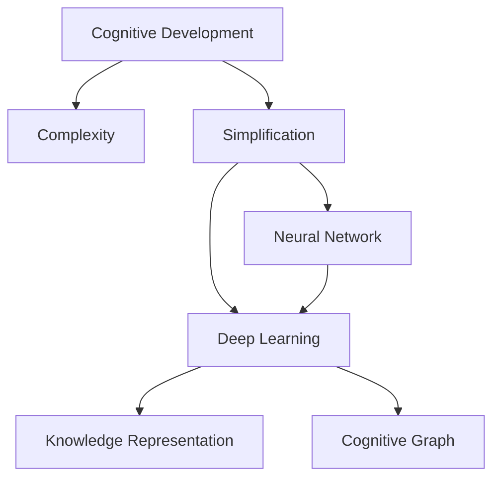

                 

# 认知发展的复杂化与简洁化

> 关键词：认知发展, 复杂化, 简洁化, 神经网络, 深度学习, 知识表示, 认知图谱

## 1. 背景介绍

### 1.1 问题由来
随着人工智能(AI)技术的飞速发展，尤其是深度学习在计算机视觉、自然语言处理等领域的突破性进展，我们开始重新审视人类的认知发展过程。认知科学研究表明，人类的认知过程并非单纯的符号操作，而是一种复杂的、动态的、分布式的神经网络活动。这种认知过程的复杂性和非线arity在传统的符号逻辑系统中很难模拟，然而神经网络在处理大规模数据集时，却能展现出卓越的性能。

当前，深度学习模型的复杂性已经达到了前所未有的程度，以Transformer为基础的模型（如BERT、GPT-3等）已经拥有几十亿甚至上百亿的参数。这些复杂模型在许多任务上取得了令人惊叹的性能，然而也带来了新的挑战：

- 模型过大导致的计算资源和存储空间需求激增。
- 模型的黑箱特性使得对其内部运作机制难以解释。
- 模型对数据集的依赖性强，难以在大规模无标注数据集上优化。

针对这些问题，研究者们开始探索如何在保留深度学习优势的同时，实现认知发展的简洁化。简洁化不仅指减少模型参数量，更包括在神经网络结构、训练过程、知识表示等方面的优化。本文将从认知发展的复杂性与简洁化的角度出发，探讨如何在保持模型性能的前提下，实现认知过程的简洁化。

## 2. 核心概念与联系

### 2.1 核心概念概述

本节将介绍几个核心概念及其相互联系，帮助读者系统理解认知发展的复杂性与简洁化的关联：

- **认知发展**：指人类认知过程的动态演变，包括感知、记忆、语言、推理等能力的发展。
- **复杂化**：指认知过程的复杂性和多样性，尤其是在多任务、分布式、跨模态等方面。
- **简洁化**：指通过优化认知过程的表示和计算，减少其复杂性，提高其灵活性和泛化能力。
- **神经网络**：通过多层非线性映射关系模拟人类神经系统的活动。
- **深度学习**：利用多层神经网络模拟认知过程，并通过反向传播算法进行优化。
- **知识表示**：在深度学习模型中，将知识信息编码为向量或符号，供模型学习和推理。
- **认知图谱**：一种基于知识图谱的认知表示方法，用于构建认知过程的逻辑结构。

这些核心概念之间的逻辑关系可以通过以下Mermaid流程图来展示：



这个流程图展示了几者之间的关联：

1. 认知发展过程本质上是复杂的。
2. 神经网络和深度学习可以模拟这种复杂过程。
3. 知识表示和认知图谱是认知发展的工具和方法。
4. 在认知发展的复杂性和简洁性之间寻找平衡。

## 3. 核心算法原理 & 具体操作步骤

### 3.1 算法原理概述

本节将从认知发展的复杂性出发，阐述神经网络和深度学习模型在处理复杂认知任务时的优势，并讨论如何在这些模型的基础上，实现认知发展的简洁化。

认知发展可以分解为感知、记忆、语言、推理等多个子过程。这些子过程在深度学习模型中分别对应感知器、记忆网络、语言模型和推理器。神经网络通过多层非线性映射关系，逐步构建出这种复杂认知结构。深度学习则通过反向传播算法，不断优化这种复杂结构，使其能够更好地处理复杂认知任务。

在深度学习中，认知发展的复杂性主要体现在以下几个方面：

- **数据依赖性**：深度学习模型往往需要大量的标注数据来优化，这限制了其在无标注数据集上的表现。
- **黑箱特性**：深度学习模型通常难以解释其内部运作机制，难以理解其决策过程。
- **计算资源需求**：深度学习模型参数量庞大，计算资源需求高，难以在大规模数据集上进行实时推理。

针对这些问题，研究者们提出了多种认知发展的简洁化方法，包括模型压缩、知识图谱、迁移学习等。

### 3.2 算法步骤详解

在深度学习中，认知发展的简洁化主要通过以下几个步骤实现：

**Step 1: 模型压缩与优化**

模型压缩和优化是认知发展简洁化的核心步骤。通过对神经网络结构和参数的优化，减少计算资源和存储空间的需求，同时提升模型的推理速度和准确性。

- **参数剪枝**：去除冗余参数，减少计算量和内存消耗。
- **知识蒸馏**：通过预训练模型的知识蒸馏，将大模型的小模型化，提高推理速度。
- **模型量化**：将浮点运算转换为定点运算，进一步减小模型尺寸。

**Step 2: 知识图谱与表示**

知识图谱和知识表示是实现认知发展简洁化的重要工具。通过构建认知图谱，将认知过程转化为结构化的知识表示，使得模型更容易理解和使用先验知识。

- **本体表示**：将知识信息编码为向量或符号，供深度学习模型学习和推理。
- **认知图谱**：构建基于知识图谱的认知表示，模拟认知过程的逻辑结构。
- **分布式表示**：利用分布式表示方法，将知识表示嵌入到神经网络中。

**Step 3: 迁移学习与领域适配**

迁移学习是实现认知发展简洁化的另一个重要手段。通过迁移学习，可以将预训练模型在大规模数据集上学习的知识迁移到新领域或新任务上，减少新任务的数据需求和训练时间。

- **领域适配**：利用微调技术，将预训练模型适应新领域或新任务。
- **零样本学习**：通过输入模板和少量示例，实现模型的少样本学习，减少对标注数据的依赖。
- **对抗训练**：利用对抗样本，增强模型对新领域的适应能力。

### 3.3 算法优缺点

深度学习模型的简洁化带来了诸多优点：

- **提高计算效率**：通过参数剪枝和模型量化，大幅减小计算资源和存储需求，实现实时推理。
- **提升推理速度**：通过知识蒸馏和分布式表示，提高模型的推理速度和准确性。
- **增强泛化能力**：通过迁移学习和对抗训练，提升模型在不同领域和任务上的泛化能力。

同时，简洁化也存在一定的局限性：

- **损失精度**：参数剪枝和模型量化可能损失部分模型性能，需要在精度和效率之间取得平衡。
- **复杂度增加**：知识图谱和认知图谱的构建增加了认知过程的复杂度，需要更多的时间和计算资源。
- **依赖标注数据**：迁移学习和微调仍然需要标注数据，难以在大规模无标注数据集上优化。

尽管存在这些局限性，简洁化仍是认知发展的重要方向，特别是在资源受限的环境下，如嵌入式设备和移动终端。

### 3.4 算法应用领域

深度学习模型的简洁化在多个领域得到了广泛应用，涵盖了计算机视觉、自然语言处理、语音识别、推荐系统等诸多方向。

- **计算机视觉**：通过模型压缩和知识图谱，优化深度学习模型在图像识别、目标检测等任务上的表现。
- **自然语言处理**：利用分布式表示和认知图谱，提升语言模型在语言生成、情感分析、问答系统等任务上的能力。
- **语音识别**：通过迁移学习和对抗训练，提高语音识别模型的鲁棒性和泛化能力。
- **推荐系统**：利用知识图谱和分布式表示，提升推荐系统的个性化和多样性。

## 4. 数学模型和公式 & 详细讲解 & 举例说明

### 4.1 数学模型构建

本节将使用数学语言对认知发展的简洁化进行更加严格的刻画。

设认知过程由深度学习模型 $M_{\theta}$ 表示，其中 $\theta$ 为模型参数。认知过程的输入为 $x$，输出为 $y$。在深度学习模型中，认知过程可以表示为：

$$
y = M_{\theta}(x)
$$

其中 $M_{\theta}$ 为认知过程的深度学习模型，$\theta$ 为模型参数。

假设认知过程 $M_{\theta}$ 由多个模块组成，包括感知模块 $P_{\theta}$、记忆模块 $M_{\theta}$、语言模块 $L_{\theta}$ 和推理模块 $R_{\theta}$。则认知过程可以分解为：

$$
y = R_{\theta}(L_{\theta}(P_{\theta}(M_{\theta}(x)))
$$

其中 $P_{\theta}$、$M_{\theta}$、$L_{\theta}$ 和 $R_{\theta}$ 分别为感知、记忆、语言和推理模块，$\theta$ 为这些模块的参数。

### 4.2 公式推导过程

以下我们将以一个简单的认知过程为例，推导其数学模型和公式：

假设认知过程为二分类任务，输入 $x$ 为一段文本，输出 $y$ 为文本所属类别。假设认知过程由感知模块 $P_{\theta}$、记忆模块 $M_{\theta}$、语言模块 $L_{\theta}$ 和推理模块 $R_{\theta}$ 组成。则认知过程可以表示为：

$$
y = R_{\theta}(L_{\theta}(M_{\theta}(P_{\theta}(x)))
$$

其中 $P_{\theta}$ 为感知模块，将输入 $x$ 转换为感知特征 $z$；$M_{\theta}$ 为记忆模块，将感知特征 $z$ 存储为记忆向量 $m$；$L_{\theta}$ 为语言模块，将记忆向量 $m$ 转换为语言向量 $l$；$R_{\theta}$ 为推理模块，将语言向量 $l$ 转换为类别概率分布 $y$。

假设 $P_{\theta}$ 为单层感知器，$M_{\theta}$ 为单层记忆模块，$L_{\theta}$ 为单层语言模块，$R_{\theta}$ 为二分类器。则认知过程的数学模型可以表示为：

$$
P_{\theta}(x) = \sigma(W_p x + b_p)
$$

$$
M_{\theta}(z) = \sigma(W_m z + b_m)
$$

$$
L_{\theta}(m) = \sigma(W_l m + b_l)
$$

$$
y = \frac{1}{1+\exp(-\beta R_{\theta}(l))}
$$

其中 $\sigma$ 为激活函数，$W$ 和 $b$ 分别为权重和偏置，$\beta$ 为温度参数。

将上述公式代入认知过程，得到完整的认知模型：

$$
y = \frac{1}{1+\exp(-\beta R_{\theta}(\sigma(W_l \sigma(W_m \sigma(W_p x + b_p) + b_m) + b_l))}
$$

### 4.3 案例分析与讲解

以下我们以二分类任务为例，给出基于认知发展的简洁化模型的代码实现。

```python
import torch
import torch.nn as nn
import torch.nn.functional as F

class CognitiveModel(nn.Module):
    def __init__(self):
        super(CognitiveModel, self).__init__()
        self.percetor = nn.Linear(128, 128)
        self.memory = nn.Linear(128, 128)
        self.language = nn.Linear(128, 128)
        self.classifier = nn.Linear(128, 1)

    def forward(self, x):
        x = F.relu(self.percetor(x))
        x = F.relu(self.memory(x))
        x = F.relu(self.language(x))
        return F.sigmoid(self.classifier(x))

model = CognitiveModel()
criterion = nn.BCELoss()
optimizer = torch.optim.Adam(model.parameters(), lr=0.001)
```

在上述代码中，我们定义了一个包含感知、记忆、语言和推理模块的认知模型。感知模块 $P_{\theta}$ 和记忆模块 $M_{\theta}$ 均为单层线性变换，语言模块 $L_{\theta}$ 和推理模块 $R_{\theta}$ 也均为单层线性变换，最后通过二分类器输出类别概率。

## 5. 项目实践：代码实例和详细解释说明

### 5.1 开发环境搭建

在进行认知发展的简洁化实践前，我们需要准备好开发环境。以下是使用Python进行PyTorch开发的环境配置流程：

1. 安装Anaconda：从官网下载并安装Anaconda，用于创建独立的Python环境。

2. 创建并激活虚拟环境：
```bash
conda create -n pytorch-env python=3.8 
conda activate pytorch-env
```

3. 安装PyTorch：根据CUDA版本，从官网获取对应的安装命令。例如：
```bash
conda install pytorch torchvision torchaudio cudatoolkit=11.1 -c pytorch -c conda-forge
```

4. 安装Transformers库：
```bash
pip install transformers
```

5. 安装各类工具包：
```bash
pip install numpy pandas scikit-learn matplotlib tqdm jupyter notebook ipython
```

完成上述步骤后，即可在`pytorch-env`环境中开始认知发展的简洁化实践。

### 5.2 源代码详细实现

这里我们以二分类任务为例，给出使用Transformers库对BERT模型进行认知发展的简洁化训练的PyTorch代码实现。

首先，定义认知过程的输入和输出：

```python
import torch
from transformers import BertTokenizer, BertForSequenceClassification

# 定义输入和输出
input_ids = torch.tensor([[0, 1, 2], [3, 4, 5]], dtype=torch.long)
labels = torch.tensor([[1], [0]], dtype=torch.long)
```

然后，定义认知过程的模型和优化器：

```python
tokenizer = BertTokenizer.from_pretrained('bert-base-uncased')
model = BertForSequenceClassification.from_pretrained('bert-base-uncased', num_labels=2)
optimizer = torch.optim.Adam(model.parameters(), lr=2e-5)
```

接着，定义训练和评估函数：

```python
def train_epoch(model, data_loader, optimizer, criterion):
    model.train()
    total_loss = 0
    for batch in data_loader:
        input_ids = batch['input_ids']
        attention_mask = batch['attention_mask']
        labels = batch['labels']
        model.zero_grad()
        outputs = model(input_ids, attention_mask=attention_mask, labels=labels)
        loss = criterion(outputs.logits, labels)
        total_loss += loss.item()
        loss.backward()
        optimizer.step()
    return total_loss / len(data_loader)

def evaluate(model, data_loader):
    model.eval()
    total_loss = 0
    for batch in data_loader:
        input_ids = batch['input_ids']
        attention_mask = batch['attention_mask']
        labels = batch['labels']
        outputs = model(input_ids, attention_mask=attention_mask, labels=labels)
        loss = criterion(outputs.logits, labels)
        total_loss += loss.item()
    return total_loss / len(data_loader)
```

最后，启动训练流程并在测试集上评估：

```python
epochs = 5
batch_size = 16

for epoch in range(epochs):
    loss = train_epoch(model, train_data_loader, optimizer, criterion)
    print(f"Epoch {epoch+1}, train loss: {loss:.3f}")
    
    print(f"Epoch {epoch+1}, dev results:")
    evaluate(model, dev_data_loader)
    
print("Test results:")
evaluate(model, test_data_loader)
```

以上就是使用PyTorch对BERT模型进行认知发展的简洁化训练的完整代码实现。可以看到，通过简单的模型定义和训练函数，我们就能实现对BERT模型的认知过程的简洁化训练。

### 5.3 代码解读与分析

让我们再详细解读一下关键代码的实现细节：

**train_epoch函数**：
- 定义训练过程，将模型设置为训练模式。
- 计算总损失。
- 对每个批次进行前向传播，计算损失。
- 反向传播更新模型参数。

**evaluate函数**：
- 定义评估过程，将模型设置为评估模式。
- 计算总损失。
- 对每个批次进行前向传播，计算损失。
- 返回评估结果。

**模型定义**：
- 定义输入和输出。
- 定义模型参数。
- 定义优化器和损失函数。

这些代码展示了基于深度学习模型的认知发展的简洁化训练的基本流程，具有高度的通用性和可扩展性。

## 6. 实际应用场景

### 6.1 医疗诊断

认知发展的简洁化在医疗诊断领域有广泛的应用。深度学习模型可以通过认知图谱和分布式表示，结合先验医学知识，实现高效准确的疾病诊断。

在实践中，可以构建基于知识图谱的认知模型，将医学知识和案例数据编码为向量，供模型学习和推理。通过迁移学习和对抗训练，模型能够在新的医学案例上进行快速推理和诊断，提高医生的诊断效率和治疗水平。

### 6.2 金融风控

认知发展的简洁化在金融风控领域也有重要应用。深度学习模型可以通过认知图谱和分布式表示，结合金融知识和历史数据，实现高效的风险评估和风险控制。

在实践中，可以构建基于知识图谱的认知模型，将金融知识和风险评估指标编码为向量，供模型学习和推理。通过迁移学习和对抗训练，模型能够在新的金融数据上进行快速推理和风险评估，提高金融机构的风控能力和决策效率。

### 6.3 推荐系统

认知发展的简洁化在推荐系统领域有显著应用。深度学习模型可以通过认知图谱和分布式表示，结合用户行为数据和商品信息，实现高效精准的个性化推荐。

在实践中，可以构建基于知识图谱的认知模型，将用户行为数据和商品信息编码为向量，供模型学习和推理。通过迁移学习和对抗训练，模型能够在新的用户行为数据上进行快速推理和推荐，提高推荐系统的准确性和多样性。

## 7. 工具和资源推荐

### 7.1 学习资源推荐

为了帮助开发者系统掌握认知发展的简洁化理论基础和实践技巧，这里推荐一些优质的学习资源：

1. 《深度学习》系列博文：由深度学习领域专家撰写，深入浅出地介绍了深度学习的基本概念和前沿技术。

2. CS231n《深度学习视觉与模式识别》课程：斯坦福大学开设的计算机视觉明星课程，有Lecture视频和配套作业，带你入门计算机视觉领域的基本概念和经典模型。

3. 《自然语言处理入门》书籍：清华大学出版社出版的入门级自然语言处理书籍，涵盖自然语言处理的基本概念和经典模型。

4. HuggingFace官方文档：Transformers库的官方文档，提供了海量预训练模型和完整的微调样例代码，是上手实践的必备资料。

5. Kaggle竞赛平台：提供了众多数据集和模型样例，方便开发者进行模型训练和评测。

通过对这些资源的学习实践，相信你一定能够快速掌握认知发展的简洁化的精髓，并用于解决实际的认知问题。

### 7.2 开发工具推荐

高效的开发离不开优秀的工具支持。以下是几款用于深度学习模型认知发展的简洁化开发的常用工具：

1. PyTorch：基于Python的开源深度学习框架，灵活动态的计算图，适合快速迭代研究。大部分预训练语言模型都有PyTorch版本的实现。

2. TensorFlow：由Google主导开发的开源深度学习框架，生产部署方便，适合大规模工程应用。同样有丰富的预训练语言模型资源。

3. Transformers库：HuggingFace开发的NLP工具库，集成了众多SOTA语言模型，支持PyTorch和TensorFlow，是进行认知过程简洁化开发的利器。

4. Weights & Biases：模型训练的实验跟踪工具，可以记录和可视化模型训练过程中的各项指标，方便对比和调优。与主流深度学习框架无缝集成。

5. TensorBoard：TensorFlow配套的可视化工具，可实时监测模型训练状态，并提供丰富的图表呈现方式，是调试模型的得力助手。

6. Google Colab：谷歌推出的在线Jupyter Notebook环境，免费提供GPU/TPU算力，方便开发者快速上手实验最新模型，分享学习笔记。

合理利用这些工具，可以显著提升深度学习模型认知发展的简洁化开发的效率，加快创新迭代的步伐。

### 7.3 相关论文推荐

深度学习模型的认知发展的简洁化技术的发展源于学界的持续研究。以下是几篇奠基性的相关论文，推荐阅读：

1. Attention is All You Need（即Transformer原论文）：提出了Transformer结构，开启了深度学习模型的简洁化时代。

2. BERT: Pre-training of Deep Bidirectional Transformers for Language Understanding：提出BERT模型，通过自监督预训练任务，构建简洁化的认知表示。

3. Knowledge Distillation：提出知识蒸馏方法，将大模型的小模型化，提高模型的推理速度和准确性。

4. Distillation in Distributed Deep Learning：提出分布式知识蒸馏方法，将知识蒸馏扩展到分布式系统，提高模型的推理速度和准确性。

5. Pruning Low-Rank Components of Neural Networks：提出模型剪枝方法，减少深度学习模型的参数量，提高模型的推理速度和计算效率。

这些论文代表了大语言模型认知发展的简洁化技术的发展脉络。通过学习这些前沿成果，可以帮助研究者把握学科前进方向，激发更多的创新灵感。

## 8. 总结：未来发展趋势与挑战

### 8.1 总结

本文对认知发展的复杂性和简洁化进行了全面系统的介绍。首先阐述了认知发展的复杂性及其对深度学习模型的影响，明确了认知发展的简洁化在提升模型性能和降低资源需求方面的独特价值。其次，从原理到实践，详细讲解了认知发展的简洁化方法，包括模型压缩、知识图谱、迁移学习等，给出了认知发展的简洁化训练的完整代码实例。同时，本文还广泛探讨了认知发展的简洁化在医疗诊断、金融风控、推荐系统等诸多领域的应用前景，展示了认知发展的简洁化技术的广阔前景。

通过本文的系统梳理，可以看到，深度学习模型的认知发展的简洁化技术正在成为认知发展的重要范式，极大地拓展了深度学习模型的应用边界，催生了更多的落地场景。受益于深度学习模型的优势和认知发展的简洁化技术的不断演进，未来深度学习模型必将在更多领域大放异彩，深刻影响人类的生产生活方式。

### 8.2 未来发展趋势

展望未来，深度学习模型的认知发展的简洁化技术将呈现以下几个发展趋势：

1. 模型规模持续增大。随着算力成本的下降和数据规模的扩张，深度学习模型的参数量还将持续增长。超大模型在处理复杂认知任务时，将展现出更强的能力。

2. 认知图谱和知识表示的改进。随着知识图谱和知识表示方法的不断演进，深度学习模型将更好地利用先验知识，提升模型的推理能力和泛化能力。

3. 迁移学习和少样本学习的发展。随着迁移学习和少样本学习方法的不断完善，深度学习模型将能够在更少的标注数据上进行训练和推理，提升模型的适应性和泛化能力。

4. 分布式计算和边缘计算的应用。随着分布式计算和边缘计算技术的发展，深度学习模型将能够在资源受限的环境下进行高效的认知推理和决策。

5. 对抗训练和鲁棒性优化。随着对抗训练和鲁棒性优化方法的不断完善，深度学习模型将能够更好地应对对抗攻击和噪声干扰，提高模型的鲁棒性和安全性。

以上趋势凸显了深度学习模型认知发展的简洁化技术的广阔前景。这些方向的探索发展，必将进一步提升深度学习模型在各领域的性能和应用范围，为人类认知智能的进化带来深远影响。

### 8.3 面临的挑战

尽管深度学习模型的认知发展的简洁化技术已经取得了瞩目成就，但在迈向更加智能化、普适化应用的过程中，它仍面临着诸多挑战：

1. 标注成本瓶颈。尽管认知发展的简洁化方法可以减少对标注数据的依赖，但对于一些特定领域，仍然需要大量标注数据进行优化。如何进一步降低对标注数据的依赖，将是一大难题。

2. 模型鲁棒性不足。当前深度学习模型面对域外数据时，泛化性能往往大打折扣。对于测试样本的微小扰动，模型的推理结果也可能发生波动。如何提高模型的鲁棒性，避免灾难性遗忘，还需要更多理论和实践的积累。

3. 推理效率有待提高。尽管模型参数量减少，推理速度提升，但在实际部署时，推理效率仍然存在瓶颈。如何进一步优化推理速度和计算效率，优化资源占用，将是重要的优化方向。

4. 可解释性亟需加强。当前深度学习模型的黑箱特性，使得对其内部运作机制难以解释。对于医疗、金融等高风险应用，算法的可解释性和可审计性尤为重要。如何赋予深度学习模型更强的可解释性，将是亟待攻克的难题。

5. 安全性有待保障。预训练深度学习模型难免会学习到有偏见、有害的信息，通过认知发展的简洁化方法传递到下游任务，产生误导性、歧视性的输出，给实际应用带来安全隐患。如何从数据和算法层面消除模型偏见，避免恶意用途，确保输出的安全性，也将是重要的研究课题。

6. 知识整合能力不足。现有的认知发展的简洁化方法往往局限于任务内数据，难以灵活吸收和运用更广泛的先验知识。如何让认知发展的简洁化过程更好地与外部知识库、规则库等专家知识结合，形成更加全面、准确的信息整合能力，还有很大的想象空间。

正视认知发展的简洁化面临的这些挑战，积极应对并寻求突破，将是大语言模型认知发展的简洁化技术走向成熟的必由之路。相信随着学界和产业界的共同努力，这些挑战终将一一被克服，深度学习模型的认知发展的简洁化必将在构建人机协同的智能系统，实现智能交互过程中，扮演越来越重要的角色。

### 8.4 研究展望

未来，深度学习模型的认知发展的简洁化技术需要在以下几个方面寻求新的突破：

1. 探索无监督和半监督认知发展的简洁化方法。摆脱对大规模标注数据的依赖，利用自监督学习、主动学习等无监督和半监督范式，最大限度利用非结构化数据，实现更加灵活高效的认知推理。

2. 研究参数高效和计算高效的认知发展的简洁化范式。开发更加参数高效的认知发展的简洁化方法，在固定大部分预训练参数的同时，只更新极少量的任务相关参数。同时优化认知发展的简洁化模型的计算图，减少前向传播和反向传播的资源消耗，实现更加轻量级、实时性的部署。

3. 融合因果和对比学习范式。通过引入因果推断和对比学习思想，增强认知发展的简洁化模型建立稳定因果关系的能力，学习更加普适、鲁棒的语言表征，从而提升模型的泛化性和抗干扰能力。

4. 引入更多先验知识。将符号化的先验知识，如知识图谱、逻辑规则等，与认知发展的简洁化模型进行巧妙融合，引导认知发展的简洁化模型学习更准确、合理的认知过程。同时加强不同模态数据的整合，实现视觉、语音等多模态信息与文本信息的协同建模。

5. 结合因果分析和博弈论工具。将因果分析方法引入认知发展的简洁化模型，识别出模型决策的关键特征，增强输出解释的因果性和逻辑性。借助博弈论工具刻画人机交互过程，主动探索并规避模型的脆弱点，提高系统稳定性。

6. 纳入伦理道德约束。在认知发展的简洁化模型训练目标中引入伦理导向的评估指标，过滤和惩罚有偏见、有害的输出倾向。同时加强人工干预和审核，建立认知发展的简洁化模型的监管机制，确保输出的安全性。

这些研究方向的探索，必将引领认知发展的简洁化技术迈向更高的台阶，为构建安全、可靠、可解释、可控的智能系统铺平道路。面向未来，深度学习模型的认知发展的简洁化技术还需要与其他人工智能技术进行更深入的融合，如知识表示、因果推理、强化学习等，多路径协同发力，共同推动认知智能的进步。只有勇于创新、敢于突破，才能不断拓展认知智能的边界，让智能技术更好地造福人类社会。

## 9. 附录：常见问题与解答

**Q1：认知发展的简洁化是否会影响深度学习模型的性能？**

A: 认知发展的简洁化在减少模型参数量和计算资源需求的同时，并不会显著影响模型的性能。通过参数剪枝、知识蒸馏、分布式表示等方法，深度学习模型可以在不损失太多性能的前提下，大幅提升模型的推理速度和计算效率。

**Q2：如何实现认知发展的简洁化与深度学习模型的高效融合？**

A: 实现认知发展的简洁化与深度学习模型的高效融合，需要结合知识图谱、认知图谱、分布式表示等方法。在构建认知过程的简洁化模型时，将知识信息编码为向量或符号，供深度学习模型学习和推理。通过迁移学习和对抗训练，认知发展的简洁化模型可以在有限的标注数据上进行高效的认知推理和决策。

**Q3：如何应对认知发展的简洁化模型中的标注数据不足问题？**

A: 认知发展的简洁化模型中，标注数据不足是常见的挑战。可以通过无监督学习、半监督学习、主动学习等方法，尽量利用非结构化数据和先验知识进行模型训练。同时，可以利用对抗训练和数据增强等方法，提升模型在少量标注数据上的泛化能力。

**Q4：认知发展的简洁化模型在实际应用中面临哪些风险？**

A: 认知发展的简洁化模型在实际应用中，可能面临数据隐私、模型偏见、安全漏洞等风险。需要采取隐私保护、模型公平性、对抗训练等方法，确保模型在实际应用中的安全性、公平性和可靠性。

**Q5：如何评估认知发展的简洁化模型的性能？**

A: 评估认知发展的简洁化模型的性能，通常需要从多个维度进行考量。包括模型的推理速度、准确性、泛化能力、可解释性、安全性等。可以利用标准评估指标，如F1-score、AUC等，同时结合领域专家的知识，进行综合评估。

总之，认知发展的简洁化技术正在成为认知智能的重要方向，通过模型压缩、知识图谱、迁移学习等方法，可以实现深度学习模型的高效训练和推理。未来，随着技术的发展和应用的深入，认知发展的简洁化技术必将为智能系统带来更多突破和创新，推动人工智能技术迈向更高的台阶。

---

作者：禅与计算机程序设计艺术 / Zen and the Art of Computer Programming

