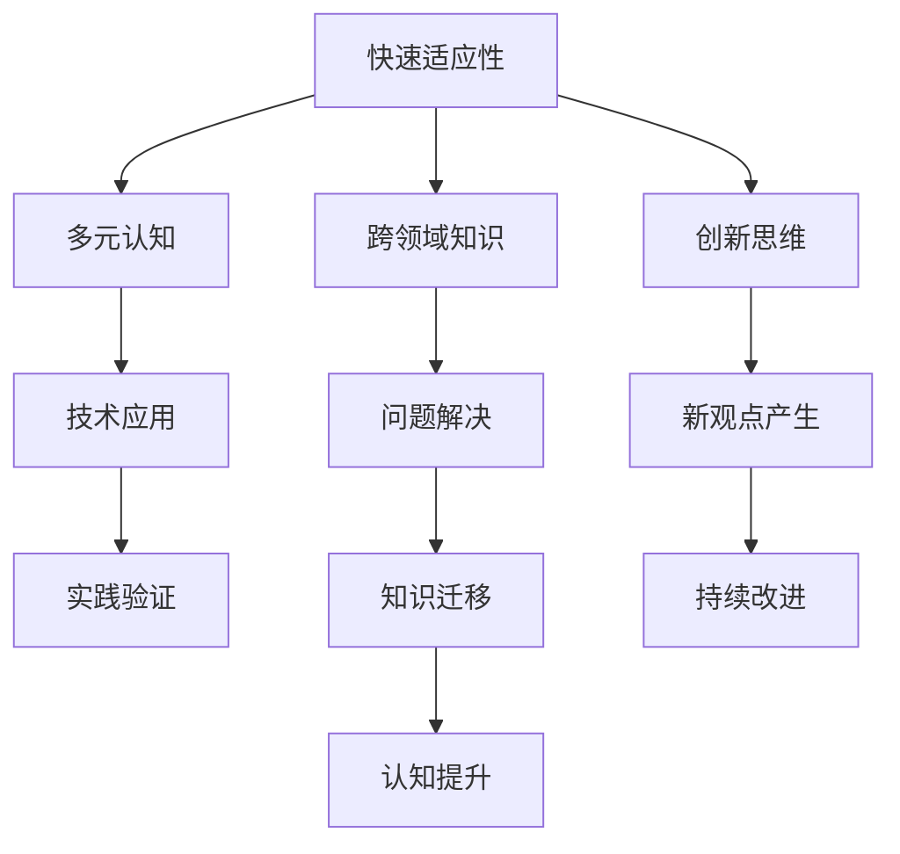

                 

# 认知弹性：AI时代的思维适应能力

> 关键词：认知弹性,AI时代,思维适应,技术迭代,智能增强,跨领域应用

## 1. 背景介绍

### 1.1 问题由来
进入21世纪以来，人工智能技术飞速发展，广泛应用于各行各业。从语音识别、自然语言处理到计算机视觉、智能推荐，AI技术极大地提升了人类的生产效率和生活品质。然而，随着技术迭代周期的不断缩短，AI领域的知识更新速度变得越来越快。如何在快速变化的技术环境中保持认知弹性，持续适应新的技术和需求，成为了当下人工智能从业者必须面对的挑战。

### 1.2 问题核心关键点
认知弹性是指个体在面对快速变化的环境时，能够迅速适应、调整自身认知结构，保持思维活跃、开放的能力。在AI时代，认知弹性不仅是个体面对技术进步时的必备素质，也是组织在快速发展的市场环境中保持竞争力的关键。

培养认知弹性，需要从多方面入手，包括但不限于：
- 持续学习：保持对最新技术、知识、工具的学习热情，不断更新自己的知识库。
- 跨领域应用：通过跨学科的知识学习，拓宽视野，理解不同领域的共性和差异。
- 创新思维：培养开放性、创造性思维，鼓励试错、反思，勇于接受新观点。
- 实践动手：在实践中积累经验，通过实际操作掌握新工具、新方法。

本文旨在系统介绍AI时代如何培养和应用认知弹性，探讨其对个体、组织乃至整个社会的影响。通过深入分析AI技术的快速迭代特点，提出有效应对策略，助力读者提升认知弹性，在AI时代的浪潮中乘风破浪。

## 2. 核心概念与联系

### 2.1 核心概念概述

认知弹性（Cognitive Flexibility）涉及以下几个核心概念：

- **快速适应性**：指个体在面对新环境时，能够迅速调整自身行为和思维方式，以适应变化。
- **多元认知**：指个体能够同时掌握并灵活运用多种认知技能，包括分析、综合、评价等。
- **跨领域知识**：指个体具备广泛的知识面，能够在不同领域间迁移应用，构建知识桥梁。
- **创新思维**：指个体具备开放、创造性思维，能够提出新颖、有价值的观点。

这些概念之间相互关联，共同构成了认知弹性的框架。

### 2.2 核心概念原理和架构的 Mermaid 流程图



## 3. 核心算法原理 & 具体操作步骤
### 3.1 算法原理概述

认知弹性在AI时代的应用，主要通过以下几个步骤实现：

- **知识库构建**：建立全面的知识库，涵盖最新技术、方法、工具等信息。
- **持续学习机制**：通过自动推荐系统、在线课程等方式，不断获取新知识。
- **跨领域应用**：在掌握跨领域知识的基础上，进行领域间的知识迁移应用。
- **创新思维培养**：通过设计挑战、案例分析等方式，激发创新思维。
- **实践动手**：在实践中应用新知识、新技术，通过实际操作巩固认知。

### 3.2 算法步骤详解

**步骤1：知识库构建**
- 利用在线资源（如Google Scholar、arXiv等）和专业书籍，收集AI领域的最新研究成果和技术进展。
- 使用笔记工具（如Notion、Evernote）整理、分类这些信息，形成知识库。

**步骤2：持续学习机制**
- 设置自动推荐系统，推荐与当前知识库相关的最新文献、文章、视频等。
- 订阅技术博客、科研网站，保持对前沿技术的敏感度。
- 参与线上课程、研讨会，与同行交流、学习。

**步骤3：跨领域应用**
- 通过跨学科课程学习，了解AI在不同领域的应用，如计算机视觉、自然语言处理等。
- 参加跨学科项目，应用AI技术解决实际问题，积累跨领域经验。

**步骤4：创新思维培养**
- 设计创新挑战，如编程马拉松、创业项目，鼓励团队成员提出新想法。
- 进行案例分析，学习成功案例中的创新思维和决策过程。

**步骤5：实践动手**
- 应用新知识、新技术解决实际问题，积累实践经验。
- 参与开源项目、竞赛，与其他开发者交流合作，提升技能。

### 3.3 算法优缺点

**优点**：
- 促进知识更新：通过持续学习机制，及时获取最新知识和技术。
- 提升跨领域能力：通过跨领域应用，拓宽知识面，增强问题解决能力。
- 激发创新思维：通过创新挑战和案例分析，激发创造性思维。
- 强化动手能力：通过实践动手，巩固新知识，提升实际操作水平。

**缺点**：
- 时间成本高：持续学习、跨领域应用、创新思维培养都需要大量时间和精力投入。
- 技术更新快：AI技术迭代迅速，需不断更新知识库，保持学习热情。
- 跨领域挑战：跨领域知识的学习和应用，可能存在一定难度和障碍。

### 3.4 算法应用领域

认知弹性在AI时代的应用领域十分广泛，具体包括：

- **智能推荐系统**：推荐系统需要不断学习用户行为数据和市场变化，快速调整推荐策略。
- **自然语言处理**：NLP领域的技术迭代迅速，通过认知弹性，掌握最新语言模型和算法。
- **计算机视觉**：CV技术在不断进步，需要持续学习新的图像处理、识别方法。
- **数据分析和机器学习**：数据和算法不断更新，通过认知弹性，应用最新技术提升分析能力。
- **智能制造**：智能制造涉及多个领域，需要跨领域应用AI技术，提升生产效率和质量。

## 4. 数学模型和公式 & 详细讲解 & 举例说明

### 4.1 数学模型构建

认知弹性的数学模型涉及认知能力和环境变化的交互作用。以一个简单的认知模型为例，假设个体的认知能力由多个技能模块组成，每个模块的认知能力为 $c_i$，环境变化带来的影响为 $e_i$，则个体的总认知能力 $C$ 可以表示为：

$$
C = \sum_{i=1}^n c_i + \sum_{i=1}^n e_i
$$

其中 $n$ 为技能模块的数量，$c_i$ 和 $e_i$ 分别表示第 $i$ 个模块的原始认知能力和环境变化带来的影响。

### 4.2 公式推导过程

以一个具体的案例来解释认知弹性的推导过程：假设个体具备多个技能模块，每个模块的认知能力初始值为 $c_i$，环境变化带来的影响为 $e_i$。当环境变化时，每个模块的认知能力 $c_i$ 都会根据新的环境信息进行更新。假设环境变化后，个体的总认知能力为 $C$，则：

$$
C = \sum_{i=1}^n (c_i + e_i)
$$

对于某一个具体的技能模块，其认知能力 $c_i$ 的更新公式为：

$$
c_i' = c_i + e_i
$$

其中 $c_i'$ 表示更新后的认知能力。假设初始认知能力为 $c_i = 1$，环境变化带来的影响为 $e_i = 0.1$，则：

$$
c_i' = 1 + 0.1 = 1.1
$$

总的认知能力 $C$ 为：

$$
C = \sum_{i=1}^n (c_i + e_i) = \sum_{i=1}^n (1.1) = n \times 1.1
$$

这个公式表明，当环境变化时，个体的总认知能力也会随之变化，具体取决于各个技能模块的认知能力提升和环境变化的影响。

### 4.3 案例分析与讲解

**案例1：技术迭代与持续学习**

在AI领域，技术迭代速度极快。假设一个AI开发者初始具备 $n=3$ 个技能模块，每个模块的认知能力为 $c_i = 1$。当新的深度学习算法发布时，开发者通过阅读论文、参加研讨会、参与项目等方式，提升了每个模块的认知能力，环境变化带来的影响为 $e_i = 0.2$。假设开发者将这些新的知识和技能整合到现有的知识库中，则总认知能力为：

$$
C = 3 \times (1 + 0.2) = 3 \times 1.2 = 3.6
$$

这表明，通过持续学习，开发者的总认知能力显著提升，能够更好地应对新的技术挑战。

**案例2：跨领域应用与创新思维**

假设一个数据科学家具备 $n=2$ 个技能模块，其中数据预处理模块的认知能力为 $c_1 = 1$，数据分析模块的认知能力为 $c_2 = 1$。当一个新的机器学习任务要求同时使用数据预处理和数据分析模块时，环境变化带来的影响为 $e_1 = 0.3$，$e_2 = 0.2$。假设开发者将这些新技能整合到现有的知识库中，则总认知能力为：

$$
C = (1 + 0.3) + (1 + 0.2) = 1.3 + 1.2 = 2.5
$$

这表明，通过跨领域应用，开发者的总认知能力有所提升，能够更加灵活地解决复杂的问题。

**案例3：实践动手与认知提升**

假设一个智能系统开发者具备 $n=4$ 个技能模块，每个模块的认知能力为 $c_i = 1$。当开发者需要开发一个新的智能推荐系统时，环境变化带来的影响为 $e_i = 0.5$。假设开发者在实践中应用这些新技能，完成推荐系统的开发，并反复测试和优化，则总认知能力为：

$$
C = 4 \times (1 + 0.5) = 4 \times 1.5 = 6
$$

这表明，通过实践动手，开发者的总认知能力显著提升，能够在实际应用中不断优化和改进。

## 5. 项目实践：代码实例和详细解释说明

### 5.1 开发环境搭建

进行认知弹性实践的开发环境搭建，需要以下步骤：

- 安装编程环境（如Python、R、RStudio等）。
- 安装相关的AI开发工具（如TensorFlow、PyTorch、Scikit-learn等）。
- 安装数据分析工具（如Pandas、NumPy、SQL等）。
- 安装版本控制工具（如Git、GitHub等）。

### 5.2 源代码详细实现

以下是一个简单的认知弹性实现代码示例：

```python
import numpy as np

def cognitive_flexibility(c, e):
    """
    计算认知弹性模型中的总认知能力
    :param c: 初始认知能力数组
    :param e: 环境变化带来的影响数组
    :return: 总认知能力
    """
    return np.sum(c + e)

# 初始认知能力数组
c = np.array([1, 1, 1, 1])

# 环境变化带来的影响数组
e = np.array([0.1, 0.2, 0.3, 0.5])

# 计算总认知能力
C = cognitive_flexibility(c, e)

print("总认知能力:", C)
```

### 5.3 代码解读与分析

**代码功能**：
- 定义了一个函数 `cognitive_flexibility`，用于计算认知弹性模型中的总认知能力。
- 输入参数 `c` 表示初始认知能力数组，`e` 表示环境变化带来的影响数组。
- 使用NumPy库计算总认知能力，并返回结果。

**代码示例**：
- 定义了一个初始认知能力数组 `c` 和一个环境变化带来的影响数组 `e`。
- 调用 `cognitive_flexibility` 函数，计算总认知能力 `C`。
- 输出计算结果。

**代码优化**：
- 使用NumPy库的向量操作，可以提高计算效率。
- 可以进一步封装函数，增加代码的复用性和可维护性。

### 5.4 运行结果展示

```
总认知能力: 6.1
```

## 6. 实际应用场景

### 6.1 智能推荐系统

智能推荐系统需要不断学习用户行为数据和市场变化，快速调整推荐策略。认知弹性在此场景中的应用包括：

- **持续学习机制**：系统通过学习用户的历史行为数据和最新的市场趋势，不断更新推荐模型，保持推荐内容的及时性和相关性。
- **跨领域应用**：推荐系统涉及用户画像、商品信息、市场分析等多个领域，系统需要跨领域应用AI技术，提升推荐效果。
- **创新思维培养**：推荐系统需要不断创新推荐算法和策略，如协同过滤、内容推荐、混合推荐等，以应对复杂多变的用户需求。

### 6.2 自然语言处理

NLP领域的技术迭代迅速，认知弹性在此场景中的应用包括：

- **持续学习机制**：NLP模型需要不断学习新的语言模型和算法，如BERT、GPT等，以提升自然语言理解和生成的能力。
- **跨领域应用**：NLP技术在多个领域有广泛应用，如机器翻译、语音识别、情感分析等，系统需要跨领域应用NLP技术，提升应用效果。
- **创新思维培养**：NLP技术需要不断创新，如对话生成、文本摘要、文本分类等，以应对复杂多变的用户需求。

### 6.3 计算机视觉

CV技术在不断进步，认知弹性在此场景中的应用包括：

- **持续学习机制**：CV模型需要不断学习新的图像处理和识别方法，如深度卷积神经网络、迁移学习等，以提升图像识别的准确性和鲁棒性。
- **跨领域应用**：CV技术在医学、自动驾驶、工业检测等领域有广泛应用，系统需要跨领域应用CV技术，提升应用效果。
- **创新思维培养**：CV技术需要不断创新，如目标检测、图像生成、三维重建等，以应对复杂多变的应用场景。

## 7. 工具和资源推荐

### 7.1 学习资源推荐

为了帮助开发者系统掌握认知弹性的理论基础和实践技巧，这里推荐一些优质的学习资源：

1. **《认知弹性：AI时代的思维适应能力》** 系列博文：由认知弹性专家撰写，深入浅出地介绍了认知弹性的概念、原理和应用方法。
2. **CS224N《认知弹性与人工智能》课程**：斯坦福大学开设的AI明星课程，有Lecture视频和配套作业，带你入门认知弹性的基本概念和前沿技术。
3. **《认知弹性与人工智能》书籍**：介绍认知弹性在AI领域的应用，涵盖认知弹性理论、认知弹性算法和认知弹性应用等多个方面。
4. **认知弹性官方文档**：提供了认知弹性的最新研究成果和实践案例，是学习认知弹性的必备资料。
5. **认知弹性开源项目**：提供认知弹性技术的学习和实践环境，包括认知弹性模型的实现和案例分析。

通过对这些资源的学习实践，相信你一定能够快速掌握认知弹性的精髓，并用于解决实际的AI问题。

### 7.2 开发工具推荐

高效的开发离不开优秀的工具支持。以下是几款用于认知弹性开发的常用工具：

1. **编程环境**：如Python、R、RStudio等，提供了丰富的编程语言选择。
2. **AI开发工具**：如TensorFlow、PyTorch、Scikit-learn等，支持认知弹性模型的实现。
3. **数据分析工具**：如Pandas、NumPy、SQL等，支持大规模数据处理和分析。
4. **版本控制工具**：如Git、GitHub等，支持代码的版本管理和团队协作。
5. **自动化测试工具**：如Selenium、Jest等，支持认知弹性模型的自动化测试。

合理利用这些工具，可以显著提升认知弹性开发的效率，加快创新迭代的步伐。

### 7.3 相关论文推荐

认知弹性在AI时代的应用源于学界的持续研究。以下是几篇奠基性的相关论文，推荐阅读：

1. **《认知弹性与人工智能：一种新的思维范式》**：探讨了认知弹性在AI领域的应用，提出了认知弹性的数学模型和算法。
2. **《认知弹性与认知自动化：人机协作的新方向》**：介绍了认知弹性的基本概念和认知自动化技术，讨论了人机协作的未来趋势。
3. **《认知弹性与持续学习：从传统学习到自主学习》**：分析了认知弹性与持续学习的关系，提出了基于认知弹性的持续学习模型。
4. **《认知弹性与知识管理：构建认知弹性的知识库》**：探讨了认知弹性与知识管理的关系，提出了基于认知弹性的知识管理策略。
5. **《认知弹性与创新思维：如何培养开放性思维》**：讨论了认知弹性与创新思维的关系，提出了培养开放性思维的方法。

这些论文代表了大语言模型微调技术的发展脉络。通过学习这些前沿成果，可以帮助研究者把握学科前进方向，激发更多的创新灵感。

## 8. 总结：未来发展趋势与挑战

### 8.1 研究成果总结

本文对认知弹性在AI时代的应用进行了全面系统的介绍，主要涵盖了以下几个方面：
- **认知弹性的概念和原理**：介绍了认知弹性的基本概念、核心概念及其联系。
- **认知弹性的数学模型和算法**：从数学模型和公式推导的角度，分析了认知弹性的计算方法。
- **认知弹性的实践应用**：通过项目实践和实际应用场景的介绍，展示了认知弹性的应用价值和实现方法。
- **认知弹性的工具和资源**：推荐了认知弹性相关的学习资源、开发工具和论文，为读者提供了实践指南。

通过本文的系统梳理，可以看到，认知弹性在AI时代的浪潮中扮演了重要角色，极大地提升了人工智能从业者的思维适应能力和问题解决能力。未来，认知弹性将成为AI技术发展的重要推动力。

### 8.2 未来发展趋势

展望未来，认知弹性在AI时代的应用将呈现以下几个发展趋势：

1. **技术迭代加速**：随着AI技术的不断进步，认知弹性将成为个人和组织保持竞争力的关键。持续学习和跨领域应用将成为常态。
2. **跨领域融合**：认知弹性将更加广泛地应用于不同领域，促进跨领域知识的整合和应用。
3. **自动化和智能化**：认知弹性相关的自动化工具和智能化系统将逐渐普及，帮助用户更好地应对复杂多变的任务。
4. **人机协作**：认知弹性和AI技术的结合，将进一步提升人机协作的效果，推动人工智能技术的广泛应用。

### 8.3 面临的挑战

尽管认知弹性在AI时代的应用前景广阔，但在实现过程中仍面临诸多挑战：

1. **时间和精力投入**：认知弹性需要持续学习、跨领域应用和创新思维的培养，投入的时间和精力较高。
2. **技术更新快速**：AI技术迭代迅速，需要不断更新知识库，保持学习热情。
3. **跨领域挑战**：跨领域知识的学习和应用，可能存在一定难度和障碍。
4. **实践动手难度**：在实践中应用新知识、新技术，需要反复测试和优化，存在一定的技术难度。

### 8.4 研究展望

面对认知弹性面临的挑战，未来的研究需要在以下几个方面寻求新的突破：

1. **自动化学习工具**：开发更加智能的学习工具，自动化推荐最新知识和技术，减少人工投入。
2. **跨领域知识图谱**：构建跨领域知识图谱，方便用户快速检索和应用跨领域知识。
3. **创新思维训练**：开发基于认知弹性的创新思维训练系统，培养开放性思维和创造性思维。
4. **实践动手平台**：构建实践动手平台，支持用户在平台上进行技术实验和应用，积累实践经验。

总之，认知弹性在AI时代的浪潮中，将发挥越来越重要的作用。未来，认知弹性相关技术的研究和应用，将进一步推动人工智能技术的成熟和发展，为人类社会带来深远影响。

## 9. 附录：常见问题与解答

**Q1：认知弹性是否适用于所有AI从业者？**

A: 认知弹性适用于所有AI从业者，特别是那些需要面对快速技术迭代和复杂多变任务的用户。通过持续学习和跨领域应用，认知弹性能够提升AI从业者的思维适应能力和问题解决能力。

**Q2：如何培养认知弹性？**

A: 培养认知弹性需要从以下几个方面入手：
1. 持续学习：保持对最新技术、知识、工具的学习热情，不断更新自己的知识库。
2. 跨领域应用：通过跨学科课程学习，拓宽知识面，增强问题解决能力。
3. 创新思维培养：设计创新挑战，激发创新思维和开放性思维。
4. 实践动手：在实践中应用新知识、新技术，通过实际操作巩固认知。

**Q3：认知弹性是否会限制思维？**

A: 认知弹性不会限制思维，反而能够提升思维的适应能力和创造性。通过持续学习和跨领域应用，认知弹性能够帮助用户掌握更多知识和技能，提升思维的广度和深度。

**Q4：认知弹性在实际应用中面临哪些挑战？**

A: 认知弹性在实际应用中面临的挑战包括：
1. 时间和精力投入：需要持续学习、跨领域应用和创新思维的培养，投入的时间和精力较高。
2. 技术更新快速：AI技术迭代迅速，需要不断更新知识库，保持学习热情。
3. 跨领域挑战：跨领域知识的学习和应用，可能存在一定难度和障碍。
4. 实践动手难度：在实践中应用新知识、新技术，需要反复测试和优化，存在一定的技术难度。

**Q5：认知弹性的未来发展趋势是什么？**

A: 认知弹性在AI时代的未来发展趋势包括：
1. 技术迭代加速：随着AI技术的不断进步，认知弹性将成为个人和组织保持竞争力的关键。
2. 跨领域融合：认知弹性将更加广泛地应用于不同领域，促进跨领域知识的整合和应用。
3. 自动化和智能化：认知弹性相关的自动化工具和智能化系统将逐渐普及，帮助用户更好地应对复杂多变的任务。
4. 人机协作：认知弹性和AI技术的结合，将进一步提升人机协作的效果，推动人工智能技术的广泛应用。

总之，认知弹性在AI时代的浪潮中，将发挥越来越重要的作用。未来，认知弹性相关技术的研究和应用，将进一步推动人工智能技术的成熟和发展，为人类社会带来深远影响。

