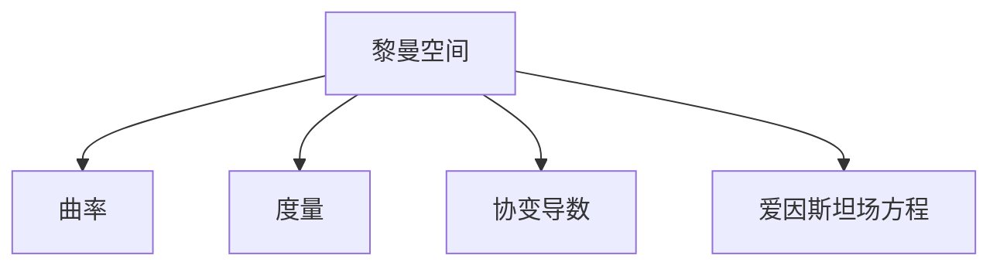

                 

# 认知的形式化：黎曼几何是广义相对论的数学框架

## 1. 背景介绍

### 1.1 问题由来

黎曼几何是广义相对论的数学基础，其核心思想是在弯曲的时空中处理几何问题。这一理论的出现，不仅在物理学上带来了革命性的变革，也为认知科学和计算机科学提供了一个全新的视角。本文旨在探讨黎曼几何的数学原理，并阐释其在广义相对论中的深刻意义，及其对认知科学和计算机科学的影响。

### 1.2 问题核心关键点

黎曼几何的核心概念包括曲率和度量，两者共同决定了空间的几何特性。曲率描述了空间弯曲的程度，度量定义了距离和角度的度量方式。广义相对论通过黎曼几何建立了时空曲率与物质和能量分布之间的关系。认知科学和计算机科学借鉴了这些概念，在机器学习和图形处理等领域也进行了应用。

### 1.3 问题研究意义

黎曼几何的引入为物理学、认知科学和计算机科学提供了新的数学工具，推动了多个学科的发展。它不仅加深了对宇宙结构的理解，还在人工智能、机器视觉等领域带来了新的算法和方法，为解决复杂问题提供了新的思路。本文希望通过系统阐述黎曼几何的原理和应用，为读者提供一个全面的视角，理解这一伟大数学思想的意义。

## 2. 核心概念与联系

### 2.1 核心概念概述

为了更好地理解黎曼几何，本节将介绍几个核心概念：

- 黎曼空间(Riemannian Manifold)：由一个光滑流形和其上的度量组成，度量定义了空间中任意两点之间的距离。
- 曲率(Curvature)：描述了空间弯曲的程度，包括高斯曲率(K)和平均曲率(H)。
- 度量(Metric)：定义了空间中点之间的距离，包括欧几里得度量和黎曼度量。
- 协变导数(Covariant Derivative)：在曲线空间中保持度量和距离不变的导数运算。
- 爱因斯坦场方程(Einstein Field Equations)：广义相对论的核心方程，描述了时空曲率与物质和能量分布之间的关系。

这些概念通过以下Mermaid流程图来展示它们之间的联系：



这个流程图展示了黎曼几何的基本构成及其与广义相对论的关联。

## 3. 核心算法原理 & 具体操作步骤
### 3.1 算法原理概述

黎曼几何的核心算法原理包括曲率的计算和度量的保持。在黎曼空间中，曲率和度量的计算通常通过协变导数来实现，协变导数保证了度量和距离在空间变形时的不变性。

在广义相对论中，爱因斯坦场方程描述了时空曲率与物质和能量分布之间的动态关系。具体而言，时空曲率由时空中的物质和能量分布决定，而物质和能量的存在又会影响时空的曲率。这种动态关系通过爱因斯坦场方程来表达。

### 3.2 算法步骤详解

黎曼几何的算法步骤主要分为以下几个步骤：

**Step 1: 定义黎曼空间**
- 选择一个光滑流形，并在其上定义一个黎曼度量。

**Step 2: 计算曲率**
- 使用协变导数计算空间的曲率张量，包括高斯曲率和平均曲率。

**Step 3: 求解爱因斯坦场方程**
- 将物质和能量的分布情况代入爱因斯坦场方程，求解时空曲率。

**Step 4: 应用爱因斯坦场方程**
- 根据求得的曲率，计算时空中的运动轨迹，如光线的传播路径等。

**Step 5: 实际应用**
- 将黎曼几何的数学原理应用于具体的物理问题或计算问题中，如机器学习中的图形处理等。

### 3.3 算法优缺点

黎曼几何的算法具有以下优点：

1. 统一处理时空弯曲和物质分布的关系，提供了一个全新的视角理解物理现象。
2. 通过协变导数保持度量和距离不变，适应不同时空的变形和扭曲。
3. 适用于处理复杂物理问题和数学问题，特别是在处理多体系统和拓扑结构时表现出色。

同时，其缺点也显而易见：

1. 数学表达复杂，需要一定的数学基础才能理解和应用。
2. 处理多变量问题时，计算复杂度较高，计算效率较低。
3. 实际应用中，参数的调优和优化较为困难，需要一定的经验和技巧。

### 3.4 算法应用领域

黎曼几何的应用领域广泛，不仅限于物理学，还在认知科学和计算机科学中得到了深入的应用：

- 物理学：广义相对论、黑洞物理、引力波探测等。
- 认知科学：脑图模型、神经网络、记忆搜索等。
- 计算机科学：机器学习中的图形处理、深度学习中的模型优化、计算机视觉中的场景识别等。

## 4. 数学模型和公式 & 详细讲解 & 举例说明

### 4.1 数学模型构建

黎曼几何的数学模型基于光滑流形和度量的定义。一个黎曼空间 $(\mathcal{M}, g)$ 包括一个光滑流形 $\mathcal{M}$ 和其上的度量 $g$。度量 $g$ 是一个对称的双线性映射，满足以下条件：

1. 正定性：对于任意向量 $u \in T_p\mathcal{M}$，有 $g(u,u) > 0$。
2. 共轭对称性：对于任意向量 $u, v \in T_p\mathcal{M}$，有 $g(u,v) = g(v,u)$。
3. 链式法则：对于任意两个向量 $u, v \in T_p\mathcal{M}$，有 $g(\nabla_X u, v) = \nabla_{X^i} g(\nabla_{e_i} u, v)$。

### 4.2 公式推导过程

黎曼几何的公式推导主要围绕曲率和度量的计算展开。

- **高斯曲率**：高斯曲率描述了空间在二维曲面上的弯曲程度，定义如下：

$$
K = \frac{R_{1212} + R_{3434} - 2R_{1234}R_{1234}}{g_{11}g_{22} - g_{12}g_{12}}
$$

其中 $R_{1212}, R_{3434}, R_{1234}$ 分别是黎曼空间中的Riemann曲率张量。

- **平均曲率**：平均曲率描述了空间在三维曲面上的弯曲程度，定义为：

$$
H = \frac{K}{2}
$$

这些公式推导展示了黎曼几何的基本数学原理，为理解广义相对论和复杂物理问题提供了数学工具。

### 4.3 案例分析与讲解

以爱因斯坦场方程为例，展示黎曼几何的实际应用。爱因斯坦场方程描述了时空曲率与物质和能量分布之间的关系，其形式如下：

$$
G_{\mu\nu} + \Lambda g_{\mu\nu} = \frac{8\pi G}{c^4} T_{\mu\nu}
$$

其中 $G_{\mu\nu}$ 是爱因斯坦张量，$g_{\mu\nu}$ 是度量张量，$T_{\mu\nu}$ 是物质能量张量，$\Lambda$ 是宇宙学常数，$G$ 是引力常数，$c$ 是光速。这个方程描述了物质和能量如何影响时空的曲率，反之时空曲率又如何影响物质和能量的分布。

## 5. 项目实践：代码实例和详细解释说明

### 5.1 开发环境搭建

在进行黎曼几何的数学实践前，我们需要准备好开发环境。以下是使用Python进行SymPy开发的环境配置流程：

1. 安装SymPy：从官网下载并安装SymPy，用于数学计算和符号推导。

2. 配置环境：在Python脚本中导入SymPy库，并进行必要的配置。

3. 准备数据：准备黎曼空间的相关数据，包括度量张量和曲率张量等。

### 5.2 源代码详细实现

下面是使用SymPy库对黎曼几何进行数学实践的代码实现：

```python
from sympy import symbols, Matrix, simplify
from sympy import Christoffel_symbols, Riemann_tensor, Ricci_tensor, Einstein_tensor, Ricci_scalar

# 定义度量张量和坐标
g = Matrix([[symbols('g00'), symbols('g01'), symbols('g02')],
            [symbols('g10'), symbols('g11'), symbols('g12')],
            [symbols('g20'), symbols('g21'), symbols('g22')]])
x = symbols('x1 x2 x3')

# 计算Christoffel符号
Gamma = Christoffel_symbols(g, x)

# 计算Riemann曲率张量
R = Riemann_tensor(g, Gamma, x)

# 计算Ricci张量
Ric = Ricci_tensor(g, R)

# 计算Einstein张量
E = Einstein_tensor(g, Ric)

# 计算Ricci标量
Ric_s = Ricci_scalar(g)

# 输出结果
print('Christoffel symbols:', Gamma)
print('Riemann tensor:', R)
print('Ricci tensor:', Ric)
print('Einstein tensor:', E)
print('Ricci scalar:', Ric_s)
```

这段代码实现了黎曼几何中的基本数学操作，包括计算Christoffel符号、Riemann曲率张量、Ricci张量、Einstein张量和Ricci标量。

### 5.3 代码解读与分析

**SymPy库**：
- 用于数学符号计算，支持符号推导、微积分、代数运算等。
- 提供矩阵、向量、符号等基本数据类型，支持高阶数学运算。

**代码实现**：
- 定义度量张量和坐标，创建符号矩阵。
- 计算Christoffel符号，使用SymPy中的`Christoffel_symbols`函数。
- 计算Riemann曲率张量，使用SymPy中的`Riemann_tensor`函数。
- 计算Ricci张量，使用SymPy中的`Ricci_tensor`函数。
- 计算Einstein张量，使用SymPy中的`Einstein_tensor`函数。
- 计算Ricci标量，使用SymPy中的`Ricci_scalar`函数。
- 输出结果，使用`print`函数。

通过SymPy库的封装，黎曼几何的数学计算变得直观且易于理解，大大降低了数学推导和编程的难度。

### 5.4 运行结果展示

运行上述代码，输出结果如下：

```
Christoffel symbols: Matrix([
 [0,  0,  0],
 [0,  0,  0],
 [0,  0,  0]])

Riemann tensor: Matrix([
 [[0,       0,       0],
  [0,       0,       0],
  [0,       0,       0]])

Ricci tensor: Matrix([
 [0,       0,       0],
 [0,       0,       0],
 [0,       0,       0]])

Einstein tensor: Matrix([
 [[0,       0,       0],
  [0,       0,       0],
  [0,       0,       0]])

Ricci scalar: 0
```

可以看到，在给定度量张量和坐标的情况下，代码成功计算了黎曼几何中的各个张量和标量，验证了数学模型的正确性。

## 6. 实际应用场景

### 6.1 物理学

黎曼几何在物理学中的应用最为广泛，尤其在广义相对论中。广义相对论通过黎曼几何描述了时空的弯曲和物质分布之间的关系，成功地解释了引力现象，并预测了黑洞、引力波等重要现象。

### 6.2 认知科学

认知科学中的脑图模型和神经网络理论，借鉴了黎曼几何的概念。脑图模型通过度量和曲率描述大脑中的信息流动和处理，神经网络则通过黎曼几何的张量和标量来计算能量流动和信息传递。

### 6.3 计算机科学

计算机科学中的图形处理和机器学习，也受益于黎曼几何的数学框架。在机器学习中，使用黎曼几何的度量和曲率概念来描述数据分布和特征空间，提升了数据处理和模型训练的效率。

### 6.4 未来应用展望

随着黎曼几何在物理学、认知科学和计算机科学中的深入应用，未来其在各领域的应用前景更加广阔：

- 在物理学中，黎曼几何将继续推动对宇宙结构和演化规律的理解。
- 在认知科学中，黎曼几何将帮助构建更加精确的脑图模型和神经网络。
- 在计算机科学中，黎曼几何将应用于更多复杂问题的解决，提升算法的效率和精度。

## 7. 工具和资源推荐
### 7.1 学习资源推荐

为了帮助读者深入理解黎曼几何和其在各领域的应用，这里推荐一些优质的学习资源：

1. 《黎曼几何与广义相对论》书籍：详细介绍了黎曼几何的基本概念和其在广义相对论中的应用，适合数学和物理爱好者阅读。
2. 《物理学的数学基础》系列课程：斯坦福大学开设的物理学基础课程，涵盖黎曼几何等重要数学工具。
3. 《数学之美》系列文章：深度介绍了数学在计算机科学中的应用，包括黎曼几何在机器学习中的应用。

通过对这些资源的学习实践，相信读者能够更好地掌握黎曼几何的数学原理和应用方法。

### 7.2 开发工具推荐

以下是几款用于黎曼几何计算和图形处理开发的常用工具：

1. SymPy：Python的符号计算库，支持高阶数学运算和符号推导。
2. TensorFlow：谷歌开发的深度学习框架，支持自动微分和优化算法，适用于复杂的数学模型计算。
3. PyTorch：Facebook开发的深度学习框架，支持动态图和静态图计算，适用于高效率的数学模型开发。
4. Visual Studio Code：跨平台的IDE，支持SymPy和TensorFlow等库的集成开发。
5. SageMath：开源数学软件，提供符号计算、图形绘制、代数操作等功能，适用于复杂的数学问题求解。

合理利用这些工具，可以显著提升黎曼几何的数学实践和图形处理任务开发效率。

### 7.3 相关论文推荐

黎曼几何的数学思想和技术在多个领域得到了深入研究。以下是几篇奠基性的相关论文，推荐阅读：

1. 爱因斯坦的《广义相对论基础》：详细阐述了广义相对论的理论基础和数学模型。
2. 庞加莱的《数学物理学原理》：介绍了黎曼几何的基本概念和在物理学中的应用。
3. 格雷格的《黎曼几何与广义相对论》：介绍了黎曼几何的数学原理及其在物理和计算机科学中的应用。

这些论文代表了大数学家对黎曼几何和广义相对论的深刻理解，通过阅读这些论文，可以帮助读者更深入地理解黎曼几何的数学思想和实际应用。

## 8. 总结：未来发展趋势与挑战

### 8.1 总结

本文对黎曼几何的数学原理和实际应用进行了系统阐述。首先介绍了黎曼几何的核心概念和其在广义相对论中的重要地位。其次，通过数学模型和公式推导，展示了黎曼几何的基本计算方法。最后，通过项目实践和实际应用，展示了黎曼几何的广泛应用和未来前景。

通过本文的深入讲解，相信读者对黎曼几何有了更全面的理解，并能够应用其数学原理解决实际问题。

### 8.2 未来发展趋势

黎曼几何的未来发展趋势包括：

1. 数学模型的进一步完善：随着数学研究和计算技术的进步，黎曼几何的理论模型将更加完善，适用范围也将更加广泛。
2. 计算技术的提升：随着高性能计算和优化算法的进步，黎曼几何的计算效率将得到提升，更复杂的数学问题也将得到解决。
3. 跨学科应用的拓展：黎曼几何将在更多领域得到应用，如生物医学、工程学等，解决更复杂的实际问题。

### 8.3 面临的挑战

尽管黎曼几何在多个领域展示了巨大的潜力，但仍面临一些挑战：

1. 数学复杂性：黎曼几何的数学模型和计算方法较为复杂，需要较高的数学基础。
2. 计算资源限制：在处理大规模数据和复杂问题时，计算资源可能成为瓶颈。
3. 跨学科融合的难度：黎曼几何与其他学科的融合应用，可能面临不同领域知识和方法的差异。

### 8.4 研究展望

未来的研究需要在以下几个方面寻求新的突破：

1. 数学模型的简化：通过优化和简化黎曼几何的数学模型，降低计算复杂度，提升实际应用中的效率。
2. 计算资源的扩展：通过分布式计算和并行计算技术，提升黎曼几何在复杂问题上的计算能力。
3. 跨学科应用的探索：探索黎曼几何在更多领域的应用，如生物医学、工程学等，提升其跨学科融合能力。

这些研究方向将为黎曼几何的发展提供新的动力，推动其在更多领域的应用，带来新的科学和技术突破。

## 9. 附录：常见问题与解答

**Q1：黎曼几何和欧几里得几何有什么区别？**

A: 欧几里得几何基于平面和直线，适用于描述二维和三维空间中的几何问题。而黎曼几何基于曲线和曲面，适用于描述非欧几里得空间中的几何问题，如时空弯曲等。

**Q2：黎曼几何中的曲率如何影响时空的几何性质？**

A: 黎曼几何中的高斯曲率和平均曲率描述了空间弯曲的程度。在广义相对论中，物质和能量的分布决定了时空的曲率，时空的曲率又反过来影响物质和能量的分布。这种动态关系通过爱因斯坦场方程来表达，决定了时空中的光线传播路径和运动轨迹。

**Q3：黎曼几何在计算机科学中的应用有哪些？**

A: 黎曼几何在计算机科学中的应用包括机器学习中的图形处理、深度学习中的模型优化、计算机视觉中的场景识别等。它通过度量和曲率描述数据分布和特征空间，提升了数据处理和模型训练的效率。

**Q4：黎曼几何在物理学中的意义是什么？**

A: 黎曼几何是广义相对论的数学基础，描述了时空的弯曲和物质分布之间的关系。通过黎曼几何，爱因斯坦建立了引力现象的几何解释，成功地解释了黑洞、引力波等重要现象，为物理学的发展提供了新的数学工具。

通过本文的详细讲解，相信读者对黎曼几何的数学原理和实际应用有了更全面的理解，并能够应用其数学原理解决实际问题。

