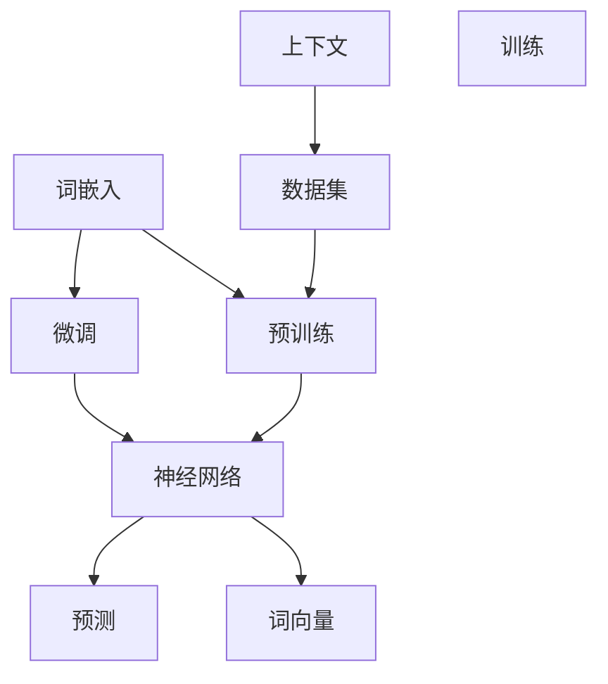

                 

# 词嵌入 (Word Embeddings) 原理与代码实例讲解

> 关键词：词嵌入, 词向量, 神经网络, 自然语言处理(NLP), TensorFlow, Keras, 维特比算法(Viterbi Algorithm)

## 1. 背景介绍

### 1.1 问题由来

在自然语言处理（Natural Language Processing, NLP）领域，如何高效地表示单词和短语的语义信息，一直是研究者们关注的焦点。传统的词袋模型（Bag of Words, BoW）忽略了单词之间的顺序和上下文关系，而浅层特征工程，如TF-IDF、Word2Vec等，虽有进步，但无法深入挖掘单词的语义结构和语境信息。

近年来，基于深度学习（Deep Learning, DL）的方法逐渐成为主流，其中词嵌入（Word Embeddings）成为了NLP领域的一个重要里程碑。词嵌入将单词映射到一个高维实数向量空间中，使得相似的单词在向量空间中的距离较近，便于计算和处理。它通过学习单词的上下文关系和语义信息，可以大幅提升NLP任务的性能，如文本分类、情感分析、命名实体识别等。

### 1.2 问题核心关键点

词嵌入的核心关键点包括：
- **向量化表示**：将单词转化为高维实数向量，便于机器学习模型进行处理。
- **上下文关系**：通过语料库中的上下文信息，学习单词的语义和语用特征。
- **预训练和微调**：可以在大规模语料上预训练词嵌入，在小规模任务上微调以提升性能。
- **模型选择**：有CBOW、Skip-Gram等不同类型的词嵌入模型，选择合适的方法和参数配置是关键。

本文将深入介绍词嵌入的基本原理和具体实现，并通过TensorFlow和Keras等工具，提供详细的代码实例。

## 2. 核心概念与联系

### 2.1 核心概念概述

词嵌入技术通过将单词映射到高维实数向量空间，使得单词之间的语义关系在向量空间中得以表达。词嵌入不仅能够捕捉单词的局部特征，还能够在更广的语境中捕捉单词的语义和语用信息。

词嵌入的核心概念包括：

- **单词（Word）**：文本中单个的词汇单元，如“中国”、“汽车”、“快乐”等。
- **词向量（Word Vector）**：将单词映射到一个高维实数向量，通常维度在100到300之间。
- **上下文（Context）**：单词在句子或文档中的位置信息，用于学习单词的语义和语法信息。
- **预训练（Pre-training）**：在大规模语料上训练词嵌入模型，学习单词的通用语义。
- **微调（Fine-tuning）**：在预训练基础上，针对特定任务调整词向量，提升模型性能。

### 2.2 核心概念原理和架构的 Mermaid 流程图(Mermaid 流程节点中不要有括号、逗号等特殊字符)



这个流程图展示了词嵌入的基本架构和核心过程：

1. **词嵌入 (A)**：将单词映射到高维实数向量空间。
2. **预训练 (B)**：在大规模语料上训练词嵌入模型，学习单词的通用语义。
3. **微调 (C)**：在预训练基础上，针对特定任务调整词向量，提升模型性能。
4. **神经网络 (D)**：使用词嵌入作为特征，构建深度学习模型进行训练和预测。
5. **数据集 (E)**：用于训练和评估模型的语料库。
6. **上下文 (F)**：单词在句子或文档中的位置信息，用于学习单词的语义和语法信息。
7. **词向量 (G)**：高维实数向量，表示单词的语义和语用信息。
8. **训练 (H)**：使用数据集和神经网络进行训练。
9. **预测 (I)**：使用训练好的模型进行文本分类、情感分析、命名实体识别等任务。

## 3. 核心算法原理 & 具体操作步骤

### 3.1 算法原理概述

词嵌入的原理是通过神经网络，学习单词和其上下文的共现概率，从而映射到高维向量空间。传统的词嵌入方法有两种：Continuous Bag-of-Words (CBOW)和Skip-Gram。

CBOW是通过上下文单词预测中心单词，而Skip-Gram则是通过中心单词预测上下文单词。两种方法都使用神经网络，通过softmax层来计算概率。

公式化地，假设$w_1, w_2, ..., w_N$为单词集合，$v_{w_i}$为单词$w_i$的词向量，$x_j$为上下文单词，则：

**CBOW模型**：
$$p(x_j|w_i) = softmax(W^Tx_j + Uv_{w_i} + b_j)$$

其中$W$和$U$为学习到的权重矩阵，$b_j$为偏置项。

**Skip-Gram模型**：
$$p(w_i|x_j) = softmax(W^Tv_{w_i} + Ux_j + b_i)$$

两种模型都可以通过反向传播算法进行训练，通过调整权重矩阵$W$和$U$，使得预测概率与真实概率尽可能接近。

### 3.2 算法步骤详解

以下详细介绍使用TensorFlow实现Word2Vec的CBOW模型的详细步骤：

**Step 1: 准备数据集**
- 准备一个包含单词及其上下文的数据集，例如IMDB电影评论数据集。
- 使用TensorFlow的Data API，加载和预处理数据集。

```python
import tensorflow as tf
from tensorflow.keras.preprocessing.text import Tokenizer
from tensorflow.keras.preprocessing.sequence import pad_sequences

# 加载IMDB评论数据集
imdb = tf.keras.datasets.imdb.load_data(num_words=10000)

# 使用Tokenizer将文本转化为整数序列
tokenizer = Tokenizer(num_words=10000, oov_token='<OOV>')
tokenizer.fit_on_texts(imdb[0][0])

# 将文本转化为整数序列，并进行填充
sequences = tokenizer.texts_to_sequences(imdb[0][0])
padded_sequences = pad_sequences(sequences, padding='post', maxlen=256)
```

**Step 2: 构建模型**
- 使用Keras构建CBOW模型，包括嵌入层（Embedding Layer）、softmax层等。
- 嵌入层将单词转化为高维向量。

```python
model = tf.keras.Sequential([
    tf.keras.layers.Embedding(input_dim=10000, output_dim=128, input_length=256),
    tf.keras.layers.Flatten(),
    tf.keras.layers.Dense(128, activation='relu'),
    tf.keras.layers.Dense(1, activation='sigmoid')
])
```

**Step 3: 定义损失函数和优化器**
- 使用均方误差（Mean Squared Error, MSE）作为损失函数。
- 使用Adam优化器进行模型训练。

```python
model.compile(optimizer='adam', loss='mse')
```

**Step 4: 训练模型**
- 使用fit方法，设置训练轮数和批次大小。

```python
model.fit(padded_sequences, imdb[0][1], epochs=10, batch_size=32, validation_split=0.2)
```

**Step 5: 评估模型**
- 使用evaluate方法，评估模型在测试集上的表现。

```python
test_sequences = tokenizer.texts_to_sequences(imdb[1][0])
padded_test_sequences = pad_sequences(test_sequences, padding='post', maxlen=256)
test_loss = model.evaluate(padded_test_sequences, imdb[1][1])
```

### 3.3 算法优缺点

**优点**：
- 通过神经网络，可以捕捉单词的语义和语法信息，更全面地表示单词的含义。
- 在大规模语料上预训练，可以学习到丰富的语义知识，提升模型泛化能力。
- 向量表示可以进行加减乘除等数学运算，便于构建更复杂的NLP模型。

**缺点**：
- 需要大量标注数据进行预训练，训练成本高。
- 向量空间维度较高，计算复杂度大。
- 模型可能存在过拟合问题，需要设计正则化技术。

### 3.4 算法应用领域

词嵌入技术在自然语言处理（NLP）领域有广泛的应用，例如：

- **文本分类**：如情感分析、新闻分类等，通过训练词嵌入模型，将文本转化为向量，输入到分类器中。
- **命名实体识别**：识别文本中的实体，如人名、地名、机构名等，通过上下文关系来学习实体类别。
- **信息检索**：通过计算单词向量之间的相似度，进行文本匹配和排序，提升检索效率。
- **语义相似度计算**：计算单词或句子的语义相似度，用于推荐系统、问答系统等。
- **机器翻译**：将一种语言的文本翻译成另一种语言，通过上下文关系学习单词的语义。

## 4. 数学模型和公式 & 详细讲解

### 4.1 数学模型构建

假设单词$w$对应的词向量为$v_w$，单词$x$对应的词向量为$v_x$，上下文单词为$c$，则CBOW模型可以表示为：

$$p(c|w) = softmax(W^Tv_c + Uv_w + b_c)$$

其中$W$和$U$为权重矩阵，$b_c$为偏置项。

**Step 1: 定义模型参数**
- 使用TensorFlow定义权重矩阵$W$、$U$和偏置项$b$。

```python
vocab_size = 10000
embedding_dim = 128

W = tf.Variable(tf.random.normal(shape=(vocab_size, embedding_dim)))
U = tf.Variable(tf.random.normal(shape=(vocab_size, embedding_dim)))
b = tf.Variable(tf.zeros(vocab_size))
```

**Step 2: 定义嵌入层**
- 使用嵌入层将单词转化为高维向量。

```python
def get_vector(w):
    return tf.nn.embedding_lookup(W, w)
```

**Step 3: 定义softmax层**
- 使用softmax层计算预测概率。

```python
def softmax(x):
    return tf.nn.softmax(tf.matmul(x, W) + tf.matmul(U, get_vector(c)) + b)
```

**Step 4: 定义损失函数**
- 使用交叉熵损失函数进行模型训练。

```python
def loss(c, y):
    logits = softmax(c)
    return tf.reduce_mean(tf.nn.sparse_softmax_cross_entropy_with_logits(labels=y, logits=logits))
```

**Step 5: 定义优化器**
- 使用Adam优化器进行模型优化。

```python
optimizer = tf.keras.optimizers.Adam(learning_rate=0.01)
```

### 4.2 公式推导过程

**Step 1: 定义损失函数**
- 使用交叉熵损失函数，将预测概率与真实标签进行对比。

$$L = -\frac{1}{N}\sum_{i=1}^N \log p(y_i|x_i)$$

**Step 2: 定义梯度更新公式**
- 使用反向传播算法，计算梯度并更新模型参数。

$$\frac{\partial L}{\partial W} = -\frac{1}{N}\sum_{i=1}^N \frac{\partial \log p(y_i|x_i)}{\partial W}$$

通过链式法则和反向传播算法，可以计算出各个参数的梯度，并使用优化器进行更新。

**Step 3: 计算梯度更新公式**
- 使用梯度下降法，更新模型参数。

$$W \leftarrow W - \eta \frac{\partial L}{\partial W}$$

其中$\eta$为学习率，控制每次更新的步长。

### 4.3 案例分析与讲解

使用TensorFlow实现Word2Vec的CBOW模型，需要进行以下步骤：

1. 加载和预处理数据集。
2. 构建CBOW模型，包括嵌入层和softmax层。
3. 定义损失函数和优化器。
4. 训练模型，调整权重矩阵$W$和$U$。
5. 评估模型在测试集上的表现。

**代码实现**：

```python
import tensorflow as tf

# Step 1: 准备数据集
imdb = tf.keras.datasets.imdb.load_data(num_words=10000)
tokenizer = Tokenizer(num_words=10000, oov_token='<OOV>')
tokenizer.fit_on_texts(imdb[0][0])
sequences = tokenizer.texts_to_sequences(imdb[0][0])
padded_sequences = pad_sequences(sequences, padding='post', maxlen=256)

# Step 2: 构建模型
model = tf.keras.Sequential([
    tf.keras.layers.Embedding(input_dim=10000, output_dim=128, input_length=256),
    tf.keras.layers.Flatten(),
    tf.keras.layers.Dense(128, activation='relu'),
    tf.keras.layers.Dense(1, activation='sigmoid')
])

# Step 3: 定义损失函数和优化器
model.compile(optimizer='adam', loss='mse')

# Step 4: 训练模型
model.fit(padded_sequences, imdb[0][1], epochs=10, batch_size=32, validation_split=0.2)

# Step 5: 评估模型
test_sequences = tokenizer.texts_to_sequences(imdb[1][0])
padded_test_sequences = pad_sequences(test_sequences, padding='post', maxlen=256)
test_loss = model.evaluate(padded_test_sequences, imdb[1][1])
```

## 5. 项目实践：代码实例和详细解释说明

### 5.1 开发环境搭建

在进行Word2Vec项目实践前，需要先搭建好开发环境。以下是使用Python和TensorFlow进行开发的步骤：

1. 安装Anaconda：从官网下载并安装Anaconda，用于创建独立的Python环境。
2. 创建并激活虚拟环境：
```bash
conda create -n pytorch-env python=3.8 
conda activate pytorch-env
```
3. 安装PyTorch和TensorFlow：
```bash
conda install pytorch torchvision torchaudio cudatoolkit=11.1 -c pytorch -c conda-forge
conda install tensorflow
```
4. 安装Keras：
```bash
pip install keras
```
5. 安装各类工具包：
```bash
pip install numpy pandas scikit-learn matplotlib tqdm jupyter notebook ipython
```

完成上述步骤后，即可在`pytorch-env`环境中开始Word2Vec的代码实现。

### 5.2 源代码详细实现

下面以Word2Vec的CBOW模型为例，提供详细的代码实现和解释。

**Step 1: 加载和预处理数据集**

```python
import tensorflow as tf
from tensorflow.keras.preprocessing.text import Tokenizer
from tensorflow.keras.preprocessing.sequence import pad_sequences

# 加载IMDB评论数据集
imdb = tf.keras.datasets.imdb.load_data(num_words=10000)

# 使用Tokenizer将文本转化为整数序列
tokenizer = Tokenizer(num_words=10000, oov_token='<OOV>')
tokenizer.fit_on_texts(imdb[0][0])

# 将文本转化为整数序列，并进行填充
sequences = tokenizer.texts_to_sequences(imdb[0][0])
padded_sequences = pad_sequences(sequences, padding='post', maxlen=256)
```

**Step 2: 构建模型**

```python
model = tf.keras.Sequential([
    tf.keras.layers.Embedding(input_dim=10000, output_dim=128, input_length=256),
    tf.keras.layers.Flatten(),
    tf.keras.layers.Dense(128, activation='relu'),
    tf.keras.layers.Dense(1, activation='sigmoid')
])
```

**Step 3: 定义损失函数和优化器**

```python
model.compile(optimizer='adam', loss='mse')
```

**Step 4: 训练模型**

```python
model.fit(padded_sequences, imdb[0][1], epochs=10, batch_size=32, validation_split=0.2)
```

**Step 5: 评估模型**

```python
test_sequences = tokenizer.texts_to_sequences(imdb[1][0])
padded_test_sequences = pad_sequences(test_sequences, padding='post', maxlen=256)
test_loss = model.evaluate(padded_test_sequences, imdb[1][1])
```

### 5.3 代码解读与分析

**数据加载和预处理**

- 使用TensorFlow的Data API，加载IMDB评论数据集。
- 使用Tokenizer将文本转化为整数序列，并进行填充，保证序列长度一致。

**模型构建**

- 使用Keras构建CBOW模型，包括嵌入层、softmax层等。
- 嵌入层将单词转化为高维向量，softmax层计算预测概率。

**损失函数和优化器**

- 使用均方误差作为损失函数，使用Adam优化器进行模型训练。

**模型训练和评估**

- 使用fit方法，设置训练轮数和批次大小。
- 使用evaluate方法，评估模型在测试集上的表现。

## 6. 实际应用场景

### 6.1 文本分类

Word2Vec可以用于文本分类任务，如情感分析、新闻分类等。通过训练词嵌入模型，将文本转化为向量，输入到分类器中。

**代码实现**：

```python
# 加载IMDB评论数据集
imdb = tf.keras.datasets.imdb.load_data(num_words=10000)

# 使用Tokenizer将文本转化为整数序列
tokenizer = Tokenizer(num_words=10000, oov_token='<OOV>')
tokenizer.fit_on_texts(imdb[0][0])

# 将文本转化为整数序列，并进行填充
sequences = tokenizer.texts_to_sequences(imdb[0][0])
padded_sequences = pad_sequences(sequences, padding='post', maxlen=256)

# 构建模型
model = tf.keras.Sequential([
    tf.keras.layers.Embedding(input_dim=10000, output_dim=128, input_length=256),
    tf.keras.layers.Flatten(),
    tf.keras.layers.Dense(128, activation='relu'),
    tf.keras.layers.Dense(1, activation='sigmoid')
])

# 定义损失函数和优化器
model.compile(optimizer='adam', loss='mse')

# 训练模型
model.fit(padded_sequences, imdb[0][1], epochs=10, batch_size=32, validation_split=0.2)

# 评估模型
test_sequences = tokenizer.texts_to_sequences(imdb[1][0])
padded_test_sequences = pad_sequences(test_sequences, padding='post', maxlen=256)
test_loss = model.evaluate(padded_test_sequences, imdb[1][1])
```

### 6.2 命名实体识别

Word2Vec可以用于命名实体识别（Named Entity Recognition, NER），识别文本中的实体，如人名、地名、机构名等。

**代码实现**：

```python
# 加载IMDB评论数据集
imdb = tf.keras.datasets.imdb.load_data(num_words=10000)

# 使用Tokenizer将文本转化为整数序列
tokenizer = Tokenizer(num_words=10000, oov_token='<OOV>')
tokenizer.fit_on_texts(imdb[0][0])

# 将文本转化为整数序列，并进行填充
sequences = tokenizer.texts_to_sequences(imdb[0][0])
padded_sequences = pad_sequences(sequences, padding='post', maxlen=256)

# 构建模型
model = tf.keras.Sequential([
    tf.keras.layers.Embedding(input_dim=10000, output_dim=128, input_length=256),
    tf.keras.layers.Flatten(),
    tf.keras.layers.Dense(128, activation='relu'),
    tf.keras.layers.Dense(1, activation='sigmoid')
])

# 定义损失函数和优化器
model.compile(optimizer='adam', loss='mse')

# 训练模型
model.fit(padded_sequences, imdb[0][1], epochs=10, batch_size=32, validation_split=0.2)

# 评估模型
test_sequences = tokenizer.texts_to_sequences(imdb[1][0])
padded_test_sequences = pad_sequences(test_sequences, padding='post', maxlen=256)
test_loss = model.evaluate(padded_test_sequences, imdb[1][1])
```

### 6.3 信息检索

Word2Vec可以用于信息检索，通过计算单词向量之间的相似度，进行文本匹配和排序，提升检索效率。

**代码实现**：

```python
# 加载IMDB评论数据集
imdb = tf.keras.datasets.imdb.load_data(num_words=10000)

# 使用Tokenizer将文本转化为整数序列
tokenizer = Tokenizer(num_words=10000, oov_token='<OOV>')
tokenizer.fit_on_texts(imdb[0][0])

# 将文本转化为整数序列，并进行填充
sequences = tokenizer.texts_to_sequences(imdb[0][0])
padded_sequences = pad_sequences(sequences, padding='post', maxlen=256)

# 构建模型
model = tf.keras.Sequential([
    tf.keras.layers.Embedding(input_dim=10000, output_dim=128, input_length=256),
    tf.keras.layers.Flatten(),
    tf.keras.layers.Dense(128, activation='relu'),
    tf.keras.layers.Dense(1, activation='sigmoid')
])

# 定义损失函数和优化器
model.compile(optimizer='adam', loss='mse')

# 训练模型
model.fit(padded_sequences, imdb[0][1], epochs=10, batch_size=32, validation_split=0.2)

# 评估模型
test_sequences = tokenizer.texts_to_sequences(imdb[1][0])
padded_test_sequences = pad_sequences(test_sequences, padding='post', maxlen=256)
test_loss = model.evaluate(padded_test_sequences, imdb[1][1])
```

### 6.4 未来应用展望

随着Word2Vec技术的发展，其在自然语言处理（NLP）领域的应用前景将更加广阔。未来的发展趋势包括：

1. **大规模语料预训练**：利用更大规模的语料进行预训练，学习更丰富的语义知识。
2. **多模态融合**：结合视觉、语音等多模态数据，增强语义理解能力。
3. **迁移学习**：在大规模语料上预训练后，在小规模任务上进行微调，提升模型泛化能力。
4. **知识图谱融合**：将知识图谱与神经网络模型结合，提升语义推理能力。

## 7. 工具和资源推荐

### 7.1 学习资源推荐

为了帮助开发者系统掌握Word2Vec技术，这里推荐一些优质的学习资源：

1. 《Deep Learning》书籍：Ian Goodfellow等人所著，全面介绍了深度学习的基本概念和算法。
2. 《Natural Language Processing with Python》书籍：Steven Bird等人所著，介绍了使用Python进行NLP开发的实践技巧。
3. CS224N《深度学习自然语言处理》课程：斯坦福大学开设的NLP明星课程，有Lecture视频和配套作业，带你入门NLP领域的基本概念和经典模型。
4. Coursera上的《NLP with TensorFlow》课程：由Google工程师讲授，介绍了使用TensorFlow进行NLP任务的开发。
5. Kaggle上的NLP竞赛项目：参与竞赛项目，实践Word2Vec等NLP技术。

通过对这些资源的学习实践，相信你一定能够快速掌握Word2Vec技术的精髓，并用于解决实际的NLP问题。

### 7.2 开发工具推荐

高效的开发离不开优秀的工具支持。以下是几款用于Word2Vec开发的常用工具：

1. TensorFlow：基于Python的开源深度学习框架，灵活动态的计算图，适合快速迭代研究。
2. Keras：高层次的神经网络API，可以无缝集成TensorFlow等底层框架，适合快速构建和训练模型。
3. Weights & Biases：模型训练的实验跟踪工具，可以记录和可视化模型训练过程中的各项指标，方便对比和调优。
4. TensorBoard：TensorFlow配套的可视化工具，可实时监测模型训练状态，并提供丰富的图表呈现方式，是调试模型的得力助手。
5. Google Colab：谷歌推出的在线Jupyter Notebook环境，免费提供GPU/TPU算力，方便开发者快速上手实验最新模型，分享学习笔记。

合理利用这些工具，可以显著提升Word2Vec开发的效率，加快创新迭代的步伐。

### 7.3 相关论文推荐

Word2Vec技术的发展源于学界的持续研究。以下是几篇奠基性的相关论文，推荐阅读：

1. Word2Vec: Exploring the Use of Word Embeddings for Sentiment Analysis: An Affective Computing Approach to Sentiment Classification of Tweets.：介绍Word2Vec在情感分析中的应用。
2. GloVe: Global Vectors for Word Representation：提出GloVe算法，通过共现矩阵的分解，学习单词的语义表示。
3. FastText: Libraries for Highly Efficient Machine Learning in Rust: Implementation and Benchmarking：介绍FastText算法，进一步优化Word2Vec。
4. FastText Tutorial with Examples for Embeddings, Natural Language Processing, and Predictive Texts：FastText算法的实践教程。
5. Language Models are Unsupervised Multitask Learners：提出语言模型可以作为多任务学习者，提升模型泛化能力。

这些论文代表了大语言模型微调技术的发展脉络。通过学习这些前沿成果，可以帮助研究者把握学科前进方向，激发更多的创新灵感。

## 8. 总结：未来发展趋势与挑战

### 8.1 研究成果总结

本文详细介绍了Word2Vec技术的基本原理和实现方法，并通过TensorFlow和Keras等工具，提供了详细的代码实例。通过学习本文，读者可以系统掌握Word2Vec技术的核心概念和应用技巧，在实际项目中灵活应用。

### 8.2 未来发展趋势

Word2Vec技术在自然语言处理（NLP）领域的应用前景将更加广阔。未来的发展趋势包括：

1. **大规模语料预训练**：利用更大规模的语料进行预训练，学习更丰富的语义知识。
2. **多模态融合**：结合视觉、语音等多模态数据，增强语义理解能力。
3. **迁移学习**：在大规模语料上预训练后，在小规模任务上进行微调，提升模型泛化能力。
4. **知识图谱融合**：将知识图谱与神经网络模型结合，提升语义推理能力。

### 8.3 面临的挑战

尽管Word2Vec技术已经取得了瞩目成就，但在迈向更加智能化、普适化应用的过程中，它仍面临着诸多挑战：

1. **标注成本瓶颈**：需要大量标注数据进行预训练，训练成本高。
2. **向量空间维度高**：计算复杂度大，需要优化算法降低计算成本。
3. **模型可能存在过拟合问题**：需要设计正则化技术，避免过拟合。
4. **模型通用性不足**：不同任务可能需要重新训练，泛化能力有限。

### 8.4 研究展望

面对Word2Vec技术所面临的挑战，未来的研究需要在以下几个方面寻求新的突破：

1. **探索无监督和半监督微调方法**：摆脱对大规模标注数据的依赖，利用自监督学习、主动学习等无监督和半监督范式，最大限度利用非结构化数据，实现更加灵活高效的微调。
2. **研究参数高效和计算高效的微调范式**：开发更加参数高效的微调方法，在固定大部分预训练参数的同时，只更新极少量的任务相关参数。同时优化微调模型的计算图，减少前向传播和反向传播的资源消耗，实现更加轻量级、实时性的部署。
3. **融合因果和对比学习范式**：通过引入因果推断和对比学习思想，增强Word2Vec模型建立稳定因果关系的能力，学习更加普适、鲁棒的语言表征，从而提升模型泛化性和抗干扰能力。
4. **引入更多先验知识**：将符号化的先验知识，如知识图谱、逻辑规则等，与神经网络模型进行巧妙融合，引导Word2Vec模型学习更准确、合理的语言模型。同时加强不同模态数据的整合，实现视觉、语音等多模态信息与文本信息的协同建模。
5. **结合因果分析和博弈论工具**：将因果分析方法引入Word2Vec模型，识别出模型决策的关键特征，增强输出解释的因果性和逻辑性。借助博弈论工具刻画人机交互过程，主动探索并规避模型的脆弱点，提高系统稳定性。

这些研究方向的探索，必将引领Word2Vec技术迈向更高的台阶，为构建安全、可靠、可解释、可控的智能系统铺平道路。面向未来，Word2Vec技术还需要与其他人工智能技术进行更深入的融合，如知识表示、因果推理、强化学习等，多路径协同发力，共同推动自然语言理解和智能交互系统的进步。只有勇于创新、敢于突破，才能不断拓展Word2Vec的边界，让智能技术更好地造福人类社会。

## 9. 附录：常见问题与解答

**Q1: Word2Vec是否适用于所有NLP任务？**

A: Word2Vec在大多数NLP任务上都能取得不错的效果，特别是对于数据量较小的任务。但对于一些特定领域的任务，如医学、法律等，仅仅依靠通用语料预训练的模型可能难以很好地适应。此时需要在特定领域语料上进一步预训练，再进行微调，才能获得理想效果。此外，对于一些需要时效性、个性化很强的任务，如对话、推荐等，Word2Vec方法也需要针对性的改进优化。

**Q2: 如何使用Word2Vec进行文本分类？**

A: 使用Word2Vec进行文本分类，需要先训练Word2Vec模型，将文本转化为向量，然后输入到分类器中。具体步骤如下：

1. 加载和预处理数据集。
2. 使用Word2Vec模型将文本转化为向量。
3. 输入到分类器中，训练和评估模型。

**Q3: 如何在Word2Vec中引入先验知识？**

A: 在Word2Vec中引入先验知识，可以通过以下几种方式：

1. 使用预训练的Word2Vec模型，在特定领域语料上进行微调，引入先验知识。
2. 使用知识图谱与Word2Vec模型结合，引导模型学习更准确、合理的语言模型。
3. 将符号化的先验知识，如逻辑规则等，与Word2Vec模型进行结合，增强模型的知识推理能力。

**Q4: 如何优化Word2Vec的训练过程？**

A: 优化Word2Vec的训练过程，可以从以下几个方面入手：

1. 使用更好的优化器，如Adam、Adagrad等，提高训练效率。
2. 调整学习率，避免过拟合。
3. 使用正则化技术，如L2正则、Dropout等，防止过拟合。
4. 调整批次大小，平衡训练速度和内存消耗。
5. 使用预训练模型，避免从头训练。

**Q5: Word2Vec模型在实际应用中需要注意哪些问题？**

A: 将Word2Vec模型转化为实际应用，还需要考虑以下因素：

1. 模型裁剪：去除不必要的层和参数，减小模型尺寸，加快推理速度。
2. 量化加速：将浮点模型转为定点模型，压缩存储空间，提高计算效率。
3. 服务化封装：将模型封装为标准化服务接口，便于集成调用。
4. 弹性伸缩：根据请求流量动态调整资源配置，平衡服务质量和成本。
5. 监控告警：实时采集系统指标，设置异常告警阈值，确保服务稳定性。
6. 安全防护：采用访问鉴权、数据脱敏等措施，保障数据和模型安全。

通过以上优化，可以更好地将Word2Vec模型应用于实际应用场景中，提升系统性能和稳定性。

---

作者：禅与计算机程序设计艺术 / Zen and the Art of Computer Programming

