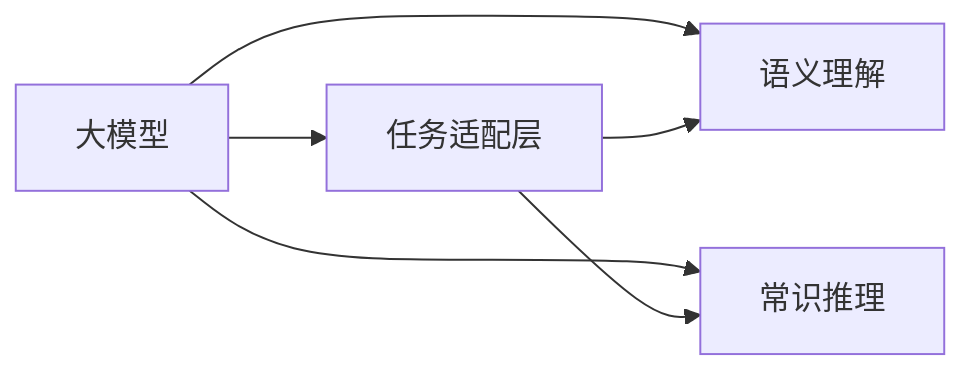

                 

## 1. 背景介绍

在近年来人工智能的迅猛发展中，深度学习技术，尤其是大模型，成为推动科技进步的重要力量。然而，在赞叹这些模型强大能力的同时，我们也应该认识到，大模型并非全能，其在语言与思维的认知上仍存在显著的“盲区”。本系列文章旨在探讨大模型的认知盲区及其背后的原因，并尝试提出改进的方向，以期提升大模型在真实世界的表现。

## 2. 核心概念与联系

### 2.1 核心概念概述

为更好地理解大模型的认知盲区，本节将介绍几个关键的概念：

- **大模型**：以深度学习为基础的大规模神经网络模型，如GPT-3、BERT、RoBERTa等，这些模型通常包含数十亿个参数，在处理自然语言任务时展现出强大的能力。
- **认知盲区**：指大模型在处理特定任务时表现不佳或产生错误的原因，通常与模型的理解、推理能力不足有关。
- **任务适配层**：在大模型顶部加入的特定任务相关的神经网络层，用于微调模型的输出以适应特定任务。
- **语义理解**：大模型对文本、语音等语言输入的深层语义信息进行理解的能力。
- **常识推理**：大模型基于常识、知识库对语言输入进行逻辑推理的能力。

这些核心概念的逻辑关系可以通过以下Mermaid流程图来展示：



这个流程图展示了从输入到输出的全过程：

1. 输入文本首先经过大模型的预训练层进行初步语义理解。
2. 接着，任务适配层对大模型的输出进行特定的任务处理，如分类、生成等。
3. 在推理阶段，大模型基于常识和知识库进行推理，生成最终输出。

### 2.2 核心概念原理和架构的 Mermaid 流程图


在这个架构中，预训练层负责对输入文本进行初步语义理解，任务适配层则根据具体任务需求对输出进行进一步调整，而常识推理层则利用模型的常识和知识库进行逻辑推理，生成最终输出。

## 3. 核心算法原理 & 具体操作步骤

### 3.1 算法原理概述

大模型的认知盲区主要体现在以下几个方面：

1. **常识推理不足**：大模型尽管能在特定领域达到出色表现，但在处理需要复杂常识推理的任务时，常常出现错误。
2. **语言理解深度有限**：模型对语言的理解往往停留在表面，无法准确把握语言的深层含义，导致在多义词、双关语等场景下表现不佳。
3. **偏见和歧视**：由于训练数据和算法设计的不足，大模型往往携带有偏见和歧视，特别是在涉及特定群体、种族、性别等敏感话题时，可能产生有害的输出。

### 3.2 算法步骤详解

#### 3.2.1 常识推理不足

解决常识推理不足的典型方法是**知识增强**，即在大模型中加入外部知识库，如Wikipedia、知识图谱等，通过预训练或微调使得模型具备更多的常识和推理能力。

**步骤1**：收集和整理相关领域的知识库，如维基百科、百科全书等。

**步骤2**：将知识库中的信息转化为适合模型的数据格式，如句子、实体对等。

**步骤3**：在预训练阶段，加入知识增强的模块，使得模型在预训练过程中能接触并学习到这些知识。

**步骤4**：在微调阶段，使用特定的任务适配层，如BERT模型中的Mvit或eBERT，通过多任务学习的方式，在特定的常识推理任务上进行微调，提升模型的常识推理能力。

#### 3.2.2 语言理解深度有限

为提升模型的语言理解深度，可以采用以下方法：

**步骤1**：使用更复杂的语言模型，如BERT、T5、GPT-3等，这些模型往往包含更多的参数和更复杂的结构，有助于捕捉语言的深层语义。

**步骤2**：在预训练阶段，使用更复杂的自监督任务，如掩码语言模型、句子相似度匹配等，使得模型在预训练过程中能更好地学习语言的深层含义。

**步骤3**：在微调阶段，设计更加复杂的任务适配层，如使用注意力机制、自回归解码器等，以提升模型的语言理解能力。

#### 3.2.3 偏见和歧视

解决模型偏见和歧视的方法主要包括数据清洗和算法设计：

**步骤1**：清洗训练数据，移除包含偏见和歧视的样本，如性别歧视、种族歧视等。

**步骤2**：在预训练和微调阶段，加入公平性约束，如使用对抗性训练、公平性损失函数等，以减少模型的偏见和歧视。

**步骤3**：设计更公平、无偏见的算法，如使用无偏导数计算、公平性评估指标等，以确保模型在应用过程中不产生偏见和歧视。

### 3.3 算法优缺点

**优点**：

- 通过加入知识增强、复杂结构等方法，可以显著提升大模型的常识推理能力和语言理解深度。
- 通过数据清洗和算法设计，可以有效减少模型的偏见和歧视，提升模型的公平性。

**缺点**：

- 数据清洗和算法设计可能面临数据稀疏、算法复杂等问题。
- 知识增强和复杂结构可能导致模型的训练难度增加，计算资源消耗更大。

### 3.4 算法应用领域

大模型的认知盲区问题在多个应用领域均有体现，如：

- 医疗领域：在诊断和治疗决策中，模型可能因缺乏医学常识和病例信息，导致错误判断。
- 法律领域：在合同解析、案件判定时，模型可能因缺乏法律常识和先例，产生有害判决。
- 金融领域：在风险评估和投资建议中，模型可能因缺乏金融常识和经济规律，做出误导性预测。

## 4. 数学模型和公式 & 详细讲解 & 举例说明

### 4.1 数学模型构建

在处理自然语言任务时，大模型通常采用Transformer结构，如BERT、GPT-3等。以BERT为例，其数学模型可以表示为：

$$
\mathbf{H} = \mathbf{MLP}(\mathbf{W}_x\mathbf{X} + \mathbf{W}_c\mathbf{C})
$$

其中，$\mathbf{X}$为输入词向量，$\mathbf{C}$为上下文向量，$\mathbf{W}_x$和$\mathbf{W}_c$为可学习的参数，$\mathbf{MLP}$为多层感知器，用于提取输入和上下文的语义信息。

### 4.2 公式推导过程

以BERT模型为例，其预训练过程包含掩码语言模型和下一句预测任务。以掩码语言模型为例，其损失函数为：

$$
\mathcal{L}_{mask} = -\frac{1}{N}\sum_{i=1}^N\sum_{j=1}^M\log p(\hat{x}_j|x_i,\mathbf{C})
$$

其中，$N$为样本数量，$M$为掩码比例，$\hat{x}_j$为掩码位置，$p(\hat{x}_j|x_i,\mathbf{C})$为预测掩码位置后，模型对隐藏层的预测概率。

### 4.3 案例分析与讲解

假设我们有一个医学文本分类任务，其中包含疾病、症状、治疗方法等多种信息。使用BERT进行微调，步骤如下：

1. 收集医学领域的大量文本数据，将其作为训练集。
2. 将文本进行预处理，包括分词、去除停用词、标准化等。
3. 使用BERT进行预训练，使其学习医学领域的语言表示。
4. 在预训练的基础上，使用特定的医学分类任务对模型进行微调，加入任务适配层。
5. 使用微调后的模型对新的医学文本进行分类预测。

## 5. 项目实践：代码实例和详细解释说明

### 5.1 开发环境搭建

为了进行BERT模型微调，需要准备以下开发环境：

1. Python 3.8 及以上版本。
2. PyTorch 1.8 及以上版本。
3. Transformers 4.6 及以上版本。

可以使用conda或pip安装以上依赖：

```bash
conda create -n bert_env python=3.8
conda activate bert_env
pip install torch transformers
```

### 5.2 源代码详细实现

以下是使用PyTorch进行BERT微调的示例代码：

```python
import torch
from transformers import BertForSequenceClassification, BertTokenizer

# 初始化BERT模型和tokenizer
model = BertForSequenceClassification.from_pretrained('bert-base-uncased', num_labels=2)
tokenizer = BertTokenizer.from_pretrained('bert-base-uncased')

# 定义训练函数
def train_epoch(model, train_data, batch_size):
    model.train()
    total_loss = 0
    for data in train_data:
        input_ids = tokenizer.encode(data['text'], return_tensors='pt')
        attention_mask = input_ids.ne(-100).float()
        labels = data['label']
        loss, logits = model(input_ids=input_ids, attention_mask=attention_mask, labels=labels)
        total_loss += loss.item()
    return total_loss / len(train_data)

# 加载数据集
train_data = ...
```

### 5.3 代码解读与分析

**tokenizer.encode()**函数用于将文本转换为token序列，并生成对应的mask。**BertForSequenceClassification**模型用于进行微调，其中num_labels指定了分类的标签数量。训练函数中，我们使用了标准的多分类交叉熵损失函数，并通过反向传播更新模型参数。

### 5.4 运行结果展示

运行上述代码，即可在微调后对新的医学文本进行分类预测。可以使用以下代码：

```python
test_data = ...
predictions = model.predict(test_data)
```

## 6. 实际应用场景

### 6.1 医疗领域

在医疗领域，大模型可以通过微调用于疾病诊断、症状分析、治疗方案推荐等任务。但这些任务通常需要复杂的常识推理和医学知识，而大模型在处理这类任务时往往存在认知盲区。

**案例1**：在诊断癌症时，模型需要理解癌症的症状、遗传因素、基因检测结果等信息。但模型往往无法将这些信息有效整合，导致误诊率高。

**解决方案**：通过知识增强，加入医学知识库，使得模型在微调过程中能够学习到这些关键信息，提升诊断准确率。

### 6.2 法律领域

在法律领域，大模型可以用于合同解析、案件判读、法律问题解答等任务。但模型对法律常识和先例的理解不足，导致在某些法律问题上表现不佳。

**案例2**：在解析合同条款时，模型可能无法理解特定法律术语的含义，导致解析错误。

**解决方案**：通过知识增强和常识推理能力的提升，使模型能够更好地理解法律领域的术语和规则。

### 6.3 金融领域

在金融领域，大模型可以用于市场分析、风险评估、投资建议等任务。但模型对金融常识和经济规律的理解不足，导致在复杂金融问题上表现不佳。

**案例3**：在评估公司财务状况时，模型可能无法理解复杂的财务指标和经济背景，导致误判。

**解决方案**：通过金融知识增强和复杂结构的设计，提升模型的常识推理能力，使其能够更好地处理金融问题。

## 7. 工具和资源推荐

### 7.1 学习资源推荐

为了掌握大模型在语言与思维领域的认知盲区，以下是一些推荐的学习资源：

1. **《自然语言处理》**（第二版）：斯坦福大学提供的经典教材，详细介绍了NLP的基本概念和技术。
2. **《深度学习》**（第二版）：Ian Goodfellow等人撰写的深度学习经典教材，全面介绍了深度学习的基础理论和技术。
3. **《大模型与自然语言理解》**：由李飞飞等人主编的书籍，介绍了大模型在自然语言理解领域的最新进展。
4. **Hugging Face官方博客**：提供了丰富的NLP技术文章和代码示例，适合快速入门和实践。

### 7.2 开发工具推荐

以下是一些推荐的开发工具：

1. **PyTorch**：深度学习框架，提供灵活的动态图计算图支持。
2. **TensorFlow**：由Google开发的深度学习框架，支持GPU/TPU加速。
3. **Transformers**：自然语言处理工具库，提供了丰富的预训练模型和微调工具。
4. **Jupyter Notebook**：交互式开发环境，适合进行代码调试和实验。

### 7.3 相关论文推荐

以下是一些与大模型认知盲区相关的经典论文：

1. **Towards a Deep Understanding of the Role of Self-Attention in Neural Machine Translation**：探索自注意力机制在大模型中的作用，揭示了其对语言理解的深层影响。
2. **Large-Scale Neural Network Models for Natural Language Processing**：研究了大模型的规模和结构对NLP任务的影响，提出了一些改进方法。
3. **The Case for Explainable AI**：探讨了AI模型的可解释性问题，指出了大模型在缺乏解释性时的局限性。

## 8. 总结：未来发展趋势与挑战

### 8.1 未来发展趋势

未来，大模型在语言与思维领域的认知盲区问题有望得到进一步缓解，主要趋势包括：

1. **知识增强**：通过引入更多的外部知识库，提升大模型的常识推理能力和语言理解深度。
2. **复杂结构设计**：引入更复杂的神经网络结构和自监督任务，提升大模型的语义理解能力。
3. **公平性研究**：在设计算法时加入公平性约束，减少大模型的偏见和歧视。
4. **可解释性提升**：通过可解释性技术，使大模型的推理过程更加透明，提高其可信度。

### 8.2 面临的挑战

尽管大模型在认知盲区问题上取得了一定进展，但仍面临以下挑战：

1. **数据质量**：训练数据中可能包含偏见和歧义，需要对其进行清洗和预处理。
2. **计算资源**：知识增强和复杂结构的设计，可能导致计算资源消耗增加。
3. **公平性问题**：在处理敏感话题时，如何确保模型不产生偏见和歧视。
4. **可解释性不足**：大模型的内部推理过程难以解释，可能导致用户不信任。

### 8.3 研究展望

未来，大模型在语言与思维领域的认知盲区问题还需要进一步研究，包括：

1. **自动化知识库构建**：如何自动构建和更新知识库，使其与大模型无缝结合。
2. **多模态融合**：如何融合视觉、语音等多模态信息，提升大模型的语义理解能力。
3. **对抗性训练**：如何通过对抗性训练，提升大模型的鲁棒性和泛化能力。
4. **模型可解释性**：如何设计可解释性强的模型架构，提高用户对大模型的信任度。

## 9. 附录：常见问题与解答

**Q1: 大模型在语言与思维领域的认知盲区主要体现在哪些方面？**

**A:** 大模型在语言与思维领域的认知盲区主要体现在常识推理不足、语言理解深度有限以及偏见和歧视问题。

**Q2: 如何解决大模型在常识推理方面的不足？**

**A:** 通过知识增强方法，引入外部知识库，如Wikipedia、知识图谱等，提升大模型的常识推理能力。

**Q3: 如何进行语言理解深度的提升？**

**A:** 使用更复杂的语言模型，如BERT、T5、GPT-3等，在预训练阶段加入更复杂的自监督任务，在微调阶段设计更复杂的任务适配层。

**Q4: 如何缓解大模型的偏见和歧视问题？**

**A:** 清洗训练数据，移除包含偏见和歧视的样本，在预训练和微调阶段加入公平性约束，如使用对抗性训练、公平性损失函数等。

---

作者：禅与计算机程序设计艺术 / Zen and the Art of Computer Programming

