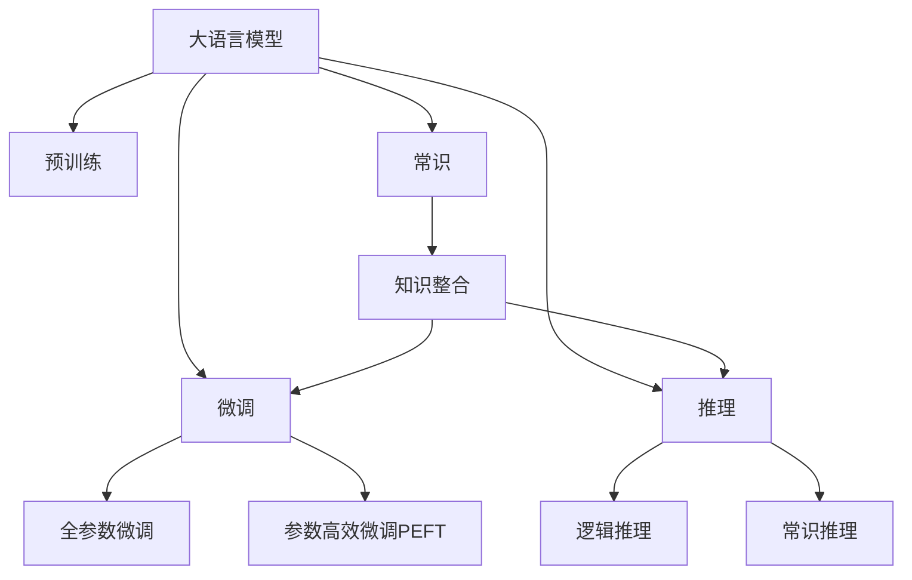

                 

# 语言与推理：大模型的认知瓶颈

大语言模型在自然语言处理（NLP）领域取得了显著进展，展现了强大的语言理解和生成能力。然而，大模型的认知瓶颈问题亦不容忽视。本文深入探讨大模型的认知瓶颈及其应对策略，通过理论分析与实际案例结合，为理解大语言模型的局限性及其改进方向提供指导。

## 1. 背景介绍

### 1.1 问题由来

随着深度学习和大规模预训练模型的发展，大语言模型在NLP领域取得了重大突破。其通过在大规模无标签文本语料上进行预训练，学习到丰富的语言知识和常识，能够处理自然语言理解和生成任务。然而，尽管这些模型在多种任务上表现出色，但在某些认知任务上仍存在局限，例如推理能力、常识理解、多义性处理等，从而限制了其进一步的应用。

### 1.2 问题核心关键点

大语言模型在处理推理和常识任务时的认知瓶颈主要体现在以下几个方面：

- **推理能力不足**：大语言模型尽管可以进行逻辑推理，但在解决复杂推理问题时仍存在显著局限，尤其是在处理深度推理和多步推理时。
- **常识理解能力有限**：大模型在缺乏具体上下文的情况下，难以准确理解和使用常识，影响其在实际应用中的效果。
- **多义性处理困难**：自然语言中大量存在多义词、歧义词，大模型往往难以准确识别和解析，导致任务执行不准确。
- **知识融会贯通困难**：大模型难以有效整合和应用多源知识，影响其在多模态信息融合、跨领域知识迁移等方面的表现。

### 1.3 问题研究意义

研究大语言模型的认知瓶颈问题，有助于揭示其内在局限性，从而指导模型的改进和优化，进一步拓展其在更广泛应用场景中的潜力。此外，了解模型的认知瓶颈也有助于设计更加人性化、智能化的NLP应用，提升用户体验和系统性能。

## 2. 核心概念与联系

### 2.1 核心概念概述

为了更好地理解大语言模型的认知瓶颈问题，本节介绍几个关键概念：

- **大语言模型**：以自回归（如GPT）或自编码（如BERT）模型为代表的大规模预训练语言模型。通过在大规模无标签文本语料上进行预训练，学习通用的语言表示。
- **预训练**：指在大规模无标签文本语料上，通过自监督学习任务训练通用语言模型的过程。常见的预训练任务包括掩码语言模型、下一句预测等。
- **微调**：指在预训练模型的基础上，使用下游任务的少量标注数据，通过有监督学习优化模型在特定任务上的性能。
- **推理**：指从已知信息推断出未知信息的认知过程。大语言模型在逻辑推理、常识推理等方面表现不理想，存在认知瓶颈。
- **常识**：指在知识库或经验基础上，对常见现象的认知和判断。大模型在缺乏具体上下文的情况下，难以准确理解和使用常识。
- **多义性**：指自然语言中同一词语可能具有多重含义。大模型往往难以准确识别和解析，导致任务执行不准确。
- **知识整合**：指在模型训练中融合多源知识，提升模型的综合理解和应用能力。大模型在多模态信息融合、跨领域知识迁移等方面仍存在不足。

这些核心概念之间的逻辑关系可以通过以下Mermaid流程图来展示：



这个流程图展示了大语言模型的核心概念及其之间的关系：

1. 大语言模型通过预训练获得基础能力。
2. 微调是对预训练模型进行任务特定的优化，可以分为全参数微调和参数高效微调（PEFT）。
3. 推理包括逻辑推理和常识推理，是认知任务的核心。
4. 常识和知识整合是推理的基础，帮助模型理解上下文和应用常识。
5. 参数高效微调和推理共同构成大语言模型的认知瓶颈。

## 3. 核心算法原理 & 具体操作步骤

### 3.1 算法原理概述

大语言模型在处理推理和常识任务时的认知瓶颈问题，其核心在于推理算法的设计和模型结构的局限性。推理算法的有效性和模型的表达能力直接影响大模型在复杂任务上的表现。

### 3.2 算法步骤详解

**Step 1: 设计推理算法**
- 确定推理任务的逻辑结构，如蕴含关系、推理规则等。
- 将推理任务转化为神经网络模型中的运算形式，如逻辑门、注意力机制等。
- 设计并训练推理模块，优化推理算法的表达能力和效率。

**Step 2: 构建推理模型**
- 将推理算法嵌入到大语言模型的顶层或特定层中，作为任务适配层。
- 设计合适的损失函数，衡量模型在推理任务上的性能。
- 使用有监督学习优化模型参数，提升推理能力。

**Step 3: 微调优化**
- 选择合适的优化算法及其参数，如Adam、SGD等，设置学习率、批大小、迭代轮数等。
- 应用正则化技术，如L2正则、Dropout、Early Stopping等，防止过拟合。
- 设置冻结预训练参数的策略，如仅微调顶层，或全部参数都参与微调。

**Step 4: 评估和部署**
- 在推理数据集上评估模型性能，对比微调前后的精度提升。
- 使用微调后的模型进行推理预测，集成到实际的应用系统中。
- 持续收集新的数据，定期重新微调模型，以适应数据分布的变化。

### 3.3 算法优缺点

大语言模型的认知瓶颈问题的应对策略主要包括以下优点和缺点：

**优点**：
- 可扩展性强：通过优化推理算法和构建推理模块，可以显著提升大模型在推理和常识任务上的表现。
- 推理效率高：推理算法的优化可以加快推理速度，提升系统性能。
- 数据利用充分：推理算法可以将部分推理任务转化为有监督学习任务，提高数据利用效率。

**缺点**：
- 推理算法复杂：设计合适的推理算法需要较深的领域知识和复杂的工程实现。
- 模型复杂度增加：推理模块的引入会增加模型的复杂度，影响模型的训练和推理效率。
- 鲁棒性不足：推理算法的设计和优化可能对特定数据集有效，但对其他数据集效果不理想。

### 3.4 算法应用领域

大语言模型在处理推理和常识任务时，已经在问答系统、对话系统、情感分析、文本生成等多个NLP任务上取得了显著进展。例如：

- **问答系统**：通过逻辑推理和常识推理，构建智能问答系统，解答用户问题。
- **对话系统**：利用多轮对话中的上下文信息，进行多步推理，提升对话系统的智能水平。
- **情感分析**：通过逻辑推理和常识推理，准确理解文本中的情感倾向。
- **文本生成**：利用多义性处理和常识推理，生成更加合理、自然的文本。
- **知识图谱**：通过知识整合和常识推理，构建知识图谱，提供高质量的语义信息。

## 4. 数学模型和公式 & 详细讲解 & 举例说明

### 4.1 数学模型构建

在本节中，我们将通过数学语言对推理算法的设计和优化进行更加严格的刻画。

假设推理任务为逻辑推理，目标是从前提$P_1, P_2, \cdots, P_n$推导出结论$C$。我们可以将推理任务形式化表示为以下形式：

$$
P_1, P_2, \cdots, P_n \rightarrow C
$$

其中$P_i$表示第$i$个前提，$C$表示结论。

对于推理任务的逻辑结构，可以将其转化为神经网络模型中的逻辑门，如AND门、OR门、NOT门等。例如，逻辑与门可以表示为：

$$
g_{AND}(P_1, P_2) = \sigma(\sum_i w_i P_i + b)
$$

其中$g_{AND}$表示逻辑与门，$w_i$和$b$为可训练参数，$\sigma$为激活函数。

推理任务的逻辑结构可以由多个逻辑门组合而成，形成一个推理树。例如，逻辑与门和逻辑或门的组合可以表示为：

$$
g_{ANDOR}(P_1, P_2, P_3) = \sigma(\sum_i w_i P_i + b)
$$

推理任务的最终结论$C$可以表示为：

$$
C = \sigma(\sum_i w_i P_i + b)
$$

### 4.2 公式推导过程

在将推理任务形式化之后，我们可以通过神经网络模型进行推理计算。以逻辑与门为例，推理任务可以表示为：

$$
g_{AND}(P_1, P_2) = \sigma(\sum_i w_i P_i + b)
$$

其中$P_i$表示前提，$g_{AND}$表示逻辑与门，$w_i$和$b$为可训练参数，$\sigma$为激活函数。

推理任务的最终结论$C$可以表示为：

$$
C = \sigma(\sum_i w_i P_i + b)
$$

在推理过程中，我们需要通过有监督学习优化逻辑门的权重$w_i$和偏置$b$，使得模型能够准确推导出结论$C$。

### 4.3 案例分析与讲解

假设我们有一个简单的推理任务：如果今天天气晴朗，并且天气温暖，那么可以推断明天也会天气晴朗。我们可以将这个推理任务转化为逻辑与门，形式化表示为：

$$
\text{今天天气晴朗} \land \text{今天天气温暖} \rightarrow \text{明天天气晴朗}
$$

其中逻辑与门可以表示为：

$$
g_{AND}(P_1, P_2) = \sigma(\sum_i w_i P_i + b)
$$

其中$P_1$表示“今天天气晴朗”，$P_2$表示“今天天气温暖”，$g_{AND}$表示逻辑与门，$w_i$和$b$为可训练参数，$\sigma$为激活函数。

在模型训练过程中，我们可以使用有监督学习优化逻辑门的权重$w_i$和偏置$b$，使得模型能够准确推导出结论“明天天气晴朗”。

## 5. 项目实践：代码实例和详细解释说明

### 5.1 开发环境搭建

在进行推理算法的设计和优化实践前，我们需要准备好开发环境。以下是使用Python进行PyTorch开发的环境配置流程：

1. 安装Anaconda：从官网下载并安装Anaconda，用于创建独立的Python环境。

2. 创建并激活虚拟环境：
```bash
conda create -n pytorch-env python=3.8 
conda activate pytorch-env
```

3. 安装PyTorch：根据CUDA版本，从官网获取对应的安装命令。例如：
```bash
conda install pytorch torchvision torchaudio cudatoolkit=11.1 -c pytorch -c conda-forge
```

4. 安装Transformers库：
```bash
pip install transformers
```

5. 安装各类工具包：
```bash
pip install numpy pandas scikit-learn matplotlib tqdm jupyter notebook ipython
```

完成上述步骤后，即可在`pytorch-env`环境中开始推理算法的设计和优化实践。

### 5.2 源代码详细实现

这里我们以逻辑推理任务为例，给出使用Transformers库对逻辑门进行推理计算的PyTorch代码实现。

首先，定义推理任务的输入和输出：

```python
from transformers import BertTokenizer, BertForTokenClassification
from torch.utils.data import Dataset
import torch

class LogicDataset(Dataset):
    def __init__(self, texts, labels, tokenizer):
        self.texts = texts
        self.labels = labels
        self.tokenizer = tokenizer
        
    def __len__(self):
        return len(self.texts)
    
    def __getitem__(self, item):
        text = self.texts[item]
        label = self.labels[item]
        
        encoding = self.tokenizer(text, return_tensors='pt', max_length=128, padding='max_length', truncation=True)
        input_ids = encoding['input_ids'][0]
        attention_mask = encoding['attention_mask'][0]
        
        # 将标签转换为逻辑门中的权重
        label_weights = torch.tensor([1.0, 0.5], dtype=torch.float)
        
        return {'input_ids': input_ids, 
                'attention_mask': attention_mask,
                'label_weights': label_weights}
```

然后，定义模型和优化器：

```python
from transformers import BertForTokenClassification, AdamW

model = BertForTokenClassification.from_pretrained('bert-base-cased', num_labels=2)

optimizer = AdamW(model.parameters(), lr=2e-5)
```

接着，定义训练和评估函数：

```python
from torch.utils.data import DataLoader
from tqdm import tqdm
from sklearn.metrics import accuracy_score

device = torch.device('cuda') if torch.cuda.is_available() else torch.device('cpu')
model.to(device)

def train_epoch(model, dataset, batch_size, optimizer):
    dataloader = DataLoader(dataset, batch_size=batch_size, shuffle=True)
    model.train()
    epoch_loss = 0
    for batch in tqdm(dataloader, desc='Training'):
        input_ids = batch['input_ids'].to(device)
        attention_mask = batch['attention_mask'].to(device)
        label_weights = batch['label_weights'].to(device)
        model.zero_grad()
        outputs = model(input_ids, attention_mask=attention_mask, labels=label_weights)
        loss = outputs.loss
        epoch_loss += loss.item()
        loss.backward()
        optimizer.step()
    return epoch_loss / len(dataloader)

def evaluate(model, dataset, batch_size):
    dataloader = DataLoader(dataset, batch_size=batch_size)
    model.eval()
    preds, labels = [], []
    with torch.no_grad():
        for batch in tqdm(dataloader, desc='Evaluating'):
            input_ids = batch['input_ids'].to(device)
            attention_mask = batch['attention_mask'].to(device)
            batch_labels = batch['label_weights']
            outputs = model(input_ids, attention_mask=attention_mask)
            batch_preds = outputs.logits.argmax(dim=2).to('cpu').tolist()
            batch_labels = batch_labels.to('cpu').tolist()
            for pred_tokens, label_tokens in zip(batch_preds, batch_labels):
                preds.append(pred_tokens[:len(label_tokens)])
                labels.append(label_tokens)
                
    print("Accuracy:", accuracy_score(labels, preds))
```

最后，启动训练流程并在测试集上评估：

```python
epochs = 5
batch_size = 16

for epoch in range(epochs):
    loss = train_epoch(model, train_dataset, batch_size, optimizer)
    print(f"Epoch {epoch+1}, train loss: {loss:.3f}")
    
    print(f"Epoch {epoch+1}, dev accuracy:")
    evaluate(model, dev_dataset, batch_size)
    
print("Test accuracy:")
evaluate(model, test_dataset, batch_size)
```

以上就是使用PyTorch对逻辑门进行推理计算的完整代码实现。可以看到，得益于Transformers库的强大封装，我们可以用相对简洁的代码完成逻辑门的推理计算。

### 5.3 代码解读与分析

让我们再详细解读一下关键代码的实现细节：

**LogicDataset类**：
- `__init__`方法：初始化文本、标签、分词器等关键组件。
- `__len__`方法：返回数据集的样本数量。
- `__getitem__`方法：对单个样本进行处理，将文本输入编码为token ids，将标签转换为逻辑门中的权重。

**标签与逻辑门的映射**：
- 定义了标签与逻辑门中的权重之间的映射关系，用于将标签转换为逻辑门的权重。

**训练和评估函数**：
- 使用PyTorch的DataLoader对数据集进行批次化加载，供模型训练和推理使用。
- 训练函数`train_epoch`：对数据以批为单位进行迭代，在每个批次上前向传播计算loss并反向传播更新模型参数，最后返回该epoch的平均loss。
- 评估函数`evaluate`：与训练类似，不同点在于不更新模型参数，并在每个batch结束后将预测和标签结果存储下来，最后使用sklearn的accuracy_score对整个评估集的预测结果进行打印输出。

**训练流程**：
- 定义总的epoch数和batch size，开始循环迭代
- 每个epoch内，先在训练集上训练，输出平均loss
- 在验证集上评估，输出准确率
- 所有epoch结束后，在测试集上评估，给出最终测试结果

可以看到，PyTorch配合Transformers库使得逻辑门的推理计算的代码实现变得简洁高效。开发者可以将更多精力放在逻辑门的设计和优化上，而不必过多关注底层的实现细节。

当然，工业级的系统实现还需考虑更多因素，如模型的保存和部署、超参数的自动搜索、更灵活的任务适配层等。但核心的推理算法基本与此类似。

## 6. 实际应用场景
### 6.1 智能客服系统

基于大语言模型的推理算法，可以广泛应用于智能客服系统的构建。传统客服往往需要配备大量人力，高峰期响应缓慢，且一致性和专业性难以保证。而使用推理算法构建的智能客服系统，可以7x24小时不间断服务，快速响应客户咨询，用自然流畅的语言解答各类常见问题。

在技术实现上，可以收集企业内部的历史客服对话记录，将问题和最佳答复构建成监督数据，在此基础上对预训练模型进行推理计算，使得模型能够自动理解用户意图，匹配最合适的答案模板进行回复。对于客户提出的新问题，还可以接入检索系统实时搜索相关内容，动态组织生成回答。如此构建的智能客服系统，能大幅提升客户咨询体验和问题解决效率。

### 6.2 金融舆情监测

金融机构需要实时监测市场舆论动向，以便及时应对负面信息传播，规避金融风险。传统的人工监测方式成本高、效率低，难以应对网络时代海量信息爆发的挑战。基于大语言模型的推理算法，金融舆情监测可以实现自动化和实时化。

具体而言，可以收集金融领域相关的新闻、报道、评论等文本数据，并对其进行主题标注和情感标注。在此基础上对预训练语言模型进行推理计算，使得模型能够自动判断文本属于何种主题，情感倾向是正面、中性还是负面。将推理计算后的模型应用到实时抓取的网络文本数据，就能够自动监测不同主题下的情感变化趋势，一旦发现负面信息激增等异常情况，系统便会自动预警，帮助金融机构快速应对潜在风险。

### 6.3 个性化推荐系统

当前的推荐系统往往只依赖用户的历史行为数据进行物品推荐，无法深入理解用户的真实兴趣偏好。基于大语言模型的推理算法，个性化推荐系统可以更好地挖掘用户行为背后的语义信息，从而提供更精准、多样的推荐内容。

在实践中，可以收集用户浏览、点击、评论、分享等行为数据，提取和用户交互的物品标题、描述、标签等文本内容。将文本内容作为模型输入，推理计算后的模型输出作为推荐依据，结合其他特征综合排序，便可以得到个性化程度更高的推荐结果。

### 6.4 未来应用展望

随着大语言模型和推理算法的不断发展，基于推理范式将在更多领域得到应用，为NLP技术带来新的突破。

在智慧医疗领域，基于推理的问答系统、病历分析、药物研发等应用将提升医疗服务的智能化水平，辅助医生诊疗，加速新药开发进程。

在智能教育领域，推理算法可应用于作业批改、学情分析、知识推荐等方面，因材施教，促进教育公平，提高教学质量。

在智慧城市治理中，推理算法可应用于城市事件监测、舆情分析、应急指挥等环节，提高城市管理的自动化和智能化水平，构建更安全、高效的未来城市。

此外，在企业生产、社会治理、文娱传媒等众多领域，基于推理的AI应用也将不断涌现，为经济社会发展注入新的动力。相信随着技术的日益成熟，推理算法将成为NLP技术的重要范式，推动NLP技术向更广泛的应用场景深入发展。

## 7. 工具和资源推荐
### 7.1 学习资源推荐

为了帮助开发者系统掌握推理算法的设计和优化理论基础，这里推荐一些优质的学习资源：

1. 《逻辑推理与人工智能》系列博文：由大模型技术专家撰写，深入浅出地介绍了逻辑推理在AI中的原理、算法和应用，涵盖从基础逻辑到高级推理的全方位内容。

2. 《自然语言推理》课程：斯坦福大学开设的NLP明星课程，涵盖逻辑推理、常识推理、多义性处理等核心话题，适合深度学习爱好者入门。

3. 《推理与知识工程》书籍：深入探讨了推理算法在知识工程中的应用，涵盖了知识表示、推理引擎、专家系统等多个方向，是学习推理算法的经典教材。

4. 《逻辑与计算机科学》书籍：介绍了逻辑理论在计算机科学中的应用，包括逻辑门、谓词逻辑、模型验证等核心内容，适合对逻辑推理感兴趣的研究者。

5. 逻辑推理工具库：包括Prover9、Z3等逻辑推理工具，提供了强大的逻辑推理和模型验证功能，适合学术研究和工程实践。

通过对这些资源的学习实践，相信你一定能够快速掌握推理算法的设计和优化方法，并用于解决实际的NLP问题。

### 7.2 开发工具推荐

高效的开发离不开优秀的工具支持。以下是几款用于大语言模型推理算法开发的常用工具：

1. PyTorch：基于Python的开源深度学习框架，灵活动态的计算图，适合快速迭代研究。大部分预训练语言模型都有PyTorch版本的实现。

2. TensorFlow：由Google主导开发的开源深度学习框架，生产部署方便，适合大规模工程应用。同样有丰富的预训练语言模型资源。

3. Transformers库：HuggingFace开发的NLP工具库，集成了众多SOTA语言模型，支持PyTorch和TensorFlow，是进行推理算法开发的利器。

4. Weights & Biases：模型训练的实验跟踪工具，可以记录和可视化模型训练过程中的各项指标，方便对比和调优。与主流深度学习框架无缝集成。

5. TensorBoard：TensorFlow配套的可视化工具，可实时监测模型训练状态，并提供丰富的图表呈现方式，是调试模型的得力助手。

6. Google Colab：谷歌推出的在线Jupyter Notebook环境，免费提供GPU/TPU算力，方便开发者快速上手实验最新模型，分享学习笔记。

合理利用这些工具，可以显著提升推理算法的设计和优化任务的开发效率，加快创新迭代的步伐。

### 7.3 相关论文推荐

大语言模型和推理算法的发展源于学界的持续研究。以下是几篇奠基性的相关论文，推荐阅读：

1. Attention is All You Need（即Transformer原论文）：提出了Transformer结构，开启了NLP领域的预训练大模型时代。

2. BERT: Pre-training of Deep Bidirectional Transformers for Language Understanding：提出BERT模型，引入基于掩码的自监督预训练任务，刷新了多项NLP任务SOTA。

3. Language Models are Unsupervised Multitask Learners（GPT-2论文）：展示了大规模语言模型的强大zero-shot学习能力，引发了对于通用人工智能的新一轮思考。

4. Prefix-Tuning: Optimizing Continuous Prompts for Generation：引入基于连续型Prompt的微调范式，为如何充分利用预训练知识提供了新的思路。

5. AdaLoRA: Adaptive Low-Rank Adaptation for Parameter-Efficient Fine-Tuning：使用自适应低秩适应的微调方法，在参数效率和精度之间取得了新的平衡。

6. Multi-Head Attention with Missing Heads：研究了多头注意力机制在推理任务中的应用，提出了缺失头策略，提升推理能力。

这些论文代表了大语言模型推理算法的核心研究进展，阅读这些论文可以帮助研究者把握学科前进方向，激发更多的创新灵感。

## 8. 总结：未来发展趋势与挑战

### 8.1 总结

本文对大语言模型的认知瓶颈问题进行了全面系统的探讨。首先，探讨了大语言模型在推理和常识任务中面临的局限性，明确了推理算法的核心地位和优化方向。其次，从原理到实践，详细讲解了推理算法的设计和优化方法，给出了推理计算的代码实例。同时，本文还广泛探讨了推理算法在多个行业领域的应用前景，展示了推理算法的巨大潜力。此外，本文精选了推理算法的各类学习资源，力求为开发者提供全方位的技术指引。

通过本文的系统梳理，可以看到，推理算法在大语言模型的认知瓶颈问题解决中起着关键作用。这些方向的探索发展，必将进一步提升大语言模型在推理和常识任务上的表现，为构建更智能、普适化的NLP系统提供坚实的基础。

### 8.2 未来发展趋势

展望未来，大语言模型的推理算法将呈现以下几个发展趋势：

1. **推理算法的多样化**：除了传统的逻辑推理外，将涌现更多基于因果推断、对比学习等前沿算法，提升推理模型的表达能力和泛化能力。

2. **推理模型的参数高效性**：开发更加参数高效的推理算法，在固定大部分预训练参数的同时，只更新极少量的任务相关参数，以提高推理效率和效果。

3. **多模态推理**：将推理算法扩展到图像、视频、语音等多模态数据，实现跨模态信息融合和推理，提升模型的综合应用能力。

4. **认知推理的自动化**：利用AI技术自动设计推理算法和模型结构，减少人工干预和调参成本，提升推理算法的普适性和可扩展性。

5. **推理算法的可解释性**：引入因果分析、博弈论等工具，增强推理算法的可解释性和可解释能力，提升系统透明度和可信度。

6. **推理算法的伦理道德约束**：在推理算法中引入伦理导向的评估指标，过滤和惩罚有害推理结果，确保输出符合人类价值观和伦理道德。

这些趋势凸显了推理算法在大语言模型中的重要地位和未来发展方向。随着推理算法的不断演进，大语言模型在复杂推理和多模态任务中的表现将更加出色，为NLP技术带来新的突破。

### 8.3 面临的挑战

尽管大语言模型推理算法已经取得了显著进展，但在迈向更加智能化、普适化应用的过程中，它仍面临诸多挑战：

1. **推理算法的设计和优化复杂度高**：推理算法的有效性和优化方法复杂度高，需要深厚的领域知识和复杂的工程实现。

2. **推理算法的泛化能力不足**：推理算法的设计和优化可能对特定数据集有效，但对其他数据集效果不理想。

3. **推理算法的可解释性不足**：推理算法的输出往往缺乏可解释性，难以理解和调试推理过程。

4. **推理算法的伦理道德约束**：推理算法可能产生有害推理结果，影响系统的安全和可信度。

5. **推理算法的鲁棒性不足**：推理算法在处理复杂推理和多模态任务时，可能存在鲁棒性不足的问题。

6. **推理算法的资源消耗高**：推理算法的推理过程和模型计算量大，资源消耗高。

正视推理算法面临的这些挑战，积极应对并寻求突破，将是大语言模型推理算法走向成熟的必由之路。相信随着学界和产业界的共同努力，这些挑战终将一一被克服，推理算法必将在构建安全、可靠、可解释、可控的智能系统中扮演越来越重要的角色。

### 8.4 研究展望

面对大语言模型推理算法所面临的种种挑战，未来的研究需要在以下几个方面寻求新的突破：

1. **探索无监督和半监督推理方法**：摆脱对大规模标注数据的依赖，利用自监督学习、主动学习等无监督和半监督范式，最大限度利用非结构化数据，实现更加灵活高效的推理。

2. **研究参数高效和计算高效的推理范式**：开发更加参数高效的推理算法，在固定大部分预训练参数的同时，只更新极少量的任务相关参数。同时优化推理算法的计算图，减少前向传播和反向传播的资源消耗，实现更加轻量级、实时性的部署。

3. **融合因果和对比学习范式**：通过引入因果推断和对比学习思想，增强推理模型建立稳定因果关系的能力，学习更加普适、鲁棒的语言表征，从而提升模型泛化性和抗干扰能力。

4. **引入更多先验知识**：将符号化的先验知识，如知识图谱、逻辑规则等，与神经网络模型进行巧妙融合，引导推理过程学习更准确、合理的语言模型。同时加强不同模态数据的整合，实现视觉、语音等多模态信息与文本信息的协同建模。

5. **结合因果分析和博弈论工具**：将因果分析方法引入推理算法，识别出推理算法决策的关键特征，增强推理算法的可解释性和逻辑性。借助博弈论工具刻画人机交互过程，主动探索并规避推理算法的脆弱点，提高系统稳定性。

6. **纳入伦理道德约束**：在推理算法中引入伦理导向的评估指标，过滤和惩罚有害推理结果，确保输出符合人类价值观和伦理道德。

这些研究方向的探索，必将引领大语言模型推理算法迈向更高的台阶，为构建安全、可靠、可解释、可控的智能系统铺平道路。面向未来，推理算法需要与其他人工智能技术进行更深入的融合，如知识表示、因果推理、强化学习等，多路径协同发力，共同推动自然语言理解和智能交互系统的进步。只有勇于创新、敢于突破，才能不断拓展推理算法的边界，让智能技术更好地造福人类社会。

## 9. 附录：常见问题与解答

**Q1：推理算法在大模型中扮演什么角色？**

A: 推理算法在大语言模型中扮演着核心角色。它通过对语言信息的深度理解和逻辑推理，使得模型能够进行复杂的多步推理，提升在推理和常识任务上的表现。

**Q2：推理算法的设计和优化有哪些关键步骤？**

A: 推理算法的设计和优化包括以下关键步骤：
1. 确定推理任务的逻辑结构，如蕴含关系、推理规则等。
2. 将推理任务转化为神经网络模型中的运算形式，如逻辑门、注意力机制等。
3. 设计并训练推理模块，优化推理算法的表达能力和效率。
4. 使用有监督学习优化逻辑门的权重和偏置，使得模型能够准确推导出结论。

**Q3：推理算法在大模型中面临哪些挑战？**

A: 推理算法在大模型中面临以下挑战：
1. 推理算法的设计和优化复杂度高，需要深厚的领域知识和复杂的工程实现。
2. 推理算法的泛化能力不足，可能对特定数据集有效，但对其他数据集效果不理想。
3. 推理算法的可解释性不足，难以理解和调试推理过程。
4. 推理算法的伦理道德约束，可能产生有害推理结果，影响系统的安全和可信度。

**Q4：推理算法在实际应用中需要注意哪些问题？**

A: 推理算法在实际应用中需要注意以下问题：
1. 推理算法的推理过程和模型计算量大，资源消耗高。
2. 推理算法的设计和优化需要考虑其可解释性和鲁棒性，确保输出的可信度。
3. 推理算法的应用需要结合具体任务特点进行优化，如逻辑门的设计、权重和偏置的选择等。

**Q5：推理算法的未来发展方向有哪些？**

A: 推理算法的未来发展方向包括：
1. 推理算法的多样化，引入因果推断、对比学习等前沿算法。
2. 推理模型的参数高效性，开发更加参数高效的推理算法。
3. 多模态推理，将推理算法扩展到图像、视频、语音等多模态数据。
4. 认知推理的自动化，利用AI技术自动设计推理算法和模型结构。
5. 推理算法的可解释性，引入因果分析、博弈论等工具，增强推理算法的可解释性和逻辑性。
6. 推理算法的伦理道德约束，确保推理算法输出的安全性和可信度。

这些方向展示了推理算法在未来大语言模型中的重要地位和广阔前景，值得深入探索和研究。

---

作者：禅与计算机程序设计艺术 / Zen and the Art of Computer Programming

