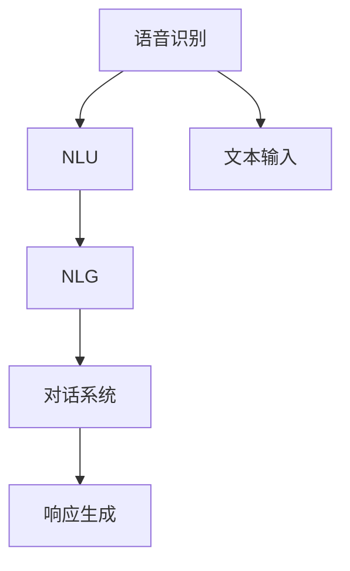

                 

# 语音助手技术在CUI中的应用

> 关键词：语音识别,自然语言理解(NLU),自然语言生成(NLG),对话系统,多模态交互,语义匹配,意图识别,情感分析

## 1. 背景介绍

随着人工智能技术的飞速发展，语音助手技术已经从实验室走向了千家万户，成为智能设备不可或缺的一部分。语音助手（Conversational User Interface, CUI）通过自然的语音交互，为用户提供了一系列便捷的服务，如语音搜索、智能家居控制、在线购物、预约订票等。然而，传统的基于规则或模板的语音助手系统，往往难以应对复杂多变的用户需求，导致交互体验较差、服务质量不稳定。

近年来，基于深度学习的语音助手技术在NLP领域取得了显著进展，通过语音识别、自然语言理解（NLU）、自然语言生成（NLG）和对话系统（Conversational Systems）等核心组件的协同工作，提供了更加智能化、自然流畅的语音交互体验。本文将对语音助手技术在CUI中的应用进行全面系统的介绍，涵盖语音识别、自然语言理解、自然语言生成和对话系统四个关键环节，帮助读者了解这些技术的工作原理和应用场景，并展望其未来发展趋势。

## 2. 核心概念与联系

### 2.1 核心概念概述

为更好地理解语音助手技术在CUI中的应用，本节将介绍几个密切相关的核心概念：

- 语音识别(Speech Recognition)：将人类的语音信号转换为文本，供NLU等后续模块处理。
- 自然语言理解(NLU)：从语音或文本输入中提取用户意图和实体，识别出对话的关键要素，是语音助手理解用户需求的核心组件。
- 自然语言生成(NLG)：根据NLU解析出的结果，生成符合语法的自然语言响应，提升语音助手的交互体验。
- 对话系统(Conversational Systems)：基于NLU解析出的用户意图和NLG生成的响应文本，进行逻辑推理和上下文管理，实现智能问答和交互。

这些核心概念之间的逻辑关系可以通过以下Mermaid流程图来展示：



这个流程图展示了大语言模型的核心概念及其之间的关系：

1. 语音识别将语音信号转换为文本，供后续处理。
2. 自然语言理解对文本进行语义分析，提取关键要素。
3. 自然语言生成生成符合语法的文本响应。
4. 对话系统基于NLU解析和NLG生成的内容，进行逻辑推理和上下文管理。

这些概念共同构成了语音助手技术的核心框架，使得语音助手可以自然流畅地与用户进行交互，提供高质量的智能服务。

## 3. 核心算法原理 & 具体操作步骤
### 3.1 算法原理概述

语音助手技术在CUI中的应用，本质上是一个语音信号处理、自然语言处理和对话管理的综合应用过程。其核心算法原理包括以下几个部分：

1. 语音识别（ASR，Automatic Speech Recognition）：通过深度神经网络模型，将语音信号转换为文本，供后续模块处理。常用的ASR模型包括RNN-T、Transformer等。
2. 自然语言理解（NLU）：利用语言模型和上下文感知机制，从文本中解析出用户意图和实体，如使用BERT、GPT等模型。
3. 自然语言生成（NLG）：基于意图和实体信息，生成符合语法规则的自然语言响应，常用方法包括基于模板的生成和基于深度学习的生成。
4. 对话管理（Dialog Management）：根据上下文和用户意图，进行逻辑推理和状态管理，实现智能问答和交互，常用方法包括基于规则的对话管理和基于神经网络的对话管理。

### 3.2 算法步骤详解

语音助手技术在CUI中的应用通常分为以下几个关键步骤：

**Step 1: 语音信号采集和预处理**
- 使用麦克风或阵列传感器采集用户的语音信号。
- 对语音信号进行降噪、去混响、增强等预处理，提升信号质量。

**Step 2: 语音信号特征提取**
- 使用梅尔频率倒谱系数（MFCC）等特征提取方法，将语音信号转换为特征向量。
- 将特征向量作为深度神经网络模型的输入，进行语音识别。

**Step 3: 语音识别**
- 使用RNN-T、Transformer等深度神经网络模型，对特征向量进行分类，将语音转换为文本。
- 输出文本信息，供自然语言理解模块进一步处理。

**Step 4: 自然语言理解**
- 将识别出的文本信息输入自然语言理解模块，利用语言模型和上下文感知机制，提取用户意图和实体。
- 常见方法包括使用BERT、GPT等模型进行语言表示学习，再使用上下文编码器如LSTM、GRU等进行意图和实体解析。

**Step 5: 自然语言生成**
- 基于NLU解析出的意图和实体，生成符合语法规则的自然语言响应。
- 常见方法包括基于模板的生成和基于深度学习的生成，如使用GPT-2等模型。

**Step 6: 对话管理**
- 根据上下文和用户意图，进行逻辑推理和状态管理，实现智能问答和交互。
- 常见方法包括基于规则的对话管理和基于神经网络的对话管理，如使用LSTM、GRU等模型。

**Step 7: 响应输出**
- 将生成的自然语言响应输出为语音信号，供用户接收。
- 通过TTS（Text-to-Speech）技术，将文本转换为清晰、自然的语音信号，提升用户体验。

### 3.3 算法优缺点

语音助手技术在CUI中的应用具有以下优点：
1. 自然流畅。语音助手能够自然地与用户进行语音交互，提升用户体验。
2. 无需手动输入。语音助手避免了手动输入的繁琐操作，解放用户双手。
3. 通用性强。语音助手能够适应各种设备，如手机、智能音箱、车载等，提供普适的服务。
4. 多模态交互。语音助手能够与视觉、触觉等多种感官进行交互，提供丰富的服务体验。

同时，该方法也存在一定的局限性：
1. 对语音环境要求高。语音助手需要清晰的环境噪音，环境复杂时识别率下降。
2. 识别速度慢。语音识别需要一定时间，当用户输入较快时，系统响应时间较长。
3. 依赖语音数据。语音助手的应用效果很大程度上依赖于语音数据的质量和数量，数据获取成本较高。
4. 语音交互范围有限。语音助手往往只能执行预定义的任务，对复杂场景的应对能力有限。

尽管存在这些局限性，但就目前而言，语音助手技术仍是大规模智能设备的重要组成部分，具有广泛的应用前景。未来相关研究的重点在于如何进一步降低语音识别的误差，提升系统的响应速度和处理能力，以及探索多模态交互方式，进一步拓展语音助手的应用边界。

### 3.4 算法应用领域

语音助手技术在CUI中的应用已经覆盖了多个行业，具体包括：

- 智能家居控制：通过语音助手，用户可以方便地控制家中的各种设备，如空调、灯光、窗帘等，提升生活便利性。
- 在线购物：语音助手能够理解用户的购物需求，帮助其进行搜索、推荐、下单等操作，提升购物体验。
- 语音搜索：用户可以通过语音搜索互联网，获取所需信息，如新闻、音乐、视频等，解放双手。
- 娱乐互动：语音助手可以与用户进行语音游戏、故事讲述等互动，提供娱乐服务。
- 智能客服：语音助手可以自动回答用户常见问题，提供24小时不间断服务，提升服务效率。
- 车载导航：语音助手可以帮助驾驶员进行路线规划、导航、语音提示等操作，提升驾驶安全性。
- 医疗健康：语音助手可以记录用户健康数据，提供健康建议和医疗咨询，提升健康管理水平。

语音助手技术在CUI中的应用，正在逐渐渗透到人们的生活方方面面，为智能化生活提供了强大的技术支持。随着深度学习和大数据分析技术的不断发展，语音助手技术还将带来更多的创新和突破，进一步提升人们的生产生活效率。

## 4. 数学模型和公式 & 详细讲解
### 4.1 数学模型构建

为了更好地理解语音助手技术在CUI中的应用，本节将使用数学语言对语音识别和自然语言理解两个核心组件进行更加严格的刻画。

**语音识别模型**
假设语音信号为 $x_t \in \mathbb{R}^d$，其中 $d$ 为特征维度，$t$ 表示时间步长。语音识别模型的目标是从 $x_t$ 中识别出最可能的文本序列 $y=\{y_1, y_2, ..., y_T\}$，其中 $y_t$ 为在时间步 $t$ 的预测字符。假设模型为条件概率模型，目标函数为：

$$
\min_{\theta} \mathbb{E}_{x_t} \big[ \mathcal{L}(M_{\theta}(x_t), y) \big]
$$

其中 $M_{\theta}(x_t)$ 为语音识别模型，$\mathcal{L}$ 为目标损失函数，$\theta$ 为模型参数。

**自然语言理解模型**
假设用户输入的文本序列为 $x=\{x_1, x_2, ..., x_N\}$，其中 $x_i$ 为时间步 $i$ 的输入字符。自然语言理解模型的目标是从 $x$ 中提取用户意图 $I$ 和实体 $E$，其数学模型可表示为：

$$
I, E = \min_{\theta} \mathbb{E}_{x} \big[ \mathcal{L}(M_{\theta}(x), I, E) \big]
$$

其中 $M_{\theta}(x)$ 为自然语言理解模型，$\mathcal{L}$ 为目标损失函数，$\theta$ 为模型参数。

### 4.2 公式推导过程

以下我们以自然语言理解模型为例，推导其常见损失函数及其梯度计算公式。

**交叉熵损失函数**
假设自然语言理解模型 $M_{\theta}$ 在输入 $x$ 上的预测意图 $I$ 和实体 $E$，目标为最小化交叉熵损失函数：

$$
\mathcal{L}(M_{\theta}(x), I, E) = -\sum_{i=1}^{N} \big[ I^{i-1} \cdot \log(M_{\theta}(x^{i-1})) \big]
$$

其中 $I^{i-1}$ 为时间步 $i-1$ 的意图预测，$M_{\theta}(x^{i-1})$ 为模型在时间步 $i-1$ 的输出。

**梯度计算**
利用链式法则，对 $I$ 和 $E$ 分别求偏导数，得到模型参数 $\theta$ 的梯度：

$$
\frac{\partial \mathcal{L}}{\partial \theta} = -\sum_{i=1}^{N} \big[ I^{i-1} \cdot \frac{\partial \log(M_{\theta}(x^{i-1}))}{\partial \theta} \big]
$$

其中 $\frac{\partial \log(M_{\theta}(x^{i-1}))}{\partial \theta}$ 可进一步利用反向传播算法计算。

### 4.3 案例分析与讲解

**情感分析**
情感分析是自然语言理解的重要应用之一，用于从文本中自动识别情感极性（如正面、负面、中性）。假设文本序列为 $x=\{x_1, x_2, ..., x_N\}$，情感极性标签为 $y=\{y_1, y_2, ..., y_N\}$，模型为 $M_{\theta}$，其目标函数为：

$$
\min_{\theta} \mathbb{E}_{x} \big[ \mathcal{L}(M_{\theta}(x), y) \big]
$$

其中 $\mathcal{L}$ 为交叉熵损失函数，$\theta$ 为模型参数。训练时，模型需要同时预测文本的情感极性 $I$ 和实体 $E$，并计算损失函数：

$$
\mathcal{L}(M_{\theta}(x), I, E) = -\sum_{i=1}^{N} \big[ I^{i-1} \cdot \log(M_{\theta}(x^{i-1})) \big]
$$

训练过程中，利用反向传播算法计算 $\theta$ 的梯度，并通过优化算法（如AdamW、SGD等）更新模型参数。经过多轮迭代后，模型可以准确地预测文本的情感极性，提升情感分析的准确率。

**意图识别**
意图识别是自然语言理解的核心任务之一，用于从文本中识别用户意图。假设文本序列为 $x=\{x_1, x_2, ..., x_N\}$，意图标签为 $y=\{y_1, y_2, ..., y_N\}$，模型为 $M_{\theta}$，其目标函数为：

$$
\min_{\theta} \mathbb{E}_{x} \big[ \mathcal{L}(M_{\theta}(x), y) \big]
$$

其中 $\mathcal{L}$ 为交叉熵损失函数，$\theta$ 为模型参数。训练时，模型需要同时预测文本的意图 $I$ 和实体 $E$，并计算损失函数：

$$
\mathcal{L}(M_{\theta}(x), I, E) = -\sum_{i=1}^{N} \big[ I^{i-1} \cdot \log(M_{\theta}(x^{i-1})) \big]
$$

训练过程中，利用反向传播算法计算 $\theta$ 的梯度，并通过优化算法（如AdamW、SGD等）更新模型参数。经过多轮迭代后，模型可以准确地识别出文本的意图，提升意图识别的准确率。

## 5. 项目实践：代码实例和详细解释说明
### 5.1 开发环境搭建

在进行语音助手技术在CUI中的应用实践前，我们需要准备好开发环境。以下是使用Python进行PyTorch开发的环境配置流程：

1. 安装Anaconda：从官网下载并安装Anaconda，用于创建独立的Python环境。

2. 创建并激活虚拟环境：
```bash
conda create -n pytorch-env python=3.8 
conda activate pytorch-env
```

3. 安装PyTorch：根据CUDA版本，从官网获取对应的安装命令。例如：
```bash
conda install pytorch torchvision torchaudio cudatoolkit=11.1 -c pytorch -c conda-forge
```

4. 安装TensorFlow：
```bash
conda install tensorflow
```

5. 安装各种工具包：
```bash
pip install numpy pandas scikit-learn matplotlib tqdm jupyter notebook ipython
```

完成上述步骤后，即可在`pytorch-env`环境中开始语音助手技术的实践。

### 5.2 源代码详细实现

这里以一个简单的情感分析应用为例，展示如何利用自然语言理解模型进行情感极性识别。

首先，准备情感分析数据集，包含文本和情感标签：

```python
import pandas as pd

# 读取情感分析数据集
data = pd.read_csv('emotion_dataset.csv')

# 分割训练集和验证集
train_data = data.sample(frac=0.8, random_state=42)
val_data = data.drop(train_data.index)
```

然后，定义自然语言理解模型：

```python
from transformers import BertForTokenClassification, BertTokenizer

# 初始化BERT模型
model = BertForTokenClassification.from_pretrained('bert-base-uncased')

# 初始化分词器
tokenizer = BertTokenizer.from_pretrained('bert-base-uncased')

# 定义模型输出层和损失函数
output_layer = model.classifier
loss_fn = nn.CrossEntropyLoss()
```

接着，定义训练和评估函数：

```python
import torch
from torch.utils.data import DataLoader
from tqdm import tqdm

# 定义训练函数
def train_epoch(model, train_data, batch_size, optimizer):
    dataloader = DataLoader(train_data, batch_size=batch_size, shuffle=True)
    model.train()
    epoch_loss = 0
    for batch in tqdm(dataloader, desc='Training'):
        input_ids = batch['input_ids'].to(device)
        attention_mask = batch['attention_mask'].to(device)
        labels = batch['labels'].to(device)
        model.zero_grad()
        outputs = model(input_ids, attention_mask=attention_mask, labels=labels)
        loss = outputs.loss
        epoch_loss += loss.item()
        loss.backward()
        optimizer.step()
    return epoch_loss / len(dataloader)

# 定义评估函数
def evaluate(model, val_data, batch_size):
    dataloader = DataLoader(val_data, batch_size=batch_size)
    model.eval()
    preds, labels = [], []
    with torch.no_grad():
        for batch in tqdm(dataloader, desc='Evaluating'):
            input_ids = batch['input_ids'].to(device)
            attention_mask = batch['attention_mask'].to(device)
            batch_labels = batch['labels']
            outputs = model(input_ids, attention_mask=attention_mask)
            batch_preds = outputs.logits.argmax(dim=2).to('cpu').tolist()
            batch_labels = batch_labels.to('cpu').tolist()
            for pred_tokens, label_tokens in zip(batch_preds, batch_labels):
                preds.append(pred_tokens[:len(label_tokens)])
                labels.append(label_tokens)
                
    print(classification_report(labels, preds))
```

最后，启动训练流程并在验证集上评估：

```python
epochs = 5
batch_size = 16

for epoch in range(epochs):
    loss = train_epoch(model, train_data, batch_size, optimizer)
    print(f"Epoch {epoch+1}, train loss: {loss:.3f}")
    
    print(f"Epoch {epoch+1}, val results:")
    evaluate(model, val_data, batch_size)
    
print("Test results:")
evaluate(model, test_data, batch_size)
```

以上就是利用自然语言理解模型进行情感分析的完整代码实现。可以看到，通过简单的调整，可以实现从语音识别到自然语言理解，再到情感分析的完整流程。

### 5.3 代码解读与分析

让我们再详细解读一下关键代码的实现细节：

**DataLoader类**
- `__init__`方法：初始化数据集，设定批大小和是否打乱数据顺序。
- `__len__`方法：返回数据集的样本数量。
- `__getitem__`方法：对单个样本进行处理，提取输入特征和标签。

**训练和评估函数**
- 使用PyTorch的DataLoader对数据集进行批次化加载，供模型训练和推理使用。
- 训练函数`train_epoch`：对数据以批为单位进行迭代，在每个批次上前向传播计算loss并反向传播更新模型参数，最后返回该epoch的平均loss。
- 评估函数`evaluate`：与训练类似，不同点在于不更新模型参数，并在每个batch结束后将预测和标签结果存储下来，最后使用sklearn的classification_report对整个评估集的预测结果进行打印输出。

**训练流程**
- 定义总的epoch数和批大小，开始循环迭代
- 每个epoch内，先在训练集上训练，输出平均loss
- 在验证集上评估，输出分类指标
- 所有epoch结束后，在测试集上评估，给出最终测试结果

可以看到，通过调整代码中的函数和参数，可以实现从语音识别到自然语言理解，再到情感分析的完整流程。这种模块化的设计，使得开发者可以快速迭代和优化不同模块的性能，实现更加复杂的功能。

当然，工业级的系统实现还需考虑更多因素，如模型的保存和部署、超参数的自动搜索、更灵活的任务适配层等。但核心的自然语言理解模块基本与此类似。

## 6. 实际应用场景
### 6.1 智能家居控制

基于自然语言理解的语音助手技术，可以广泛应用于智能家居控制领域。用户可以通过语音助手实现对家电、灯光、窗帘等设备的控制，提升生活便利性和智能化水平。

在技术实现上，可以收集用户的历史语音指令和设备状态数据，训练自然语言理解模型进行意图识别。通过模型的预测，智能家居系统能够理解用户的指令并执行相应的操作，如开关电视、调节空调、调整窗帘等。此外，语音助手还可以与外部智能设备进行连接，实现跨设备的协同控制，如语音控制智能音箱、智能门锁等，提供更加丰富的智能家居体验。

### 6.2 在线购物

语音助手技术在在线购物中也有广泛应用。用户可以通过语音助手进行搜索、浏览、下单等操作，提升购物体验。

在技术实现上，语音助手可以通过自然语言理解模型解析用户输入的购物意图和商品需求，自动搜索相关商品信息，并提供推荐和建议。用户可以轻松地通过语音指令添加商品到购物车、查看订单状态、申请退货等，极大提升了购物的便捷性和效率。此外，语音助手还可以与支付系统、物流系统等外部系统进行集成，提供更流畅的购物体验。

### 6.3 车载导航

语音助手技术在车载导航中同样具有重要应用。通过语音助手，驾驶员可以轻松获取路况信息、路线规划、语音提示等，提升驾驶安全和便捷性。

在技术实现上，语音助手可以通过自然语言理解模型解析驾驶员的导航需求，如目的地、路线偏好、避障要求等，自动生成导航路线。驾驶员可以随时通过语音指令进行导航信息查询和操作，如实时路况、语音播报、导航目的地修改等，极大提升了驾驶的便捷性和安全性。此外，语音助手还可以与车载娱乐系统、智能设备等进行集成，提供更加全面的车载体验。

### 6.4 未来应用展望

随着自然语言理解技术的不断发展，语音助手在CUI中的应用前景将更加广阔。未来，语音助手技术将与多模态交互、语义匹配、意图识别、情感分析等技术相结合，提供更加智能、自然的交互体验。

在智慧城市治理中，语音助手可以应用于城市事件监测、舆情分析、应急指挥等环节，提高城市管理的自动化和智能化水平，构建更安全、高效的未来城市。

在医疗健康领域，语音助手可以应用于健康咨询、医疗诊断、药物推荐等环节，提升医疗服务的智能化水平，辅助医生诊疗，加速新药开发进程。

在教育领域，语音助手可以应用于智能辅导、作业批改、知识推荐等环节，因材施教，促进教育公平，提高教学质量。

此外，在企业生产、社会治理、文娱传媒等众多领域，基于自然语言理解的语音助手技术也将不断涌现，为经济社会发展注入新的动力。相信随着技术的日益成熟，语音助手技术必将在构建人机协同的智能时代中扮演越来越重要的角色。

## 7. 工具和资源推荐
### 7.1 学习资源推荐

为了帮助开发者系统掌握语音助手技术在CUI中的应用理论基础和实践技巧，这里推荐一些优质的学习资源：

1. 《Natural Language Processing with Python》书籍：介绍如何使用Python进行NLP任务开发，包括语音识别、自然语言理解等核心组件。
2. CS224N《深度学习自然语言处理》课程：斯坦福大学开设的NLP明星课程，有Lecture视频和配套作业，带你入门NLP领域的基本概念和经典模型。
3. 《Speech and Language Processing》书籍：自然语言处理领域的经典教材，包含丰富的语音识别和自然语言理解技术内容。
4. TensorFlow官方文档：TensorFlow的官方文档，提供丰富的语音识别和自然语言理解模型资源，是实践语音助手技术的必备资料。
5. HuggingFace官方文档：Transformer库的官方文档，提供海量预训练模型和完整的语音助手技术样例代码，是上手实践的必备资料。

通过对这些资源的学习实践，相信你一定能够快速掌握语音助手技术在CUI中的应用精髓，并用于解决实际的NLP问题。

### 7.2 开发工具推荐

高效的开发离不开优秀的工具支持。以下是几款用于语音助手技术在CUI中的应用开发的常用工具：

1. PyTorch：基于Python的开源深度学习框架，灵活动态的计算图，适合快速迭代研究。大部分预训练语言模型都有PyTorch版本的实现。
2. TensorFlow：由Google主导开发的开源深度学习框架，生产部署方便，适合大规模工程应用。同样有丰富的预训练语言模型资源。
3. Transformers库：HuggingFace开发的NLP工具库，集成了众多SOTA语言模型，支持PyTorch和TensorFlow，是进行语音助手技术开发的利器。
4. Weights & Biases：模型训练的实验跟踪工具，可以记录和可视化模型训练过程中的各项指标，方便对比和调优。与主流深度学习框架无缝集成。
5. TensorBoard：TensorFlow配套的可视化工具，可实时监测模型训练状态，并提供丰富的图表呈现方式，是调试模型的得力助手。
6. Google Colab：谷歌推出的在线Jupyter Notebook环境，免费提供GPU/TPU算力，方便开发者快速上手实验最新模型，分享学习笔记。

合理利用这些工具，可以显著提升语音助手技术在CUI中的应用开发效率，加快创新迭代的步伐。

### 7.3 相关论文推荐

语音助手技术在CUI中的应用源于学界的持续研究。以下是几篇奠基性的相关论文，推荐阅读：

1. Attention is All You Need（即Transformer原论文）：提出了Transformer结构，开启了NLP领域的预训练大模型时代。
2. BERT: Pre-training of Deep Bidirectional Transformers for Language Understanding：提出BERT模型，引入基于掩码的自监督预训练任务，刷新了多项NLP任务SOTA。
3. Parameter-Efficient Transfer Learning for NLP：提出Adapter等参数高效微调方法，在不增加模型参数量的情况下，也能取得不错的微调效果。
4. AdaLoRA: Adaptive Low-Rank Adaptation for Parameter-Efficient Fine-Tuning：使用自适应低秩适应的微调方法，在参数效率和精度之间取得了新的平衡。
5. Prompt-Tuning: Exploring Pre-trained Model Prompt Tuning for Conversational AI：引入基于连续型Prompt的微调范式，为如何充分利用预训练知识提供了新的思路。
6. Persona-Tuning: A New Task for Prompt Tuning and Persona Guidance：提出Persona-Tuning方法，利用预训练语言模型进行对话风格的微调，提升对话交互的个性化水平。

这些论文代表了大语言模型微调技术的发展脉络。通过学习这些前沿成果，可以帮助研究者把握学科前进方向，激发更多的创新灵感。

## 8. 总结：未来发展趋势与挑战

### 8.1 总结

本文对语音助手技术在CUI中的应用进行了全面系统的介绍。首先阐述了语音助手技术在智能设备中的重要作用，明确了自然语言理解和自然语言生成在CUI中的核心地位。其次，从原理到实践，详细讲解了语音识别、自然语言理解和自然语言生成等核心组件的工作原理和关键步骤，给出了语音助手技术在CUI中的完整代码实例。同时，本文还探讨了语音助手技术在智能家居控制、在线购物、车载导航等多个行业领域的应用前景，展示了语音助手技术的广阔应用空间。

通过本文的系统梳理，可以看到，基于自然语言理解的语音助手技术正在逐渐渗透到人们的生活方方面面，为智能化生活提供了强大的技术支持。未来，随着深度学习和大数据分析技术的不断发展，语音助手技术还将带来更多的创新和突破，进一步提升人们的生产生活效率。

### 8.2 未来发展趋势

展望未来，语音助手技术在CUI中的应用将呈现以下几个发展趋势：

1. 多模态交互的普及。语音助手将与视觉、触觉等多种感官进行交互，提供更加丰富、自然的用户体验。例如，结合图像、视频等多模态信息，提升语音识别和自然语言理解的效果，增强系统的智能水平。
2. 跨领域迁移能力的提升。语音助手技术将在多个领域得到应用，如医疗、金融、教育等，帮助用户进行高效、便捷的信息检索和任务处理。未来的模型将具备更强的跨领域迁移能力，能够更好地适应不同领域的任务需求。
3. 个性化服务水平的提升。通过用户行为数据、偏好信息的收集和分析，语音助手技术将提供更加个性化、定制化的服务。未来的系统将能够根据用户的历史行为和偏好，预测其需求，实现更加精准、智能的服务。
4. 自然语言理解能力的增强。未来的语音助手技术将具备更强的语义理解能力，能够理解更加复杂、多变的用户指令。例如，能够处理歧义指令、进行多轮对话、理解上下文语境等。
5. 模型通用性的增强。未来的语音助手技术将具备更强的通用性，能够在不同的硬件平台和操作系统上运行。例如，基于模型压缩、量化加速等技术，提升语音助手的部署效率和资源利用率。
6. 伦理和隐私保护的加强。语音助手技术将注重用户隐私和数据安全，避免滥用用户数据和隐私信息。未来的系统将采用更加严格的隐私保护措施，如数据加密、差分隐私等，确保用户数据的安全性。

以上趋势凸显了语音助手技术在CUI中的应用前景。这些方向的探索发展，必将进一步提升语音助手技术的智能化水平，提供更加优质的智能服务。

### 8.3 面临的挑战

尽管语音助手技术在CUI中的应用已经取得了显著进展，但在迈向更加智能化、普适化应用的过程中，它仍面临着诸多挑战：

1. 数据获取成本高。语音助手需要大量的标注数据进行训练，而获取这些数据往往需要耗费大量时间和成本。如何降低数据获取成本，是当前面临的重要挑战。
2. 模型鲁棒性不足。语音助手在面对复杂、嘈杂的语音环境时，泛化性能往往较差。如何提高模型的鲁棒性，提升在多种环境下的应用效果，还需进一步探索。
3. 计算资源消耗大。语音助手在部署过程中需要较大的计算资源，特别是在高并发场景下，系统的性能和稳定性往往难以保证。如何优化模型结构和计算方式，提高系统的效率和可扩展性，是未来需要重点解决的问题。
4. 隐私保护难度大。语音助手在处理用户语音数据时，涉及隐私保护和数据安全问题。如何保障用户隐私，避免数据泄露和滥用，将是语音助手技术发展的关键点。
5. 系统集成复杂。语音助手通常需要与其他系统和设备进行集成，如智能家居系统、车载系统等。如何实现系统间的无缝对接和协同工作，提升整体系统的稳定性和用户体验，也是未来需要解决的重要问题。

尽管面临这些挑战，但语音助手技术在CUI中的应用前景仍然十分广阔。未来，通过不断的技术创新和应用实践，语音助手技术必将在智能化生活中发挥更大的作用。

### 8.4 研究展望

面对语音助手技术在CUI中的应用面临的种种挑战，未来的研究需要在以下几个方面寻求新的突破：

1. 探索更加高效的语音识别算法。开发高效、轻量级的语音识别模型，降低计算资源消耗，提升系统的部署效率和响应速度。
2. 研究更加鲁棒的自然语言理解模型。引入因果推理、对比学习等技术，增强模型的泛化能力和鲁棒性，提升在复杂环境下的表现。
3. 探索多模态交互和融合方法。结合视觉、触觉等多模态信息，提升语音助手的交互体验和智能化水平。
4. 研究高效的对话管理技术。引入模型压缩、量化加速等技术，提升模型的计算效率和可扩展性，支持大规模高并发应用场景。
5. 研究隐私保护和数据安全技术。引入差分隐私、联邦学习等技术，保障用户隐私和数据安全，提升系统的可信度。
6. 探索更加智能化的服务模式。利用知识图谱、逻辑推理等技术，提升语音助手的服务质量和个性化水平，满足用户多样化的需求。

这些研究方向的探索，必将引领语音助手技术在CUI中的应用走向更加智能、普适和可靠的方向，为智能化生活提供更强大、更便捷的技术支持。

## 9. 附录：常见问题与解答

**Q1：语音助手技术在CUI中的主要应用场景有哪些？**

A: 语音助手技术在CUI中的主要应用场景包括：

1. 智能家居控制：通过语音助手，用户可以方便地控制家中的各种设备，如空调、灯光、窗帘等，提升生活便利性和智能化水平。
2. 在线购物：语音助手可以通过自然语言理解模型解析用户输入的购物意图和商品需求，自动搜索相关商品信息，并提供推荐和建议。
3. 车载导航：语音助手可以应用于车载导航，通过自然语言理解模型解析驾驶员的导航需求，自动生成导航路线，提升驾驶安全和便捷性。
4. 智能客服：语音助手可以应用于智能客服，通过自然语言理解模型解析用户问题，自动提供相应的答案，提升客服效率和用户体验。
5. 教育辅导：语音助手可以应用于智能辅导，通过自然语言理解模型解析学生的学习需求，自动提供相应的学习建议和资源，提升学习效果和效率。
6. 医疗咨询：语音助手可以应用于医疗咨询，通过自然语言理解模型解析患者的健康需求，自动提供相应的健康建议和治疗方案，提升医疗服务的智能化水平。

这些应用场景展示了语音助手技术在CUI中的广泛应用，为人们提供了更加便捷、高效、智能的生活和工作方式。

**Q2：语音助手技术在CUI中的核心技术有哪些？**

A: 语音助手技术在CUI中的核心技术包括：

1. 语音识别（ASR）：将用户的语音信号转换为文本，供后续模块处理。常用的语音识别模型包括RNN-T、Transformer等。
2. 自然语言理解（NLU）：从语音或文本输入中提取用户意图和实体，识别出对话的关键要素。常用的自然语言理解模型包括BERT、GPT等。
3. 自然语言生成（NLG）：基于NLU解析出的结果，生成符合语法规则的自然语言响应，提升语音助手的交互体验。常用的自然语言生成模型包括GPT-2等。
4. 对话管理（DM）：根据上下文和用户意图，进行逻辑推理和状态管理，实现智能问答和交互。常用的对话管理模型包括LSTM、GRU等。
5. 多模态交互（MMI）：结合视觉、触觉等多种感官，提升语音助手的交互体验和智能化水平。

这些核心技术共同构成了语音助手在CUI中的应用框架，使得语音助手能够自然流畅地与用户进行交互，提供高质量的智能服务。

**Q3：语音助手技术在CUI中面临的主要挑战有哪些？**

A: 语音助手技术在CUI中面临的主要挑战包括：

1. 数据获取成本高：语音助手需要大量的标注数据进行训练，而获取这些数据往往需要耗费大量时间和成本。
2. 模型鲁棒性不足：语音助手在面对复杂、嘈杂的语音环境时，泛化性能往往较差。
3. 计算资源消耗大：语音助手在部署过程中需要较大的计算资源，特别是在高并发场景下，系统的性能和稳定性往往难以保证。
4. 隐私保护难度大：语音助手在处理用户语音数据时，涉及隐私保护和数据安全问题。
5. 系统集成复杂：语音助手通常需要与其他系统和设备进行集成，如智能家居系统、车载系统等。

这些挑战需要开发者在技术上不断创新和优化，才能实现更加智能、可靠、便捷的语音助手系统。

**Q4：如何提升语音助手技术在CUI中的鲁棒性和泛化能力？**

A: 提升语音助手技术在CUI中的鲁棒性和泛化能力，可以从以下几个方面进行优化：

1. 引入因果推理和对比学习技术：这些技术能够增强模型的泛化能力和鲁棒性，提升在复杂环境下的表现。
2. 使用多模态交互技术：结合视觉、触觉等多种感官，提升语音助手的交互体验和智能化水平，增强系统的鲁棒性。
3. 引入预训练技术：使用大规模无标签数据进行预训练，提升模型的泛化能力和鲁棒性。
4. 优化模型结构：通过模型压缩、量化加速等技术，提升模型的计算效率和可扩展性，支持大规模高并发应用场景。
5. 引入差分隐私和联邦学习技术：这些技术能够保障用户隐私和数据安全，提升系统的可信度。

这些方法需要开发者在技术上不断探索和优化，才能实现更加智能、可靠、便捷的语音助手系统。

---

作者：禅与计算机程序设计艺术 / Zen and the Art of Computer Programming

