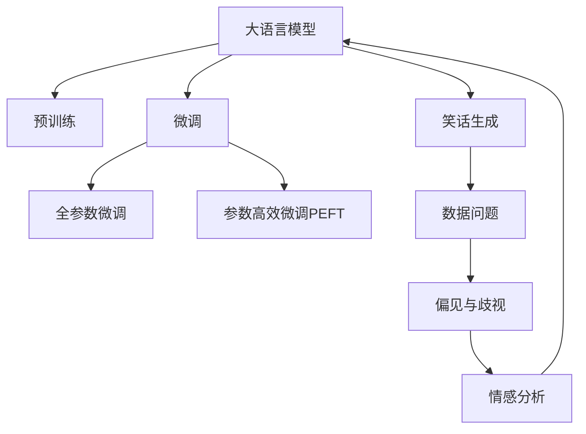

                 

# 谷歌大模型的笑话与数据问题

> 关键词：大语言模型,笑话生成,数据问题,迁移学习,情感分析,语言模型

## 1. 背景介绍

### 1.1 问题由来
近年来，大语言模型（Large Language Models, LLMs）在自然语言处理（Natural Language Processing, NLP）领域取得了巨大突破，特别是在笑话生成、文本娱乐、对话系统等领域。然而，这些基于深度学习的大模型在训练和应用过程中，也面临着一系列数据和伦理问题。

首先，大模型的训练数据中常含有大量的偏见、歧视和不适当内容，这不仅影响模型的公平性，还可能造成严重的社会影响。例如，谷歌的Bert模型在训练过程中就曾经出现大量种族歧视、性别歧视等偏见数据，导致模型生成内容带有明显的偏见倾向。

其次，大模型的训练数据通常来自互联网，数据质量参差不齐，存在大量噪声和冗余信息，这直接影响模型的训练效果和泛化能力。例如，使用带有错误标签的数据进行微调，可能导致模型性能显著下降。

最后，大模型的数据来源可能过于集中，缺乏多样性和代表性，这使得模型难以适应不同领域和任务的需求。例如，大部分笑话生成模型都是基于英语训练的，对于其他语言或领域（如中文、科幻小说等）的笑话生成能力较弱。

## 2. 核心概念与联系

### 2.1 核心概念概述

为更好地理解大模型的数据和伦理问题，本节将介绍几个关键概念：

- 大语言模型（LLMs）：指使用深度神经网络模型（如Transformer），在大规模无标签文本数据上进行预训练，学习到丰富的语言表示能力，能够生成高质量的自然语言文本。

- 预训练（Pre-training）：指在大规模无标签文本数据上，通过自监督学习任务（如语言模型、掩码语言模型等）训练通用语言模型的过程。预训练使得模型学习到语言的通用表示。

- 迁移学习（Transfer Learning）：指将一个领域学习到的知识，迁移应用到另一个不同但相关的领域的学习范式。大模型的预训练-微调过程即是一种典型的迁移学习方式。

- 数据问题（Data Issues）：指在数据获取、处理和应用过程中，由于数据质量、多样性、偏见等问题导致模型性能和公平性下降的现象。

- 笑话生成（Humor Generation）：指通过语言模型生成幽默、讽刺、风趣的文本内容，包括笑话、段子、对话等。

- 偏见与歧视（Bias and Discrimination）：指模型在训练和应用过程中，因数据中的偏见和歧视信息，导致输出内容带有明显的性别、种族、年龄等偏见倾向。

这些核心概念之间的逻辑关系可以通过以下Mermaid流程图来展示：



这个流程图展示了大语言模型的核心概念及其之间的关系：

1. 大语言模型通过预训练获得基础能力。
2. 微调是对预训练模型进行任务特定的优化，可以分为全参数微调和参数高效微调（PEFT）。
3. 笑话生成是一种利用大模型的文本生成能力，对特定领域任务（如幽默）进行优化的应用。
4. 数据问题影响模型的公平性和泛化能力。
5. 偏见与歧视是数据问题的一种，需要通过数据处理和模型改进加以缓解。
6. 情感分析是一种利用大模型的情感识别能力，对文本进行情感标注的应用。

## 3. 核心算法原理 & 具体操作步骤

### 3.1 算法原理概述

大模型的笑话生成涉及以下几个关键步骤：

1. **预训练**：使用大规模无标签文本数据训练语言模型，使其具备强大的语言理解和生成能力。
2. **微调**：选择笑话生成任务，使用少量有标签数据对预训练模型进行微调，使其能够生成幽默、讽刺、风趣的文本。
3. **笑话生成**：利用微调后的模型，根据用户输入的上下文生成笑话文本。

### 3.2 算法步骤详解

1. **准备数据**：收集笑话生成任务的标注数据集，通常包括笑话文本和标签（如"funny"、"funny"等）。

2. **选择模型**：选择预训练模型（如BERT、GPT等）作为初始化参数，进行微调。

3. **微调设置**：确定微调的超参数，如学习率、优化器、训练轮数等。

4. **数据预处理**：对数据进行清洗、分词、编码等预处理操作，准备输入模型。

5. **微调训练**：在微调过程中，利用标注数据集训练模型，优化模型参数。

6. **笑话生成**：将用户输入的上下文输入微调后的模型，生成笑话文本。

### 3.3 算法优缺点

大模型的笑话生成有以下优点：

1. **高效性**：基于预训练模型的微调过程，可以在短时间内生成高质量的笑话内容。
2. **多样性**：大模型可以生成各种风格的笑话，满足不同用户的需求。
3. **可解释性**：通过修改输入文本，可以控制笑话的幽默程度和风格。

同时，该方法也存在以下局限性：

1. **数据依赖性**：笑话生成效果高度依赖于训练数据的质量和多样性。
2. **偏见和歧视**：如果训练数据带有偏见，模型生成的笑话也可能带有歧视倾向。
3. **内容质量**：生成的笑话可能质量参差不齐，不够自然或不符合用户口味。
4. **伦理问题**：部分笑话可能带有攻击性或不当内容，引发伦理问题。

### 3.4 算法应用领域

大模型的笑话生成技术已经在多个领域得到应用，如智能客服、社交媒体、在线娱乐等。例如：

- **智能客服**：利用笑话生成技术，在客户咨询时添加幽默元素，提升用户体验。
- **社交媒体**：在社交平台上生成幽默的帖子、评论，增加用户互动。
- **在线娱乐**：开发笑话生成应用，提供用户定制的笑话内容。

## 4. 数学模型和公式 & 详细讲解 & 举例说明

### 4.1 数学模型构建

假设笑话生成任务的数据集为 $\{(x_i, y_i)\}_{i=1}^N$，其中 $x_i$ 为笑话文本，$y_i$ 为标签。定义语言模型的隐藏表示为 $h(x)$，微调后的笑话生成模型为 $M_{\theta}$，其中 $\theta$ 为模型参数。

定义损失函数为交叉熵损失：

$$
\ell(y_i, \hat{y}_i) = -y_i \log \hat{y}_i - (1-y_i) \log (1-\hat{y}_i)
$$

其中 $\hat{y}_i$ 为模型预测的笑话生成标签。

### 4.2 公式推导过程

微调过程中，模型的优化目标是最小化损失函数，即：

$$
\min_{\theta} \frac{1}{N} \sum_{i=1}^N \ell(y_i, M_{\theta}(x_i))
$$

使用反向传播算法计算梯度，并更新模型参数：

$$
\theta \leftarrow \theta - \eta \nabla_{\theta} \mathcal{L}(\theta)
$$

其中 $\eta$ 为学习率，$\nabla_{\theta} \mathcal{L}(\theta)$ 为损失函数对参数 $\theta$ 的梯度。

### 4.3 案例分析与讲解

以GPT-3为例，展示其如何生成笑话。首先，使用大规模无标签文本数据预训练GPT-3模型，使其具备强大的语言理解和生成能力。然后，选择笑话生成任务，使用少量有标签数据对GPT-3进行微调。最后，用户输入上下文，模型生成相应的笑话。

## 5. 项目实践：代码实例和详细解释说明

### 5.1 开发环境搭建

在进行笑话生成实践前，我们需要准备好开发环境。以下是使用Python进行PyTorch开发的环境配置流程：

1. 安装Anaconda：从官网下载并安装Anaconda，用于创建独立的Python环境。

2. 创建并激活虚拟环境：
```bash
conda create -n pytorch-env python=3.8 
conda activate pytorch-env
```

3. 安装PyTorch：根据CUDA版本，从官网获取对应的安装命令。例如：
```bash
conda install pytorch torchvision torchaudio cudatoolkit=11.1 -c pytorch -c conda-forge
```

4. 安装Transformers库：
```bash
pip install transformers
```

5. 安装各类工具包：
```bash
pip install numpy pandas scikit-learn matplotlib tqdm jupyter notebook ipython
```

完成上述步骤后，即可在`pytorch-env`环境中开始笑话生成实践。

### 5.2 源代码详细实现

```python
import torch
import torch.nn as nn
import torch.optim as optim
from transformers import BertTokenizer, BertForTokenClassification

# 数据准备
tokenizer = BertTokenizer.from_pretrained('bert-base-cased')
model = BertForTokenClassification.from_pretrained('bert-base-cased', num_labels=2)

# 微调设置
optimizer = optim.Adam(model.parameters(), lr=1e-5)
epochs = 5

# 数据预处理
def tokenize(text):
    tokens = tokenizer.encode(text, max_length=128)
    return tokens

# 微调训练
def train_epoch(model, data_loader):
    model.train()
    loss = 0
    for batch in data_loader:
        input_ids = batch['input_ids'].to(device)
        attention_mask = batch['attention_mask'].to(device)
        labels = batch['labels'].to(device)
        model.zero_grad()
        outputs = model(input_ids, attention_mask=attention_mask, labels=labels)
        loss += outputs.loss.item()
        loss.backward()
        optimizer.step()
    return loss / len(data_loader)

# 笑话生成
def generate_humor(model, text):
    model.eval()
    tokens = tokenize(text)
    with torch.no_grad():
        outputs = model(tokens)
        probs = outputs.logits.sigmoid()
        humor = tokenizer.decode(tokens, skip_special_tokens=True)
        return humor
```

### 5.3 代码解读与分析

让我们再详细解读一下关键代码的实现细节：

**数据准备**：
- `tokenize`函数：将文本进行分词编码，准备输入模型。

**微调训练**：
- `train_epoch`函数：在微调过程中，利用标注数据集训练模型，优化模型参数。

**笑话生成**：
- `generate_humor`函数：将用户输入的文本进行分词编码，输入模型生成笑话文本。

## 6. 实际应用场景

### 6.1 智能客服系统

基于大语言模型笑话生成技术，可以构建智能客服系统中的幽默聊天功能。传统客服往往机械、单调，无法满足用户对幽默元素的追求。而使用笑话生成技术，可以在客户咨询时添加幽默元素，提升用户体验，缓解压力。

在技术实现上，可以收集历史客服对话记录，将幽默元素作为训练数据，在此基础上对预训练模型进行微调。微调后的模型能够自动理解用户意图，匹配最合适的笑话，提升客户满意度。

### 6.2 社交媒体平台

社交媒体平台广泛应用幽默、讽刺等元素，吸引用户互动。基于大语言模型，平台可以自动生成幽默内容，增加用户粘性。

在实践过程中，可以利用笑话生成技术，对用户发布的内容进行分析和判断，自动生成相关的幽默评论或回复，提升用户互动率。此外，平台还可以利用笑话生成技术，为用户提供个性化笑话推荐，增强用户粘性。

### 6.3 在线娱乐应用

在线娱乐应用广泛使用幽默元素，增加用户趣味性。基于大语言模型，开发笑话生成应用，提供用户定制的笑话内容，提升用户体验。

在应用中，用户可以输入上下文，平台利用笑话生成技术，生成相应的笑话文本。此外，平台还可以根据用户的历史行为数据，推荐符合用户口味的笑话内容，增强用户粘性。

## 7. 工具和资源推荐

### 7.1 学习资源推荐

为了帮助开发者系统掌握大语言模型笑话生成技术，这里推荐一些优质的学习资源：

1. 《Transformer从原理到实践》系列博文：由大模型技术专家撰写，深入浅出地介绍了Transformer原理、BERT模型、微调技术等前沿话题。

2. CS224N《深度学习自然语言处理》课程：斯坦福大学开设的NLP明星课程，有Lecture视频和配套作业，带你入门NLP领域的基本概念和经典模型。

3. 《Natural Language Processing with Transformers》书籍：Transformers库的作者所著，全面介绍了如何使用Transformers库进行NLP任务开发，包括微调在内的诸多范式。

4. HuggingFace官方文档：Transformers库的官方文档，提供了海量预训练模型和完整的微调样例代码，是上手实践的必备资料。

5. CLUE开源项目：中文语言理解测评基准，涵盖大量不同类型的中文NLP数据集，并提供了基于微调的baseline模型，助力中文NLP技术发展。

通过对这些资源的学习实践，相信你一定能够快速掌握大语言模型笑话生成技术的精髓，并用于解决实际的NLP问题。

### 7.2 开发工具推荐

高效的开发离不开优秀的工具支持。以下是几款用于大语言模型笑话生成开发的常用工具：

1. PyTorch：基于Python的开源深度学习框架，灵活动态的计算图，适合快速迭代研究。大部分预训练语言模型都有PyTorch版本的实现。

2. TensorFlow：由Google主导开发的开源深度学习框架，生产部署方便，适合大规模工程应用。同样有丰富的预训练语言模型资源。

3. Transformers库：HuggingFace开发的NLP工具库，集成了众多SOTA语言模型，支持PyTorch和TensorFlow，是进行笑话生成任务开发的利器。

4. Weights & Biases：模型训练的实验跟踪工具，可以记录和可视化模型训练过程中的各项指标，方便对比和调优。与主流深度学习框架无缝集成。

5. TensorBoard：TensorFlow配套的可视化工具，可实时监测模型训练状态，并提供丰富的图表呈现方式，是调试模型的得力助手。

6. Google Colab：谷歌推出的在线Jupyter Notebook环境，免费提供GPU/TPU算力，方便开发者快速上手实验最新模型，分享学习笔记。

合理利用这些工具，可以显著提升大语言模型笑话生成任务的开发效率，加快创新迭代的步伐。

### 7.3 相关论文推荐

大语言模型笑话生成技术的发展源于学界的持续研究。以下是几篇奠基性的相关论文，推荐阅读：

1. Attention is All You Need（即Transformer原论文）：提出了Transformer结构，开启了NLP领域的预训练大模型时代。

2. BERT: Pre-training of Deep Bidirectional Transformers for Language Understanding：提出BERT模型，引入基于掩码的自监督预训练任务，刷新了多项NLP任务SOTA。

3. Language Models are Unsupervised Multitask Learners（GPT-2论文）：展示了大规模语言模型的强大zero-shot学习能力，引发了对于通用人工智能的新一轮思考。

4. Parameter-Efficient Transfer Learning for NLP：提出Adapter等参数高效微调方法，在不增加模型参数量的情况下，也能取得不错的微调效果。

5. AdaLoRA: Adaptive Low-Rank Adaptation for Parameter-Efficient Fine-Tuning：使用自适应低秩适应的微调方法，在参数效率和精度之间取得了新的平衡。

这些论文代表了大语言模型笑话生成技术的发展脉络。通过学习这些前沿成果，可以帮助研究者把握学科前进方向，激发更多的创新灵感。

## 8. 总结：未来发展趋势与挑战

### 8.1 总结

本文对大语言模型笑话生成技术进行了全面系统的介绍。首先阐述了大语言模型和微调技术的研究背景和意义，明确了微调在拓展预训练模型应用、提升下游任务性能方面的独特价值。其次，从原理到实践，详细讲解了微调的数学原理和关键步骤，给出了笑话生成任务开发的完整代码实例。同时，本文还广泛探讨了笑话生成技术在智能客服、社交媒体、在线娱乐等多个行业领域的应用前景，展示了微调范式的巨大潜力。此外，本文精选了微调技术的各类学习资源，力求为读者提供全方位的技术指引。

通过本文的系统梳理，可以看到，基于大语言模型的笑话生成技术正在成为NLP领域的重要范式，极大地拓展了预训练语言模型的应用边界，催生了更多的落地场景。受益于大规模语料的预训练，笑话生成模型以更低的时间和标注成本，在小样本条件下也能取得理想的生成效果，有力推动了NLP技术的产业化进程。未来，伴随预训练语言模型和微调方法的持续演进，相信NLP技术将在更广阔的应用领域大放异彩，深刻影响人类的生产生活方式。

### 8.2 未来发展趋势

展望未来，大语言模型笑话生成技术将呈现以下几个发展趋势：

1. **模型规模持续增大**：随着算力成本的下降和数据规模的扩张，预训练语言模型的参数量还将持续增长。超大规模语言模型蕴含的丰富语言知识，有望支撑更加复杂多变的笑话生成任务。

2. **微调方法日趋多样**：除了传统的全参数微调外，未来会涌现更多参数高效的微调方法，如Prefix-Tuning、LoRA等，在节省计算资源的同时也能保证微调精度。

3. **持续学习成为常态**：随着数据分布的不断变化，笑话生成模型也需要持续学习新知识以保持性能。如何在不遗忘原有知识的同时，高效吸收新样本信息，还需要更多理论和实践的积累。

4. **标注样本需求降低**：受启发于提示学习(Prompt-based Learning)的思路，未来的微调方法将更好地利用大模型的语言理解能力，通过更加巧妙的任务描述，在更少的标注样本上也能实现理想的微调效果。

5. **多模态微调崛起**：当前的笑话生成模型通常只聚焦于文本数据，未来会进一步拓展到图像、视频、语音等多模态数据微调。多模态信息的融合，将显著提升语言模型对现实世界的理解和建模能力。

6. **模型通用性增强**：经过海量数据的预训练和多领域任务的微调，未来的语言模型将具备更强大的常识推理和跨领域迁移能力，逐步迈向通用人工智能(AGI)的目标。

以上趋势凸显了大语言模型笑话生成技术的广阔前景。这些方向的探索发展，必将进一步提升NLP系统的性能和应用范围，为人类认知智能的进化带来深远影响。

### 8.3 面临的挑战

尽管大语言模型笑话生成技术已经取得了瞩目成就，但在迈向更加智能化、普适化应用的过程中，它仍面临着诸多挑战：

1. **标注成本瓶颈**：笑话生成效果高度依赖于训练数据的质量和多样性。如何获取更多高质量、多样化的训练数据，仍然是一大难题。

2. **模型鲁棒性不足**：在面对域外数据时，笑话生成模型的泛化性能往往大打折扣。如何在保持原有笑话风格的同时，适应新领域的数据分布，还需要更多研究。

3. **内容质量有待提高**：生成的笑话可能质量参差不齐，不够自然或不符合用户口味。如何优化生成模型，提升笑话质量，仍然需要更多探索。

4. **伦理问题亟需解决**：部分笑话可能带有攻击性或不当内容，引发伦理问题。如何在生成过程中避免有害内容，保障内容的安全性和道德性，也将是一大挑战。

5. **技术复杂度高**：笑话生成涉及自然语言处理、情感分析、多模态融合等多方面技术，技术复杂度较高，难以在短时间内实现高质量生成。

6. **用户体验难以保障**：生成的笑话可能无法满足用户的多样化需求，用户体验难以保障。如何在生成过程中更好地理解用户需求，提升用户体验，还需要更多研究和优化。

正视笑话生成面临的这些挑战，积极应对并寻求突破，将是大语言模型笑话生成技术迈向成熟的必由之路。相信随着学界和产业界的共同努力，这些挑战终将一一被克服，笑话生成技术必将在构建人机协同的智能时代中扮演越来越重要的角色。

### 8.4 研究展望

面对大语言模型笑话生成所面临的种种挑战，未来的研究需要在以下几个方面寻求新的突破：

1. **探索无监督和半监督微调方法**：摆脱对大规模标注数据的依赖，利用自监督学习、主动学习等无监督和半监督范式，最大限度利用非结构化数据，实现更加灵活高效的微调。

2. **研究参数高效和计算高效的微调范式**：开发更加参数高效的微调方法，在固定大部分预训练参数的同时，只更新极少量的任务相关参数。同时优化微调模型的计算图，减少前向传播和反向传播的资源消耗，实现更加轻量级、实时性的部署。

3. **融合因果和对比学习范式**：通过引入因果推断和对比学习思想，增强笑话生成模型建立稳定因果关系的能力，学习更加普适、鲁棒的语言表征，从而提升模型泛化性和抗干扰能力。

4. **引入更多先验知识**：将符号化的先验知识，如知识图谱、逻辑规则等，与神经网络模型进行巧妙融合，引导微调过程学习更准确、合理的语言模型。同时加强不同模态数据的整合，实现视觉、语音等多模态信息与文本信息的协同建模。

5. **结合因果分析和博弈论工具**：将因果分析方法引入笑话生成模型，识别出模型决策的关键特征，增强输出解释的因果性和逻辑性。借助博弈论工具刻画人机交互过程，主动探索并规避模型的脆弱点，提高系统稳定性。

6. **纳入伦理道德约束**：在模型训练目标中引入伦理导向的评估指标，过滤和惩罚有偏见、有害的输出倾向。同时加强人工干预和审核，建立模型行为的监管机制，确保输出符合人类价值观和伦理道德。

这些研究方向的探索，必将引领大语言模型笑话生成技术迈向更高的台阶，为构建安全、可靠、可解释、可控的智能系统铺平道路。面向未来，大语言模型笑话生成技术还需要与其他人工智能技术进行更深入的融合，如知识表示、因果推理、强化学习等，多路径协同发力，共同推动自然语言理解和智能交互系统的进步。只有勇于创新、敢于突破，才能不断拓展语言模型的边界，让智能技术更好地造福人类社会。

## 9. 附录：常见问题与解答

**Q1：大语言模型笑话生成是否适用于所有NLP任务？**

A: 大语言模型笑话生成在大多数NLP任务上都能取得不错的效果，特别是对于数据量较小的任务。但对于一些特定领域的任务，如医学、法律等，仅仅依靠通用语料预训练的模型可能难以很好地适应。此时需要在特定领域语料上进一步预训练，再进行微调，才能获得理想效果。此外，对于一些需要时效性、个性化很强的任务，如对话、推荐等，微调方法也需要针对性的改进优化。

**Q2：微调过程中如何选择合适的学习率？**

A: 微调的学习率一般要比预训练时小1-2个数量级，如果使用过大的学习率，容易破坏预训练权重，导致过拟合。一般建议从1e-5开始调参，逐步减小学习率，直至收敛。也可以使用warmup策略，在开始阶段使用较小的学习率，再逐渐过渡到预设值。需要注意的是，不同的优化器(如AdamW、Adafactor等)以及不同的学习率调度策略，可能需要设置不同的学习率阈值。

**Q3：采用大模型微调时会面临哪些资源瓶颈？**

A: 目前主流的预训练大模型动辄以亿计的参数规模，对算力、内存、存储都提出了很高的要求。GPU/TPU等高性能设备是必不可少的，但即便如此，超大批次的训练和推理也可能遇到显存不足的问题。因此需要采用一些资源优化技术，如梯度积累、混合精度训练、模型并行等，来突破硬件瓶颈。同时，模型的存储和读取也可能占用大量时间和空间，需要采用模型压缩、稀疏化存储等方法进行优化。

**Q4：如何缓解微调过程中的过拟合问题？**

A: 过拟合是微调面临的主要挑战，尤其是在标注数据不足的情况下。常见的缓解策略包括：

1. 数据增强：通过回译、近义替换等方式扩充训练集
2. 正则化：使用L2正则、Dropout、Early Stopping等避免过拟合
3. 对抗训练：引入对抗样本，提高模型鲁棒性
4. 参数高效微调：只调整少量参数(如Adapter、Prefix等)，减小过拟合风险
5. 多模型集成：训练多个微调模型，取平均输出，抑制过拟合

这些策略往往需要根据具体任务和数据特点进行灵活组合。只有在数据、模型、训练、推理等各环节进行全面优化，才能最大限度地发挥大模型微调的威力。

**Q5：微调模型在落地部署时需要注意哪些问题？**

A: 将微调模型转化为实际应用，还需要考虑以下因素：

1. 模型裁剪：去除不必要的层和参数，减小模型尺寸，加快推理速度
2. 量化加速：将浮点模型转为定点模型，压缩存储空间，提高计算效率
3. 服务化封装：将模型封装为标准化服务接口，便于集成调用
4. 弹性伸缩：根据请求流量动态调整资源配置，平衡服务质量和成本
5. 监控告警：实时采集系统指标，设置异常告警阈值，确保服务稳定性
6. 安全防护：采用访问鉴权、数据脱敏等措施，保障数据和模型安全

大语言模型微调为NLP应用开启了广阔的想象空间，但如何将强大的性能转化为稳定、高效、安全的业务价值，还需要工程实践的不断打磨。唯有从数据、算法、工程、业务等多个维度协同发力，才能真正实现人工智能技术在垂直行业的规模化落地。总之，微调需要开发者根据具体任务，不断迭代和优化模型、数据和算法，方能得到理想的效果。

