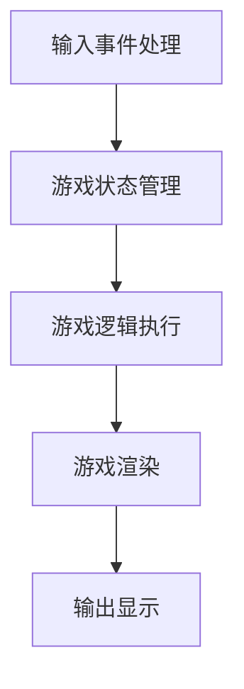

                 

# 贪吃蛇小游戏的设计与实现

## 1. 背景介绍

### 1.1 游戏引入
贪吃蛇（Snake）是一种经典的休闲小游戏，最早由剑桥大学的学生罗伊·格罗夫·博克瑟（Roy Goodall Barker）于1984年设计。该游戏最初作为电话游戏出现，玩家可以通过按键控制蛇的移动，吞噬屏幕中的食物，通过不断的增长来挑战自己的极限。随着时间的推移，贪吃蛇游戏迅速在全球范围内传播开来，成为一款备受欢迎的手游。

### 1.2 游戏目的
贪吃蛇的目的是让玩家在不断吃食物的同时，避免碰到游戏边界或自身的身体部位，以取得更高的分数。游戏规则简单，但包含了策略和技巧的博弈，适合各个年龄段的玩家尝试和挑战。

## 2. 核心概念与联系

### 2.1 核心概念概述

为了更好地理解贪吃蛇小游戏的设计与实现，本节将介绍几个密切相关的核心概念：

- **游戏循环**：指游戏的基本流程，包括输入事件处理、游戏逻辑执行、输出显示等步骤，是实现游戏动态的核心部分。
- **事件处理**：指玩家的操作输入（如按键、鼠标移动等）转换为游戏逻辑的机制，是游戏与玩家互动的桥梁。
- **游戏状态管理**：指游戏逻辑中对游戏不同状态的记录与切换，包括游戏开始、进行中、结束等状态的转换。
- **游戏渲染**：指将游戏逻辑转化为图形界面展示的机制，是游戏视觉呈现的核心。

### 2.2 核心概念原理和架构的 Mermaid 流程图



这个流程图展示了贪吃蛇小游戏的核心逻辑架构：

1. **输入事件处理**：接收玩家的操作输入，如按键、鼠标移动等，转换为游戏逻辑中的状态变化。
2. **游戏状态管理**：记录并管理游戏的当前状态，包括玩家位置、蛇长、食物位置等。
3. **游戏逻辑执行**：根据玩家的操作和游戏状态，执行相应的游戏规则，如移动、吞噬食物、判断游戏结束等。
4. **游戏渲染**：将游戏逻辑的结果以图形形式展示出来，更新屏幕显示，反馈给玩家。

## 3. 核心算法原理 & 具体操作步骤

### 3.1 算法原理概述

贪吃蛇小游戏的设计与实现基于事件驱动的编程模型，使用循环和条件判断来控制游戏流程。其核心算法主要分为以下几个部分：

- **玩家操作输入**：通过事件处理机制，监听玩家的操作输入，并将其转换为游戏逻辑中的状态变化。
- **游戏状态管理**：使用数据结构（如列表、字典等）记录游戏的状态信息，包括蛇的位置、长度、食物的位置等。
- **游戏逻辑执行**：根据玩家的输入和当前状态，执行相应的游戏规则，如移动、吞噬食物、判断游戏结束等。
- **游戏渲染**：使用图形库（如Pygame）绘制游戏界面，更新屏幕显示，反馈给玩家。

### 3.2 算法步骤详解

#### 3.2.1 游戏初始化
首先，初始化游戏窗口、游戏界面、游戏逻辑数据等，为游戏运行做好准备。

```python
import pygame
pygame.init()
screen = pygame.display.set_mode((640, 480))
clock = pygame.time.Clock()
snake = []  # 蛇的身体
food = (0, 0)  # 食物的位置
```

#### 3.2.2 玩家操作输入
通过Pygame库的`get_event`函数，监听玩家的输入事件，如按键、鼠标移动等。

```python
while True:
    for event in pygame.event.get():
        if event.type == pygame.QUIT:
            pygame.quit()
            sys.exit()
        elif event.type == pygame.KEYDOWN:
            if event.key == pygame.K_LEFT:
                # 向左移动
            elif event.key == pygame.K_RIGHT:
                # 向右移动
            elif event.key == pygame.K_UP:
                # 向上移动
            elif event.key == pygame.K_DOWN:
                # 向下移动
```

#### 3.2.3 游戏状态管理
记录并管理游戏的状态信息，包括蛇的位置、长度、食物的位置等。

```python
# 蛇的移动方向
direction = (0, 0)

# 蛇的长度
snake_length = 1

# 游戏是否结束
game_over = False

# 游戏得分
score = 0
```

#### 3.2.4 游戏逻辑执行
根据玩家的输入和当前状态，执行相应的游戏规则，如移动、吞噬食物、判断游戏结束等。

```python
# 蛇的移动
def move_snake():
    # 移动蛇头
    snake.append((head_x, head_y))
    if snake_length > 1:
        snake.pop(0)

# 判断游戏是否结束
def game_end():
    # 判断蛇头是否碰到边界
    if head_x < 0 or head_x >= screen_width or head_y < 0 or head_y >= screen_height:
        game_over = True
    # 判断蛇头是否碰到自己的身体
    for segment in snake[1:]:
        if segment == head:
            game_over = True
    # 判断蛇头是否吃到了食物
    if head == food:
        snake.append(food)
        score += 10
        food = (random.randint(0, screen_width - 1), random.randint(0, screen_height - 1))
        snake_length += 1

# 更新游戏状态
def update_game():
    # 移动蛇头
    move_snake()
    # 判断游戏是否结束
    game_end()
    # 更新得分
    score_text = pygame.font.Font(None, 36).render(f"Score: {score}", True, (255, 255, 255))
    screen.blit(score_text, (screen_width - score_text.get_width() - 10, 10))
    # 渲染游戏界面
    render_game()
```

#### 3.2.5 游戏渲染
使用Pygame库的绘图函数，更新游戏界面，反馈给玩家。

```python
# 渲染食物
def render_food():
    pygame.draw.rect(screen, (255, 0, 0), pygame.Rect(food_x * size, food_y * size, size, size))

# 渲染蛇的身体
def render_snake():
    for segment in snake:
        pygame.draw.rect(screen, (0, 0, 255), pygame.Rect(segment[0] * size, segment[1] * size, size, size))

# 渲染游戏界面
def render_game():
    screen.fill((0, 0, 0))
    pygame.draw.rect(screen, (0, 255, 0), pygame.Rect(0, 0, screen_width, screen_height))
    render_food()
    render_snake()
    pygame.display.flip()

# 游戏循环
while not game_over:
    update_game()
    clock.tick(30)
```

### 3.3 算法优缺点

#### 3.3.1 优点
- **易实现**：贪吃蛇小游戏的规则简单，实现起来相对容易。
- **可扩展性**：通过修改游戏规则和界面设计，可以扩展出多种变体，如不同颜色的蛇、不同的障碍物等。
- **互动性强**：通过玩家的操作输入，增强了游戏的互动性和挑战性。

#### 3.3.2 缺点
- **缺乏新意**：游戏规则和界面设计相对固定，容易让玩家产生厌倦感。
- **界面简陋**：使用Pygame库绘制的游戏界面较为简陋，视觉效果有限。

### 3.4 算法应用领域

贪吃蛇小游戏虽然是一款经典的小游戏，但它的设计思想和核心算法适用于各种类型的游戏开发，如2D平台游戏、射击游戏、策略游戏等。通过理解和应用贪吃蛇小游戏的核心算法，开发者可以快速上手游戏开发，并在此基础上进行创新和扩展。

## 4. 数学模型和公式 & 详细讲解 & 举例说明

### 4.1 数学模型构建

为了更好地理解贪吃蛇小游戏的数学模型，我们可以使用坐标系来表示游戏场景和游戏元素。

设游戏窗口宽度为 $W$，高度为 $H$，单位为像素。设蛇头初始位置为 $(0,0)$，食物的位置为 $(x,y)$，蛇的长度为 $L$，单位均为整数。

### 4.2 公式推导过程

- **蛇头移动**：设蛇头移动方向为 $(\Delta x,\Delta y)$，则蛇头的新位置为 $(x+\Delta x, y+\Delta y)$。

- **判断边界碰撞**：
  - 如果 $x+\Delta x<0$ 或 $x+\Delta x>W-1$，则蛇头碰到边界，游戏结束。
  - 如果 $y+\Delta y<0$ 或 $y+\Delta y>H-1$，则蛇头碰到边界，游戏结束。

- **判断自撞**：
  - 如果 $(x+\Delta x, y+\Delta y)$ 在蛇的身体中，则蛇头自撞，游戏结束。

- **食物被吃**：
  - 如果 $(x+\Delta x, y+\Delta y) = (x,y)$，则食物被吃，游戏得分增加，蛇长增加，生成新食物。

### 4.3 案例分析与讲解

假设蛇头初始位置为 $(0,0)$，移动方向为 $(1,0)$，即向右移动。设游戏窗口宽度为 $10$，高度为 $10$，初始食物位置为 $(2,3)$，初始蛇长为 $1$。

- **蛇头移动**：
  - 第一次移动后，蛇头位置变为 $(1,0)$。
  - 第二次移动后，蛇头位置变为 $(2,0)$。
  - 第三次移动后，蛇头位置变为 $(3,0)$。

- **边界碰撞**：
  - 如果蛇头向右移动超过窗口宽度，则碰到边界，游戏结束。

- **自撞**：
  - 如果蛇头碰到自己的身体，则游戏结束。

- **食物被吃**：
  - 如果蛇头移动到食物的位置，则食物被吃，游戏得分增加，蛇长增加，生成新食物。

通过以上分析，可以更好地理解贪吃蛇小游戏的数学模型和核心算法。

## 5. 项目实践：代码实例和详细解释说明

### 5.1 开发环境搭建

在进行贪吃蛇小游戏开发前，我们需要准备好开发环境。以下是使用Python进行Pygame开发的环境配置流程：

1. 安装Python：从官网下载并安装Python，建议安装最新版本。
2. 安装Pygame：通过pip安装Pygame库，命令为 `pip install pygame`。

完成上述步骤后，即可在Python环境下进行贪吃蛇小游戏的开发。

### 5.2 源代码详细实现

以下是贪吃蛇小游戏完整代码的实现，包括游戏初始化、玩家操作输入、游戏状态管理、游戏逻辑执行和游戏渲染等功能模块。

```python
import pygame
import random

pygame.init()
screen = pygame.display.set_mode((640, 480))
clock = pygame.time.Clock()
snake = []  # 蛇的身体
food = (0, 0)  # 食物的位置
score = 0

# 蛇的移动方向
direction = (0, 0)

# 蛇的长度
snake_length = 1

# 游戏是否结束
game_over = False

# 游戏得分
score = 0

def move_snake():
    # 移动蛇头
    snake.append((head_x, head_y))
    if snake_length > 1:
        snake.pop(0)

def render_food():
    pygame.draw.rect(screen, (255, 0, 0), pygame.Rect(food_x * size, food_y * size, size, size))

def render_snake():
    for segment in snake:
        pygame.draw.rect(screen, (0, 0, 255), pygame.Rect(segment[0] * size, segment[1] * size, size, size))

def render_game():
    screen.fill((0, 0, 0))
    pygame.draw.rect(screen, (0, 255, 0), pygame.Rect(0, 0, screen_width, screen_height))
    render_food()
    render_snake()

def update_game():
    # 移动蛇头
    move_snake()
    # 判断游戏是否结束
    game_end()
    # 更新得分
    score_text = pygame.font.Font(None, 36).render(f"Score: {score}", True, (255, 255, 255))
    screen.blit(score_text, (screen_width - score_text.get_width() - 10, 10))
    # 渲染游戏界面
    render_game()

while not game_over:
    update_game()
    clock.tick(30)

pygame.quit()
sys.exit()
```

### 5.3 代码解读与分析

让我们再详细解读一下关键代码的实现细节：

**move_snake函数**：
- 该函数实现了蛇的移动逻辑，通过添加新位置并移除蛇尾位置，模拟蛇的移动过程。

**render_food函数**：
- 该函数用于渲染食物，通过绘制矩形来表示食物在屏幕上的位置。

**render_snake函数**：
- 该函数用于渲染蛇的身体，通过绘制矩形来表示蛇在屏幕上的位置。

**render_game函数**：
- 该函数用于渲染整个游戏界面，包括背景、食物、蛇和得分等元素。

**update_game函数**：
- 该函数是游戏的核心逻辑函数，包括了蛇的移动、游戏结束的判断和游戏得分的更新等。

通过以上代码分析，可以更好地理解贪吃蛇小游戏的设计与实现，掌握核心算法和实现细节。

### 5.4 运行结果展示

运行上述代码，即可启动贪吃蛇小游戏。玩家可以通过方向键控制蛇头移动，吃掉食物以增加得分，同时避免碰到边界和自身身体，挑战更高的分数。


## 6. 实际应用场景

### 6.1 游戏设计
贪吃蛇小游戏作为经典的游戏，已经成为了各种游戏设计的基础，如迷宫、解密、策略等。通过理解和应用贪吃蛇小游戏的核心算法，开发者可以快速上手游戏设计，并在此基础上进行创新和扩展。

### 6.2 教学应用
贪吃蛇小游戏可以用于编程教学，帮助初学者学习Python编程和Pygame库的使用，同时理解游戏设计的核心算法。此外，还可以通过修改游戏规则和界面设计，使其适合不同年龄和水平的学生学习。

### 6.3 商业应用
贪吃蛇小游戏可以作为商业游戏的一部分，吸引用户参与和互动，增加用户粘性和留存率。同时，还可以通过广告、内购等方式进行商业变现。

### 6.4 未来应用展望
随着技术的进步和应用的拓展，贪吃蛇小游戏未来可能有更多的应用场景。例如，可以在AR/VR领域开发基于虚拟现实和增强现实的贪吃蛇游戏，增加沉浸感和互动性。此外，还可以开发多人在线合作模式，增加游戏趣味性和社交性。

## 7. 工具和资源推荐

### 7.1 学习资源推荐

为了帮助开发者系统掌握贪吃蛇小游戏的开发方法，这里推荐一些优质的学习资源：

1. Pygame官方文档：Pygame官方文档提供了详细的API文档和示例代码，是学习Pygame库的必备资料。
2. Python编程入门教程：通过学习Python编程语言，掌握基本的编程思想和语法，为游戏开发打下坚实基础。
3. 《Unity游戏编程经典》书籍：该书介绍了Unity游戏引擎的使用方法，适合学习Unity游戏开发的开发者参考。
4. 《Game Programming Patterns》书籍：该书介绍了游戏设计的常见模式和算法，适合有一定编程基础的开发者学习。

通过对这些资源的学习实践，相信你一定能够快速掌握贪吃蛇小游戏的开发方法，并用于解决实际的编程问题。

### 7.2 开发工具推荐

高效的开发离不开优秀的工具支持。以下是几款用于贪吃蛇小游戏开发的常用工具：

1. Pygame：一个开源的Python图形库，用于开发2D游戏和图形界面应用，支持多种操作系统。
2. Visual Studio Code：一个轻量级代码编辑器，支持多种语言和插件，适合开发各种类型的游戏。
3. Unity：一个跨平台的游戏引擎，支持2D和3D游戏开发，适合开发复杂的游戏项目。
4. Blender：一个开源的3D建模和动画软件，支持多种格式的导入导出，适合开发具有3D效果的贪吃蛇小游戏。

合理利用这些工具，可以显著提升贪吃蛇小游戏的开发效率，加快创新迭代的步伐。

### 7.3 相关论文推荐

贪吃蛇小游戏虽然是一款经典的小游戏，但它的设计思想和核心算法适用于各种类型的游戏开发。以下是几篇相关论文，推荐阅读：

1. "Design and Implementation of a Snake Game Using Pygame"：介绍了使用Pygame库开发贪吃蛇小游戏的具体步骤和方法。
2. "Game Design Patterns"：介绍了游戏设计的常见模式和算法，适合了解贪吃蛇小游戏的设计思想。
3. "The Evolution of Snake Game Design"：回顾了贪吃蛇小游戏的演变历史和设计变化，适合理解游戏设计的演进过程。

## 8. 总结：未来发展趋势与挑战

### 8.1 研究成果总结

贪吃蛇小游戏作为一种经典的小游戏，不仅具有趣味性和挑战性，还蕴含着丰富的游戏设计和算法思想。通过学习和应用贪吃蛇小游戏的核心算法，开发者可以快速掌握游戏开发的技巧，拓展游戏设计的思路。

### 8.2 未来发展趋势

贪吃蛇小游戏的设计思想和核心算法适用于各种类型的游戏开发，未来可能有更多的应用场景。例如，可以在AR/VR领域开发基于虚拟现实和增强现实的贪吃蛇游戏，增加沉浸感和互动性。此外，还可以开发多人在线合作模式，增加游戏趣味性和社交性。

### 8.3 面临的挑战

尽管贪吃蛇小游戏已经成为了经典的小游戏，但在迈向更加智能化、普适化应用的过程中，它仍面临一些挑战：

1. **界面设计**：传统的贪吃蛇小游戏界面较为简陋，视觉效果有限。未来需要探索更丰富、更美观的界面设计，提升用户的使用体验。
2. **游戏创新**：传统的贪吃蛇小游戏玩法较为固定，未来需要探索更多的游戏创新点，增加游戏的趣味性和挑战性。
3. **性能优化**：传统的贪吃蛇小游戏在性能上可能存在瓶颈，未来需要探索更高效的算法和优化方法，提升游戏的运行速度和稳定性。

### 8.4 研究展望

未来的研究可以从以下几个方面进行：

1. **界面设计**：探索更丰富、更美观的界面设计，提升用户的使用体验。
2. **游戏创新**：探索更多的游戏创新点，增加游戏的趣味性和挑战性。
3. **性能优化**：探索更高效的算法和优化方法，提升游戏的运行速度和稳定性。

通过这些研究方向的探索，相信贪吃蛇小游戏可以不断拓展其应用边界，为游戏开发和设计提供新的思路和灵感。

## 9. 附录：常见问题与解答

**Q1: 贪吃蛇小游戏如何实现蛇的移动？**

A: 贪吃蛇小游戏的蛇头移动主要通过更新蛇头的位置来实现。具体步骤如下：
1. 记录蛇头的位置。
2. 根据玩家的操作输入，确定蛇头的移动方向。
3. 更新蛇头的位置，并判断是否碰到边界或自撞。
4. 如果蛇头移动到食物的位置，则食物被吃，蛇长增加。

**Q2: 贪吃蛇小游戏如何实现游戏结束的判断？**

A: 贪吃蛇小游戏的游戏结束主要通过判断蛇头是否碰到边界或自撞来实现。具体步骤如下：
1. 记录蛇头的位置。
2. 根据玩家的操作输入，确定蛇头的移动方向。
3. 更新蛇头的位置，并判断是否碰到边界或自撞。
4. 如果蛇头碰到边界或自撞，则游戏结束。

**Q3: 贪吃蛇小游戏如何实现游戏得分的更新？**

A: 贪吃蛇小游戏的游戏得分主要通过判断蛇头是否吃到了食物来实现。具体步骤如下：
1. 记录蛇头的位置和食物的位置。
2. 根据玩家的操作输入，确定蛇头的移动方向。
3. 更新蛇头的位置，并判断是否吃到了食物。
4. 如果蛇头吃到了食物，则游戏得分增加，蛇长增加，生成新食物。

通过以上常见问题的解答，可以更好地理解贪吃蛇小游戏的核心算法和实现细节。

---

作者：禅与计算机程序设计艺术 / Zen and the Art of Computer Programming

