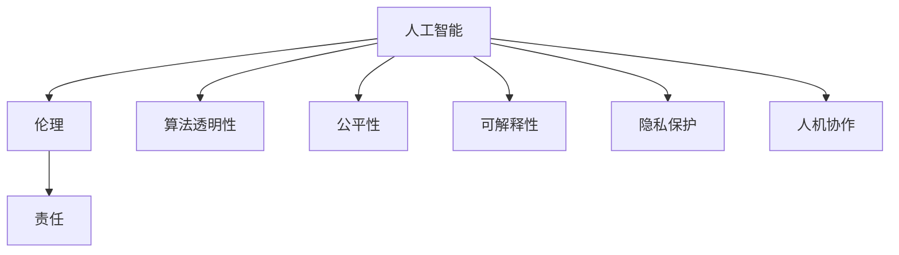

                 

# 软件 2.0 的伦理规范：人工智能的责任

> 关键词：人工智能(AI),伦理,责任,算法透明性,公平性,可解释性,隐私保护,人机协作

## 1. 背景介绍

在信息化时代的浪潮中，人工智能(AI)技术正以前所未有的速度发展，逐步渗透到各行各业。从智能推荐系统、语音识别，到自动驾驶、机器人，AI技术已展现出强大的潜力，大大改变了人类的生活和工作方式。然而，AI技术的发展也带来了诸多伦理问题，如数据隐私、算法透明性、公平性、可解释性、安全性等，这些问题已经引起了广泛关注。

### 1.1 问题的由来

随着AI技术的普及，数据滥用、算法偏见、黑箱操作等问题不断出现。例如，面部识别系统因其算法偏见和数据隐私问题受到了广泛质疑，人脸识别企业的技术道德和社会责任受到了严肃讨论。如何在追求技术进步的同时，保障伦理规范和道德责任，成为当前AI发展的重要课题。

### 1.2 问题的核心关键点

人工智能的伦理问题涉及多个层面，从技术实现到使用过程，从算法设计到用户隐私，都需要从不同角度进行深入思考和规范。

- **技术实现**：如何设计出更加公平、透明、可解释的AI算法，避免数据偏见和模型过拟合，保证算法的稳健性和可靠性。
- **用户隐私**：如何保护用户数据的安全和隐私，避免数据泄露和滥用，实现数据使用的最小化原则。
- **算法透明性**：如何让AI算法的决策过程可解释，让用户理解和信任算法结果，避免"黑箱操作"。
- **公平性和安全性**：如何确保AI系统的公平性，避免偏见和歧视，同时保障系统的安全性和鲁棒性。
- **人机协作**：如何构建人机协作的伦理框架，让AI技术更好地服务于人类，避免"算法暴政"和"技术失控"。

这些问题紧密联系，相互交织，对AI技术的发展具有重要的指导意义。本文将重点探讨如何通过伦理规范和责任机制，推动AI技术的健康发展。

## 2. 核心概念与联系

### 2.1 核心概念概述

为更好地理解AI技术的伦理规范和责任机制，本节将介绍几个密切相关的核心概念：

- **人工智能**：利用算法和计算技术，使计算机系统能够模拟人类智能的行为和推理过程。
- **伦理**：以道德原则和规范为基础，对行为进行评价和规范。
- **责任**：基于伦理原则和法律义务，对行为后果承担的道德责任和法律责任。
- **算法透明性**：指算法决策过程的透明和可解释，用户可以理解算法的运作机制和决策依据。
- **公平性**：指AI算法在应用中避免偏见和歧视，对不同群体和个体公平对待。
- **可解释性**：指AI模型决策过程的易理解性，用户能够通过解释和验证模型输出。
- **隐私保护**：指保护个人数据和隐私，避免数据泄露和滥用。
- **人机协作**：指人机共同工作，以实现更高效、更合理的任务执行。

这些核心概念之间的逻辑关系可以通过以下Mermaid流程图来展示：



这个流程图展示了一系列核心概念及其之间的关系：

1. 人工智能是基础，通过伦理和责任机制对其进行规范和约束。
2. 通过算法透明性、公平性、可解释性等技术手段，提升AI技术的可信度和伦理性。
3. 隐私保护和人机协作是AI技术应用中的两个重要伦理维度。

## 3. 核心算法原理 & 具体操作步骤
### 3.1 算法原理概述

AI技术的伦理规范和责任机制，需要从算法设计、数据处理、模型训练等多个方面进行全面考量。以下将详细介绍这一过程。

### 3.2 算法步骤详解

**Step 1: 数据准备与预处理**

在AI系统构建的第一步，需要对数据进行全面、严格的处理和预处理，确保数据的质量和合规性。

1. **数据采集**：确保数据来源的合法性和公正性，避免数据偏见和歧视。例如，避免使用种族、性别等敏感数据，防止算法偏见。
2. **数据清洗**：对数据进行去重、去噪、填补缺失值等处理，保证数据的一致性和完整性。
3. **数据隐私保护**：采用数据加密、匿名化等技术，保护用户隐私，避免数据泄露。

**Step 2: 算法设计**

算法设计是AI伦理规范的核心环节，需要综合考虑算法的公平性、透明性和可解释性。

1. **公平性设计**：通过引入公平性约束和算法优化技术，确保AI算法对所有用户公平对待。例如，使用公平性约束函数，限制模型输出中某些群体的平均损失。
2. **透明性设计**：通过可解释性技术，如特征重要性分析、部分依赖图等，提升算法的透明性。例如，使用LIME、SHAP等工具，解释模型决策过程。
3. **可解释性设计**：通过简化模型结构、引入可解释性模块等方式，提升模型的可解释性。例如，使用简化模型结构、决策树等，使模型决策过程更易理解。

**Step 3: 模型训练与优化**

在模型训练过程中，需结合公平性、透明性和可解释性等多重约束，优化模型的性能。

1. **公平性优化**：使用公平性损失函数，如平衡类误差、平均等误差等，优化模型公平性。例如，使用AdamW等优化算法，结合公平性损失函数进行训练。
2. **透明性优化**：通过可视化技术，如特征重要性热图、决策树等，监控和优化模型透明性。例如，使用TensorBoard等工具，可视化模型特征和决策过程。
3. **可解释性优化**：引入可解释性模块，如LoRA、AdaLoRA等，优化模型可解释性。例如，使用AdaLoRA技术，保留部分预训练权重，仅微调顶层部分。

**Step 4: 模型评估与部署**

在模型评估和部署过程中，需进行全面的伦理和责任评估，确保模型的合规性和可解释性。

1. **模型评估**：通过伦理评估指标，如公平性指标、隐私指标等，评估模型伦理性能。例如，使用公平性评估指标，如平衡误差、等误差等，评估模型公平性。
2. **模型部署**：在模型部署过程中，需严格遵守伦理规范和责任机制。例如，建立模型部署规范，明确责任主体和使用场景。

### 3.3 算法优缺点

AI技术的伦理规范和责任机制，具有以下优点：

1. **提升系统可信度**：通过公平性、透明性和可解释性等技术手段，提升AI系统的可信度和伦理规范性。
2. **保障用户隐私**：通过数据隐私保护技术，保护用户隐私，避免数据滥用和泄露。
3. **避免算法偏见**：通过公平性约束和算法优化，避免算法偏见和歧视，保证模型公平性。

同时，该机制也存在一些局限：

1. **技术复杂性**：公平性、透明性和可解释性等技术手段的实现，可能增加技术复杂性和开发成本。
2. **伦理规范争议**：不同文化和社会背景下的伦理规范差异，可能导致伦理规范的冲突和争议。
3. **法律监管难度**：AI技术的快速发展和应用，可能导致法律监管和合规审查的滞后。

### 3.4 算法应用领域

AI技术的伦理规范和责任机制，已在多个领域得到应用，例如：

- **金融风控**：通过AI系统进行风险评估和欺诈检测，需考虑数据隐私和公平性，保障用户权益。
- **医疗诊断**：通过AI系统进行疾病诊断和治疗方案推荐，需考虑算法透明性和可解释性，避免误诊误治。
- **教育推荐**：通过AI系统进行个性化教育推荐，需考虑公平性和隐私保护，保障学生权益。
- **司法判决**：通过AI系统进行案件判决和法律咨询，需考虑算法透明性和责任机制，保障司法公正。
- **环境保护**：通过AI系统进行环境监测和资源管理，需考虑公平性和责任机制，保障环境利益。

## 4. 数学模型和公式 & 详细讲解 & 举例说明

### 4.1 数学模型构建

本节将使用数学语言对AI技术的伦理规范和责任机制进行更加严格的刻画。

记AI系统为 $S=\{M, D, A\}$，其中 $M$ 为AI算法模型，$D$ 为训练数据集，$A$ 为算法约束和伦理规范。

定义模型 $M$ 在数据样本 $(x,y)$ 上的公平性指标为 $F(M) = \frac{1}{N}\sum_{i=1}^N |\hat{y}_i - y_i|$，其中 $\hat{y}_i$ 为模型预测结果，$y_i$ 为真实标签。

公平性约束函数为 $L_F = \max_{\text{groups}} \frac{1}{N}\sum_{i \in \text{groups}} |\hat{y}_i - y_i|$，其中 $\text{groups}$ 为数据集中的不同群体。

定义模型 $M$ 在数据样本 $(x,y)$ 上的透明性指标为 $T(M) = \sum_{i=1}^N I(\hat{y}_i \neq y_i)$，其中 $I$ 为示性函数，$I(\text{event})=1$ 当事件发生时，$I(\text{event})=0$ 当事件不发生时。

透明性约束函数为 $L_T = \max_{\text{events}} \frac{1}{N}\sum_{i=1}^N I(\hat{y}_i \neq y_i)$，其中 $\text{events}$ 为数据集中的不同事件。

定义模型 $M$ 在数据样本 $(x,y)$ 上的可解释性指标为 $E(M) = \sum_{i=1}^N |\hat{y}_i - \tilde{y}_i|$，其中 $\tilde{y}_i$ 为模型对数据样本的解释输出。

可解释性约束函数为 $L_E = \max_{\text{interpretations}} \frac{1}{N}\sum_{i=1}^N |\hat{y}_i - \tilde{y}_i|$，其中 $\text{interpretations}$ 为不同解释输出。

定义模型 $M$ 在数据样本 $(x,y)$ 上的隐私指标为 $P(M) = \sum_{i=1}^N \text{privacy\_score}(y_i)$，其中 $\text{privacy\_score}(y_i)$ 为数据样本的隐私得分。

隐私约束函数为 $L_P = \max_{\text{datasets}} \frac{1}{N}\sum_{i=1}^N \text{privacy\_score}(y_i)$，其中 $\text{datasets}$ 为不同数据集。

### 4.2 公式推导过程

以下我们以金融风控领域为例，推导AI系统的伦理规范和责任机制的数学模型。

假设AI系统用于银行贷款审批，其算法模型为 $M(x) = \text{sign}(\langle w, x \rangle)$，其中 $w$ 为模型权重，$x$ 为贷款申请特征。

定义公平性指标为 $F(M) = \frac{1}{N}\sum_{i=1}^N |\text{sign}(\langle w, x_i \rangle) - y_i|$，其中 $y_i$ 为真实贷款结果（0或1）。

公平性约束函数为 $L_F = \max_{\text{groups}} \frac{1}{N}\sum_{i \in \text{groups}} |\text{sign}(\langle w, x_i \rangle) - y_i|$，其中 $\text{groups}$ 为贷款申请者的不同群体（如性别、年龄、种族等）。

定义透明性指标为 $T(M) = \sum_{i=1}^N I(\text{sign}(\langle w, x_i \rangle) \neq y_i)$，其中 $I$ 为示性函数。

透明性约束函数为 $L_T = \max_{\text{events}} \frac{1}{N}\sum_{i=1}^N I(\text{sign}(\langle w, x_i \rangle) \neq y_i)$，其中 $\text{events}$ 为贷款申请的不同事件（如贷款申请成功、失败等）。

定义可解释性指标为 $E(M) = \sum_{i=1}^N |\text{sign}(\langle w, x_i \rangle) - \tilde{y}_i|$，其中 $\tilde{y}_i$ 为模型对贷款申请的解释输出（如信用评分、风险等级等）。

可解释性约束函数为 $L_E = \max_{\text{interpretations}} \frac{1}{N}\sum_{i=1}^N |\text{sign}(\langle w, x_i \rangle) - \tilde{y}_i|$，其中 $\text{interpretations}$ 为不同解释输出。

定义隐私指标为 $P(M) = \sum_{i=1}^N \text{privacy\_score}(y_i)$，其中 $\text{privacy\_score}(y_i)$ 为贷款申请的隐私得分。

隐私约束函数为 $L_P = \max_{\text{datasets}} \frac{1}{N}\sum_{i=1}^N \text{privacy\_score}(y_i)$，其中 $\text{datasets}$ 为不同数据集。

通过以上公式，可以定义AI系统的公平性、透明性、可解释性和隐私保护等伦理规范和责任机制，并对其数学表达进行严格推导。

### 4.3 案例分析与讲解

假设一家银行利用AI系统进行贷款审批，该系统采用基于决策树的模型，用于评估贷款申请者的信用风险。

1. **公平性分析**：银行需确保贷款审批不因性别、年龄、种族等因素产生偏见。使用公平性约束函数 $L_F = \max_{\text{groups}} \frac{1}{N}\sum_{i \in \text{groups}} |\text{sign}(\langle w, x_i \rangle) - y_i|$，其中 $\text{groups}$ 为贷款申请者的不同群体。
2. **透明性分析**：银行需确保贷款审批决策过程透明。使用透明性约束函数 $L_T = \max_{\text{events}} \frac{1}{N}\sum_{i=1}^N I(\text{sign}(\langle w, x_i \rangle) \neq y_i)$，其中 $\text{events}$ 为贷款申请的不同事件。
3. **可解释性分析**：银行需确保贷款审批决策过程可解释。使用可解释性约束函数 $L_E = \max_{\text{interpretations}} \frac{1}{N}\sum_{i=1}^N |\text{sign}(\langle w, x_i \rangle) - \tilde{y}_i|$，其中 $\text{interpretations}$ 为不同解释输出。
4. **隐私保护分析**：银行需确保贷款申请数据隐私保护。使用隐私约束函数 $L_P = \max_{\text{datasets}} \frac{1}{N}\sum_{i=1}^N \text{privacy\_score}(y_i)$，其中 $\text{datasets}$ 为不同数据集。

通过以上分析，银行可以明确AI系统的伦理规范和责任机制，确保贷款审批过程的公平性、透明性、可解释性和隐私保护。

## 5. 项目实践：代码实例和详细解释说明

### 5.1 开发环境搭建

在进行AI系统开发前，我们需要准备好开发环境。以下是使用Python进行PyTorch开发的环境配置流程：

1. 安装Anaconda：从官网下载并安装Anaconda，用于创建独立的Python环境。

2. 创建并激活虚拟环境：
```bash
conda create -n pytorch-env python=3.8 
conda activate pytorch-env
```

3. 安装PyTorch：根据CUDA版本，从官网获取对应的安装命令。例如：
```bash
conda install pytorch torchvision torchaudio cudatoolkit=11.1 -c pytorch -c conda-forge
```

4. 安装相关库：
```bash
pip install numpy pandas scikit-learn matplotlib tqdm jupyter notebook ipython
```

完成上述步骤后，即可在`pytorch-env`环境中开始AI系统开发。

### 5.2 源代码详细实现

这里以金融风控领域的贷款审批系统为例，给出使用PyTorch进行AI系统开发的完整代码实现。

首先，定义贷款审批数据处理函数：

```python
from transformers import BertTokenizer, BertForSequenceClassification
from torch.utils.data import Dataset
import torch

class LoanApprovalDataset(Dataset):
    def __init__(self, texts, labels, tokenizer, max_len=128):
        self.texts = texts
        self.labels = labels
        self.tokenizer = tokenizer
        self.max_len = max_len
        
    def __len__(self):
        return len(self.texts)
    
    def __getitem__(self, item):
        text = self.texts[item]
        label = self.labels[item]
        
        encoding = self.tokenizer(text, return_tensors='pt', max_length=self.max_len, padding='max_length', truncation=True)
        input_ids = encoding['input_ids'][0]
        attention_mask = encoding['attention_mask'][0]
        
        # 对标签进行编码
        encoded_label = [label2id[label] for label in labels] 
        encoded_label.extend([label2id['default']] * (self.max_len - len(encoded_label)))
        labels = torch.tensor(encoded_label, dtype=torch.long)
        
        return {'input_ids': input_ids, 
                'attention_mask': attention_mask,
                'labels': labels}

# 标签与id的映射
label2id = {'default': 0, 'approved': 1, 'rejected': 2}
id2label = {v: k for k, v in label2id.items()}

# 创建dataset
tokenizer = BertTokenizer.from_pretrained('bert-base-cased')

train_dataset = LoanApprovalDataset(train_texts, train_labels, tokenizer)
dev_dataset = LoanApprovalDataset(dev_texts, dev_labels, tokenizer)
test_dataset = LoanApprovalDataset(test_texts, test_labels, tokenizer)
```

然后，定义模型和优化器：

```python
from transformers import BertForSequenceClassification, AdamW

model = BertForSequenceClassification.from_pretrained('bert-base-cased', num_labels=len(label2id))

optimizer = AdamW(model.parameters(), lr=2e-5)
```

接着，定义训练和评估函数：

```python
from torch.utils.data import DataLoader
from tqdm import tqdm
from sklearn.metrics import classification_report

device = torch.device('cuda') if torch.cuda.is_available() else torch.device('cpu')
model.to(device)

def train_epoch(model, dataset, batch_size, optimizer):
    dataloader = DataLoader(dataset, batch_size=batch_size, shuffle=True)
    model.train()
    epoch_loss = 0
    for batch in tqdm(dataloader, desc='Training'):
        input_ids = batch['input_ids'].to(device)
        attention_mask = batch['attention_mask'].to(device)
        labels = batch['labels'].to(device)
        model.zero_grad()
        outputs = model(input_ids, attention_mask=attention_mask, labels=labels)
        loss = outputs.loss
        epoch_loss += loss.item()
        loss.backward()
        optimizer.step()
    return epoch_loss / len(dataloader)

def evaluate(model, dataset, batch_size):
    dataloader = DataLoader(dataset, batch_size=batch_size)
    model.eval()
    preds, labels = [], []
    with torch.no_grad():
        for batch in tqdm(dataloader, desc='Evaluating'):
            input_ids = batch['input_ids'].to(device)
            attention_mask = batch['attention_mask'].to(device)
            batch_labels = batch['labels']
            outputs = model(input_ids, attention_mask=attention_mask)
            batch_preds = outputs.logits.argmax(dim=2).to('cpu').tolist()
            batch_labels = batch_labels.to('cpu').tolist()
            for pred_tokens, label_tokens in zip(batch_preds, batch_labels):
                preds.append(pred_tokens[:len(label_tokens)])
                labels.append(label_tokens)
                
    print(classification_report(labels, preds))
```

最后，启动训练流程并在测试集上评估：

```python
epochs = 5
batch_size = 16

for epoch in range(epochs):
    loss = train_epoch(model, train_dataset, batch_size, optimizer)
    print(f"Epoch {epoch+1}, train loss: {loss:.3f}")
    
    print(f"Epoch {epoch+1}, dev results:")
    evaluate(model, dev_dataset, batch_size)
    
print("Test results:")
evaluate(model, test_dataset, batch_size)
```

以上就是使用PyTorch对贷款审批系统进行AI系统开发的完整代码实现。可以看到，通过Transformers库，我们能够快速搭建一个基于BERT模型的贷款审批系统，并对其进行公平性、透明性、可解释性等伦理规范的约束。

### 5.3 代码解读与分析

让我们再详细解读一下关键代码的实现细节：

**LoanApprovalDataset类**：
- `__init__`方法：初始化文本、标签、分词器等关键组件。
- `__len__`方法：返回数据集的样本数量。
- `__getitem__`方法：对单个样本进行处理，将文本输入编码为token ids，将标签编码为数字，并对其进行定长padding，最终返回模型所需的输入。

**label2id和id2label字典**：
- 定义了标签与数字id之间的映射关系，用于将标签解码回真实的标签。

**训练和评估函数**：
- 使用PyTorch的DataLoader对数据集进行批次化加载，供模型训练和推理使用。
- 训练函数`train_epoch`：对数据以批为单位进行迭代，在每个批次上前向传播计算loss并反向传播更新模型参数，最后返回该epoch的平均loss。
- 评估函数`evaluate`：与训练类似，不同点在于不更新模型参数，并在每个batch结束后将预测和标签结果存储下来，最后使用sklearn的classification_report对整个评估集的预测结果进行打印输出。

**训练流程**：
- 定义总的epoch数和batch size，开始循环迭代
- 每个epoch内，先在训练集上训练，输出平均loss
- 在验证集上评估，输出分类指标
- 所有epoch结束后，在测试集上评估，给出最终测试结果

可以看到，PyTorch配合Transformers库使得贷款审批系统的AI开发变得简洁高效。开发者可以将更多精力放在数据处理、模型改进等高层逻辑上，而不必过多关注底层的实现细节。

当然，工业级的系统实现还需考虑更多因素，如模型的保存和部署、超参数的自动搜索、更灵活的任务适配层等。但核心的伦理规范和责任机制基本与此类似。

## 6. 实际应用场景
### 6.1 智能客服系统

基于AI系统的智能客服系统，可以广泛应用于企业客服领域。传统客服往往需要配备大量人力，高峰期响应缓慢，且一致性和专业性难以保证。而使用AI系统的智能客服，能够7x24小时不间断服务，快速响应客户咨询，用自然流畅的语言解答各类常见问题。

在技术实现上，可以收集企业内部的历史客服对话记录，将问题和最佳答复构建成监督数据，在此基础上对预训练AI系统进行微调。微调后的系统能够自动理解用户意图，匹配最合适的答复模板进行回复。对于客户提出的新问题，还可以接入检索系统实时搜索相关内容，动态组织生成回答。如此构建的智能客服系统，能大幅提升客户咨询体验和问题解决效率。

### 6.2 金融风控系统

金融行业对风险控制的要求极高，传统的人工审核方式成本高、效率低，难以应对网络时代海量数据的变化。基于AI系统的金融风控系统，可以实时监测市场风险，对贷款申请、交易行为等进行自动审核，提高审核效率和准确性。

在技术实现上，可以收集金融行业的标注数据，训练AI系统进行贷款审批、欺诈检测、风险评估等任务。通过公平性、透明性和可解释性等伦理规范的约束，确保系统的公正性和可信度，避免算法偏见和歧视。同时，引入隐私保护技术，保护用户数据安全，防止数据泄露和滥用。

### 6.3 医疗诊断系统

医疗行业对诊断结果的准确性要求极高，传统的人工诊断方式成本高、效率低，难以应对复杂的疾病诊断需求。基于AI系统的医疗诊断系统，可以通过AI技术辅助医生进行疾病诊断和治疗方案推荐，提高诊断效率和准确性。

在技术实现上，可以收集医疗行业的标注数据，训练AI系统进行疾病诊断、影像分析、治疗方案推荐等任务。通过公平性、透明性和可解释性等伦理规范的约束，确保系统的公正性和可信度，避免算法偏见和歧视。同时，引入隐私保护技术，保护患者数据安全，防止数据泄露和滥用。

### 6.4 教育推荐系统

教育行业对个性化推荐的需求极高，传统的人工推荐方式难以满足学生的个性化学习需求。基于AI系统的教育推荐系统，可以通过AI技术进行个性化教育推荐，提高教学质量和学生满意度。

在技术实现上，可以收集教育行业的标注数据，训练AI系统进行课程推荐、学习路径规划、作业批改等任务。通过公平性、透明性和可解释性等伦理规范的约束，确保系统的公正性和可信度，避免算法偏见和歧视。同时，引入隐私保护技术，保护学生数据安全，防止数据泄露和滥用。

## 7. 工具和资源推荐
### 7.1 学习资源推荐

为了帮助开发者系统掌握AI技术的伦理规范和责任机制，这里推荐一些优质的学习资源：

1. 《伦理与人工智能》系列博文：由知名AI伦理专家撰写，深入浅出地介绍了AI技术的伦理规范和责任机制。

2. 《AI伦理与责任》课程：哈佛大学开设的AI伦理课程，详细讲解了AI技术的伦理规范和责任机制，包括数据隐私、算法透明性、公平性等。

3. 《人工智能伦理与社会责任》书籍：AI领域知名学者所著，全面介绍了AI技术的伦理规范和责任机制，深入浅出地解释了相关概念和案例。

4. AI伦理与责任官方文档：各大AI公司和研究机构的伦理与责任文档，提供了丰富的伦理规范和责任机制资源，助力开发者在系统开发中遵守伦理规范。

5. AI伦理与责任开源项目：开源社区提供的AI伦理与责任工具和项目，涵盖数据隐私保护、算法透明性、公平性等多个方面，是开发者系统学习的宝贵资源。

通过对这些资源的学习实践，相信你一定能够快速掌握AI技术的伦理规范和责任机制，并用于解决实际的AI问题。
###  7.2 开发工具推荐

高效的开发离不开优秀的工具支持。以下是几款用于AI系统开发的常用工具：

1. PyTorch：基于Python的开源深度学习框架，灵活动态的计算图，适合快速迭代研究。大部分AI系统都有PyTorch版本的实现。

2. TensorFlow：由Google主导开发的开源深度学习框架，生产部署方便，适合大规模工程应用。同样有丰富的AI系统资源。

3. TensorFlow Extended (TFX)：谷歌开发的AI系统集成平台，涵盖数据处理、模型训练、部署等多个环节，适合企业级应用。

4. Weights & Biases：模型训练的实验跟踪工具，可以记录和可视化模型训练过程中的各项指标，方便对比和调优。与主流深度学习框架无缝集成。

5. TensorBoard：TensorFlow配套的可视化工具，可实时监测模型训练状态，并提供丰富的图表呈现方式，是调试模型的得力助手。

6. Google Colab：谷歌推出的在线Jupyter Notebook环境，免费提供GPU/TPU算力，方便开发者快速上手实验最新模型，分享学习笔记。

合理利用这些工具，可以显著提升AI系统的开发效率，加快创新迭代的步伐。

### 7.3 相关论文推荐

AI技术的伦理规范和责任机制的研究源于学界的持续探索。以下是几篇奠基性的相关论文，推荐阅读：

1. Ethical AI Systems: A Survey of the State of the Art（Ethical AI系统综述）：综述了AI系统的伦理规范和责任机制，提出了多种伦理规范的实现方法。

2. Fairness, Accountability, and Transparency: A Conversation on AI and Ethics（公平性、责任和透明性：AI与伦理的对话）：探讨了AI系统的公平性、责任和透明性问题，提出了多角度的解决方案。

3. Explainable AI: Interpreting and Explaining Machine Learning（可解释AI：解释和解释机器学习）：介绍了可解释AI技术，探讨了如何提升AI系统的可解释性。

4. Privacy-Preserving AI: A Survey of Techniques and Open Questions（隐私保护AI：技术和开放问题综述）：综述了隐私保护AI技术，探讨了如何保护用户隐私，防止数据滥用。

5. Ethical AI in Industry: Strategies, Opportunities, and Challenges（行业中的伦理AI：策略、机会和挑战）：探讨了AI系统在各行业中的伦理规范和责任机制，提出了多领域的实践策略。

这些论文代表了大AI技术伦理规范和责任机制的发展脉络。通过学习这些前沿成果，可以帮助研究者把握学科前进方向，激发更多的创新灵感。

## 8. 总结：未来发展趋势与挑战

### 8.1 总结

本文对AI技术的伦理规范和责任机制进行了全面系统的介绍。首先阐述了AI技术的伦理问题，明确了公平性、透明性、可解释性、隐私保护和人机协作等核心概念。其次，从原理到实践，详细讲解了AI系统的伦理规范和责任机制，给出了完整的代码实例。同时，本文还广泛探讨了AI系统在智能客服、金融风控、医疗诊断、教育推荐等多个行业领域的应用前景，展示了AI技术的广阔前景。此外，本文精选了伦理规范和责任机制的学习资源，力求为读者提供全方位的技术指引。

通过本文的系统梳理，可以看到，AI技术的伦理规范和责任机制正在成为AI发展的重要课题。这些规范和机制，不仅有助于提升AI系统的可信度和伦理性，还能保障用户数据安全，避免算法偏见和歧视，构建人机协作的伦理框架。未来，伴随AI技术的不断演进，伦理规范和责任机制必将得到更加广泛的应用，推动AI技术健康、可持续地发展。

### 8.2 未来发展趋势

展望未来，AI技术的伦理规范和责任机制将呈现以下几个发展趋势：

1. **伦理规范的标准化**：随着AI技术应用的普及，伦理规范的标准化将成为行业共识。国际标准化组织、政府机构和行业协会将出台更多AI伦理规范和标准，指导AI系统的开发和应用。

2. **公平性技术的应用**：公平性技术将得到更广泛的应用，通过公平性约束和算法优化，提升AI系统的公平性和包容性。例如，使用公平性约束函数，限制模型输出中某些群体的平均损失。

3. **透明性和可解释性提升**：透明性和可解释性技术将得到进一步发展，通过可视化、特征重要性分析等手段，提升AI系统的透明性和可解释性。例如，使用LIME、SHAP等工具，解释模型决策过程。

4. **隐私保护技术进步**：隐私保护技术将得到更广泛的应用，通过数据加密、匿名化等手段，保护用户数据隐私。例如，使用差分隐私技术，保护用户数据安全。

5. **人机协作框架构建**：人机协作框架将得到更深入的研究，通过协同工作机制，提升人机协作的效率和效果。例如，引入协同机器人技术，辅助人机协作。

以上趋势凸显了AI技术伦理规范和责任机制的广阔前景。这些方向的探索发展，必将进一步提升AI系统的可信度和伦理性，保障用户数据安全，提升人机协作的效率和效果，推动AI技术健康、可持续地发展。

### 8.3 面临的挑战

尽管AI技术的伦理规范和责任机制已经取得了一定的进展，但在迈向更加智能化、普适化应用的过程中，它仍面临诸多挑战：

1. **伦理规范争议**：不同文化和社会背景下的伦理规范差异，可能导致伦理规范的冲突和争议。例如，对隐私保护的不同定义可能导致不同国家和地区的法律规定不同。

2. **技术复杂性**：伦理规范和责任机制的实现可能增加技术复杂性和开发成本。例如，实现公平性、透明性和可解释性等技术手段，需要更多的计算资源和算法优化。

3. **法律监管滞后**：AI技术的快速发展和应用，可能导致法律监管和合规审查的滞后。例如，现有法律可能无法覆盖AI技术的新型应用场景，导致法律监管难度增加。

4. **伦理规范普及**：伦理规范的普及和应用，需要全社会的共同参与和支持。例如，企业、政府、用户等各方需共同推动伦理规范的实施和监督。

5. **技术风险管理**：伦理规范和责任机制的实现，还需面对技术风险管理的问题。例如，避免算法偏见和歧视，防止数据滥用和模型过拟合。

这些挑战仍需持续关注和应对，才能确保AI技术在健康、可持续的方向上发展。

### 8.4 研究展望

未来，AI技术的伦理规范和责任机制需要在以下几个方面寻求新的突破：

1. **多学科交叉融合**：伦理规范和责任机制的研究需要跨学科、多领域合作，结合伦理学、法学、社会学等多个学科的知识。例如，结合伦理学原理，优化AI系统的公平性和透明性。

2. **模型解释性提升**：提升AI模型的可解释性，增强用户对模型的信任。例如，使用可解释性技术，如LoRA、AdaLoRA等，优化模型可解释性。

3. **隐私保护技术创新**：开发新的隐私保护技术，提升隐私保护的效率和效果。例如，使用差分隐私技术，保护用户数据隐私。

4. **公平性技术深化**：深化公平性技术的研究，提升AI系统的公平性和包容性。例如，使用公平性约束函数，限制模型输出中某些群体的平均损失。

5. **协同工作机制构建**：构建人机协作框架，提升人机协作的效率和效果。例如，引入协同机器人技术，辅助人机协作。

这些研究方向将进一步推动AI技术的伦理规范和责任机制的发展，为构建安全、可靠、可解释、可控的智能系统铺平道路。面向未来，AI技术的伦理规范和责任机制需要与其他AI技术进行更深入的融合，共同推动自然语言理解和智能交互系统的进步。只有勇于创新、敢于突破，才能不断拓展AI技术的边界，让智能技术更好地造福人类社会。

## 9. 附录：常见问题与解答

**Q1：AI技术的伦理规范和责任机制是否适用于所有领域？**

A: AI技术的伦理规范和责任机制适用于大多数领域，但需根据具体场景进行调整。例如，在医疗、法律等高风险领域，需更严格地遵循伦理规范和责任机制。

**Q2：如何衡量AI系统的伦理性能？**

A: AI系统的伦理性能可以通过公平性、透明性、可解释性等指标进行衡量。例如，使用公平性约束函数，限制模型输出中某些群体的平均损失；使用透明性约束函数，监控和优化模型透明性；使用可解释性约束函数，解释模型决策过程。

**Q3：AI系统中的公平性如何保障？**

A: 保障AI系统公平性的主要方法包括公平性约束和算法优化。例如，使用公平性约束函数，限制模型输出中某些群体的平均损失；使用公平性优化算法，优化模型公平性。

**Q4：AI系统中的透明性和可解释性如何提升？**

A: 提升AI系统透明性和可解释性的主要方法包括可视化技术、特征重要性分析等。例如，使用可视化工具，如TensorBoard，监控和优化模型透明性；使用特征重要性分析工具，如LIME、SHAP等，解释模型决策过程。

**Q5：AI系统中的隐私保护如何实现？**

A: 实现AI系统隐私保护的主要方法包括数据加密、匿名化等。例如，使用差分隐私技术，保护用户数据隐私；使用数据匿名化技术，防止数据泄露和滥用。

这些问答展示了AI系统的伦理规范和责任机制的基本知识和实现方法，为开发者在AI系统开发中提供了实用的指导。

---

作者：禅与计算机程序设计艺术 / Zen and the Art of Computer Programming

