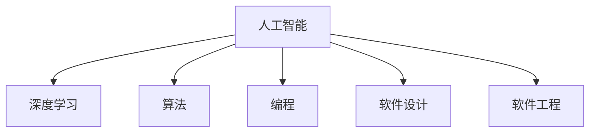

                 

# 软件 2.0 的哲学思考：人工智能的本质

> 关键词：人工智能,深度学习,算法,编程,软件设计

## 1. 背景介绍

### 1.1 问题的由来
在21世纪的今天，人工智能(AI)已经成为引领科技发展的重要领域之一。然而，尽管AI技术在图像识别、语音识别、自然语言处理等领域取得了令人瞩目的进展，但其中的软件设计和技术本质仍然存在诸多未解之谜。从软件开发的角度来看，如何将深度学习等AI技术更好地融入软件工程，从而构建更加智能、高效的系统，一直是软件设计者追求的目标。

### 1.2 问题的核心关键点
随着AI技术的不断发展，软件设计者越来越意识到，传统的软件开发范式已经无法完全适应AI的需求。AI技术的复杂性、不确定性和高度依赖于数据的特质，要求软件设计者在设计过程中必须具备更高的抽象层次和更强的适应性。如何将深度学习等AI技术更好地融入软件工程，从而构建更加智能、高效的系统，已经成为当前软件设计中的核心问题。

## 2. 核心概念与联系

### 2.1 核心概念概述

为更好地理解AI技术的本质和软件设计的结合点，本节将介绍几个密切相关的核心概念：

- **人工智能(AI)**：指通过计算机系统模拟人类智能的行为，包括学习、推理、感知、语言理解和生成等能力。

- **深度学习(Deep Learning)**：一种基于神经网络的人工智能方法，通过多层次的特征提取和抽象，能够自动学习输入数据的高级表示。

- **算法(Algorithm)**：解决特定问题的一系列规则和步骤，用于指导计算机系统进行计算和决策。

- **编程(Programming)**：将解决问题的算法转化为计算机可执行的指令，是软件开发的核心环节。

- **软件设计(Software Design)**：将系统需求转化为计算机程序的过程，包括架构设计、模块划分、接口定义、交互设计等多个方面。

- **软件工程(Software Engineering)**：将软件设计与开发实践系统化的方法论，包括需求分析、设计、编码、测试、维护等多个环节。

这些核心概念之间的逻辑关系可以通过以下Mermaid流程图来展示：



这个流程图展示了一些关键概念之间的联系：

1. 人工智能通过深度学习等技术，自动提取输入数据的高级表示。
2. 深度学习算法依赖于编程实现，将高级表示转化为计算机可执行的指令。
3. 软件设计将问题抽象为算法，并定义接口和交互，将算法转化为程序。
4. 软件工程提供系统化的方法论，将软件设计与开发实践结合起来。

这些概念共同构成了人工智能技术在软件开发中的应用框架，使得深度学习等AI技术能够被有效地应用于解决实际问题。

## 3. 核心算法原理 & 具体操作步骤

### 3.1 算法原理概述

基于深度学习的人工智能算法，本质上是一种通过多层神经网络自动提取输入数据的高级表示，从而进行推理、分类、生成等任务的技术。其核心思想是通过反向传播算法，不断调整神经网络的权重，使得模型能够更好地拟合训练数据，并泛化到未知数据。

形式化地，假设输入数据为 $x$，模型输出为 $y$，模型参数为 $\theta$，则深度学习模型的目标是最小化预测误差 $L(y,\hat{y})$，即：

$$
\min_{\theta} \frac{1}{N} \sum_{i=1}^N L(y_i,\hat{y_i})
$$

其中 $N$ 为训练样本数量，$L(y,\hat{y})$ 为损失函数，用于衡量预测值 $\hat{y}$ 与真实值 $y$ 之间的差异。

### 3.2 算法步骤详解

基于深度学习的人工智能算法，一般包括以下几个关键步骤：

**Step 1: 数据预处理**
- 将原始数据转化为神经网络可接受的格式，如将图像转化为张量形式，将文本转化为向量形式。
- 对数据进行标准化、归一化等预处理操作，提高模型训练的效率和效果。

**Step 2: 搭建神经网络模型**
- 选择合适的神经网络架构，如卷积神经网络、循环神经网络、自编码器等。
- 定义神经网络的输入层、隐藏层和输出层的节点数量、激活函数、正则化项等。

**Step 3: 定义损失函数**
- 根据具体的任务需求，选择合适的损失函数，如交叉熵损失、均方误差损失等。
- 定义损失函数的具体计算公式和实现代码。

**Step 4: 优化器选择**
- 选择合适的优化器，如随机梯度下降(SGD)、Adam等，设置学习率、动量等超参数。
- 根据模型表现和收敛情况，适时调整优化器的参数。

**Step 5: 模型训练**
- 将训练数据以批为单位输入模型，进行前向传播计算预测值。
- 计算预测值与真实值之间的损失函数值，进行反向传播计算梯度。
- 根据梯度下降等优化算法更新模型参数，直至模型收敛。

**Step 6: 模型评估**
- 在测试数据集上评估模型性能，计算精度、召回率、F1-score等指标。
- 根据评估结果，决定是否调整模型参数或重新训练。

以上是深度学习算法的典型流程。在实际应用中，还需要针对具体任务进行优化设计，如改进损失函数、引入正则化技术、搜索最优的超参数组合等，以进一步提升模型性能。

### 3.3 算法优缺点

基于深度学习的人工智能算法，具有以下优点：

1. 自适应能力强。深度学习算法通过自动学习输入数据的高级表示，能够适应各种复杂和不确定性的任务。
2. 泛化能力强。深度学习算法在大规模数据集上进行预训练，能够获得较好的泛化能力。
3. 计算能力强。深度学习算法可以利用并行计算资源，提高模型的训练和推理速度。

同时，该算法也存在一定的局限性：

1. 需要大量数据。深度学习算法对数据的依赖性较强，需要大规模的标注数据进行预训练和微调。
2. 训练时间长。深度学习算法训练时间较长，对计算资源的要求较高。
3. 可解释性差。深度学习算法被视为"黑盒"系统，难以解释其内部工作机制和决策逻辑。
4. 模型复杂度高。深度学习算法通常包含大量的神经元和层数，模型复杂度高。

尽管存在这些局限性，但就目前而言，深度学习算法仍是人工智能技术的重要范式。未来相关研究的重点在于如何进一步降低对数据的依赖，提高模型的可解释性，同时兼顾计算效率和效果。

### 3.4 算法应用领域

基于深度学习的人工智能算法，在计算机视觉、自然语言处理、语音识别、机器人等领域已经得到了广泛的应用，取得了显著的效果。以下是一些典型应用：

- 计算机视觉：用于图像识别、目标检测、图像分割等任务，如图像分类、人脸识别、自动驾驶等。
- 自然语言处理：用于文本分类、情感分析、机器翻译等任务，如问答系统、机器翻译、对话系统等。
- 语音识别：用于语音识别、语音合成等任务，如智能语音助手、语音识别系统等。
- 机器人：用于控制机器人进行导航、物体识别、动作执行等任务，如服务机器人、工业机器人等。

此外，深度学习算法也被创新性地应用到更多场景中，如推荐系统、医学诊断、金融预测等，为各个行业带来了新的突破。

## 4. 数学模型和公式 & 详细讲解 & 举例说明

### 4.1 数学模型构建

本节将使用数学语言对深度学习算法的数学模型进行更加严格的刻画。

记输入数据为 $x \in \mathbb{R}^n$，模型参数为 $\theta$，输出为 $y \in \mathbb{R}^m$。假设模型的损失函数为 $L(y,\hat{y})$，则模型的优化目标为：

$$
\min_{\theta} \frac{1}{N} \sum_{i=1}^N L(y_i,\hat{y_i})
$$

其中 $N$ 为训练样本数量。

在实践中，我们通常使用基于梯度的优化算法（如SGD、Adam等）来近似求解上述最优化问题。设 $\eta$ 为学习率，$\lambda$ 为正则化系数，则参数的更新公式为：

$$
\theta \leftarrow \theta - \eta \nabla_{\theta}L(\theta) - \eta\lambda\theta
$$

其中 $\nabla_{\theta}L(\theta)$ 为损失函数对参数 $\theta$ 的梯度，可通过反向传播算法高效计算。

### 4.2 公式推导过程

以下我们以二分类任务为例，推导交叉熵损失函数及其梯度的计算公式。

假设模型 $M_{\theta}$ 在输入 $x$ 上的输出为 $\hat{y}=M_{\theta}(x) \in [0,1]$，表示样本属于正类的概率。真实标签 $y \in \{0,1\}$。则二分类交叉熵损失函数定义为：

$$
L(y,\hat{y}) = -y\log \hat{y} - (1-y)\log (1-\hat{y})
$$

将其代入损失函数公式，得：

$$
\frac{1}{N}\sum_{i=1}^N L(y_i,\hat{y_i}) = -\frac{1}{N}\sum_{i=1}^N [y_i\log \hat{y_i} + (1-y_i)\log (1-\hat{y_i})]
$$

根据链式法则，损失函数对参数 $\theta_k$ 的梯度为：

$$
\frac{\partial L(y,\hat{y})}{\partial \theta_k} = -\frac{1}{N}(\frac{y}{\hat{y}}-\frac{1-y}{1-\hat{y}}) \frac{\partial M_{\theta}(x)}{\partial \theta_k}
$$

其中 $\frac{\partial M_{\theta}(x)}{\partial \theta_k}$ 可进一步递归展开，利用自动微分技术完成计算。

### 4.3 案例分析与讲解

假设我们有一个手写数字识别任务，训练数据集包含60000张28x28的灰度图像，其中5000张用于测试，45000张用于训练。我们可以使用LeNet-5等经典卷积神经网络进行训练，得到模型的参数 $\theta$。

模型训练时，我们采用交叉熵损失函数，并使用SGD优化算法进行优化。具体步骤如下：

1. 将图像数据转换为张量形式，并进行标准化和归一化。

2. 搭建LeNet-5卷积神经网络，定义损失函数和优化算法。

3. 在训练数据集上进行前向传播计算预测值，计算交叉熵损失。

4. 反向传播计算梯度，使用SGD算法更新模型参数。

5. 在测试数据集上评估模型性能，计算精度、召回率等指标。

6. 根据评估结果，决定是否调整模型参数或重新训练。

以下是使用TensorFlow实现上述步骤的代码：

```python
import tensorflow as tf

# 加载数据集
(x_train, y_train), (x_test, y_test) = tf.keras.datasets.mnist.load_data()

# 数据预处理
x_train = x_train / 255.0
x_test = x_test / 255.0
y_train = tf.keras.utils.to_categorical(y_train, 10)
y_test = tf.keras.utils.to_categorical(y_test, 10)

# 搭建模型
model = tf.keras.models.Sequential([
    tf.keras.layers.Conv2D(6, kernel_size=(3,3), activation='relu', input_shape=(28,28,1)),
    tf.keras.layers.MaxPooling2D(pool_size=(2,2)),
    tf.keras.layers.Flatten(),
    tf.keras.layers.Dense(128, activation='relu'),
    tf.keras.layers.Dense(10, activation='softmax')
])

# 定义损失函数和优化器
loss_fn = tf.keras.losses.categorical_crossentropy
optimizer = tf.keras.optimizers.SGD(learning_rate=0.1, momentum=0.9)

# 训练模型
model.compile(loss=loss_fn, optimizer=optimizer, metrics=['accuracy'])
model.fit(x_train, y_train, epochs=10, batch_size=64, validation_data=(x_test, y_test))

# 评估模型
test_loss, test_acc = model.evaluate(x_test, y_test, verbose=2)
print('Test accuracy:', test_acc)
```

以上就是使用TensorFlow进行手写数字识别任务的深度学习算法的实现步骤。可以看到，通过简单的代码实现，我们便能够高效地训练深度学习模型，并评估其性能。

## 5. 项目实践：代码实例和详细解释说明

### 5.1 开发环境搭建

在进行深度学习项目实践前，我们需要准备好开发环境。以下是使用Python进行TensorFlow开发的环境配置流程：

1. 安装Anaconda：从官网下载并安装Anaconda，用于创建独立的Python环境。

2. 创建并激活虚拟环境：
```bash
conda create -n tf-env python=3.8 
conda activate tf-env
```

3. 安装TensorFlow：根据CUDA版本，从官网获取对应的安装命令。例如：
```bash
conda install tensorflow-gpu -c conda-forge -c pytorch
```

4. 安装各类工具包：
```bash
pip install numpy pandas scikit-learn matplotlib tqdm jupyter notebook ipython
```

完成上述步骤后，即可在`tf-env`环境中开始深度学习项目实践。

### 5.2 源代码详细实现

下面我们以手写数字识别(NUM)任务为例，给出使用TensorFlow对LeNet-5模型进行训练的代码实现。

首先，定义NUM任务的数据处理函数：

```python
import numpy as np
import tensorflow as tf

def preprocess_data(data, label, img_size=28):
    data = data / 255.0
    data = np.expand_dims(data, axis=-1)
    label = tf.keras.utils.to_categorical(label, 10)
    return data, label

# 加载数据集
(x_train, y_train), (x_test, y_test) = tf.keras.datasets.mnist.load_data()

# 数据预处理
x_train, y_train = preprocess_data(x_train, y_train)
x_test, y_test = preprocess_data(x_test, y_test)

# 创建模型
model = tf.keras.models.Sequential([
    tf.keras.layers.Conv2D(6, kernel_size=(3,3), activation='relu', input_shape=(28,28,1)),
    tf.keras.layers.MaxPooling2D(pool_size=(2,2)),
    tf.keras.layers.Flatten(),
    tf.keras.layers.Dense(128, activation='relu'),
    tf.keras.layers.Dense(10, activation='softmax')
])

# 定义损失函数和优化器
loss_fn = tf.keras.losses.categorical_crossentropy
optimizer = tf.keras.optimizers.SGD(learning_rate=0.1, momentum=0.9)

# 训练模型
model.compile(loss=loss_fn, optimizer=optimizer, metrics=['accuracy'])
model.fit(x_train, y_train, epochs=10, batch_size=64, validation_data=(x_test, y_test))

# 评估模型
test_loss, test_acc = model.evaluate(x_test, y_test, verbose=2)
print('Test accuracy:', test_acc)
```

然后，定义模型和优化器：

```python
import tensorflow as tf

# 加载数据集
(x_train, y_train), (x_test, y_test) = tf.keras.datasets.mnist.load_data()

# 数据预处理
x_train = x_train / 255.0
x_test = x_test / 255.0
y_train = tf.keras.utils.to_categorical(y_train, 10)
y_test = tf.keras.utils.to_categorical(y_test, 10)

# 搭建模型
model = tf.keras.models.Sequential([
    tf.keras.layers.Conv2D(6, kernel_size=(3,3), activation='relu', input_shape=(28,28,1)),
    tf.keras.layers.MaxPooling2D(pool_size=(2,2)),
    tf.keras.layers.Flatten(),
    tf.keras.layers.Dense(128, activation='relu'),
    tf.keras.layers.Dense(10, activation='softmax')
])

# 定义损失函数和优化器
loss_fn = tf.keras.losses.categorical_crossentropy
optimizer = tf.keras.optimizers.SGD(learning_rate=0.1, momentum=0.9)

# 训练模型
model.compile(loss=loss_fn, optimizer=optimizer, metrics=['accuracy'])
model.fit(x_train, y_train, epochs=10, batch_size=64, validation_data=(x_test, y_test))

# 评估模型
test_loss, test_acc = model.evaluate(x_test, y_test, verbose=2)
print('Test accuracy:', test_acc)
```

### 5.3 代码解读与分析

让我们再详细解读一下关键代码的实现细节：

**preprocess_data函数**：
- `__init__`方法：对数据进行预处理，包括数据归一化、一维展开和标签one-hot编码。
- `__len__`方法：返回数据集的样本数量。
- `__getitem__`方法：对单个样本进行处理，返回处理后的输入和标签。

**模型搭建**：
- 使用TensorFlow定义卷积层、池化层、全连接层等基本组件，搭建LeNet-5模型。

**损失函数和优化器**：
- 使用交叉熵损失函数和随机梯度下降优化器，配置相应的学习率和动量。

**训练模型**：
- 使用`compile`方法定义模型的训练参数，包括损失函数、优化器和评估指标。
- 使用`fit`方法进行模型训练，设置训练轮数、批次大小和验证数据集。

**评估模型**：
- 使用`evaluate`方法在测试数据集上评估模型性能，计算精度和召回率等指标。

通过这段代码，我们可以看到，TensorFlow框架能够高效地实现深度学习算法的训练和评估，使得深度学习项目的开发变得更加简洁和高效。

当然，实际应用中还需要根据具体任务进行优化设计，如改进损失函数、引入正则化技术、搜索最优的超参数组合等，以进一步提升模型性能。

## 6. 实际应用场景

### 6.1 计算机视觉

深度学习算法在计算机视觉领域已经得到了广泛的应用，涵盖图像识别、目标检测、图像分割等多个子任务。例如，Yolo、SSD等目标检测算法已经广泛应用于自动驾驶、安防监控等场景中，具有较高的实时性和准确性。

在自动驾驶领域，基于深度学习的图像识别和目标检测算法，已经被广泛应用于辅助驾驶员感知道路状况、识别交通标志等任务，显著提高了车辆行驶的安全性和稳定性。

在安防监控领域，基于深度学习的图像识别和目标检测算法，已经被广泛应用于人脸识别、异常行为检测等任务，显著提高了安防系统的智能化水平。

### 6.2 自然语言处理

深度学习算法在自然语言处理领域也取得了显著进展，涵盖文本分类、情感分析、机器翻译等多个子任务。例如，BERT、GPT等预训练语言模型，已经被广泛应用于问答系统、机器翻译、对话系统等任务中，取得了较好的效果。

在问答系统中，基于深度学习的问答模型，已经被广泛应用于智能客服、知识图谱查询等场景中，能够自动理解用户意图，匹配最合适的答案，显著提高了人机交互的智能化水平。

在机器翻译领域，基于深度学习的机器翻译模型，已经被广泛应用于跨语言通信、文献翻译等场景中，能够自动将一种语言翻译成另一种语言，显著提高了语言交流的效率和便捷性。

### 6.3 语音识别

深度学习算法在语音识别领域也得到了广泛应用，涵盖语音识别、语音合成等子任务。例如，基于深度学习的语音识别模型，已经被广泛应用于智能语音助手、语音识别系统等场景中，具有较高的准确性和自然度。

在智能语音助手领域，基于深度学习的语音识别模型，已经被广泛应用于智能音箱、车载导航等场景中，能够自动识别用户语音，提供智能化的语音助手服务，显著提高了用户的使用体验。

在语音识别系统领域，基于深度学习的语音识别模型，已经被广泛应用于智能耳机、智能手表等场景中，能够自动识别用户语音，提供智能化的语音输入服务，显著提高了语音交互的便捷性。

### 6.4 机器人

深度学习算法在机器人领域也得到了广泛应用，涵盖控制、导航、动作执行等多个子任务。例如，基于深度学习的机器人控制模型，已经被广泛应用于服务机器人、工业机器人等场景中，具有较高的智能化水平。

在服务机器人领域，基于深度学习的机器人控制模型，已经被广泛应用于酒店服务、医院导诊等场景中，能够自动进行人机交互，提供智能化的服务，显著提高了服务效率和用户体验。

在工业机器人领域，基于深度学习的机器人控制模型，已经被广泛应用于自动化生产线、智能仓库等场景中，能够自动进行物料搬运、装配等工作，显著提高了生产效率和自动化水平。

## 7. 工具和资源推荐

### 7.1 学习资源推荐

为了帮助开发者系统掌握深度学习算法的理论基础和实践技巧，这里推荐一些优质的学习资源：

1. 《深度学习》书籍：Ian Goodfellow、Yoshua Bengio和Aaron Courville合著的经典教材，详细介绍了深度学习的原理和应用。

2. Deep Learning Specialization：由Andrew Ng在Coursera上开设的深度学习课程，内容涵盖了深度学习的基本概念和前沿技术。

3. TensorFlow官方文档：TensorFlow的官方文档，提供了详细的API和使用示例，是TensorFlow开发的必备资料。

4. PyTorch官方文档：PyTorch的官方文档，提供了详细的API和使用示例，是PyTorch开发的必备资料。

5. HuggingFace官方文档：HuggingFace的官方文档，提供了详细的预训练模型和微调样例代码，是自然语言处理开发的必备资料。

通过对这些资源的学习实践，相信你一定能够快速掌握深度学习算法的精髓，并用于解决实际的NLP问题。

### 7.2 开发工具推荐

高效的开发离不开优秀的工具支持。以下是几款用于深度学习项目开发的常用工具：

1. TensorFlow：由Google主导开发的开源深度学习框架，生产部署方便，适合大规模工程应用。

2. PyTorch：由Facebook主导开发的开源深度学习框架，灵活性高，适合研究性开发。

3. Keras：基于TensorFlow和Theano等框架的高级API，易于上手，适合快速迭代。

4. Jupyter Notebook：交互式的开发环境，支持代码编写、数据可视化等，是深度学习项目开发的利器。

5. GitHub：代码托管平台，支持版本控制、代码协作等，是深度学习项目开发的必备工具。

合理利用这些工具，可以显著提升深度学习项目的开发效率，加快创新迭代的步伐。

### 7.3 相关论文推荐

深度学习算法的发展源于学界的持续研究。以下是几篇奠基性的相关论文，推荐阅读：

1. ImageNet Classification with Deep Convolutional Neural Networks：AlexNet论文，介绍了深度卷积神经网络在图像识别任务上的应用。

2. Google's Inception Architecture for Computer Vision：Inception论文，提出了深度卷积神经网络的Inception模块，提高了深度学习的计算效率。

3. WaveNet: A Generative Model for Raw Audio：WaveNet论文，提出了基于卷积神经网络的音频生成模型，实现了高质量的语音合成。

4. Attention Is All You Need：Transformer论文，提出了基于自注意力机制的神经网络结构，开创了深度学习的新范式。

5. BERT: Pre-training of Deep Bidirectional Transformers for Language Understanding：BERT论文，提出了基于双向转换器的预训练语言模型，刷新了多项NLP任务SOTA。

这些论文代表了大规模深度学习算法的典型进展，是深度学习领域的经典之作。通过学习这些前沿成果，可以帮助研究者把握学科前进方向，激发更多的创新灵感。

## 8. 总结：未来发展趋势与挑战

### 8.1 总结

本文对深度学习算法的原理、操作步骤和实际应用进行了全面系统的介绍。首先阐述了深度学习算法的核心思想和核心算法，详细讲解了深度学习算法的典型流程，并通过代码实例展示了深度学习算法的实际应用。

通过本文的系统梳理，可以看到，深度学习算法已经成为人工智能技术的重要范式，极大地拓展了人工智能的应用边界，为计算机视觉、自然语言处理、语音识别等诸多领域带来了新的突破。未来，随着深度学习技术的不断发展，其在更多领域的应用也将不断涌现，为各个行业带来新的变革性影响。

### 8.2 未来发展趋势

展望未来，深度学习算法将呈现以下几个发展趋势：

1. 模型规模持续增大。随着算力成本的下降和数据规模的扩张，深度学习算法的参数量还将持续增长。超大规模深度学习算法蕴含的丰富特征表示，有望支撑更加复杂多变的下游任务。

2. 训练时间不断缩短。随着GPU/TPU等高性能设备的发展，深度学习算法的训练时间也将不断缩短，大规模深度学习算法的部署变得更加容易。

3. 模型可解释性增强。未来，深度学习算法将更加注重可解释性，帮助用户理解模型的决策过程和内部机制，提高模型输出的透明度。

4. 模型迁移能力提升。未来，深度学习算法将更加注重迁移学习能力，使模型能够跨领域、跨任务迁移，提高模型的泛化性能。

5. 多模态融合技术发展。未来，深度学习算法将更加注重多模态融合技术，将视觉、语音、文本等多模态信息进行协同建模，提高模型的鲁棒性和智能化水平。

6. 强化学习与深度学习的结合。未来，深度学习算法将更加注重强化学习，通过与强化学习的结合，提高模型的自适应能力和智能水平。

以上趋势凸显了深度学习算法的广阔前景。这些方向的探索发展，必将进一步提升深度学习算法的性能和应用范围，为构建智能化的应用系统铺平道路。

### 8.3 面临的挑战

尽管深度学习算法已经取得了显著进展，但在迈向更加智能化、普适化应用的过程中，它仍面临诸多挑战：

1. 数据依赖性强。深度学习算法对数据的依赖性较强，需要大规模的标注数据进行预训练和微调，难以应对数据不足或数据分布不均衡的问题。

2. 计算资源需求高。深度学习算法对计算资源的需求较高，需要高性能的硬件设备和软件环境支持，难以在低成本环境下大规模部署。

3. 模型复杂度高。深度学习算法的模型结构通常较为复杂，难以理解其内部机制和决策逻辑，难以实现模型可解释性。

4. 过拟合问题突出。深度学习算法在面对过拟合问题时，难以找到最优的超参数组合，容易陷入局部最优解。

5. 鲁棒性不足。深度学习算法在面对噪声、对抗样本等干扰时，容易产生错误决策，鲁棒性有待提高。

6. 伦理与安全问题。深度学习算法在面对伦理与安全问题时，容易产生有害的输出结果，需要进一步加强伦理与安全约束。

正视深度学习算法面临的这些挑战，积极应对并寻求突破，将是大规模深度学习算法走向成熟的必由之路。相信随着学界和产业界的共同努力，这些挑战终将一一被克服，深度学习算法必将在构建智能化的应用系统中扮演越来越重要的角色。

### 8.4 研究展望

面对深度学习算法面临的诸多挑战，未来的研究需要在以下几个方面寻求新的突破：

1. 数据增强技术的发展。通过数据增强技术，扩充训练数据集，降低数据依赖性，提高模型的泛化性能。

2. 模型的压缩与优化。通过模型压缩与优化技术，减小模型规模，提高模型的推理速度，降低计算资源需求。

3. 可解释性研究。通过可解释性技术，提高模型的可解释性，帮助用户理解模型的决策过程，提高模型输出的透明度。

4. 多模态融合技术的发展。通过多模态融合技术，将视觉、语音、文本等多模态信息进行协同建模，提高模型的鲁棒性和智能化水平。

5. 强化学习的结合。通过强化学习技术，提高模型的自适应能力和智能水平，解决深度学习算法在多模态场景中的自适应问题。

6. 伦理与安全约束的加强。通过伦理与安全约束技术，确保深度学习算法的输出符合人类价值观和伦理道德，防止有害的输出结果。

这些研究方向的探索，必将引领深度学习算法迈向更高的台阶，为构建智能化的应用系统提供新的技术支持。面向未来，深度学习算法还需要与其他人工智能技术进行更深入的融合，如知识表示、因果推理、强化学习等，多路径协同发力，共同推动人工智能技术的发展。

## 9. 附录：常见问题与解答

**Q1: 什么是深度学习算法?**

A: 深度学习算法是一种基于神经网络的机器学习方法，通过多层次的特征提取和抽象，能够自动学习输入数据的高级表示，从而进行推理、分类、生成等任务。

**Q2: 深度学习算法的核心思想是什么?**

A: 深度学习算法的核心思想是通过反向传播算法，不断调整神经网络的权重，使得模型能够更好地拟合训练数据，并泛化到未知数据。

**Q3: 如何提高深度学习算法的泛化性能?**

A: 可以通过数据增强、正则化技术、模型压缩与优化等手段，提高深度学习算法的泛化性能。

**Q4: 如何提高深度学习算法的可解释性?**

A: 可以通过可视化技术、可解释性技术等手段，提高深度学习算法的可解释性。

**Q5: 如何处理深度学习算法中的过拟合问题?**

A: 可以通过正则化技术、数据增强技术、模型压缩与优化等手段，处理深度学习算法中的过拟合问题。

**Q6: 如何提高深度学习算法的鲁棒性?**

A: 可以通过对抗训练、数据增强技术、模型压缩与优化等手段，提高深度学习算法的鲁棒性。

**Q7: 如何处理深度学习算法中的伦理与安全问题?**

A: 可以通过伦理与安全约束技术，确保深度学习算法的输出符合人类价值观和伦理道德，防止有害的输出结果。

通过以上问题的解答，相信你对深度学习算法有了更深入的理解，并能够在实际项目中灵活应用。

---

作者：禅与计算机程序设计艺术 / Zen and the Art of Computer Programming

