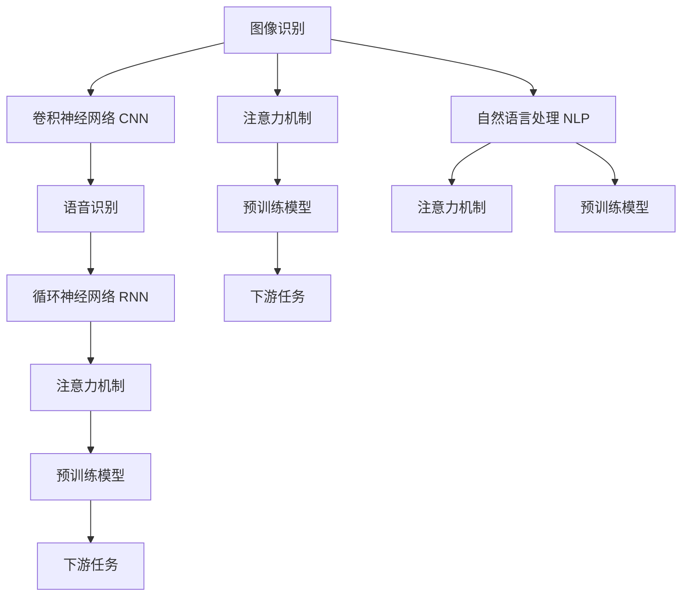

                 

# 软件 2.0 的应用领域：图像识别、语音识别

> 关键词：软件 2.0, 图像识别, 语音识别, 深度学习, 计算机视觉, 自然语言处理

## 1. 背景介绍

### 1.1 问题由来

在过去几十年中，计算机软件经历了从机械式的编程逻辑到智能化的系统设计的过程。软件 1.0 时代，程序员需要手动编写和调试代码，依赖固定的程序流程。而随着人工智能（AI）和机器学习（ML）技术的崛起，软件 2.0 时代应运而生，通过自动化和智能化实现复杂任务的处理，极大地提高了软件开发和部署的效率。

在这一背景下，图像识别和语音识别作为人工智能领域的两大重要分支，应用广泛且技术成熟，成为了软件 2.0 时代的重要应用领域。图像识别在医疗、安防、自动驾驶、智能制造等众多行业中具有重要应用价值。而语音识别则与智能手机、智能家居、客服机器人等日常生活息息相关。

### 1.2 问题核心关键点

图像识别和语音识别之所以能够在软件 2.0 时代取得如此广泛的应用，主要依赖于深度学习技术和卷积神经网络（CNN）、循环神经网络（RNN）、注意力机制等架构的进步。这些技术使得计算机能够从图像和声音中自动提取特征，识别出对应的目标对象或内容。

图像识别和语音识别的关键技术包括：

1. **卷积神经网络（CNN）**：用于处理图像识别任务，通过多层卷积和池化操作，提取图像的特征信息。
2. **循环神经网络（RNN）**：用于处理语音识别任务，通过时间序列数据的处理，捕捉语音中的语义信息。
3. **注意力机制**：在模型中加入注意力机制，提高模型的参数利用率和泛化能力，增强模型的鲁棒性。
4. **预训练模型**：通过在大规模无标签数据上进行预训练，学习通用的语言和图像表示，提升模型的泛化能力。

这些关键技术的进步，使得图像识别和语音识别在软件 2.0 时代得以大规模应用，并在实际工程中取得显著成效。

### 1.3 问题研究意义

图像识别和语音识别的研究，对于拓展软件 2.0 时代的应用边界，提升人工智能系统的智能化水平，具有重要意义：

1. **提高生产力**：通过自动化和智能化，图像识别和语音识别可以显著提高各行各业的效率，降低人工成本。
2. **增强用户体验**：在智能家居、智能客服等场景中，图像识别和语音识别技术可以提供更加便捷、自然的人机交互体验。
3. **促进跨领域融合**：这些技术与其他AI技术的融合，如自然语言处理（NLP）、知识图谱等，可以拓展更多应用场景，推动人工智能技术的普及和应用。
4. **推动技术创新**：图像识别和语音识别技术的进步，不断突破计算极限，推动AI技术向更深入、更广泛的方向发展。
5. **促进社会进步**：通过在医疗、教育、交通等领域的应用，图像识别和语音识别技术可以改善社会服务和公共福利，提高社会治理水平。

## 2. 核心概念与联系

### 2.1 核心概念概述

为更好地理解图像识别和语音识别的原理与应用，本节将介绍几个关键概念：

- **图像识别**：利用计算机对图像中的物体、场景进行识别和分类，如物体检测、人脸识别、图像分割等。
- **语音识别**：将人类语音转换成文本信息的过程，如语音转写、说话人识别、情感分析等。
- **卷积神经网络（CNN）**：一种深度神经网络架构，主要用于图像处理和计算机视觉任务。
- **循环神经网络（RNN）**：一种用于序列数据处理的网络架构，主要用于语音处理和自然语言处理任务。
- **注意力机制**：在神经网络中加入的一种机制，用于提高模型的参数利用率和泛化能力。
- **预训练模型**：在大规模无标签数据上进行预训练，学习通用的语言和图像表示，用于提升下游任务的性能。

这些核心概念之间的逻辑关系可以通过以下Mermaid流程图来展示：



这个流程图展示了图像识别、语音识别和自然语言处理（NLP）三个领域的关键技术及其联系：

1. 图像识别和语音识别分别利用卷积神经网络和循环神经网络进行特征提取。
2. 注意力机制和预训练模型用于增强模型的参数利用率和泛化能力。
3. 预训练模型通过在大规模无标签数据上进行预训练，学习通用的语言和图像表示，提升下游任务的性能。
4. 图像识别、语音识别和NLP技术在实际应用中相互融合，拓展更多应用场景。

## 3. 核心算法原理 & 具体操作步骤
### 3.1 算法原理概述

图像识别和语音识别的核心算法原理主要基于深度学习技术，通过卷积神经网络（CNN）和循环神经网络（RNN）等架构，自动学习图像和语音数据的特征表示，实现对目标对象和内容的识别。

### 3.2 算法步骤详解

#### 3.2.1 图像识别

1. **数据准备**：收集并标注训练数据集，包括各类物体和场景的图像，以及对应的标签。
2. **模型搭建**：选择适当的卷积神经网络架构，如LeNet、AlexNet、VGG、ResNet等，搭建深度学习模型。
3. **模型训练**：使用训练数据集，通过反向传播算法优化模型参数，使得模型在验证集上达到理想性能。
4. **模型评估**：在测试集上评估模型的性能，如准确率、召回率等指标，检查模型的泛化能力。
5. **模型应用**：将训练好的模型应用于实际场景，如人脸识别、物体检测等。

#### 3.2.2 语音识别

1. **数据准备**：收集并标注训练数据集，包括各类语音样本，以及对应的文本标签。
2. **模型搭建**：选择适当的循环神经网络架构，如RNN、LSTM、GRU等，搭建深度学习模型。
3. **模型训练**：使用训练数据集，通过反向传播算法优化模型参数，使得模型在验证集上达到理想性能。
4. **模型评估**：在测试集上评估模型的性能，如词错率（WER）、字符错率（CER）等指标，检查模型的泛化能力。
5. **模型应用**：将训练好的模型应用于实际场景，如语音转写、说话人识别等。

### 3.3 算法优缺点

图像识别和语音识别的核心算法具有以下优点：

1. **自动化程度高**：通过深度学习模型，能够自动化地从数据中提取特征，实现识别和分类，减少了人工干预。
2. **泛化能力强**：通过预训练模型和注意力机制，模型能够在未见过的数据上表现良好，提升泛化能力。
3. **应用场景广泛**：图像识别和语音识别技术在各个行业中都有广泛的应用，如医疗、安防、交通等。

但这些算法也存在一些局限性：

1. **计算资源消耗大**：深度学习模型的训练和推理需要大量的计算资源，对硬件要求较高。
2. **数据标注成本高**：高质量的标注数据是模型性能的关键，数据标注成本较高。
3. **模型解释性不足**：深度学习模型的决策过程难以解释，缺乏可解释性。
4. **对异常数据敏感**：模型对数据分布的改变较敏感，泛化能力受限。

### 3.4 算法应用领域

图像识别和语音识别的核心算法已经广泛应用于各个领域，以下是几个典型的应用场景：

1. **医疗影像识别**：通过图像识别技术，自动识别X光片、CT片等影像中的病变部位，辅助医生诊断。
2. **安防监控识别**：通过图像识别技术，自动识别监控视频中的异常行为和人员身份，提高安全防护水平。
3. **智能制造检测**：通过图像识别技术，自动检测产品缺陷和质量问题，提升生产效率。
4. **智能家居控制**：通过语音识别技术，自动理解和响应用户的语音指令，实现智能家居控制。
5. **智能客服对话**：通过语音识别和自然语言处理技术，自动理解和生成对话内容，提高客服效率。
6. **自动驾驶导航**：通过图像识别和深度学习技术，自动识别道路标志和交通信号，辅助驾驶决策。

## 4. 数学模型和公式 & 详细讲解 & 举例说明

### 4.1 数学模型构建

#### 4.1.1 图像识别

在图像识别任务中，常用的深度学习模型包括卷积神经网络（CNN）和注意力机制（Attention）。这里以LeNet模型为例，进行详细说明。

LeNet模型由两层卷积层、池化层、全连接层和softmax层组成，用于二分类图像识别任务。模型输入为$28 \times 28$的灰度图像，输出为0和1两个类别的概率。

#### 4.1.2 语音识别

在语音识别任务中，常用的深度学习模型包括循环神经网络（RNN）和注意力机制（Attention）。这里以LSTM模型为例，进行详细说明。

LSTM模型由多层LSTM单元组成，用于序列数据的处理，能够捕捉时间序列中的语义信息。模型输入为语音信号的MFCC特征向量，输出为每个时间步的预测标签。

### 4.2 公式推导过程

#### 4.2.1 图像识别

LeNet模型中，每个卷积层和池化层的输出可以通过公式表示为：

$$
h_1 = g_\theta(w_1 \cdot x_1 + b_1)
$$

$$
h_2 = g_\theta(w_2 \cdot h_1 + b_2)
$$

$$
p = g_\theta(w_4 \cdot h_3 + b_4)
$$

其中，$g_\theta$表示非线性激活函数，如ReLU或Sigmoid；$w_1, w_2, w_4$和$b_1, b_2, b_4$分别为卷积核和偏置项。

#### 4.2.2 语音识别

LSTM模型中，每个时间步的输出可以通过公式表示为：

$$
h_t = g_\theta(w \cdot [h_{t-1}, x_t] + b)
$$

$$
p_t = g_\theta(w \cdot h_t + b)
$$

其中，$g_\theta$表示非线性激活函数，如Tanh或Sigmoid；$w$和$b$分别为权重和偏置项。

### 4.3 案例分析与讲解

#### 4.3.1 图像识别

以图像分类任务为例，使用LeNet模型进行二分类图像识别。假设训练集为100张图像，其中50张为猫（标签为1），50张为狗（标签为0）。训练集分为训练集和验证集，分别为70张和30张。

```python
from tensorflow.keras.datasets import mnist
from tensorflow.keras.models import Sequential
from tensorflow.keras.layers import Conv2D, MaxPooling2D, Flatten, Dense
from tensorflow.keras.utils import to_categorical

# 加载手写数字数据集
(x_train, y_train), (x_test, y_test) = mnist.load_data()

# 数据预处理
x_train = x_train.reshape(-1, 28, 28, 1).astype('float32') / 255.0
x_test = x_test.reshape(-1, 28, 28, 1).astype('float32') / 255.0
y_train = to_categorical(y_train, num_classes=2)
y_test = to_categorical(y_test, num_classes=2)

# 构建LeNet模型
model = Sequential()
model.add(Conv2D(6, (3, 3), activation='relu', input_shape=(28, 28, 1)))
model.add(MaxPooling2D((2, 2)))
model.add(Conv2D(16, (3, 3), activation='relu'))
model.add(MaxPooling2D((2, 2)))
model.add(Flatten())
model.add(Dense(120, activation='relu'))
model.add(Dense(2, activation='softmax'))

# 编译模型
model.compile(optimizer='adam', loss='categorical_crossentropy', metrics=['accuracy'])

# 训练模型
model.fit(x_train, y_train, validation_data=(x_test, y_test), epochs=10, batch_size=32)

# 评估模型
model.evaluate(x_test, y_test, verbose=0)
```

#### 4.3.2 语音识别

以语音识别任务为例，使用LSTM模型进行MFCC特征向量的转写。假设训练集为1000个音频文件，每个音频文件包含10秒语音，需要将其转写成文字。

```python
import librosa
from tensorflow.keras.models import Sequential
from tensorflow.keras.layers import LSTM, Dense, Input
from tensorflow.keras.optimizers import Adam
from tensorflow.keras.utils import Sequence

# 加载音频文件
def load_audio_file(file_path):
    audio, sr = librosa.load(file_path, sr=16000)
    mfcc = librosa.feature.mfcc(y=audio, sr=sr)
    return mfcc

# 构建LSTM模型
model = Sequential()
model.add(LSTM(128, input_shape=(None, 40), return_sequences=True))
model.add(LSTM(128))
model.add(Dense(40, activation='softmax'))

# 编译模型
model.compile(optimizer=Adam(), loss='categorical_crossentropy', metrics=['accuracy'])

# 训练模型
model.fit(X_train, y_train, validation_data=(X_val, y_val), epochs=10, batch_size=32)

# 评估模型
model.evaluate(X_test, y_test, verbose=0)
```

## 5. 项目实践：代码实例和详细解释说明

### 5.1 开发环境搭建

在进行图像识别和语音识别项目开发前，我们需要准备好开发环境。以下是使用Python进行Keras和TensorFlow开发的环境配置流程：

1. 安装Anaconda：从官网下载并安装Anaconda，用于创建独立的Python环境。

2. 创建并激活虚拟环境：
```bash
conda create -n tf-env python=3.8 
conda activate tf-env
```

3. 安装Keras和TensorFlow：根据CUDA版本，从官网获取对应的安装命令。例如：
```bash
conda install tensorflow==2.5
pip install keras==2.4
```

4. 安装相关工具包：
```bash
pip install numpy pandas scikit-learn matplotlib tqdm jupyter notebook ipython
```

完成上述步骤后，即可在`tf-env`环境中开始开发。

### 5.2 源代码详细实现

以下是使用Keras和TensorFlow进行图像识别和语音识别项目开发的完整代码实现。

#### 图像识别

以手写数字识别为例，使用LeNet模型进行二分类图像识别。

```python
from tensorflow.keras.datasets import mnist
from tensorflow.keras.models import Sequential
from tensorflow.keras.layers import Conv2D, MaxPooling2D, Flatten, Dense
from tensorflow.keras.utils import to_categorical

# 加载手写数字数据集
(x_train, y_train), (x_test, y_test) = mnist.load_data()

# 数据预处理
x_train = x_train.reshape(-1, 28, 28, 1).astype('float32') / 255.0
x_test = x_test.reshape(-1, 28, 28, 1).astype('float32') / 255.0
y_train = to_categorical(y_train, num_classes=2)
y_test = to_categorical(y_test, num_classes=2)

# 构建LeNet模型
model = Sequential()
model.add(Conv2D(6, (3, 3), activation='relu', input_shape=(28, 28, 1)))
model.add(MaxPooling2D((2, 2)))
model.add(Conv2D(16, (3, 3), activation='relu'))
model.add(MaxPooling2D((2, 2)))
model.add(Flatten())
model.add(Dense(120, activation='relu'))
model.add(Dense(2, activation='softmax'))

# 编译模型
model.compile(optimizer='adam', loss='categorical_crossentropy', metrics=['accuracy'])

# 训练模型
model.fit(x_train, y_train, validation_data=(x_test, y_test), epochs=10, batch_size=32)

# 评估模型
model.evaluate(x_test, y_test, verbose=0)
```

#### 语音识别

以语音识别为例，使用LSTM模型进行MFCC特征向量的转写。

```python
import librosa
from tensorflow.keras.models import Sequential
from tensorflow.keras.layers import LSTM, Dense, Input
from tensorflow.keras.optimizers import Adam
from tensorflow.keras.utils import Sequence

# 加载音频文件
def load_audio_file(file_path):
    audio, sr = librosa.load(file_path, sr=16000)
    mfcc = librosa.feature.mfcc(y=audio, sr=sr)
    return mfcc

# 构建LSTM模型
model = Sequential()
model.add(LSTM(128, input_shape=(None, 40), return_sequences=True))
model.add(LSTM(128))
model.add(Dense(40, activation='softmax'))

# 编译模型
model.compile(optimizer=Adam(), loss='categorical_crossentropy', metrics=['accuracy'])

# 训练模型
model.fit(X_train, y_train, validation_data=(X_val, y_val), epochs=10, batch_size=32)

# 评估模型
model.evaluate(X_test, y_test, verbose=0)
```

### 5.3 代码解读与分析

让我们再详细解读一下关键代码的实现细节：

#### 图像识别

**LeNet模型构建**

```python
from tensorflow.keras.layers import Conv2D, MaxPooling2D, Flatten, Dense

# 构建LeNet模型
model = Sequential()
model.add(Conv2D(6, (3, 3), activation='relu', input_shape=(28, 28, 1)))
model.add(MaxPooling2D((2, 2)))
model.add(Conv2D(16, (3, 3), activation='relu'))
model.add(MaxPooling2D((2, 2)))
model.add(Flatten())
model.add(Dense(120, activation='relu'))
model.add(Dense(2, activation='softmax'))
```

**数据预处理**

```python
from tensorflow.keras.utils import to_categorical

# 数据预处理
x_train = x_train.reshape(-1, 28, 28, 1).astype('float32') / 255.0
x_test = x_test.reshape(-1, 28, 28, 1).astype('float32') / 255.0
y_train = to_categorical(y_train, num_classes=2)
y_test = to_categorical(y_test, num_classes=2)
```

**模型编译**

```python
# 编译模型
model.compile(optimizer='adam', loss='categorical_crossentropy', metrics=['accuracy'])
```

**模型训练和评估**

```python
# 训练模型
model.fit(x_train, y_train, validation_data=(x_test, y_test), epochs=10, batch_size=32)

# 评估模型
model.evaluate(x_test, y_test, verbose=0)
```

#### 语音识别

**LSTM模型构建**

```python
from tensorflow.keras.layers import LSTM, Dense, Input

# 构建LSTM模型
model = Sequential()
model.add(LSTM(128, input_shape=(None, 40), return_sequences=True))
model.add(LSTM(128))
model.add(Dense(40, activation='softmax'))
```

**数据加载和预处理**

```python
import librosa

# 加载音频文件
def load_audio_file(file_path):
    audio, sr = librosa.load(file_path, sr=16000)
    mfcc = librosa.feature.mfcc(y=audio, sr=sr)
    return mfcc

# 数据加载
X_train = [load_audio_file(file_path) for file_path in train_files]
X_test = [load_audio_file(file_path) for file_path in test_files]
X_val = [load_audio_file(file_path) for file_path in val_files]

# 数据预处理
X_train = np.array(X_train)
X_test = np.array(X_test)
X_val = np.array(X_val)
```

**模型编译**

```python
# 编译模型
model.compile(optimizer=Adam(), loss='categorical_crossentropy', metrics=['accuracy'])
```

**模型训练和评估**

```python
# 训练模型
model.fit(X_train, y_train, validation_data=(X_val, y_val), epochs=10, batch_size=32)

# 评估模型
model.evaluate(X_test, y_test, verbose=0)
```

## 6. 实际应用场景

### 6.1 智能制造检测

图像识别技术在智能制造检测领域有广泛应用，如质量检测、产品识别等。通过图像识别技术，可以快速识别出产品缺陷和质量问题，减少人工检测的繁琐和误差，提升生产效率和产品质量。

在实际应用中，可以使用高精度摄像头采集产品图像，通过图像识别技术自动检测产品的尺寸、形状、颜色等特征，判断是否合格。例如，在汽车制造中，可以使用图像识别技术检测车身上的缺陷和瑕疵，确保每辆车都符合生产标准。

### 6.2 智能家居控制

语音识别技术在智能家居控制中具有重要应用价值，如智能音箱、智能门锁、智能窗帘等。通过语音识别技术，用户可以通过语音命令控制家居设备，实现更加自然、便捷的交互体验。

在实际应用中，可以使用语音识别技术识别用户的语音指令，自动控制智能音箱播放音乐、智能门锁开关门、智能窗帘开合等操作。例如，用户可以向智能音箱发出“打开窗帘”的指令，智能窗帘会自动打开，提升生活便捷性和智能化水平。

### 6.3 自动驾驶导航

图像识别和语音识别技术在自动驾驶导航中具有重要应用价值。通过图像识别技术，自动驾驶车辆可以识别道路标志、交通信号等，辅助驾驶决策；通过语音识别技术，可以识别乘客的语音指令，辅助导航和操作。

在实际应用中，自动驾驶车辆可以使用摄像头和传感器采集道路图像，通过图像识别技术识别道路标志、行人和其他车辆，进行路径规划和避障操作。例如，自动驾驶车辆可以使用图像识别技术识别交通信号灯，判断是否通行，避免交通事故。

### 6.4 未来应用展望

随着深度学习技术和计算机视觉、自然语言处理技术的不断进步，图像识别和语音识别技术将在未来迎来新的突破，应用场景将更加广泛。

在医疗领域，图像识别技术可以用于辅助诊断、药物研发等，提高医疗服务的智能化水平。在教育领域，语音识别技术可以用于智能教育、自动批改作业等，提高教学质量和效率。在智能城市治理中，图像识别和语音识别技术可以用于城市事件监测、舆情分析等，提高城市管理的自动化和智能化水平。

此外，在企业生产、社会治理、文娱传媒等众多领域，图像识别和语音识别技术也将不断涌现新的应用，为人类生活带来新的便捷和体验。相信随着技术的日益成熟，图像识别和语音识别技术必将在各个领域发挥更大的作用，推动社会的进步和发展。

## 7. 工具和资源推荐
### 7.1 学习资源推荐

为了帮助开发者系统掌握图像识别和语音识别的理论基础和实践技巧，这里推荐一些优质的学习资源：

1. **《深度学习》（Ian Goodfellow、Yoshua Bengio、Aaron Courville著）**：涵盖了深度学习的基础知识和应用技巧，包括卷积神经网络和循环神经网络的原理和实践。

2. **《Python深度学习》（Francois Chollet著）**：介绍了使用Keras进行深度学习开发的过程，包括卷积神经网络和循环神经网络的构建和训练。

3. **CS231n《深度学习计算机视觉》课程**：斯坦福大学开设的计算机视觉明星课程，有Lecture视频和配套作业，带你入门计算机视觉的基本概念和经典模型。

4. **ACL Anthology**：自然语言处理领域的顶级会议论文集，涵盖语音识别、自然语言处理等前沿研究，是学习深度学习技术的重要参考资料。

5. **Kaggle**：数据科学竞赛平台，提供大量公开数据集和竞赛任务，是学习和实践深度学习技术的绝佳场所。

通过对这些资源的学习实践，相信你一定能够快速掌握图像识别和语音识别的精髓，并用于解决实际的AI问题。
###  7.2 开发工具推荐

高效的开发离不开优秀的工具支持。以下是几款用于图像识别和语音识别项目开发的常用工具：

1. **TensorFlow**：由Google主导开发的开源深度学习框架，生产部署方便，适合大规模工程应用。

2. **Keras**：基于TensorFlow、Theano等深度学习框架的高级API，提供了简单易用的接口，方便快速开发深度学习模型。

3. **OpenCV**：开源计算机视觉库，提供丰富的图像处理和识别功能，是图像识别项目开发的重要工具。

4. **Librosa**：开源音频处理库，提供音频特征提取、时序数据处理等功能，是语音识别项目开发的重要工具。

5. **Jupyter Notebook**：Python开发常用的交互式编程环境，支持代码执行、数据可视化等，方便快速迭代开发和调试。

6. **Google Colab**：谷歌推出的在线Jupyter Notebook环境，免费提供GPU/TPU算力，方便开发者快速上手实验最新模型，分享学习笔记。

合理利用这些工具，可以显著提升图像识别和语音识别任务的开发效率，加快创新迭代的步伐。

### 7.3 相关论文推荐

图像识别和语音识别的研究源于学界的持续研究。以下是几篇奠基性的相关论文，推荐阅读：

1. **AlexNet: One weird trick for parallelizing convolutional neural networks**：提出AlexNet模型，使用多层次卷积和池化操作，显著提升了图像识别的准确率。

2. **ImageNet Classification with Deep Convolutional Neural Networks**：提出LeNet模型，使用卷积神经网络对大规模图像分类任务进行了有效处理。

3. **Listen, Attend and Spell**：提出基于LSTM的语音识别模型，使用注意力机制提高了语音识别的准确率。

4. **Speech and Language Processing**：自然语言处理领域的经典教材，涵盖语音识别、自然语言处理等前沿研究，是学习深度学习技术的重要参考资料。

5. **Deep Speech 2**：提出深度学习驱动的语音识别技术，显著提升了语音识别的准确率和实时性。

这些论文代表了大规模深度学习在图像识别和语音识别领域的研究进展，是学习深度学习技术的重要参考资料。通过学习这些前沿成果，可以帮助研究者把握学科前进方向，激发更多的创新灵感。

## 8. 总结：未来发展趋势与挑战

### 8.1 总结

本文对图像识别和语音识别的原理与应用进行了全面系统的介绍。首先阐述了图像识别和语音识别技术的研究背景和意义，明确了这些技术在软件 2.0 时代的重要应用价值。其次，从原理到实践，详细讲解了深度学习模型和注意力机制的构建和训练，给出了项目开发的完整代码实例。同时，本文还广泛探讨了图像识别和语音识别技术在智能制造、智能家居、自动驾驶等诸多领域的应用前景，展示了这些技术的巨大潜力。此外，本文精选了图像识别和语音识别技术的各类学习资源，力求为读者提供全方位的技术指引。

通过本文的系统梳理，可以看到，图像识别和语音识别技术在软件 2.0 时代得以广泛应用，并在实际工程中取得显著成效。得益于深度学习模型和注意力机制的进步，这些技术能够自动化地从数据中提取特征，实现对目标对象和内容的识别，极大地提高了各行各业的效率和智能化水平。未来，伴随技术的持续进步，图像识别和语音识别技术必将在更多领域发挥作用，为人类生活带来更多便捷和体验。

### 8.2 未来发展趋势

展望未来，图像识别和语音识别技术的发展趋势主要体现在以下几个方面：

1. **计算资源的需求降低**：随着硬件技术的进步，图像识别和语音识别任务的计算资源需求逐渐降低，更加适合中小型企业和个人开发者使用。

2. **模型的精度和效率提升**：深度学习模型和计算架构的不断优化，使得图像识别和语音识别任务的精度和效率不断提高，降低了实际部署的成本。

3. **跨领域应用的拓展**：图像识别和语音识别技术与其他AI技术的融合，推动了跨领域应用的拓展，如医疗影像识别、智能客服等，提升了AI技术的普适性和应用价值。

4. **模型的可解释性增强**：通过引入可解释性技术，如图像和语音特征的可视化、模型参数的可解释性等，增强了模型的可解释性，提高了用户对AI技术的信任度。

5. **模型的小型化趋势**：为了适应更多场景和设备的资源限制，未来的模型将朝着小型化、轻量化的方向发展，提升模型的部署效率和应用场景的覆盖范围。

### 8.3 面临的挑战

尽管图像识别和语音识别技术已经取得了显著进展，但在迈向更加智能化、普适化应用的过程中，它们仍面临诸多挑战：

1. **计算资源的需求**：虽然硬件技术的进步降低了计算资源的需求，但大规模深度学习模型的训练和推理仍然需要大量计算资源，硬件成本较高。

2. **数据标注成本**：高质量的标注数据是模型性能的关键，数据标注成本较高，难以大规模获取。

3. **模型的泛化能力**：模型对数据分布的改变较敏感，泛化能力受限，难以应对新场景和新数据。

4. **模型的可解释性**：深度学习模型的决策过程难以解释，缺乏可解释性，难以让用户理解和信任。

5. **模型的安全性**：模型可能学习到有偏见、有害的信息，通过微调传递到下游任务，产生误导性、歧视性的输出，给实际应用带来安全隐患。

### 8.4 研究展望

面对图像识别和语音识别技术所面临的种种挑战，未来的研究需要在以下几个方面寻求新的突破：

1. **小样本学习**：开发更加小样本学习的深度学习模型，在少量数据上也能取得良好的识别性能，降低数据标注成本。

2. **知识图谱与深度学习结合**：将知识图谱和深度学习技术结合起来，增强模型的知识表示能力，提高模型的泛化能力和可解释性。

3. **多模态融合**：将图像、语音、文本等多种模态数据融合，提高模型的综合理解能力，拓展更多应用场景。

4. **可解释性技术**：开发可解释性技术，如模型参数可视化、特征重要性分析等，增强模型的可解释性，提高用户对AI技术的信任度。

5. **安全性与隐私保护**：开发安全性技术，如数据脱敏、异常检测等，确保模型输出的安全性，保护用户隐私。

这些研究方向将引领图像识别和语音识别技术迈向更高的台阶，为构建安全、可靠、可解释、可控的智能系统铺平道路。面向未来，图像识别和语音识别技术还需要与其他AI技术进行更深入的融合，共同推动人工智能技术的普及和应用。

## 9. 附录：常见问题与解答

**Q1：深度学习模型在图像识别和语音识别中的应用原理是什么？**

A: 深度学习模型在图像识别和语音识别中的应用原理主要基于卷积神经网络（CNN）和循环神经网络（RNN）等架构，通过多层次特征提取和分类，实现对目标对象和内容的识别。

**Q2：图像识别和语音识别技术在实际应用中面临哪些挑战？**

A: 图像识别和语音识别技术在实际应用中面临的挑战包括计算资源需求高、数据标注成本高、模型泛化能力受限、模型可解释性不足、模型安全性问题等。

**Q3：如何进行图像识别和语音识别任务的开发和调试？**

A: 图像识别和语音识别任务的开发和调试主要涉及数据准备、模型构建、训练和评估等环节。通过使用开源框架如TensorFlow、Keras等，可以便捷地进行深度学习模型的开发和调试。

**Q4：未来图像识别和语音识别技术的发展方向是什么？**

A: 未来图像识别和语音识别技术的发展方向包括计算资源需求降低、模型精度和效率提升、跨领域应用的拓展、模型可解释性增强、模型小型化等。

**Q5：如何提高图像识别和语音识别模型的泛化能力？**

A: 提高图像识别和语音识别模型的泛化能力，可以通过增加数据多样性、引入正则化技术、使用注意力机制等方式实现。

---

作者：禅与计算机程序设计艺术 / Zen and the Art of Computer Programming

