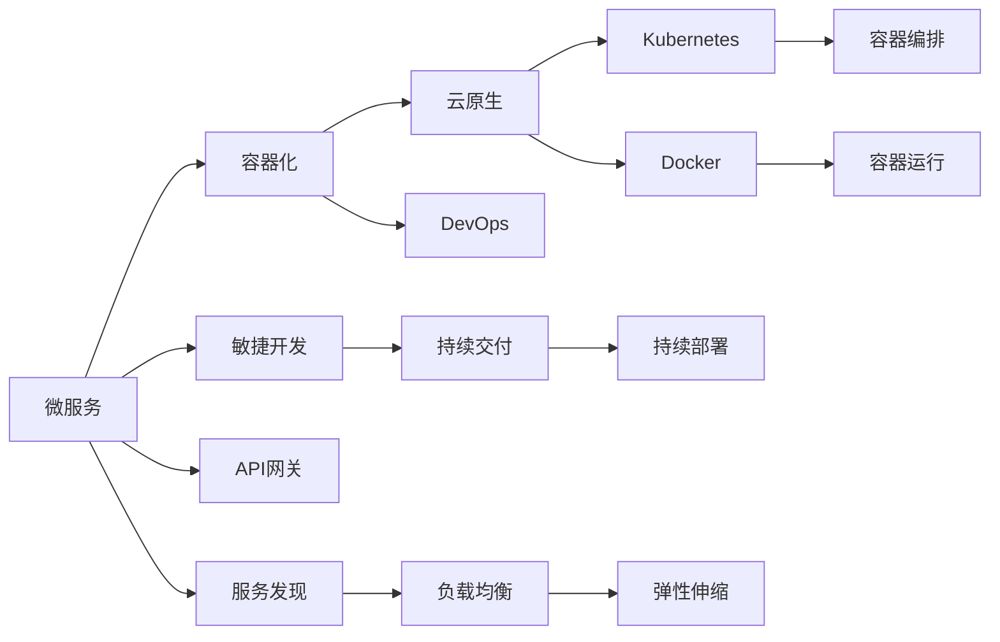

                 

# 软件2.0的容器化与云原生开发

## 1. 背景介绍

在软件工程的历史长河中，经历了从软件1.0（基于大型机和单体应用）到软件2.0（基于微服务和容器化的软件）的重大转变。软件2.0的发展，标志着软件开发进入了一个全新的时代，它不仅提升了软件的开发效率和可扩展性，而且极大地改变了软件交付和运维的方式。然而，随着微服务架构的普及，也带来了一系列复杂性和挑战。在本文中，我们将深入探讨软件2.0的容器化与云原生开发，提供详尽的实践指南和技术解析，以期对行业内的开发者和架构师有所启发。

## 2. 核心概念与联系

### 2.1 核心概念概述

- **软件1.0**：基于大型机和单体应用的传统软件开发模式，应用规模庞大且难以维护。
- **微服务**：将大型应用拆分为多个小型、独立、可发布的服务，每个服务负责特定的业务功能。
- **容器化**：通过将应用程序及其依赖打包在容器中，实现跨平台、高效、一致的应用部署和运行。
- **云原生**：基于容器化技术，在云环境中构建和运维应用程序，实现自动化、弹性和可观测性。
- **DevOps**：结合软件开发和运维的最佳实践，实现持续交付和持续部署。
- **Kubernetes**：一个开源的容器编排系统，用于自动化容器部署、扩展和管理。
- **Docker**：一个开源的容器化平台，支持应用程序的快速打包、部署和管理。

这些概念共同构成了软件2.0的基石，它们之间相互关联、相互支持，共同推动了软件开发的革新和演进。

### 2.2 核心概念原理和架构的 Mermaid 流程图



## 3. 核心算法原理 & 具体操作步骤

### 3.1 算法原理概述

软件2.0的容器化与云原生开发，本质上是通过容器化技术实现微服务的自动化部署和运行，并通过云原生技术提升应用程序的弹性和可观测性。这一过程主要包括容器构建、容器编排和云上部署三个核心步骤。

1. **容器构建**：将应用程序打包为容器镜像，通过Dockerfile等容器定义文件实现。
2. **容器编排**：通过Kubernetes等容器编排工具，实现容器的自动化部署、扩展和管理。
3. **云上部署**：将容器镜像部署到云平台，如AWS、Google Cloud、Azure等，实现应用程序的高可用性和弹性伸缩。

### 3.2 算法步骤详解

#### 3.2.1 容器构建

1. **创建Dockerfile**：编写Dockerfile文件，定义容器镜像的构建步骤。
2. **构建容器镜像**：在本地或远程仓库中构建容器镜像，并通过`docker build`命令生成。
3. **测试容器镜像**：通过`docker run`命令测试容器镜像，确保其正常运行。

#### 3.2.2 容器编排

1. **配置Kubernetes集群**：搭建Kubernetes集群，包括master和worker节点。
2. **部署应用到Kubernetes**：使用Kubernetes Deployment和Service资源定义应用，并通过`kubectl apply`命令部署。
3. **监控和管理容器**：使用Kubernetes Dashboard等工具监控容器状态，进行资源管理和扩展。

#### 3.2.3 云上部署

1. **选择云平台**：根据需求选择合适的云平台，如AWS、Google Cloud、Azure等。
2. **创建虚拟机实例**：在云平台上创建虚拟机实例，并安装Kubernetes。
3. **部署应用程序**：将容器镜像部署到云上的虚拟机实例中，并使用Kubernetes进行管理。

### 3.3 算法优缺点

#### 3.3.1 优点

1. **提高开发效率**：通过容器化技术，应用程序的打包、部署和运行过程可以自动化完成，减少了人工干预。
2. **增强系统弹性**：通过云原生技术，应用程序可以根据负载自动扩展和伸缩，保证了系统的可用性和响应性。
3. **简化运维管理**：通过容器编排工具，可以自动管理容器的部署、更新和扩展，减少了运维的复杂度。
4. **提升开发可移植性**：容器化技术实现了应用的跨平台部署，使得应用程序可以在不同的环境和硬件上运行。

#### 3.3.2 缺点

1. **学习曲线陡峭**：容器化和云原生技术需要掌握Docker、Kubernetes等工具，对于初学者而言可能存在一定的学习曲线。
2. **性能损耗**：容器化增加了额外的抽象层，可能对性能产生一定的影响，尤其是在高并发场景下。
3. **资源消耗**：容器编排和云上部署需要额外的资源，如计算和存储，可能会增加成本。

### 3.4 算法应用领域

软件2.0的容器化与云原生开发，在多个领域得到了广泛的应用，例如：

- **金融行业**：使用微服务和容器化技术，提升金融系统的稳定性和可扩展性，实现快速部署和故障恢复。
- **电商行业**：通过云原生技术，实现电商平台的弹性扩展和高效运维，提升用户体验和交易速度。
- **医疗行业**：在医疗信息系统、智能诊疗等方面，应用微服务和容器化技术，实现数据的实时处理和分析。
- **物联网行业**：利用云原生技术，实现物联网设备的自动化管理和弹性伸缩，提升系统的可靠性和效率。

## 4. 数学模型和公式 & 详细讲解

### 4.1 数学模型构建

在软件2.0的容器化与云原生开发中，数学模型的构建主要是围绕资源分配和调度进行。以Kubernetes为例，其资源分配和调度模型基于资源的请求和限制，通过节点资源的负载均衡来实现应用的弹性伸缩。

设系统有$n$个节点，每个节点的资源容量为$c_i$，任务$m$的资源请求为$r_m$，限制为$s_m$。则资源调度问题的目标是最小化任务总运行时间，同时满足以下约束条件：

1. $r_m \leq c_i$：任务$m$的资源请求不超过节点$i$的资源容量。
2. $s_m \geq r_m$：任务$m$的资源限制不小于资源请求。
3. $\sum_{m=1}^{M} r_m = \sum_{m=1}^{M} s_m$：任务的总资源请求等于总资源限制。

### 4.2 公式推导过程

上述资源调度问题可以通过线性规划求解。设$f_i$为节点$i$的负载，则问题可以转化为：

$$
\min \sum_{m=1}^{M} f_m
$$

受限于以下约束条件：

$$
\begin{aligned}
& \text{subject to} \\
& \sum_{m=1}^{M} r_m \leq c_i & \text{for } i=1,\ldots,n \\
& \sum_{m=1}^{M} s_m \leq c_i & \text{for } i=1,\ldots,n \\
& f_i = \sum_{m=1}^{M} \max(0, r_m - s_m) & \text{for } i=1,\ldots,n \\
& f_i \geq 0 & \text{for } i=1,\ldots,n \\
\end{aligned}
$$

使用线性规划求解器，如Gurobi或CPLEX，可以求解上述优化问题，得到最优的任务分配和节点负载。

### 4.3 案例分析与讲解

以一个简单的例子来说明如何利用上述数学模型进行资源分配。假设系统有3个节点，每个节点的资源容量为100，任务1的资源请求为50，限制为40；任务2的资源请求为70，限制为60。则问题可以转化为：

$$
\min f_1 + f_2
$$

受限于以下约束条件：

$$
\begin{aligned}
& f_1 \geq 50 - 40 & \\
& f_1 \leq 100 & \\
& f_2 \geq 70 - 60 & \\
& f_2 \leq 100 & \\
\end{aligned}
$$

通过求解，得到$f_1 = 10$，$f_2 = 40$，即任务1分配到节点1，任务2分配到节点2，节点3闲置。

## 5. 项目实践：代码实例和详细解释说明

### 5.1 开发环境搭建

1. **安装Docker**：在Linux或Mac上，通过命令`sudo apt-get install docker-ce`安装Docker；在Windows上，可以从Docker官网下载安装包。
2. **创建Docker镜像**：编写Dockerfile文件，定义应用程序的构建步骤，并通过`docker build`命令生成容器镜像。
3. **运行容器镜像**：通过`docker run`命令启动容器，并进行应用测试。

### 5.2 源代码详细实现

#### 5.2.1 编写Dockerfile

```Dockerfile
# 使用官方Python基础镜像
FROM python:3.8-slim

# 设置工作目录
WORKDIR /app

# 复制项目代码到容器中
COPY . /app

# 安装依赖包
RUN pip install -r requirements.txt

# 设置应用程序入口
CMD ["python", "main.py"]
```

#### 5.2.2 构建容器镜像

```bash
docker build -t myapp .
```

#### 5.2.3 测试容器镜像

```bash
docker run -d --name myapp -p 5000:5000 myapp
```

### 5.3 代码解读与分析

**Dockerfile**：
- `FROM`指令定义了使用的基础镜像。
- `WORKDIR`指令设置容器的工作目录。
- `COPY`指令将项目代码复制到容器中。
- `RUN`指令在容器中安装依赖包。
- `CMD`指令设置应用程序的入口。

**容器运行**：
- `docker run`指令启动容器，`-d`参数使容器在后台运行，`-p`参数将容器的端口映射到主机端口。

**代码示例**：
```python
from flask import Flask, jsonify

app = Flask(__name__)

@app.route('/')
def hello():
    return jsonify({'message': 'Hello, world!'})

if __name__ == '__main__':
    app.run(host='0.0.0.0', port=5000)
```

### 5.4 运行结果展示

启动容器后，可以通过浏览器访问`http://localhost:5000`，查看应用程序的运行结果。

## 6. 实际应用场景

### 6.1 金融行业

在金融行业，微服务和容器化技术被广泛用于提升金融系统的稳定性和可扩展性。金融机构可以利用容器化和云原生技术，实现快速部署和故障恢复，同时保障系统的安全性和高可用性。

**案例分析**：一家银行通过微服务和容器化技术，实现了核心业务系统的弹性扩展和快速部署。在面对大规模用户交易和高并发请求时，系统能够快速扩展资源，保证了业务连续性和用户体验。

### 6.2 电商行业

电商行业对系统的弹性扩展和高效运维有很高的要求。通过容器化和云原生技术，电商平台的开发和运维效率得到了显著提升，同时实现了自动化的弹性扩展和故障恢复。

**案例分析**：一家电商公司通过容器化和云原生技术，实现了订单处理和物流管理的自动化和弹性扩展。在面对双十一等高峰期时，系统能够自动扩展资源，确保订单处理和物流配送的高效运行。

### 6.3 医疗行业

在医疗行业中，微服务和容器化技术被应用于医疗信息系统和智能诊疗系统。通过容器化技术，医疗系统实现了数据的实时处理和分析，提升了医疗服务的效率和准确性。

**案例分析**：一家医院通过微服务和容器化技术，实现了电子病历和医学影像的自动化处理和分析。医生可以通过容器化系统快速获取病人的医疗数据，提高了诊疗效率和准确性。

### 6.4 物联网行业

物联网设备的管理和维护是物联网行业的一大挑战。通过容器化和云原生技术，物联网设备可以实现自动化管理和弹性伸缩，提升了系统的可靠性和效率。

**案例分析**：一家智能家居公司通过容器化和云原生技术，实现了智能设备的自动化管理和远程监控。在面对大规模设备接入和高并发请求时，系统能够自动扩展资源，保障设备运行的稳定性和可靠性。

## 7. 工具和资源推荐

### 7.1 学习资源推荐

- **《Docker实战》**：通过实战项目，介绍了Docker的基本概念和实用技巧。
- **《Kubernetes权威指南》**：深入讲解了Kubernetes的架构、部署和管理，适合入门和进阶学习。
- **《云原生微服务》**：介绍了云原生技术的核心概念和实践，覆盖了微服务、容器化、云平台等重要内容。
- **《DevOps实践指南》**：介绍了DevOps的最佳实践和工具，覆盖了持续集成、持续部署、监控和运维等环节。

### 7.2 开发工具推荐

- **Docker**：支持应用程序的快速打包、部署和管理。
- **Kubernetes**：开源的容器编排系统，用于自动化容器部署、扩展和管理。
- **Docker Compose**：用于定义和运行多容器应用，支持服务发现和负载均衡。
- **Jenkins**：持续集成和持续部署的工具，支持各种编程语言和容器化平台。

### 7.3 相关论文推荐

- **《Microservices: A Survey》**：介绍了微服务架构的设计原则和实践经验。
- **《Cloud-Native Computing Foundation (CNCF)》**：介绍了云原生技术的核心概念和实践指南。
- **《Kubernetes: A Deep Dive》**：深入讲解了Kubernetes的架构、部署和管理。
- **《DevOps: The Revolution》**：介绍了DevOps的核心理念和最佳实践，覆盖了持续集成、持续部署、监控和运维等环节。

## 8. 总结：未来发展趋势与挑战

### 8.1 研究成果总结

软件2.0的容器化与云原生开发，标志着软件开发进入了一个全新的时代。通过容器化技术，应用程序的打包、部署和运行过程实现了自动化，提升了开发效率和系统弹性；通过云原生技术，应用程序的弹性和可观测性得到了显著提升，实现了高效运维和故障恢复。

### 8.2 未来发展趋势

未来，软件2.0的容器化与云原生开发将呈现以下几个发展趋势：

1. **容器化和云原生技术的融合**：容器化和云原生技术将更加紧密地结合，实现更加高效、弹性的系统构建和运维。
2. **微服务架构的演进**：微服务架构将进一步演进，支持更多抽象层次和更灵活的部署方式。
3. **自动化运维的普及**：自动化运维将成为主流，通过DevOps技术实现持续交付和持续部署。
4. **人工智能的集成**：容器化和云原生技术将与人工智能技术深度融合，实现更智能、高效的开发和运维。
5. **边缘计算的应用**：通过容器化和云原生技术，实现边缘计算的自动化管理和弹性扩展。

### 8.3 面临的挑战

尽管软件2.0的容器化与云原生开发带来了诸多优势，但在实际应用中也面临着诸多挑战：

1. **学习曲线陡峭**：容器化和云原生技术需要掌握Docker、Kubernetes等工具，对于初学者而言可能存在一定的学习曲线。
2. **性能损耗**：容器化增加了额外的抽象层，可能对性能产生一定的影响，尤其是在高并发场景下。
3. **资源消耗**：容器编排和云上部署需要额外的资源，如计算和存储，可能会增加成本。
4. **安全性和隐私保护**：容器化和云原生技术的应用需要考虑安全和隐私保护问题，确保数据和系统的安全。

### 8.4 研究展望

未来，容器化和云原生技术的研究将聚焦于以下几个方面：

1. **自动化运维的优化**：通过持续改进DevOps工具和流程，提升自动化运维的效率和可靠性。
2. **微服务架构的演进**：探索更灵活、更可扩展的微服务架构，支持更多抽象层次和更灵活的部署方式。
3. **性能和效率的提升**：通过优化容器和云平台，提升系统性能和效率，满足高并发和大数据量的需求。
4. **安全和隐私保护**：加强容器化和云原生技术的安全性和隐私保护，确保数据和系统的安全。
5. **人工智能的集成**：将容器化和云原生技术与人工智能技术深度融合，实现更智能、高效的开发和运维。

## 9. 附录：常见问题与解答

**Q1: 什么是软件2.0？**

A: 软件2.0是基于微服务和容器化的软件开发模式，它将应用程序拆分为多个小型、独立、可发布的服务，通过容器化技术实现跨平台、高效、一致的应用部署和运行，并利用云原生技术提升应用程序的弹性和可观测性。

**Q2: 如何选择合适的容器镜像？**

A: 选择容器镜像时，应根据应用程序的需求选择最合适的镜像。通常情况下，可以选择官方镜像或经过优化和定制的镜像。对于复杂的应用程序，可以使用多级构建（Multi-Stage Build）来控制镜像大小和构建效率。

**Q3: 容器编排工具有哪些？**

A: 常用的容器编排工具包括Kubernetes、Docker Compose、Rancher等。Kubernetes是最为流行的开源容器编排系统，支持自动化的容器部署、扩展和管理；Docker Compose则用于定义和运行多容器应用，支持服务发现和负载均衡；Rancher是一个企业级的容器管理平台，提供了强大的编排、监控和管理功能。

**Q4: 云上部署需要考虑哪些因素？**

A: 云上部署需要考虑云平台的选择、云资源的配置、容器的编排和管理、安全性和隐私保护等因素。选择合适的云平台可以提升系统的可扩展性和可用性；合理配置云资源可以提升系统的性能和成本效益；合理的容器编排和管理可以提升系统的可靠性和维护性；安全性和隐私保护是容器化和云原生技术应用的基础，确保数据和系统的安全至关重要。

通过本文的系统梳理，我们可以看到，软件2.0的容器化与云原生开发已经成为软件开发的主流范式，它极大地提升了开发效率和系统弹性，为企业的数字化转型提供了强大的技术支撑。未来，随着容器化和云原生技术的不断演进，软件2.0将迎来更加广阔的发展前景，推动更多行业实现智能化和数字化转型。

---

作者：禅与计算机程序设计艺术 / Zen and the Art of Computer Programming

