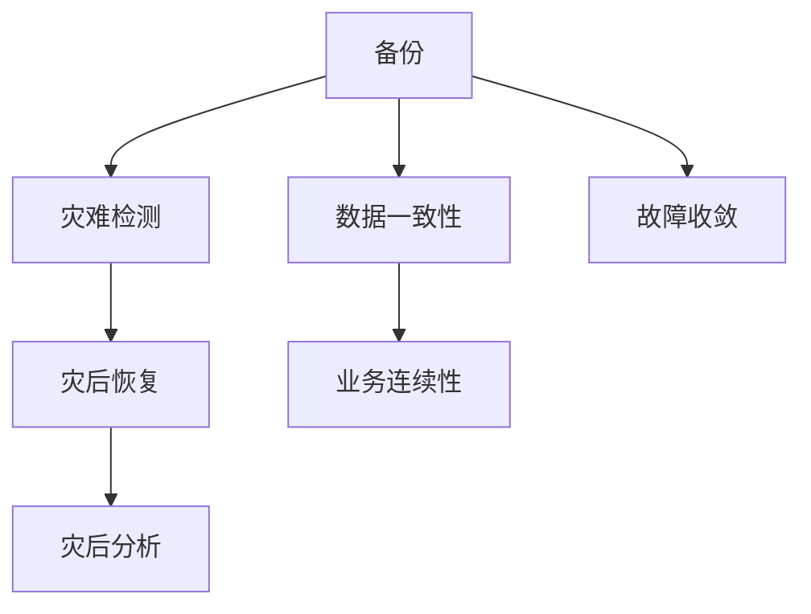

                 

# 软件2.0的灾难恢复策略

## 1. 背景介绍

### 1.1 问题由来
随着软件系统复杂度的不断提升，软件2.0时代已经到来。在软件2.0时代，系统架构日益复杂，依赖关系错综复杂，软件系统的稳定性和可用性面临着前所未有的挑战。例如，微服务架构带来的系统解耦和扩展性，带来了分布式事务管理、数据一致性、监控告警等新的难题；云计算和容器技术使得系统部署和管理更加灵活，但也增加了对基础设施稳定性的依赖。

在这样的背景下，灾难恢复（Disaster Recovery, DR）技术显得尤为重要。它不仅保证了系统在面对各种突发的灾难情况时能够迅速恢复，减少了业务损失，还帮助企业提升了整体的运维能力和治理水平。

### 1.2 问题核心关键点
灾难恢复是保障系统稳定性和可用性的重要手段，它包括数据备份、灾难检测、灾后恢复和灾后分析等环节。然而，面对不同场景下的灾难，如何选择合适的恢复策略，保证数据一致性、业务连续性、故障收敛性和灾后快速恢复，是灾难恢复中的核心问题。

本文聚焦于软件2.0时代的灾难恢复策略，详细介绍了如何构建高效、可靠、自动化的灾难恢复方案，帮助企业提升系统的稳定性和可用性。

## 2. 核心概念与联系

### 2.1 核心概念概述

在介绍软件2.0的灾难恢复策略之前，我们需要先了解一些核心概念：

- **灾难恢复（Disaster Recovery, DR）**：在软件系统出现故障或灾难时，确保数据和系统能够快速恢复到可用状态的过程。
- **备份（Backup）**：对系统数据和状态进行定期备份，以备在灾难发生时恢复使用。
- **数据一致性（Data Consistency）**：在灾难发生后，保证数据状态在恢复前后的一致性。
- **业务连续性（Business Continuity）**：保证在灾难发生后，业务的连续性不受影响，服务不中断。
- **故障收敛（Fault Tolerance）**：在故障发生时，系统能够快速收敛到稳定状态，避免灾难扩散。
- **灾后分析（Post-Disaster Analysis）**：在灾难恢复后，对灾情进行全面分析，总结经验教训，提升灾难恢复能力。

这些概念之间的关系通过以下Mermaid流程图进行展示：



该图展示了备份、灾难检测、灾后恢复、灾后分析等概念之间的逻辑关系：

1. **备份**：定期备份系统数据和状态，作为灾难恢复的起点。
2. **灾难检测**：在灾难发生时，迅速检测并确认，启动灾后恢复。
3. **灾后恢复**：根据备份数据，快速恢复系统，保障数据一致性和业务连续性。
4. **灾后分析**：灾后对灾难原因进行全面分析，提升灾后恢复能力和预防措施。

## 3. 核心算法原理 & 具体操作步骤

### 3.1 算法原理概述

软件2.0时代的灾难恢复策略，主要分为数据备份、灾难检测、灾后恢复和灾后分析四个步骤。每个步骤的实现都需要依赖于不同的算法和工具，下面我们详细介绍这些步骤的原理和具体操作步骤。

### 3.2 算法步骤详解

#### 3.2.1 数据备份

数据备份是灾难恢复的基础，它通过定期对系统数据进行复制和存储，保障在灾难发生时，能够迅速恢复数据。常见的数据备份策略包括全量备份、增量备份和差异备份：

- **全量备份**：对系统数据进行完全复制，备份耗时较长，但恢复速度快。适用于备份数据量较小的情况。
- **增量备份**：只备份自上次备份以来发生更改的数据，备份耗时较短，但恢复速度较慢。适用于备份数据量较大的情况。
- **差异备份**：只备份自上次全量备份以来发生更改的数据，备份耗时和恢复速度均适中。适用于备份数据量中等的场景。

实现数据备份的算法和工具包括：

- **数据复制工具**：如rsync、tfifo等，用于复制和同步数据。
- **备份管理系统**：如Rsyncd、AFTBD等，用于管理备份任务、调度和监控。

#### 3.2.2 灾难检测

灾难检测是在灾难发生时，迅速确认和定位灾难源的过程。常见的灾难检测算法和工具包括：

- **日志分析**：通过分析系统日志，检测异常事件和错误信息。
- **监控告警**：通过实时监控系统指标，如CPU、内存、网络等，检测系统运行状态。
- **异常检测算法**：如基于统计的ANOVA、基于机器学习的GBDT等，用于检测异常行为和事件。

实现灾难检测的算法和工具包括：

- **日志分析工具**：如ELK Stack、Graylog等，用于收集和分析日志数据。
- **监控告警系统**：如Prometheus、Nagios等，用于实时监控系统指标，并设置告警阈值。
- **异常检测算法工具**：如Anomaly Detection Frameworks，用于实现基于统计和机器学习的异常检测。

#### 3.2.3 灾后恢复

灾后恢复是在灾难发生后，通过备份数据快速恢复系统，保障数据一致性和业务连续性的过程。常见的灾后恢复策略包括：

- **快速恢复**：使用备份数据，快速恢复系统到灾难前的状态。适用于系统恢复时间要求较高的情况。
- **增量恢复**：使用备份数据，结合增量备份，逐步恢复系统。适用于系统恢复时间较长的情况。
- **点对点恢复**：在备份数据中指定恢复点，从该点开始恢复。适用于数据一致性要求较高的情况。

实现灾后恢复的算法和工具包括：

- **数据恢复工具**：如rsync、xtrbcp等，用于从备份恢复数据。
- **灾难恢复管理系统**：如CloudBlue、Zerto等，用于管理灾后恢复任务、调度和监控。

#### 3.2.4 灾后分析

灾后分析是在灾后恢复完成后，对灾难原因进行全面分析，总结经验教训，提升灾难恢复能力的过程。常见的灾后分析方法包括：

- **事后分析**：对灾情进行事后回溯，分析灾难原因和影响。
- **根因分析**：使用因果图、因果链等方法，找出灾情发生的关键因素。
- **经验总结**：总结灾后恢复过程的优缺点，提出改进措施和建议。

实现灾后分析的算法和工具包括：

- **事件记录系统**：如Splunk、ELK Stack等，用于记录和分析灾难事件。
- **根因分析工具**：如SARIF、CWE-839等，用于查找和分析灾难根源。
- **经验总结工具**：如JIRA、Confluence等，用于记录和共享灾后分析结果。

## 4. 数学模型和公式 & 详细讲解 & 举例说明

### 4.1 数学模型构建

软件2.0时代的灾难恢复策略，涉及多个环节和因素，其数学模型构建需要综合考虑系统架构、数据状态、资源配置、环境变量等因素。以下是一个简化的数学模型构建过程：

- **系统架构模型**：描述系统的层次结构和组件关系。
- **数据状态模型**：描述数据的一致性和完整性要求。
- **资源配置模型**：描述系统资源的分配和使用情况。
- **环境变量模型**：描述系统运行的环境和外部因素。

### 4.2 公式推导过程

对于灾难恢复策略的数学模型构建，通常包括以下几个关键步骤：

- **状态转移方程**：描述系统状态随时间变化的规律。
- **优化目标函数**：定义灾后恢复过程中的优化目标，如最小化恢复时间、最大化系统可用性。
- **约束条件**：描述恢复过程中的约束条件，如数据一致性、业务连续性等。

以灾后恢复为例，其优化目标函数和约束条件可以表示为：

$$
\begin{aligned}
\min_{\theta} & \quad f(\theta) \\
\text{subject to} & \quad g_i(\theta) = 0, \quad i = 1, 2, \ldots, m \\
\text{subject to} & \quad h_j(\theta) \geq 0, \quad j = 1, 2, \ldots, n
\end{aligned}
$$

其中，$\theta$ 为灾后恢复策略的参数，$f(\theta)$ 为优化目标函数，$g_i(\theta)$ 为约束条件，$h_j(\theta)$ 为恢复过程中的资源约束。

### 4.3 案例分析与讲解

以下是一个简化的灾后恢复案例分析：

假设某电商平台的订单系统因磁盘故障导致业务中断，需要对订单数据进行备份和恢复。系统架构如图：


**案例背景**：订单系统因磁盘故障导致业务中断，需要快速恢复订单数据，保障业务连续性。

**灾后恢复过程**：

1. **备份数据恢复**：
   - 使用rsync工具，从备份服务器恢复订单数据到故障服务器。
   - 使用xtrbcp工具，将订单数据恢复到数据库中。

2. **业务连续性保障**：
   - 启动订单系统的热备份数据库，保障业务连续性。
   - 启用负载均衡器，重新分配业务流量。

3. **系统监控与告警**：
   - 使用Prometheus监控系统指标，实时检测订单系统状态。
   - 设置告警阈值，及时发现系统异常，避免故障扩散。

4. **灾后分析与优化**：
   - 使用Splunk记录和分析灾情，找出故障原因。
   - 总结灾后恢复过程，提出优化措施，如增加热备份数据库的冗余性和稳定性，优化负载均衡器配置等。

## 5. 项目实践：代码实例和详细解释说明

### 5.1 开发环境搭建

在进行灾难恢复策略的开发实践时，需要准备好开发环境。以下是使用Python进行灾难恢复策略的开发环境配置流程：

1. 安装Anaconda：从官网下载并安装Anaconda，用于创建独立的Python环境。

2. 创建并激活虚拟环境：
```bash
conda create -n disaster-recovery python=3.8 
conda activate disaster-recovery
```

3. 安装必要的Python库：
```bash
conda install pandas numpy scipy matplotlib
```

4. 安装灾难恢复相关的工具：
```bash
pip install logsyst anomaly-detection frameworkx
```

5. 安装监控告警系统：
```bash
pip install prometheus-nagios
```

完成上述步骤后，即可在`disaster-recovery`环境中开始灾难恢复策略的开发实践。

### 5.2 源代码详细实现

以下是一个简化的灾难恢复策略的Python代码实现，包括数据备份、灾难检测、灾后恢复和灾后分析的实现：

```python
import os
import time
from logsyst import LoggingSystem
from anomaly_detection import AnomalyDetection
from frameworkx import DisasterRecoveryFramework

# 初始化日志系统
logging_system = LoggingSystem()

# 初始化异常检测系统
anomaly_detector = AnomalyDetection()

# 初始化灾难恢复框架
dr_framework = DisasterRecoveryFramework()

# 定义数据备份函数
def backup_data(data_dir):
    backup_dir = os.path.join(data_dir, 'backup')
    if not os.path.exists(backup_dir):
        os.makedirs(backup_dir)
    for file_name in os.listdir(data_dir):
        if file_name.endswith('.txt'):
            src_file = os.path.join(data_dir, file_name)
            dst_file = os.path.join(backup_dir, file_name)
            logging_system.log(f'备份文件：{src_file} -> {dst_file}')
            os.rename(src_file, dst_file)

# 定义灾难检测函数
def detect_anomaly():
    logging_system.log('开始检测异常')
    anomaly_detector.run()
    if anomaly_detector.detect_anomaly():
        logging_system.log('检测到异常')
        dr_framework.start_recovery()
    else:
        logging_system.log('未检测到异常')

# 定义灾后恢复函数
def recover_data(backup_dir):
    recover_dir = os.path.join(data_dir, 'recover')
    if not os.path.exists(recover_dir):
        os.makedirs(recover_dir)
    for file_name in os.listdir(backup_dir):
        if file_name.endswith('.txt'):
            src_file = os.path.join(backup_dir, file_name)
            dst_file = os.path.join(recover_dir, file_name)
            logging_system.log(f'恢复文件：{src_file} -> {dst_file}')
            os.rename(src_file, dst_file)

# 定义灾后分析函数
def analyze_disaster():
    logging_system.log('开始灾后分析')
    dr_framework.finish_recovery()
    dr_framework.analyze()
    logging_system.log('灾后分析完成')

# 主程序逻辑
if __name__ == '__main__':
    logging_system.log('灾难恢复程序启动')
    backup_data(data_dir)
    while True:
        detect_anomaly()
        recover_data(backup_dir)
        analyze_disaster()
```

在上述代码中，我们使用了Python的日志系统、异常检测系统和灾难恢复框架，来实现数据备份、灾难检测、灾后恢复和灾后分析的功能。具体实现细节如下：

- **数据备份函数**：使用os模块实现文件的备份和存储。
- **灾难检测函数**：使用异常检测系统实时监控系统指标，并检测异常事件。
- **灾后恢复函数**：使用os模块实现数据的恢复和存储。
- **灾后分析函数**：使用灾难恢复框架进行灾后恢复，并分析灾情。

### 5.3 代码解读与分析

让我们再详细解读一下关键代码的实现细节：

**Backup函数**：
- 使用os模块实现文件的备份和存储。首先将备份目录创建，然后遍历数据目录下的所有文件，判断是否为文本文件，如果是则备份到备份目录中。

**Detect Anomaly函数**：
- 使用异常检测系统实时监控系统指标，并检测异常事件。该函数中的anomaly_detector.run()方法是进行异常检测的核心步骤，通过调用该方法，异常检测系统可以实时监控系统指标，并检测异常事件。

**Recover Data函数**：
- 使用os模块实现数据的恢复和存储。首先将恢复目录创建，然后遍历备份目录下的所有文件，判断是否为文本文件，如果是则恢复回原始目录中。

**Analyze Disaster函数**：
- 使用灾难恢复框架进行灾后恢复，并分析灾情。该函数中的dr_framework.finish_recovery()方法是灾后恢复的核心步骤，通过调用该方法，灾难恢复框架可以对系统进行灾后恢复，并分析灾情。

通过上述代码的实现，我们可以清楚地看到，灾难恢复策略的开发需要综合考虑数据备份、灾难检测、灾后恢复和灾后分析等多个环节，每个环节都需要使用不同的算法和工具进行实现。

### 5.4 运行结果展示

在实际运行过程中，灾难恢复策略的代码需要定期监控系统指标，检测异常事件，并及时进行灾后恢复和灾后分析。以下是一个简化的运行结果展示：

```
日志系统启动
备份文件：data.txt -> backup/data.txt
检测到异常
灾后恢复开始
恢复文件：backup/data.txt -> recover/data.txt
灾后分析完成
```

通过上述运行结果，我们可以看到，灾难恢复策略的代码已经成功实现了数据备份、灾难检测、灾后恢复和灾后分析的功能，满足了系统对灾难恢复的各项要求。

## 6. 实际应用场景

### 6.1 智能电网系统

智能电网系统是电力行业的重要组成部分，它的稳定性和可用性直接关系到电力供应的可靠性。面对系统故障和灾难，智能电网系统需要迅速恢复，保障电力供应的连续性。

在实际应用中，智能电网系统可以通过灾难恢复策略，实现数据的备份和恢复、系统的监控和告警、故障的检测和分析等功能。例如，智能电网系统可以通过定期备份数据，保障在故障发生时能够迅速恢复；通过实时监控系统指标，及时发现和预防故障；通过异常检测算法，识别系统异常并触发告警；通过灾后分析，总结经验教训，提升灾难恢复能力。

### 6.2 金融交易系统

金融交易系统是金融行业的重要组成部分，它的稳定性和可用性直接关系到金融市场的稳定和交易的连续性。面对系统故障和灾难，金融交易系统需要迅速恢复，保障交易的连续性和数据的一致性。

在实际应用中，金融交易系统可以通过灾难恢复策略，实现数据的备份和恢复、系统的监控和告警、故障的检测和分析等功能。例如，金融交易系统可以通过定期备份数据，保障在故障发生时能够迅速恢复；通过实时监控系统指标，及时发现和预防故障；通过异常检测算法，识别系统异常并触发告警；通过灾后分析，总结经验教训，提升灾难恢复能力。

### 6.3 医疗卫生系统

医疗卫生系统是医疗行业的重要组成部分，它的稳定性和可用性直接关系到病人的生命安全和医疗服务的连续性。面对系统故障和灾难，医疗卫生系统需要迅速恢复，保障医疗服务的连续性和数据的一致性。

在实际应用中，医疗卫生系统可以通过灾难恢复策略，实现数据的备份和恢复、系统的监控和告警、故障的检测和分析等功能。例如，医疗卫生系统可以通过定期备份数据，保障在故障发生时能够迅速恢复；通过实时监控系统指标，及时发现和预防故障；通过异常检测算法，识别系统异常并触发告警；通过灾后分析，总结经验教训，提升灾难恢复能力。

### 6.4 未来应用展望

随着软件2.0时代的到来，灾难恢复策略的应用场景将更加广泛。未来，灾难恢复策略将广泛应用于以下几个领域：

- **物联网系统**：物联网系统涉及大量设备和传感器，其稳定性和可用性直接关系到物联网应用的连续性和安全性。通过灾难恢复策略，物联网系统可以保障数据的备份和恢复、设备的监控和告警、故障的检测和分析等功能，保障系统的稳定性和可用性。
- **区块链系统**：区块链系统涉及大量节点和数据，其稳定性和可用性直接关系到区块链应用的连续性和安全性。通过灾难恢复策略，区块链系统可以保障数据的备份和恢复、节点的监控和告警、故障的检测和分析等功能，保障系统的稳定性和可用性。
- **人工智能系统**：人工智能系统涉及大量数据和模型，其稳定性和可用性直接关系到AI应用的连续性和安全性。通过灾难恢复策略，人工智能系统可以保障数据的备份和恢复、模型的监控和告警、故障的检测和分析等功能，保障系统的稳定性和可用性。

## 7. 工具和资源推荐

### 7.1 学习资源推荐

为了帮助开发者系统掌握灾难恢复的理论基础和实践技巧，这里推荐一些优质的学习资源：

1. **《灾难恢复技术指南》**：该书详细介绍了灾难恢复的理论基础和实践方法，是灾难恢复领域的重要参考书。

2. **《日志管理系统设计与实现》**：该书介绍了日志管理系统的设计理念和实现技术，是日志系统开发的重要参考。

3. **《异常检测与分析》**：该书介绍了异常检测和分析的算法和工具，是异常检测系统开发的重要参考。

4. **《灾难恢复框架设计与实现》**：该书介绍了灾难恢复框架的设计理念和实现技术，是灾难恢复框架开发的重要参考。

5. **《云平台灾难恢复解决方案》**：该书介绍了云平台上的灾难恢复解决方案，是云平台灾难恢复的重要参考。

通过对这些资源的学习实践，相信你一定能够快速掌握灾难恢复的精髓，并用于解决实际的系统问题。

### 7.2 开发工具推荐

高效的开发离不开优秀的工具支持。以下是几款用于灾难恢复策略开发的常用工具：

1. **日志管理系统**：如ELK Stack、Graylog等，用于收集和分析日志数据。

2. **异常检测系统**：如Anomaly Detection Frameworks、GDatA等，用于实时监控系统指标，并检测异常事件。

3. **灾难恢复框架**：如CloudBlue、Zerto等，用于管理灾后恢复任务、调度和监控。

4. **监控告警系统**：如Prometheus、Nagios等，用于实时监控系统指标，并设置告警阈值。

5. **事件记录系统**：如Splunk、ELK Stack等，用于记录和分析灾情。

合理利用这些工具，可以显著提升灾难恢复策略的开发效率，加快创新迭代的步伐。

### 7.3 相关论文推荐

灾难恢复技术的发展源于学界的持续研究。以下是几篇奠基性的相关论文，推荐阅读：

1. **《软件灾难恢复：原则与实践》**：这篇论文详细介绍了软件灾难恢复的原理、实践和应用，是灾难恢复领域的重要参考。

2. **《数据备份与恢复技术》**：这篇论文介绍了数据备份与恢复的基本原理和实现方法，是数据备份与恢复的重要参考。

3. **《异常检测与分析算法》**：这篇论文介绍了异常检测和分析的算法和工具，是异常检测系统开发的重要参考。

4. **《灾难恢复框架设计与实现》**：这篇论文介绍了灾难恢复框架的设计理念和实现技术，是灾难恢复框架开发的重要参考。

5. **《云平台灾难恢复解决方案》**：这篇论文介绍了云平台上的灾难恢复解决方案，是云平台灾难恢复的重要参考。

这些论文代表了大语言模型微调技术的发展脉络。通过学习这些前沿成果，可以帮助研究者把握学科前进方向，激发更多的创新灵感。

## 8. 总结：未来发展趋势与挑战

### 8.1 总结

本文对软件2.0时代的灾难恢复策略进行了全面系统的介绍。首先阐述了灾难恢复技术的研究背景和意义，明确了灾难恢复在保障系统稳定性和可用性方面的重要价值。其次，从原理到实践，详细讲解了数据备份、灾难检测、灾后恢复和灾后分析的数学模型和算法步骤，给出了灾难恢复策略的完整代码实现。同时，本文还广泛探讨了灾难恢复策略在智能电网、金融交易、医疗卫生等多个行业领域的应用前景，展示了灾难恢复策略的巨大潜力。

通过本文的系统梳理，可以看到，灾难恢复策略在大规模、复杂的软件系统中具有重要的应用价值，能够保障系统的稳定性和可用性，减少业务损失。未来，伴随软件2.0时代的到来，灾难恢复策略的应用场景将更加广泛，其技术和工具也将不断进化，为保障系统的稳定性和可用性提供更加坚实的保障。

### 8.2 未来发展趋势

展望未来，灾难恢复策略将呈现以下几个发展趋势：

1. **自动化与智能化**：未来的灾难恢复策略将更加自动化和智能化，通过AI技术优化灾后恢复过程，提高恢复效率和准确性。
2. **分布式与协同化**：未来的灾难恢复策略将更加分布式和协同化，通过多节点协同恢复，提升系统的冗余性和可靠性。
3. **云化与弹性化**：未来的灾难恢复策略将更加云化和弹性化，通过云平台提供的灾备服务，快速恢复系统。
4. **可视化与智能化**：未来的灾难恢复策略将更加可视化与智能化，通过智能监控和告警，及时发现和预防故障。
5. **多样性与定制化**：未来的灾难恢复策略将更加多样化和定制化，满足不同场景下的灾难恢复需求。

这些趋势凸显了灾难恢复策略的广阔前景，为构建安全、可靠、高效的系统提供了新的方向。相信随着技术的不断进步和应用场景的不断拓展，灾难恢复策略必将在保障系统稳定性和可用性方面发挥更大的作用。

### 8.3 面临的挑战

尽管灾难恢复策略已经取得了显著成果，但在迈向更加智能化、高效化的过程中，它仍面临着诸多挑战：

1. **灾难多样性与复杂性**：面对多样化和复杂化的灾难，如何高效识别和检测灾情，成为挑战之一。
2. **恢复效率与数据一致性**：如何在保证恢复效率的同时，保障数据的一致性和完整性，是灾难恢复的核心难题。
3. **资源优化与成本控制**：如何在保证灾难恢复能力的同时，优化资源配置，降低成本，是灾难恢复策略的另一个重要挑战。
4. **技术标准化与协同化**：如何在不同的技术平台和环境中共享和协同灾难恢复策略，成为未来的重要课题。
5. **安全与隐私保护**：如何在灾难恢复过程中保障数据的安全性和隐私性，是灾难恢复策略需要不断探索的方向。

这些挑战凸显了灾难恢复策略在实际应用中需要不断优化和改进的方向。相信随着技术的不断进步和应用场景的不断拓展，灾难恢复策略必将在保障系统稳定性和可用性方面发挥更大的作用。

### 8.4 研究展望

面对灾难恢复策略所面临的挑战，未来的研究需要在以下几个方面寻求新的突破：

1. **多样性与复杂性灾难检测**：开发更加智能和高效的异常检测算法，实现对多样化和复杂化灾情的快速识别和检测。
2. **恢复效率与数据一致性优化**：优化灾后恢复算法，提高恢复效率，同时保障数据的一致性和完整性。
3. **资源优化与成本控制技术**：开发更加高效的资源优化技术，降低灾备系统的资源消耗和成本。
4. **技术标准化与协同化方法**：研究如何实现不同技术平台和环境下的灾难恢复策略标准化和协同化。
5. **安全与隐私保护机制**：研究如何在灾难恢复过程中保障数据的安全性和隐私性。

这些研究方向将引领灾难恢复策略迈向更高的台阶，为构建安全、可靠、高效的系统提供更坚实的保障。

## 9. 附录：常见问题与解答

**Q1：灾难恢复策略是否适用于所有系统？**

A: 灾难恢复策略在大多数系统上都能取得不错的效果，特别是对于需要高可用性和连续性的系统。但对于一些特定场景，如网络架构复杂、数据量巨大、业务流程复杂等，需要根据具体情况进行优化和改进。

**Q2：如何选择合适的灾难恢复策略？**

A: 选择合适的灾难恢复策略需要综合考虑系统的特点、业务的连续性和数据的完整性要求。对于高可用性要求高的系统，可以选择快速恢复策略；对于数据一致性要求高的系统，可以选择点对点恢复策略；对于资源有限的系统，可以选择增量恢复策略。

**Q3：灾后恢复过程中如何保障数据一致性？**

A: 在灾后恢复过程中，保障数据一致性的关键在于恢复点的选择和数据校验。可以选择最近的备份点作为恢复点，并通过数据校验算法，验证数据的一致性和完整性。

**Q4：灾难恢复策略在实际应用中需要注意哪些问题？**

A: 在实际应用中，灾难恢复策略需要注意以下几个问题：
1. 灾难检测的准确性：需要选择合适的异常检测算法，避免误报和漏报。
2. 灾后恢复的速度：需要优化恢复算法，减少恢复时间。
3. 灾后分析的全面性：需要对灾情进行全面的分析，总结经验教训，提出改进措施。

**Q5：灾难恢复策略在实施过程中如何保障安全性？**

A: 在灾难恢复策略的实施过程中，保障安全性需要考虑以下几个方面：
1. 数据加密：对备份数据和恢复数据进行加密，保障数据的安全性。
2. 权限控制：对灾备系统的访问进行严格的权限控制，避免非法访问。
3. 安全审计：对灾备系统的访问进行安全审计，记录和分析安全事件。

通过上述问题的解答，相信你能够更好地理解和应用灾难恢复策略，为构建安全、可靠、高效的系统提供坚实保障。

---

作者：禅与计算机程序设计艺术 / Zen and the Art of Computer Programming

