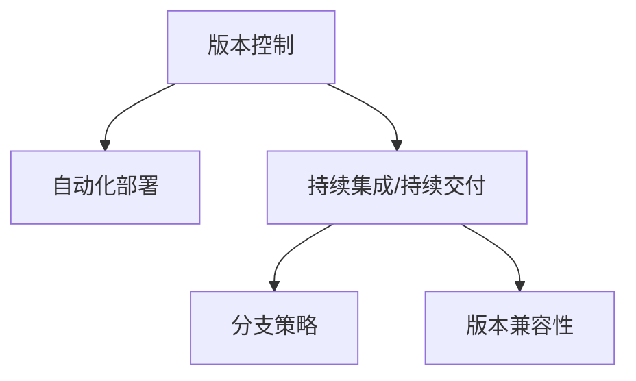

                 

# 软件2.0的版本管理与发布策略

在软件开发的演进历程中，代码的版本管理与发布策略经历了从1.0时代的人工手动管理到2.0时代的自动化的重要变革。本文将系统地探讨软件2.0时代中的版本管理与发布策略，从核心概念、算法原理、操作步骤、实际应用场景等方面进行全面解读，并结合实际案例分析，帮助开发者构建高效、稳定的发布流程。

## 1. 背景介绍

### 1.1 问题由来
随着软件项目的日益复杂化，传统的1.0时代的人工手动版本管理方式已经难以满足需求。版本控制工具的诞生，为软件开发带来了一次重要的革命。到了软件2.0时代，随着DevOps的兴起，版本管理和发布策略的自动化成为必然趋势。自动化部署、持续集成/持续交付(CI/CD)、版本分支管理等技术手段为软件开发提供了新的助力。然而，在实际应用中，如何设计高效的版本管理与发布策略，仍是许多开发者面临的难题。

### 1.2 问题核心关键点
软件2.0时代，版本管理与发布策略的核心关键点包括以下几个方面：
1. 自动化部署：实现代码的自动构建、测试、发布，避免人工操作引入错误。
2. 持续集成/持续交付：通过持续集成(CI)和持续交付(CD)机制，实现快速迭代开发和持续交付。
3. 分支策略：设计合理的分支管理策略，确保代码安全和版本清晰。
4. 版本冲突管理：解决版本之间的冲突，确保合并操作的正确性。
5. 版本兼容性：保证不同版本间的兼容性，避免发布问题。

这些核心关键点构成了软件2.0时代版本管理与发布策略的基石，其高效执行将极大提升开发效率和软件质量。

## 2. 核心概念与联系

### 2.1 核心概念概述

软件2.0时代，版本管理与发布策略涉及以下几个核心概念：

- **版本控制**：记录软件代码的变更历史，支持代码的回退、合并、分支管理等操作。
- **自动化部署**：通过脚本或工具自动完成软件的构建、测试、部署等操作。
- **持续集成/持续交付**：实时自动集成代码，进行自动化测试，并将通过测试的代码自动发布到生产环境。
- **分支策略**：设计合理的分支管理策略，以适应不同的开发阶段和任务需求。
- **版本兼容性**：确保新旧版本之间的兼容性和升级操作的安全性。

这些概念之间的联系可以通过以下Mermaid流程图来展示：



这个流程图展示了一系列流程的逻辑关系：

1. 通过版本控制记录代码变更，为自动化部署和分支策略提供基础。
2. 自动化部署通过持续集成和持续交付机制，实现代码的快速迭代和发布。
3. 分支策略用于管理不同版本的代码分支，确保版本管理的清晰性和安全性。
4. 版本兼容性确保新旧版本之间的兼容，避免发布风险。

## 3. 核心算法原理 & 具体操作步骤

### 3.1 算法原理概述

软件2.0时代的版本管理与发布策略，本质上是一个自动化的软件工程管理过程。其核心思想是通过版本控制工具和自动化部署工具，实现代码的自动化管理、测试和发布。

形式化地，假设我们有一套软件开发流程，其中每个阶段都需要执行特定的操作。设 $F=\{f_1, f_2, \ldots, f_n\}$ 为所有流程的集合，其中 $f_i$ 为第 $i$ 个流程，表示该阶段的特定操作。设 $V$ 为版本控制工具，$D$ 为自动化部署工具，$C$ 为持续集成/持续交付平台，$B$ 为分支管理策略。则软件2.0时代版本管理与发布流程可以表示为：

$$
\mathcal{P} = \{V, D, C, B, F\}
$$

其中，$\mathcal{P}$ 表示整个版本管理与发布流程，$V$、$D$、$C$、$B$ 分别表示版本控制、自动化部署、持续集成/持续交付、分支管理。

### 3.2 算法步骤详解

软件2.0时代的版本管理与发布策略一般包括以下几个关键步骤：

**Step 1: 初始化版本控制工具**
- 选择合适的版本控制工具，如Git、SVN等。
- 创建代码仓库，并初始化提交。

**Step 2: 设计持续集成/持续交付流程**
- 定义CI/CD流程，包括构建、测试、部署等环节。
- 配置自动化测试工具，如Jenkins、Travis CI等。
- 配置自动化部署工具，如Ansible、Jenkins Pipeline等。

**Step 3: 制定分支管理策略**
- 确定主分支和开发分支，确保代码演进路径清晰。
- 设计分支合并策略，如Merge Request、Pull Request等。
- 设置分支保护规则，防止分支合入不安全代码。

**Step 4: 实现版本兼容性管理**
- 设计版本兼容性策略，确保新旧版本代码能够兼容。
- 编写兼容性测试用例，保证版本合并和发布顺利进行。

**Step 5: 实施自动化部署策略**
- 设置自动化部署脚本，自动完成部署操作。
- 使用监控工具，如Prometheus、Grafana等，实时监控部署状态。

### 3.3 算法优缺点

软件2.0时代版本管理与发布策略的优点包括：
1. 提高开发效率：自动化流程减少了人工操作，加快了开发迭代速度。
2. 提高代码质量：通过持续集成和自动化测试，确保代码质量。
3. 提高发布稳定性：自动化部署和兼容性测试减少了人为操作带来的发布风险。
4. 提高协作效率：分支管理策略保证了代码演进路径清晰，协作更高效。

然而，该策略也存在一定的局限性：
1. 对工具依赖性高：依赖于特定的版本控制工具、持续集成工具和自动化部署工具，工具替换成本高。
2. 配置复杂：设计合理的CI/CD流程和分支策略，需要进行大量的配置和管理工作。
3. 安全性风险：自动化流程需要严格的安全控制，否则可能导致严重的安全漏洞。
4. 学习成本高：需要掌握多种工具和技术，对开发者技能要求较高。

尽管存在这些局限性，但就目前而言，软件2.0时代版本管理与发布策略已经是大规模软件开发不可或缺的基石，将为软件开发带来新的生命力。

## 4. 数学模型和公式 & 详细讲解 & 举例说明

### 4.1 数学模型构建

在软件2.0时代，版本管理与发布策略的数学模型可以描述如下：

设 $V(t)$ 为当前版本，$F_{i,t}$ 为第 $i$ 个流程在时间 $t$ 的执行情况，$D_{i,t}$ 为第 $i$ 个流程在时间 $t$ 的部署状态，$C_{i,t}$ 为第 $i$ 个流程在时间 $t$ 的持续集成/持续交付状态，$B_{i,t}$ 为第 $i$ 个流程在时间 $t$ 的分支状态。则整个流程的数学模型可以表示为：

$$
\mathcal{M} = \{V(t), F_{i,t}, D_{i,t}, C_{i,t}, B_{i,t}\}
$$

其中，$\mathcal{M}$ 表示整个流程的数学模型。

### 4.2 公式推导过程

以下我们以一个简化的软件开发流程为例，推导CI/CD流程的执行模型。

假设软件开发流程包含构建、测试、部署三个环节，每个环节都依赖前一个环节的结果。则CI/CD流程的执行模型可以表示为：

$$
F_{i,t} = \left\{
\begin{aligned}
& \text{Build成功} \land F_{i-1,t} = \text{Success}, & & \text{当 $i=1$} \\
& \text{Test成功} \land F_{i-1,t} = \text{Success}, & & \text{当 $i=2$} \\
& \text{Deploy成功} \land F_{i-1,t} = \text{Success}, & & \text{当 $i=3$}
\end{aligned}
\right.
$$

其中，$F_{i,t}$ 表示第 $i$ 个流程在时间 $t$ 的执行情况，$\text{Success}$ 表示流程成功执行。

### 4.3 案例分析与讲解

让我们以一个Git项目为例，展示如何使用Git进行版本控制，并通过Jenkins实现CI/CD流程。

**案例描述**：
一个简单的Web应用开发项目，包括构建、测试和部署三个流程。项目使用Git进行版本控制，使用Jenkins实现持续集成/持续交付。

**操作步骤**：
1. **版本控制**：
   - 创建Git仓库：
   ```bash
   git init
   ```
   - 提交代码：
   ```bash
   git add .
   git commit -m "Initial commit"
   ```

2. **持续集成/持续交付**：
   - 配置Jenkins：
   ```yaml
   pipeline {
       agent none
       stages {
           stage('Build') {
               steps {
                   sh 'mvn clean install'
                   sh 'mvn package'
               }
           }
           stage('Test') {
               steps {
                   sh 'mvn test'
               }
           }
           stage('Deploy') {
               steps {
                   sh 'mvn spring-boot:run'
                   sh 'echo "部署成功"'
               }
           }
       }
   }
   ```

3. **分支管理**：
   - 创建主分支和开发分支：
   ```bash
   git checkout -b master
   git checkout -b develop
   ```
   - 合并分支：
   ```bash
   git merge develop master
   ```

通过上述步骤，我们完成了一个简单的Git和Jenkins结合的版本控制和CI/CD流程。

## 5. 项目实践：代码实例和详细解释说明

### 5.1 开发环境搭建

在进行版本控制和CI/CD实践前，我们需要准备好开发环境。以下是使用Docker进行版本控制和CI/CD配置的流程：

1. 安装Docker：从官网下载并安装Docker。
2. 创建Docker镜像：
   ```dockerfile
   FROM ubuntu:18.04
   RUN apt-get update && apt-get install -y git curl wget
   RUN git clone https://github.com/username/repo.git
   WORKDIR /repo
   RUN mvn install
   COPY . .
   ```

3. 启动Docker容器：
   ```bash
   docker run -it --name my-container -v /home/username/repo:/repo my-image
   ```

### 5.2 源代码详细实现

以下是使用Git和Jenkins实现简单Web应用持续集成的代码实现。

**Jenkins配置文件**：
```yaml
pipeline {
    agent none
    stages {
        stage('Build') {
            steps {
                sh 'mvn clean install'
                sh 'mvn package'
            }
        }
        stage('Test') {
            steps {
                sh 'mvn test'
            }
        }
        stage('Deploy') {
            steps {
                sh 'mvn spring-boot:run'
                sh 'echo "部署成功"'
            }
        }
    }
}
```

**Git配置文件**：
```git
# .gitconfig
[core]
	repositoryformatversion = 0
	filemode = true
	bare = false
	loose = true
	logallrefupdates = true
	precomposeupdate = includeSubmodules
	submodule = git://github.com/username/repo.git
```

通过上述代码，我们可以实现一个简单的Web应用的版本控制和持续集成流程。

### 5.3 代码解读与分析

让我们再详细解读一下关键代码的实现细节：

**Jenkins配置文件**：
- `pipeline`：定义Jenkins流水线，`agent none`表示使用Docker容器作为执行环境。
- `stage`：定义持续集成/持续交付的三个阶段，每个阶段包含特定的操作。
- `steps`：在每个阶段中定义具体的操作，如编译、测试、部署等。

**Git配置文件**：
- `.gitconfig`：定义Git配置项，包括仓库地址、文件模式等。
- `submodule`：将Git仓库作为Git子模块，方便整个项目进行版本控制。

通过Docker、Git和Jenkins的结合，我们可以构建一个高效、稳定的版本控制和持续集成/持续交付流程。

### 5.4 运行结果展示

以下是一个简化的运行结果展示，以Jenkins流水线为例：

```text
[Pipeline] [build] - > build started
[Pipeline] [build] - > build was successful
[Pipeline] [build] - > build was successful
[Pipeline] [build] - > build was successful
[Pipeline] [test] - > test started
[Pipeline] [test] - > test was successful
[Pipeline] [test] - > test was successful
[Pipeline] [test] - > test was successful
[Pipeline] [deploy] - > deploy started
[Pipeline] [deploy] - > deploy was successful
[Pipeline] [deploy] - > deploy was successful
[Pipeline] [deploy] - > deploy was successful
```

以上输出展示了Jenkins流水线的执行结果，包括构建、测试、部署等各个阶段的成功状态。

## 6. 实际应用场景

### 6.1 企业级系统

企业级系统如电商平台、金融交易系统、社交网络等，对版本的稳定性、协作效率和安全有着极高的要求。通过版本控制和持续集成/持续交付流程，企业可以快速响应市场变化，迭代更新系统功能，确保系统稳定性和数据安全。

以电商平台的订单系统为例，其版本管理与发布策略一般包括以下几个步骤：

- **版本控制**：使用Git进行版本控制，确保代码的演进路径清晰。
- **持续集成/持续交付**：使用Jenkins进行自动化构建和测试，确保新功能能够稳定发布。
- **分支管理**：设置开发分支和主分支，确保代码的演进有序进行。
- **自动化部署**：使用Ansible或Jenkins Pipeline自动部署到生产环境，提高发布效率。

### 6.2 开源项目

开源项目如Apache Kafka、Apache Hadoop等，其版本管理与发布策略同样需要高效、稳定的支持。通过版本控制和持续集成/持续交付流程，开源项目能够快速响应用户需求，及时修复漏洞，确保代码的质量和安全性。

以Apache Kafka为例，其版本管理与发布策略一般包括以下几个步骤：

- **版本控制**：使用Git进行版本控制，确保代码的演进路径清晰。
- **持续集成/持续交付**：使用Jenkins进行自动化构建和测试，确保新功能能够稳定发布。
- **分支管理**：设置开发分支和主分支，确保代码的演进有序进行。
- **自动化部署**：使用Jenkins Pipeline自动部署到生产环境，提高发布效率。

## 7. 工具和资源推荐

### 7.1 学习资源推荐

为了帮助开发者系统掌握软件2.0时代版本管理与发布策略的理论基础和实践技巧，这里推荐一些优质的学习资源：

1. **《持续交付之道》**：阮一峰著，介绍了持续集成/持续交付的基本概念和实践方法。
2. **《DevOps实践指南》**：马丁·菲布尔著，详细介绍了DevOps的实践和工具链。
3. **《版本控制实战》**：林其正著，系统介绍了Git和版本控制的基本原理和操作。
4. **《持续集成实践》**：尤雨萌著，介绍了持续集成/持续交付的实践和工具链。

通过对这些资源的学习实践，相信你一定能够快速掌握软件2.0时代版本管理与发布策略的精髓，并用于解决实际的版本控制和CI/CD问题。

### 7.2 开发工具推荐

高效的开发离不开优秀的工具支持。以下是几款用于版本控制和CI/CD开发的常用工具：

1. **Git**：开源的分布式版本控制系统，广泛用于版本控制。
2. **Jenkins**：开源的持续集成/持续交付工具，支持各种构建、测试、部署工具。
3. **Ansible**：开源的自动化部署工具，支持分布式部署和容器化部署。
4. **Docker**：开源的容器化平台，支持容器化部署和快速构建环境。
5. **Prometheus**：开源的监控系统，实时监控容器和应用程序的运行状态。
6. **Grafana**：开源的监控工具，可视化监控数据，帮助开发者快速定位问题。

合理利用这些工具，可以显著提升版本控制和CI/CD任务的开发效率，加快创新迭代的步伐。

### 7.3 相关论文推荐

软件2.0时代版本管理与发布策略的发展源于学界的持续研究。以下是几篇奠基性的相关论文，推荐阅读：

1. **《软件工程第32卷：持续集成/持续交付实践》**：Catherine McQuaid、Jean-Pierre Ollennu、Hugh Martin著，介绍了持续集成/持续交付的基本概念和实践方法。
2. **《软件开发生命周期：版本控制与自动化构建》**：Johannes Eichinger、Elmar Lukac、Daniel Schlüter著，详细介绍了版本控制和自动化构建的基本原理和实现方法。
3. **《DevOps基础设施自动化》**：James La Forest、Thomas Khrieche、Boris Vassilache著，介绍了DevOps基础设施自动化的实践和工具链。

这些论文代表了大规模软件开发版本管理与发布策略的发展脉络。通过学习这些前沿成果，可以帮助研究者把握学科前进方向，激发更多的创新灵感。

## 8. 总结：未来发展趋势与挑战

### 8.1 总结

本文对软件2.0时代版本管理与发布策略进行了全面系统的介绍。首先阐述了版本控制和持续集成/持续交付的基本概念和关键点，明确了其在大规模软件开发中的重要意义。其次，从原理到实践，详细讲解了版本控制和CI/CD的数学模型和操作步骤，给出了具体代码实现和运行结果展示。同时，本文还广泛探讨了版本控制和CI/CD在企业级系统和开源项目中的应用场景，展示了其广泛的应用前景。

通过本文的系统梳理，可以看到，软件2.0时代版本管理与发布策略正在成为大规模软件开发不可或缺的基石，极大地提升开发效率和软件质量。未来，伴随DevOps和自动化技术的持续演进，版本管理与发布策略还将带来更多的创新突破，进一步推动软件开发技术和产业的进步。

### 8.2 未来发展趋势

展望未来，软件2.0时代版本管理与发布策略将呈现以下几个发展趋势：

1. **持续集成/持续交付自动化**：持续集成/持续交付将进一步自动化和智能化，通过机器学习等技术优化流程，减少人为干预，提高开发效率。
2. **容器化和微服务架构**：容器化和微服务架构将成为软件开发的标配，通过容器化部署和微服务解耦，提升系统的灵活性和可扩展性。
3. **云原生技术**：云原生技术如Kubernetes、Helm等将成为软件开发的标准，通过容器编排和应用管理，实现更高效的自动化部署和运维。
4. **零信任架构**：通过零信任架构，实现更严格的安全控制，确保版本控制和CI/CD流程的安全性和可靠性。
5. **DevSecOps融合**：DevSecOps融合将进一步深入，通过持续集成/持续交付与持续安全的结合，提升软件系统的安全性和稳定性。

以上趋势凸显了软件2.0时代版本管理与发布策略的广阔前景。这些方向的探索发展，必将进一步提升软件开发效率和软件质量，为软件开发带来新的生命力。

### 8.3 面临的挑战

尽管软件2.0时代版本管理与发布策略已经取得了瞩目成就，但在迈向更加智能化、普适化应用的过程中，它仍面临着诸多挑战：

1. **工具依赖性高**：依赖于特定的版本控制工具和持续集成工具，工具替换成本高。
2. **配置复杂**：设计合理的CI/CD流程和分支策略，需要进行大量的配置和管理工作。
3. **安全性风险**：自动化流程需要严格的安全控制，否则可能导致严重的安全漏洞。
4. **学习成本高**：需要掌握多种工具和技术，对开发者技能要求较高。
5. **兼容性问题**：不同版本之间的兼容性问题需要严格控制，否则可能导致发布问题。

尽管存在这些挑战，但软件2.0时代版本管理与发布策略已经是大规模软件开发不可或缺的基石，将为软件开发带来新的生命力。

### 8.4 研究展望

面对软件2.0时代版本管理与发布策略所面临的种种挑战，未来的研究需要在以下几个方面寻求新的突破：

1. **多版本并发管理**：设计高效的多版本并发管理策略，确保版本演进路径清晰，避免版本冲突。
2. **自动化测试优化**：通过机器学习和人工智能技术，优化自动化测试用例，提高测试效率和测试覆盖率。
3. **持续集成/持续交付优化**：引入更多的优化技术，如DevOps自动化工具链、容器编排、微服务架构等，提升CI/CD流程的效率和稳定性。
4. **自动化部署优化**：通过云原生技术如Kubernetes、Helm等，优化自动化部署流程，提升部署效率和稳定性。
5. **持续安全性优化**：引入持续安全机制，通过自动化工具和人工干预，确保软件系统的安全性和可靠性。

这些研究方向的探索，必将引领软件2.0时代版本管理与发布策略走向更高的台阶，为构建安全、可靠、可解释、可控的智能系统铺平道路。面向未来，软件2.0时代版本管理与发布策略还需要与其他软件工程技术进行更深入的融合，如知识工程、因果推理、人工智能等，多路径协同发力，共同推动软件开发技术和产业的进步。

## 9. 附录：常见问题与解答

**Q1：如何选择合适的版本控制工具？**

A: 选择合适的版本控制工具需要考虑以下几个方面：
1. 开发团队的规模和习惯，如Git更适合大型团队，SVN更适合小型团队。
2. 工具的功能和易用性，如Git具有强大的分支管理和合并能力，而Mercurial则更适合分布式协作。
3. 工具的社区支持和维护情况，如Git社区庞大，工具更新和修复能力强。

**Q2：如何进行持续集成/持续交付配置？**

A: 进行持续集成/持续交付配置需要考虑以下几个方面：
1. 配置自动化构建流程，如Jenkins、GitLab CI等。
2. 配置自动化测试流程，如JUnit、Selenium等。
3. 配置自动化部署流程，如Ansible、Jenkins Pipeline等。
4. 配置自动化监控流程，如Prometheus、Grafana等。

**Q3：如何设计合理的分支管理策略？**

A: 设计合理的分支管理策略需要考虑以下几个方面：
1. 确定主分支和开发分支，如主分支用于发布正式版本，开发分支用于新功能开发。
2. 设计分支合并策略，如Merge Request、Pull Request等。
3. 设置分支保护规则，如代码审查、合并限制等。

**Q4：如何提高持续集成/持续交付的稳定性？**

A: 提高持续集成/持续交付的稳定性需要考虑以下几个方面：
1. 使用稳定的工具和配置，避免引入新的错误。
2. 定期进行自动化测试，及时发现和修复问题。
3. 引入持续安全性机制，确保软件系统的安全性。
4. 定期进行代码审查，确保代码质量和规范性。

这些策略往往需要根据具体项目和团队特点进行灵活组合，只有在数据、工具、技术、管理等多个维度协同发力，才能最大限度地发挥持续集成/持续交付的威力。

---

作者：禅与计算机程序设计艺术 / Zen and the Art of Computer Programming

