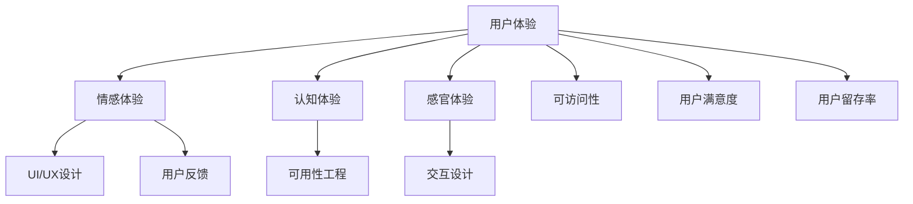

                 

## 1. 背景介绍

软件2.0时代已经到来，无论是新兴的AI应用，还是传统的软件系统，都在向更加智能化、交互化的方向发展。用户体验设计（User Experience Design，UX）作为软件开发的灵魂，扮演着至关重要的角色。在软件2.0的浪潮中，用户体验设计不仅关乎用户满意度，更是技术创新的驱动力。本文旨在探讨软件2.0时代用户体验设计的原理与实践，为开发者提供全面的指导。

## 2. 核心概念与联系

### 2.1 核心概念概述

为了更好地理解软件2.0时代用户体验设计的核心概念，我们需要从用户体验、人机交互、可访问性、可用性等多个角度展开讨论。

- **用户体验（User Experience，UX）**：是指用户在使用产品或服务时，与产品或服务的交互体验，包括情感体验、认知体验和感官体验。用户体验设计旨在通过优化产品的可用性和愉悦感，提升用户满意度和忠诚度。

- **人机交互（Human-Computer Interaction，HCI）**：是研究人与计算机系统之间互动行为的学科。人机交互设计旨在设计直观、自然的交互方式，使用户能够高效、愉悦地与计算机系统交互。

- **可访问性（Accessibility）**：是指确保软件系统可以被尽可能多的用户访问，包括残疾人、老年人、低视力用户等。可访问性设计旨在消除系统使用障碍，提升系统的包容性。

- **可用性（Usability）**：是指软件系统是否容易被用户学习和使用。可用性设计旨在通过简化系统复杂性，降低用户使用门槛，提高用户效率。

### 2.2 核心概念原理和架构的 Mermaid 流程图



这个流程图展示了用户体验设计的核心概念及其联系：

1. **情感体验**、**认知体验**和**感官体验**共同构成了用户体验。情感体验涉及用户对产品的情感反应，认知体验涉及用户对产品的理解和操作，感官体验涉及用户通过视觉、听觉等感官与产品互动。
2. **UI/UX设计**、**可用性工程**和**交互设计**是实现用户体验的具体手段。UI/UX设计关注界面和用户体验的整体设计，可用性工程关注简化用户使用路径，交互设计关注界面元素和交互方式。
3. **可访问性**是确保用户体验公平性的重要方面，涉及为各类用户群体提供无障碍的访问方式。
4. **用户反馈**和**用户满意度**、**用户留存率**是用户体验设计的目标和衡量标准。

## 3. 核心算法原理 & 具体操作步骤

### 3.1 算法原理概述

软件2.0时代用户体验设计的核心算法原理主要基于人机交互心理学、认知科学和行为工程学。设计过程通常包括以下步骤：

1. **用户研究**：通过问卷调查、用户访谈、可用性测试等方式，收集用户需求和行为数据。
2. **概念设计**：基于用户研究结果，设计产品概念和原型，包括界面布局、交互方式、功能模块等。
3. **迭代设计**：通过多轮迭代，不断优化设计方案，解决用户反馈的问题。
4. **验证与评估**：通过用户测试和可用性评估，验证设计方案的有效性和可行性。
5. **发布与迭代**：将设计方案发布至市场，根据用户反馈和市场表现，进行持续的迭代优化。

### 3.2 算法步骤详解

以下是用户体验设计的具体步骤详解：

**步骤1：用户研究**

用户研究是用户体验设计的起点。通过以下方法收集用户需求和行为数据：

- **问卷调查**：设计问卷，了解用户的基本需求、偏好和痛点。
- **用户访谈**：与典型用户进行深入访谈，获取更详细的需求和反馈。
- **可用性测试**：通过真实场景下的用户测试，观察用户在使用产品时的行为和问题。

**步骤2：概念设计**

基于用户研究结果，进行概念设计，包括：

- **界面设计**：设计直观、美观的界面布局，使用户能够轻松地找到所需功能。
- **交互设计**：设计自然、流畅的交互方式，使用户能够高效、愉悦地与产品互动。
- **功能设计**：设计合理的功能模块，满足用户需求，提升产品价值。

**步骤3：迭代设计**

通过多轮迭代，不断优化设计方案，具体步骤如下：

- **原型制作**：根据概念设计，制作初步原型，包括界面和交互的原型。
- **用户测试**：将原型提供给目标用户进行测试，收集用户反馈。
- **分析反馈**：分析用户反馈，识别问题点和改进点。
- **迭代优化**：根据用户反馈，进行多轮迭代优化，直至满足用户需求。

**步骤4：验证与评估**

设计完成后，进行验证与评估，以验证设计方案的有效性和可行性：

- **可用性测试**：在真实用户环境中，进行可用性测试，评估设计方案的可用性和易用性。
- **用户满意度调查**：通过问卷调查，了解用户对设计方案的满意度。
- **行为分析**：通过行为数据分析，评估用户使用产品的行为模式和效率。

**步骤5：发布与迭代**

将设计方案发布至市场，并根据用户反馈和市场表现，进行持续的迭代优化：

- **产品发布**：将优化后的设计方案发布至市场，供用户使用。
- **监控反馈**：实时监控用户反馈和市场表现，收集数据。
- **持续优化**：根据用户反馈和市场表现，进行持续的迭代优化，提升用户体验。

### 3.3 算法优缺点

用户体验设计的算法具有以下优点：

- **用户驱动**：通过用户研究，了解用户需求和痛点，设计符合用户期望的产品。
- **迭代优化**：通过多轮迭代，不断优化设计方案，提升产品体验。
- **数据驱动**：通过数据分析，评估设计方案的有效性和可行性，提供科学依据。

同时，用户体验设计的算法也存在以下缺点：

- **成本高**：用户体验设计的复杂性和深度，导致设计成本较高。
- **周期长**：从用户研究到产品发布，周期较长，难以快速响应市场变化。
- **依赖数据**：设计方案的优化效果依赖于准确的用户数据和行为分析，数据偏差可能影响设计效果。

### 3.4 算法应用领域

用户体验设计的算法广泛应用于多个领域，包括但不限于：

- **移动应用设计**：设计直观、流畅的移动应用界面和交互方式，提升用户使用体验。
- **网页设计**：设计美观、易用的网页界面，提升用户浏览和操作效率。
- **企业应用设计**：设计高效、可靠的企业管理系统，提升员工工作效率和满意度。
- **智能硬件设计**：设计简洁、易用的智能硬件界面和交互方式，提升用户使用便捷性。
- **游戏设计**：设计吸引用户、有趣的游戏界面和交互方式，提升用户游戏体验。

## 4. 数学模型和公式 & 详细讲解 & 举例说明

### 4.1 数学模型构建

用户体验设计的数学模型主要基于用户行为和心理学的量化分析。以下是一个简化版的数学模型：

$$
UX = \sum_{i=1}^n UX_i
$$

其中 $UX$ 为用户体验，$UX_i$ 为用户体验的各个方面，包括情感体验、认知体验、感官体验等。

### 4.2 公式推导过程

用户体验的各个方面可以通过以下公式进行推导：

- **情感体验**：$UX_{emotion} = f(UX_{interface}, UX_{interaction}, UX_{content})$
- **认知体验**：$UX_{cognition} = f(UX_{interface}, UX_{interaction}, UX_{feedback})$
- **感官体验**：$UX_{sensory} = f(UX_{visual}, UX_{auditory}, UX_{tactile})$

其中 $f$ 表示函数映射关系。

### 4.3 案例分析与讲解

以下是一个用户体验设计的案例分析：

**案例：社交媒体应用的用户体验设计**

1. **用户研究**：通过问卷调查和用户访谈，了解用户的基本需求和痛点。用户主要关注社交、交友、分享功能，但对界面复杂性和操作难度有较高要求。

2. **概念设计**：设计简洁、美观的界面布局，采用扁平化设计风格，使用户能够轻松找到所需功能。界面包含简洁的顶部导航栏和底部工具栏，用户可以方便地切换功能。

3. **交互设计**：设计自然、流畅的交互方式，使用户能够高效、愉悦地与产品互动。界面支持滑动手势操作，用户可以上下滑动查看更多内容。

4. **功能设计**：设计合理的功能模块，满足用户需求，提升产品价值。界面包含社交动态、私信、消息、好友管理等功能模块，用户可以方便地进行社交互动。

5. **迭代设计**：将初步原型提供给目标用户进行测试，收集用户反馈。分析反馈，识别问题点和改进点，进行多轮迭代优化。最终设计方案发布至市场，通过用户反馈和市场表现进行持续优化。

## 5. 项目实践：代码实例和详细解释说明

### 5.1 开发环境搭建

在进行用户体验设计的项目实践前，我们需要准备好开发环境。以下是使用Python进行用户体验设计的开发环境配置流程：

1. **安装Anaconda**：从官网下载并安装Anaconda，用于创建独立的Python环境。

2. **创建并激活虚拟环境**：
```bash
conda create -n UX-design python=3.8 
conda activate UX-design
```

3. **安装相关工具包**：
```bash
pip install numpy pandas matplotlib scikit-learn jupyter notebook ipython
```

完成上述步骤后，即可在`UX-design`环境中进行用户体验设计的实践。

### 5.2 源代码详细实现

以下是用户体验设计的基本代码实现，包括界面设计、交互设计和功能设计：

```python
import tkinter as tk
from tkinter import ttk
import numpy as np

# 界面设计
def create_ui(window):
    window.title("UX Design App")
    window.geometry("400x300")

    # 顶部导航栏
    nav_bar = ttk.Notebook(window)
    nav_bar.pack()

    # 底部工具栏
    toolbar = tk.Frame(window)
    toolbar.pack()

    # 社交动态模块
    social_feed = tk.Frame(window)
    social_feed.pack()

    # 私信模块
    private_chat = tk.Frame(window)
    private_chat.pack()

    # 消息模块
    message_board = tk.Frame(window)
    message_board.pack()

    # 好友管理模块
    friends_list = tk.Frame(window)
    friends_list.pack()

    # 界面布局
    tk.Label(social_feed, text="Social Feed").grid(row=0, column=0)
    tk.Label(private_chat, text="Private Chat").grid(row=0, column=0)
    tk.Label(message_board, text="Message Board").grid(row=0, column=0)
    tk.Label(friends_list, text="Friends List").grid(row=0, column=0)

    # 界面元素
    social_feed_entry = tk.Entry(social_feed)
    social_feed_entry.grid(row=1, column=0)
    social_feed_button = tk.Button(social_feed, text="Post", command=post_social_feed)
    social_feed_button.grid(row=2, column=0)

    private_chat_entry = tk.Entry(private_chat)
    private_chat_entry.grid(row=1, column=0)
    private_chat_button = tk.Button(private_chat, text="Send", command=send_private_chat)
    private_chat_button.grid(row=2, column=0)

    message_board_entry = tk.Entry(message_board)
    message_board_entry.grid(row=1, column=0)
    message_board_button = tk.Button(message_board, text="Send", command=send_message_board)
    message_board_button.grid(row=2, column=0)

    friends_list_entry = tk.Entry(friends_list)
    friends_list_entry.grid(row=1, column=0)
    friends_list_button = tk.Button(friends_list, text="Add Friend", command=add_friend)
    friends_list_button.grid(row=2, column=0)

    # 交互设计
    def post_social_feed():
        social_feed_entry.delete(0, tk.END)
        social_feed_entry.insert(0, "Social Feed post")

    def send_private_chat():
        private_chat_entry.delete(0, tk.END)
        private_chat_entry.insert(0, "Private chat message")

    def send_message_board():
        message_board_entry.delete(0, tk.END)
        message_board_entry.insert(0, "Message board message")

    def add_friend():
        friends_list_entry.delete(0, tk.END)
        friends_list_entry.insert(0, "New Friend")

    # 功能设计
    # 此处的函数设计需要根据具体业务逻辑进行实现

# 启动界面
window = tk.Tk()
create_ui(window)
window.mainloop()
```

### 5.3 代码解读与分析

让我们再详细解读一下关键代码的实现细节：

**界面设计**：
- `tkinter` 库用于创建界面，`ttk` 库用于创建高级小部件。
- `create_ui` 函数创建顶部导航栏、底部工具栏和功能模块，并设置布局。

**交互设计**：
- 界面元素包括文本输入框、按钮等，通过命令函数实现交互逻辑。
- 命令函数根据用户操作触发相应的操作，如发布社交动态、发送私信等。

**功能设计**：
- 此处的函数设计需要根据具体业务逻辑进行实现，包括社交动态、私信、消息、好友管理等功能模块。

**代码实现**：
- 代码实现简单，易于理解，适用于初学者。
- 界面布局和交互逻辑可以根据实际需求进行扩展。

## 6. 实际应用场景

### 6.1 社交媒体应用

社交媒体应用的用户体验设计需要关注界面简洁、操作便捷、功能丰富等方面。通过设计简洁直观的界面布局，使用户能够轻松找到所需功能，通过设计自然流畅的交互方式，使用户能够高效、愉悦地与产品互动。

**具体实现**：
- 设计简洁美观的界面布局，使用户能够轻松找到社交动态、私信、消息、好友管理等功能模块。
- 设计自然流畅的交互方式，使用户能够高效地发布社交动态、发送私信、浏览消息等。
- 设计合理的功能模块，满足用户需求，提升产品价值。

### 6.2 电商网站

电商网站的用户体验设计需要关注界面美观、操作便捷、商品展示等方面。通过设计美观直观的界面布局，使用户能够轻松浏览商品，通过设计自然流畅的交互方式，使用户能够高效、愉悦地进行购物操作。

**具体实现**：
- 设计美观直观的界面布局，使用户能够轻松浏览商品、查看商品详情、加入购物车等。
- 设计自然流畅的交互方式，使用户能够高效地选择商品、下单支付、查看订单状态等。
- 设计合理的功能模块，满足用户需求，提升用户购物体验。

### 6.3 企业应用

企业应用的用户体验设计需要关注界面清晰、操作便捷、功能强大等方面。通过设计清晰直观的界面布局，使用户能够轻松使用企业管理系统，通过设计自然流畅的交互方式，使用户能够高效、愉悦地进行企业运营操作。

**具体实现**：
- 设计清晰直观的界面布局，使用户能够轻松查看公司信息、管理任务、协作办公等。
- 设计自然流畅的交互方式，使用户能够高效地创建任务、分配任务、查看任务进度等。
- 设计合理的功能模块，满足用户需求，提升用户工作效率和满意度。

### 6.4 未来应用展望

未来用户体验设计将向更加智能化、个性化、交互化方向发展。随着人工智能和大数据分析技术的应用，用户体验设计将更加注重用户需求的多样性和个性化，通过智能推荐、个性化界面设计等方式，提升用户的使用体验。

**未来展望**：
- 智能推荐：通过智能推荐算法，为用户推荐感兴趣的内容，提升用户的使用体验。
- 个性化界面设计：根据用户的兴趣和行为，设计个性化的界面布局和交互方式，提升用户的满足感。
- 交互化设计：通过语音识别、手势识别等技术，提升用户与产品的交互方式，提升用户的便捷性和愉悦感。

## 7. 工具和资源推荐

### 7.1 学习资源推荐

为了帮助开发者系统掌握用户体验设计的理论基础和实践技巧，这里推荐一些优质的学习资源：

1. **《设计心理学》**：经典书籍，系统介绍了用户心理学的原理和应用。
2. **《用户体验设计指南》**：详细介绍了用户体验设计的理论和实践方法。
3. **《UX设计基础》**：网络课程，涵盖用户体验设计的各个方面，适合初学者。
4. **《Design Thinking》**：创新设计方法，强调用户需求为中心的设计理念。
5. **《Nielsen's 10 Heuristics of Usability》**：经典可用性原则，适用于界面设计。

### 7.2 开发工具推荐

用户体验设计的开发离不开优秀的工具支持。以下是几款用于用户体验设计开发的常用工具：

1. **Sketch**：界面设计工具，适用于创建高保真原型和用户界面设计。
2. **Adobe XD**：交互设计工具，适用于创建高保真原型和交互设计。
3. **Figma**：协作设计工具，适用于实时协作设计和团队沟通。
4. **Axure RP**：原型设计工具，适用于创建高保真原型和用户界面设计。
5. **InVision Studio**：原型设计工具，适用于创建高保真原型和用户界面设计。

### 7.3 相关论文推荐

用户体验设计的相关论文代表了大设计领域的发展脉络。以下是几篇奠基性的相关论文，推荐阅读：

1. **《可用性工程》**：介绍可用性工程的基本原理和应用方法。
2. **《设计心理学》**：探讨用户心理学的原理和应用，适用于界面设计。
3. **《交互设计原则》**：介绍交互设计的基本原则和应用方法。
4. **《用户体验设计的挑战和未来》**：讨论用户体验设计面临的挑战和未来发展方向。

## 8. 总结：未来发展趋势与挑战

### 8.1 研究成果总结

本文对软件2.0时代用户体验设计的原理与实践进行了全面系统的介绍。首先，阐述了用户体验设计的核心概念和应用场景，明确了用户体验设计在软件2.0时代的重要价值。其次，从用户研究、概念设计、迭代设计、验证与评估、发布与迭代等角度，详细讲解了用户体验设计的具体步骤和算法原理。最后，通过实例分析和工具推荐，展示了用户体验设计在实际应用中的广泛应用和前沿技术。

通过本文的系统梳理，可以看到，用户体验设计在软件2.0时代具有重要的战略地位，成为技术创新和市场竞争的核心因素。未来，用户体验设计将与人工智能、大数据、机器学习等前沿技术深度融合，为构建更加智能、便捷、愉悦的用户体验提供新的思路和方法。

### 8.2 未来发展趋势

展望未来，用户体验设计将呈现以下几个发展趋势：

1. **个性化设计**：通过大数据和人工智能技术，为用户提供更加个性化的界面和交互方式，提升用户满意度。
2. **智能推荐**：利用智能推荐算法，为用户提供感兴趣的内容和功能，提升用户的使用体验。
3. **交互化设计**：通过语音识别、手势识别等技术，提升用户与产品的交互方式，提升用户的便捷性和愉悦感。
4. **多渠道设计**：设计跨平台、跨设备的用户体验，提升用户的跨平台使用体验。
5. **可访问性设计**：关注用户的多样性和包容性，提升系统的可访问性和易用性。

### 8.3 面临的挑战

尽管用户体验设计在软件2.0时代已经取得了显著进展，但在迈向更加智能化、个性化、交互化应用的过程中，它仍面临着诸多挑战：

1. **成本高**：用户体验设计的复杂性和深度，导致设计成本较高，难以快速迭代。
2. **周期长**：从用户研究到产品发布，周期较长，难以快速响应市场变化。
3. **依赖数据**：设计方案的优化效果依赖于准确的用户数据和行为分析，数据偏差可能影响设计效果。
4. **用户多样性**：用户的多样性和个性化需求，导致设计方案难以满足所有用户的需求。
5. **技术复杂性**：用户体验设计需要跨学科的知识和技能，设计难度较大。

### 8.4 研究展望

未来用户体验设计的方向将在以下几个方面寻求新的突破：

1. **跨学科融合**：将心理学、人机交互、认知科学等多学科知识融合，提升设计方案的科学性和系统性。
2. **数据驱动设计**：利用大数据和人工智能技术，进行用户行为分析和预测，提升设计方案的精准性和有效性。
3. **创新设计方法**：引入设计思维、创新工程等新方法，提升设计方案的创新性和可操作性。
4. **持续迭代优化**：通过持续的用户反馈和市场表现，进行迭代优化，提升设计方案的实效性和用户满意度。
5. **多渠道设计**：设计跨平台、跨设备的用户体验，提升用户的跨平台使用体验。

## 9. 附录：常见问题与解答

**Q1：用户体验设计的核心是什么？**

A: 用户体验设计的核心是用户需求和体验。设计过程中需要关注用户的需求、痛点和行为，通过优化产品的可用性和愉悦感，提升用户满意度和忠诚度。

**Q2：用户体验设计的步骤有哪些？**

A: 用户体验设计的主要步骤包括用户研究、概念设计、迭代设计、验证与评估、发布与迭代。通过多轮迭代，不断优化设计方案，提升用户体验。

**Q3：用户体验设计的算法有哪些优点？**

A: 用户体验设计的算法具有以下优点：用户驱动、迭代优化、数据驱动。通过用户研究，了解用户需求和痛点，设计符合用户期望的产品；通过多轮迭代，不断优化设计方案，提升产品体验；通过数据分析，评估设计方案的有效性和可行性，提供科学依据。

**Q4：用户体验设计面临的主要挑战是什么？**

A: 用户体验设计面临的主要挑战包括成本高、周期长、依赖数据、用户多样性、技术复杂性等。需要关注用户的多样性和个性化需求，利用大数据和人工智能技术，进行用户行为分析和预测，提升设计方案的精准性和有效性。

**Q5：用户体验设计的应用场景有哪些？**

A: 用户体验设计的应用场景包括社交媒体应用、电商网站、企业应用等。通过设计简洁直观的界面布局，使用户能够轻松找到所需功能，通过设计自然流畅的交互方式，使用户能够高效、愉悦地与产品互动。

---

作者：禅与计算机程序设计艺术 / Zen and the Art of Computer Programming

