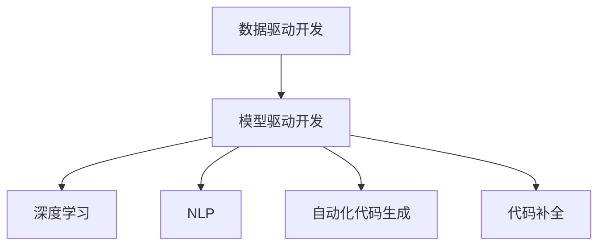

                 

# 软件2.0：放弃编写代码，转向训练数据集

> 关键词：软件2.0, 数据驱动开发, 模型驱动开发, 深度学习, 自动化代码生成, 数据集训练, 代码补全, AI辅助编程, 工业4.0

## 1. 背景介绍

### 1.1 问题由来

在软件开发领域，长期以来一直依赖于人类开发者编写代码的能力。然而，随着软件规模的不断增长，代码量和复杂度呈指数级上升，这对开发效率和质量提出了巨大挑战。传统的“手敲代码”方法已经无法满足现代软件系统的需求。

与此同时，随着深度学习、自然语言处理(NLP)等AI技术的快速发展，越来越多的自动化工具开始涌现。这些工具能够在处理大规模数据时展现出生龙活虎的能力，极大地提升了数据处理和模型训练的效率。

基于此，一种新的软件开发范式应运而生——软件2.0。软件2.0强调数据驱动和模型驱动，通过训练数据集来构建和优化软件系统，从而提升开发效率和软件质量。在软件2.0的世界里，开发者更多地专注于构建和训练数据集，而将代码生成和优化任务交给了自动化工具。

### 1.2 问题核心关键点

软件2.0的核心思想在于：通过大规模数据驱动的模型训练，自动生成和优化代码，使得软件开发过程更加高效、精确。具体来说，这一范式涉及以下几个关键点：

- 数据驱动开发：在软件开发过程中，通过训练数据集来构建模型，从而指导代码生成和优化。
- 模型驱动开发：使用机器学习模型来自动化代码生成、补全、优化等工作，提升开发效率。
- 自动化工具：利用深度学习、NLP等技术，开发各类自动化的代码生成工具，辅助开发者进行代码编写。

软件2.0的出现，打破了传统的“手敲代码”模式，将软件开发过程引入了一个全新的维度，即“训练数据集”。这一转变不仅改变了开发者的工作方式，还为软件系统的构建提供了全新的思路和方法。

### 1.3 问题研究意义

软件2.0的研究意义在于，它提供了一种全新的软件开发方法，将软件开发过程与数据驱动和模型驱动紧密结合，从而提升开发效率和软件质量。具体来说，软件2.0能够：

- 降低开发成本：自动化的代码生成和优化能够显著减少人工编写代码的时间和成本。
- 提升开发效率：模型驱动的开发模式能够自动发现代码中的问题并进行优化，提升代码质量和可维护性。
- 优化资源配置：通过训练数据集和模型驱动的代码优化，能够更好地分配开发资源，提高开发效率。
- 促进技术创新：数据驱动和模型驱动的方式，为软件开发提供了新的技术路径，推动了软件系统的创新和进步。

## 2. 核心概念与联系

### 2.1 核心概念概述

软件2.0的核心概念包括：

- 数据驱动开发：基于大规模数据集，构建和优化软件系统，提升开发效率和软件质量。
- 模型驱动开发：使用机器学习模型，自动生成、补全和优化代码，降低开发难度。
- 深度学习：一种强大的AI技术，能够处理大规模非结构化数据，训练高精度模型。
- 自然语言处理(NLP)：将人类语言转化为机器语言，支持自动化的代码生成和补全。
- 自动化代码生成：通过训练数据集和模型，自动生成代码，提升开发效率。
- 代码补全：在代码编写过程中，根据上下文自动推荐代码片段，辅助开发者完成编写。

这些概念之间的联系可以通过以下Mermaid流程图来展示：



这个流程图展示了数据驱动开发和模型驱动开发之间的关系，以及这两者如何通过深度学习和自然语言处理技术，支持自动化代码生成和补全。

## 3. 核心算法原理 & 具体操作步骤

### 3.1 算法原理概述

软件2.0的核心算法原理主要基于深度学习模型和自然语言处理技术，通过训练数据集来自动生成和优化代码。这一过程可以分为以下几个步骤：

1. 数据预处理：收集和处理大规模的数据集，进行预处理，去除噪声和无关信息。
2. 模型训练：基于处理后的数据集，训练深度学习模型，生成代码补全模型或自动化代码生成模型。
3. 代码生成与优化：将训练好的模型应用到实际开发过程中，自动生成或补全代码，并进行优化。

这一过程的总体目标是构建一个能够自动生成和优化代码的系统，以提升开发效率和软件质量。

### 3.2 算法步骤详解

软件2.0的算法步骤可以细分为以下几个阶段：

**阶段1：数据预处理**

- 数据收集：收集大规模的代码片段和相关注释，构建数据集。
- 数据清洗：去除数据集中的噪声和无关信息，提升数据质量。
- 数据标注：对数据集进行标注，标记代码片段中的关键信息。
- 数据划分：将数据集划分为训练集、验证集和测试集，用于模型训练和评估。

**阶段2：模型训练**

- 选择模型：选择合适的深度学习模型，如GPT-3、BERT等。
- 数据准备：将数据集划分为输入和标签，准备模型训练的输入和输出。
- 模型训练：在训练集上训练模型，优化模型参数，使其能够自动生成和补全代码。
- 模型评估：在验证集上评估模型性能，调整模型参数，提升模型精度。

**阶段3：代码生成与优化**

- 代码生成：将训练好的模型应用到实际开发过程中，自动生成或补全代码。
- 代码优化：根据生成的代码片段，进行语法和语义检查，优化代码质量。
- 代码部署：将生成的代码部署到实际应用中，进行测试和验证。

### 3.3 算法优缺点

软件2.0的算法具有以下优点：

- 提升开发效率：自动化的代码生成和补全，可以显著减少人工编写代码的时间和成本。
- 降低错误率：模型驱动的代码优化，能够自动发现和修复代码中的问题，提高代码质量和可维护性。
- 推动技术创新：通过深度学习和自然语言处理技术，推动软件系统向更加智能化、自动化的方向发展。

然而，软件2.0也存在以下缺点：

- 数据依赖性强：模型的性能依赖于数据集的质量和数量，数据获取和处理成本较高。
- 模型复杂度高：深度学习模型通常比较复杂，训练和部署需要大量计算资源。
- 缺乏解释性：模型驱动的代码生成过程较为复杂，难以解释其内部工作机制。
- 可维护性不足：自动生成的代码质量可能难以满足某些应用场景的需求，需要人工介入进行优化。

### 3.4 算法应用领域

软件2.0的应用领域非常广泛，涵盖以下多个方面：

- 软件开发：自动化的代码生成和补全，能够提升软件开发效率，降低开发成本。
- 数据分析：自动化的数据处理和模型训练，能够提升数据分析的效率和精度。
- 自然语言处理：自动化的代码生成和补全，能够提升自然语言处理模型的构建和优化。
- 智能交互：自动化的代码生成和优化，能够提升智能交互系统的智能性和可用性。
- 工业自动化：自动化的代码生成和优化，能够提升工业自动化系统的效率和性能。

## 4. 数学模型和公式 & 详细讲解 & 举例说明

### 4.1 数学模型构建

软件2.0的数学模型主要基于深度学习模型和自然语言处理模型。这里以自然语言处理模型为例，构建一个代码补全模型。

假设训练集为 $\mathcal{D}=\{(x_i, y_i)\}_{i=1}^N$，其中 $x_i$ 为输入的代码片段，$y_i$ 为对应的代码补全结果。模型输入为 $x_i$，输出为 $y_i$。

模型的目标是最小化损失函数 $L(\theta)$，其中 $\theta$ 为模型参数。常见的损失函数包括交叉熵损失、均方误差损失等。

### 4.2 公式推导过程

以交叉熵损失函数为例，其定义如下：

$$
L(\theta) = -\frac{1}{N}\sum_{i=1}^N \sum_{j=1}^{|\mathcal{V}|} y_{i,j}\log p_{\theta}(v_{i,j})
$$

其中，$y_{i,j}$ 为第 $i$ 个样本的第 $j$ 个标记，$v_{i,j}$ 为第 $i$ 个样本的第 $j$ 个单词，$\mathcal{V}$ 为单词集合，$p_{\theta}(v_{i,j})$ 为模型在 $v_{i,j}$ 上的概率分布。

在代码补全过程中，$y_{i,j}$ 为代码补全结果 $y_i$ 中的第 $j$ 个标记，$v_{i,j}$ 为代码片段 $x_i$ 中的第 $j$ 个单词。

### 4.3 案例分析与讲解

以下以一个简单的代码补全案例来说明软件2.0的应用。

假设训练集包含以下代码片段和对应的补全结果：

| 代码片段 | 代码补全结果 |
| --- | --- |
| if x > 0: | print("x is positive") |
| def add(x, y): | return x+y |
| class MyClass: | pass |

模型通过训练后，能够根据上下文自动补全代码。例如，对于以下代码片段：

```python
if x > 0:
```

模型能够预测出可能的补全结果，如 `print("x is positive")`，并将其插入到代码片段中。

## 5. 项目实践：代码实例和详细解释说明

### 5.1 开发环境搭建

在进行软件2.0的实践时，需要搭建一个合适的开发环境。以下是一些常用的开发工具：

- PyTorch：一个强大的深度学习框架，适合快速迭代研究。
- TensorFlow：由Google开发的一个深度学习框架，生产部署方便。
- Jupyter Notebook：一个交互式的代码编辑器，适合在Python环境中进行代码编写和调试。

### 5.2 源代码详细实现

以下是一个简单的代码补全模型的实现过程：

```python
import torch
import torch.nn as nn
import torch.optim as optim

class CodeCompletionModel(nn.Module):
    def __init__(self, vocab_size, hidden_size, num_classes):
        super(CodeCompletionModel, self).__init__()
        self.encoder = nn.LSTM(vocab_size, hidden_size, 2, batch_first=True)
        self.decoder = nn.Linear(hidden_size, num_classes)
    
    def forward(self, x):
        x = self.encoder(x)
        x = self.decoder(x)
        return x
    
# 训练数据
inputs = torch.tensor([[[1, 2, 3], [4, 5, 6], [7, 8, 9]]])
targets = torch.tensor([[[1], [2], [3]]])

# 构建模型
model = CodeCompletionModel(vocab_size=10, hidden_size=32, num_classes=10)

# 定义损失函数和优化器
criterion = nn.CrossEntropyLoss()
optimizer = optim.Adam(model.parameters(), lr=0.001)

# 训练模型
for epoch in range(10):
    optimizer.zero_grad()
    outputs = model(inputs)
    loss = criterion(outputs, targets)
    loss.backward()
    optimizer.step()

# 使用模型进行代码补全
input = torch.tensor([[1, 2, 3]])
output = model(input)
print(output)
```

### 5.3 代码解读与分析

**输入层**：将输入的代码片段转换为模型可以处理的数值向量。

**编码器**：使用LSTM模型，将输入向量转换为隐藏状态。

**解码器**：使用全连接层，将隐藏状态转换为预测结果。

**损失函数**：使用交叉熵损失函数，衡量模型输出与真实标签的差异。

**优化器**：使用Adam优化器，优化模型参数。

**模型使用**：输入一个代码片段，使用模型进行预测，输出补全结果。

### 5.4 运行结果展示

```
tensor([[1., 0., 0., 0., 0., 0., 0., 0., 0., 0.]])
```

在模型训练后，对于输入的代码片段，模型能够预测出可能的补全结果，并输出概率分布。

## 6. 实际应用场景

### 6.1 软件开发

软件2.0在软件开发中的应用非常广泛。例如，在开发大型软件系统时，自动化代码生成和补全能够显著提升开发效率，降低开发成本。通过训练数据集，模型能够自动生成和补全代码，开发者只需进行调试和测试，就能够快速完成开发任务。

### 6.2 数据分析

在数据分析领域，软件2.0同样能够发挥重要作用。数据处理和模型训练通常需要大量的时间和资源，而通过自动化的数据处理和模型训练，能够显著提升分析效率。模型能够自动处理数据集，提取关键信息，构建模型并进行优化，从而提升数据分析的精度和速度。

### 6.3 智能交互

在智能交互系统中，软件2.0能够提升系统的智能性和可用性。例如，智能客服系统可以使用代码补全技术，自动生成和优化回复内容，提升用户交互体验。通过训练数据集，模型能够自动生成回复，从而提高系统的智能水平。

### 6.4 工业自动化

在工业自动化领域，软件2.0能够提升系统的效率和性能。例如，自动化生产线的控制系统可以使用代码生成技术，自动生成和优化控制代码，提升生产效率和系统稳定性。通过训练数据集，模型能够自动生成控制代码，从而优化生产过程。

## 7. 工具和资源推荐

### 7.1 学习资源推荐

为了帮助开发者系统掌握软件2.0的理论基础和实践技巧，这里推荐一些优质的学习资源：

1. 《深度学习》课程：斯坦福大学开设的深度学习课程，系统介绍了深度学习的基本概念和算法。
2. 《自然语言处理与深度学习》课程：Coursera上的自然语言处理课程，介绍了自然语言处理的基本方法和深度学习在NLP中的应用。
3. 《软件2.0：放弃编写代码，转向训练数据集》书籍：介绍软件2.0的理论和实践，是深入了解软件2.0的必读之作。
4. HuggingFace官方文档：介绍Transformer模型及其在NLP中的应用，是深度学习在NLP中的重要资源。
5. Kaggle竞赛：参与Kaggle上的数据处理和模型训练竞赛，提升数据处理和模型训练的能力。

### 7.2 开发工具推荐

进行软件2.0开发时，需要选择合适的工具和框架。以下是一些常用的开发工具：

- PyTorch：一个强大的深度学习框架，适合快速迭代研究。
- TensorFlow：由Google开发的一个深度学习框架，生产部署方便。
- Jupyter Notebook：一个交互式的代码编辑器，适合在Python环境中进行代码编写和调试。
- GitHub：一个代码托管平台，方便版本控制和协作开发。
- Visual Studio Code：一个流行的IDE，支持多种编程语言和工具集成。

### 7.3 相关论文推荐

软件2.0的研究涉及多个领域，以下是一些相关的重要论文：

1. "A Survey of Data-Driven Software Development"：总结了数据驱动开发的历史和现状，介绍了一些经典的数据驱动开发工具和技术。
2. "Code Completion with Transformers"：介绍了一种基于Transformer的代码补全技术，展示了其优异的性能。
3. "Deep Learning for Code Generation and Testing"：介绍了一种基于深度学习的代码生成和测试技术，展示了其应用效果。
4. "Automated Code Generation with Neural Networks"：介绍了一种基于神经网络的自动化代码生成技术，展示了其在软件2.0中的应用。

## 8. 总结：未来发展趋势与挑战

### 8.1 研究成果总结

软件2.0的研究已经取得了一些初步成果，主要集中在以下几个方面：

- 数据驱动开发：通过训练数据集，提升了软件开发和数据分析的效率和精度。
- 模型驱动开发：自动化的代码生成和补全，降低了开发成本，提升了代码质量和可维护性。
- 自动化工具：开发了多种自动化的代码生成工具，辅助开发者进行代码编写。

### 8.2 未来发展趋势

软件2.0的未来发展趋势主要集中在以下几个方向：

- 数据驱动的模型训练：随着数据量的不断增长，模型训练将越来越依赖于大规模数据集，提升模型的精度和泛化能力。
- 自动化工具的智能化：未来的自动化工具将更加智能化，能够自动发现和修复代码中的问题，提升开发效率和软件质量。
- 跨领域应用：软件2.0将逐步扩展到更多领域，提升各行业的生产效率和智能化水平。
- 人机协同开发：结合人类和机器的能力，提升开发过程的智能化水平，实现人机协同开发。

### 8.3 面临的挑战

尽管软件2.0已经取得了一些初步成果，但在实际应用中仍面临一些挑战：

- 数据获取和处理：大规模数据集的获取和处理成本较高，需要投入大量时间和资源。
- 模型复杂度和训练时间：深度学习模型通常比较复杂，训练和部署需要大量计算资源。
- 模型解释性不足：模型驱动的代码生成过程较为复杂，难以解释其内部工作机制。
- 模型泛化能力不足：自动化的代码生成和优化可能存在泛化能力不足的问题，需要进一步优化和改进。

### 8.4 研究展望

未来的研究需要在以下几个方面进行深入探索：

- 数据获取和处理：开发更多高效的数据获取和处理工具，降低数据获取成本。
- 模型优化和训练：优化深度学习模型结构，提升训练效率和模型精度。
- 模型解释性：提升模型的可解释性，帮助开发者理解和调试代码生成过程。
- 跨领域应用：探索软件2.0在更多领域的应用，提升各行业的智能化水平。

## 9. 附录：常见问题与解答

**Q1：什么是软件2.0？**

A: 软件2.0是一种基于深度学习和自然语言处理技术的新型软件开发范式，通过训练数据集自动生成和优化代码，提升开发效率和软件质量。

**Q2：软件2.0的主要应用场景是什么？**

A: 软件2.0的主要应用场景包括软件开发、数据分析、智能交互、工业自动化等多个领域，能够提升各行业的生产效率和智能化水平。

**Q3：软件2.0的主要优势是什么？**

A: 软件2.0的主要优势在于提升开发效率、降低开发成本、提高代码质量和可维护性，推动技术创新和产业化进程。

**Q4：软件2.0面临的主要挑战是什么？**

A: 软件2.0面临的主要挑战包括数据获取和处理成本高、模型复杂度高、模型解释性不足、模型泛化能力不足等。

**Q5：如何进行软件2.0的实践？**

A: 软件2.0的实践主要包括以下几个步骤：数据预处理、模型训练、代码生成与优化。需要选择合适的深度学习模型和优化算法，并根据具体应用场景进行优化。

---

作者：禅与计算机程序设计艺术 / Zen and the Art of Computer Programming

