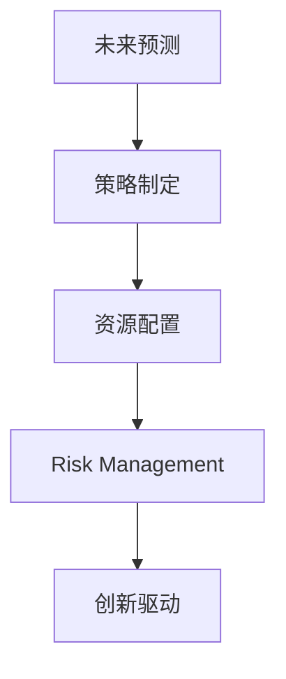

                 

# 远见管理：培养长期战略思维

## 1. 背景介绍

### 1.1 问题由来
在数字化转型加速的今天，企业面临着前所未有的市场竞争和不确定性。如何在大变局中保持稳健增长，实现长期战略目标，成为了每个企业面临的首要问题。而卓越的远见管理（Strategic Foresight Management），正是解决这一问题的重要工具。

### 1.2 问题核心关键点
远见管理（Strategic Foresight Management）是一种系统的、战略性的思维方法，旨在通过预测未来趋势，提前规划企业发展路径。其核心关键点包括：

- **未来预测**：通过对经济、技术、市场、政策等多维度信息的深入分析和预测，识别未来可能的发展趋势。
- **策略制定**：根据未来预测结果，制定具有前瞻性的长期战略，确保企业能适应未来的变化。
- **资源配置**：合理分配资源，确保企业在执行长期战略时，有足够的资源支持。
- **风险管理**：识别和评估未来风险，制定应对策略，确保企业在变化中稳健前进。
- **创新驱动**：以创新为引擎，驱动企业的长期发展和竞争力提升。

### 1.3 问题研究意义
培养卓越的远见管理能力，对于企业应对快速变化的市场环境，实现可持续发展具有重要意义：

1. **提前应对变化**：通过预测未来，企业可以提前准备，应对可能出现的市场变化和挑战，减少不确定性。
2. **增强竞争优势**：前瞻性的战略规划，能帮助企业抓住市场机遇，领先竞争对手。
3. **提高资源利用率**：合理配置资源，确保关键领域获得足够的投入，提升企业运营效率。
4. **提升企业韧性**：通过识别和应对潜在风险，增强企业的抗风险能力，保障长期稳定发展。
5. **激发创新活力**：远见管理鼓励企业不断创新，以新技术、新模式推动企业持续进步。

## 2. 核心概念与联系

### 2.1 核心概念概述

为了更好地理解远见管理，本节将介绍几个密切相关的核心概念：

- **远见管理（Strategic Foresight Management）**：一种系统的、战略性的思维方法，旨在通过预测未来趋势，提前规划企业发展路径。
- **未来预测（Future Prediction）**：对经济、技术、市场、政策等多维度信息的深入分析和预测，识别未来可能的发展趋势。
- **策略制定（Strategy Formulation）**：根据未来预测结果，制定具有前瞻性的长期战略，确保企业能适应未来的变化。
- **资源配置（Resource Allocation）**：合理分配资源，确保企业在执行长期战略时，有足够的资源支持。
- **风险管理（Risk Management）**：识别和评估未来风险，制定应对策略，确保企业在变化中稳健前进。
- **创新驱动（Innovation Drive）**：以创新为引擎，驱动企业的长期发展和竞争力提升。

这些概念之间的逻辑关系可以通过以下Mermaid流程图来展示：



这个流程图展示了几大核心概念之间的逻辑关系：

1. 未来预测是远见管理的基础，通过对多维度信息的深入分析，识别未来趋势。
2. 策略制定是核心环节，根据未来预测结果，制定具有前瞻性的长期战略。
3. 资源配置和风险管理是执行环节，确保战略得以实施和稳健执行。
4. 创新驱动是动力来源，通过持续创新，驱动企业持续进步。

## 3. 核心算法原理 & 具体操作步骤
### 3.1 算法原理概述

远见管理的核心算法原理基于系统动力学（System Dynamics）和未来预测技术。其核心思想是通过构建系统模型，模拟和预测未来趋势，从而进行长期战略规划。

**系统动力学（System Dynamics）**：一种研究和处理复杂系统的方法，通过构建系统模型，理解和预测系统行为。远见管理正是利用系统动力学模型，对企业内外部环境进行动态模拟和预测。

**未来预测技术**：通过定性和定量相结合的方法，对经济、技术、市场、政策等要素的未来发展趋势进行预测。远见管理通过多种预测工具，如德尔菲法、情景分析法等，结合数据驱动的方法，进行未来趋势的预测。

### 3.2 算法步骤详解

远见管理的实施步骤包括以下几个关键环节：

**Step 1: 数据收集与分析**
- 收集与企业发展相关的多维度信息，如经济数据、技术趋势、市场动态、政策法规等。
- 对收集到的数据进行清洗和预处理，确保数据质量。

**Step 2: 构建系统模型**
- 根据收集到的数据，构建系统动力学模型，反映企业的运行状态和行为规律。
- 使用Simulations软件（如Vensim、AnyLogic等）进行模型验证和优化。

**Step 3: 未来预测**
- 使用未来预测工具，对系统模型进行模拟，预测未来一段时间内企业的发展趋势。
- 结合专家经验和历史数据，进一步优化预测结果。

**Step 4: 策略制定**
- 根据未来预测结果，制定长期战略规划，包括业务发展方向、资源配置、创新策略等。
- 设定关键绩效指标（KPIs），对战略执行效果进行评估。

**Step 5: 资源配置与风险管理**
- 根据战略规划，进行资源配置，确保战略实施的可行性。
- 识别潜在风险，制定风险应对策略，确保战略稳健执行。

**Step 6: 执行与监控**
- 实施战略规划，确保各项资源和措施到位。
- 持续监控战略执行效果，及时调整和优化。

### 3.3 算法优缺点

远见管理作为一种战略思维方法，具有以下优点：

1. **前瞻性**：通过预测未来，提前规划企业发展路径，减少不确定性。
2. **系统性**：结合系统动力学模型，对企业内外部环境进行全面分析，确保战略的科学性和合理性。
3. **动态性**：通过持续监控和调整，确保战略的实时性和适应性。
4. **综合性强**：结合经济、技术、市场、政策等多维度信息，进行全面分析，确保战略的全面性和深度。

同时，远见管理也存在一些局限性：

1. **复杂度高**：系统动力学模型复杂，需要投入大量时间和资源进行构建和验证。
2. **数据依赖**：预测结果依赖于数据的准确性和完整性，数据质量不高可能导致预测失准。
3. **专家依赖**：专家经验和判断在预测中占重要地位，可能存在主观偏差。
4. **实施难度大**：战略制定和执行涉及多部门协作，协调难度大。
5. **短期效果不明显**：远见管理注重长期发展，短期内可能难以看到明显效果。

### 3.4 算法应用领域

远见管理在企业战略规划、资源配置、风险管理、创新驱动等多个领域都有广泛应用，具体包括：

- **企业战略规划**：通过预测未来趋势，制定具有前瞻性的企业战略规划。
- **资源配置**：根据战略规划，合理分配资源，确保战略实施的可行性。
- **风险管理**：识别潜在风险，制定应对策略，确保战略稳健执行。
- **创新驱动**：通过持续创新，驱动企业持续进步。
- **市场拓展**：预测市场变化，制定市场进入和退出策略。
- **新产品开发**：通过预测市场需求，指导新产品开发和上市。

除了上述这些经典领域外，远见管理还被创新性地应用于更多的场景中，如智慧城市、智能制造、可持续能源等，为企业在这些新兴领域的布局提供了重要的决策支持。

## 4. 数学模型和公式 & 详细讲解  
### 4.1 数学模型构建

本节将使用数学语言对远见管理的未来预测部分进行更加严格的刻画。

假设企业内外部环境可以用多个变量来表示，如经济增长率 $G$、技术进步率 $T$、市场需求 $D$ 等。未来预测的数学模型可以表示为：

$$
F(t) = f(G(t), T(t), D(t), \dots) + \epsilon(t)
$$

其中 $F(t)$ 表示在时间 $t$ 的未来预测值，$f$ 表示预测模型，$\epsilon(t)$ 表示随机误差项。

对于经济、技术、市场等变量的未来预测，可以采用不同的数学模型，如ARIMA模型、指数模型、对数模型等。具体预测模型根据实际应用情况选择。

### 4.2 公式推导过程

以经济增长率 $G(t)$ 的预测为例，假设已知经济增长率的历史数据 $G(t_i)$，采用ARIMA模型进行预测。

**ARIMA模型**：
- **自回归模型**：$G(t) = \beta_0 + \sum_{i=1}^{p} \beta_i G(t-i) + \epsilon(t)$
- **差分模型**：$D(G(t)) = G(t) - G(t-1)$
- **移动平均模型**：$G(t) = \alpha_0 + \sum_{i=1}^{q} \alpha_i D(G(t-i)) + \epsilon(t)$

通过上述公式，可以对经济增长率 $G(t)$ 进行未来预测。

### 4.3 案例分析与讲解

假设某科技公司计划进入新市场，需要对新市场的未来需求进行预测。该公司收集了过去几年的市场数据，采用指数模型进行预测。

设市场规模 $D(t)$ 与时间 $t$ 的关系为 $D(t) = A \cdot e^{Bt}$，其中 $A$ 为初始市场规模，$B$ 为增长率。已知过去三年的市场数据如下：

| $t$ | $D(t)$ | $D(t-1)$ | $D(t-2)$ |
| --- | ------ | -------- | -------- |
| 0   | 1000   | 900      | 800      |

代入指数模型，解方程得到：

- $A = 800$
- $B = 1.02$

因此，未来市场需求 $D(t)$ 的预测公式为：

$$
D(t) = 800 \cdot e^{1.02t}
$$

在 $t = 5$ 时，市场规模 $D(t) \approx 1663$。

## 5. 项目实践：代码实例和详细解释说明
### 5.1 开发环境搭建

在进行远见管理实践前，我们需要准备好开发环境。以下是使用Python进行未来预测分析的环境配置流程：

1. 安装Anaconda：从官网下载并安装Anaconda，用于创建独立的Python环境。

2. 创建并激活虚拟环境：
```bash
conda create -n foresight-env python=3.8 
conda activate foresight-env
```

3. 安装Python相关工具包：
```bash
pip install numpy pandas scikit-learn statsmodels matplotlib
```

4. 安装未来预测相关的工具包：
```bash
pip install arima pyflux
```

完成上述步骤后，即可在`foresight-env`环境中开始未来预测分析的实践。

### 5.2 源代码详细实现

这里我们以经济增长率预测为例，给出使用Python进行ARIMA模型预测的代码实现。

```python
import pandas as pd
from statsmodels.tsa.arima_model import ARIMA

# 读取历史经济增长率数据
data = pd.read_csv('growth_rates.csv', index_col='Year', parse_dates=True)

# 进行数据清洗和预处理
data = data.dropna().loc[:, 'Growth Rate']

# 将数据标准化
data_mean = data.mean()
data_std = data.std()
data = (data - data_mean) / data_std

# 构建ARIMA模型
model = ARIMA(data, order=(2, 1, 2))

# 预测未来5年的经济增长率
forecast = model.forecast(steps=5)

# 反标准化预测结果
forecast = forecast * data_std + data_mean
forecast = forecast.round(2)
```

### 5.3 代码解读与分析

让我们再详细解读一下关键代码的实现细节：

**数据读取和预处理**：
- 使用pandas库读取历史数据文件，进行数据清洗和预处理，删除缺失值，并标准化处理。

**ARIMA模型构建**：
- 使用statsmodels库中的ARIMA模型，进行模型训练和预测。ARIMA模型的参数需要根据实际数据情况进行选择和调整。

**预测结果处理**：
- 对预测结果进行反标准化处理，使其与原始数据处于同一量级。

**预测结果展示**：
- 输出未来5年的经济增长率预测结果。

可以看到，Python配合相关库使得未来预测分析的代码实现变得简洁高效。开发者可以将更多精力放在数据处理、模型改进等高层逻辑上，而不必过多关注底层的实现细节。

当然，实际应用中还需要考虑更多因素，如模型选择、数据质量、预测精度等。但核心的未来预测范式基本与此类似。

## 6. 实际应用场景
### 6.1 企业战略规划

远见管理在企业战略规划中有着广泛的应用。通过预测未来趋势，企业可以提前规划发展路径，确保战略的前瞻性和可行性。

在实践中，企业可以通过远见管理，识别未来经济、技术、市场等要素的变化趋势，制定具有前瞻性的战略规划。例如，某科技公司通过对未来技术趋势的分析，决定提前布局人工智能和云计算领域，抢占市场先机。

### 6.2 资源配置

合理配置资源是企业战略执行的关键。通过远见管理，企业可以提前预测未来资源需求，确保资源的合理分配和高效利用。

在实践中，企业可以根据未来预测结果，调整人力资源、资金投入、设备采购等资源配置，确保战略实施的可行性。例如，某制造企业通过预测市场需求，提前增加生产线和工人数量，保障产品供应的稳定性。

### 6.3 风险管理

识别和评估未来风险是企业稳健发展的保障。通过远见管理，企业可以提前识别潜在风险，制定应对策略，确保战略的稳健执行。

在实践中，企业可以通过远见管理，识别市场风险、技术风险、政策风险等，制定相应的应对措施。例如，某金融企业通过对未来经济波动的预测，制定了资本充足率和流动性管理的策略，确保企业的稳健发展。

### 6.4 创新驱动

创新是企业持续发展的动力来源。通过远见管理，企业可以识别未来技术趋势和市场需求，推动创新战略的制定和执行。

在实践中，企业可以通过远见管理，识别新技术、新产品、新市场的潜在机会，制定相应的创新战略。例如，某科技企业通过对未来技术的预测，决定加大对5G、AI、物联网等前沿技术的研发投入，推动企业创新发展。

### 6.5 市场拓展

市场拓展是企业扩大市场份额的重要环节。通过远见管理，企业可以预测市场变化，制定市场进入和退出策略，确保市场的有效拓展。

在实践中，企业可以通过远见管理，预测市场需求和竞争态势，制定市场进入和退出策略。例如，某消费品企业通过对未来消费趋势的预测，决定进入新兴市场，调整产品线，提升市场竞争力。

### 6.6 新产品开发

新产品开发是企业保持竞争力的关键。通过远见管理，企业可以预测市场需求，指导新产品开发和上市，确保产品的市场成功。

在实践中，企业可以通过远见管理，预测市场对新产品的需求，制定相应的产品开发计划。例如，某医疗企业通过对未来健康趋势的预测，决定开发新的健康监测设备和医疗服务，提升市场竞争力。

### 6.7 未来应用展望

随着远见管理技术的不断演进，其应用场景将更加广泛，涵盖更多行业和企业。未来，远见管理将进一步拓展到智慧城市、智能制造、可持续能源等新兴领域，为企业在这些领域的布局提供决策支持。

在智慧城市中，远见管理可以帮助城市规划者识别未来城市发展趋势，制定科学的城市规划和建设方案。在智能制造中，远见管理可以帮助制造企业预测市场需求和技术趋势，优化生产线和供应链管理。在可持续能源中，远见管理可以帮助能源企业预测能源需求和市场变化，制定科学的能源生产和消费策略。

## 7. 工具和资源推荐
### 7.1 学习资源推荐

为了帮助开发者系统掌握远见管理的相关知识，这里推荐一些优质的学习资源：

1. **《远见管理：未来趋势预测与决策》系列书籍**：由远见管理专家撰写，深入浅出地介绍了未来预测和战略规划的方法和实践。

2. **《系统动力学基础》课程**：斯坦福大学开设的在线课程，系统讲解了系统动力学模型和应用方法，适合初学者入门。

3. **《未来预测与决策科学》书籍**：系统介绍未来预测的各种技术和方法，结合实际案例进行讲解，适合深入学习。

4. **《远见管理工具与实践》书籍**：详细介绍了多种未来预测工具和远见管理工具，适合实际应用。

5. **Holistic Decisions网站**：提供未来预测和远见管理的最新研究和实践案例，适合参考学习。

通过对这些资源的学习实践，相信你一定能够快速掌握远见管理的精髓，并用于解决实际的战略规划问题。

### 7.2 开发工具推荐

高效的开发离不开优秀的工具支持。以下是几款用于远见管理开发的常用工具：

1. **Vensim**：系统动力学建模软件，支持动态仿真和预测分析，适合构建复杂的系统动力学模型。

2. **AnyLogic**：系统动力学建模和仿真软件，支持多维度数据分析和可视化，适合复杂系统的预测和优化。

3. **Python**：开源的编程语言，支持丰富的数据分析和建模库，适合快速开发预测模型。

4. **Jupyter Notebook**：交互式的笔记本环境，支持代码块和数学公式的嵌入，适合学习和实践。

5. **Excel**：常用的数据处理和分析工具，适合简单预测和可视化分析。

合理利用这些工具，可以显著提升远见管理的开发效率，加快创新迭代的步伐。

### 7.3 相关论文推荐

远见管理的发展得益于学界的持续研究。以下是几篇奠基性的相关论文，推荐阅读：

1. **《系统动力学：建模与仿真》**：由Jay W. Forrester等人撰写，介绍了系统动力学模型的基本理论和应用方法，是系统动力学领域的经典教材。

2. **《未来预测与决策支持系统》**：由Stephen Gassmann撰写，详细介绍了多种未来预测方法，包括定性分析和定量分析。

3. **《战略前瞻性管理：理论与实践》**：由Vasili N. Gavish等人撰写，系统介绍了战略前瞻性管理的方法和案例，适合企业管理者参考学习。

4. **《复杂系统预测与仿真》**：由J. N. Shadwick撰写，介绍了多种复杂系统预测和仿真方法，结合实际案例进行讲解。

5. **《未来预测与风险管理》**：由M. L. McBean等人撰写，详细介绍了未来预测和风险管理的综合方法，适合风险管理领域的从业人员参考。

这些论文代表了大规模系统预测和战略前瞻性管理的发展脉络。通过学习这些前沿成果，可以帮助研究者把握学科前进方向，激发更多的创新灵感。

## 8. 总结：未来发展趋势与挑战

### 8.1 总结

本文对远见管理进行了全面系统的介绍。首先阐述了远见管理的背景和意义，明确了其在企业战略规划、资源配置、风险管理、创新驱动等方面的独特价值。其次，从原理到实践，详细讲解了未来预测和策略制定的数学模型和操作步骤，给出了未来预测任务开发的完整代码实例。同时，本文还广泛探讨了远见管理在多个行业领域的应用前景，展示了其在企业中的重要地位。

通过本文的系统梳理，可以看到，远见管理在企业战略决策中扮演着关键角色，通过预测未来趋势，提前规划企业发展路径，实现可持续增长。未来，伴随预测技术的不断发展，远见管理必将在更多领域发挥更大作用。

### 8.2 未来发展趋势

展望未来，远见管理技术将呈现以下几个发展趋势：

1. **模型自动化**：未来的预测模型将更加自动化，支持自动参数优化和模型选择，减少人工干预。
2. **多维度融合**：未来的预测将更多地融合多种数据源和信息，提高预测的全面性和准确性。
3. **动态预测**：未来的预测将更加动态化，能够实时更新和调整，应对突发事件和市场变化。
4. **智能决策**：未来的预测模型将结合人工智能技术，实现更加智能化的决策支持。
5. **跨领域应用**：未来的预测和战略管理将更多地应用于不同行业和企业，促进跨领域创新。
6. **伦理与可持续发展**：未来的预测和战略管理将更多地考虑伦理和可持续发展因素，推动社会进步。

以上趋势凸显了远见管理技术的广阔前景。这些方向的探索发展，将进一步提升企业在快速变化的市场环境中的竞争力和适应能力。

### 8.3 面临的挑战

尽管远见管理技术已经取得了瞩目成就，但在迈向更加智能化、普适化应用的过程中，仍面临诸多挑战：

1. **数据质量问题**：预测结果依赖于数据的准确性和完整性，数据质量不高可能导致预测失准。
2. **模型复杂性**：预测模型复杂，需要投入大量时间和资源进行构建和验证。
3. **专家依赖**：预测结果依赖于专家的经验和判断，可能存在主观偏差。
4. **技术门槛高**：预测和战略管理需要高度专业化的知识和技能，技术门槛较高。
5. **实施难度大**：预测和战略管理涉及多部门协作，协调难度大。
6. **短期效果不明显**：远见管理注重长期发展，短期内可能难以看到明显效果。

### 8.4 研究展望

面对远见管理所面临的挑战，未来的研究需要在以下几个方面寻求新的突破：

1. **数据质量提升**：通过数据清洗、数据增强等技术，提升数据质量，确保预测准确性。
2. **模型自动化**：开发自动化的预测模型构建工具，减少人工干预，提高模型效率。
3. **多维度融合**：融合多种数据源和信息，提高预测的全面性和准确性。
4. **智能决策支持**：结合人工智能技术，实现更加智能化的决策支持。
5. **跨领域应用**：将远见管理应用于更多行业和企业，推动跨领域创新。
6. **伦理与可持续发展**：在预测和战略管理中考虑伦理和可持续发展因素，推动社会进步。

这些研究方向的探索，必将引领远见管理技术迈向更高的台阶，为构建更加智能化、可持续的企业战略提供有力支持。总之，远见管理需要不断优化和创新，才能在快速变化的市场环境中保持竞争力和适应能力。

## 9. 附录：常见问题与解答

**Q1：远见管理是否适用于所有企业？**

A: 远见管理作为一种战略思维方法，适用于大多数企业，特别是那些在快速变化的市场环境中寻求稳健发展的企业。但在某些特定类型的企业中，如初创企业，远见管理的应用可能受到数据和技术资源的限制。

**Q2：远见管理与传统战略规划有什么区别？**

A: 远见管理与传统战略规划的主要区别在于其前瞻性。传统战略规划主要关注当前和短期的市场趋势，而远见管理通过预测未来趋势，提前规划企业的长期发展路径。远见管理更加注重企业未来发展的不确定性和复杂性，提供更科学、更全面的战略指导。

**Q3：如何评估远见管理的有效性？**

A: 评估远见管理的有效性主要从两个方面进行：
1. **预测准确性**：通过对比预测结果与实际数据的差异，评估模型的预测准确性。
2. **战略效果**：通过评估战略实施后的效果，包括市场表现、财务指标、竞争优势等，评估战略的实际效果。

**Q4：远见管理在实施过程中需要注意哪些问题？**

A: 远见管理在实施过程中需要注意以下问题：
1. **数据质量**：确保数据来源可靠、数据质量高，避免因数据问题导致的预测失准。
2. **模型选择**：根据实际应用情况选择合适的预测模型，并进行模型优化。
3. **专家参与**：结合专家的经验和判断，确保预测结果的科学性和合理性。
4. **部门协作**：涉及多个部门时，需要加强协作，确保战略实施的顺利进行。
5. **动态调整**：预测模型和战略规划需要根据市场变化进行动态调整，保持其时效性。

**Q5：如何提升远见管理的实践效果？**

A: 提升远见管理的实践效果，可以从以下几个方面进行：
1. **多维度数据融合**：结合多种数据源和信息，提高预测的全面性和准确性。
2. **模型自动化**：开发自动化的预测模型构建工具，减少人工干预，提高模型效率。
3. **动态调整**：根据市场变化进行动态调整，确保战略的实时性和适应性。
4. **跨部门协作**：加强部门之间的协作，确保战略实施的顺利进行。
5. **专家参与**：结合专家的经验和判断，确保预测结果的科学性和合理性。

这些建议将有助于提升远见管理的实践效果，确保企业能够有效应对市场变化，实现可持续发展。

---

作者：禅与计算机程序设计艺术 / Zen and the Art of Computer Programming

