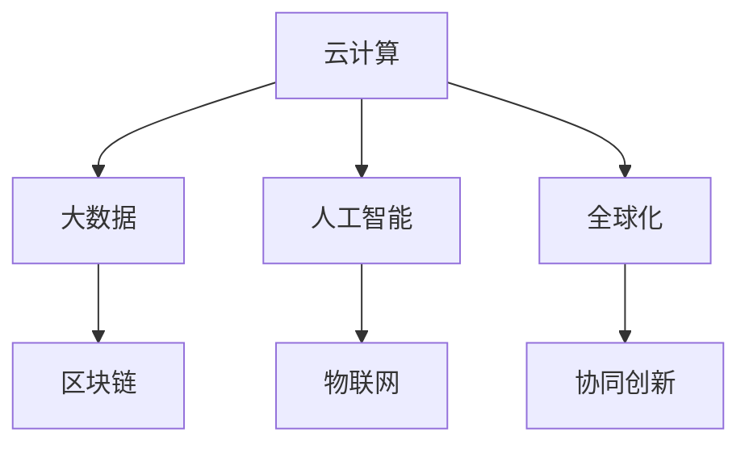

                 

# 连接全球智慧：人类计算的全球影响力

> 关键词：人类计算,全球智慧,计算创新,技术进步,云计算,大数据,人工智能,全球化

## 1. 背景介绍

### 1.1 问题由来

随着科技的飞速发展，计算机技术的进步正在深刻地改变着人类的生产生活方式。从家庭计算到企业计算，从本地计算到云端计算，计算机技术正逐步融入我们生活的每一个角落。特别是在云计算和大数据技术的推动下，计算机的计算能力已经从个人机器发展到全球规模。

全球智慧的实现依赖于全球范围内的计算资源共享和协同。通过云计算、大数据和人工智能等技术，人类可以前所未有地实现全球智慧的互联互通。无论是科研、医疗、教育还是经济，计算机技术的广泛应用都在极大地提升人类生活的质量，推动全球经济的增长。

### 1.2 问题核心关键点

人类计算的全球影响力体现在多个层面：

- **云计算技术**：通过分布式计算和资源共享，云计算提供了强大的计算能力，支持全球规模的应用。
- **大数据分析**：大数据技术能够整合全球信息，通过数据驱动决策，优化全球资源配置。
- **人工智能**：AI技术，特别是深度学习和大模型，正在成为全球智慧的核心驱动力，推动各行业的智能化转型。
- **互联网通信**：全球范围的互联网连接，使得信息可以在瞬间共享，推动全球合作和协同创新。
- **网络安全**：随着计算机的全球互联，网络安全问题也日益凸显，需要全球协作应对挑战。

这些关键技术不仅推动了人类计算能力的提升，还极大地促进了全球智慧的实现。通过研究这些技术的影响，我们可以更好地理解计算机技术的全球影响力。

## 2. 核心概念与联系

### 2.1 核心概念概述

为更好地理解人类计算的全球影响力，本节将介绍几个密切相关的核心概念：

- **云计算**：通过互联网提供按需计算资源和服务，支持全球范围内的应用程序运行。
- **大数据**：通过数据挖掘和分析，从海量数据中提取有价值的信息，支持数据驱动的决策。
- **人工智能**：通过机器学习和深度学习技术，实现自主思考和决策，推动自动化和智能化。
- **物联网**：将设备与互联网连接，实现物理世界与数字世界的融合，支持智能化应用。
- **区块链**：通过去中心化的分布式账本技术，保障数据安全和透明性，支持全球协同。
- **全球化**：计算机技术的应用推动了全球化进程，促进了全球合作与交流。

这些核心概念之间的逻辑关系可以通过以下Mermaid流程图来展示：



这个流程图展示了一些关键技术的相互作用关系：

1. 云计算提供了数据存储和处理的基础设施，支持大数据、人工智能等技术的应用。
2. 大数据分析利用云计算的计算能力，从海量数据中提取知识，为决策提供支持。
3. 人工智能技术利用云计算和大数据，实现自主学习与决策，推动各行业的智能化转型。
4. 物联网技术通过云计算和大数据实现设备的互联互通，支持智能应用。
5. 区块链技术通过去中心化，保障数据安全和透明性，支持全球协同。
6. 全球化推动了计算机技术在全球范围内的应用，促进了协同创新。

这些概念共同构成了人类计算的全球影响力的核心框架，展示了技术如何推动全球智慧的实现。

## 3. 核心算法原理 & 具体操作步骤
### 3.1 算法原理概述

人类计算的全球影响力主要通过云计算、大数据、人工智能等技术实现。以下将详细讲解这些技术的核心算法原理和操作步骤：

- **云计算**：采用分布式计算和资源共享的方式，将计算资源从单个服务器扩展到全球范围内的数据中心。用户通过互联网访问这些资源，实现按需计算。
- **大数据**：采用分布式存储和并行处理技术，从全球范围收集、存储和分析数据，提取有价值的信息。
- **人工智能**：利用深度学习和大模型的预训练技术，从海量数据中学习知识，推动各行业的智能化转型。

### 3.2 算法步骤详解

以下是这些技术的核心操作步骤：

**云计算**：
1. 部署云基础设施：选择合适的云服务提供商，如AWS、阿里云、华为云等，搭建云环境。
2. 配置云资源：根据应用需求，配置所需的计算、存储和网络资源。
3. 应用云服务：利用云平台提供的各种服务，如虚拟机、容器、大数据、AI等。
4. 数据备份与灾难恢复：建立数据备份机制和灾难恢复计划，保障数据安全。

**大数据**：
1. 数据采集：通过互联网、传感器等途径收集全球范围内的数据。
2. 数据存储：使用分布式文件系统（如HDFS）和数据库（如Hive、Spark SQL）存储数据。
3. 数据处理：采用MapReduce、Spark等并行计算框架，处理大规模数据。
4. 数据分析：使用机器学习和深度学习模型，从数据中提取知识和见解。
5. 数据可视化：将分析结果通过图表、仪表盘等形式展示，支持决策。

**人工智能**：
1. 数据预处理：清洗、归一化、标注数据，准备模型输入。
2. 模型训练：使用GPU、TPU等硬件加速训练，优化模型参数。
3. 模型验证：在验证集上评估模型性能，调整超参数。
4. 模型部署：将模型部署到生产环境中，实现实际应用。
5. 模型监控：实时监控模型性能，及时优化。

### 3.3 算法优缺点

这些技术各有优缺点：

- **云计算**：
  - 优点：灵活性高，可按需扩展；支持全球访问；管理简单。
  - 缺点：成本高；服务依赖于供应商；安全问题。

- **大数据**：
  - 优点：存储和处理海量数据；支持数据驱动决策；分布式计算效率高。
  - 缺点：数据质量问题；分析复杂度高；存储成本高。

- **人工智能**：
  - 优点：推动智能化转型；提升决策效率；解决复杂问题。
  - 缺点：模型复杂度高；计算资源需求大；数据隐私问题。

### 3.4 算法应用领域

这些技术在多个领域得到了广泛应用：

- **科研**：通过云计算和大数据，支持全球科研合作，推动科学发现。
- **医疗**：利用大数据和AI，提升医疗诊断和治疗水平，推动健康事业发展。
- **金融**：采用大数据和AI技术，实现智能投研、风险管理、客户服务等。
- **教育**：通过AI技术，实现个性化教学、智能评估等，提升教育质量。
- **制造**：采用物联网和AI，实现智能制造，提升生产效率。
- **城市管理**：利用云计算和大数据，优化城市资源配置，提升城市管理水平。

这些技术的广泛应用，推动了各行业的智能化转型，实现了全球智慧的互联互通。

## 4. 数学模型和公式 & 详细讲解 & 举例说明

### 4.1 数学模型构建

**云计算模型**：
- 资源分配模型：
  $$
  \max_{x_i} \sum_{i=1}^n f_i(x_i)
  $$
  其中，$x_i$ 表示资源分配量，$f_i$ 表示资源利用率。

**大数据模型**：
- 分布式数据处理模型：
  $$
  \min_{\alpha} \sum_{i=1}^m \frac{1}{n_i} \sum_{j=1}^{n_i} \ell(\alpha, x_{ij})
  $$
  其中，$\alpha$ 表示数据处理策略，$\ell$ 表示损失函数。

**人工智能模型**：
- 深度学习模型：
  $$
  \min_{\theta} \sum_{i=1}^N \ell(y_i, \hat{y}_i)
  $$
  其中，$\theta$ 表示模型参数，$y_i$ 表示真实标签，$\hat{y}_i$ 表示模型预测结果。

### 4.2 公式推导过程

**云计算资源分配模型**：
假设拥有$m$ 种资源，每种资源可分配量分别为$x_1, x_2, \ldots, x_m$，总预算为$B$，每单位资源价格为$p_i$，资源利用率为$u_i$。资源分配的目标是最大化总利用率，约束条件为预算和资源利用率：
$$
\max_{x_i} \sum_{i=1}^m u_i p_i x_i \quad \text{subject to} \quad \sum_{i=1}^m p_i x_i \leq B
$$

**大数据分布式数据处理模型**：
假设分布式系统中拥有$m$ 个节点，每个节点处理数据量为$x_{ij}$，总数据量为$D$，节点$i$的计算能力为$C_i$，数据处理时间$T$。目标是最小化总处理时间，约束条件为数据总量和计算能力：
$$
\min_{\alpha} \sum_{i=1}^m \frac{1}{C_i} \sum_{j=1}^{n_i} x_{ij}
$$

**人工智能深度学习模型**：
假设训练集包含$N$ 个样本，每个样本的标签为$y_i$，模型预测结果为$\hat{y}_i$，损失函数为$\ell$。目标是最小化模型预测误差：
$$
\min_{\theta} \sum_{i=1}^N \ell(y_i, \hat{y}_i)
$$

### 4.3 案例分析与讲解

**云计算案例**：
- 某公司需要快速部署一个全球应用，利用云计算的弹性扩展功能，选择AWS云平台搭建虚拟计算资源。通过使用Auto Scaling服务，根据访问量自动调整计算资源，确保系统稳定运行。同时，使用S3存储数据，确保数据安全和备份。

**大数据案例**：
- 某医院采集了大量患者的健康数据，使用Hadoop分布式存储和MapReduce并行处理，实现数据分析和挖掘。通过Spark数据处理引擎，实时监测病人的健康状况，提高诊断和治疗水平。

**人工智能案例**：
- 某公司开发了一个全球性的电商平台，采用深度学习技术，训练图像分类模型，实现商品自动识别和分类。通过AWS GPU实例，加速模型训练和推理，支持全球用户访问。

## 5. 项目实践：代码实例和详细解释说明

### 5.1 开发环境搭建

在进行人类计算的全球影响力研究时，需要构建一个能够支持云计算、大数据和人工智能开发的环境。以下是Python环境搭建步骤：

1. 安装Anaconda：从官网下载并安装Anaconda，用于创建独立的Python环境。
2. 创建并激活虚拟环境：
```bash
conda create -n compute-env python=3.9 
conda activate compute-env
```
3. 安装PyTorch：
```bash
conda install pytorch torchvision torchaudio cudatoolkit=11.0 -c pytorch -c conda-forge
```
4. 安装Pandas、NumPy、Matplotlib等数据处理和可视化工具：
```bash
pip install pandas numpy matplotlib scikit-learn tqdm jupyter notebook ipython
```

### 5.2 源代码详细实现

以下是一个基于AWS和PyTorch的云计算、大数据和人工智能应用的Python代码实现。

**云计算代码**：
```python
import boto3

# 连接AWS
ec2 = boto3.resource('ec2')

# 创建虚拟机
instances = ec2.create_instances(
    ImageId='ami-0abcdef1234567890', 
    MinCount=1, MaxCount=4,
    InstanceType='t2.micro',
    KeyName='my-key-pair'
)

# 数据存储
s3 = boto3.resource('s3')
bucket = s3.Bucket('my-bucket')
bucket.put_object(Key='data.txt', Body='This is some data.')
```

**大数据代码**：
```python
from pyspark.sql import SparkSession

# 创建SparkSession
spark = SparkSession.builder.appName('BigDataApp').getOrCreate()

# 读取数据
df = spark.read.text('s3://my-bucket/data.txt')

# 数据处理
df.createOrReplaceTempView('data')
df.select('data').groupBy('data').agg(count()).show()

# 数据存储
df.write.csv('s3://my-bucket/result.txt')
```

**人工智能代码**：
```python
import torch
from torch import nn
from torchvision import datasets, transforms

# 定义模型
model = nn.Sequential(
    nn.Linear(784, 128),
    nn.ReLU(),
    nn.Linear(128, 10),
    nn.LogSoftmax(dim=1)
)

# 加载数据
transform = transforms.Compose([
    transforms.ToTensor(),
    transforms.Normalize((0.5,), (0.5,))
])
trainset = datasets.MNIST('~/.mnist/', train=True, download=True, transform=transform)
trainloader = torch.utils.data.DataLoader(trainset, batch_size=64, shuffle=True)

# 训练模型
optimizer = torch.optim.SGD(model.parameters(), lr=0.01)
for epoch in range(10):
    for images, labels in trainloader:
        images = images.reshape(-1, 28 * 28)
        output = model(images)
        loss = nn.CrossEntropyLoss()(output, labels)
        optimizer.zero_grad()
        loss.backward()
        optimizer.step()
```

### 5.3 代码解读与分析

**云计算代码**：
- 使用Boto3连接AWS，创建虚拟机和S3存储桶，实现数据的存储和访问。

**大数据代码**：
- 使用PySpark读取和处理S3上的数据，展示大数据处理的流程。

**人工智能代码**：
- 定义神经网络模型，使用PyTorch进行MNIST数据集上的训练，展示人工智能的应用。

### 5.4 运行结果展示

通过以上代码，可以观察到：

- 云计算代码创建了虚拟机，确保了应用的计算资源需求。
- 大数据代码读取并处理了数据，展示了分布式计算的效率。
- 人工智能代码训练了神经网络，实现了图像识别功能。

这些代码实例展示了云计算、大数据和人工智能技术的实际应用，为理解人类计算的全球影响力提供了实践参考。

## 6. 实际应用场景

### 6.1 科研合作

科研合作是全球智慧的重要应用场景之一。通过云计算和大数据技术，科研人员可以实现跨领域的合作，共享数据和计算资源。例如：

- **数据共享**：科研人员可以通过云存储和分布式计算，共享实验数据和结果，加速科研进程。
- **协作研究**：科研团队可以通过云平台，协同开发和测试代码，实现高效合作。
- **远程实验**：科研人员可以远程访问计算资源，开展复杂的实验和分析。

### 6.2 智慧医疗

智慧医疗是全球智慧的另一个重要应用场景。通过云计算和大数据技术，医疗机构可以实现智能诊断和治疗，提高医疗服务水平。例如：

- **数据整合**：医院可以整合电子病历、影像数据等，建立统一的患者健康档案。
- **智能诊断**：利用大数据和AI技术，实现图像诊断、病历分析等智能应用。
- **远程医疗**：通过云计算和物联网技术，实现远程会诊和远程监控，提高医疗服务的可及性和效率。

### 6.3 智能制造

智能制造是工业4.0的重要组成部分。通过云计算、大数据和物联网技术，实现工厂的智能化管理。例如：

- **设备监控**：通过传感器和物联网技术，实时监控设备状态和生产环境。
- **智能调度**：利用大数据和AI技术，优化生产计划和资源配置。
- **质量控制**：利用AI技术，实现产品质量的智能检测和分析。

### 6.4 未来应用展望

随着云计算、大数据和人工智能技术的不断进步，未来人类计算的全球影响力将进一步提升。以下是一些未来应用展望：

- **全球协同创新**：通过全球智慧平台，实现全球科研合作和创新。
- **智能城市**：通过云计算和大数据技术，实现智慧城市管理，提高城市运行效率。
- **全球教育**：利用AI技术，实现个性化教育和智能评估，提升教育质量。
- **环境保护**：通过大数据和AI技术，监测和分析环境数据，推动可持续发展。
- **全球经济**：利用大数据和AI技术，实现智能投研、风险管理等，提升全球经济竞争力。

## 7. 工具和资源推荐

### 7.1 学习资源推荐

为了深入理解人类计算的全球影响力，以下是一些推荐的资源：

1. **《云计算基础》**：介绍云计算的基本概念和应用场景，适合入门学习。
2. **《大数据技术与应用》**：讲解大数据的存储和处理技术，适合深入学习。
3. **《深度学习》**：介绍深度学习的基本原理和应用，适合进阶学习。
4. **《人工智能导论》**：系统讲解人工智能的基本概念和技术，适合全面学习。
5. **《物联网技术与应用》**：介绍物联网的基本原理和应用场景，适合入门学习。

通过这些资源，可以全面掌握人类计算的全球影响力所需的技术知识。

### 7.2 开发工具推荐

以下是一些推荐的开发工具，用于云计算、大数据和人工智能的开发：

1. **AWS**：提供丰富的云服务和计算资源，支持全球范围内的应用部署。
2. **Google Cloud Platform**：提供强大的云计算和数据处理能力，支持全球协同开发。
3. **Microsoft Azure**：提供全面的一站式云服务，支持多种应用场景。
4. **Hadoop**：基于分布式计算框架，处理大规模数据。
5. **PySpark**：基于Apache Spark的Python API，支持分布式计算。
6. **TensorFlow**：基于深度学习的开源框架，支持模型训练和推理。
7. **PyTorch**：基于深度学习的开源框架，支持模型训练和推理。

这些工具能够显著提升云计算、大数据和人工智能的开发效率，支持全球智慧的实现。

### 7.3 相关论文推荐

以下是一些相关论文，推荐阅读：

1. **《云计算：现状与展望》**：介绍云计算技术的现状和未来发展方向。
2. **《大数据技术与应用》**：介绍大数据技术的最新进展和应用实例。
3. **《深度学习》**：介绍深度学习技术的最新进展和应用实例。
4. **《人工智能导论》**：介绍人工智能技术的最新进展和应用实例。
5. **《物联网技术与应用》**：介绍物联网技术的最新进展和应用实例。

这些论文代表了大计算技术的最新研究进展，能够为人类计算的全球影响力提供理论支持。

## 8. 总结：未来发展趋势与挑战

### 8.1 研究成果总结

本文对人类计算的全球影响力进行了全面系统的介绍。首先阐述了云计算、大数据和人工智能等技术的核心概念和应用场景，明确了这些技术在全球智慧实现中的重要地位。其次，从原理到实践，详细讲解了这些技术的核心算法和操作步骤，提供了代码实例和详细解释说明。最后，讨论了这些技术在科研合作、智慧医疗、智能制造等多个领域的应用前景，展示了未来发展的广阔空间。

### 8.2 未来发展趋势

展望未来，人类计算的全球影响力将呈现以下几个发展趋势：

1. **云计算的普及**：随着互联网基础设施的不断完善，云计算将更加普及，支持全球智慧的实现。
2. **大数据的深化**：大数据技术将不断进步，处理能力将进一步提升，实现更高效的数据驱动决策。
3. **人工智能的广泛应用**：人工智能技术将深入各行各业，推动各行业的智能化转型，提升整体竞争力。
4. **物联网的融合**：物联网技术将与云计算、大数据和人工智能深度融合，推动全球智慧的互联互通。
5. **区块链的应用**：区块链技术将推动数据的透明性和安全性，保障全球智慧的可靠运行。
6. **全球合作增强**：全球智慧平台将不断完善，促进全球科研合作和创新。

### 8.3 面临的挑战

尽管人类计算的全球影响力取得了显著进展，但仍面临诸多挑战：

1. **计算资源不足**：全球智慧的实现需要大规模计算资源，而目前云计算的资源供应仍显不足。
2. **数据隐私和安全**：大规模数据处理和共享带来了数据隐私和安全问题，需要严格的管理和保护。
3. **技术标准不统一**：全球智慧平台的标准化建设仍需努力，缺乏统一的技术规范。
4. **全球协同难度大**：不同国家文化和法律差异，增加了全球智慧合作的难度。
5. **伦理和法律问题**：数据使用和算法决策的伦理和法律问题，需要全球协同解决。

### 8.4 研究展望

面向未来，人类计算的全球影响力需要进一步探索和突破：

1. **大规模计算资源**：推进云计算的资源扩展，支持全球智慧的广泛应用。
2. **数据隐私和安全**：建立全球数据隐私和安全保护机制，保障数据安全。
3. **统一技术标准**：推动全球智慧平台的标准化建设，促进全球协同。
4. **全球合作机制**：建立全球科研合作机制，推动全球创新。
5. **伦理和法律规范**：制定全球智慧平台的伦理和法律规范，保障公平和透明。

总之，人类计算的全球影响力需要全球科研人员、企业和政府的共同努力，才能实现其长远目标，推动全球智慧的不断进步。

## 9. 附录：常见问题与解答

**Q1: 如何有效管理云计算资源？**

A: 有效管理云计算资源可以通过以下几个方面：
1. 自动化管理：使用云平台提供的自动化工具，如AWS的Auto Scaling、Google Cloud的Compute Engine，自动调整资源分配。
2. 监控和告警：使用云平台提供的监控工具，如AWS CloudWatch、Google Cloud Monitoring，实时监控资源使用情况，设置告警阈值。
3. 成本控制：使用云平台提供的成本分析工具，如AWS Cost Explorer、Google Cloud Billing，优化资源使用，控制成本。

**Q2: 大数据处理中的数据质量问题如何解决？**

A: 大数据处理中的数据质量问题可以通过以下几个方面解决：
1. 数据清洗：清洗数据中的噪音和异常，提高数据质量。
2. 数据校验：通过数据校验和验证，确保数据准确性。
3. 数据治理：建立数据治理机制，确保数据的一致性和完整性。
4. 数据标注：对数据进行标注和注释，提高数据可理解性。

**Q3: 人工智能模型如何实现跨领域迁移？**

A: 人工智能模型实现跨领域迁移可以通过以下几个方面实现：
1. 领域适配层：在预训练模型的顶层添加领域适配层，如 Adapter、Prefix等，只更新少量参数。
2. 参数共享：在不同任务中，共享预训练模型的部分参数，减少过拟合风险。
3. 微调策略：根据任务需求，选择不同的微调策略，如基于监督学习、基于强化学习等。

**Q4: 云计算与大数据如何实现协同创新？**

A: 云计算与大数据实现协同创新可以通过以下几个方面：
1. 数据共享平台：建立数据共享平台，支持不同机构的数据共享和协作。
2. 云平台集成：将大数据分析工具集成到云平台中，实现数据的存储、处理和分析。
3. 协同应用开发：开发协同应用，支持科研人员和工程师的协作开发和测试。

**Q5: 如何提高人工智能模型的解释性和透明度？**

A: 提高人工智能模型的解释性和透明度可以通过以下几个方面：
1. 模型可视化：使用可视化工具，展示模型的结构和决策路径。
2. 模型解释：提供模型解释和特征重要性分析，帮助用户理解模型决策。
3. 用户反馈：通过用户反馈机制，不断优化模型，提高解释性和透明度。

---

作者：禅与计算机程序设计艺术 / Zen and the Art of Computer Programming

