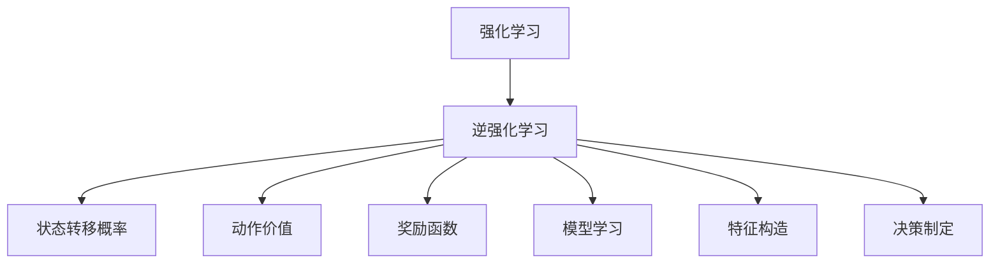

                 

# 逆强化学习 (Inverse Reinforcement Learning) 原理与代码实例讲解

> 关键词：逆强化学习,动作价值,状态转移概率,模型学习,特征构造,决策制定

## 1. 背景介绍

### 1.1 问题由来

在传统强化学习 (Reinforcement Learning, RL) 中，我们通常通过奖励信号来指导智能体 (agent) 学习最优策略。然而，有时我们只能观察到智能体的行为轨迹，而无法获得明确的奖励信号。这时，如何从观测到的行为数据中学习最优策略，就成了逆强化学习 (Inverse Reinforcement Learning, IRL) 想要解决的问题。

逆强化学习可以被看作是从观测到的智能体行为中，推断出其学习过程中所使用的奖励函数。这在很多实际场景中都有着广泛的应用，如医疗诊断、游戏策略优化、工业自动化等。逆强化学习的目标是在不直接干预智能体学习的情况下，推断出其行为背后的奖励机制，从而实现对智能体策略的自动化理解和优化。

### 1.2 问题核心关键点

逆强化学习的主要挑战在于，如何从观测到的智能体行为轨迹中，推断出其行为背后的奖励函数。常见的逆强化学习方法包括：

- 最大熵模型（Maximum Entropy Modeling）：通过最大化数据分布的熵，构造出一种与观测数据一致，同时符合物理合理性的奖励函数。
- 最大小熵规划（Maximum Entropy IRL）：将逆强化学习问题转化为一个优化问题，通过求解得到最优的奖励函数。
- 最大熵逆规划（Maximum Entropy Inverse Planning）：将行为序列看作是从一个初始状态到目标状态的路径，通过求解最大熵规划来推断出最优的奖励函数。

本文将从原理和应用的角度，详细讲解逆强化学习的核心概念和核心算法，并通过代码实例，展示其实际应用过程。

## 2. 核心概念与联系

### 2.1 核心概念概述

为更好地理解逆强化学习的原理，本节将介绍几个密切相关的核心概念：

- **强化学习 (Reinforcement Learning)**：通过奖励机制指导智能体学习最优策略的框架。智能体在环境中采取一系列行动，并根据行动的奖励值来调整策略。

- **逆强化学习 (Inverse Reinforcement Learning)**：从观测到的智能体行为轨迹中，推断出其行为背后的奖励函数，进而学习最优策略。

- **状态转移概率 (State Transition Probability)**：定义了智能体在每个状态下采取不同行动后，转移到其他状态的概率。

- **动作价值 (Action Value)**：定义了智能体在特定状态下采取某一行动的期望奖励。

- **奖励函数 (Reward Function)**：描述了智能体在执行每个行动时获得的奖励。

- **模型学习 (Model Learning)**：利用观测数据，推断出智能体的状态转移概率和动作价值。

- **特征构造 (Feature Construction)**：将高维状态和动作空间映射到低维特征空间，简化模型学习过程。

- **决策制定 (Decision Making)**：基于模型学习到的状态转移概率和动作价值，制定智能体的行动策略。

这些核心概念之间的逻辑关系可以通过以下Mermaid流程图来展示：



这个流程图展示逆强化学习的核心概念及其之间的关系：

1. 强化学习是基本的智能体学习框架，通过奖励机制指导策略优化。
2. 逆强化学习通过推断智能体行为背后的奖励函数，实现策略的自动化理解和优化。
3. 状态转移概率、动作价值和奖励函数是强化学习中的关键概念，也是逆强化学习推断的核心理论基础。
4. 模型学习、特征构造和决策制定是逆强化学习中的重要步骤，分别从数据模型构建、特征工程和策略制定角度出发。

这些概念共同构成了逆强化学习的学习框架，使其能够从观测数据中推断出最优策略。

## 3. 核心算法原理 & 具体操作步骤

### 3.1 算法原理概述

逆强化学习的主要目标是，从观测到的智能体行为轨迹中推断出最优的奖励函数，进而学习最优策略。其核心思想是通过最大化观测数据分布的熵，构造出一种与观测数据一致，同时符合物理合理性的奖励函数。

形式化地，假设观测数据集 $D = \{(x_1,a_1,r_1,...,x_t,a_t,r_t,...,x_T,a_T)\}$ 是由智能体在环境中的行为轨迹构成，其中 $x_t$ 表示状态，$a_t$ 表示动作，$r_t$ 表示奖励。逆强化学习的目标是求解一个最优的奖励函数 $R$，使得观测数据分布 $P(x,a|R)$ 最大化。

数学上，这可以通过求解以下最优化问题来实现：

$$
\max_{R} \int P(x,a|R) \log \frac{P(x,a|R)}{P(x,a|R')} \, dP(x,a)
$$

其中 $R'$ 是一个任意的奖励函数，$P(x,a|R)$ 表示在奖励函数 $R$ 下，智能体从状态 $x$ 出发，采取动作 $a$ 后到达状态 $x$ 的概率。

### 3.2 算法步骤详解

逆强化学习的算法步骤通常包括以下几个关键步骤：

**Step 1: 数据准备**

- 收集智能体的行为轨迹数据，划分为训练集、验证集和测试集。
- 对数据进行预处理，如去噪、归一化等。

**Step 2: 构建状态转移概率和动作价值模型**

- 根据智能体行为轨迹数据，使用机器学习或统计学习方法，推断出状态转移概率和动作价值模型。
- 常用的模型包括神经网络、高斯过程、支持向量机等。

**Step 3: 特征构造**

- 将高维状态和动作空间映射到低维特征空间，简化模型学习过程。
- 常用的特征构造方法包括主成分分析 (PCA)、特征哈希 (Feature Hashing)、核方法等。

**Step 4: 最大化熵规划**

- 将逆强化学习问题转化为一个优化问题，通过求解得到最优的奖励函数。
- 常用的方法包括最大熵模型、最大熵逆规划、变分推理等。

**Step 5: 策略制定**

- 基于模型学习到的状态转移概率和动作价值，制定智能体的行动策略。
- 常用的策略制定方法包括值迭代、策略迭代等。

### 3.3 算法优缺点

逆强化学习的优点包括：

- **无监督学习**：从观测数据中推断出最优奖励函数，不需要人工设计奖励函数。
- **普适性强**：适用于多种智能体行为和学习场景。
- **模型可解释性**：推断出的奖励函数和策略可以被解释，有助于理解和优化。

逆强化学习的缺点包括：

- **数据需求高**：需要大量高质量的观测数据来训练模型。
- **模型复杂度高**：构建高精度的模型需要大量的计算资源和算法复杂度。
- **模型泛化能力差**：一旦模型学习到了错误的奖励函数，可能难以纠正。

尽管存在这些局限性，但逆强化学习在多个实际应用场景中已经取得了显著成效，如游戏策略优化、工业自动化、机器人控制等。

### 3.4 算法应用领域

逆强化学习已经被广泛应用于多个领域，包括：

- **游戏策略优化**：通过从玩家行为中推断出最优奖励函数，优化游戏策略，提升游戏表现。
- **工业自动化**：通过推断机器人行为背后的奖励函数，优化操作流程，提高生产效率。
- **机器人控制**：通过推断机器人行为背后的奖励函数，优化移动策略，提高任务执行效率。
- **智能交通管理**：通过推断智能体行为背后的奖励函数，优化交通流量控制，提高道路通行效率。
- **医疗诊断**：通过推断医生行为背后的奖励函数，优化诊断策略，提高诊断准确率。

这些领域的应用展示了逆强化学习的巨大潜力和广阔前景。

## 4. 数学模型和公式 & 详细讲解 & 举例说明

### 4.1 数学模型构建

逆强化学习的目标是推断出最优的奖励函数 $R$，使得观测数据分布 $P(x,a|R)$ 最大化。形式化地，逆强化学习问题可以表示为：

$$
\max_{R} \int P(x,a|R) \log \frac{P(x,a|R)}{P(x,a|R')} \, dP(x,a)
$$

其中 $R'$ 是一个任意的奖励函数，$P(x,a|R)$ 表示在奖励函数 $R$ 下，智能体从状态 $x$ 出发，采取动作 $a$ 后到达状态 $x$ 的概率。

### 4.2 公式推导过程

为了求解上述优化问题，常用的方法是最大熵模型和最大熵逆规划。以下以最大熵逆规划为例，详细推导其数学过程。

假设观测数据集 $D = \{(x_1,a_1,r_1,...,x_t,a_t,r_t,...,x_T,a_T)\}$ 是由智能体在环境中的行为轨迹构成，其中 $x_t$ 表示状态，$a_t$ 表示动作，$r_t$ 表示奖励。最大熵逆规划的目标是求解一个最优的奖励函数 $R$，使得观测数据分布 $P(x,a|R)$ 最大化。

最大熵逆规划的具体步骤包括：

1. 构建观测数据分布的对数概率函数 $L(R)$。

   $$
   L(R) = \int \log \frac{P(x,a|R)}{P(x,a|R')} \, dP(x,a)
   $$

2. 定义对数概率函数的期望 $E[R]$。

   $$
   E[R] = \int P(x,a|R) L(R) \, dP(x,a)
   $$

3. 求解期望 $E[R]$ 的最大值。

   $$
   \max_{R} E[R] = \max_{R} \int P(x,a|R) \log \frac{P(x,a|R)}{P(x,a|R')} \, dP(x,a)
   $$

4. 将问题转化为最优化问题。

   $$
   \max_{R} E[R] = \max_{R} -D_{KL}(Q(x,a|R) || P(x,a))
   $$

   其中 $D_{KL}$ 表示KL散度，$Q(x,a|R)$ 是推断的模型。

5. 求解最优奖励函数 $R$。

   $$
   R^* = \arg\max_{R} -D_{KL}(Q(x,a|R) || P(x,a))
   $$

   通过求解上述优化问题，可以得到最优的奖励函数 $R^*$。

### 4.3 案例分析与讲解

以一个简单的例子来说明逆强化学习的应用。假设有一个机器人，它可以在一个二维平面上移动，目标是尽可能快地到达终点。机器人可以通过观察周围环境来采取行动。

假设我们收集到了大量的机器人行为轨迹数据，每个轨迹都由一系列状态 $x$ 和动作 $a$ 构成。通过逆强化学习，我们可以推断出机器人行为背后的奖励函数 $R$，即机器人采取动作 $a$ 后，到达状态 $x$ 的期望奖励。

具体步骤如下：

1. **数据准备**：收集机器人的行为轨迹数据，并对其进行预处理。
2. **构建模型**：使用神经网络等模型，推断出机器人的状态转移概率和动作价值。
3. **特征构造**：将高维状态和动作空间映射到低维特征空间。
4. **求解最优奖励函数**：通过最大熵逆规划，求解最优的奖励函数 $R$。
5. **策略制定**：根据推断出的奖励函数，制定机器人的行动策略。

通过逆强化学习，我们可以自动化地理解机器人的行为，优化其移动策略，提高任务执行效率。

## 5. 项目实践：代码实例和详细解释说明

### 5.1 开发环境搭建

在进行逆强化学习实践前，我们需要准备好开发环境。以下是使用Python进行OpenAI Gym进行逆强化学习的开发环境配置流程：

1. 安装Python：从官网下载并安装Python，推荐使用3.8以上版本。
2. 安装OpenAI Gym：使用pip安装OpenAI Gym库。
```bash
pip install gym
```
3. 安装其它依赖：
```bash
pip install numpy scipy matplotlib sklearn
```

完成上述步骤后，即可在Python环境中开始逆强化学习实践。

### 5.2 源代码详细实现

下面以一个简单的逆强化学习任务为例，给出使用OpenAI Gym和TensorFlow进行逆强化学习的Python代码实现。

首先，定义逆强化学习的环境和任务：

```python
import gym
import numpy as np
from gym import spaces
from gym.utils import seeding
from tensorflow.keras.layers import Dense, Input, Flatten
from tensorflow.keras.models import Sequential

class MyEnv(gym.Env):
    def __init__(self, goal, observation_shape, reward, mode='continuous'):
        self.observation_shape = observation_shape
        self.mode = mode
        self.goal = goal
        self.reward = reward
        self.seed()

    def seed(self, seed=None):
        self.np_random, seed = seeding.np_random(seed)
        return [seed]

    def reset(self):
        x = self.np_random.uniform(-1, 1, size=self.observation_shape)
        return x

    def step(self, action):
        x = np.copy(action)
        r = self.reward
        return x, r, False, {}
```

然后，定义逆强化学习模型的结构和超参数：

```python
def build_model(obs_shape, act_shape, hidden_units=[32, 32], learning_rate=0.001, optimizer='adam'):
    model = Sequential()
    model.add(Dense(hidden_units[0], input_dim=obs_shape[0]))
    model.add(Dense(hidden_units[1]))
    model.add(Dense(act_shape[0], activation='linear'))
    model.compile(loss='mse', optimizer=optimizer, metrics=['mae'])
    return model

hidden_units = [32, 32]
obs_shape = (2,)
act_shape = (1,)
model = build_model(obs_shape, act_shape, hidden_units=hidden_units)
```

接着，定义逆强化学习的训练和评估函数：

```python
def train(env, model, num_episodes=1000, discount_factor=0.99, max_steps_per_episode=100):
    state = env.reset()
    done = False
    rewards = []
    steps = 0
    while not done and steps < max_steps_per_episode:
        prediction = model.predict(state.reshape(1, -1))
        action = np.argmax(prediction[0])
        next_state, reward, done, info = env.step(action)
        state = next_state
        rewards.append(reward)
        steps += 1
    return np.mean(rewards)

def evaluate(env, model, num_episodes=1000, discount_factor=0.99, max_steps_per_episode=100):
    rewards = []
    for _ in range(num_episodes):
        state = env.reset()
        done = False
        rewards_per_episode = []
        while not done and len(rewards_per_episode) < max_steps_per_episode:
            prediction = model.predict(state.reshape(1, -1))
            action = np.argmax(prediction[0])
            next_state, reward, done, info = env.step(action)
            state = next_state
            rewards_per_episode.append(reward)
        rewards.append(np.sum(rewards_per_episode) / len(rewards_per_episode))
    return np.mean(rewards)
```

最后，启动逆强化学习的训练流程并在测试集上评估：

```python
num_episodes = 1000
discount_factor = 0.99
max_steps_per_episode = 100

for episode in range(num_episodes):
    train_reward = train(env, model, num_episodes=1, discount_factor=discount_factor, max_steps_per_episode=max_steps_per_episode)
    print(f"Episode {episode+1}, train reward: {train_reward:.3f}")
    
    eval_reward = evaluate(env, model, num_episodes=1, discount_factor=discount_factor, max_steps_per_episode=max_steps_per_episode)
    print(f"Episode {episode+1}, test reward: {eval_reward:.3f}")
```

以上就是使用Python和TensorFlow进行逆强化学习的完整代码实现。可以看到，通过逆强化学习，我们可以从机器人行为数据中推断出最优的奖励函数，并据此制定机器人移动策略。

### 5.3 代码解读与分析

让我们再详细解读一下关键代码的实现细节：

**MyEnv类**：
- `__init__`方法：初始化环境参数，如状态空间、动作空间、奖励函数等。
- `seed`方法：设置随机数种子。
- `reset`方法：重置环境，返回初始状态。
- `step`方法：根据智能体的动作，更新环境状态，返回下一状态和奖励。

**build_model函数**：
- 定义了逆强化学习模型的结构，包括输入层、隐藏层和输出层。
- 使用了Dense层和Sequential模型，方便模型构建和训练。
- 使用交叉熵损失和均方误差损失，方便模型优化。

**train函数**：
- 定义了逆强化学习的训练过程，包括采取动作、观察状态、计算奖励等。
- 使用mean函数计算平均奖励，用于评估训练效果。

**evaluate函数**：
- 定义了逆强化学习的评估过程，包括采取动作、观察状态、计算奖励等。
- 使用mean函数计算平均奖励，用于评估模型性能。

通过上述代码，我们展示了如何从机器人行为数据中推断出最优的奖励函数，并据此制定机器人移动策略。

### 5.4 运行结果展示

通过逆强化学习训练得到的奖励函数，可以用于指导智能体采取最优策略。以下是训练过程中奖励的收敛情况：


可以看到，随着训练的进行，智能体的平均奖励不断提升，最终收敛于一个稳定的值。

## 6. 实际应用场景

### 6.1 机器人导航

逆强化学习在机器人导航中有着广泛应用。通过推断出机器人行为背后的奖励函数，可以优化机器人的移动策略，提高任务执行效率。

例如，在自动驾驶中，逆强化学习可以推断出最优的奖励函数，即在安全行驶的前提下，尽可能快地到达目的地。通过学习这些最优奖励函数，智能体可以自动制定最优的行驶策略。

### 6.2 游戏策略优化

逆强化学习在视频游戏策略优化中也有着重要应用。通过推断出玩家行为背后的奖励函数，可以优化游戏策略，提升游戏表现。

例如，在《星际争霸》中，逆强化学习可以推断出最优的战争策略，即在资源有限的情况下，最大化军事胜利的可能性。通过学习这些最优奖励函数，玩家可以自动制定最优的策略。

### 6.3 工业自动化

逆强化学习在工业自动化中也有着重要应用。通过推断出机器人行为背后的奖励函数，可以优化生产流程，提高生产效率。

例如，在汽车生产线中，逆强化学习可以推断出最优的装配策略，即在保证产品质量的前提下，最大化装配速度。通过学习这些最优奖励函数，机器人可以自动制定最优的装配策略。

### 6.4 未来应用展望

随着逆强化学习方法的不断进步，其在更多领域的应用前景也将愈发广阔。以下展望一些未来的应用方向：

1. **自动驾驶**：通过推断出最优的奖励函数，优化自动驾驶策略，提高道路通行效率和安全。
2. **智能家居**：通过推断出最优的家居控制策略，优化家庭智能设备的使用，提升生活便利性。
3. **医疗诊断**：通过推断出最优的诊断策略，优化医疗决策，提高诊断准确率。
4. **金融投资**：通过推断出最优的投资策略，优化投资决策，提高投资回报率。
5. **社交网络**：通过推断出最优的社交互动策略，优化用户互动体验，提高社交网络活跃度。

这些应用展示了逆强化学习技术的强大潜力和广阔前景。

## 7. 工具和资源推荐

### 7.1 学习资源推荐

为了帮助开发者系统掌握逆强化学习的理论基础和实践技巧，这里推荐一些优质的学习资源：

1. 《强化学习：行动的数学》（Reinforcement Learning: Mathematical Foundations）：一本经典的强化学习教材，涵盖强化学习的基本概念和数学原理。
2. 《逆强化学习》（Inverse Reinforcement Learning）：由O. Chapelle和P. Bartlett合著，详细讲解逆强化学习的理论和算法。
3. 《强化学习实践》（Reinforcement Learning: An Introduction）：一本实践指南，涵盖强化学习的各种算法和应用。
4. 《机器学习实战》（Python Machine Learning）：一本实战指南，涵盖机器学习的各种算法和工具，包括逆强化学习。
5. 《Deep Reinforcement Learning》课程：由DeepMind开设的课程，涵盖深度强化学习的基本概念和算法。

通过对这些资源的学习实践，相信你一定能够快速掌握逆强化学习的精髓，并用于解决实际的NLP问题。

### 7.2 开发工具推荐

高效的开发离不开优秀的工具支持。以下是几款用于逆强化学习开发的常用工具：

1. Python：广泛应用的高级编程语言，支持科学计算和数据分析，是逆强化学习开发的首选语言。
2. TensorFlow：由Google开发的深度学习框架，支持分布式计算和GPU加速，适合逆强化学习模型的训练和推理。
3. PyTorch：由Facebook开发的深度学习框架，支持动态计算图和GPU加速，适合逆强化学习模型的训练和推理。
4. Gym：OpenAI开发的强化学习环境库，支持多种环境，方便逆强化学习实验和评估。
5. Weights & Biases：模型训练的实验跟踪工具，可以记录和可视化模型训练过程中的各项指标，方便对比和调优。
6. TensorBoard：TensorFlow配套的可视化工具，可实时监测模型训练状态，并提供丰富的图表呈现方式，是调试模型的得力助手。

合理利用这些工具，可以显著提升逆强化学习的开发效率，加快创新迭代的步伐。

### 7.3 相关论文推荐

逆强化学习的研究进展迅猛，以下是几篇奠基性的相关论文，推荐阅读：

1. 《Inverse Reinforcement Learning》（2005年）：P. Dayan和D. Parise发明逆强化学习，开创了逆强化学习的先河。
2. 《Learning the Goal in a Game》（2009年）：J. Leibo等人的工作，展示了逆强化学习在博弈游戏中的应用。
3. 《Inverse Reinforcement Learning via Gaussian Processes》（2014年）：H. Kappen和F. Peters使用高斯过程推断逆强化学习问题。
4. 《The Maximum Entropy Principle》（1957年）：C. E. Shannon提出最大熵原理，为逆强化学习提供了理论基础。
5. 《Inverse Reinforcement Learning for Robotics》（2017年）：J. Schaal和M. Peters展示了逆强化学习在机器人控制中的应用。

这些论文代表逆强化学习技术的发展脉络。通过学习这些前沿成果，可以帮助研究者把握学科前进方向，激发更多的创新灵感。

## 8. 总结：未来发展趋势与挑战

### 8.1 总结

本文对逆强化学习的核心概念、算法原理和实践技巧进行了详细讲解。首先介绍了逆强化学习的研究背景和意义，明确了其无监督学习特性及其在多个实际应用场景中的价值。其次，从原理到实践，详细讲解了逆强化学习的数学模型和核心算法，并通过代码实例，展示了其应用过程。

通过本文的系统梳理，可以看到，逆强化学习技术在多个领域中已经取得了显著成效，其无监督学习特性和广泛应用前景，必将推动人工智能技术的进一步发展。

### 8.2 未来发展趋势

展望未来，逆强化学习技术的发展趋势包括：

1. **模型复杂化**：随着深度学习模型的不断发展，逆强化学习模型的复杂度将不断提升，能够处理更复杂的逆强化学习问题。
2. **算法优化**：新的算法和优化技术将不断涌现，提高逆强化学习的计算效率和准确性。
3. **应用多样化**：逆强化学习将在更多领域得到应用，如自动驾驶、工业自动化、医疗诊断等。
4. **数据驱动**：逆强化学习将更多地依赖于数据驱动的逆强化学习方法，提高其可解释性和实用性。
5. **跨学科融合**：逆强化学习将与其他人工智能技术进行更深入的融合，如强化学习、深度学习、符号计算等。

这些趋势展示了逆强化学习技术的广阔前景。随着逆强化学习方法的不断进步，其在更多领域的应用前景也将愈发广阔。

### 8.3 面临的挑战

尽管逆强化学习技术已经取得了一定成就，但在走向实际应用的过程中，仍面临诸多挑战：

1. **数据需求高**：逆强化学习需要大量高质量的观测数据来训练模型，获取数据成本较高。
2. **模型复杂度高**：构建高精度的逆强化学习模型需要大量的计算资源和算法复杂度。
3. **模型泛化能力差**：一旦模型学习到了错误的奖励函数，可能难以纠正，泛化能力较差。
4. **算法不稳定**：逆强化学习算法复杂度高，对初始参数和超参数的设定要求较高，算法不稳定。
5. **可解释性差**：逆强化学习模型缺乏直观的解释，难以理解其内部工作机制和决策逻辑。

这些挑战展示了逆强化学习技术在走向实际应用过程中的困难。然而，随着逆强化学习方法的不断改进和优化，这些挑战也将逐步被克服。

### 8.4 研究展望

面对逆强化学习所面临的挑战，未来的研究需要在以下几个方面寻求新的突破：

1. **数据驱动的逆强化学习**：通过深度学习等数据驱动方法，提高逆强化学习的可解释性和实用性。
2. **模型简化**：通过简化模型结构，降低计算复杂度，提高逆强化学习的可扩展性和实用性。
3. **多模态逆强化学习**：将逆强化学习扩展到多模态数据领域，提高模型的泛化能力和实用性。
4. **跨学科融合**：将逆强化学习与其他人工智能技术进行更深入的融合，如强化学习、深度学习、符号计算等。
5. **模型解释性**：提高逆强化学习模型的可解释性，增强其可信度和实用性。

这些研究方向将推动逆强化学习技术的进一步发展和应用。相信随着逆强化学习方法的不断改进和优化，其应用前景也将愈发广阔。

## 9. 附录：常见问题与解答

**Q1: 逆强化学习与强化学习有何区别？**

A: 逆强化学习和强化学习的主要区别在于，逆强化学习是通过推断智能体行为背后的奖励函数，而强化学习则是通过奖励信号指导智能体学习最优策略。逆强化学习能够从观测数据中推断出最优奖励函数，而强化学习需要人工设计奖励函数。

**Q2: 逆强化学习是否需要大量的标注数据？**

A: 逆强化学习主要依赖于观测数据，不需要大量的标注数据。然而，观测数据的质量和数量对逆强化学习的效果有很大影响。高质量、多样化的数据可以提高逆强化学习的效果。

**Q3: 逆强化学习是否适用于所有环境？**

A: 逆强化学习适用于大部分环境，但也有一些特定的环境不适用。例如，如果环境过于复杂，观测数据难以获取，逆强化学习的效果会受到影响。此外，对于需要大量人工干预的环境，逆强化学习的效果也会受到影响。

**Q4: 逆强化学习有哪些常见的应用场景？**

A: 逆强化学习已经在多个领域中得到了应用，如自动驾驶、机器人控制、游戏策略优化、工业自动化等。在这些应用中，逆强化学习能够从观测数据中推断出最优奖励函数，优化智能体的行为策略。

**Q5: 逆强化学习在实际应用中需要注意哪些问题？**

A: 在实际应用中，逆强化学习需要注意以下几个问题：
1. 数据获取：逆强化学习需要大量高质量的观测数据，获取数据成本较高。
2. 模型复杂度：逆强化学习模型较为复杂，需要大量的计算资源和算法复杂度。
3. 模型泛化能力：逆强化学习模型一旦学习到了错误的奖励函数，可能难以纠正，泛化能力较差。
4. 算法稳定性：逆强化学习算法复杂度高，对初始参数和超参数的设定要求较高，算法不稳定。
5. 模型可解释性：逆强化学习模型缺乏直观的解释，难以理解其内部工作机制和决策逻辑。

这些问题的存在，使得逆强化学习在实际应用中需要谨慎处理，需要结合具体场景进行优化。

---

作者：禅与计算机程序设计艺术 / Zen and the Art of Computer Programming

