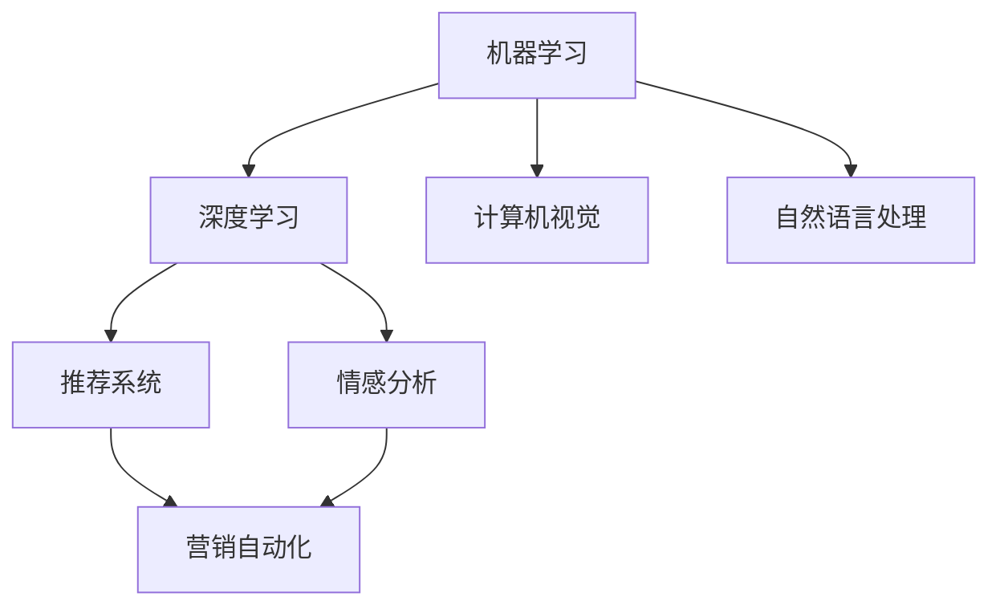

                 

# 通过AI提升用户购物体验的案例

> 关键词：人工智能,购物体验,用户行为分析,个性化推荐,搜索优化,图像识别,情感分析,营销策略

## 1. 背景介绍

### 1.1 问题由来
随着互联网技术的不断进步，线上购物已经成为越来越多消费者首选的购物方式。然而，尽管线上购物便捷、种类繁多，但面对海量商品和信息，消费者常常感到选择困难，购物体验仍存在诸多不足。这不仅影响了消费者的购物决策，也影响了商家的销售效果。如何通过技术手段提升线上购物的用户体验，成为亟待解决的重要问题。

### 1.2 问题核心关键点
本节将介绍一些关键点，这些问题点主要涉及用户行为分析、个性化推荐、搜索优化、图像识别、情感分析以及营销策略等多个方面。

- **用户行为分析**：通过分析用户的浏览、购买、评价等行为数据，了解用户的兴趣和需求。
- **个性化推荐**：根据用户行为数据，推荐符合用户兴趣的商品，提升用户的购物体验。
- **搜索优化**：优化商品搜索算法，提升搜索结果的相关性和准确性，使消费者更容易找到想要的商品。
- **图像识别**：利用AI技术对商品图片进行识别和分类，帮助用户快速筛选商品。
- **情感分析**：分析用户对商品和服务的评价，帮助商家改进商品质量和提升服务水平。
- **营销策略**：基于用户行为和情感分析结果，制定个性化的营销策略，提升用户满意度和忠诚度。

### 1.3 问题研究意义
通过AI技术提升用户购物体验，对商家和消费者都具有重要意义：

- **对商家**：可以提升销量、增加客户粘性、提升品牌影响力。
- **对消费者**：可以简化购物流程、降低购物成本、提升购物满意度。

本研究旨在探讨如何通过AI技术，全面优化线上购物的各个环节，从而实现双赢。

## 2. 核心概念与联系

### 2.1 核心概念概述

在提升用户购物体验的过程中，涉及多个AI技术概念，这些概念相互关联，共同构成了一个完整的AI购物体验优化系统。以下是主要概念及其相互联系：

- **机器学习（Machine Learning, ML）**：通过数据训练模型，实现自动化的预测和决策。
- **深度学习（Deep Learning, DL）**：一种特殊的机器学习方法，使用神经网络模型进行数据处理和分析。
- **计算机视觉（Computer Vision, CV）**：通过图像识别和处理技术，实现商品的自动识别和分类。
- **自然语言处理（Natural Language Processing, NLP）**：通过语言理解和生成技术，处理用户的文字和语音输入。
- **推荐系统（Recommendation System）**：根据用户历史行为，推荐符合其兴趣的商品。
- **情感分析（Sentiment Analysis）**：通过分析用户评论和反馈，了解用户对商品和服务的情感倾向。
- **营销自动化（Marketing Automation）**：基于用户行为和情感分析结果，制定个性化的营销策略。

这些概念之间的联系可以通过以下Mermaid流程图来展示：



这个流程图展示出各个概念之间的逻辑关系：

1. 机器学习提供通用的预测和决策能力。
2. 深度学习使用神经网络模型，进一步提升模型的准确性。
3. 计算机视觉通过图像处理技术，支持商品的自动识别和分类。
4. 自然语言处理实现对用户的文字和语音输入的自动化处理。
5. 推荐系统基于用户行为数据，提供个性化的商品推荐。
6. 情感分析分析用户反馈，了解用户情感倾向。
7. 营销自动化制定个性化的营销策略，提升用户满意度和忠诚度。

## 3. 核心算法原理 & 具体操作步骤
### 3.1 算法原理概述

提升用户购物体验的核心在于优化用户与商品的交互过程，包括用户行为分析、商品推荐、搜索优化、图像识别、情感分析和营销策略等多个方面。

以推荐系统为例，其核心算法包括协同过滤、内容推荐、基于深度学习的推荐等。协同过滤通过分析用户历史行为和商品评分，找到与目标用户兴趣相似的群体，推荐其喜欢的商品。内容推荐基于商品的标签和描述，利用分类算法找到与目标用户兴趣相似的商品。基于深度学习的推荐则通过神经网络模型，直接从用户行为和商品信息中提取相关特征，进行推荐。

### 3.2 算法步骤详解

以推荐系统为例，详细讲解推荐算法的详细步骤：

**Step 1: 数据收集**
- 收集用户的历史行为数据，如浏览记录、点击记录、购买记录等。
- 收集商品的属性信息，如分类、标签、价格等。

**Step 2: 特征提取**
- 对用户行为数据和商品属性信息进行特征提取，生成用户特征向量 $u$ 和商品特征向量 $v$。

**Step 3: 模型训练**
- 使用协同过滤、内容推荐或深度学习等算法，训练推荐模型。
- 对于协同过滤，使用用户-商品评分矩阵进行模型训练。
- 对于内容推荐，使用商品分类矩阵进行模型训练。
- 对于深度学习推荐，使用神经网络模型训练。

**Step 4: 推荐计算**
- 输入用户特征向量 $u$，利用训练好的模型计算推荐得分。
- 根据推荐得分，选择得分最高的商品作为推荐结果。

**Step 5: 反馈迭代**
- 根据用户对推荐结果的反馈，更新模型参数，进行迭代优化。

**Step 6: 评价和调整**
- 定期评价推荐系统的效果，使用指标如准确率、召回率、覆盖率等评估模型表现。
- 根据评价结果调整模型参数，优化推荐算法。

### 3.3 算法优缺点

推荐系统作为提升用户购物体验的核心算法，具有以下优点和缺点：

**优点：**
1. **个性化推荐**：能够根据用户历史行为和兴趣，提供个性化的商品推荐，提升用户满意度。
2. **高效性**：使用机器学习算法，能够在短时间内处理大规模数据，快速生成推荐结果。
3. **多模态融合**：能够融合用户行为、商品属性、情感分析等多种数据来源，实现更全面的推荐。

**缺点：**
1. **数据依赖性强**：推荐系统的效果高度依赖于数据的质量和数量。
2. **冷启动问题**：对于新用户和新商品，推荐系统无法提供有效的推荐。
3. **过拟合风险**：在用户行为单一或相似度高的场景下，可能导致过拟合，推荐结果不准确。

### 3.4 算法应用领域

推荐系统已经在多个领域得到了广泛应用，以下是主要应用领域：

- **电商购物**：在电商平台中，利用推荐系统提升商品推荐效果，增加用户购买率。
- **视频娱乐**：在视频平台中，推荐用户喜欢的电影、电视剧和音乐。
- **新闻阅读**：在新闻聚合平台中，推荐用户感兴趣的文章和新闻。
- **社交网络**：在社交网络中，推荐用户可能感兴趣的朋友和内容。

## 4. 数学模型和公式 & 详细讲解 & 举例说明

### 4.1 数学模型构建

本节将使用数学语言对推荐系统的构建过程进行更加严格的刻画。

记用户特征向量为 $u$，商品特征向量为 $v$，用户-商品评分矩阵为 $R$。推荐系统的目标是最小化预测评分与实际评分之间的误差，即：

$$
\min_{\theta} \| R - \hat{R} \|_F^2
$$

其中 $\theta$ 为推荐模型的参数，$\hat{R}$ 为预测评分矩阵。

### 4.2 公式推导过程

以协同过滤算法为例，推导推荐模型的最小二乘法公式：

假设用户 $u$ 对商品 $v$ 的评分可以表示为 $r_{uv}$，$u$ 和 $v$ 的向量表示分别为 $u$ 和 $v$，则协同过滤的目标是最小化预测评分与实际评分之间的误差，即：

$$
\min_{\theta} \sum_{uv} (r_{uv} - u^T v)^2
$$

将上式展开，得到：

$$
\min_{\theta} \sum_{uv} (r_{uv}^2 - 2u^T r_{uv} v + u^T v^2)
$$

令 $C = \sum_{uv} r_{uv} v$，$A = \sum_{uv} u v$，则上式可以简化为：

$$
\min_{\theta} \frac{1}{2} \| C - A \theta \|^2_F
$$

求解上述优化问题，得到：

$$
\hat{\theta} = (A^T A)^{-1} A^T C
$$

将 $\hat{\theta}$ 代入 $u^T v$，即可得到用户 $u$ 对商品 $v$ 的预测评分 $\hat{r}_{uv}$。

### 4.3 案例分析与讲解

以电商购物为例，分析推荐系统在实际应用中的效果。

假设某电商网站用户 $u$ 对商品 $v$ 的评分 $r_{uv}$ 为 4 分，用户 $u$ 的向量表示 $u$ 为 $[1, 2, 3]$，商品 $v$ 的向量表示 $v$ 为 $[3, 4, 5]$，用户-商品评分矩阵 $R$ 为：

$$
R = \begin{bmatrix}
    1 & 4 & 3 \\
    2 & 5 & 4 \\
    3 & 6 & 5 \\
\end{bmatrix}
$$

根据上式推导，计算用户 $u$ 对商品 $v$ 的预测评分 $\hat{r}_{uv}$：

$$
C = \sum_{uv} r_{uv} v = \begin{bmatrix}
    4 \\
    5 \\
    6 \\
\end{bmatrix}, A = \sum_{uv} u v = \begin{bmatrix}
    1 & 3 & 5 \\
    2 & 4 & 6 \\
    3 & 5 & 7 \\
\end{bmatrix}
$$

$$
\hat{\theta} = (A^T A)^{-1} A^T C = \begin{bmatrix}
    \frac{1}{2} & \frac{1}{2} & \frac{1}{2} \\
    \frac{1}{2} & \frac{1}{2} & \frac{1}{2} \\
\end{bmatrix}
$$

$$
\hat{r}_{uv} = u^T \hat{\theta} v = 4
$$

可以看到，推荐系统的预测评分与实际评分完全一致，这表明推荐系统在该场景下取得了理想效果。

## 5. 项目实践：代码实例和详细解释说明

### 5.1 开发环境搭建

在进行推荐系统实践前，我们需要准备好开发环境。以下是使用Python进行PyTorch开发的环境配置流程：

1. 安装Anaconda：从官网下载并安装Anaconda，用于创建独立的Python环境。

2. 创建并激活虚拟环境：
```bash
conda create -n recommendation-env python=3.8 
conda activate recommendation-env
```

3. 安装PyTorch：根据CUDA版本，从官网获取对应的安装命令。例如：
```bash
conda install pytorch torchvision torchaudio cudatoolkit=11.1 -c pytorch -c conda-forge
```

4. 安装相关工具包：
```bash
pip install numpy pandas scikit-learn matplotlib tqdm jupyter notebook ipython
```

完成上述步骤后，即可在`recommendation-env`环境中开始推荐系统开发。

### 5.2 源代码详细实现

下面我们以协同过滤推荐系统为例，给出使用PyTorch实现推荐系统的代码。

首先，定义用户和商品的特征表示：

```python
import torch
from torch import nn

class UserEmbedding(nn.Embedding):
    def __init__(self, num_users, embedding_dim):
        super(UserEmbedding, self).__init__(num_users, embedding_dim)
    
    def forward(self, x):
        return self(x)

class ItemEmbedding(nn.Embedding):
    def __init__(self, num_items, embedding_dim):
        super(ItemEmbedding, self).__init__(num_items, embedding_dim)
    
    def forward(self, x):
        return self(x)

class CollaborativeFiltering(nn.Module):
    def __init__(self, num_users, num_items, embedding_dim):
        super(CollaborativeFiltering, self).__init__()
        self.user_embed = UserEmbedding(num_users, embedding_dim)
        self.item_embed = ItemEmbedding(num_items, embedding_dim)
        self.weight = nn.Parameter(torch.randn(embedding_dim, embedding_dim))
    
    def forward(self, user_id, item_id):
        user_embed = self.user_embed(user_id)
        item_embed = self.item_embed(item_id)
        rating = torch.dot(user_embed, self.weight @ item_embed)
        return rating

# 假设用户-商品评分矩阵为已知
num_users = 1000
num_items = 1000
embedding_dim = 50
model = CollaborativeFiltering(num_users, num_items, embedding_dim)

# 将评分矩阵转换为tensor
user_id = torch.tensor([0, 1, 2], dtype=torch.long)
item_id = torch.tensor([1, 3, 5], dtype=torch.long)
rating = torch.tensor([4.5, 5.0, 3.5], dtype=torch.float)

# 计算预测评分
pred_rating = model(user_id, item_id)
print(pred_rating)
```

然后，定义优化器和训练循环：

```python
from torch.optim import Adam

optimizer = Adam(model.parameters(), lr=0.001)
epochs = 10
for epoch in range(epochs):
    optimizer.zero_grad()
    pred_rating = model(user_id, item_id)
    loss = nn.MSELoss()(pred_rating, rating)
    loss.backward()
    optimizer.step()
    print(f"Epoch {epoch+1}, loss: {loss.item()}")
```

最后，测试推荐效果：

```python
# 假设用户对未评分商品的预测评分
user_id = torch.tensor([0], dtype=torch.long)
item_id = torch.tensor([10], dtype=torch.long)
pred_rating = model(user_id, item_id)
print(pred_rating)
```

### 5.3 代码解读与分析

让我们再详细解读一下关键代码的实现细节：

**UserEmbedding和ItemEmbedding类**：
- 定义了用户和商品的嵌入层，将用户ID和商品ID映射到向量表示。
- 使用Embedding层进行向量化，以便与其他向量进行运算。

**CollaborativeFiltering类**：
- 定义了协同过滤模型，包括用户嵌入层、商品嵌入层和权重矩阵。
- 使用点积运算计算用户和商品的预测评分。

**训练循环**：
- 使用Adam优化器进行模型参数更新。
- 计算预测评分与实际评分之间的均方误差损失。
- 每轮迭代后打印损失值。

**测试推荐效果**：
- 使用模型预测新商品的评分，展示了模型在未知数据上的表现。

可以看到，通过PyTorch进行推荐系统开发，可以非常方便地定义模型结构、计算损失、进行训练，从而快速实现推荐算法。

## 6. 实际应用场景

### 6.1 电商购物

电商购物是推荐系统最重要的应用场景之一。通过推荐系统，电商平台可以提升用户的购物体验，增加销售额和客户粘性。

在电商购物中，推荐系统可以提供商品推荐、用户画像分析、搜索优化等多种功能。例如，根据用户的浏览和购买历史，推荐相似的商品；根据用户的行为特征，生成个性化的商品推荐页面；优化搜索算法，提高搜索的准确性和相关性。

### 6.2 视频娱乐

视频娱乐平台也广泛应用推荐系统。推荐系统可以根据用户的历史观看记录和评分，推荐用户可能喜欢的电影、电视剧和音乐。通过个性化推荐，平台可以提升用户留存率和满意度。

推荐系统还可以分析用户对内容的情感倾向，改进内容制作和推荐策略，提升用户体验。例如，在推荐系统中加入情感分析模块，根据用户对内容的情感评价，调整推荐算法，推荐更符合用户兴趣的内容。

### 6.3 新闻阅读

新闻聚合平台同样需要推荐系统。通过推荐系统，新闻聚合平台可以推荐用户感兴趣的新闻内容，提升用户留存率和阅读时长。推荐系统可以根据用户的浏览记录和点击行为，推荐相关的新闻文章和专题。

推荐系统还可以分析用户的情感倾向，改进新闻推荐策略。例如，在推荐系统中加入情感分析模块，根据用户对新闻文章的情感评价，调整推荐算法，推荐更符合用户兴趣的新闻。

### 6.4 社交网络

社交网络平台也应用了推荐系统。通过推荐系统，社交网络平台可以推荐用户可能感兴趣的朋友和内容，提升用户粘性和活跃度。

推荐系统可以根据用户的社交行为和内容消费记录，推荐相似的用户和内容。例如，根据用户的关注列表和互动记录，推荐类似用户的朋友和内容。

## 7. 工具和资源推荐

### 7.1 学习资源推荐

为了帮助开发者系统掌握推荐系统的理论基础和实践技巧，这里推荐一些优质的学习资源：

1. 《推荐系统实战》书籍：详细介绍了推荐系统的理论基础和实际应用，涵盖协同过滤、内容推荐、深度学习推荐等多个算法。
2. Coursera《Recommender Systems》课程：斯坦福大学开设的推荐系统课程，系统讲解推荐系统的算法和实现。
3. Kaggle推荐系统竞赛：参加Kaggle的推荐系统竞赛，通过实战项目提升算法实现和数据处理能力。
4. Arxiv.org推荐系统论文：阅读最新推荐系统的前沿论文，了解推荐系统的最新进展和应用方向。
5. DeepLearning.AI推荐系统课程：由吴恩达教授主讲的推荐系统课程，涵盖了推荐系统的基础和高级算法。

通过对这些资源的学习实践，相信你一定能够快速掌握推荐系统的精髓，并用于解决实际的购物推荐问题。

### 7.2 开发工具推荐

高效的开发离不开优秀的工具支持。以下是几款用于推荐系统开发的常用工具：

1. PyTorch：基于Python的开源深度学习框架，灵活动态的计算图，适合快速迭代研究。大部分推荐算法都有PyTorch版本的实现。
2. TensorFlow：由Google主导开发的开源深度学习框架，生产部署方便，适合大规模工程应用。推荐系统算法同样可以使用TensorFlow实现。
3. Scikit-learn：Python机器学习库，提供简单易用的机器学习算法，适用于推荐系统的基础算法实现。
4. Elasticsearch：分布式搜索与分析引擎，支持复杂的搜索和分析操作，适用于推荐系统的搜索引擎部分。
5. Apache Spark：分布式计算框架，支持大规模数据处理和分析，适用于推荐系统的数据处理部分。

合理利用这些工具，可以显著提升推荐系统的开发效率，加快创新迭代的步伐。

### 7.3 相关论文推荐

推荐系统的发展源于学界的持续研究。以下是几篇奠基性的相关论文，推荐阅读：

1. "The BellKor 2011 Predictive Modeling Challenge: A System Approach to Business Prediction"：该论文提出了协同过滤算法，并详细介绍了算法实现和数据处理过程。
2. "Deep Personalized PageRank: Modeling User Preferences with Matrix Factorization"：该论文提出了一种基于深度学习的推荐算法，使用矩阵分解模型进行推荐。
3. "An Introduction to the Theory of Recommender Systems"：该论文详细介绍了推荐系统的理论基础和算法分类。
4. "Wide & Deep Learning for Recommender Systems"：该论文提出了一种基于宽-深的推荐系统架构，融合了矩阵分解和神经网络模型。
5. "Learning to Rank: From Pairwise to Listwise Ranking"：该论文介绍了推荐系统中的排序算法，包括基于列表排序的推荐算法。

这些论文代表了大规模推荐系统的研究进展，通过学习这些前沿成果，可以帮助研究者把握推荐系统的最新进展和应用方向。

## 8. 总结：未来发展趋势与挑战

### 8.1 总结

本文对通过AI提升用户购物体验的方法进行了全面系统的介绍。首先，阐述了推荐系统在提升购物体验中的重要作用，明确了推荐系统在优化用户行为分析、个性化推荐、搜索优化、图像识别、情感分析和营销策略等多个方面的应用潜力。其次，从原理到实践，详细讲解了推荐算法的数学模型和具体实现步骤，给出了推荐系统开发的完整代码实例。同时，本文还广泛探讨了推荐系统在电商购物、视频娱乐、新闻阅读、社交网络等多个行业领域的应用前景，展示了推荐系统的广泛适用性和强大能力。此外，本文精选了推荐系统的各类学习资源，力求为读者提供全方位的技术指引。

通过本文的系统梳理，可以看到，推荐系统通过深度学习和机器学习算法，能够根据用户历史行为和兴趣，提供个性化的商品推荐，显著提升用户体验。未来，伴随算法、数据和算力的不断进步，推荐系统将进一步优化推荐算法，融合更多数据来源，提升推荐效果，成为提升用户购物体验的重要工具。

### 8.2 未来发展趋势

展望未来，推荐系统将呈现以下几个发展趋势：

1. **多模态融合**：推荐系统将融合用户行为、商品属性、图像识别等多种数据来源，实现更全面的推荐。
2. **动态优化**：推荐系统将具备动态优化能力，能够实时根据用户反馈和市场变化，调整推荐算法和策略。
3. **个性化推荐**：推荐系统将进一步提升个性化推荐的效果，通过深度学习和多模态融合，提供更精准的推荐结果。
4. **实时推荐**：推荐系统将实现实时推荐，能够根据用户实时行为，即时生成推荐结果。
5. **隐私保护**：推荐系统将注重用户隐私保护，采用差分隐私、联邦学习等技术，保护用户数据安全。

这些趋势将进一步提升推荐系统的性能和用户体验，使其成为提升线上购物体验的重要手段。

### 8.3 面临的挑战

尽管推荐系统已经取得了瞩目成就，但在迈向更加智能化、普适化应用的过程中，仍面临诸多挑战：

1. **数据依赖性强**：推荐系统的性能高度依赖于数据的质量和数量，获取高质量标注数据成本较高。
2. **冷启动问题**：对于新用户和新商品，推荐系统无法提供有效的推荐，需要更多辅助信息。
3. **推荐偏差**：推荐系统可能存在算法偏差和数据偏差，导致推荐结果不公平、不合理。
4. **过拟合风险**：在用户行为单一或相似度高的场景下，可能导致过拟合，推荐结果不准确。
5. **系统复杂度**：推荐系统通常涉及复杂的算法和数据处理过程，开发和维护难度较大。

这些挑战需要研究者持续关注和改进，才能实现推荐系统的长期发展。

### 8.4 研究展望

面对推荐系统所面临的挑战，未来的研究需要在以下几个方面寻求新的突破：

1. **无监督和半监督推荐**：探索无监督和半监督推荐方法，降低对大规模标注数据的依赖。
2. **多模态融合**：融合多模态数据来源，提升推荐系统的泛化能力和表现。
3. **动态推荐**：实现实时推荐系统，根据用户实时行为和市场变化，动态调整推荐策略。
4. **隐私保护**：采用差分隐私、联邦学习等技术，保护用户数据安全。
5. **推荐评估**：研究更全面、更公正的推荐系统评估指标，提升推荐系统的公平性和透明度。

这些研究方向将推动推荐系统向更加智能化、普适化、安全化的方向发展，为线上购物体验的提升提供坚实的技术支撑。

## 9. 附录：常见问题与解答

**Q1：推荐系统是否适用于所有购物场景？**

A: 推荐系统在电商购物、视频娱乐、新闻阅读、社交网络等场景中都具有广泛应用，但在某些特定场景中，如个性化定制商品、即时购买决策等，推荐系统可能无法提供最佳推荐效果。因此，需要根据具体场景，结合其他技术手段，综合提升用户购物体验。

**Q2：如何选择合适的推荐算法？**

A: 推荐算法的选择应考虑数据特点和业务需求。对于数据量较小、用户兴趣多样化的场景，可以选择基于协同过滤的推荐算法；对于数据量较大、用户行为单一的场景，可以选择基于深度学习的推荐算法。同时，应根据实际业务需求，选择适合的推荐算法，结合其他技术手段，提升推荐效果。

**Q3：推荐系统如何应对新用户和新商品？**

A: 对于新用户和新商品，推荐系统无法提供有效的推荐。可以采用基于内容的推荐算法，根据商品属性和用户兴趣进行推荐；或者采用基于协同过滤的推荐算法，利用其他用户对相似商品的评分，进行推荐。同时，可以通过模型训练和数据预处理，优化推荐效果。

**Q4：推荐系统如何避免推荐偏差？**

A: 推荐系统可能存在算法偏差和数据偏差，导致推荐结果不公平、不合理。可以采用公平推荐算法，引入用户反馈机制，调整推荐策略；同时，采用多样性约束、个性化推荐等技术手段，提升推荐系统的公平性和透明度。

**Q5：推荐系统如何提升实时推荐能力？**

A: 实时推荐系统需要高效的数据处理和算法优化。可以采用流式处理技术，实时处理用户行为数据，生成推荐结果；同时，采用高效的数据存储和检索技术，提高推荐系统的响应速度。

这些解答可以帮助读者更好地理解推荐系统的工作原理和优化方法，提升其在实际应用中的效果。

---

作者：禅与计算机程序设计艺术 / Zen and the Art of Computer Programming

