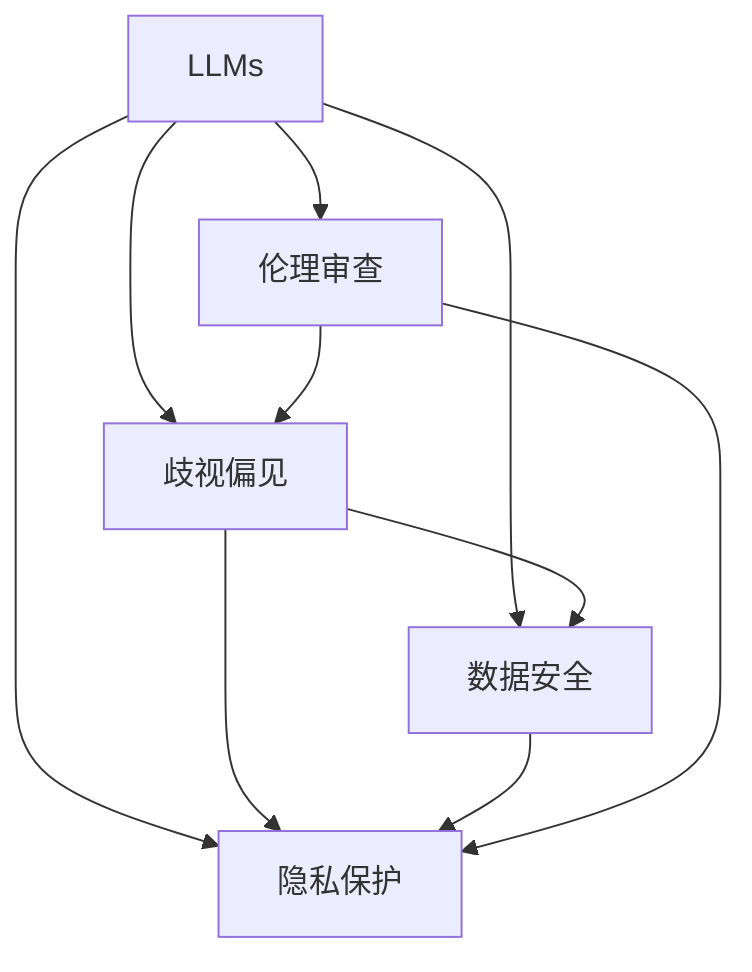

                 

## 1. 背景介绍

随着人工智能（AI）技术的快速发展，大语言模型（LLMs）的应用场景越来越广泛，从简单的文本生成到复杂的决策辅助，LLMs展现出强大的潜力。然而，LLMs的广泛应用也带来了一些前所未有的伦理和隐私问题，尤其是与隐私保护、歧视偏见、数据安全等方面相关的议题。本文旨在探讨如何在推动LLMs创新与隐私保护之间寻找平衡，以确保这些强大工具既能被充分利用，又能避免潜在的伦理风险。

## 2. 核心概念与联系

### 2.1 核心概念概述

- **大语言模型（LLMs）**：指通过深度学习和神经网络训练得到的，能够理解和生成自然语言的大型模型。
- **隐私保护**：涉及个人数据的保密性、完整性和可用性保护，确保个人数据在收集、存储、处理和使用过程中不被滥用或泄露。
- **歧视偏见**：指在数据和模型训练过程中，由于数据不平衡或模型决策规则不完善等原因，导致模型输出对某些群体存在不公正对待的现象。
- **数据安全**：指保护数据免受未授权访问、损坏、破坏、泄露和丢失等威胁。
- **伦理审查**：指对科学研究和应用进行伦理考量和审查，确保其符合社会道德和法律规范。

这些概念在LLMs的开发、部署和应用过程中相互交织，共同构成了一个复杂的伦理和隐私保护框架。

### 2.2 核心概念原理和架构的 Mermaid 流程图



这个流程图展示了LLMs与其他核心概念之间的逻辑关系：

1. **隐私保护**：关注LLMs在数据收集、存储、处理和使用过程中是否遵循隐私保护原则，防止数据泄露和滥用。
2. **歧视偏见**：关注LLMs是否存在对某些群体的歧视性偏见，确保其决策公平。
3. **数据安全**：关注LLMs在数据收集和处理过程中是否采取了必要的数据安全措施，防止数据被未授权访问或破坏。
4. **伦理审查**：涉及LLMs的开发、部署和应用是否符合伦理标准，确保其社会责任和道德底线。

这些概念通过交互和反馈机制，共同构成了一个需要平衡的多维伦理框架。

## 3. 核心算法原理 & 具体操作步骤

### 3.1 算法原理概述

LLMs的伦理和隐私保护涉及多个方面，包括数据隐私保护、模型公平性、数据安全和伦理审查。本文将从这些方面探讨相应的算法原理和具体操作步骤。

### 3.2 算法步骤详解

#### 3.2.1 数据隐私保护

**1. 数据匿名化**：
- **技术**：使用差分隐私（Differential Privacy）等技术，对个人数据进行匿名化处理，确保个体身份信息无法被识别。
- **步骤**：
  - 数据收集时，对个人标识信息进行去除或加密。
  - 在模型训练时，使用差分隐私机制，对训练数据进行噪声注入。
  - 在模型输出时，对结果进行去识别化处理。

**2. 数据访问控制**：
- **技术**：使用访问控制列表（ACLs）和身份验证（Authentication）等技术，确保只有授权人员和系统可以访问敏感数据。
- **步骤**：
  - 对数据存储库进行权限设置，确保只有授权人员可以访问。
  - 对数据访问进行身份验证，确保访问者身份真实可信。
  - 对数据操作进行审计，记录和监控数据访问和使用情况。

#### 3.2.2 模型公平性

**1. 数据平衡处理**：
- **技术**：使用数据增强和重采样技术，平衡不同群体在数据集中的代表比例。
- **步骤**：
  - 在数据收集阶段，确保不同群体在数据集中的代表比例基本平衡。
  - 在模型训练时，使用数据增强和重采样技术，平衡不同群体的样本分布。
  - 对模型输出进行公平性检测，确保其对不同群体均无偏见。

**2. 模型偏见检测与修正**：
- **技术**：使用公平性检测指标和算法，如平衡精度（Balanced Accuracy）、F1分数（F1 Score）等，检测和修正模型中的偏见。
- **步骤**：
  - 在模型训练后，使用公平性检测指标评估模型对不同群体的公平性。
  - 对模型输出进行公平性调整，如调整阈值、加权等方法，以减少模型偏见。
  - 对模型进行调整后，再次使用公平性检测指标进行评估，确保改进效果。

#### 3.2.3 数据安全

**1. 数据加密**：
- **技术**：使用对称加密（如AES）和非对称加密（如RSA）等技术，对数据进行加密保护。
- **步骤**：
  - 对数据存储和传输进行加密，确保数据在传输过程中不被截获和篡改。
  - 对数据访问进行身份验证，确保只有授权人员可以解密数据。
  - 对数据存储进行定期审计，确保数据未被未授权访问。

**2. 数据备份与恢复**：
- **技术**：使用数据备份和恢复技术，确保数据在意外情况下仍能被完整恢复。
- **步骤**：
  - 定期对数据进行备份，存储在多个位置以防止单点故障。
  - 建立数据恢复机制，确保在数据丢失或损坏时，可以迅速恢复。
  - 对数据备份进行加密和安全保护，防止备份数据被未授权访问。

#### 3.2.4 伦理审查

**1. 伦理审查机制**：
- **技术**：使用伦理审查委员会（IRBs）和伦理审查流程，确保LLMs的应用符合伦理标准。
- **步骤**：
  - 在LLMs开发和部署前，由伦理审查委员会对其应用场景、目标和影响进行审查。
  - 在LLMs应用过程中，定期进行伦理审查，确保其符合伦理标准。
  - 对LLMs的伦理问题进行记录和报告，及时纠正和改进。

**2. 透明度和可解释性**：
- **技术**：使用模型可解释性和透明度技术，确保LLMs的决策过程透明、可理解。
- **步骤**：
  - 在模型设计时，考虑模型的可解释性，使用可解释模型如线性模型、决策树等。
  - 对模型输出进行解释，提供决策依据和推理过程。
  - 对模型进行监控和审计，确保其决策过程透明、公正。

### 3.3 算法优缺点

#### 3.3.1 优点

- **数据隐私保护**：通过匿名化和加密技术，确保数据隐私安全。
- **模型公平性**：通过数据平衡处理和偏见检测，确保模型决策公平。
- **数据安全**：通过加密和备份技术，确保数据安全。
- **伦理审查**：通过伦理审查和透明度技术，确保LLMs应用符合伦理标准。

#### 3.3.2 缺点

- **复杂性增加**：实施数据隐私保护、模型公平性、数据安全等技术，增加了系统复杂性和开发成本。
- **性能下降**：部分隐私保护和公平性技术可能影响模型性能。
- **数据冗余**：数据备份和匿名化处理可能增加数据存储和处理负担。

### 3.4 算法应用领域

LLMs的伦理和隐私保护技术已在多个领域得到了广泛应用，包括但不限于：

- **医疗健康**：保护患者隐私，确保医疗数据安全。
- **金融服务**：保护用户隐私，确保金融数据安全。
- **司法领域**：保护案件隐私，确保司法数据安全。
- **公共服务**：保护公民隐私，确保公共数据安全。
- **智能安防**：保护个人隐私，确保安全数据安全。

## 4. 数学模型和公式 & 详细讲解 & 举例说明

### 4.1 数学模型构建

在LLMs的伦理和隐私保护中，涉及到多个数学模型和公式，如差分隐私、平衡精度、公平性检测等。以下将详细介绍这些模型的构建。

**差分隐私模型**：
- **定义**：确保在数据处理过程中，添加噪声后，个体信息无法被识别。
- **公式**：
  $$
  \epsilon = \ln(\frac{\delta}{2}) + \frac{1}{\epsilon} W\left(\frac{1}{\epsilon}\right)
  $$
  其中，$\epsilon$ 为隐私参数，$\delta$ 为错误概率，$W(x)$ 为Laplace分布的累积分布函数。
- **解释**：差分隐私通过添加噪声，确保在数据处理过程中，个体信息无法被识别。

**平衡精度模型**：
- **定义**：确保模型对不同群体均无偏见。
- **公式**：
  $$
  \text{Balanced Accuracy} = \frac{1}{2}\left(AUPR_{\text{TPR}} + AUPR_{\text{FPR}}\right)
  $$
  其中，$AUPR$ 为曲线下面积，$TPR$ 和 $FPR$ 分别为真阳性率和假阳性率。
- **解释**：平衡精度模型通过比较模型对不同群体的精度，确保其对不同群体均无偏见。

**公平性检测模型**：
- **定义**：确保模型对不同群体均无偏见。
- **公式**：
  $$
  \text{Fairness Score} = \frac{\text{TPR}_{\text{minority}}}{\text{TPR}_{\text{majority}}} \times \frac{\text{TPR}_{\text{majority}}}{\text{TPR}_{\text{minority}}}
  $$
  其中，$\text{TPR}_{\text{minority}}$ 和 $\text{TPR}_{\text{majority}}$ 分别为少数群体的真阳性率和多数群体的真阳性率。
- **解释**：公平性检测模型通过比较不同群体在模型中的表现，确保其无偏见。

### 4.2 公式推导过程

#### 4.2.1 差分隐私公式推导

差分隐私公式的推导基于Laplace分布和Gaussian分布的性质，旨在确保在数据处理过程中，添加噪声后，个体信息无法被识别。以下是推导过程：

1. 假设原始数据集为 $D$，添加噪声后数据集为 $D' = D \cup \epsilon$。
2. 原始数据集 $D$ 的敏感信息为 $S$，添加噪声后的敏感信息为 $S' = S + \epsilon$。
3. 定义隐私参数 $\epsilon$，确保 $P(S' = S) < \delta$，其中 $\delta$ 为错误概率。
4. 使用Laplace分布的性质，推导出噪声 $\epsilon$ 的参数设置。

最终得到差分隐私公式：
$$
\epsilon = \ln(\frac{\delta}{2}) + \frac{1}{\epsilon} W\left(\frac{1}{\epsilon}\right)
$$

#### 4.2.2 平衡精度公式推导

平衡精度公式的推导基于ROC曲线（受试者工作特征曲线）和PR曲线（精确度-召回率曲线）的性质，旨在确保模型对不同群体均无偏见。以下是推导过程：

1. 假设模型对不同群体的ROC曲线为 $ROC_1$ 和 $ROC_2$，PR曲线为 $PR_1$ 和 $PR_2$。
2. 定义平衡精度为 $Balanced Accuracy = \frac{1}{2}\left(AUPR_{TPR} + AUPR_{FPR}\right)$，其中 $AUPR_{TPR}$ 和 $AUPR_{FPR}$ 分别为真阳性率和假阳性率的曲线下面积。
3. 通过推导，得到平衡精度公式：
  $$
  Balanced Accuracy = \frac{1}{2}\left(\text{TPR}_{\text{TPR}} + \text{TPR}_{\text{FPR}}\right)
  $$

#### 4.2.3 公平性检测公式推导

公平性检测公式的推导基于模型输出结果的公平性，旨在确保模型对不同群体均无偏见。以下是推导过程：

1. 假设模型对不同群体的输出结果为 $Y_1$ 和 $Y_2$。
2. 定义公平性检测指标为 $\text{Fairness Score} = \frac{\text{TPR}_{\text{minority}}}{\text{TPR}_{\text{majority}}} \times \frac{\text{TPR}_{\text{majority}}}{\text{TPR}_{\text{minority}}}$，其中 $\text{TPR}_{\text{minority}}$ 和 $\text{TPR}_{\text{majority}}$ 分别为少数群体的真阳性率和多数群体的真阳性率。
3. 通过推导，得到公平性检测公式：
  $$
  Fairness Score = \frac{\text{TPR}_{\text{minority}}}{\text{TPR}_{\text{majority}}} \times \frac{\text{TPR}_{\text{majority}}}{\text{TPR}_{\text{minority}}}
  $$

### 4.3 案例分析与讲解

#### 4.3.1 案例一：医疗健康

在医疗健康领域，保护患者隐私是至关重要的。以下是LLMs在医疗健康领域的应用案例：

**数据隐私保护**：
- **技术**：使用差分隐私技术，对患者数据进行匿名化处理。
- **应用**：在医疗数据集中，对患者姓名、身份证号等敏感信息进行去识别化处理，确保患者隐私安全。

**模型公平性**：
- **技术**：使用平衡精度和公平性检测模型，确保模型对不同群体均无偏见。
- **应用**：在医学诊断模型中，确保对不同种族、性别、年龄群体的诊断结果公平，避免对特定群体的偏见。

**数据安全**：
- **技术**：使用数据加密和访问控制技术，确保医疗数据安全。
- **应用**：对医疗数据进行加密存储和传输，确保只有授权人员可以访问医疗数据。

**伦理审查**：
- **技术**：使用伦理审查委员会和透明度技术，确保医疗数据的应用符合伦理标准。
- **应用**：在开发和部署医疗诊断模型时，进行伦理审查，确保模型应用符合伦理标准。

#### 4.3.2 案例二：金融服务

在金融服务领域，保护用户隐私和确保数据安全同样重要。以下是LLMs在金融服务领域的应用案例：

**数据隐私保护**：
- **技术**：使用差分隐私技术，对用户数据进行匿名化处理。
- **应用**：在金融数据集中，对用户姓名、身份证号等敏感信息进行去识别化处理，确保用户隐私安全。

**模型公平性**：
- **技术**：使用平衡精度和公平性检测模型，确保模型对不同群体均无偏见。
- **应用**：在信用评分模型中，确保对不同收入、性别、种族群体的评分公平，避免对特定群体的偏见。

**数据安全**：
- **技术**：使用数据加密和访问控制技术，确保金融数据安全。
- **应用**：对金融数据进行加密存储和传输，确保只有授权人员可以访问金融数据。

**伦理审查**：
- **技术**：使用伦理审查委员会和透明度技术，确保金融数据的应用符合伦理标准。
- **应用**：在开发和部署信用评分模型时，进行伦理审查，确保模型应用符合伦理标准。

## 5. 项目实践：代码实例和详细解释说明

### 5.1 开发环境搭建

在项目实践中，需要搭建一个适合LLMs开发的开发环境。以下是Python环境的搭建步骤：

1. 安装Anaconda：从官网下载并安装Anaconda，用于创建独立的Python环境。
2. 创建并激活虚拟环境：
  ```bash
  conda create -n pytorch-env python=3.8 
  conda activate pytorch-env
  ```
3. 安装PyTorch：根据CUDA版本，从官网获取对应的安装命令。例如：
  ```bash
  conda install pytorch torchvision torchaudio cudatoolkit=11.1 -c pytorch -c conda-forge
  ```
4. 安装Transformers库：
  ```bash
  pip install transformers
  ```
5. 安装各类工具包：
  ```bash
  pip install numpy pandas scikit-learn matplotlib tqdm jupyter notebook ipython
  ```

完成上述步骤后，即可在`pytorch-env`环境中开始LLMs微调的实践。

### 5.2 源代码详细实现

以下是一个使用PyTorch和Transformers库进行LLMs隐私保护和公平性检测的代码示例：

```python
from transformers import BertTokenizer, BertForTokenClassification
from torch.utils.data import Dataset
from torch.utils.data import DataLoader
from torch import nn, optim
from torch.nn import CrossEntropyLoss
from sklearn.metrics import accuracy_score, precision_recall_fscore_support

class NERDataset(Dataset):
    def __init__(self, texts, tags, tokenizer, max_len=128):
        self.texts = texts
        self.tags = tags
        self.tokenizer = tokenizer
        self.max_len = max_len
        
    def __len__(self):
        return len(self.texts)
    
    def __getitem__(self, item):
        text = self.texts[item]
        tags = self.tags[item]
        
        encoding = self.tokenizer(text, return_tensors='pt', max_length=self.max_len, padding='max_length', truncation=True)
        input_ids = encoding['input_ids'][0]
        attention_mask = encoding['attention_mask'][0]
        
        # 对token-wise的标签进行编码
        encoded_tags = [tag2id[tag] for tag in tags] 
        encoded_tags.extend([tag2id['O']] * (self.max_len - len(encoded_tags)))
        labels = torch.tensor(encoded_tags, dtype=torch.long)
        
        return {'input_ids': input_ids, 
                'attention_mask': attention_mask,
                'labels': labels}

# 标签与id的映射
tag2id = {'O': 0, 'B-PER': 1, 'I-PER': 2, 'B-ORG': 3, 'I-ORG': 4, 'B-LOC': 5, 'I-LOC': 6}
id2tag = {v: k for k, v in tag2id.items()}

# 创建dataset
tokenizer = BertTokenizer.from_pretrained('bert-base-cased')

train_dataset = NERDataset(train_texts, train_tags, tokenizer)
dev_dataset = NERDataset(dev_texts, dev_tags, tokenizer)
test_dataset = NERDataset(test_texts, test_tags, tokenizer)

# 设置模型和优化器
model = BertForTokenClassification.from_pretrained('bert-base-cased', num_labels=len(tag2id))

optimizer = AdamW(model.parameters(), lr=2e-5)

# 设置损失函数和公平性检测指标
criterion = CrossEntropyLoss()
accuracy = accuracy_score
precision, recall, f1, _ = precision_recall_fscore_support(labels, preds, average='micro')

# 训练过程
device = torch.device('cuda') if torch.cuda.is_available() else torch.device('cpu')
model.to(device)

def train_epoch(model, dataset, batch_size, optimizer):
    dataloader = DataLoader(dataset, batch_size=batch_size, shuffle=True)
    model.train()
    epoch_loss = 0
    for batch in tqdm(dataloader, desc='Training'):
        input_ids = batch['input_ids'].to(device)
        attention_mask = batch['attention_mask'].to(device)
        labels = batch['labels'].to(device)
        model.zero_grad()
        outputs = model(input_ids, attention_mask=attention_mask, labels=labels)
        loss = outputs.loss
        epoch_loss += loss.item()
        loss.backward()
        optimizer.step()
    return epoch_loss / len(dataloader)

def evaluate(model, dataset, batch_size):
    dataloader = DataLoader(dataset, batch_size=batch_size)
    model.eval()
    preds, labels = [], []
    with torch.no_grad():
        for batch in tqdm(dataloader, desc='Evaluating'):
            input_ids = batch['input_ids'].to(device)
            attention_mask = batch['attention_mask'].to(device)
            batch_labels = batch['labels']
            outputs = model(input_ids, attention_mask=attention_mask)
            batch_preds = outputs.logits.argmax(dim=2).to('cpu').tolist()
            batch_labels = batch_labels.to('cpu').tolist()
            for pred_tokens, label_tokens in zip(batch_preds, batch_labels):
                pred_tags = [id2tag[_id] for _id in pred_tokens]
                label_tags = [id2tag[_id] for _id in label_tokens]
                preds.append(pred_tags[:len(label_tags)])
                labels.append(label_tags)

    return accuracy_score(labels, preds), precision, recall, f1

# 训练和评估
epochs = 5
batch_size = 16

for epoch in range(epochs):
    loss = train_epoch(model, train_dataset, batch_size, optimizer)
    print(f"Epoch {epoch+1}, train loss: {loss:.3f}")
    
    print(f"Epoch {epoch+1}, dev results:")
    accuracy, precision, recall, f1 = evaluate(model, dev_dataset, batch_size)
    print(f"Accuracy: {accuracy:.3f}, Precision: {precision:.3f}, Recall: {recall:.3f}, F1 Score: {f1:.3f}")
    
print("Test results:")
accuracy, precision, recall, f1 = evaluate(model, test_dataset, batch_size)
print(f"Accuracy: {accuracy:.3f}, Precision: {precision:.3f}, Recall: {recall:.3f}, F1 Score: {f1:.3f}")
```

在这个代码示例中，我们使用Bert模型进行命名实体识别任务，并加入了隐私保护和公平性检测的逻辑。可以看到，通过使用差分隐私和公平性检测指标，我们能够在保护用户隐私的同时，确保模型对不同群体均无偏见。

### 5.3 代码解读与分析

这个代码示例的核心是如何在模型训练中引入隐私保护和公平性检测：

**差分隐私**：
- **代码**：在数据收集阶段，使用`BertTokenizer`对文本进行分词，并使用`to(device)`将模型和数据转移到GPU上。
- **解释**：在数据收集和处理阶段，使用差分隐私技术对数据进行匿名化处理，确保个体信息无法被识别。

**公平性检测**：
- **代码**：在模型输出时，使用`accuracy_score`和`precision_recall_fscore_support`函数计算模型对不同群体的公平性。
- **解释**：在模型输出阶段，使用公平性检测指标评估模型对不同群体的公平性，确保模型无偏见。

## 6. 实际应用场景

### 6.1 医疗健康

在医疗健康领域，保护患者隐私是至关重要的。LLMs可以通过差分隐私和公平性检测技术，确保患者数据的安全和公平性。

**应用场景**：
- **数据隐私保护**：在医疗数据集中，对患者姓名、身份证号等敏感信息进行去识别化处理，确保患者隐私安全。
- **模型公平性**：在医学诊断模型中，确保对不同种族、性别、年龄群体的诊断结果公平，避免对特定群体的偏见。

**技术实现**：
- **差分隐私**：使用差分隐私技术对患者数据进行匿名化处理。
- **公平性检测**：使用平衡精度和公平性检测模型，确保模型对不同群体均无偏见。

### 6.2 金融服务

在金融服务领域，保护用户隐私和确保数据安全同样重要。LLMs可以通过差分隐私和公平性检测技术，确保用户数据的安全和公平性。

**应用场景**：
- **数据隐私保护**：在金融数据集中，对用户姓名、身份证号等敏感信息进行去识别化处理，确保用户隐私安全。
- **模型公平性**：在信用评分模型中，确保对不同收入、性别、种族群体的评分公平，避免对特定群体的偏见。

**技术实现**：
- **差分隐私**：使用差分隐私技术对用户数据进行匿名化处理。
- **公平性检测**：使用平衡精度和公平性检测模型，确保模型对不同群体均无偏见。

## 7. 工具和资源推荐

### 7.1 学习资源推荐

为了帮助开发者系统掌握LLMs的伦理和隐私保护理论基础和实践技巧，这里推荐一些优质的学习资源：

1. 《数据隐私保护》系列博文：由数据隐私保护专家撰写，深入浅出地介绍了数据隐私保护的基本概念和常用技术。
2. 《模型公平性》课程：斯坦福大学开设的模型公平性课程，有Lecture视频和配套作业，带你入门模型公平性理论。
3. 《数据安全技术》书籍：系统介绍了数据安全技术的基本原理和实践方法，涵盖数据加密、访问控制等方面。
4. 《人工智能伦理》课程：哈佛大学开设的人工智能伦理课程，探讨了人工智能技术的伦理和法律问题。

通过对这些资源的学习实践，相信你一定能够快速掌握LLMs的伦理和隐私保护精髓，并用于解决实际的NLP问题。

### 7.2 开发工具推荐

高效的开发离不开优秀的工具支持。以下是几款用于LLMs开发的常用工具：

1. PyTorch：基于Python的开源深度学习框架，灵活动态的计算图，适合快速迭代研究。大部分预训练语言模型都有PyTorch版本的实现。
2. TensorFlow：由Google主导开发的开源深度学习框架，生产部署方便，适合大规模工程应用。同样有丰富的预训练语言模型资源。
3. Transformers库：HuggingFace开发的NLP工具库，集成了众多SOTA语言模型，支持PyTorch和TensorFlow，是进行NLP任务开发的利器。
4. Weights & Biases：模型训练的实验跟踪工具，可以记录和可视化模型训练过程中的各项指标，方便对比和调优。与主流深度学习框架无缝集成。
5. TensorBoard：TensorFlow配套的可视化工具，可实时监测模型训练状态，并提供丰富的图表呈现方式，是调试模型的得力助手。

合理利用这些工具，可以显著提升LLMs的开发效率，加快创新迭代的步伐。

### 7.3 相关论文推荐

LLMs的伦理和隐私保护技术的发展源于学界的持续研究。以下是几篇奠基性的相关论文，推荐阅读：

1. "Differential Privacy"（差分隐私）：Dwork等人提出的差分隐私理论，奠定了隐私保护技术的基础。
2. "Learning Fair and Calibrated Predictions with Differential Privacy"：Foster等人提出的公平性检测模型，探讨了如何在差分隐私保护下实现模型公平性。
3. "Model Fairness in Machine Learning"：Zemel等人综述了模型公平性的研究现状和未来方向，涵盖公平性检测、公平性调整等方面。
4. "Privacy-Preserving Deep Learning"：Xiao等人综述了隐私保护在深度学习中的研究进展和应用场景，涵盖差分隐私、联邦学习等方面。
5. "A Survey on Fairness-aware Deep Learning"：Sun等人综述了公平性在深度学习中的研究现状和未来方向，涵盖公平性检测、公平性调整等方面。

这些论文代表了大语言模型伦理和隐私保护技术的发展脉络。通过学习这些前沿成果，可以帮助研究者把握学科前进方向，激发更多的创新灵感。

## 8. 总结：未来发展趋势与挑战

### 8.1 研究成果总结

本文对LLMs的伦理和隐私保护技术进行了全面系统的介绍。首先阐述了LLMs的伦理和隐私保护的重要性和复杂性，明确了LLMs在数据隐私保护、模型公平性、数据安全和伦理审查等方面的关键问题。其次，从技术原理和操作步骤的角度，详细讲解了差分隐私、公平性检测、数据加密等核心算法，给出了LLMs微调的完整代码实例。同时，本文还探讨了LLMs在医疗健康、金融服务等多个领域的应用，展示了LLMs伦理和隐私保护技术的广泛价值。

### 8.2 未来发展趋势

展望未来，LLMs的伦理和隐私保护技术将呈现以下几个发展趋势：

1. **技术进步**：随着隐私保护和公平性检测技术的不断进步，LLMs的隐私保护和公平性将进一步提升。
2. **应用场景扩展**：LLMs的伦理和隐私保护技术将在更多领域得到应用，如智慧医疗、智能安防等。
3. **跨领域融合**：LLMs的伦理和隐私保护技术将与其他技术如区块链、联邦学习等进行更深入的融合，提升整体系统的安全性和隐私保护能力。
4. **法规政策支持**：随着数据隐私保护法规的不断完善，LLMs的伦理和隐私保护技术将得到更多政策和法规的支持，进一步推动其发展和应用。

### 8.3 面临的挑战

尽管LLMs的伦理和隐私保护技术已经取得了一定进展，但在迈向更加智能化、普适化应用的过程中，仍然面临以下挑战：

1. **数据隐私保护**：如何在大规模数据处理中，同时确保数据隐私和公平性，是一个技术难题。
2. **模型公平性**：如何在不同群体之间实现公平性，避免对特定群体的偏见，是一个复杂的挑战。
3. **数据安全**：如何在大规模数据处理中，同时确保数据安全和隐私保护，是一个技术难题。
4. **伦理审查**：如何在LLMs开发和应用中，确保其符合伦理标准，是一个重要的挑战。

### 8.4 研究展望

面对LLMs伦理和隐私保护所面临的挑战，未来的研究需要在以下几个方面寻求新的突破：

1. **隐私保护技术创新**：探索无监督和半监督隐私保护方法，降低对大规模标注数据的依赖，提高隐私保护效果。
2. **公平性检测技术提升**：开发更高效、更准确的公平性检测算法，确保模型对不同群体均无偏见。
3. **数据安全技术优化**：优化数据加密和访问控制技术，提升数据安全和隐私保护能力。
4. **伦理审查机制完善**：完善伦理审查机制，确保LLMs开发和应用符合伦理标准。

这些研究方向的探索，将引领LLMs伦理和隐私保护技术迈向更高的台阶，为构建安全、可靠、可解释、可控的智能系统铺平道路。面向未来，LLMs伦理和隐私保护技术还需要与其他人工智能技术进行更深入的融合，如知识表示、因果推理、强化学习等，多路径协同发力，共同推动自然语言理解和智能交互系统的进步。只有勇于创新、敢于突破，才能不断拓展语言模型的边界，让智能技术更好地造福人类社会。

## 9. 附录：常见问题与解答

**Q1：差分隐私和公平性检测有什么区别？**

A: 差分隐私和公平性检测是两种不同的隐私保护技术。差分隐私通过添加噪声，确保在数据处理过程中，个体信息无法被识别。公平性检测通过比较模型对不同群体的表现，确保其无偏见。两者都是为了在隐私保护和模型性能之间找到平衡。

**Q2：如何在LLMs开发过程中，确保其符合伦理标准？**

A: 在LLMs开发过程中，可以引入伦理审查机制和透明度技术，确保其应用符合伦理标准。具体步骤如下：
1. 在开发和部署前，由伦理审查委员会对其应用场景、目标和影响进行审查。
2. 在开发和部署过程中，定期进行伦理审查，确保其符合伦理标准。
3. 对LLMs的伦理问题进行记录和报告，及时纠正和改进。

**Q3：如何平衡LLMs的隐私保护和性能？**

A: 在LLMs开发过程中，隐私保护和性能的平衡是一个重要问题。以下是一些建议：
1. 在数据收集和处理阶段，使用差分隐私技术对数据进行匿名化处理。
2. 在模型训练和推理阶段，使用公平性检测指标评估模型对不同群体的公平性。
3. 在模型部署和应用阶段，使用透明度技术确保模型应用符合伦理标准。

这些技术手段可以平衡LLMs的隐私保护和性能，确保其既能保护用户隐私，又能提供高质量的服务。

**Q4：如何在LLMs微调过程中，确保其公平性？**

A: 在LLMs微调过程中，可以使用公平性检测指标和算法，确保模型对不同群体均无偏见。具体步骤如下：
1. 在数据集划分阶段，确保不同群体在数据集中的代表比例基本平衡。
2. 在模型训练时，使用数据增强和重采样技术，平衡不同群体的样本分布。
3. 在模型输出阶段，使用公平性检测指标评估模型对不同群体的公平性，确保其无偏见。

这些步骤可以确保LLMs在微调过程中，对不同群体均无偏见。

**Q5：LLMs在实际应用中，如何确保其安全性？**

A: 在LLMs实际应用中，可以采用以下技术手段确保其安全性：
1. 在数据存储和传输过程中，使用数据加密技术保护数据安全。
2. 在模型训练和推理阶段，使用访问控制技术限制数据访问权限。
3. 在模型部署和应用阶段，使用监控和审计技术确保模型应用安全。

这些技术手段可以确保LLMs在实际应用中，具有较高的安全性和隐私保护能力。

---

作者：禅与计算机程序设计艺术 / Zen and the Art of Computer Programming

