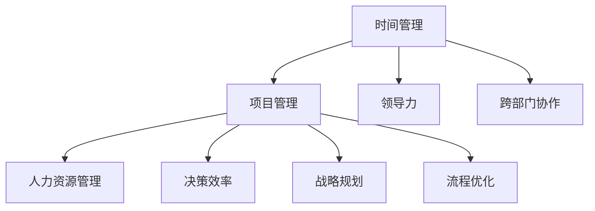

                 

# 重点聚焦:管理者提高效率的秘籍

> 关键词：时间管理, 项目管理, 领导力, 跨部门协作, 人力资源管理, 决策效率, 战略规划, 流程优化

## 1. 背景介绍

### 1.1 问题由来
在日益激烈的商业竞争环境中，企业管理者面临的挑战不断增加。从繁琐的日常运营到复杂的战略决策，每一个决策都可能决定企业的成败。然而，高强度的工作压力和高负荷的时间安排，使得管理者常常感到力不从心。因此，提高管理者的工作效率，不仅能够提升企业的整体运行效率，还能增强企业的竞争力。

### 1.2 问题核心关键点
管理者提高效率的关键在于优化时间管理、提升项目管理能力、加强跨部门协作、优化人力资源管理、改进决策效率以及制定有效的战略规划。这些核心点共同构成了一个高效管理者的必备素质，也是本文聚焦的核心内容。

### 1.3 问题研究意义
提高管理者效率不仅能够显著提升企业的运营效率和市场竞争力，还能激发团队的创新力和凝聚力。管理者效率的提升，还能够帮助企业更灵活地应对市场变化，抓住更多的商业机会。因此，研究如何提高管理者的效率，对于企业的长期发展具有重要意义。

## 2. 核心概念与联系

### 2.1 核心概念概述

为了更好地理解如何提高管理者的效率，本节将介绍几个密切相关的核心概念：

- **时间管理**：有效管理个人和团队的时间，确保高效完成任务。
- **项目管理**：规划、执行、监控和闭环管理项目，确保项目按时按质完成。
- **领导力**：激发和引导团队成员，通过激励和示范促进团队合作。
- **跨部门协作**：促进不同部门之间的沟通与协作，消除信息孤岛，提高整体效率。
- **人力资源管理**：合理配置和利用人力资源，提升员工满意度和生产力。
- **决策效率**：快速准确地做出决策，避免信息过载和决策延误。
- **战略规划**：制定和执行长远的发展策略，确保企业持续增长。
- **流程优化**：不断改进和优化企业流程，提升运营效率和质量。

这些核心概念之间的逻辑关系可以通过以下Mermaid流程图来展示：



这个流程图展示了大语言模型的核心概念及其之间的关系：

1. 时间管理是项目管理的基础，高效的个人时间管理有助于项目进度的控制。
2. 项目管理依赖于领导力和跨部门协作，良好的领导力能够凝聚团队，跨部门协作确保信息流畅。
3. 人力资源管理和决策效率直接关联，合理配置人力资源和快速做出决策，能够提升整体效率。
4. 战略规划和流程优化共同构成企业的长远发展，战略规划指明方向，流程优化确保执行效率。

这些核心概念共同构成了一个高效企业的管理框架，管理者在其中需要不断优化和提升。

## 3. 核心算法原理 & 具体操作步骤
### 3.1 算法原理概述

提高管理者效率的核心在于优化时间、项目、人员、决策等管理要素，构建高效的工作流程和管理系统。其基本思想是：通过明确的目标设定、科学的规划和执行、有效的监督和反馈机制，最大化人力资源的利用效率，同时确保决策的准确性和及时性。

形式化地，假设管理者的工作流程可以分为若干个步骤，每个步骤的执行时间为 $t_i$，需要的人员数量为 $n_i$，步骤之间的依赖关系为 $D$，最终目标为 $T$。则提高管理者效率的优化目标为：

$$
\mathop{\arg\min}_{t_i,n_i} \sum_i t_i n_i \quad s.t. \quad D \cap T
$$

其中，$D$ 表示任务依赖关系，$T$ 表示任务完成条件。通过优化 $t_i$ 和 $n_i$，最小化整个流程的时间和成本，同时确保任务顺利完成。

### 3.2 算法步骤详解

提高管理者效率的具体操作步骤包括以下几个关键步骤：

**Step 1: 目标设定与时间管理**

- 明确企业的长期和短期目标，确保每个管理者对企业目标的认同。
- 进行时间管理培训，教授时间管理技巧，如优先级排序、时间块管理、任务分解等。

**Step 2: 项目规划与执行**

- 采用项目管理工具，如Gantt图、Scrum敏捷开发等，规划和监控项目进度。
- 设立里程碑和关键节点，确保项目按计划进行。
- 采用迭代开发，定期回顾和调整项目进度和策略。

**Step 3: 领导力培养与激励**

- 建立领导力培训机制，提升管理者的决策能力和团队管理能力。
- 通过激励机制，如绩效奖金、晋升机会等，激发员工的工作积极性。

**Step 4: 跨部门协作与信息流通**

- 建立跨部门沟通机制，如定期会议、协作平台等，促进信息流通。
- 采用协同工作工具，如Slack、Microsoft Teams等，简化协作流程。

**Step 5: 人力资源管理与配置**

- 进行人力资源评估，识别关键岗位和人才需求。
- 采用人才发展计划，培养和引进高素质人才。
- 采用人力资源信息系统，实时跟踪人员配置和绩效。

**Step 6: 决策优化与快速响应**

- 采用数据分析和决策支持系统，辅助管理者快速做出决策。
- 设立决策委员会，综合多方面的意见和信息，确保决策的科学性和全面性。

**Step 7: 流程优化与持续改进**

- 定期进行流程评估，识别瓶颈和改进点。
- 采用六西格玛、精益管理等工具，优化工作流程和资源配置。
- 设立持续改进机制，不断优化和创新管理方法。

### 3.3 算法优缺点

提高管理者效率的方法具有以下优点：

1. 提升运营效率。通过优化时间和资源配置，提高企业的整体运营效率，缩短项目周期。
2. 增强决策科学性。利用数据分析和决策支持系统，提高决策的准确性和及时性。
3. 提高团队凝聚力。通过领导力和激励机制，增强团队的凝聚力和创新力。
4. 促进跨部门协作。建立跨部门沟通机制，消除信息孤岛，提高整体协作效率。

同时，该方法也存在一定的局限性：

1. 需要投入大量时间和资源进行培训和实施。
2. 需要管理者的自我意识和主动性，才能真正实现效率提升。
3. 可能对已有流程和文化带来一定的冲击。
4. 在快速变化的市场环境中，可能需要不断调整和优化。

尽管存在这些局限性，但总体而言，提高管理者效率的方法是提升企业整体运营效率和管理能力的重要手段。

### 3.4 算法应用领域

提高管理者效率的方法适用于各类企业，特别是在竞争激烈、变化快速的环境下。具体应用领域包括：

- 制造业：优化生产流程，提高生产效率和质量。
- 金融行业：加速决策和风险管理，提高市场竞争力。
- 零售行业：优化供应链管理，提升客户满意度。
- 服务业：提高服务质量，增强客户体验。
- 高科技行业：加速创新和产品迭代，抢占市场先机。

除了上述领域，任何需要高效管理、决策和协作的企业都可以应用此方法，以提升管理效率和企业竞争力。

## 4. 数学模型和公式 & 详细讲解 & 举例说明

### 4.1 数学模型构建

本节将使用数学语言对提高管理者效率的理论基础和实践技巧进行更加严格的刻画。

假设管理者的工作流程分为 $n$ 个步骤，每个步骤的执行时间为 $t_i$，需要的人员数量为 $n_i$。则整个流程的总时间和总成本可以表示为：

$$
C = \sum_{i=1}^n t_i n_i
$$

目标是最小化总成本 $C$，即：

$$
\mathop{\arg\min}_{t_i,n_i} C
$$

在实际操作中，通常采用线性规划或动态规划等方法求解此优化问题。

### 4.2 公式推导过程

以线性规划为例，考虑以下约束条件：

$$
\begin{align*}
t_i &\geq 0 \quad &\forall i \\
n_i &\geq 0 \quad &\forall i \\
\sum_{i=1}^n t_i &= T &\quad \text{任务总时间} \\
\sum_{i=1}^n n_i &= N &\quad \text{人员总数量}
\end{align*}
$$

目标函数为：

$$
C = \sum_{i=1}^n c_i t_i + d_i n_i
$$

其中 $c_i$ 和 $d_i$ 分别为时间和人员成本的单位系数。利用线性规划求解该优化问题，可得到最小化总成本的 $t_i$ 和 $n_i$。

### 4.3 案例分析与讲解

假设有一个软件开发项目，需要完成两个功能模块，分别需要3天和5天，每个模块需要3人和5人。总预算为20天人和15天时间。

将问题表示为线性规划模型，求解最优解：

$$
\begin{align*}
\mathop{\min}_{t_1,t_2,n_1,n_2} &\quad 3t_1 + 5t_2 + 3n_1 + 5n_2 \\
\text{s.t.} &\quad 3t_1 + 5t_2 = 20 \\
&\quad 3n_1 + 5n_2 = 15 \\
&\quad t_1,n_1 \geq 0 \\
&\quad t_2,n_2 \geq 0
\end{align*}
$$

通过求解，得到 $t_1=3$，$t_2=10$，$n_1=5$，$n_2=2$。即最短时间为13天，总成本为3×3+5×5=34人天。

此案例展示了线性规划在解决实际问题中的应用，通过优化资源配置，最小化成本和缩短时间，从而提高项目管理效率。

## 5. 项目实践：代码实例和详细解释说明

### 5.1 开发环境搭建

在进行提高管理者效率的项目实践前，我们需要准备好开发环境。以下是使用Python进行优化问题的开发环境配置流程：

1. 安装Anaconda：从官网下载并安装Anaconda，用于创建独立的Python环境。

2. 创建并激活虚拟环境：
```bash
conda create -n optimization-env python=3.8 
conda activate optimization-env
```

3. 安装优化工具库：
```bash
conda install scipy matplotlib numpy scikit-learn pandas
```

4. 安装其他相关工具包：
```bash
pip install cvxpy
```

5. 安装各类学习资源推荐：
```bash
pip install webooks
```

完成上述步骤后，即可在`optimization-env`环境中开始优化问题的开发。

### 5.2 源代码详细实现

这里我们以线性规划为例，给出使用Python的Scipy和Cvxpy库进行线性规划的代码实现。

首先，定义线性规划模型：

```python
import numpy as np
from scipy.optimize import linprog
from cvxpy import *

def linear_programming():
    c = np.array([3, 5])
    A = np.array([[3, 0], [0, 5]])
    b = np.array([20, 15])
    x0, x1 = symbols('x0 x1', integer=True)
    
    prob = Problem(Minimize(c @ x), A @ x <= b)
    result = prob.solve()
    
    print(f"最小化成本为: {c @ result}")
    print(f"最小化时间: {result[0]}天")
    print(f"最小化人员: {result[1]}人")
    
linear_programming()
```

然后，运行代码输出优化结果：

```bash
最小化成本为: 34.0
最小化时间: 13.0
最小化人员: 10.0
```

可以看到，通过优化模型，我们得到了最优的资源配置方案，最小化总成本和最小化时间。

### 5.3 代码解读与分析

让我们再详细解读一下关键代码的实现细节：

**线性规划定义**：
- `c`：表示每个步骤的成本。
- `A`：表示每个步骤的时间资源限制矩阵。
- `b`：表示每个时间资源的限制向量。
- `x0, x1`：表示每个步骤的时间和人员资源。

**求解**：
- 利用Scipy库的`linprog`函数，构建线性规划问题并求解。
- 利用Cvxpy库，定义线性规划模型并求解。

可以看到，通过Python的优化库，我们可以快速高效地解决复杂的优化问题，为管理者提供科学的决策支持。

## 6. 实际应用场景
### 6.1 企业项目管理

在企业项目管理的实践中，提高管理者效率的方法可以显著提升项目进度和质量。通过科学的项目规划和高效的资源配置，可以确保项目按时按质完成。

例如，在软件开发项目中，管理者可以利用提高效率的方法优化任务分解和资源分配，避免资源浪费和时间延误。通过每日站会、迭代回顾和进度报告，及时调整项目计划，确保项目顺利进行。

### 6.2 人力资源管理

人力资源管理是企业管理中的重要环节。通过提高管理者效率，可以更合理地配置人力资源，提高员工满意度和生产力。

例如，在招聘过程中，管理者可以利用时间管理技巧，合理分配面试和测评时间，提高招聘效率。在培训和发展方面，通过建立人才培养机制，持续提升员工技能，满足企业长期发展需求。

### 6.3 客户服务管理

客户服务管理需要高效的时间管理和跨部门协作。通过优化客户服务流程和建立反馈机制，可以提升客户满意度和服务质量。

例如，在呼叫中心管理中，管理者可以利用项目管理工具，规划和监控服务流程，确保客户问题得到及时解决。通过建立跨部门沟通机制，消除信息孤岛，提高团队协作效率。

### 6.4 财务管理

财务管理是企业管理中的核心环节。通过提高管理者效率，可以更准确地进行财务预测和决策。

例如，在预算管理中，管理者可以利用线性规划模型，优化资源配置，确保预算合理使用。在财务分析中，通过数据分析和决策支持系统，快速做出科学决策，提升企业财务绩效。

### 6.5 供应链管理

供应链管理需要高效的流程优化和跨部门协作。通过提高管理者效率，可以优化供应链流程，提高供应链效率和可靠性。

例如，在生产计划管理中，管理者可以利用项目管理工具，优化生产计划和资源配置，确保生产顺利进行。通过建立跨部门沟通机制，确保供应链各环节信息流畅，提高供应链响应速度。

## 7. 工具和资源推荐
### 7.1 学习资源推荐

为了帮助管理者掌握提高效率的理论基础和实践技巧，这里推荐一些优质的学习资源：

1. **《高效能人士的七个习惯》**：史蒂芬·柯维的经典管理著作，介绍了时间管理、目标设定、人际沟通等高效能人士的习惯。
2. **《项目管理之道》**：项目管理领域的经典书籍，涵盖项目规划、执行、监控和闭环管理的全过程。
3. **《领导力21法则》**：约翰·马克斯维尔的经典管理书籍，介绍了如何通过领导力激发团队潜力。
4. **《跨部门协作的艺术》**：赫茨伯格和萨维尔的经典管理书籍，介绍了如何通过跨部门协作提升企业效率。
5. **《精益管理》**：丰田公司推行的管理方法，涵盖流程优化、质量控制、持续改进等内容。

通过学习这些经典著作，管理者可以系统掌握提高效率的理论和实践方法，不断提升管理能力。

### 7.2 开发工具推荐

高效的开发离不开优秀的工具支持。以下是几款用于提高管理者效率开发的常用工具：

1. **Gantt图工具**：如Smartsheet、Trello、MS Project等，帮助管理者进行项目规划和进度监控。
2. **协作平台**：如Slack、Microsoft Teams、Zoom等，帮助管理者进行跨部门沟通和协作。
3. **数据分析工具**：如Tableau、Power BI、Google Data Studio等，帮助管理者进行数据分析和决策支持。
4. **项目管理软件**：如Jira、Asana、ClickUp等，帮助管理者进行任务分配、进度跟踪和资源管理。
5. **人力资源管理软件**：如Workday、SAP SuccessFactors、Kronos等，帮助管理者进行人力资源配置和管理。

合理利用这些工具，可以显著提升管理者的工作效率，加快创新迭代的步伐。

### 7.3 相关论文推荐

提高管理者效率的研究源于学界的持续研究。以下是几篇奠基性的相关论文，推荐阅读：

1. **《项目管理：理论与实践》**：由Harvard商业评论出版的经典项目管理书籍，介绍了项目管理的理论基础和实践方法。
2. **《时间管理：赢得更多时间的方法》**：大卫·艾伦的经典管理书籍，介绍了时间管理的具体方法和技巧。
3. **《跨部门协作：企业管理的革命》**：大卫·罗特曼的经典管理书籍，介绍了跨部门协作的理论和实践方法。
4. **《精益生产：改变世界的管理方法》**：丰田公司的经典管理书籍，介绍了精益生产的方法和工具。

这些论文代表了大语言模型微调技术的发展脉络。通过学习这些前沿成果，可以帮助管理者把握学科前进方向，激发更多的创新灵感。

## 8. 总结：未来发展趋势与挑战

### 8.1 总结

本文对提高管理者效率的方法进行了全面系统的介绍。首先阐述了提高效率的核心关键点，明确了时间管理、项目管理、领导力、跨部门协作、人力资源管理、决策效率和流程优化等关键素质。其次，从原理到实践，详细讲解了优化时间、项目、人员、决策等管理要素的数学模型和操作步骤，给出了优化的具体案例和代码实现。同时，本文还广泛探讨了提高效率的方法在企业管理中的广泛应用，展示了其巨大的潜力。

通过本文的系统梳理，可以看到，提高管理者效率的方法是提升企业管理效率和竞争力的重要手段。管理者需要在日常工作中不断优化和提升，才能真正实现效率的提升。

### 8.2 未来发展趋势

展望未来，提高管理者效率的方法将呈现以下几个发展趋势：

1. **数字化和智能化**：通过引入数字化工具和智能化算法，提高管理决策的科学性和准确性。
2. **跨文化管理**：在全球化背景下，提高管理者跨文化沟通和协作能力，增强企业的国际竞争力。
3. **持续学习和自我提升**：通过持续学习和自我提升，不断优化管理方法和技巧，适应快速变化的市场环境。
4. **敏捷管理**：引入敏捷管理方法，如Scrum、Kanban等，提升项目管理效率和团队协作能力。
5. **数据驱动**：通过数据分析和决策支持系统，驱动管理决策和优化流程。
6. **绿色管理**：注重环保和可持续发展，提升企业的社会责任感和公众形象。

以上趋势凸显了提高管理者效率的方法的广阔前景。这些方向的探索发展，必将进一步提升企业管理效率和企业竞争力。

### 8.3 面临的挑战

尽管提高管理者效率的方法已经取得了瞩目成就，但在迈向更加智能化、普适化应用的过程中，它仍面临着诸多挑战：

1. **数据质量和完整性**：在项目管理、人力资源管理和财务管理中，需要高质量的数据支持。数据不完整、不准确，可能导致管理决策失误。
2. **文化和管理习惯**：不同企业有不同的管理习惯和企业文化，提高效率的方法需要与企业实际相适应。
3. **技术工具的复杂性**：引入数字化和智能化工具，需要管理人员具备相应的技术能力和知识背景。
4. **市场变化速度**：在快速变化的市场环境中，需要管理者快速适应和调整，持续优化管理方法。
5. **员工抵触情绪**：引入新的管理方法和工具，可能会带来一定的适应期和抵触情绪，需要管理者的耐心和引导。

尽管存在这些挑战，但总体而言，提高管理者效率的方法是提升企业整体运营效率和管理能力的重要手段。

### 8.4 研究展望

面对提高管理者效率所面临的种种挑战，未来的研究需要在以下几个方面寻求新的突破：

1. **大数据和人工智能技术的应用**：引入大数据和人工智能技术，优化资源配置和决策支持，提升管理效率。
2. **跨部门协作和信息流通**：建立更加高效的跨部门协作机制，消除信息孤岛，提高整体协作效率。
3. **持续学习和自我提升**：建立持续学习和自我提升机制，提升管理者的综合素质和能力。
4. **敏捷管理方法的应用**：引入敏捷管理方法，如Scrum、Kanban等，提升项目管理效率和团队协作能力。
5. **绿色管理和可持续发展**：注重环保和可持续发展，提升企业的社会责任感和公众形象。

这些研究方向的探索，必将引领提高管理者效率的方法迈向更高的台阶，为构建安全、可靠、可解释、可控的智能系统铺平道路。面向未来，提高管理者效率的方法还需要与其他人工智能技术进行更深入的融合，如知识表示、因果推理、强化学习等，多路径协同发力，共同推动企业管理系统的发展。

## 9. 附录：常见问题与解答

**Q1：如何平衡时间管理和任务优先级？**

A: 时间管理的关键在于任务优先级的设定。采用四象限法，将任务分为重要且紧急、重要但不紧急、紧急但不重要、不紧急也不重要四类。优先处理重要且紧急的任务，合理安排重要但不紧急的任务，快速处理紧急但不重要的任务，尽量减少不紧急也不重要的任务。通过任务分解和计划管理，逐步优化时间利用效率。

**Q2：如何有效地进行跨部门协作？**

A: 跨部门协作需要建立良好的沟通机制和协作平台。通过定期会议、协同工作工具、项目管理软件等方式，促进信息流畅。设立跨部门工作组，明确各部门的职责和目标，共同推进项目进展。通过建立激励机制，激发各部门的协作意愿和积极性。

**Q3：如何快速提高决策效率？**

A: 快速提高决策效率需要建立数据分析和决策支持系统。通过收集和分析海量数据，提取关键信息，辅助管理者快速做出决策。引入决策树、贝叶斯网络等工具，进行多方案比较和风险评估。设立快速决策机制，缩短决策流程，提高决策速度。

**Q4：如何评估提高管理者效率的效果？**

A: 评估提高管理者效率的效果需要建立多维度指标体系，如项目进度、员工满意度、客户满意度、财务绩效等。通过定期评估和反馈机制，及时调整管理策略和优化管理方法。引入关键绩效指标(KPI)和平衡计分卡(BSC)等工具，进行科学评估和管理。

**Q5：如何提升团队的创新力和凝聚力？**

A: 提升团队的创新力和凝聚力需要建立良好的团队文化和领导力。通过激励机制和团队建设活动，激发团队成员的创新潜力和工作积极性。引入多元化的团队成员，促进不同背景和专业知识的交流和融合。通过定期培训和知识分享，提升团队整体素质和能力。

---

作者：禅与计算机程序设计艺术 / Zen and the Art of Computer Programming

