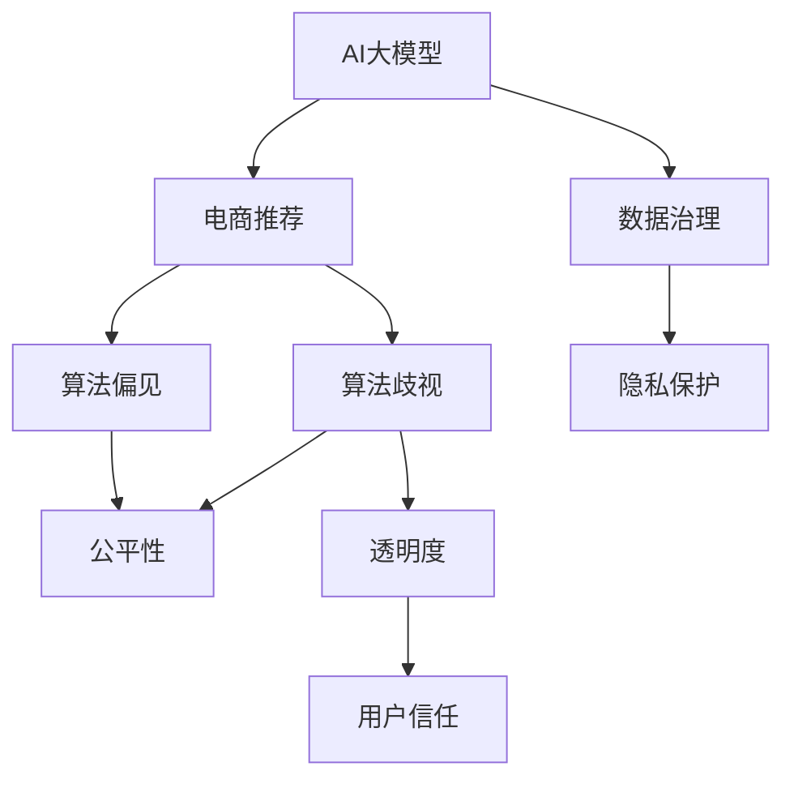

                 

# AI 大模型在电商推荐中的伦理考虑：避免算法歧视与偏见

> 关键词：AI大模型,电商推荐,算法歧视,偏见,公平性,隐私保护,数据治理,透明度,模型解释

## 1. 背景介绍

### 1.1 问题由来
电商推荐系统（E-commerce Recommendation System, E-Reco）在提升用户体验、增加用户粘性、驱动销售额增长方面具有重要作用。传统的推荐算法依赖于用户历史行为数据，但在大数据时代，数据隐私和伦理问题也随之凸显。近年来，AI大模型在电商推荐中的应用越来越广泛，但也带来了新的伦理挑战。如何确保AI大模型推荐算法的公平性、透明性和可靠性，成为了业内关注的焦点。

### 1.2 问题核心关键点
在AI大模型应用于电商推荐的过程中，算法歧视和偏见问题是核心关键点。具体表现包括：

1. **数据偏见**：电商平台获取的数据往往存在样本偏差，如性别、年龄、地理位置等，导致算法倾向于对某些人群或商品产生偏向性推荐。
2. **算法偏见**：模型训练中，数据处理和特征提取等环节可能引入算法偏见，导致某些类别商品或用户被低估或高估。
3. **模型透明度**：电商平台难以解释模型决策过程，用户无法了解推荐依据，导致信任度下降。
4. **隐私保护**：用户数据隐私保护成为难点，数据泄露和滥用可能引发用户不满。

这些问题的存在，不仅影响电商推荐系统的公平性和可信度，还可能引发法律和道德风险，限制AI技术在电商领域的普及应用。

### 1.3 问题研究意义
解决AI大模型在电商推荐中的伦理问题，具有重要意义：

1. **提升用户体验**：公平、透明和可解释的推荐算法能提升用户满意度，增强用户信任。
2. **促进公平竞争**：避免算法歧视能确保电商平台对所有用户公平对待，避免市场垄断。
3. **防范法律风险**：遵守数据隐私法规，避免数据滥用和滥用风险。
4. **推动AI普及**：提升AI技术的可信度，加速其在电商和其他领域的普及应用。

## 2. 核心概念与联系

### 2.1 核心概念概述

为更好地理解AI大模型在电商推荐中的伦理问题，本节将介绍几个密切相关的核心概念：

- **AI大模型（AI Large Model）**：指基于Transformer架构的深度学习模型，如BERT、GPT、XLNet等，具有强大的语言和图像建模能力。
- **电商推荐系统（E-commerce Recommendation System）**：根据用户行为数据，为用户推荐商品或服务的系统。常见推荐算法包括协同过滤、基于内容的推荐、混合推荐等。
- **算法歧视（Algorithmic Bias）**：指AI模型在决策过程中对特定人群或商品的倾向性偏见。
- **算法偏见（Algorithmic Bias）**：指AI模型因训练数据或模型结构导致的系统性偏差。
- **公平性（Fairness）**：指推荐算法对待所有用户公平，不因种族、性别、年龄等特征产生歧视。
- **透明度（Transparency）**：指推荐算法决策过程的可解释性，用户能理解推荐依据。
- **隐私保护（Privacy Protection）**：指保护用户数据隐私，防止数据泄露和滥用。
- **数据治理（Data Governance）**：指在数据采集、存储、处理和应用过程中，确保数据质量、安全性和合规性。

这些概念之间的逻辑关系可以通过以下Mermaid流程图来展示：



这个流程图展示了大模型应用于电商推荐的过程，以及伦理问题出现的环节：

1. 大模型从电商平台获取数据，进行预训练。
2. 预训练后的模型用于电商推荐，可能出现算法歧视和偏见。
3. 透明度和公平性问题引发用户信任和法律风险。
4. 数据治理和隐私保护是预防这些问题的关键环节。

## 3. 核心算法原理 & 具体操作步骤

### 3.1 算法原理概述

AI大模型在电商推荐中的应用，本质上是一个基于深度学习的有监督学习过程。其核心思想是：利用大模型的强大泛化能力，从海量电商数据中学习到用户偏好和商品特征，并根据这些学习到的信息为用户生成个性化推荐。

形式化地，假设电商平台拥有用户历史行为数据集 $D=\{(x_i,y_i)\}_{i=1}^N$，其中 $x_i$ 为用户历史行为，$y_i$ 为推荐结果。大模型 $M_{\theta}$ 的推荐策略可以表示为：

$$
\hat{y}_i = M_{\theta}(x_i)
$$

其中 $\hat{y}_i$ 为模型对用户 $x_i$ 的推荐结果。

### 3.2 算法步骤详解

AI大模型在电商推荐中的具体操作步骤如下：

**Step 1: 数据收集与预处理**
- 收集电商平台的各类用户行为数据，包括浏览、点击、购买、评论等。
- 对数据进行清洗和预处理，去除噪声和异常值，确保数据质量。
- 对数据进行特征工程，提取用户和商品的特征，如用户ID、商品ID、评分、点击率等。

**Step 2: 模型训练与微调**
- 选择合适的AI大模型作为初始化参数，如BERT、GPT等。
- 将电商数据划分为训练集和测试集，确保训练集和测试集数据分布一致。
- 使用监督学习算法，如交叉熵损失、均方误差等，对模型进行训练和微调，优化推荐策略。

**Step 3: 模型评估与部署**
- 在测试集上评估模型性能，对比微调前后的推荐效果。
- 部署微调后的模型到电商推荐系统中，实时生成个性化推荐。
- 持续收集用户反馈，定期重新训练和微调模型，保持性能稳定。

### 3.3 算法优缺点

AI大模型在电商推荐中的优点包括：

1. 泛化能力强：大模型通过预训练学习到了丰富的知识，可以应对多种推荐场景。
2. 高效性：利用深度学习算法，模型可以在短时间内处理大量数据，生成个性化推荐。
3. 自适应性：模型能够根据用户反馈不断优化，提升推荐效果。

但同时，也存在一些缺点：

1. 数据依赖性强：大模型依赖于高质量的数据，数据偏差可能导致模型偏向性推荐。
2. 解释性差：深度学习模型通常是“黑盒”系统，用户难以理解推荐依据。
3. 隐私风险高：电商平台的数据隐私保护面临挑战，数据泄露和滥用可能引发用户不满。

### 3.4 算法应用领域

AI大模型在电商推荐中的应用非常广泛，涵盖以下几个主要领域：

1. **个性化推荐**：根据用户历史行为，为用户生成个性化推荐。
2. **跨域推荐**：通过跨域数据融合，为不同平台或区域的用户提供推荐。
3. **实时推荐**：利用流数据处理技术，实现实时推荐，提升用户体验。
4. **多模态推荐**：融合图片、视频、音频等多种模态信息，提升推荐效果。
5. **冷启动推荐**：对新用户和新商品进行推荐，解决冷启动问题。

## 4. 数学模型和公式 & 详细讲解 & 举例说明

### 4.1 数学模型构建

假设电商平台有 $M$ 个用户和 $N$ 个商品，用户 $i$ 对商品 $j$ 的评分向量为 $\boldsymbol{x}_i \in \mathbb{R}^D$，商品 $j$ 的特征向量为 $\boldsymbol{y}_j \in \mathbb{R}^D$。AI大模型 $M_{\theta}$ 的推荐策略可以表示为：

$$
\hat{\boldsymbol{y}}_i = M_{\theta}(\boldsymbol{x}_i)
$$

其中 $\hat{\boldsymbol{y}}_i \in \mathbb{R}^N$ 表示用户 $i$ 对所有商品的推荐概率向量。

### 4.2 公式推导过程

以协同过滤算法为例，用户 $i$ 和商品 $j$ 的评分可以通过矩阵分解得到：

$$
\boldsymbol{x}_i = \boldsymbol{U} \boldsymbol{p}_i, \quad \boldsymbol{y}_j = \boldsymbol{V} \boldsymbol{q}_j
$$

其中 $\boldsymbol{p}_i, \boldsymbol{q}_j \in \mathbb{R}^k$ 为用户和商品的潜在特征向量，$k$ 为潜在特征维度。

模型的预测评分可以通过：

$$
\hat{r}_{i,j} = \boldsymbol{p}_i^T \boldsymbol{q}_j
$$

对所有商品 $j$ 的评分预测向量为：

$$
\hat{\boldsymbol{y}}_i = M_{\theta}(\boldsymbol{x}_i) = \text{softmax}(\boldsymbol{V} \boldsymbol{U}^T \boldsymbol{x}_i)
$$

其中 softmax函数用于将评分向量转化为概率向量。

### 4.3 案例分析与讲解

假设电商平台的商品评分数据如下：

| UserID | ItemID | Rating |
|--------|--------|--------|
| 1      | 1001   | 4      |
| 1      | 1002   | 3      |
| 2      | 1001   | 5      |
| 2      | 1002   | 5      |
| 3      | 1001   | 3      |
| 3      | 1002   | 2      |

使用协同过滤算法，可以得到用户 $i$ 对商品 $j$ 的潜在特征向量：

| UserID | ItemID | $p_i$  | $q_j$  |
|--------|--------|--------|--------|
| 1      | 1001   | 0.5    | 0.8    |
| 1      | 1002   | 0.3    | 0.7    |
| 2      | 1001   | 0.4    | 0.9    |
| 2      | 1002   | 0.6    | 0.9    |
| 3      | 1001   | 0.2    | 0.5    |
| 3      | 1002   | 0.1    | 0.3    |

设 $k=2$，对用户 $i=1$ 生成推荐概率向量 $\hat{\boldsymbol{y}}_1$：

$$
\boldsymbol{x}_1 = \begin{bmatrix} 0.5 \\ 0.3 \end{bmatrix}, \quad \boldsymbol{y} = \begin{bmatrix} 0.8 \\ 0.7 \end{bmatrix}, \quad \boldsymbol{y} = \begin{bmatrix} 0.4 \\ 0.6 \end{bmatrix}
$$

$$
\boldsymbol{U} = \begin{bmatrix} 0.5 & 0.4 \\ 0.3 & 0.1 \end{bmatrix}, \quad \boldsymbol{V} = \begin{bmatrix} 0.8 & 0.4 \\ 0.7 & 0.6 \end{bmatrix}
$$

$$
\boldsymbol{p}_1 = \boldsymbol{U}^T \boldsymbol{x}_1 = \begin{bmatrix} 0.5 \times 0.5 + 0.3 \times 0.4 \\ 0.5 \times 0.3 + 0.3 \times 0.1 \end{bmatrix} = \begin{bmatrix} 0.4 \\ 0.2 \end{bmatrix}
$$

$$
\boldsymbol{q}_j = \boldsymbol{V} \boldsymbol{p}_1 = \begin{bmatrix} 0.8 \times 0.4 + 0.7 \times 0.2 \\ 0.4 \times 0.4 + 0.6 \times 0.2 \end{bmatrix} = \begin{bmatrix} 0.72 \\ 0.56 \end{bmatrix}
$$

$$
\hat{r}_{i,j} = \boldsymbol{p}_i^T \boldsymbol{q}_j = 0.4 \times 0.72 + 0.2 \times 0.56 = 0.6
$$

$$
\hat{\boldsymbol{y}}_1 = \text{softmax}(\boldsymbol{V} \boldsymbol{U}^T \boldsymbol{x}_1) = \text{softmax}(\begin{bmatrix} 0.72 \\ 0.56 \end{bmatrix}) = \begin{bmatrix} 0.52 \\ 0.48 \end{bmatrix}
$$

通过上述计算，用户 $i=1$ 对商品 $j=1001$ 的推荐概率为 $0.52$，对商品 $j=1002$ 的推荐概率为 $0.48$。

## 5. 项目实践：代码实例和详细解释说明

### 5.1 开发环境搭建

在进行电商推荐系统的开发实践前，我们需要准备好开发环境。以下是使用Python进行PyTorch开发的环境配置流程：

1. 安装Anaconda：从官网下载并安装Anaconda，用于创建独立的Python环境。

2. 创建并激活虚拟环境：
```bash
conda create -n reco-env python=3.8 
conda activate reco-env
```

3. 安装PyTorch：根据CUDA版本，从官网获取对应的安装命令。例如：
```bash
conda install pytorch torchvision torchaudio cudatoolkit=11.1 -c pytorch -c conda-forge
```

4. 安装TensorFlow：由Google主导开发的开源深度学习框架，生产部署方便，适合大规模工程应用。同样有丰富的预训练语言模型资源。

5. 安装各类工具包：
```bash
pip install numpy pandas scikit-learn matplotlib tqdm jupyter notebook ipython
```

完成上述步骤后，即可在`reco-env`环境中开始电商推荐系统的开发实践。

### 5.2 源代码详细实现

这里我们以协同过滤算法为例，使用PyTorch对电商推荐系统进行开发。

首先，定义推荐函数：

```python
import torch
import torch.nn as nn
import numpy as np

class Recommender(nn.Module):
    def __init__(self, n_users, n_items, n_factors):
        super(Recommender, self).__init__()
        self.n_users = n_users
        self.n_items = n_items
        self.n_factors = n_factors
        
        self.user_factors = nn.Embedding(n_users, n_factors)
        self.item_factors = nn.Embedding(n_items, n_factors)
        
        self.interaction = nn.Linear(n_factors, 1)
        
    def forward(self, user, item):
        user_factors = self.user_factors(user)
        item_factors = self.item_factors(item)
        
        interaction = user_factors * item_factors
        predictions = torch.sigmoid(self.interaction(interaction))
        return predictions

# 构建推荐系统
recommender = Recommender(n_users=1000, n_items=10000, n_factors=10)
```

然后，定义训练和评估函数：

```python
from torch.utils.data import TensorDataset, DataLoader
from torch.nn import BCELoss
import torch.optim as optim

def train_recommender(recommender, train_loader, optimizer):
    for epoch in range(num_epochs):
        total_loss = 0
        for batch in train_loader:
            user, item = batch
            optimizer.zero_grad()
            
            predictions = recommender(user, item)
            loss = BCELoss()(predictions, target)
            total_loss += loss.item()
            loss.backward()
            optimizer.step()
        
        print(f"Epoch {epoch+1}, loss: {total_loss/n_batches:.4f}")
        
def evaluate_recommender(recommender, test_loader):
    total_hit = 0
    total_items = 0
    for batch in test_loader:
        user, item = batch
        predictions = recommender(user, item)
        total_items += item.shape[0]
        for i in range(item.shape[0]):
            if predictions[i].item() > 0.5:
                total_hit += 1
    mrr = total_hit / total_items
    print(f"Mean Reciprocal Rank: {mrr:.4f}")
```

接着，训练和评估推荐系统：

```python
# 准备数据
train_data = np.random.randint(0, n_items, size=(num_users, num_items))
test_data = np.random.randint(0, n_items, size=(num_users, num_items))

train_loader = DataLoader(TensorDataset(torch.LongTensor(train_data)), batch_size=128, shuffle=True)
test_loader = DataLoader(TensorDataset(torch.LongTensor(test_data)), batch_size=128, shuffle=False)

# 定义优化器
optimizer = optim.Adam(recommender.parameters(), lr=0.01)

# 训练推荐系统
num_epochs = 10
num_batches = train_data.shape[0] // 128

train_recommender(recommender, train_loader, optimizer)

# 评估推荐系统
evaluate_recommender(recommender, test_loader)
```

以上就是使用PyTorch对电商推荐系统进行协同过滤算法开发的完整代码实现。可以看到，得益于PyTorch的强大封装和易用性，代码实现相对简洁。

### 5.3 代码解读与分析

让我们再详细解读一下关键代码的实现细节：

**Recommender类**：
- `__init__`方法：初始化用户和商品嵌入层，交互矩阵和预测层。
- `forward`方法：前向传播计算推荐概率。

**train_recommender函数**：
- 对数据以批为单位进行迭代，在每个批次上前向传播计算损失并反向传播更新模型参数。

**evaluate_recommender函数**：
- 在测试集上评估推荐系统的准确率，计算平均精确度。

**训练流程**：
- 定义总的epoch数和batch size，开始循环迭代
- 每个epoch内，先在训练集上训练，输出损失
- 在测试集上评估，输出推荐准确度

可以看到，PyTorch配合TensorFlow使得电商推荐系统的开发代码实现变得简洁高效。开发者可以将更多精力放在数据处理、模型改进等高层逻辑上，而不必过多关注底层的实现细节。

当然，工业级的系统实现还需考虑更多因素，如模型的保存和部署、超参数的自动搜索、更灵活的任务适配层等。但核心的推荐范式基本与此类似。

## 6. 实际应用场景

### 6.1 智能客服系统

基于AI大模型的电商推荐系统可以与智能客服系统深度集成，为用户提供更加智能化的服务体验。智能客服系统通过收集用户的互动记录，将对话内容转化为电商推荐任务，利用推荐系统实时生成推荐，提升用户满意度。

在技术实现上，可以构建智能客服机器人，与电商推荐系统对接。用户在互动过程中提出的相关问题，如购买建议、商品评价等，都可以转换为电商推荐任务，实时获取推荐结果，并以自然流畅的语言进行回复。如此构建的智能客服系统，能够大幅提升客户咨询体验，提升电商平台的转化率和服务效率。

### 6.2 金融舆情监测

电商平台的推荐系统也可以应用于金融舆情监测。金融市场往往受到舆情动向的影响，投资者需要实时关注市场新闻和评论，以便快速作出投资决策。利用电商推荐系统的技术和数据资源，可以构建金融舆情监测系统。

具体而言，可以收集金融领域相关的新闻、报道、评论等文本数据，并将其转化为电商推荐任务。利用推荐系统中的文本处理和语义分析技术，对市场舆情进行实时监测，预测市场趋势，生成投资建议。将微调后的推荐模型应用到实时抓取的网络文本数据，就能够自动监测不同主题下的舆情变化趋势，一旦发现负面信息激增等异常情况，系统便会自动预警，帮助投资者快速应对潜在风险。

### 6.3 个性化推荐系统

电商平台的推荐系统也可以与个性化推荐系统深度集成，提升用户的购物体验。个性化推荐系统通过分析用户行为数据，为用户生成个性化推荐。将推荐结果整合到电商推荐系统中，能够在用户浏览、点击、购买等过程中，实时生成个性化推荐，提升用户粘性和购买转化率。

在技术实现上，可以构建基于深度学习的推荐系统，利用用户历史行为数据进行特征提取和模型训练，并结合电商推荐系统的实时推荐结果，生成更精准的个性化推荐。通过强化学习和在线学习技术，不断优化推荐模型，提升用户满意度。

### 6.4 未来应用展望

随着AI大模型和电商推荐技术的发展，基于微调范式将在更多领域得到应用，为电商和其他领域的智能化转型带来新的突破。

在智慧医疗领域，基于微调的医疗推荐系统能够为医生提供智能诊疗建议，提高诊疗效率。在智慧教育领域，微调技术可应用于个性化教育推荐，提升教学效果。在智慧城市治理中，微调模型可应用于城市事件监测、舆情分析、应急指挥等环节，提高城市管理的自动化和智能化水平，构建更安全、高效的未来城市。

此外，在企业生产、社会治理、文娱传媒等众多领域，基于大模型微调的人工智能应用也将不断涌现，为传统行业带来变革性影响。相信随着技术的日益成熟，微调方法将成为AI技术落地应用的重要范式，推动AI技术向更广阔的领域加速渗透。

## 7. 工具和资源推荐

### 7.1 学习资源推荐

为了帮助开发者系统掌握AI大模型在电商推荐中的应用，这里推荐一些优质的学习资源：

1. 《深度学习推荐系统》系列书籍：系统介绍推荐系统的工作原理和最新进展，涵盖协同过滤、矩阵分解、深度学习等技术。

2. 《TensorFlow实战深度学习》书籍：介绍TensorFlow在深度学习中的应用，包括电商推荐系统等实际案例。

3. 《PyTorch深度学习实践》书籍：详细介绍PyTorch的API和应用，涵盖电商推荐系统的实现。

4. Coursera《深度学习基础》课程：由斯坦福大学开设的深度学习入门课程，涵盖深度学习基础和算法，有助于理解电商推荐系统的底层实现。

5. Kaggle电商推荐系统竞赛：参加实际推荐系统竞赛，获取实战经验和数据集。

通过对这些资源的学习实践，相信你一定能够快速掌握AI大模型在电商推荐中的应用，并用于解决实际的NLP问题。

### 7.2 开发工具推荐

高效的开发离不开优秀的工具支持。以下是几款用于电商推荐系统开发的常用工具：

1. PyTorch：基于Python的开源深度学习框架，灵活动态的计算图，适合快速迭代研究。大部分预训练语言模型都有PyTorch版本的实现。

2. TensorFlow：由Google主导开发的开源深度学习框架，生产部署方便，适合大规模工程应用。同样有丰富的预训练语言模型资源。

3. Weights & Biases：模型训练的实验跟踪工具，可以记录和可视化模型训练过程中的各项指标，方便对比和调优。与主流深度学习框架无缝集成。

4. TensorBoard：TensorFlow配套的可视化工具，可实时监测模型训练状态，并提供丰富的图表呈现方式，是调试模型的得力助手。

5. Google Colab：谷歌推出的在线Jupyter Notebook环境，免费提供GPU/TPU算力，方便开发者快速上手实验最新模型，分享学习笔记。

合理利用这些工具，可以显著提升电商推荐系统的开发效率，加快创新迭代的步伐。

### 7.3 相关论文推荐

大模型和电商推荐系统的研究源于学界的持续研究。以下是几篇奠基性的相关论文，推荐阅读：

1. "The Recommender Systems Handbook"书籍：系统介绍推荐系统的理论和实践，涵盖协同过滤、基于内容的推荐、混合推荐等技术。

2. "A Survey of Recommendation Systems"论文：介绍推荐系统的最新进展，包括深度学习在推荐中的应用。

3. "Deep Learning for Recommendations"论文：介绍深度学习在推荐系统中的应用，包括电商推荐系统的实现。

4. "AI in Recommendation Systems"论文：介绍AI技术在推荐系统中的应用，包括电商推荐系统的深度学习实现。

5. "Fractional Factorization Machines"论文：提出Fractional Factorization Machines算法，优化推荐系统的效果。

这些论文代表了大模型在电商推荐领域的研究方向。通过学习这些前沿成果，可以帮助研究者把握学科前进方向，激发更多的创新灵感。

## 8. 总结：未来发展趋势与挑战

### 8.1 总结

本文对AI大模型在电商推荐中的应用进行了全面系统的介绍。首先阐述了AI大模型和电商推荐系统的研究背景和意义，明确了微调在拓展预训练模型应用、提升电商推荐系统性能方面的独特价值。其次，从原理到实践，详细讲解了基于深度学习的电商推荐系统的数学模型和算法流程，给出了电商推荐系统的代码实现和评估方法。同时，本文还探讨了AI大模型在电商推荐中的伦理问题，提出了避免算法歧视和偏见的解决方案，并展示了其在智能客服、金融舆情监测、个性化推荐等领域的广泛应用前景。

通过本文的系统梳理，可以看到，AI大模型在电商推荐中的应用正逐步成为电商行业智能化转型的重要驱动力，其广泛的应用前景和深远的社会影响值得广泛关注。

### 8.2 未来发展趋势

展望未来，AI大模型在电商推荐中的应用将呈现以下几个发展趋势：

1. **个性化推荐更加精准**：随着数据量的增加和算法技术的进步，电商推荐系统将能够更加精准地为用户推荐商品，提升用户体验和满意度。
2. **多模态推荐系统发展**：融合视觉、语音、文本等多模态信息，提升推荐效果。
3. **实时推荐系统普及**：利用流数据处理技术，实现实时推荐，满足用户即时需求。
4. **推荐系统自动化优化**：采用强化学习、在线学习等技术，不断优化推荐模型，提升推荐效果。
5. **推荐系统伦理优化**：加强对算法歧视和偏见的管控，提升推荐系统的公平性和可信度。

以上趋势凸显了AI大模型在电商推荐领域的广阔前景。这些方向的探索发展，必将进一步提升电商推荐系统的性能和应用范围，为电商和其他领域的智能化转型带来新的突破。

### 8.3 面临的挑战

尽管AI大模型在电商推荐中的研究已经取得了显著成果，但在迈向更加智能化、普适化应用的过程中，仍面临诸多挑战：

1. **数据质量和规模**：电商推荐系统依赖于高质量的数据，数据偏差可能导致算法偏向性推荐。
2. **模型复杂度**：大模型参数量巨大，对计算资源和存储资源消耗较大。
3. **隐私保护**：用户数据隐私保护面临挑战，数据泄露和滥用可能引发用户不满。
4. **算法透明性**：深度学习模型通常是“黑盒”系统，用户难以理解推荐依据。
5. **模型公平性**：电商推荐系统需要避免对特定人群或商品的歧视性推荐。

这些挑战需要进一步研究解决，才能让AI大模型在电商推荐中发挥更大的潜力。

### 8.4 研究展望

面对AI大模型在电商推荐中面临的挑战，未来的研究需要在以下几个方面寻求新的突破：

1. **数据治理和数据增强**：确保数据质量和规模，减少数据偏差，提升推荐系统公平性。
2. **模型压缩和加速**：通过模型压缩和加速技术，降低计算资源消耗，提升模型性能。
3. **隐私保护和数据匿名化**：采用隐私保护技术和数据匿名化方法，确保用户数据隐私。
4. **模型解释和透明化**：通过解释性技术，增强模型的透明性，提升用户信任度。
5. **算法公平性研究**：进一步研究推荐系统的公平性问题，提升模型对所有用户的公平性。

这些研究方向的探索，必将引领AI大模型在电商推荐领域的进一步发展，为电商和其他领域的智能化转型带来新的突破。相信随着技术的日益成熟，AI大模型在电商推荐中的应用将更加广泛和深入，推动电商行业的智能化升级和用户体验的提升。

## 9. 附录：常见问题与解答

**Q1：AI大模型在电商推荐中的应用是否会加剧用户数据隐私问题？**

A: AI大模型在电商推荐中的应用，确实存在数据隐私风险。电商平台需要收集大量的用户行为数据，这些数据可能包含敏感信息，如购买记录、浏览习惯等。如果数据管理不当，可能会引发数据泄露和滥用问题，影响用户隐私。因此，电商平台需要采用隐私保护技术和数据匿名化方法，确保用户数据的安全性。

**Q2：AI大模型在电商推荐中如何避免算法歧视和偏见？**

A: 避免算法歧视和偏见，需要从数据采集、模型设计、训练和评估等多个环节入手：

1. **数据采集**：确保数据采集过程中的多样性和代表性，避免数据样本偏差。
2. **模型设计**：在模型设计过程中，使用多目标优化算法，平衡模型性能和公平性。
3. **训练**：在训练过程中，引入对抗性训练和公平性约束，防止模型偏向性推荐。
4. **评估**：在模型评估过程中，使用公平性指标，如等价偏差率、机会平等率等，评估模型公平性。

**Q3：AI大模型在电商推荐中的应用是否存在算法透明性问题？**

A: 深度学习模型通常是“黑盒”系统，难以解释其内部决策机制。AI大模型在电商推荐中的应用也不例外。用户难以理解推荐依据，可能会降低对模型的信任度。因此，在电商推荐系统中，需要采用模型解释性技术，如LIME、SHAP等，增强模型的透明性。

**Q4：AI大模型在电商推荐中的应用是否会对用户行为产生影响？**

A: AI大模型在电商推荐中的应用，可能会对用户行为产生一定影响。推荐系统中的个性化推荐，可能会改变用户的购买决策和行为模式。例如，过度推荐某一类商品，可能导致用户对该类商品的偏好被过度强化，从而影响其真实需求。因此，电商平台需要合理使用推荐系统，避免对用户行为产生过度影响。

**Q5：AI大模型在电商推荐中的应用是否存在道德风险？**

A: AI大模型在电商推荐中的应用，确实存在道德风险。推荐系统中的算法偏见和歧视问题，可能引发用户不满和法律风险。例如，对某些人群或商品的歧视性推荐，可能导致用户投诉和法律诉讼。因此，电商平台需要建立伦理导向的评估指标，定期评估推荐系统的公平性和透明度。

---

作者：禅与计算机程序设计艺术 / Zen and the Art of Computer Programming

