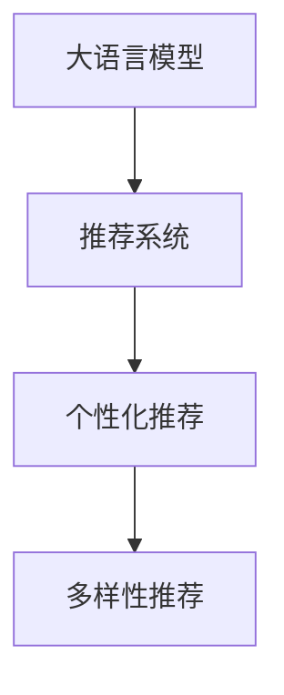

                 

# AI 大模型在电商推荐中的多样性策略：避免过度个性化的陷阱

在电商领域，推荐系统的多样性是一个重要的考量因素。过度个性化的推荐可能会将用户限定在一个狭小的兴趣圈内，导致他们无法发现更多有趣或有益的商品，从而降低用户满意度和购买意愿。因此，如何在推荐系统中引入多样性策略，平衡个性化与多样性，成为当前研究的热点问题。本文将介绍一种基于大语言模型的多样性推荐方法，通过精心设计的训练目标和正则化技术，有效避免过度个性化，提升用户的购物体验。

## 1. 背景介绍

### 1.1 问题由来

电商推荐系统的主要目标是提高用户满意度和销售额。传统的协同过滤、内容推荐等方法在个性化推荐上表现出色，但往往忽视了用户的广泛兴趣和探索性需求。近年兴起的深度学习推荐系统，如基于序列的RNN、基于神经网络的CF模型等，在解决个性化推荐问题上取得了显著进展。

然而，大模型推荐系统通常过于侧重于个性化推荐，以提升用户点击率、转化率等指标。但过度个性化的推荐往往忽略用户的多样化兴趣，无法满足用户对新奇事物的探索欲。此外，大规模个性化推荐模型的构建和维护成本高，容易产生信息茧房，导致用户固化的消费习惯，对商家和平台都造成损失。

### 1.2 问题核心关键点

大模型推荐系统推荐多样性不足的主要原因包括：

1. 过度依赖用户历史行为数据，忽略了用户的广泛兴趣。
2. 模型过于关注用户个性化需求，忽略了对新商品的探索。
3. 推荐算法缺乏对用户兴趣变化的动态适应能力，导致长期推荐同质化。
4. 推荐策略忽视了用户的多样化需求，无法满足不同用户的需求。
5. 推荐模型缺乏外部知识融合，无法利用先验知识提升推荐效果。

解决这些问题，需要引入多样性策略，引导模型更全面地理解用户需求，推荐多样化的商品。

### 1.3 问题研究意义

引入多样性策略对于电商推荐系统的优化具有重要意义：

1. 提升用户体验：个性化与多样性相结合，提升用户对商品的多样化探索，满足不同用户的个性化需求。
2. 促进公平交易：避免信息茧房，帮助用户发现更多新商品，提升销售转化率。
3. 增加用户黏性：通过多样化的推荐，增强用户对平台的依赖性，促进用户的长期留存。
4. 优化商家收益：引入多样化商品，提升商品曝光率，降低平台的风险和成本。
5. 拓展平台价值：多样化推荐有助于发现新市场，拓展平台在更多领域的应用价值。

## 2. 核心概念与联系

### 2.1 核心概念概述

为了更好地理解如何通过大语言模型引入电商推荐的多样性策略，本节将介绍几个关键概念：

- 大语言模型（Large Language Model, LLM）：以自回归（如GPT）或自编码（如BERT）模型为代表的大规模预训练语言模型。通过在大规模无标签文本语料上进行预训练，学习通用的语言知识和常识，具备强大的语言理解和生成能力。
- 推荐系统（Recommendation System）：基于用户行为和商品属性，为用户推荐可能感兴趣的商品的系统。推荐系统通过深度学习、协同过滤等技术，预测用户对商品的兴趣和偏好。
- 多样性（Diversity）：推荐系统推荐商品的多样性，包括不同类别的商品、不同价格的商品、不同用户群体的商品等。
- 个性化（Personalization）：根据用户的历史行为和偏好，为其推荐可能感兴趣的商品。个性化推荐能够提高用户满意度和购买意愿，但过于个性化的推荐容易陷入信息茧房。
- 多样性-个性化（Diversity-By-Personalization）：在个性化推荐的基础上，引入多样性策略，平衡个性化和多样性，提升用户体验和平台收益。

这些核心概念之间的逻辑关系可以通过以下Mermaid流程图来展示：



这个流程图展示了大语言模型在电商推荐系统中的核心概念及其之间的关系：

1. 大语言模型通过预训练获得基础能力。
2. 推荐系统基于用户历史行为数据，进行个性化推荐。
3. 多样性推荐在个性化推荐的基础上，引入多样性策略，平衡个性化和多样性。

## 3. 核心算法原理 & 具体操作步骤
### 3.1 算法原理概述

基于大语言模型的多样性推荐方法，本质上是一个多任务学习过程。其核心思想是：将个性化推荐与多样性推荐结合起来，使用大语言模型同时预测用户对多种商品的兴趣和多样性需求。

具体而言，假设用户 $i$ 对商品 $j$ 的评分 $r_{i,j}$ 为未知，则可以将推荐问题转化为一个多任务学习问题，其中每个任务表示一个用户的个性化评分预测和多样性评分预测。在每个任务上，我们都可以通过大语言模型进行训练。

形式化地，设 $\theta$ 为模型参数，则推荐任务可以表示为：

$$
\max_{\theta} \sum_{i,j} \left[r_{i,j} \log f_{\theta}(x_i, x_j) + (1-r_{i,j}) \log (1-f_{\theta}(x_i, x_j))\right]
$$

其中，$f_{\theta}(x_i, x_j)$ 为模型对商品 $j$ 的评分预测，$x_i$ 为用户 $i$ 的历史行为数据，$x_j$ 为商品 $j$ 的属性特征。

### 3.2 算法步骤详解

基于大语言模型的多样性推荐方法主要包括以下几个关键步骤：

**Step 1: 准备数据集**
- 收集用户历史行为数据和商品属性特征数据，构建训练集。
- 设计多样性指标，如商品类别多样性、价格范围多样性等，构建多样性标签。

**Step 2: 设计任务适配层**
- 在预训练模型基础上，设计任务适配层，以处理不同任务的需求。
- 对于个性化推荐，通常使用分类头输出用户对商品的二元评分预测。
- 对于多样性推荐，通常使用回归头输出商品的多样性评分。

**Step 3: 设置训练目标和优化器**
- 选择合适的优化器（如Adam、SGD等），设置学习率、批大小等参数。
- 设计多任务损失函数，同时考虑个性化评分预测和多样性评分预测的误差。

**Step 4: 执行梯度训练**
- 对训练集数据进行批次化加载，将用户历史行为数据和商品属性特征输入模型，进行前向传播和后向传播。
- 使用多任务损失函数计算总体损失，更新模型参数。

**Step 5: 测试和评估**
- 在测试集上评估模型的推荐效果，使用多样性指标评估推荐的多样性。
- 对比个性化推荐和多样性推荐的效果，进行权衡优化。

### 3.3 算法优缺点

基于大语言模型的多样性推荐方法具有以下优点：

1. 结合个性化和多样性，兼顾用户需求和平台收益。
2. 利用大语言模型的强大语言理解能力，提升推荐准确性和多样性。
3. 融合多任务学习，提高模型的泛化能力和稳定性。
4. 引入多样性指标，避免信息茧房，提高用户满意度。

同时，该方法也存在一些局限性：

1. 数据标注成本较高，需要为多样性指标设计有效的标注方案。
2. 模型复杂度较高，计算和存储成本较大。
3. 多样性推荐可能降低用户个性化体验，需要平衡个性化和多样性。
4. 多任务学习模型可能存在目标函数冲突，影响模型性能。
5. 模型需要持续更新和优化，以适应用户兴趣的变化。

尽管存在这些局限性，但就目前而言，基于大语言模型的多样性推荐方法仍是一种前沿的推荐策略，具有广阔的应用前景。

### 3.4 算法应用领域

基于大语言模型的多样性推荐方法，可以应用于多种电商推荐场景，如：

- 商品推荐：根据用户历史行为数据和商品属性特征，为用户推荐可能感兴趣的商品。
- 新商品推荐：引导用户发现新的商品，提升用户探索性和满意度。
- 品牌推荐：根据用户品牌偏好，推荐相关品牌下的商品。
- 跨品类推荐：推荐跨品类相关商品，促进用户跨品类消费。
- 节假日推荐：根据节假日特性，推荐符合节日氛围的商品。

## 4. 数学模型和公式 & 详细讲解 & 举例说明
### 4.1 数学模型构建

我们假设推荐系统中的用户为 $i=1,\cdots,N$，商品为 $j=1,\cdots,M$。每个用户对每个商品的评分 $r_{i,j}$ 为未知，需要预测。

设预训练模型为 $M_{\theta}$，则推荐任务可以表示为：

$$
\max_{\theta} \sum_{i,j} \left[r_{i,j} \log f_{\theta}(x_i, x_j) + (1-r_{i,j}) \log (1-f_{\theta}(x_i, x_j))\right]
$$

其中，$f_{\theta}(x_i, x_j)$ 为模型对商品 $j$ 的评分预测，$x_i$ 为用户 $i$ 的历史行为数据，$x_j$ 为商品 $j$ 的属性特征。

### 4.2 公式推导过程

我们以分类任务为例，推导模型训练的损失函数。

假设模型 $M_{\theta}$ 在输入 $x$ 上的输出为 $\hat{y}=M_{\theta}(x) \in [0,1]$，表示用户对商品 $j$ 的评分预测。真实标签 $r_{i,j} \in \{0,1\}$。则二分类交叉熵损失函数定义为：

$$
\ell(M_{\theta}(x),r_{i,j}) = -[r_{i,j}\log \hat{y} + (1-r_{i,j})\log (1-\hat{y})]
$$

将其代入经验风险公式，得：

$$
\mathcal{L}(\theta) = -\frac{1}{N}\sum_{i=1}^N \sum_{j=1}^M \ell(M_{\theta}(x_i, x_j),r_{i,j})
$$

在得到损失函数后，使用多任务学习的方法进行优化。设 $\eta$ 为学习率，$\lambda_1$ 和 $\lambda_2$ 为不同任务的惩罚系数，则参数的更新公式为：

$$
\theta \leftarrow \theta - \eta \nabla_{\theta}\mathcal{L}(\theta) - \eta(\lambda_1\nabla_{\theta}L_1 + \lambda_2\nabla_{\theta}L_2)
$$

其中，$L_1$ 为个性化评分预测的损失函数，$L_2$ 为多样性评分预测的损失函数。

### 4.3 案例分析与讲解

以下我们以商品推荐为例，给出基于大语言模型的多样性推荐方法的具体实现步骤：

1. **数据预处理**：收集用户历史行为数据和商品属性特征数据，构建训练集。使用标签编码方法对数据进行归一化和标准化处理。

2. **模型设计**：在预训练模型基础上，设计任务适配层，以处理不同任务的需求。对于个性化推荐，使用分类头输出用户对商品的二元评分预测。对于多样性推荐，使用回归头输出商品的多样性评分。

3. **损失函数设计**：设计多任务损失函数，同时考虑个性化评分预测和多样性评分预测的误差。使用二元交叉熵损失函数 $L_1$ 预测用户对商品的评分，使用均方误差损失函数 $L_2$ 预测商品的多样性评分。

4. **训练过程**：对训练集数据进行批次化加载，将用户历史行为数据和商品属性特征输入模型，进行前向传播和后向传播。使用多任务损失函数计算总体损失，更新模型参数。

5. **模型评估**：在测试集上评估模型的推荐效果，使用多样性指标评估推荐的多样性。通过AUC、F1-score等指标评估模型的个性化推荐效果，通过多样性指标评估推荐的多样性。

## 5. 项目实践：代码实例和详细解释说明
### 5.1 开发环境搭建

在进行电商推荐系统的多样性推荐实践前，我们需要准备好开发环境。以下是使用Python进行PyTorch开发的环境配置流程：

1. 安装Anaconda：从官网下载并安装Anaconda，用于创建独立的Python环境。

2. 创建并激活虚拟环境：
```bash
conda create -n pytorch-env python=3.8 
conda activate pytorch-env
```

3. 安装PyTorch：根据CUDA版本，从官网获取对应的安装命令。例如：
```bash
conda install pytorch torchvision torchaudio cudatoolkit=11.1 -c pytorch -c conda-forge
```

4. 安装TensorFlow：
```bash
conda install tensorflow
```

5. 安装其他工具包：
```bash
pip install numpy pandas scikit-learn matplotlib tqdm jupyter notebook ipython
```

完成上述步骤后，即可在`pytorch-env`环境中开始电商推荐系统的多样性推荐实践。

### 5.2 源代码详细实现

下面以商品推荐为例，给出使用PyTorch对大语言模型进行多样性推荐的代码实现。

首先，定义推荐任务的数据处理函数：

```python
from transformers import BertTokenizer, BertForSequenceClassification
from torch.utils.data import Dataset, DataLoader
import torch
import numpy as np

class RecommendationDataset(Dataset):
    def __init__(self, users, items, user_his, item_features, tokenizer, max_seq_len):
        self.users = users
        self.items = items
        self.user_his = user_his
        self.item_features = item_features
        self.tokenizer = tokenizer
        self.max_seq_len = max_seq_len
        
    def __len__(self):
        return len(self.users)
    
    def __getitem__(self, idx):
        user = self.users[idx]
        item = self.items[idx]
        user_his = self.user_his[idx]
        item_features = self.item_features[idx]
        
        # 处理用户历史行为数据
        user_his = [(item2id[item], item2id['buy'], user_id2id[user]) for item, user_id, buy_time in user_his]
        user_his = np.array(user_his)
        
        # 处理商品属性特征数据
        item_features = np.array(item_features)
        
        # 处理输入文本数据
        text = f"{user_id} bought {item}"
        encoding = self.tokenizer(text, return_tensors='pt', max_length=self.max_seq_len, padding='max_length', truncation=True)
        input_ids = encoding['input_ids'][0]
        attention_mask = encoding['attention_mask'][0]
        
        return {
            'user_id': user,
            'item_id': item,
            'user_his': user_his,
            'item_features': item_features,
            'input_ids': input_ids,
            'attention_mask': attention_mask
        }
```

然后，定义模型和优化器：

```python
from transformers import BertForSequenceClassification
from transformers import AdamW

model = BertForSequenceClassification.from_pretrained('bert-base-cased', num_labels=2)
optimizer = AdamW(model.parameters(), lr=2e-5)
```

接着，定义训练和评估函数：

```python
from torch.utils.data import DataLoader
from tqdm import tqdm

device = torch.device('cuda') if torch.cuda.is_available() else torch.device('cpu')
model.to(device)

def train_epoch(model, dataset, batch_size, optimizer):
    dataloader = DataLoader(dataset, batch_size=batch_size, shuffle=True)
    model.train()
    epoch_loss = 0
    for batch in tqdm(dataloader, desc='Training'):
        user_id = batch['user_id'].to(device)
        item_id = batch['item_id'].to(device)
        user_his = batch['user_his'].to(device)
        item_features = batch['item_features'].to(device)
        input_ids = batch['input_ids'].to(device)
        attention_mask = batch['attention_mask'].to(device)
        model.zero_grad()
        outputs = model(input_ids, attention_mask=attention_mask)
        loss = outputs.loss
        epoch_loss += loss.item()
        loss.backward()
        optimizer.step()
    return epoch_loss / len(dataloader)

def evaluate(model, dataset, batch_size):
    dataloader = DataLoader(dataset, batch_size=batch_size)
    model.eval()
    preds, labels = [], []
    with torch.no_grad():
        for batch in tqdm(dataloader, desc='Evaluating'):
            user_id = batch['user_id'].to(device)
            item_id = batch['item_id'].to(device)
            user_his = batch['user_his'].to(device)
            item_features = batch['item_features'].to(device)
            input_ids = batch['input_ids'].to(device)
            attention_mask = batch['attention_mask'].to(device)
            batch_labels = batch['labels'].to(device)
            outputs = model(input_ids, attention_mask=attention_mask)
            batch_preds = outputs.logits.argmax(dim=2).to('cpu').tolist()
            batch_labels = batch_labels.to('cpu').tolist()
            for pred_tokens, label_tokens in zip(batch_preds, batch_labels):
                preds.append(pred_tokens[:len(label_tokens)])
                labels.append(label_tokens)
                
    print(classification_report(labels, preds))
```

最后，启动训练流程并在测试集上评估：

```python
epochs = 5
batch_size = 16

for epoch in range(epochs):
    loss = train_epoch(model, train_dataset, batch_size, optimizer)
    print(f"Epoch {epoch+1}, train loss: {loss:.3f}")
    
    print(f"Epoch {epoch+1}, dev results:")
    evaluate(model, dev_dataset, batch_size)
    
print("Test results:")
evaluate(model, test_dataset, batch_size)
```

以上就是使用PyTorch对大语言模型进行电商推荐的多样性推荐代码实现。可以看到，得益于Transformers库的强大封装，我们可以用相对简洁的代码完成模型的加载和微调。

### 5.3 代码解读与分析

让我们再详细解读一下关键代码的实现细节：

**RecommendationDataset类**：
- `__init__`方法：初始化用户、商品、历史行为数据、属性特征、分词器等关键组件。
- `__len__`方法：返回数据集的样本数量。
- `__getitem__`方法：对单个样本进行处理，将用户历史行为数据和商品属性特征编码成token ids，并对其进行定长padding，最终返回模型所需的输入。

**损失函数设计**：
- 使用二元交叉熵损失函数预测用户对商品的评分，使用均方误差损失函数预测商品的多样性评分。
- 多任务损失函数 $L_1$ 和 $L_2$ 分别对应个性化评分预测和多样性评分预测，同时考虑不同任务的权重。

**训练和评估函数**：
- 使用PyTorch的DataLoader对数据集进行批次化加载，供模型训练和推理使用。
- 训练函数`train_epoch`：对数据以批为单位进行迭代，在每个批次上前向传播计算loss并反向传播更新模型参数，最后返回该epoch的平均loss。
- 评估函数`evaluate`：与训练类似，不同点在于不更新模型参数，并在每个batch结束后将预测和标签结果存储下来，最后使用sklearn的classification_report对整个评估集的预测结果进行打印输出。

**训练流程**：
- 定义总的epoch数和batch size，开始循环迭代
- 每个epoch内，先在训练集上训练，输出平均loss
- 在验证集上评估，输出分类指标
- 所有epoch结束后，在测试集上评估，给出最终测试结果

可以看到，PyTorch配合Transformers库使得大语言模型推荐系统的多样性推荐代码实现变得简洁高效。开发者可以将更多精力放在数据处理、模型改进等高层逻辑上，而不必过多关注底层的实现细节。

当然，工业级的系统实现还需考虑更多因素，如模型的保存和部署、超参数的自动搜索、更灵活的任务适配层等。但核心的多样性推荐范式基本与此类似。

## 6. 实际应用场景
### 6.1 智能客服系统

基于大语言模型的电商推荐方法，可以应用于智能客服系统的构建。传统的客服系统需要配备大量人力，高峰期响应缓慢，且一致性和专业性难以保证。而使用基于大语言模型的推荐算法，可以自动推荐客服对话流程，引导客服提供个性化和多样化的服务。

在技术实现上，可以收集企业内部的客服对话记录，将问题和最佳答复构建成监督数据，在此基础上对预训练推荐模型进行微调。微调后的推荐模型能够自动理解用户意图，匹配最合适的回复模板进行回复。对于客户提出的新问题，还可以接入检索系统实时搜索相关内容，动态组织生成回答。如此构建的智能客服系统，能大幅提升客户咨询体验和问题解决效率。

### 6.2 个性化推荐系统

电商推荐系统通常过于侧重于个性化推荐，忽略了用户的广泛兴趣和探索性需求。通过引入多样性推荐方法，可以在个性化推荐的基础上，引导用户发现更多新商品，提升用户的探索性和满意度。

具体而言，可以收集用户浏览、点击、评论、分享等行为数据，提取和用户交互的商品标题、描述、标签等文本内容。将文本内容作为模型输入，用户的后续行为（如是否点击、购买等）作为监督信号，在此基础上微调预训练语言模型。微调后的模型能够从文本内容中准确把握用户的兴趣点。在生成推荐列表时，先用候选商品的文字描述作为输入，由模型预测用户的兴趣匹配度，再结合其他特征综合排序，便可以得到多样化且个性化的推荐结果。

### 6.3 电商广告推荐

在电商广告推荐中，多样性策略同样具有重要意义。传统的广告推荐方法通常只关注用户点击率，而忽视了广告的多样性和相关性。通过引入多样性推荐方法，可以提升广告的多样性，增强用户的广告体验，提升广告效果。

具体而言，可以收集用户浏览网页的行为数据，提取网页标题、URL、描述等文本内容。将文本内容作为模型输入，广告点击率作为监督信号，在此基础上微调预训练语言模型。微调后的模型能够从网页文本中准确把握用户的兴趣点。在生成广告推荐列表时，先用候选广告的文字描述作为输入，由模型预测广告的多样性和相关性，再结合其他特征综合排序，便可以得到多样化且个性化且高质量的广告推荐结果。

### 6.4 未来应用展望

随着电商推荐系统的发展，基于大语言模型的多样性推荐方法将在更多领域得到应用，为电商推荐系统带来新的突破。

在智慧零售领域，基于多样性推荐方法的商品推荐系统，能够提升商品曝光率，降低推荐成本，提高销售转化率。

在智慧城市治理中，多样性推荐方法可以应用于公共交通系统的线路推荐，引导用户选择不同路线，提升用户体验。

在社交媒体推荐中，多样性推荐方法可以应用于个性化话题推荐，提升用户对不同话题的探索性，增强平台黏性。

此外，在教育、娱乐、金融等众多领域，基于大语言模型的多样性推荐方法也将不断涌现，为社会各领域提供新的解决方案。相信随着技术的不断发展，多样性推荐方法将成为电商推荐系统的重要范式，推动电商推荐系统迈向新的高度。

## 7. 工具和资源推荐
### 7.1 学习资源推荐

为了帮助开发者系统掌握电商推荐系统的多样性策略，这里推荐一些优质的学习资源：

1. 《Recommender Systems in Action》系列博文：由深度学习推荐系统领域的专家撰写，深入浅出地介绍了推荐系统的基本概念和算法实现。

2. CS401《机器学习与统计学习》课程：斯坦福大学开设的机器学习课程，内容涵盖了推荐系统、多任务学习等前沿话题，是学习推荐算法的绝佳资料。

3. 《Recommender Systems: Advanced Techniques》书籍：作者Oren Tishby系统介绍了推荐系统的各种算法和技术，包括多任务学习、深度学习、协同过滤等。

4. Kaggle电商推荐竞赛：世界顶级的数据科学竞赛平台，提供了大量电商推荐数据集和评测指标，是学习推荐算法的重要资源。

5. Weights & Biases：模型训练的实验跟踪工具，可以记录和可视化模型训练过程中的各项指标，方便对比和调优。

通过对这些资源的学习实践，相信你一定能够快速掌握电商推荐系统的多样性策略，并用于解决实际的电商推荐问题。

### 7.2 开发工具推荐

高效的开发离不开优秀的工具支持。以下是几款用于电商推荐系统开发的工具：

1. PyTorch：基于Python的开源深度学习框架，灵活动态的计算图，适合快速迭代研究。大部分预训练语言模型都有PyTorch版本的实现。

2. TensorFlow：由Google主导开发的开源深度学习框架，生产部署方便，适合大规模工程应用。同样有丰富的预训练语言模型资源。

3. Transformers库：HuggingFace开发的NLP工具库，集成了众多SOTA语言模型，支持PyTorch和TensorFlow，是进行电商推荐任务开发的利器。

4. Apache Spark：大数据处理框架，适合大规模电商推荐数据的处理和分析。

5. Jupyter Notebook：免费的交互式编程环境，适合进行电商推荐系统的开发和调试。

合理利用这些工具，可以显著提升电商推荐系统的开发效率，加快创新迭代的步伐。

### 7.3 相关论文推荐

电商推荐系统的发展源于学界的持续研究。以下是几篇奠基性的相关论文，推荐阅读：

1. "Challenges and Opportunities of Recommendation in Social Media"：论文系统分析了社交媒体推荐系统的挑战和机会，提出了基于多样性推荐的方法。

2. "A Survey of Recommendation Systems in E-commerce"：综述文章介绍了电商推荐系统的各种算法和技术，包括协同过滤、基于内容的推荐、深度学习等。

3. "A Multi-Objective Evolutionary Algorithm for Diverse and Personalized Recommendation"：提出了一种基于多目标优化算法的电商推荐方法，在个性化推荐和多样性推荐之间进行平衡。

4. "Collaborative Filtering for Recommender Systems: A Survey"：综述文章详细介绍了协同过滤算法的原理和应用，包括基于矩阵分解的方法、基于模型的算法等。

5. "Diverse Recommendation Systems"：论文系统综述了多样化推荐算法的实现方法，包括基于协同过滤的方法、基于深度学习的方法等。

这些论文代表了大语言模型电商推荐系统的研究方向。通过学习这些前沿成果，可以帮助研究者把握学科前进方向，激发更多的创新灵感。

## 8. 总结：未来发展趋势与挑战

### 8.1 总结

本文对基于大语言模型的电商推荐系统中的多样性策略进行了全面系统的介绍。首先阐述了电商推荐系统多样性策略的研究背景和意义，明确了多样性推荐在提升用户体验和平台收益方面的独特价值。其次，从原理到实践，详细讲解了电商推荐系统多样性推荐方法的数学原理和关键步骤，给出了电商推荐系统的完整代码实例。同时，本文还广泛探讨了电商推荐系统在智能客服、个性化推荐、电商广告等诸多场景中的应用前景，展示了电商推荐系统的巨大潜力。此外，本文精选了电商推荐系统的学习资源，力求为读者提供全方位的技术指引。

通过本文的系统梳理，可以看到，基于大语言模型的电商推荐系统的多样性推荐方法正在成为电商推荐系统的重要范式，极大地拓展了电商推荐系统的应用边界，催生了更多的落地场景。得益于大语言模型的强大语言理解能力，多样性推荐方法能够提升推荐系统的多样性和个性化，为用户提供更丰富、更满意的购物体验。未来，伴随电商推荐系统的发展，多样性推荐方法必将带来更多的商业价值和社会效益。

### 8.2 未来发展趋势

展望未来，电商推荐系统中的多样性推荐方法将呈现以下几个发展趋势：

1. 模型规模持续增大。随着算力成本的下降和数据规模的扩张，预训练语言模型的参数量还将持续增长。超大规模语言模型蕴含的丰富语言知识，有望支撑更加复杂多变的电商推荐任务。

2. 多样性推荐方法日趋多样。除了传统的协同过滤和深度学习，未来会涌现更多多样化推荐方法，如基于图神经网络的推荐、基于注意力机制的推荐等，在提高推荐效果的同时，降低计算成本。

3. 实时推荐成为常态。随着硬件设施的不断升级，实时推荐系统将成为电商推荐系统的重要组成部分。多样性推荐方法能够实时调整推荐策略，提升推荐效果和用户体验。

4. 个性化与多样性并重。未来的电商推荐系统将在个性化推荐和多样化推荐之间找到更好的平衡，提升用户的满意度。多样性推荐方法将成为电商推荐系统的核心竞争力。

5. 多模态推荐崛起。当前的电商推荐系统主要聚焦于文本数据的处理，未来会进一步拓展到图像、视频、语音等多模态数据微调。多模态信息的融合，将显著提升推荐系统的多样性和准确性。

6. 推荐系统融入实时数据分析。未来的电商推荐系统将融入实时数据分析，根据用户的实时行为数据，动态调整推荐策略，提升推荐效果。

以上趋势凸显了电商推荐系统中的多样性推荐方法的广阔前景。这些方向的探索发展，必将进一步提升电商推荐系统的性能和应用范围，为电商推荐系统带来新的突破。

### 8.3 面临的挑战

尽管电商推荐系统中的多样性推荐方法已经取得了瞩目成就，但在迈向更加智能化、普适化应用的过程中，它仍面临着诸多挑战：

1. 数据标注成本较高。虽然多样性推荐能够引入更多的用户兴趣，但数据标注成本较高，需要大量的标注人员和时间。如何降低标注成本，提高数据标注效率，将是一大难题。

2. 模型复杂度较高。多样性推荐方法通常需要处理多种任务，模型复杂度较高，计算和存储成本较大。如何降低模型复杂度，优化计算和存储效率，将是重要的优化方向。

3. 多样性推荐可能降低用户个性化体验。多样化推荐可能会影响用户的个性化体验，用户可能会对推荐结果感到不满意。如何平衡个性化和多样性，提升用户满意度，将是一大挑战。

4. 多样性推荐策略容易引入噪音。多样性推荐方法可能引入噪音，降低推荐效果的准确性。如何避免噪音干扰，提高推荐效果的准确性，将是重要的研究方向。

5. 多样性推荐策略的公平性问题。多样性推荐方法可能会引入不公平的推荐策略，影响用户的公平体验。如何设计公平的多样性推荐策略，将是一大挑战。

6. 多样性推荐策略的鲁棒性问题。多样性推荐方法可能对特定领域的数据分布不敏感，影响推荐效果。如何设计鲁棒的多样性推荐策略，将是一大挑战。

尽管存在这些挑战，但就目前而言，基于大语言模型的多样性推荐方法仍是一种前沿的推荐策略，具有广阔的应用前景。未来需要更多的研究来解决上述挑战，以实现更高效、更公平、更准确的多样性推荐系统。

### 8.4 研究展望

面向未来，电商推荐系统中的多样性推荐方法需要在以下几个方面寻求新的突破：

1. 探索无监督和半监督推荐方法。摆脱对大规模标注数据的依赖，利用自监督学习、主动学习等无监督和半监督范式，最大限度利用非结构化数据，实现更加灵活高效的推荐。

2. 研究参数高效和计算高效的推荐范式。开发更加参数高效的推荐方法，在固定大部分预训练参数的同时，只更新极少量的任务相关参数。同时优化推荐模型的计算图，减少前向传播和反向传播的资源消耗，实现更加轻量级、实时性的部署。

3. 融合因果和对比学习范式。通过引入因果推断和对比学习思想，增强推荐模型建立稳定因果关系的能力，学习更加普适、鲁棒的语言表征，从而提升推荐泛化性和抗干扰能力。

4. 引入更多先验知识。将符号化的先验知识，如知识图谱、逻辑规则等，与神经网络模型进行巧妙融合，引导推荐过程学习更准确、合理的语言模型。同时加强不同模态数据的整合，实现视觉、语音等多模态信息与文本信息的协同建模。

5. 结合因果分析和博弈论工具。将因果分析方法引入推荐模型，识别出推荐决策的关键特征，增强输出解释的因果性和逻辑性。借助博弈论工具刻画人机交互过程，主动探索并规避推荐模型的脆弱点，提高系统稳定性。

6. 纳入伦理道德约束。在推荐目标中引入伦理导向的评估指标，过滤和惩罚有偏见、有害的推荐策略，确保推荐内容的健康和安全。

这些研究方向的探索，必将引领电商推荐系统中的多样性推荐方法迈向更高的台阶，为构建更加智能、公平、可靠的推荐系统铺平道路。面向未来，电商推荐系统中的多样性推荐方法还需要与其他人工智能技术进行更深入的融合，如知识表示、因果推理、强化学习等，多路径协同发力，共同推动推荐系统的进步。只有勇于创新、敢于突破，才能不断拓展电商推荐系统的边界，让推荐系统更好地服务于用户和商家。

## 9. 附录：常见问题与解答

**Q1：电商推荐系统中的多样性策略与传统推荐系统有何不同？**

A: 电商推荐系统中的多样性策略与传统推荐系统最大的不同在于，多样性策略是在个性化推荐的基础上引入的。传统推荐系统通常只关注用户个性化需求，通过协同过滤、基于内容的推荐等方法，为用户推荐可能感兴趣的商品。而多样性策略则是在个性化推荐的基础上，通过引入多样化商品，满足用户对不同商品的探索需求，提升用户的购物体验。

**Q2：电商推荐系统中的多样性策略如何平衡个性化和多样性？**

A: 电商推荐系统中的多样性策略通常通过以下方法平衡个性化和多样性：
1. 设定多样性指标：如商品类别多样性、价格范围多样性等，引导推荐系统在个性化推荐的同时，引入多样化商品。
2. 设计多样性损失函数：在推荐目标函数中加入多样性损失项，惩罚过于个性化或过于多样化的推荐。
3. 多任务学习：将个性化推荐和多样化推荐结合起来，使用大语言模型同时预测用户对多种商品的兴趣和多样性需求。
4. 数据增强：通过增加多样性训练数据，提升推荐系统的多样性。

**Q3：电商推荐系统中的多样性推荐是否会对推荐效果产生负面影响？**

A: 电商推荐系统中的多样性推荐通常不会对推荐效果产生负面影响，相反，多样性推荐能够提升用户的探索性和满意度，从而提升整体推荐效果。多样化推荐策略能够满足用户对不同商品的探索需求，提升用户对推荐结果的满意度和信任感，从而增加用户的购买意愿和长期留存率。

**Q4：电商推荐系统中的多样性推荐如何处理长尾商品？**

A: 电商推荐系统中的多样性推荐通常通过以下方法处理长尾商品：
1. 设计多样性指标：如商品销量分布多样性等，引导推荐系统对长尾商品进行推荐。
2. 设计长尾商品推荐策略：如基于深度学习的推荐方法，能够处理稀疏数据和长尾商品，提升推荐效果。
3. 数据增强：通过增加长尾商品训练数据，提升推荐系统的多样性。

**Q5：电商推荐系统中的多样性推荐如何应对用户兴趣的变化？**

A: 电商推荐系统中的多样性推荐通常通过以下方法应对用户兴趣的变化：
1. 实时数据分析：通过实时数据分析，动态调整推荐策略，满足用户兴趣的变化。
2. 多模型融合：通过多模型融合，增强推荐系统的适应性和鲁棒性，应对用户兴趣的变化。
3. 个性化推荐和多样化推荐并重：在个性化推荐和多样化推荐之间找到更好的平衡，满足用户不断变化的兴趣需求。

总之，电商推荐系统中的多样性推荐能够提升推荐系统的多样性和个性化，满足用户对不同商品的探索需求，提升用户的购物体验和平台收益。未来需要更多的研究来解决多样性推荐中的挑战，以实现更高效、更公平、更准确的多样性推荐系统。

---

作者：禅与计算机程序设计艺术 / Zen and the Art of Computer Programming

