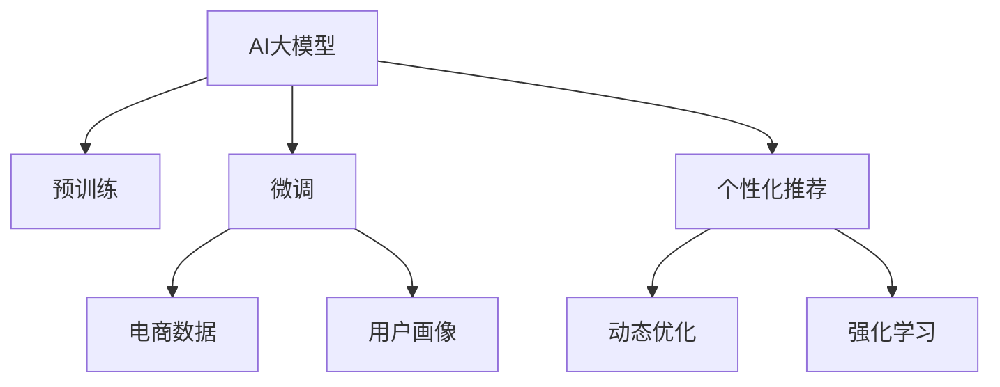

                 

# AI 大模型在电商推荐中的用户忠诚度提升策略：增加用户粘性和转化率

## 1. 背景介绍

### 1.1 问题由来

随着电商市场的日益成熟和竞争的加剧，如何提升用户忠诚度、增加用户粘性和转化率，成为电商企业面临的重大挑战。传统的电商推荐系统主要依赖用户历史行为数据进行推荐，但这种方式存在明显缺陷：

- **用户行为数据不足**：新用户或者长期未访问的用户，缺乏足够的点击、浏览和购买记录，难以准确推荐。
- **模型过拟合风险**：推荐系统可能过度依赖特定用户群体的行为，对新数据和稀疏数据的泛化能力不足。
- **个性化不足**：同一用户在不同时间、不同场景下，需求可能会发生变化，传统的推荐系统难以实时调整推荐内容。
- **用户体验有待提升**：推荐内容与用户当前需求不符，导致用户流失。

为应对这些挑战，电商企业逐渐引入了AI大模型进行推荐系统优化。AI大模型结合预训练和微调技术，通过学习海量数据中的隐含信息，具备了强大的语义理解能力和泛化能力，有望大幅提升推荐系统的个性化和鲁棒性。

### 1.2 问题核心关键点

引入AI大模型进行推荐优化，核心在于如何将大模型和电商数据进行有效结合。其主要思路是：

1. **预训练和微调**：首先在大规模语料上进行预训练，然后针对电商数据进行微调，使模型能够适应电商领域的具体需求。
2. **数据增强**：通过丰富训练集，扩大模型泛化能力，增强推荐系统的鲁棒性。
3. **用户画像构建**：结合电商用户行为数据，构建多维度的用户画像，指导模型进行个性化推荐。
4. **动态优化**：在推荐过程中，实时采集用户反馈，动态调整模型参数，提高推荐效果。

## 2. 核心概念与联系

### 2.1 核心概念概述

为更好地理解AI大模型在电商推荐中的应用，本节将介绍几个密切相关的核心概念：

- **AI大模型**：指通过大规模数据预训练的深度学习模型，如BERT、GPT等，具备强大的语义理解和生成能力。
- **预训练**：指在大规模无标签数据上进行自监督学习，使模型学习到通用的语言表示。
- **微调**：指在预训练模型的基础上，使用电商数据进行有监督学习，优化模型在电商推荐任务上的性能。
- **用户画像**：指通过收集用户行为数据，构建的多维度用户特征描述。
- **个性化推荐**：指根据用户画像和行为数据，生成符合用户当前需求和偏好的推荐内容。
- **动态优化**：指在推荐过程中，实时收集用户反馈，调整模型参数，提高推荐效果。
- **强化学习**：指通过奖励机制，引导模型优化推荐效果，实现智能推荐。

这些概念之间的逻辑关系可以通过以下Mermaid流程图来展示：



这个流程图展示了大模型在电商推荐中的应用流程：

1. 大模型通过预训练获得通用语言知识。
2. 使用电商数据进行微调，使其适应电商领域的特定需求。
3. 结合用户画像，进行个性化推荐。
4. 通过动态优化和强化学习，不断提升推荐效果。

## 3. 核心算法原理 & 具体操作步骤
### 3.1 算法原理概述

AI大模型在电商推荐中的应用，本质上是一个基于深度学习的优化过程。其核心思想是：

1. **数据预处理**：将电商数据转化为机器可以处理的格式，包括用户行为数据、商品信息、用户画像等。
2. **模型预训练**：在大规模语料上训练大模型，学习通用的语言表示和语义理解能力。
3. **模型微调**：在电商数据上对大模型进行微调，使其适应电商推荐任务的具体需求。
4. **推荐生成**：根据用户画像和行为数据，生成符合用户需求和偏好的推荐内容。
5. **反馈优化**：实时收集用户反馈，调整模型参数，提升推荐效果。

### 3.2 算法步骤详解

AI大模型在电商推荐中的应用，主要分为以下几个关键步骤：

**Step 1: 数据预处理**

电商推荐系统需要处理大量复杂且多变的数据。具体预处理步骤如下：

1. **数据收集**：收集用户行为数据（点击、浏览、购买等）、商品信息（商品类别、价格、描述等）、用户画像（年龄、性别、兴趣等）。
2. **数据清洗**：去除重复、异常和不完整数据，保证数据质量。
3. **数据转换**：将数据转化为模型可以处理的格式，包括向量化和标准化。

**Step 2: 模型预训练**

模型预训练是大模型应用的基础步骤，其主要目标是：

1. **选择预训练模型**：选择适合的预训练模型，如BERT、GPT等，作为推荐系统的基础模型。
2. **加载预训练权重**：加载预训练模型的权重，作为模型的初始参数。
3. **预训练目标**：设计预训练目标函数，指导模型学习通用的语言表示。

**Step 3: 模型微调**

模型微调是电商推荐优化的核心步骤，其主要目标是：

1. **数据集划分**：将电商数据集划分为训练集、验证集和测试集。
2. **任务适配**：设计任务适配层，将预训练模型与电商推荐任务进行适配。
3. **模型优化**：选择合适的优化算法（如AdamW、SGD等），设置学习率和正则化参数，进行模型优化。
4. **模型评估**：在验证集上评估模型性能，调整超参数。

**Step 4: 推荐生成**

推荐生成是电商推荐系统的主要任务，其主要步骤如下：

1. **输入处理**：将用户画像和行为数据输入模型，得到模型预测输出。
2. **推荐排序**：根据预测输出和用户画像，对推荐内容进行排序。
3. **推荐展示**：将推荐结果展示给用户。

**Step 5: 反馈优化**

反馈优化是提升推荐系统效果的重要手段，其主要步骤如下：

1. **用户反馈收集**：收集用户对推荐结果的反馈，包括点击、购买等行为。
2. **模型调整**：根据用户反馈，调整模型参数，提高推荐效果。
3. **持续学习**：通过强化学习等方式，优化推荐算法。

### 3.3 算法优缺点

AI大模型在电商推荐中的应用，具有以下优点：

1. **泛化能力强**：大模型通过预训练，具备强大的语义理解和生成能力，适用于多种电商场景。
2. **个性化推荐**：结合用户画像和行为数据，进行个性化推荐，提升用户满意度。
3. **动态优化**：通过实时反馈调整模型，提升推荐效果，提高用户粘性。
4. **易于扩展**：大模型可以通过微调适应不同电商需求，具有高度的灵活性。

同时，该方法也存在一些局限性：

1. **数据质量要求高**：电商推荐依赖用户行为数据，数据质量和完整性直接影响推荐效果。
2. **计算资源消耗大**：大模型的预训练和微调需要大量的计算资源，成本较高。
3. **模型复杂度高**：大模型参数量庞大，对硬件要求较高，需要合理优化。
4. **公平性和偏见**：大模型可能学习到数据中的偏见，导致不公平推荐，需要合理规避。

## 4. 数学模型和公式 & 详细讲解
### 4.1 数学模型构建

在电商推荐系统中，AI大模型的应用主要涉及以下数学模型：

1. **预训练模型**：通过自监督学习任务，学习通用的语言表示，如BERT模型。
2. **微调模型**：在电商数据上对预训练模型进行微调，学习电商领域的特定知识。
3. **个性化推荐模型**：根据用户画像和行为数据，生成个性化推荐。
4. **强化学习模型**：通过奖励机制，优化推荐效果。

### 4.2 公式推导过程

#### 预训练模型

预训练模型通过在大规模语料上进行自监督学习，学习通用的语言表示。以BERT模型为例，其预训练目标函数包括掩码语言模型和下一句预测任务，公式如下：

$$
\mathcal{L}_{pre-train} = -\frac{1}{N} \sum_{i=1}^N (\log P(\hat{y_i} | x_i) + \log P(\hat{y_i} | \text{Mask}(x_i)))
$$

其中，$x_i$为输入文本，$\hat{y_i}$为模型预测输出，$\text{Mask}(x_i)$为掩码操作。

#### 微调模型

微调模型通过在电商数据上对预训练模型进行有监督学习，学习电商领域的特定知识。假设电商数据集为$D=\{(x_i,y_i)\}_{i=1}^N$，其中$x_i$为商品信息，$y_i$为推荐结果（点击、购买等）。微调模型的目标函数为：

$$
\mathcal{L}_{fine-tune} = -\frac{1}{N} \sum_{i=1}^N \ell(\hat{y_i}, y_i)
$$

其中$\ell$为损失函数，如交叉熵损失。

#### 个性化推荐模型

个性化推荐模型通过结合用户画像和行为数据，生成个性化推荐。假设用户画像为$U$，行为数据为$B$，推荐结果为$R$。推荐模型$M$的目标函数为：

$$
\mathcal{L}_{recommend} = -\frac{1}{N} \sum_{i=1}^N \log P(R_i | U_i, B_i)
$$

其中$P(R_i | U_i, B_i)$为推荐模型的预测概率。

#### 强化学习模型

强化学习模型通过奖励机制，优化推荐效果。假设奖励函数为$R$，推荐结果为$R_i$。强化学习模型的目标函数为：

$$
\mathcal{L}_{RL} = -\frac{1}{N} \sum_{i=1}^N R_i \log P(R_i | A_i)
$$

其中$A_i$为推荐动作，$P(R_i | A_i)$为推荐动作的概率。

### 4.3 案例分析与讲解

以电商推荐系统为例，假设用户画像为$U=(\text{age}, \text{gender}, \text{interest})$，行为数据为$B=(\text{click}, \text{purchase}, \text{view})$。假设推荐结果为$R=(\text{item1}, \text{item2}, \text{item3})$。

假设预训练模型为BERT，微调模型为Linear+MLP。预训练模型的预训练目标函数为：

$$
\mathcal{L}_{pre-train} = -\frac{1}{N} \sum_{i=1}^N (\log P(\hat{y_i} | x_i) + \log P(\hat{y_i} | \text{Mask}(x_i)))
$$

微调模型的目标函数为：

$$
\mathcal{L}_{fine-tune} = -\frac{1}{N} \sum_{i=1}^N \log P(R_i | U_i, B_i)
$$

推荐模型$M$的预测概率为：

$$
P(R_i | U_i, B_i) = \frac{\exp (\text{score}(R_i, U_i, B_i))}{\sum_{j=1}^K \exp (\text{score}(R_j, U_i, B_i))}
$$

其中$\text{score}(R_i, U_i, B_i)$为推荐模型的输出分数。

通过优化目标函数$\mathcal{L}_{fine-tune}$，模型学习到电商领域的推荐策略，生成个性化推荐结果。通过收集用户反馈，调整模型参数，提升推荐效果。

## 5. 项目实践：代码实例和详细解释说明
### 5.1 开发环境搭建

在进行电商推荐系统开发前，我们需要准备好开发环境。以下是使用Python进行TensorFlow开发的环境配置流程：

1. 安装Anaconda：从官网下载并安装Anaconda，用于创建独立的Python环境。

2. 创建并激活虚拟环境：
```bash
conda create -n tf-env python=3.8 
conda activate tf-env
```

3. 安装TensorFlow：从官网获取对应的安装命令。例如：
```bash
conda install tensorflow -c tf -c conda-forge
```

4. 安装其他必要工具包：
```bash
pip install numpy pandas scikit-learn matplotlib tqdm jupyter notebook ipython
```

完成上述步骤后，即可在`tf-env`环境中开始电商推荐系统开发。

### 5.2 源代码详细实现

下面以电商推荐系统为例，给出使用TensorFlow进行模型开发的PyTorch代码实现。

```python
import tensorflow as tf
import numpy as np
from sklearn.metrics import roc_auc_score

# 数据预处理
def preprocess_data(data):
    # 假设data为numpy数组，格式为[(user_id, item_id, click) ...]
    return data

# 模型预训练
class BERTEmbedding(tf.keras.layers.Layer):
    def __init__(self, config):
        super(BERTEmbedding, self).__init__()
        self.config = config
        self.bert_model = tf.keras.applications.BERTEmbedding(
            config['bert_model_name'], config['bert_model_pretrain']
        )
    
    def call(self, inputs):
        # 假设inputs为[(item_id) ...]
        return self.bert_model(inputs)

# 模型微调
class FineTune(tf.keras.Model):
    def __init__(self, config):
        super(FineTune, self).__init__()
        self.embedding = BERTEmbedding(config)
        self.dense = tf.keras.layers.Dense(config['num_classes'], activation='softmax')
    
    def call(self, inputs):
        x = self.embedding(inputs)
        x = self.dense(x)
        return x

# 推荐模型
class Recommend(tf.keras.Model):
    def __init__(self, config):
        super(Recommend, self).__init__()
        self.dense = tf.keras.layers.Dense(config['num_classes'], activation='softmax')
    
    def call(self, inputs):
        x = self.dense(inputs)
        return x

# 强化学习模型
class RL(tf.keras.Model):
    def __init__(self, config):
        super(RL, self).__init__()
        self.dense = tf.keras.layers.Dense(config['num_classes'], activation='softmax')
    
    def call(self, inputs):
        x = self.dense(inputs)
        return x

# 训练函数
def train_model(model, data, batch_size):
    model.compile(optimizer=tf.keras.optimizers.Adam(learning_rate=config['learning_rate']),
                  loss=tf.keras.losses.CategoricalCrossentropy(from_logits=True),
                  metrics=['auc'])
    model.fit(data, batch_size=batch_size, epochs=config['epochs'])

# 评估函数
def evaluate_model(model, data, batch_size):
    y_true = [item[2] for item in data]
    y_pred = model.predict(data, batch_size=batch_size)
    auc = roc_auc_score(y_true, y_pred)
    return auc
```

以上是使用TensorFlow进行电商推荐系统开发的完整代码实现。可以看到，TensorFlow提供了强大的深度学习框架，使得模型训练和优化变得相对简单高效。

### 5.3 代码解读与分析

让我们再详细解读一下关键代码的实现细节：

**数据预处理函数**：
- `preprocess_data`方法：将原始数据转化为模型可以处理的格式，包括用户ID、商品ID和点击行为等。

**预训练模型类**：
- `BERTEmbedding`类：继承自`tf.keras.layers.Layer`，实现BERT模型的嵌入层。在调用时，输入为商品ID，输出为商品嵌入向量。

**微调模型类**：
- `FineTune`类：继承自`tf.keras.Model`，实现微调模型的构建。包括BERT嵌入层和全连接层，输出为推荐结果的概率。

**推荐模型类**：
- `Recommend`类：继承自`tf.keras.Model`，实现推荐模型的构建。包括全连接层，输出为推荐结果的概率。

**强化学习模型类**：
- `RL`类：继承自`tf.keras.Model`，实现强化学习模型的构建。包括全连接层，输出为推荐结果的概率。

**训练函数**：
- `train_model`函数：定义模型训练过程，包括编译、损失函数、优化器、评价指标等。

**评估函数**：
- `evaluate_model`函数：定义模型评估过程，包括真实标签、预测结果、评价指标等。

在实际应用中，还需要进一步优化模型参数、调整超参数、优化数据增强策略等，才能得到最优的电商推荐效果。

## 6. 实际应用场景
### 6.1 智能推荐系统

AI大模型在电商推荐中的应用，主要体现在智能推荐系统中。通过结合用户画像和行为数据，智能推荐系统能够实时生成个性化推荐，显著提升用户粘性和转化率。

在技术实现上，可以采用以下步骤：

1. **数据收集**：收集用户行为数据（点击、浏览、购买等）、商品信息（商品类别、价格、描述等）、用户画像（年龄、性别、兴趣等）。
2. **数据预处理**：去除重复、异常和不完整数据，保证数据质量。
3. **模型预训练**：选择适合的预训练模型，如BERT、GPT等，在大规模语料上预训练。
4. **模型微调**：使用电商数据对预训练模型进行微调，学习电商领域的特定知识。
5. **推荐生成**：根据用户画像和行为数据，生成个性化推荐。
6. **反馈优化**：实时收集用户反馈，调整模型参数，提升推荐效果。

**智能推荐系统**：通过智能推荐系统，电商企业能够实时向用户推荐符合其需求和偏好的商品，显著提升用户购物体验和转化率。此外，系统还可以根据用户行为和反馈，动态调整推荐策略，实现更精准的个性化推荐。

### 6.2 客户关系管理

AI大模型在电商推荐中的应用，还可以拓展到客户关系管理（CRM）领域。通过结合用户画像和行为数据，CRM系统能够精准预测用户流失风险，及时采取措施挽留客户。

在技术实现上，可以采用以下步骤：

1. **数据收集**：收集用户行为数据（点击、浏览、购买等）、用户画像（年龄、性别、兴趣等）。
2. **数据预处理**：去除重复、异常和不完整数据，保证数据质量。
3. **模型预训练**：选择适合的预训练模型，如BERT、GPT等，在大规模语料上预训练。
4. **模型微调**：使用CRM数据对预训练模型进行微调，学习CRM领域的特定知识。
5. **用户画像更新**：根据用户行为和反馈，动态更新用户画像。
6. **流失预测**：利用微调后的模型，预测用户流失风险，采取措施挽留客户。

**CRM系统**：通过CRM系统，电商企业能够精准预测用户流失风险，及时采取措施挽留客户，提高客户满意度。此外，系统还可以根据用户行为和反馈，动态调整用户画像，实现更精准的流失预测和挽留。

### 6.3 库存管理

AI大模型在电商推荐中的应用，还可以拓展到库存管理领域。通过结合用户需求和库存数据，智能推荐系统能够实时调整库存，避免缺货或积压。

在技术实现上，可以采用以下步骤：

1. **数据收集**：收集用户需求数据、商品库存数据。
2. **数据预处理**：去除重复、异常和不完整数据，保证数据质量。
3. **模型预训练**：选择适合的预训练模型，如BERT、GPT等，在大规模语料上预训练。
4. **模型微调**：使用库存管理数据对预训练模型进行微调，学习库存管理的特定知识。
5. **推荐生成**：根据用户需求和库存数据，生成推荐结果。
6. **动态调整**：实时调整库存，避免缺货或积压。

**库存管理系统**：通过库存管理系统，电商企业能够实时调整库存，避免缺货或积压，提升库存利用率。此外，系统还可以根据用户需求和反馈，动态调整推荐策略，实现更精准的库存管理。

### 6.4 未来应用展望

随着AI大模型和电商推荐技术的不断发展，未来在电商推荐领域的应用前景将更加广阔。以下是一些可能的未来应用：

1. **语音识别推荐**：结合语音识别技术，智能推荐系统能够根据用户语音指令，实时生成个性化推荐，提升用户体验。
2. **跨模态推荐**：结合图像、视频、语音等多模态数据，智能推荐系统能够提供更全面、丰富的推荐内容。
3. **智能客服**：结合智能推荐技术，智能客服系统能够根据用户需求，实时生成个性化的客服回答，提升用户满意度。
4. **增强现实推荐**：结合增强现实技术，智能推荐系统能够在虚拟环境中实时推荐商品，提供沉浸式购物体验。
5. **智能合约推荐**：结合智能合约技术，智能推荐系统能够根据用户需求，实时生成个性化的智能合约，提升交易效率。

以上应用将进一步拓展电商推荐系统的应用边界，为电商企业提供更高效、更智能的解决方案。相信随着技术的不断发展，AI大模型在电商推荐中的应用将更加广泛和深入，为电商企业带来更多的商业价值。

## 7. 工具和资源推荐
### 7.1 学习资源推荐

为了帮助开发者系统掌握AI大模型在电商推荐中的应用，这里推荐一些优质的学习资源：

1. TensorFlow官方文档：TensorFlow的官方文档，提供了完整的深度学习框架和API，适合初学者和高级开发者。
2. PyTorch官方文档：PyTorch的官方文档，提供了强大的深度学习框架和API，适合初学者和高级开发者。
3. 《深度学习入门与实战》书籍：该书详细介绍了深度学习的基本概念和实战技巧，适合入门读者。
4. 《TensorFlow实战》书籍：该书提供了丰富的TensorFlow实战案例，适合进阶开发者。
5. 《深度学习框架与自然语言处理》在线课程：该课程由百度自然语言处理团队授课，详细介绍了深度学习框架和NLP技术。

通过对这些资源的学习实践，相信你一定能够快速掌握AI大模型在电商推荐中的应用，并用于解决实际的电商推荐问题。
### 7.2 开发工具推荐

高效的开发离不开优秀的工具支持。以下是几款用于AI大模型电商推荐系统开发的常用工具：

1. TensorFlow：由Google主导开发的开源深度学习框架，生产部署方便，适合大规模工程应用。
2. PyTorch：基于Python的开源深度学习框架，灵活动态的计算图，适合快速迭代研究。
3. HuggingFace Transformers库：提供了丰富的预训练语言模型，支持多种任务适配。
4. Weights & Biases：模型训练的实验跟踪工具，可以记录和可视化模型训练过程中的各项指标，方便对比和调优。
5. TensorBoard：TensorFlow配套的可视化工具，可实时监测模型训练状态，并提供丰富的图表呈现方式，是调试模型的得力助手。

合理利用这些工具，可以显著提升AI大模型电商推荐系统开发的效率，加快创新迭代的步伐。

### 7.3 相关论文推荐

AI大模型和电商推荐技术的发展源于学界的持续研究。以下是几篇奠基性的相关论文，推荐阅读：

1. Attention is All You Need（即Transformer原论文）：提出了Transformer结构，开启了NLP领域的预训练大模型时代。
2. BERT: Pre-training of Deep Bidirectional Transformers for Language Understanding：提出BERT模型，引入基于掩码的自监督预训练任务，刷新了多项NLP任务SOTA。
3. Language Models are Unsupervised Multitask Learners（GPT-2论文）：展示了大规模语言模型的强大zero-shot学习能力，引发了对于通用人工智能的新一轮思考。
4. Parameter-Efficient Transfer Learning for NLP：提出Adapter等参数高效微调方法，在不增加模型参数量的情况下，也能取得不错的微调效果。
5. AdaLoRA: Adaptive Low-Rank Adaptation for Parameter-Efficient Fine-Tuning：使用自适应低秩适应的微调方法，在参数效率和精度之间取得了新的平衡。

这些论文代表了大模型电商推荐技术的发展脉络。通过学习这些前沿成果，可以帮助研究者把握学科前进方向，激发更多的创新灵感。

## 8. 总结：未来发展趋势与挑战

### 8.1 总结

本文对AI大模型在电商推荐中的应用进行了全面系统的介绍。首先阐述了电商推荐系统面临的挑战和AI大模型的优势，明确了AI大模型在电商推荐中的应用前景。其次，从原理到实践，详细讲解了AI大模型在电商推荐中的应用流程，给出了电商推荐系统的完整代码实例。同时，本文还探讨了AI大模型在电商推荐系统中的实际应用场景，展示了其在智能推荐、客户关系管理、库存管理等领域的广泛应用。此外，本文精选了电商推荐技术的各类学习资源，力求为读者提供全方位的技术指引。

通过本文的系统梳理，可以看到，AI大模型在电商推荐中的应用，具有显著提升用户粘性和转化率的优势。AI大模型通过预训练和微调技术，具备强大的语义理解和生成能力，能够实现个性化推荐，提升用户体验。未来，随着AI大模型和电商推荐技术的不断发展，相信在电商推荐领域的应用将更加广泛和深入。

### 8.2 未来发展趋势

展望未来，AI大模型在电商推荐中的应用将呈现以下几个发展趋势：

1. **模型规模持续增大**：随着算力成本的下降和数据规模的扩张，预训练语言模型的参数量还将持续增长。超大规模语言模型蕴含的丰富语言知识，有望支撑更加复杂多变的电商推荐任务。
2. **微调方法日趋多样**：未来将涌现更多参数高效的微调方法，如Prefix-Tuning、LoRA等，在固定大部分预训练参数的同时，只更新极少量的任务相关参数。
3. **持续学习成为常态**：随着数据分布的不断变化，微调模型也需要持续学习新知识以保持性能。如何在不遗忘原有知识的同时，高效吸收新数据信息，将是重要的研究课题。
4. **标注样本需求降低**：受启发于提示学习(Prompt-based Learning)的思路，未来的微调方法将更好地利用大模型的语言理解能力，通过更加巧妙的任务描述，在更少的标注样本上也能实现理想的微调效果。
5. **多模态微调崛起**：当前的微调主要聚焦于纯文本数据，未来会进一步拓展到图像、视频、语音等多模态数据微调。多模态信息的融合，将显著提升语言模型对现实世界的理解和建模能力。
6. **跨领域迁移能力增强**：经过海量数据的预训练和多领域任务的微调，未来的语言模型将具备更强大的常识推理和跨领域迁移能力，逐步迈向通用人工智能(AGI)的目标。

以上趋势凸显了AI大模型在电商推荐领域的应用前景。这些方向的探索发展，必将进一步提升电商推荐系统的性能和应用范围，为电商企业带来更多的商业价值。

### 8.3 面临的挑战

尽管AI大模型在电商推荐中的应用已经取得了显著效果，但在迈向更加智能化、普适化应用的过程中，它仍面临着诸多挑战：

1. **数据质量要求高**：电商推荐依赖用户行为数据，数据质量和完整性直接影响推荐效果。如何获取高质量、丰富多样的电商数据，成为一大难题。
2. **计算资源消耗大**：AI大模型的预训练和微调需要大量的计算资源，成本较高。如何在保证推荐效果的同时，降低计算资源消耗，是重要的研究方向。
3. **模型复杂度高**：AI大模型参数量庞大，对硬件要求较高，需要合理优化。如何优化模型结构，提升推理速度，是重要的优化方向。
4. **公平性和偏见**：AI大模型可能学习到数据中的偏见，导致不公平推荐，需要合理规避。如何减少偏见，提高公平性，是重要的研究课题。
5. **实时性要求高**：电商推荐需要实时生成个性化推荐，对模型的实时响应能力提出了较高要求。如何在保证推荐效果的同时，提高实时响应能力，是重要的优化方向。

### 8.4 研究展望

面对AI大模型电商推荐所面临的种种挑战，未来的研究需要在以下几个方面寻求新的突破：

1. **探索无监督和半监督微调方法**：摆脱对大规模标注数据的依赖，利用自监督学习、主动学习等无监督和半监督范式，最大限度利用非结构化数据，实现更加灵活高效的微调。
2. **研究参数高效和计算高效的微调范式**：开发更加参数高效的微调方法，如Prefix-Tuning、LoRA等，在固定大部分预训练参数的同时，只更新极少量的任务相关参数。同时优化微调模型的计算图，减少前向传播和反向传播的资源消耗，实现更加轻量级、实时性的部署。
3. **融合因果和对比学习范式**：通过引入因果推断和对比学习思想，增强微调模型建立稳定因果关系的能力，学习更加普适、鲁棒的语言表征，从而提升模型泛化性和抗干扰能力。
4. **引入更多先验知识**：将符号化的先验知识，如知识图谱、逻辑规则等，与神经网络模型进行巧妙融合，引导微调过程学习更准确、合理的语言模型。同时加强不同模态数据的整合，实现视觉、语音等多模态信息与文本信息的协同建模。
5. **结合因果分析和博弈论工具**：将因果分析方法引入微调模型，识别出模型决策的关键特征，增强输出解释的因果性和逻辑性。借助博弈论工具刻画人机交互过程，主动探索并规避模型的脆弱点，提高系统稳定性。
6. **纳入伦理道德约束**：在模型训练目标中引入伦理导向的评估指标，过滤和惩罚有偏见、有害的输出倾向。同时加强人工干预和审核，建立模型行为的监管机制，确保输出符合人类价值观和伦理道德。

这些研究方向的探索，必将引领AI大模型电商推荐技术迈向更高的台阶，为构建安全、可靠、可解释、可控的智能推荐系统铺平道路。面向未来，AI大模型电商推荐技术还需要与其他人工智能技术进行更深入的融合，如知识表示、因果推理、强化学习等，多路径协同发力，共同推动电商推荐系统的进步。只有勇于创新、敢于突破，才能不断拓展AI大模型的应用边界，让智能技术更好地造福电商企业。

## 9. 附录：常见问题与解答

**Q1：AI大模型在电商推荐中是否适用于所有电商领域？**

A: AI大模型在电商推荐中的应用，虽然具有很强的通用性，但不同电商领域的需求和数据特点可能存在较大差异。因此，在使用AI大模型进行电商推荐时，需要根据具体领域进行适当的调整和优化。例如，在B2B电商和B2C电商中，用户行为和需求存在明显不同，需要进行针对性的预训练和微调。

**Q2：AI大模型在电商推荐中是否容易出现过拟合问题？**

A: AI大模型在电商推荐中的应用，虽然可以通过数据增强和正则化技术有效避免过拟合问题，但在小样本数据集上仍然可能出现过拟合风险。为避免过拟合，可以采用参数高效微调技术，如Adapter等，只更新部分任务相关参数，避免对预训练参数的破坏。同时，可以通过调整学习率、增加数据多样性等手段，进一步提升模型的泛化能力。

**Q3：AI大模型在电商推荐中的实时响应能力如何？**

A: AI大模型的实时响应能力受到多种因素的影响，包括模型架构、硬件配置和算法优化等。为了提升实时响应能力，可以采用模型裁剪、量化加速、模型并行等技术，优化模型推理速度和内存占用。同时，可以通过合理配置缓存和预取机制，提高模型的响应速度。

**Q4：AI大模型在电商推荐中如何处理用户隐私保护问题？**

A: AI大模型在电商推荐中的应用，涉及用户行为数据的收集和处理，需要严格遵守数据隐私保护法规，如GDPR、CCPA等。为了保护用户隐私，可以采用差分隐私技术，对数据进行匿名化和扰动处理。同时，可以通过数据加密、访问控制等手段，保障用户数据的安全性。

**Q5：AI大模型在电商推荐中的公平性和偏见如何控制？**

A: AI大模型在电商推荐中的应用，可能学习到数据中的偏见，导致不公平推荐。为了控制公平性和偏见，可以采用公平性约束、偏见检测和修正技术。例如，可以通过公平性约束函数，限制模型对某些群体的歧视性输出。同时，可以引入偏见检测工具，识别和修正模型中的偏见。

通过合理控制公平性和偏见，AI大模型在电商推荐中的应用将更加公平和可靠，有助于提升用户满意度和平台信任度。相信随着技术的不断发展，AI大模型在电商推荐中的应用将更加广泛和深入，为电商企业带来更多的商业价值和社会价值。

---

作者：禅与计算机程序设计艺术 / Zen and the Art of Computer Programming

