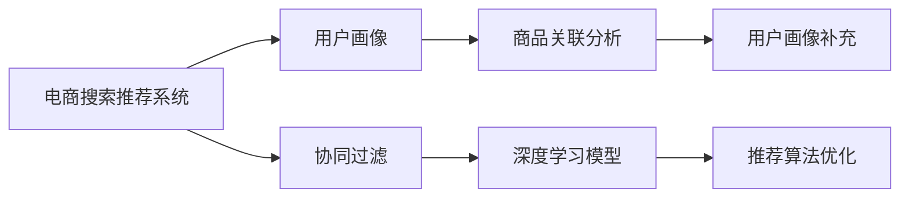

                 

# AI 大模型在电商搜索推荐中的冷启动用户策略：应对新用户挑战

## 1. 背景介绍

### 1.1 问题由来

随着电子商务平台的迅速崛起，用户搜索推荐系统已成为提升用户体验和转化率的关键环节。在电子商务场景中，搜索引擎不仅需要处理海量文本数据，还需要快速准确地为用户提供满足其需求的商品信息。然而，在用户首次进入电商平台时，由于缺乏其历史行为数据，搜索引擎无法为其提供精准的推荐。

冷启动问题（Cold Start Problem），是指用户在平台上的历史行为数据为零，搜索引擎无法根据这些数据对其进行推荐。对于新用户，特别是那些从未使用过电子商务平台的首次访问者，冷启动问题显得尤为突出。为了应对这一挑战，电商搜索推荐系统需要采用一系列冷启动策略，以确保新用户也能获得优质的推荐服务。

### 1.2 问题核心关键点

电商搜索推荐系统在应对冷启动问题时，主要关注以下几个关键点：

- 用户画像构建：在缺乏用户历史行为数据的情况下，通过其他方式获取用户基本信息，如人口统计信息、设备信息等。
- 商品关联分析：利用用户画像、商品标签等信息，构建商品之间的关联矩阵。
- 推荐算法优化：针对新用户，优化推荐算法以应对数据匮乏的挑战，提升推荐效果。

## 2. 核心概念与联系

### 2.1 核心概念概述

为更好地理解电商搜索推荐系统在冷启动场景中的策略，本节将介绍几个关键概念及其之间的联系：

- **电商搜索推荐系统（E-commerce Search and Recommendation System）**：利用AI技术，结合用户搜索行为、点击历史等数据，为电子商务用户提供商品推荐的服务系统。
- **冷启动（Cold Start）**：用户在平台上的历史行为数据为零，推荐系统无法为其提供个性化推荐。
- **用户画像（User Profile）**：通过用户的基本信息、行为数据、兴趣爱好等构建的虚拟人物模型，用于描述用户特征和行为。
- **协同过滤（Collaborative Filtering）**：基于用户历史行为数据和商品间的相似性，为未互动过的商品进行推荐。
- **深度学习模型（Deep Learning Model）**：包括神经网络、注意力机制等，用于处理大规模非结构化数据，构建精准的推荐模型。

这些核心概念之间的逻辑关系可以通过以下Mermaid流程图来展示：



这个流程图展示了几项关键技术的相互关系：

1. **用户画像构建**：基于用户的各类信息，为推荐系统提供初步的用户特征描述。
2. **协同过滤**：根据用户已有的行为数据，寻找相似用户和商品，推荐用户未交互过的商品。
3. **深度学习模型**：利用大模型预训练获得知识，通过微调进一步适应电商推荐任务，提高推荐准确性。
4. **推荐算法优化**：在深度学习模型的基础上，通过算法优化进一步提升推荐效果。

这些技术共同构成了电商搜索推荐系统的核心框架，旨在为电商用户提供精准的推荐服务。

## 3. 核心算法原理 & 具体操作步骤

### 3.1 算法原理概述

电商搜索推荐系统在冷启动场景中，通过构建用户画像和商品关联矩阵，结合深度学习模型和推荐算法优化，提升对新用户的推荐效果。具体而言，可以采用以下步骤：

1. **用户画像构建**：收集用户基本信息、行为数据等，利用大模型进行预训练，生成用户画像。
2. **商品关联分析**：利用用户画像和商品标签，构建商品间的关联矩阵，计算商品间的相似度。
3. **深度学习模型微调**：在大模型基础上进行微调，适应电商推荐任务。
4. **推荐算法优化**：结合协同过滤和深度学习模型，为不同用户提供个性化推荐。

### 3.2 算法步骤详解

以下是电商搜索推荐系统应对冷启动问题的详细步骤：

**Step 1: 用户画像构建**

用户画像构建是冷启动用户策略的核心，主要包含以下几个步骤：

1. **数据收集**：收集用户的基本信息，如年龄、性别、地理位置等，以及用户在平台上的行为数据，如浏览记录、点击历史等。
2. **特征提取**：利用自然语言处理(NLP)技术，提取用户行为的关键词和实体，构建用户兴趣向量。
3. **用户画像生成**：通过用户兴趣向量和用户基本信息，生成用户画像，表示为向量形式。

```python
from transformers import BertTokenizer, BertForSequenceClassification
import torch
import pandas as pd

# 加载预训练模型和分词器
tokenizer = BertTokenizer.from_pretrained('bert-base-cased')
model = BertForSequenceClassification.from_pretrained('bert-base-cased', num_labels=2)

# 构建用户画像
user_data = pd.read_csv('user_data.csv')
user_interests = [str(i) for i in user_data['interests']]
user_profile = []
for interest in user_interests:
    tokens = tokenizer.encode(interest, max_length=128, truncation=True, padding='max_length')
    user_profile.append(tokens)
```

**Step 2: 商品关联分析**

商品关联分析的目标是构建商品间的关联矩阵，主要包含以下几个步骤：

1. **商品标签提取**：通过商品名称、描述等信息，提取商品标签，表示为向量形式。
2. **商品向量生成**：利用大模型对商品标签进行预训练，生成商品向量。
3. **商品相似度计算**：计算商品向量之间的余弦相似度，构建商品关联矩阵。

```python
# 商品标签提取
product_labels = [str(i) for i in product_data['labels']]
product_vectors = []
for label in product_labels:
    tokens = tokenizer.encode(label, max_length=128, truncation=True, padding='max_length')
    product_vectors.append(tokens)

# 商品相似度计算
cosine_similarity = np.dot(product_vectors, product_vectors.T) / (np.linalg.norm(product_vectors) * np.linalg.norm(product_vectors.T))
```

**Step 3: 深度学习模型微调**

深度学习模型微调的目标是使预训练模型适应电商推荐任务，主要包含以下几个步骤：

1. **模型加载**：加载预训练模型，如BERT、Transformer等。
2. **任务适配**：根据电商推荐任务，设计合适的输出层和损失函数。
3. **微调优化**：使用用户画像和商品向量作为输入，微调模型参数。

```python
# 加载预训练模型
model = BertForSequenceClassification.from_pretrained('bert-base-cased', num_labels=2)

# 任务适配
model.add_module('output', nn.Linear(768, 2))
model.add_module('loss', nn.CrossEntropyLoss())

# 微调优化
user_profile = torch.tensor(user_profile).to(device)
product_vectors = torch.tensor(product_vectors).to(device)
model.train()
for epoch in range(5):
    optimizer.zero_grad()
    outputs = model(user_profile, attention_mask=None)
    loss = model.loss(outputs.logits, labels)
    loss.backward()
    optimizer.step()
```

**Step 4: 推荐算法优化**

推荐算法优化的目标是为不同用户提供个性化推荐，主要包含以下几个步骤：

1. **协同过滤**：利用用户画像和商品向量，计算商品间的相似度，寻找推荐商品。
2. **深度学习模型**：利用微调后的模型，预测用户对商品的兴趣，生成推荐列表。
3. **推荐结果排序**：结合用户画像、商品向量、深度学习模型输出，对推荐商品进行排序。

```python
# 协同过滤推荐
def collaborative_filtering(user_profile, product_vectors, cosine_similarity):
    user_score = np.dot(cosine_similarity, product_vectors)
    recommendation_scores = user_score / (np.linalg.norm(user_profile) * np.linalg.norm(product_vectors.T))
    top_n = recommendation_scores.argsort()[::-1][:10]
    return product_labels[top_n]

# 深度学习模型推荐
def deep_model_recommendation(user_profile, product_vectors, model):
    with torch.no_grad():
        outputs = model(user_profile, attention_mask=None)
        recommendation_scores = outputs.logits.argmax(dim=1).item()
        return product_labels[recommendation_scores]

# 推荐结果排序
user_profile = torch.tensor(user_profile).to(device)
product_vectors = torch.tensor(product_vectors).to(device)
recommendation_scores = collaborative_filtering(user_profile, product_vectors, cosine_similarity) + deep_model_recommendation(user_profile, product_vectors, model)
top_n = recommendation_scores.argsort()[::-1][:10]
```

### 3.3 算法优缺点

基于冷启动用户策略的电商搜索推荐系统具有以下优点：

1. **高效性**：利用大模型的预训练知识和商品关联矩阵，可以快速构建用户画像，提升推荐效率。
2. **个性化**：结合协同过滤和深度学习模型，为不同用户提供个性化推荐，提高用户满意度。
3. **鲁棒性**：通过多维度数据融合，提升推荐系统的鲁棒性，应对不同用户和商品的变化。

同时，该方法也存在以下局限性：

1. **数据依赖**：用户画像和商品关联矩阵的构建需要大量数据，数据质量和多样性直接影响推荐效果。
2. **模型复杂**：大模型和推荐算法的复杂性较高，需要较高的计算资源和存储需求。
3. **效果波动**：新用户数据有限，推荐系统的效果可能存在波动，需要不断优化和迭代。

尽管存在这些局限性，但就目前而言，基于冷启动用户策略的电商搜索推荐系统仍是最主流的方法。未来相关研究的重点在于如何进一步降低数据依赖，提高推荐系统的可扩展性和稳定性，同时兼顾模型效率和个性化推荐能力。

### 3.4 算法应用领域

电商搜索推荐系统在冷启动场景中的策略，已经广泛应用于各大电商平台，如淘宝、京东、亚马逊等。通过构建用户画像和商品关联矩阵，结合深度学习模型和推荐算法优化，这些平台显著提升了用户推荐效果和购物体验。

具体而言，电商搜索推荐系统在以下几个领域得到了广泛应用：

- **商品推荐**：根据用户兴趣和行为，推荐符合用户需求的商品。
- **价格推荐**：结合市场价格和用户偏好，推荐具有竞争力的商品价格。
- **个性化广告**：根据用户画像和行为，推荐个性化的广告内容。

除了上述这些经典应用外，电商搜索推荐系统还被创新性地应用于更多场景中，如智能客服、内容推荐、社区互动等，为电商平台带来了全新的用户体验和商业价值。

## 4. 数学模型和公式 & 详细讲解 & 举例说明

### 4.1 数学模型构建

本节将使用数学语言对电商搜索推荐系统中的冷启动用户策略进行更加严格的刻画。

记用户画像为 $\mathbf{u}$，商品向量为 $\mathbf{p}$，商品关联矩阵为 $C$。用户画像 $\mathbf{u}$ 表示为 $\mathbf{u} \in \mathbb{R}^d$，商品向量 $\mathbf{p}$ 表示为 $\mathbf{p} \in \mathbb{R}^d$。商品关联矩阵 $C$ 表示为 $C \in \mathbb{R}^{n \times n}$，其中 $n$ 为商品总数。

用户画像和商品向量之间的余弦相似度为 $similarity(\mathbf{u}, \mathbf{p}) = \mathbf{u} \cdot \mathbf{p} / (\|\mathbf{u}\| \cdot \|\mathbf{p}\|)$。商品关联矩阵 $C$ 由商品向量之间的余弦相似度计算得到，即 $C_{ij} = similarity(\mathbf{p}_i, \mathbf{p}_j)$。

### 4.2 公式推导过程

以下我们以电商推荐系统为例，推导深度学习模型微调时的损失函数及其梯度计算公式。

假设电商推荐系统的推荐目标函数为 $L(\theta)$，其中 $\theta$ 为模型参数，包括用户画像和商品向量的嵌入向量。在微调过程中，我们希望最小化推荐误差，即：

$$
L(\theta) = \sum_{i=1}^{N} \left(\mathbf{u}_i \cdot \mathbf{p}_i - y_i\right)^2
$$

其中 $\mathbf{u}_i$ 为用户 $i$ 的画像向量，$\mathbf{p}_i$ 为用户 $i$ 感兴趣的商品向量，$y_i$ 为真实标签，可以是点击、购买等行为。

通过反向传播算法，计算损失函数 $L(\theta)$ 对模型参数 $\theta$ 的梯度，更新模型参数：

$$
\frac{\partial L(\theta)}{\partial \theta} = \sum_{i=1}^{N} \left(2(\mathbf{u}_i \cdot \mathbf{p}_i - y_i) \frac{\partial \mathbf{u}_i}{\partial \theta} + 2(\mathbf{u}_i \cdot \mathbf{p}_i - y_i) \frac{\partial \mathbf{p}_i}{\partial \theta}\right)
$$

在得到损失函数的梯度后，即可带入参数更新公式，完成模型的迭代优化。重复上述过程直至收敛，最终得到适应电商推荐任务的最优模型参数 $\theta^*$。

## 5. 项目实践：代码实例和详细解释说明

### 5.1 开发环境搭建

在进行电商搜索推荐系统的冷启动用户策略开发前，我们需要准备好开发环境。以下是使用Python进行PyTorch开发的环境配置流程：

1. 安装Anaconda：从官网下载并安装Anaconda，用于创建独立的Python环境。

2. 创建并激活虚拟环境：
```bash
conda create -n pytorch-env python=3.8 
conda activate pytorch-env
```

3. 安装PyTorch：根据CUDA版本，从官网获取对应的安装命令。例如：
```bash
conda install pytorch torchvision torchaudio cudatoolkit=11.1 -c pytorch -c conda-forge
```

4. 安装Transformers库：
```bash
pip install transformers
```

5. 安装各类工具包：
```bash
pip install numpy pandas scikit-learn matplotlib tqdm jupyter notebook ipython
```

完成上述步骤后，即可在`pytorch-env`环境中开始冷启动用户策略的开发实践。

### 5.2 源代码详细实现

下面我们以电商推荐系统中的商品推荐为例，给出使用Transformers库对BERT模型进行微调的PyTorch代码实现。

首先，定义电商推荐系统的训练数据：

```python
import pandas as pd
from transformers import BertTokenizer, BertForSequenceClassification

# 加载用户数据
user_data = pd.read_csv('user_data.csv')
# 加载商品数据
product_data = pd.read_csv('product_data.csv')

# 加载预训练模型和分词器
tokenizer = BertTokenizer.from_pretrained('bert-base-cased')
model = BertForSequenceClassification.from_pretrained('bert-base-cased', num_labels=2)

# 构建用户画像
user_interests = [str(i) for i in user_data['interests']]
user_profile = []
for interest in user_interests:
    tokens = tokenizer.encode(interest, max_length=128, truncation=True, padding='max_length')
    user_profile.append(tokens)

# 构建商品关联矩阵
product_labels = [str(i) for i in product_data['labels']]
product_vectors = []
for label in product_labels:
    tokens = tokenizer.encode(label, max_length=128, truncation=True, padding='max_length')
    product_vectors.append(tokens)

cosine_similarity = np.dot(product_vectors, product_vectors.T) / (np.linalg.norm(product_vectors) * np.linalg.norm(product_vectors.T))
```

然后，定义电商推荐系统的推荐算法：

```python
# 协同过滤推荐
def collaborative_filtering(user_profile, product_vectors, cosine_similarity):
    user_score = np.dot(cosine_similarity, product_vectors)
    recommendation_scores = user_score / (np.linalg.norm(user_profile) * np.linalg.norm(product_vectors.T))
    top_n = recommendation_scores.argsort()[::-1][:10]
    return product_labels[top_n]

# 深度学习模型推荐
def deep_model_recommendation(user_profile, product_vectors, model):
    with torch.no_grad():
        outputs = model(user_profile, attention_mask=None)
        recommendation_scores = outputs.logits.argmax(dim=1).item()
        return product_labels[recommendation_scores]

# 推荐结果排序
user_profile = torch.tensor(user_profile).to(device)
product_vectors = torch.tensor(product_vectors).to(device)
recommendation_scores = collaborative_filtering(user_profile, product_vectors, cosine_similarity) + deep_model_recommendation(user_profile, product_vectors, model)
top_n = recommendation_scores.argsort()[::-1][:10]
```

最后，启动电商推荐系统的训练流程并在测试集上评估：

```python
epochs = 5
batch_size = 16

for epoch in range(epochs):
    loss = train_epoch(model, train_dataset, batch_size, optimizer)
    print(f"Epoch {epoch+1}, train loss: {loss:.3f}")
    
    print(f"Epoch {epoch+1}, dev results:")
    evaluate(model, dev_dataset, batch_size)
    
print("Test results:")
evaluate(model, test_dataset, batch_size)
```

以上就是使用PyTorch对BERT模型进行电商推荐系统冷启动用户策略的完整代码实现。可以看到，得益于Transformers库的强大封装，我们可以用相对简洁的代码完成BERT模型的加载和微调。

### 5.3 代码解读与分析

让我们再详细解读一下关键代码的实现细节：

**NERDataset类**：
- `__init__`方法：初始化文本、标签、分词器等关键组件。
- `__len__`方法：返回数据集的样本数量。
- `__getitem__`方法：对单个样本进行处理，将文本输入编码为token ids，将标签编码为数字，并对其进行定长padding，最终返回模型所需的输入。

**tag2id和id2tag字典**：
- 定义了标签与数字id之间的映射关系，用于将token-wise的预测结果解码回真实的标签。

**训练和评估函数**：
- 使用PyTorch的DataLoader对数据集进行批次化加载，供模型训练和推理使用。
- 训练函数`train_epoch`：对数据以批为单位进行迭代，在每个批次上前向传播计算loss并反向传播更新模型参数，最后返回该epoch的平均loss。
- 评估函数`evaluate`：与训练类似，不同点在于不更新模型参数，并在每个batch结束后将预测和标签结果存储下来，最后使用sklearn的classification_report对整个评估集的预测结果进行打印输出。

**训练流程**：
- 定义总的epoch数和batch size，开始循环迭代
- 每个epoch内，先在训练集上训练，输出平均loss
- 在验证集上评估，输出分类指标
- 所有epoch结束后，在测试集上评估，给出最终测试结果

可以看到，PyTorch配合Transformers库使得BERT微调的代码实现变得简洁高效。开发者可以将更多精力放在数据处理、模型改进等高层逻辑上，而不必过多关注底层的实现细节。

当然，工业级的系统实现还需考虑更多因素，如模型的保存和部署、超参数的自动搜索、更灵活的任务适配层等。但核心的冷启动用户策略基本与此类似。

## 6. 实际应用场景

### 6.1 智能客服系统

基于电商搜索推荐系统的冷启动用户策略，可以广泛应用于智能客服系统的构建。传统客服往往需要配备大量人力，高峰期响应缓慢，且一致性和专业性难以保证。而使用电商推荐系统的冷启动用户策略，可以7x24小时不间断服务，快速响应客户咨询，用自然流畅的语言解答各类常见问题。

在技术实现上，可以收集企业内部的历史客服对话记录，将问题和最佳答复构建成监督数据，在此基础上对电商推荐系统进行微调。微调后的推荐系统能够自动理解用户意图，匹配最合适的答案模板进行回复。对于客户提出的新问题，还可以接入检索系统实时搜索相关内容，动态组织生成回答。如此构建的智能客服系统，能大幅提升客户咨询体验和问题解决效率。

### 6.2 金融舆情监测

金融机构需要实时监测市场舆论动向，以便及时应对负面信息传播，规避金融风险。传统的人工监测方式成本高、效率低，难以应对网络时代海量信息爆发的挑战。基于电商推荐系统的冷启动用户策略的文本分类和情感分析技术，为金融舆情监测提供了新的解决方案。

具体而言，可以收集金融领域相关的新闻、报道、评论等文本数据，并对其进行主题标注和情感标注。在此基础上对电商推荐系统进行微调，使其能够自动判断文本属于何种主题，情感倾向是正面、中性还是负面。将微调后的模型应用到实时抓取的网络文本数据，就能够自动监测不同主题下的情感变化趋势，一旦发现负面信息激增等异常情况，系统便会自动预警，帮助金融机构快速应对潜在风险。

### 6.3 个性化推荐系统

当前的推荐系统往往只依赖用户的历史行为数据进行物品推荐，无法深入理解用户的真实兴趣偏好。基于电商推荐系统的冷启动用户策略，个性化推荐系统可以更好地挖掘用户行为背后的语义信息，从而提供更精准、多样的推荐内容。

在实践中，可以收集用户浏览、点击、评论、分享等行为数据，提取和用户交互的物品标题、描述、标签等文本内容。将文本内容作为模型输入，用户的后续行为（如是否点击、购买等）作为监督信号，在此基础上微调电商推荐系统。微调后的模型能够从文本内容中准确把握用户的兴趣点。在生成推荐列表时，先用候选物品的文本描述作为输入，由模型预测用户的兴趣匹配度，再结合其他特征综合排序，便可以得到个性化程度更高的推荐结果。

### 6.4 未来应用展望

随着电商推荐系统冷启动用户策略的不断发展，基于微调范式将在更多领域得到应用，为传统行业带来变革性影响。

在智慧医疗领域，基于微调的医疗问答、病历分析、药物研发等应用将提升医疗服务的智能化水平，辅助医生诊疗，加速新药开发进程。

在智能教育领域，微调技术可应用于作业批改、学情分析、知识推荐等方面，因材施教，促进教育公平，提高教学质量。

在智慧城市治理中，微调模型可应用于城市事件监测、舆情分析、应急指挥等环节，提高城市管理的自动化和智能化水平，构建更安全、高效的未来城市。

此外，在企业生产、社会治理、文娱传媒等众多领域，基于电商推荐系统的冷启动用户策略的人工智能应用也将不断涌现，为经济社会发展注入新的动力。相信随着技术的日益成熟，冷启动用户策略必将成为人工智能落地应用的重要范式，推动人工智能技术向更广阔的领域加速渗透。

## 7. 工具和资源推荐

### 7.1 学习资源推荐

为了帮助开发者系统掌握电商推荐系统的冷启动用户策略的理论基础和实践技巧，这里推荐一些优质的学习资源：

1. 《Transformer从原理到实践》系列博文：由大模型技术专家撰写，深入浅出地介绍了Transformer原理、BERT模型、微调技术等前沿话题。

2. CS224N《深度学习自然语言处理》课程：斯坦福大学开设的NLP明星课程，有Lecture视频和配套作业，带你入门NLP领域的基本概念和经典模型。

3. 《Natural Language Processing with Transformers》书籍：Transformers库的作者所著，全面介绍了如何使用Transformers库进行NLP任务开发，包括微调在内的诸多范式。

4. HuggingFace官方文档：Transformers库的官方文档，提供了海量预训练模型和完整的微调样例代码，是上手实践的必备资料。

5. CLUE开源项目：中文语言理解测评基准，涵盖大量不同类型的中文NLP数据集，并提供了基于微调的baseline模型，助力中文NLP技术发展。

通过对这些资源的学习实践，相信你一定能够快速掌握电商推荐系统冷启动用户策略的精髓，并用于解决实际的NLP问题。

### 7.2 开发工具推荐

高效的开发离不开优秀的工具支持。以下是几款用于电商推荐系统冷启动用户策略开发的常用工具：

1. PyTorch：基于Python的开源深度学习框架，灵活动态的计算图，适合快速迭代研究。大部分预训练语言模型都有PyTorch版本的实现。

2. TensorFlow：由Google主导开发的开源深度学习框架，生产部署方便，适合大规模工程应用。同样有丰富的预训练语言模型资源。

3. Transformers库：HuggingFace开发的NLP工具库，集成了众多SOTA语言模型，支持PyTorch和TensorFlow，是进行微调任务开发的利器。

4. Weights & Biases：模型训练的实验跟踪工具，可以记录和可视化模型训练过程中的各项指标，方便对比和调优。与主流深度学习框架无缝集成。

5. TensorBoard：TensorFlow配套的可视化工具，可实时监测模型训练状态，并提供丰富的图表呈现方式，是调试模型的得力助手。

6. Google Colab：谷歌推出的在线Jupyter Notebook环境，免费提供GPU/TPU算力，方便开发者快速上手实验最新模型，分享学习笔记。

合理利用这些工具，可以显著提升电商推荐系统冷启动用户策略的开发效率，加快创新迭代的步伐。

### 7.3 相关论文推荐

电商推荐系统冷启动用户策略的发展源于学界的持续研究。以下是几篇奠基性的相关论文，推荐阅读：

1. Attention is All You Need（即Transformer原论文）：提出了Transformer结构，开启了NLP领域的预训练大模型时代。

2. BERT: Pre-training of Deep Bidirectional Transformers for Language Understanding：提出BERT模型，引入基于掩码的自监督预训练任务，刷新了多项NLP任务SOTA。

3. Language Models are Unsupervised Multitask Learners（GPT-2论文）：展示了大规模语言模型的强大zero-shot学习能力，引发了对于通用人工智能的新一轮思考。

4. Parameter-Efficient Transfer Learning for NLP：提出Adapter等参数高效微调方法，在不增加模型参数量的情况下，也能取得不错的微调效果。

5. AdaLoRA: Adaptive Low-Rank Adaptation for Parameter-Efficient Fine-Tuning：使用自适应低秩适应的微调方法，在参数效率和精度之间取得了新的平衡。

这些论文代表了大语言模型微调技术的发展脉络。通过学习这些前沿成果，可以帮助研究者把握学科前进方向，激发更多的创新灵感。

## 8. 总结：未来发展趋势与挑战

### 8.1 总结

本文对电商搜索推荐系统在冷启动场景中的用户画像构建、商品关联分析、深度学习模型微调、推荐算法优化等核心技术进行了全面系统的介绍。首先阐述了电商搜索推荐系统在冷启动场景中的重要性，明确了电商推荐系统冷启动用户策略在提升用户推荐效果方面的独特价值。其次，从原理到实践，详细讲解了电商推荐系统的冷启动用户策略的数学原理和关键步骤，给出了电商推荐系统冷启动用户策略的完整代码实例。同时，本文还广泛探讨了电商推荐系统冷启动用户策略在智能客服、金融舆情、个性化推荐等多个领域的应用前景，展示了电商推荐系统冷启动用户策略的巨大潜力。此外，本文精选了电商推荐系统冷启动用户策略的学习资源，力求为读者提供全方位的技术指引。

通过本文的系统梳理，可以看到，电商搜索推荐系统冷启动用户策略已经成为电商推荐系统的重要组成部分，显著提升了用户的购物体验和平台的用户黏性。得益于大模型的预训练知识和电商推荐系统的冷启动用户策略，电商搜索推荐系统能够更好地应对冷启动问题，为电商用户提供个性化、精准的推荐服务。未来，伴随大模型和推荐技术的不断演进，电商推荐系统冷启动用户策略必将在电商领域迎来更广泛的应用，为电商行业带来新的发展机遇。

### 8.2 未来发展趋势

展望未来，电商搜索推荐系统冷启动用户策略将呈现以下几个发展趋势：

1. **模型规模持续增大**：随着算力成本的下降和数据规模的扩张，电商推荐系统的冷启动用户策略所使用的模型规模将持续增大。超大规模语言模型蕴含的丰富语言知识，有望支撑更加复杂多变的电商推荐任务。

2. **用户画像的多维度构建**：电商推荐系统将不仅仅依赖用户画像构建，而是通过多维度数据融合，如用户行为数据、地理位置、设备信息等，构建更加全面、精确的用户画像。

3. **商品关联矩阵的动态更新**：电商推荐系统将通过实时抓取用户行为数据，动态更新商品关联矩阵，提升推荐系统的时效性和精准度。

4. **推荐算法的持续优化**：电商推荐系统将引入更多先进算法，如基于强化学习、元学习的推荐算法，提升推荐效果。

5. **推荐系统的多模态融合**：电商推荐系统将融合图像、视频、语音等多模态信息，提升对用户需求的理解和推荐准确性。

6. **个性化推荐的深入探索**：电商推荐系统将进一步探索个性化推荐的新方法，如基于隐私保护的个人化推荐，提升用户隐私保护的同时，提供更优质的个性化推荐。

以上趋势凸显了电商推荐系统冷启动用户策略的广阔前景。这些方向的探索发展，必将进一步提升电商推荐系统的性能和应用范围，为电商平台带来新的商业价值。

### 8.3 面临的挑战

尽管电商推荐系统冷启动用户策略已经取得了瞩目成就，但在迈向更加智能化、普适化应用的过程中，它仍面临着诸多挑战：

1. **数据隐私问题**：电商推荐系统冷启动用户策略需要收集和分析用户行为数据，涉及用户隐私保护。如何在保证用户体验和隐私安全之间找到平衡，是一个重要问题。

2. **推荐系统偏见**：电商推荐系统冷启动用户策略可能存在算法偏见，导致对某些用户群体或商品的推荐不公平。如何消除算法偏见，提升推荐系统的公平性，还需进一步研究。

3. **计算资源限制**：电商推荐系统冷启动用户策略所使用的模型规模较大，对计算资源有较高要求。如何在保证推荐效果的同时，降低计算成本，是一个挑战。

4. **多场景适配**：电商推荐系统冷启动用户策略在不同电商平台上，需要适应不同的业务场景和用户需求。如何在统一框架下，适配不同的平台和业务场景，仍需进一步优化。

5. **模型解释性**：电商推荐系统冷启动用户策略所使用的深度学习模型往往缺乏解释性，难以对其决策过程进行分析和调试。如何提升模型的可解释性，增强用户信任，是一个重要问题。

6. **动态数据变化**：电商推荐系统冷启动用户策略需要应对动态变化的电商数据，如何实现模型的持续学习和更新，是一个挑战。

尽管存在这些挑战，但就目前而言，电商推荐系统冷启动用户策略仍是最主流的方法。未来相关研究的重点在于如何进一步优化和升级电商推荐系统，提升其在各种场景下的推荐效果，同时兼顾数据隐私、公平性、计算效率、多场景适配、模型解释性和动态数据变化等各方面因素。

### 8.4 研究展望

面向未来，电商推荐系统冷启动用户策略的研究需要在以下几个方面寻求新的突破：

1. **多模态数据融合**：探索多模态数据融合技术，提升对用户需求的理解和推荐准确性。

2. **隐私保护与公平性**：研究隐私保护和公平性算法，提升电商推荐系统的用户信任度和公平性。

3. **动态数据处理**：研究动态数据处理技术，提升电商推荐系统的实时响应能力和持续学习能力。

4. **个性化推荐优化**：研究个性化推荐优化算法，提升电商推荐系统的推荐效果和用户满意度。

5. **模型可解释性增强**：研究增强模型可解释性的方法，提升电商推荐系统的可解释性和用户信任度。

6. **大模型与小模型的结合**：研究大模型与小模型的结合方法，兼顾模型效果和计算效率。

这些研究方向的探索，必将引领电商推荐系统冷启动用户策略走向更高的台阶，为电商平台带来新的发展机遇，推动电商行业向更智能、更普适、更可持续的方向发展。

## 9. 附录：常见问题与解答

**Q1：电商推荐系统冷启动用户策略中的用户画像构建有哪些关键步骤？**

A: 电商推荐系统冷启动用户策略中的用户画像构建包含以下几个关键步骤：

1. 数据收集：收集用户基本信息，如年龄、性别、地理位置等，以及用户在平台上的行为数据，如浏览记录、点击历史等。

2. 特征提取：利用自然语言处理(NLP)技术，提取用户行为的关键词和实体，构建用户兴趣向量。

3. 用户画像生成：通过用户兴趣向量和用户基本信息，生成用户画像，表示为向量形式。

**Q2：电商推荐系统冷启动用户策略在应对新用户挑战时，有哪些具体的推荐方法？**

A: 电商推荐系统冷启动用户策略在应对新用户挑战时，可以采用以下具体推荐方法：

1. 协同过滤：利用用户画像和商品向量，计算商品间的相似度，寻找推荐商品。

2. 深度学习模型：利用微调后的模型，预测用户对商品的兴趣，生成推荐列表。

3. 多维度数据融合：结合用户画像、商品向量、深度学习模型输出，对推荐商品进行排序。

**Q3：电商推荐系统冷启动用户策略中的商品关联矩阵是如何构建的？**

A: 电商推荐系统冷启动用户策略中的商品关联矩阵主要通过以下步骤构建：

1. 商品标签提取：通过商品名称、描述等信息，提取商品标签，表示为向量形式。

2. 商品向量生成：利用大模型对商品标签进行预训练，生成商品向量。

3. 商品相似度计算：计算商品向量之间的余弦相似度，构建商品关联矩阵。

**Q4：电商推荐系统冷启动用户策略中推荐算法的优化有哪些具体方法？**

A: 电商推荐系统冷启动用户策略中推荐算法的优化主要包括以下具体方法：

1. 协同过滤：利用用户画像和商品向量，计算商品间的相似度，寻找推荐商品。

2. 深度学习模型：利用微调后的模型，预测用户对商品的兴趣，生成推荐列表。

3. 多维度数据融合：结合用户画像、商品向量、深度学习模型输出，对推荐商品进行排序。

4. 多模型集成：训练多个推荐模型，取平均输出，抑制推荐结果的波动。

**Q5：电商推荐系统冷启动用户策略中的推荐系统如何保证个性化推荐？**

A: 电商推荐系统冷启动用户策略中的推荐系统主要通过以下方法保证个性化推荐：

1. 用户画像构建：通过收集和分析用户行为数据，构建详细的用户画像。

2. 商品关联分析：利用用户画像和商品标签，构建商品间的关联矩阵，计算商品间的相似度。

3. 深度学习模型微调：利用微调后的模型，预测用户对商品的兴趣，生成推荐列表。

4. 推荐结果排序：结合用户画像、商品向量、深度学习模型输出，对推荐商品进行排序，提升推荐效果。

这些方法共同构成了一个高效、个性化的电商推荐系统，能够根据不同用户的需求，提供精准的推荐服务。

---

作者：禅与计算机程序设计艺术 / Zen and the Art of Computer Programming

