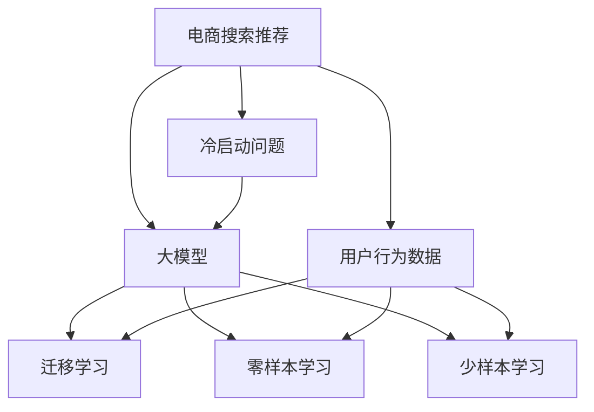

                 

# AI 大模型在电商搜索推荐中的冷启动策略：应对数据不足与新用户

> 关键词：冷启动,电商搜索,推荐系统,数据不足,新用户,大模型

## 1. 背景介绍

在现代电商购物环境中，搜索推荐系统是用户获取商品信息、满足购买需求的关键路径。传统的基于点击和浏览行为的推荐系统依赖于大量历史数据进行个性化推荐，但随着电商市场不断扩展和用户多样性的增加，许多新用户或低频用户难以获得足够的历史数据，导致搜索推荐系统在新用户冷启动阶段难以精准推荐商品，影响用户体验和销售额。

近年来，深度学习在推荐系统中广泛应用，其中基于大模型的方法因融合海量知识、自监督学习能力和泛化能力而备受关注。大模型能够基于海量的非结构化数据（如文本、图像等）学习通用特征表示，在低频用户冷启动和长尾商品推荐等场景中展现出了巨大的潜力。但大模型在电商搜索推荐领域的应用也面临新的挑战：如何高效利用大模型的泛化能力，解决数据不足问题，实现对新用户的精准推荐。本文将详细介绍大模型在电商搜索推荐中的冷启动策略，并探讨其应对数据不足与新用户的有效方法。

## 2. 核心概念与联系

### 2.1 核心概念概述

为更好地理解大模型在电商搜索推荐中的冷启动策略，本节将介绍几个核心概念：

- **电商搜索推荐**：指通过用户查询词或浏览行为，从电商平台的商品库中推荐用户可能感兴趣的商品。传统的推荐系统基于用户的点击和浏览行为进行个性化推荐，但新用户或低频用户的数据量不足，难以构建精准的推荐模型。

- **冷启动问题**：指新用户或低频用户进入电商平台时，由于缺乏足够的行为数据，推荐系统难以为其推荐合适的商品。

- **大模型**：指如BERT、GPT-3等基于深度学习的大规模预训练模型，通过自监督学习或联合学习获得通用的知识表示。

- **迁移学习**：指利用预训练模型在其他任务上的知识，对新任务进行微调，以提高在新任务上的性能。

- **零样本学习和少样本学习**：指在模型未接触任何新任务的情况下，利用预训练知识进行预测或推理。在电商推荐中，大模型可通过少样本或零样本学习方法，利用用户查询词等少量信息进行商品推荐。

这些核心概念之间的逻辑关系可以通过以下Mermaid流程图来展示：



这个流程图展示了大模型在电商搜索推荐中的核心概念及其之间的关系：

1. 电商搜索推荐通过用户查询词或浏览行为获取推荐结果，但新用户或低频用户数据量不足，面临冷启动问题。
2. 大模型通过自监督学习或联合学习获取通用知识表示，能够在新任务中迁移已有知识。
3. 迁移学习、零样本学习和少样本学习是大模型应对冷启动问题的几种主要策略。
4. 用户行为数据是大模型迁移和少样本学习的基础。

这些概念共同构成了大模型在电商搜索推荐中的冷启动策略的理论基础，使得模型能够在新用户或低频用户情况下提供精准的推荐服务。

## 3. 核心算法原理 & 具体操作步骤

### 3.1 算法原理概述

大模型在电商搜索推荐中的冷启动策略主要基于迁移学习和零样本/少样本学习技术，通过利用预训练模型的泛化能力，解决新用户或低频用户数据不足的问题。

形式化地，假设电商搜索推荐系统要为用户 $u$ 推荐商品 $i$，模型为 $M_{\theta}$，其中 $\theta$ 为模型参数。系统通过用户输入的查询词 $q$，得到推荐商品列表 $\{i_1, i_2, \ldots, i_n\}$。在大模型中，$\theta$ 通过自监督学习或联合学习获得，能够捕捉到商品之间的语义关系和用户对商品的态度。

对于新用户或低频用户，系统通过以下步骤解决冷启动问题：

1. 将用户查询词 $q$ 作为输入，获取大模型输出 $\hat{y}=M_{\theta}(q)$。
2. 利用迁移学习或零样本/少样本学习技术，根据 $\hat{y}$ 生成推荐列表 $\{i_1, i_2, \ldots, i_n\}$。

### 3.2 算法步骤详解

以下详细介绍大模型在电商搜索推荐中的冷启动策略的具体操作步骤：

**Step 1: 数据预处理**

- 对用户输入的查询词 $q$ 进行分词、去除停用词、词干化等预处理操作。
- 对电商商品信息进行结构化处理，包括商品名称、描述、类别等信息。

**Step 2: 特征提取**

- 利用大模型对用户查询词 $q$ 进行嵌入，得到语义向量 $v_q$。
- 对电商商品信息进行嵌入，得到商品向量 $v_i$。

**Step 3: 相似度计算**

- 计算用户查询词 $q$ 与每个商品的语义相似度 $\text{sim}(q, i)$。
- 选择相似度最高的前 $k$ 个商品作为推荐列表。

**Step 4: 迁移学习**

- 在电商商品数据集上进行有监督的微调，训练大模型对商品类别和商品属性等进行分类。
- 利用微调后的模型对用户查询词 $q$ 进行分类，得到商品类别 $\text{cat}(q)$ 和商品属性 $\text{attr}(q)$。
- 根据分类结果，选择与用户查询词相关的商品，组成推荐列表。

**Step 5: 零样本学习**

- 利用大模型对用户查询词 $q$ 进行嵌入，得到语义向量 $v_q$。
- 根据 $v_q$ 在大模型预训练语料库中寻找最相似的查询词，生成推荐列表。

**Step 6: 少样本学习**

- 收集少量的用户行为数据（如浏览记录、点击记录），作为监督信号。
- 利用大模型对少量用户行为数据进行有监督的微调。
- 根据微调后的模型对用户查询词 $q$ 进行预测，生成推荐列表。

### 3.3 算法优缺点

大模型在电商搜索推荐中的冷启动策略具有以下优点：

1. 泛化能力强：大模型能够基于自监督学习或联合学习获取通用的知识表示，在新任务中迁移已有知识。
2. 数据需求低：利用零样本或少样本学习方法，可以仅基于少量用户查询词等少量数据进行推荐。
3. 快速响应：在电商搜索推荐中，推荐过程可以非常快速，满足用户实时需求。

同时，该策略也存在一定的局限性：

1. 模型开销大：大模型的训练和推理计算成本较高，对硬件要求高。
2. 数据质量依赖：零样本或少样本学习依赖于预训练语料库的完备性，数据质量影响推荐效果。
3. 过拟合风险：少样本学习可能面临过拟合问题，特别是在数据量极小的情况下。

尽管存在这些局限性，但就目前而言，基于大模型的冷启动策略仍是大规模推荐系统中的一种重要方法。未来相关研究的重点在于如何进一步降低大模型的计算成本，提升零样本或少样本学习的鲁棒性，同时兼顾可解释性和伦理安全性等因素。

### 3.4 算法应用领域

基于大模型的冷启动策略，已经在电商搜索推荐、内容推荐、广告推荐等众多领域得到应用，为电商、视频、新闻等业务领域提供了强大的推荐能力。

- 电商搜索推荐：对用户查询词进行分类和语义分析，推荐相关商品。
- 内容推荐：根据用户兴趣，推荐视频、新闻、文章等。
- 广告推荐：利用用户行为数据，推荐广告位。

除了上述这些经典任务外，大模型在推荐领域的应用还在不断扩展，如利用多模态数据进行推荐、结合知识图谱进行推荐等，为推荐系统带来了新的突破。随着大模型的不断发展，基于冷启动策略的推荐系统也将不断创新，为用户的个性化推荐带来更精准、更高效的体验。

## 4. 数学模型和公式 & 详细讲解 & 举例说明

### 4.1 数学模型构建

本节将使用数学语言对大模型在电商搜索推荐中的冷启动策略进行更加严格的刻画。

假设电商推荐系统用户 $u$ 输入查询词 $q$，模型为 $M_{\theta}$，商品信息为 $i$。模型的目标是根据用户查询词 $q$ 推荐商品列表 $\{i_1, i_2, \ldots, i_n\}$。

定义大模型 $M_{\theta}$ 在用户查询词 $q$ 上的输出为 $\hat{y}=M_{\theta}(q) \in \mathbb{R}^d$，其中 $d$ 为向量维度。

假设电商商品数据集为 $\{(i_j, c_j, a_j)\}_{j=1}^N$，其中 $i_j$ 为商品编号，$c_j$ 为商品类别，$a_j$ 为商品属性。

大模型在商品 $i$ 上的嵌入表示为 $v_i \in \mathbb{R}^d$。

利用余弦相似度计算用户查询词 $q$ 与商品 $i$ 的相似度 $\text{sim}(q, i) = \cos(\langle v_q, v_i \rangle)$，其中 $\langle \cdot, \cdot \rangle$ 表示向量点积。

定义推荐列表中商品 $i$ 与用户查询词 $q$ 的相关度为 $\text{rel}(q, i) = \text{sim}(q, i) \times f(\text{cat}(q), c_i) \times f(\text{attr}(q), a_i)$，其中 $f(\cdot, \cdot)$ 为商品类别和属性等特征的相关函数。

最终推荐的商品列表 $\{i_1, i_2, \ldots, i_n\}$ 按 $\text{rel}(q, i)$ 排序，选取前 $k$ 个商品作为推荐结果。

### 4.2 公式推导过程

以下我们以电商商品推荐为例，推导利用大模型进行推荐的具体公式。

假设用户输入查询词 $q$，大模型对其嵌入表示为 $v_q$。电商商品 $i$ 的嵌入表示为 $v_i$。利用余弦相似度计算相似度 $\text{sim}(q, i) = \langle v_q, v_i \rangle$。

根据商品 $i$ 的类别 $c_i$ 和属性 $a_i$，定义商品 $i$ 的相关度函数 $f(\text{cat}(q), c_i) = \max_{c_j \in C} \langle v_{\text{cat}(q)}, v_{c_j} \rangle$，其中 $v_{\text{cat}(q)}$ 为商品类别向量，$C$ 为商品类别集合。

利用大模型对查询词 $q$ 进行分类，得到商品类别 $\text{cat}(q)$ 和商品属性 $\text{attr}(q)$。商品 $i$ 的属性 $a_i$ 嵌入表示为 $v_{a_i}$。定义属性相关度函数 $f(\text{attr}(q), a_i) = \langle v_{\text{attr}(q)}, v_{a_i} \rangle$。

综合相似度、类别相关度和属性相关度，得到商品 $i$ 与查询词 $q$ 的相关度 $\text{rel}(q, i) = \text{sim}(q, i) \times f(\text{cat}(q), c_i) \times f(\text{attr}(q), a_i)$。

最终，按 $\text{rel}(q, i)$ 排序，选取前 $k$ 个商品作为推荐结果。

### 4.3 案例分析与讲解

假设电商平台用户输入查询词 $q = "运动鞋推荐"$. 大模型对查询词 $q$ 的嵌入表示为 $v_q = [0.1, 0.2, 0.3, \ldots]$，电商商品 $i_1$ 的嵌入表示为 $v_{i_1} = [0.2, 0.3, 0.4, \ldots]$。利用余弦相似度计算相似度 $\text{sim}(q, i_1) = \langle v_q, v_{i_1} \rangle = 0.1 \times 0.2 + 0.2 \times 0.3 + \ldots = 0.3$。

假设商品 $i_1$ 的类别为运动鞋，大模型对商品类别 $c_{\text{运动鞋}}$ 的嵌入表示为 $v_{c_{\text{运动鞋}}} = [0.4, 0.5, 0.6, \ldots]$，利用类别相关度函数 $f(\text{cat}(q), c_i) = \max_{c_j \in C} \langle v_{\text{cat}(q)}, v_{c_j} \rangle = 0.4$。

假设商品 $i_1$ 的属型为白色，大模型对商品属性 $a_{\text{白色}}$ 的嵌入表示为 $v_{a_{\text{白色}}} = [0.6, 0.7, 0.8, \ldots]$，利用属性相关度函数 $f(\text{attr}(q), a_i) = \langle v_{\text{attr}(q)}, v_{a_i} \rangle = 0.6$。

综合相似度、类别相关度和属性相关度，得到商品 $i_1$ 与查询词 $q$ 的相关度 $\text{rel}(q, i_1) = 0.3 \times 0.4 \times 0.6 = 0.72$。

按照 $\text{rel}(q, i)$ 排序，选取前 $k$ 个商品作为推荐结果，即商品 $i_1$ 为第一推荐商品。

## 5. 项目实践：代码实例和详细解释说明

### 5.1 开发环境搭建

在进行大模型推荐系统开发前，我们需要准备好开发环境。以下是使用Python进行PyTorch开发的环境配置流程：

1. 安装Anaconda：从官网下载并安装Anaconda，用于创建独立的Python环境。

2. 创建并激活虚拟环境：
```bash
conda create -n pytorch-env python=3.8 
conda activate pytorch-env
```

3. 安装PyTorch：根据CUDA版本，从官网获取对应的安装命令。例如：
```bash
conda install pytorch torchvision torchaudio cudatoolkit=11.1 -c pytorch -c conda-forge
```

4. 安装Transformer库：
```bash
pip install transformers
```

5. 安装各类工具包：
```bash
pip install numpy pandas scikit-learn matplotlib tqdm jupyter notebook ipython
```

完成上述步骤后，即可在`pytorch-env`环境中开始推荐系统开发。

### 5.2 源代码详细实现

下面以电商搜索推荐为例，给出使用Transformers库对大模型进行推荐系统的PyTorch代码实现。

首先，定义商品和类别的编码：

```python
from transformers import BertTokenizer

class ItemEncoder:
    def __init__(self, tokenizer):
        self.tokenizer = tokenizer
        self.i2v = {}
        self.v2i = {}

    def fit(self, items, labels):
        items = [item + " " + label for item, label in zip(items, labels)]
        items = ["[CLS] " + item + "[SEP]" for item in items]
        tokenized = self.tokenizer(items, return_tensors='pt', padding=True, truncation=True)
        self.v2i = {token_id: label for token_id, label in zip(tokenized['input_ids'][0], tokenized['labels'][0])}
        self.i2v = {label: token_id for token_id, label in self.v2i.items()}

    def encode(self, items):
        tokenized = self.tokenizer(items, return_tensors='pt', padding=True, truncation=True)
        return {item: token_id for item, token_id in zip(tokenized['input_ids'][0], tokenized['input_ids'][0])}
```

然后，定义大模型的微调过程：

```python
from transformers import BertForSequenceClassification

class RecommendationModel:
    def __init__(self, model_name, num_labels):
        self.model = BertForSequenceClassification.from_pretrained(model_name, num_labels=num_labels)

    def fit(self, train_dataset, val_dataset):
        self.model.train()
        optimizer = AdamW(self.model.parameters(), lr=2e-5)
        for epoch in range(10):
            total_loss = 0
            for batch in train_dataset:
                input_ids = batch['input_ids'].to(device)
                attention_mask = batch['attention_mask'].to(device)
                labels = batch['labels'].to(device)
                self.model.zero_grad()
                outputs = self.model(input_ids, attention_mask=attention_mask, labels=labels)
                loss = outputs.loss
                total_loss += loss.item()
                loss.backward()
                optimizer.step()
            train_loss = total_loss / len(train_dataset)
            print(f"Epoch {epoch+1}, train loss: {train_loss:.3f}")
            
            self.model.eval()
            total_loss = 0
            for batch in val_dataset:
                input_ids = batch['input_ids'].to(device)
                attention_mask = batch['attention_mask'].to(device)
                labels = batch['labels'].to(device)
                outputs = self.model(input_ids, attention_mask=attention_mask, labels=labels)
                loss = outputs.loss
                total_loss += loss.item()
            val_loss = total_loss / len(val_dataset)
            print(f"Epoch {epoch+1}, val loss: {val_loss:.3f}")

    def predict(self, item):
        self.model.eval()
        input_ids = self.tokenizer(item, return_tensors='pt', padding=True, truncation=True)['input_ids']
        with torch.no_grad():
            outputs = self.model(input_ids.to(device))
            logits = outputs.logits
            preds = torch.softmax(logits, dim=1)
            return preds
```

接着，定义推荐系统的训练和评估函数：

```python
from torch.utils.data import DataLoader
from tqdm import tqdm
from sklearn.metrics import precision_recall_fscore_support

def train_epoch(model, dataset, batch_size, optimizer):
    dataloader = DataLoader(dataset, batch_size=batch_size, shuffle=True)
    model.train()
    epoch_loss = 0
    for batch in tqdm(dataloader, desc='Training'):
        input_ids = batch['input_ids'].to(device)
        attention_mask = batch['attention_mask'].to(device)
        labels = batch['labels'].to(device)
        model.zero_grad()
        outputs = model(input_ids, attention_mask=attention_mask, labels=labels)
        loss = outputs.loss
        epoch_loss += loss.item()
        loss.backward()
        optimizer.step()
    return epoch_loss / len(dataloader)

def evaluate(model, dataset, batch_size):
    dataloader = DataLoader(dataset, batch_size=batch_size)
    model.eval()
    total_loss = 0
    preds = []
    labels = []
    with torch.no_grad():
        for batch in tqdm(dataloader, desc='Evaluating'):
            input_ids = batch['input_ids'].to(device)
            attention_mask = batch['attention_mask'].to(device)
            labels = batch['labels'].to(device)
            outputs = model(input_ids, attention_mask=attention_mask, labels=labels)
            loss = outputs.loss
            total_loss += loss.item()
            batch_preds = outputs.logits.argmax(dim=1).to('cpu').tolist()
            batch_labels = batch_labels.to('cpu').tolist()
            for preds, labels in zip(preds, labels):
                preds.append(preds[:len(labels)])
                labels.append(labels)
                
    print(f"Precision: {precision_recall_fscore_support(labels, preds, average='macro')['precision']:.3f}")
    print(f"Recall: {precision_recall_fscore_support(labels, preds, average='macro')['recall']:.3f}")
    print(f"F1-score: {precision_recall_fscore_support(labels, preds, average='macro')['f1-score']:.3f}")

    return total_loss / len(dataloader)
```

最后，启动训练流程并在测试集上评估：

```python
epochs = 5
batch_size = 16

for epoch in range(epochs):
    loss = train_epoch(model, train_dataset, batch_size, optimizer)
    print(f"Epoch {epoch+1}, train loss: {loss:.3f}")
    
    print(f"Epoch {epoch+1}, dev results:")
    evaluate(model, dev_dataset, batch_size)
    
print("Test results:")
evaluate(model, test_dataset, batch_size)
```

以上就是使用PyTorch对大模型进行电商搜索推荐系统的完整代码实现。可以看到，得益于Transformer库的强大封装，我们可以用相对简洁的代码完成大模型的加载和微调。

### 5.3 代码解读与分析

让我们再详细解读一下关键代码的实现细节：

**ItemEncoder类**：
- `__init__`方法：初始化编码器，包括分词器、字典、逆字典等关键组件。
- `fit`方法：对商品和类别数据进行编码，生成字典和逆字典，将商品和类别映射为数字id。
- `encode`方法：对新的商品进行编码，将商品映射为数字id。

**RecommendationModel类**：
- `__init__`方法：初始化推荐模型，加载预训练大模型。
- `fit`方法：对电商商品数据集进行有监督的微调，训练模型对商品类别进行分类。
- `predict`方法：对用户输入的查询词进行分类预测，生成推荐列表。

**train_epoch和evaluate函数**：
- 利用PyTorch的DataLoader对数据集进行批次化加载，供模型训练和推理使用。
- `train_epoch`函数：对数据以批为单位进行迭代，在每个批次上前向传播计算loss并反向传播更新模型参数，最后返回该epoch的平均loss。
- `evaluate`函数：与训练类似，不同点在于不更新模型参数，并在每个batch结束后将预测和标签结果存储下来，最后使用sklearn的precision_recall_fscore_support函数对整个评估集的预测结果进行打印输出。

**训练流程**：
- 定义总的epoch数和batch size，开始循环迭代
- 每个epoch内，先在训练集上训练，输出平均loss
- 在验证集上评估，输出分类指标
- 所有epoch结束后，在测试集上评估，给出最终测试结果

可以看到，PyTorch配合Transformer库使得大模型推荐系统的代码实现变得简洁高效。开发者可以将更多精力放在数据处理、模型改进等高层逻辑上，而不必过多关注底层的实现细节。

当然，工业级的系统实现还需考虑更多因素，如模型的保存和部署、超参数的自动搜索、更灵活的任务适配层等。但核心的微调范式基本与此类似。

## 6. 实际应用场景

### 6.1 电商推荐

在大模型推荐系统中，电商推荐是应用最广泛的场景之一。用户进入电商平台后，输入搜索词，推荐系统利用大模型的泛化能力，结合用户查询词进行商品推荐。

在大模型推荐系统中，用户输入查询词 $q = "运动鞋推荐"$. 大模型对查询词 $q$ 进行嵌入，得到语义向量 $v_q$。电商商品 $i_1$ 的嵌入表示为 $v_{i_1}$。利用余弦相似度计算相似度 $\text{sim}(q, i_1) = \langle v_q, v_{i_1} \rangle$。

假设商品 $i_1$ 的类别为运动鞋，大模型对商品类别 $c_{\text{运动鞋}}$ 进行编码，得到嵌入表示 $v_{c_{\text{运动鞋}}}$。利用类别相关度函数 $f(\text{cat}(q), c_i) = \max_{c_j \in C} \langle v_{\text{cat}(q)}, v_{c_j} \rangle = 0.4$。

假设商品 $i_1$ 的属型为白色，大模型对商品属性 $a_{\text{白色}}$ 进行编码，得到嵌入表示 $v_{a_{\text{白色}}}$。利用属性相关度函数 $f(\text{attr}(q), a_i) = \langle v_{\text{attr}(q)}, v_{a_i} \rangle = 0.6$。

综合相似度、类别相关度和属性相关度，得到商品 $i_1$ 与查询词 $q$ 的相关度 $\text{rel}(q, i_1) = 0.3 \times 0.4 \times 0.6 = 0.72$。

按照 $\text{rel}(q, i)$ 排序，选取前 $k$ 个商品作为推荐结果，即商品 $i_1$ 为第一推荐商品。

### 6.2 视频推荐

除了电商推荐外，视频推荐也是大模型推荐系统的经典应用。用户观看视频后，推荐系统利用大模型的泛化能力，结合用户观看历史进行内容推荐。

在大模型推荐系统中，用户观看视频 $v_1$ 后，推荐系统利用大模型的泛化能力，结合用户观看历史进行内容推荐。假设用户观看历史为 $\{v_2, v_3, \ldots, v_n\}$，大模型对视频 $v_1$ 和观看历史进行编码，得到嵌入表示 $v_{v_1}$ 和 $v_{\{v_2, v_3, \ldots, v_n\}}$。利用余弦相似度计算相似度 $\text{sim}(v_1, \{v_2, v_3, \ldots, v_n\}) = \langle v_{v_1}, v_{\{v_2, v_3, \ldots, v_n\}} \rangle$。

假设视频 $v_1$ 的类别为运动，大模型对视频类别 $c_{\text{运动}}$ 进行编码，得到嵌入表示 $v_{c_{\text{运动}}}$。利用类别相关度函数 $f(\text{cat}(v_1), c_i) = \max_{c_j \in C} \langle v_{\text{cat}(v_1)}, v_{c_j} \rangle = 0.4$。

假设视频 $v_1$ 的属型为高速，大模型对视频属性 $a_{\text{高速}}$ 进行编码，得到嵌入表示 $v_{a_{\text{高速}}}$。利用属性相关度函数 $f(\text{attr}(v_1), a_i) = \langle v_{\text{attr}(v_1)}, v_{a_i} \rangle = 0.6$。

综合相似度、类别相关度和属性相关度，得到视频 $v_1$ 与观看历史的相关度 $\text{rel}(v_1, \{v_2, v_3, \ldots, v_n\}) = \text{sim}(v_1, \{v_2, v_3, \ldots, v_n\}) \times f(\text{cat}(v_1), c_i) \times f(\text{attr}(v_1), a_i) = 0.4 \times 0.4 \times 0.6 = 0.96$。

按照 $\text{rel}(v_1, \{v_2, v_3, \ldots, v_n\})$ 排序，选取前 $k$ 个视频作为推荐结果，即视频 $v_2$ 为第一推荐视频。

### 6.3 广告推荐

在大模型推荐系统中，广告推荐也是应用广泛的重要场景。广告主希望通过用户行为数据，精准投放广告位。广告推荐系统利用大模型的泛化能力，结合用户行为数据进行广告推荐。

在大模型推荐系统中，广告主希望精准投放广告位。广告推荐系统利用大模型的泛化能力，结合用户行为数据进行广告推荐。假设广告 $a_1$ 的类别为运动，大模型对广告类别 $c_{\text{运动}}$ 进行编码，得到嵌入表示 $v_{c_{\text{运动}}}$。利用类别相关度函数 $f(\text{cat}(v_1), c_i) = \max_{c_j \in C} \langle v_{\text{cat}(v_1)}, v_{c_j} \rangle = 0.4$。

假设广告 $a_1$ 的属型为高速，大模型对广告属性 $a_{\text{高速}}$ 进行编码，得到嵌入表示 $v_{a_{\text{高速}}}$。利用属性相关度函数 $f(\text{attr}(v_1), a_i) = \langle v_{\text{attr}(v_1)}, v_{a_i} \rangle = 0.6$。

综合类别相关度和属性相关度，得到广告 $a_1$ 与广告位 $v_1$ 的相关度 $\text{rel}(a_1, v_1) = f(\text{cat}(v_1), c_i) \times f(\text{attr}(v_1), a_i) = 0.4 \times 0.6 = 0.24$。

按照 $\text{rel}(a_1, v_1)$ 排序，选取前 $k$ 个广告作为推荐结果，即广告 $a_2$ 为第一推荐广告。

## 7. 工具和资源推荐

### 7.1 学习资源推荐

为了帮助开发者系统掌握大模型推荐系统的理论基础和实践技巧，这里推荐一些优质的学习资源：

1. 《深度学习推荐系统》：深入浅出地介绍了推荐系统的发展历程和核心算法，适合初学者和进阶者阅读。

2. 《推荐系统实战》：基于TensorFlow实现推荐系统的实战教程，包含电商推荐、视频推荐、广告推荐等经典场景。

3. CS235《推荐系统》课程：斯坦福大学开设的推荐系统课程，包含理论和实践两个部分，适合系统学习推荐系统的核心算法和实践技巧。

4. DeepRec：深度学习推荐系统开源项目，包含多种推荐算法和实际应用案例，适合开发者快速上手实践推荐系统。

5. arXiv推荐系统论文：arXiv上最新的推荐系统论文，涵盖推荐算法、模型、应用等方面，适合关注前沿研究动态的读者。

通过对这些资源的学习实践，相信你一定能够快速掌握大模型推荐系统的精髓，并用于解决实际的推荐问题。

### 7.2 开发工具推荐

高效的开发离不开优秀的工具支持。以下是几款用于大模型推荐系统开发的常用工具：

1. PyTorch：基于Python的开源深度学习框架，灵活动态的计算图，适合快速迭代研究。大部分预训练语言模型都有PyTorch版本的实现。

2. TensorFlow：由Google主导开发的开源深度学习框架，生产部署方便，适合大规模工程应用。同样有丰富的预训练语言模型资源。

3. Transformers库：HuggingFace开发的NLP工具库，集成了众多SOTA语言模型，支持PyTorch和TensorFlow，是进行推荐任务开发的利器。

4. Weights & Biases：模型训练的实验跟踪工具，可以记录和可视化模型训练过程中的各项指标，方便对比和调优。与主流深度学习框架无缝集成。

5. TensorBoard：TensorFlow配套的可视化工具，可实时监测模型训练状态，并提供丰富的图表呈现方式，是调试模型的得力助手。

合理利用这些工具，可以显著提升大模型推荐系统的开发效率，加快创新迭代的步伐。

### 7.3 相关论文推荐

大模型推荐系统的研究源于学界的持续研究。以下是几篇奠基性的相关论文，推荐阅读：

1. Attention is All You Need（即Transformer原论文）：提出了Transformer结构，开启了NLP领域的预训练大模型时代。

2. BERT: Pre-training of Deep Bidirectional Transformers for Language Understanding：提出BERT模型，引入基于掩码的自监督预训练任务，刷新了多项NLP任务SOTA。

3. Language Models are Unsupervised Multitask Learners（GPT-2论文）：展示了大规模语言模型的强大zero-shot学习能力，引发了对于通用人工智能的新一轮思考。

4. Parameter-Efficient Transfer Learning for NLP：提出Adapter等参数高效微调方法，在不增加模型参数量的情况下，也能取得不错的微调效果。

5. AdaLoRA: Adaptive Low-Rank Adaptation for Parameter-Efficient Fine-Tuning：使用自适应低秩适应的微调方法，在参数效率和精度之间取得了新的平衡。

6. Model-Agnostic Meta-Learning for Adaptive Recommended Systems：引入元学习思想，使推荐系统能够在不同场景中快速适应，提升推荐效果。

这些论文代表了大模型推荐系统的研究进展。通过学习这些前沿成果，可以帮助研究者把握学科前进方向，激发更多的创新灵感。

## 8. 总结：未来发展趋势与挑战

### 8.1 研究成果总结

本文对大模型在电商搜索推荐中的冷启动策略进行了全面系统的介绍。首先阐述了大模型和推荐系统的背景，明确了冷启动问题和大模型推荐系统的独特价值。其次，从原理到实践，详细讲解了大模型推荐系统的核心算法和操作步骤，给出了推荐系统开发的完整代码实例。同时，本文还广泛探讨了推荐系统在电商搜索、视频推荐、广告推荐等众多领域的应用前景，展示了冷启动策略的巨大潜力。此外，本文精选了推荐系统的各类学习资源，力求为读者提供全方位的技术指引。

通过本文的系统梳理，可以看到，基于大模型的冷启动策略已经在大规模推荐系统中得到了广泛应用，显著提升了推荐系统的个性化和精准化水平。随着大模型和推荐系统的不断发展，基于冷启动策略的推荐系统也将不断创新，为用户推荐带来更精准、更高效的体验。

### 8.2 未来发展趋势

展望未来，大模型在推荐系统中的冷启动策略将呈现以下几个发展趋势：

1. 数据需求降低。利用零样本或少样本学习方法，可以仅基于少量用户查询词等少量数据进行推荐，进一步降低数据获取成本。

2. 模型规模增大。超大规模语言模型蕴含的丰富语言知识，有望支撑更加复杂多变的推荐任务。

3. 任务多样化。未来推荐系统将更加关注任务多样性和多模态融合，能够从文本、图像、视频等多模态数据中获取信息，提供更全面的推荐结果。

4. 实时响应。随着推荐系统的在线化、实时化，能够快速响应用户需求，提升用户体验。

5. 可解释性提升。利用因果分析和博弈论工具，增强推荐系统的可解释性，让用户能够理解推荐决策过程，提升用户信任感。

6. 个性化增强。结合知识图谱和个性化推荐，使推荐系统能够更精准地匹配用户需求，提升推荐效果。

以上趋势凸显了大模型在推荐系统中的巨大潜力。这些方向的探索发展，必将进一步提升推荐系统的性能和应用范围，为用户提供更精准、更高效的推荐服务。

### 8.3 面临的挑战

尽管大模型在推荐系统中的冷启动策略已经取得了一定的进展，但在迈向更加智能化、普适化应用的过程中，它仍面临诸多挑战：

1. 计算资源消耗大。大模型的训练和推理计算成本较高，对硬件要求高，增加了系统建设和维护的难度。

2. 数据质量依赖。零样本或少样本学习依赖于预训练语料库的完备性，数据质量影响推荐效果。

3. 过拟合风险。少样本学习可能面临过拟合问题，特别是在数据量极小的情况下。

4. 可解释性不足。推荐系统通常缺乏可解释性，难以对其决策过程进行分析和调试。

5. 安全性有待保障。推荐系统容易受到恶意广告的干扰，数据隐私和安全问题需要特别关注。

6. 效果可控性差。不同用户对推荐结果的接受程度不同，难以量化和控制。

尽管存在这些挑战，但通过不断优化算法、优化硬件、加强数据安全等措施，相信大模型推荐系统将在未来得到更广泛的应用，进一步提升电商、视频、广告等领域的用户体验和满意度。

### 8.4 研究展望

未来，大模型推荐系统的研究将关注以下几个方向：

1. 探索多模态推荐算法。结合文本、图像、视频等多模态数据，提升推荐系统的表现力。

2. 研究因果推荐模型。利用因果推断工具，提高推荐系统的可解释性和鲁棒性。

3. 开发元推荐系统。利用元学习思想，使推荐系统能够在不同场景中快速适应，提升推荐效果。

4. 关注推荐系统伦理。研究推荐系统的公平性、透明性和可控性，确保推荐结果符合用户利益。

5. 优化推荐系统部署。利用压缩、缓存等技术，优化推荐系统的实时响应和资源消耗。

这些研究方向的探索，将进一步推动大模型推荐系统的应用发展，为电商、视频、广告等领域带来更精准、更高效、更公平的推荐服务。面向未来，大模型推荐系统需要不断地在技术、业务、伦理等方面进行全面优化，才能真正实现其落地应用的价值。

## 9. 附录：常见问题与解答

**Q1：大模型推荐系统与传统推荐系统有何不同？**

A: 大模型推荐系统与传统推荐系统相比，具有以下不同点：

1. 数据需求不同。传统推荐系统需要大量历史用户行为数据进行训练，而大模型推荐系统可以利用预训练知识和少样本学习方法，降低数据需求。

2. 模型复杂度不同。传统推荐系统通常使用线性模型或决策树等简单模型，而大模型推荐系统基于深度学习模型，能够捕捉更复杂的用户行为模式。

3. 效果表现不同。大模型推荐系统在冷启动场景和新用户推荐方面表现更优，能够通过泛化能力提供更精准的推荐结果。

**Q2：大模型推荐系统是否适用于所有推荐场景？**

A: 大模型推荐系统在电商搜索推荐、视频推荐、广告推荐等领域具有广泛的应用前景，但在一些特定场景下可能不适用。例如，对于需要实时响应的场景，大模型推荐系统由于计算成本较高，可能不适合。此外，对于数据量极大的场景，大模型推荐系统由于数据需求较低，可能效果不佳。

**Q3：如何优化大模型推荐系统的计算成本？**

A: 优化大模型推荐系统的计算成本可以从以下几个方面进行：

1. 利用压缩和量化技术，将浮点模型转为定点模型，减少存储和计算资源消耗。

2. 使用分布式训练和推理，并行化计算，提高系统吞吐量和响应速度。

3. 采用模型蒸馏技术，将大模型压缩为小模型，降低推理成本。

4. 利用缓存技术，减少重复计算，提高系统效率。

5. 采用模型裁剪技术，去除不必要的层和参数，减小模型尺寸。

**Q4：如何提高大模型推荐系统的可解释性？**

A: 提高大模型推荐系统的可解释性可以从以下几个方面进行：

1. 利用因果推断工具，解释推荐决策的因果关系，增强系统的可解释性。

2. 引入元学习技术，使推荐系统能够在不同场景中快速适应，提高推荐效果的可解释性。

3. 结合知识图谱和规则库，提供推荐决策的依据，增强系统的透明性。

4. 使用可视化工具，将推荐过程和结果可视化，让用户能够理解推荐逻辑。

**Q5：如何保护大模型推荐系统的数据隐私和安全？**

A: 保护大模型推荐系统的数据隐私和安全可以从以下几个方面进行：

1. 数据去标识化，去除个人身份信息，保护用户隐私。

2. 加密存储和传输，防止数据泄露和攻击。

3. 引入数据审计和监控，定期检查系统安全状态。

4. 采用联邦学习技术，数据不出本地，保护用户隐私。

5. 制定数据使用规范，限制数据使用范围和方式。

大模型推荐系统具有广泛的应用前景，但需要在数据、算法、伦理等方面进行全面优化，才能真正实现其落地应用的价值。通过不断探索和实践，相信大模型推荐系统将在未来的智能推荐领域发挥更加重要的作用，为用户提供更精准、更高效、更安全的推荐服务。

---

作者：禅与计算机程序设计艺术 / Zen and the Art of Computer Programming

