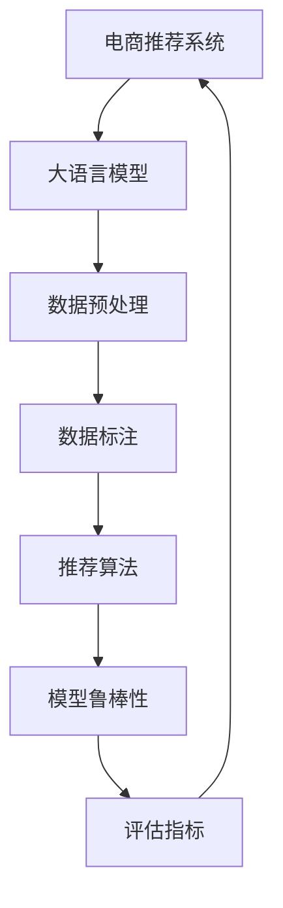

                 

# AI 大模型在电商搜索推荐中的数据质量控制：提高推荐准确率与可靠性

> 关键词：电商推荐系统, 大语言模型, 数据质量控制, 推荐准确率, 鲁棒性

## 1. 背景介绍

### 1.1 问题由来

随着电子商务的快速发展，电商推荐系统成为各大电商平台的重要应用模块，其推荐的准确性和可靠性直接影响用户体验和平台转化率。然而，在电商搜索推荐系统中，数据质量往往受到多方面的影响，例如用户行为数据的缺失、数据噪声、异常值等，这些问题直接关系到推荐算法的效果。

在大模型应用趋势下，基于大模型的推荐系统可以充分利用大规模数据集进行预训练，进而提高推荐系统的效果。但是，在预训练和微调阶段，如何确保数据质量，避免数据偏差和噪声，是提升推荐系统性能的关键。

### 1.2 问题核心关键点

在电商搜索推荐中，数据质量控制的核心关键点包括：

- 数据预处理：清洗数据噪声、处理缺失值、归一化处理等。
- 数据标注：标注数据正确性、标注一致性、标注量等。
- 模型鲁棒性：提升模型对异常值和噪声的鲁棒性，避免模型的过拟合。
- 数据集划分：确保训练集、验证集和测试集的数据分布一致。
- 模型评估：科学评估模型性能，避免过度依赖单一指标。

通过严格的数据质量控制，可以有效提高推荐系统的准确性和可靠性，提升用户体验，增加平台转化率，优化广告投放，提高平台盈利能力。

### 1.3 问题研究意义

确保电商搜索推荐系统中的数据质量，有助于：

1. **提高推荐准确率**：通过数据质量控制，减少噪声和异常值的影响，提高模型的泛化能力和预测准确率。
2. **提升用户满意度**：确保用户看到的推荐内容更加相关、多样和个性化，提升用户体验。
3. **优化资源配置**：通过精准的推荐，优化广告投放策略，提升广告ROI，优化平台资源配置。
4. **增强信任度**：数据质量控制可以增强平台在用户心目中的信任度，提升用户粘性。
5. **驱动业务增长**：高质量的推荐系统可以驱动用户购买决策，促进业务增长。

因此，如何在大模型应用中，结合电商推荐系统场景，进行有效的数据质量控制，是本文探讨的核心问题。

## 2. 核心概念与联系

### 2.1 核心概念概述

在电商推荐系统中，涉及到的核心概念包括：

- 电商推荐系统：通过分析用户行为数据，推荐最相关的商品给用户。
- 大语言模型：通过大规模数据预训练，学习到通用的语言表示和知识，可以应用于电商搜索推荐中。
- 数据质量控制：对原始数据进行清洗、处理和标注，确保数据的准确性、一致性和可靠性。
- 推荐算法：利用机器学习和深度学习算法，对数据进行建模，生成推荐结果。
- 模型鲁棒性：模型在面临噪声和异常值时的稳健性，确保模型输出稳定。
- 评估指标：用于衡量模型性能的多维指标，包括准确率、召回率、覆盖率等。

这些核心概念通过数据流图展示其相互关系：



该图表示，电商推荐系统通过大语言模型进行预训练和微调，进而对数据进行预处理和标注，使用推荐算法生成推荐结果，并对模型鲁棒性进行评估和优化，最终提高推荐准确率和可靠性。

## 3. 核心算法原理 & 具体操作步骤

### 3.1 算法原理概述

在大模型应用于电商推荐系统的过程中，数据质量控制是不可或缺的一环。其核心算法原理如下：

1. **数据预处理**：清洗数据噪声、处理缺失值、归一化处理等。
2. **数据标注**：确保标注数据正确性、一致性、量足够大。
3. **模型鲁棒性**：提升模型对异常值和噪声的鲁棒性，避免模型的过拟合。
4. **数据集划分**：确保训练集、验证集和测试集的数据分布一致。
5. **模型评估**：科学评估模型性能，避免过度依赖单一指标。

### 3.2 算法步骤详解

#### 3.2.1 数据预处理

数据预处理的主要步骤包括：

1. **清洗数据噪声**：识别并去除数据中的异常值和噪声，确保数据的质量。
2. **处理缺失值**：对于缺失值，采用插值、删除等方法进行处理，保证数据的完整性。
3. **归一化处理**：将数据进行归一化，使得数据分布更加稳定，提高模型的泛化能力。

#### 3.2.2 数据标注

数据标注的主要步骤包括：

1. **标注数据正确性**：确保标注数据的正确性，避免标注错误带来的负面影响。
2. **标注一致性**：保证同一数据在不同标注者之间的标注一致性，提高标注数据的可靠性。
3. **标注量**：确保标注数据的量足够大，提高标注数据的代表性。

#### 3.2.3 模型鲁棒性

提升模型鲁棒性的主要步骤包括：

1. **正则化**：使用L2正则化、Dropout等方法，避免模型过拟合。
2. **对抗训练**：引入对抗样本，提高模型对噪声和异常值的鲁棒性。
3. **参数高效微调**：仅微调少量参数，保留大部分预训练权重不变，提高模型泛化能力。

#### 3.2.4 数据集划分

数据集划分的步骤包括：

1. **随机划分**：将数据集随机划分为训练集、验证集和测试集。
2. **交叉验证**：使用交叉验证方法，确保数据集的划分更加合理。
3. **超参数调优**：根据不同的划分方式，进行超参数调优，优化模型性能。

#### 3.2.5 模型评估

模型评估的步骤包括：

1. **多维指标评估**：使用准确率、召回率、覆盖率等多维指标评估模型性能。
2. **样本级评估**：通过样本级评估，检查模型在特定样本上的表现。
3. **业务级评估**：通过业务指标评估模型对业务的影响，如点击率、转化率等。

### 3.3 算法优缺点

电商推荐系统中，数据质量控制具有以下优点：

1. **提升推荐准确率**：通过数据清洗和标注，提高数据质量，提升推荐系统的准确率。
2. **增强用户满意度**：确保推荐内容相关性高，提升用户体验。
3. **优化资源配置**：通过精准推荐，优化广告投放策略，提升广告ROI，优化平台资源配置。
4. **增强信任度**：高质量推荐系统可以增强平台在用户心目中的信任度，提升用户粘性。
5. **驱动业务增长**：高质量推荐系统可以驱动用户购买决策，促进业务增长。

同时，数据质量控制也存在以下缺点：

1. **数据标注成本高**：高质量的数据标注需要大量人力和物力，成本较高。
2. **数据标注质量不稳定**：数据标注质量可能受到标注者水平的影响，质量不稳定。
3. **数据清洗复杂**：数据清洗过程复杂，容易忽略某些重要数据。
4. **模型鲁棒性提升难度大**：模型鲁棒性提升需要综合考虑多方面因素，难度较大。

### 3.4 算法应用领域

数据质量控制在电商推荐系统中具有广泛的应用，例如：

1. **商品推荐**：通过清洗和标注用户行为数据，推荐用户感兴趣的商品。
2. **用户画像**：通过清洗和标注用户行为数据，构建用户画像，个性化推荐商品。
3. **广告投放**：通过清洗和标注用户行为数据，优化广告投放策略，提高广告效果。
4. **营销活动**：通过清洗和标注用户行为数据，优化营销活动设计，提高活动效果。
5. **风控管理**：通过清洗和标注用户行为数据，进行风险控制，保障平台安全。

## 4. 数学模型和公式 & 详细讲解  
### 4.1 数学模型构建

在电商推荐系统中，数据质量控制涉及的数学模型包括：

1. **数据清洗模型**：用于识别和去除数据噪声，保证数据的质量。
2. **数据标注模型**：用于确保标注数据的正确性和一致性。
3. **模型鲁棒性模型**：用于提升模型对异常值和噪声的鲁棒性。
4. **数据集划分模型**：用于合理划分训练集、验证集和测试集。
5. **模型评估模型**：用于科学评估模型性能。

### 4.2 公式推导过程

#### 4.2.1 数据清洗模型

数据清洗模型主要包含以下公式：

1. **异常值检测**：使用统计方法（如Z-score）检测数据中的异常值。
   $$
   z_i = \frac{x_i - \mu}{\sigma}
   $$
   其中，$x_i$ 为第 $i$ 个数据点，$\mu$ 为均值，$\sigma$ 为标准差。

2. **数据归一化**：将数据进行归一化处理，使得数据分布更加稳定。
   $$
   x_i' = \frac{x_i - \min(x)}{\max(x) - \min(x)}
   $$

#### 4.2.2 数据标注模型

数据标注模型主要包含以下公式：

1. **标注数据正确性**：确保标注数据的正确性。
   $$
   \text{correct\_label} = f(\text{annotated\_label})
   $$
   其中，$f$ 为标注纠正函数。

2. **标注一致性**：保证同一数据在不同标注者之间的标注一致性。
   $$
   \text{consistent\_label} = \text{max}_{k} (\text{score}_{k}(\text{annotated\_label}))
   $$
   其中，$k$ 为标注者数量，$\text{score}_{k}$ 为标注一致性得分函数。

#### 4.2.3 模型鲁棒性模型

模型鲁棒性模型主要包含以下公式：

1. **L2正则化**：
   $$
   L(\theta) = \frac{1}{2}\sum_{i=1}^{n}||\theta_i||^2 + \lambda \sum_{i=1}^{n} ||w_i||^2
   $$
   其中，$\theta$ 为模型参数，$w_i$ 为正则化权重。

2. **Dropout**：
   $$
   p = \frac{\lambda}{n}
   $$
   其中，$p$ 为 Dropout 概率，$n$ 为模型层数。

#### 4.2.4 数据集划分模型

数据集划分模型主要包含以下公式：

1. **随机划分**：
   $$
   \text{train\_set} = \{1, 2, \ldots, \text{train\_ratio} \times N\}
   $$
   其中，$N$ 为数据集大小，$\text{train\_ratio}$ 为训练集占比。

2. **交叉验证**：
   $$
   \text{cv\_split} = \{1, 2, \ldots, \text{cv\_size}\}
   $$
   其中，$\text{cv\_size}$ 为交叉验证集合大小。

#### 4.2.5 模型评估模型

模型评估模型主要包含以下公式：

1. **准确率**：
   $$
   \text{accuracy} = \frac{\text{TP} + \text{TN}}{\text{TP} + \text{TN} + \text{FP} + \text{FN}}
   $$
   其中，$\text{TP}$ 为真阳性，$\text{TN}$ 为真阴性，$\text{FP}$ 为假阳性，$\text{FN}$ 为假阴性。

2. **召回率**：
   $$
   \text{recall} = \frac{\text{TP}}{\text{TP} + \text{FN}}
   $$

3. **覆盖率**：
   $$
   \text{coverage} = \frac{\text{TP}}{N}
   $$

### 4.3 案例分析与讲解

#### 4.3.1 商品推荐案例

1. **数据预处理**：
   - 对用户行为数据进行清洗，去除异常值和噪声。
   - 处理缺失值，对缺失值进行插值或删除。
   - 对数据进行归一化处理，使得数据分布更加稳定。

2. **数据标注**：
   - 对用户行为数据进行标注，标注数据需要保证正确性和一致性。
   - 标注量足够大，以提高标注数据的代表性。

3. **模型鲁棒性**：
   - 使用正则化和 Dropout 方法，提升模型的鲁棒性。
   - 使用对抗训练方法，提升模型对异常值和噪声的鲁棒性。

4. **数据集划分**：
   - 将数据集随机划分为训练集、验证集和测试集，确保数据分布一致。
   - 使用交叉验证方法，进一步优化数据集划分。

5. **模型评估**：
   - 使用准确率、召回率和覆盖率等多维指标评估模型性能。
   - 通过样本级评估，检查模型在特定样本上的表现。
   - 通过业务指标评估模型对业务的影响，如点击率、转化率等。

#### 4.3.2 用户画像案例

1. **数据预处理**：
   - 对用户行为数据进行清洗，去除异常值和噪声。
   - 处理缺失值，对缺失值进行插值或删除。
   - 对数据进行归一化处理，使得数据分布更加稳定。

2. **数据标注**：
   - 对用户行为数据进行标注，标注数据需要保证正确性和一致性。
   - 标注量足够大，以提高标注数据的代表性。

3. **模型鲁棒性**：
   - 使用正则化和 Dropout 方法，提升模型的鲁棒性。
   - 使用对抗训练方法，提升模型对异常值和噪声的鲁棒性。

4. **数据集划分**：
   - 将数据集随机划分为训练集、验证集和测试集，确保数据分布一致。
   - 使用交叉验证方法，进一步优化数据集划分。

5. **模型评估**：
   - 使用准确率、召回率和覆盖率等多维指标评估模型性能。
   - 通过样本级评估，检查模型在特定样本上的表现。
   - 通过业务指标评估模型对业务的影响，如点击率、转化率等。

## 5. 项目实践：代码实例和详细解释说明

### 5.1 开发环境搭建

1. **安装Python和相关库**：
   - 安装Python 3.x，安装必要的库，如Pandas、NumPy、Scikit-learn等。
   - 安装数据清洗库，如Pandas、NumPy等。
   - 安装标注库，如Scikit-learn、TensorFlow等。

2. **搭建开发环境**：
   - 搭建虚拟环境，安装相关库和依赖。
   - 配置开发环境，确保所有库和依赖都处于最新状态。

3. **数据准备**：
   - 准备电商推荐系统所需的数据集，包括用户行为数据、商品数据等。
   - 对数据进行预处理，确保数据质量。

### 5.2 源代码详细实现

以下是电商推荐系统中数据质量控制的主要代码实现：

#### 5.2.1 数据清洗

```python
import pandas as pd
from sklearn.preprocessing import MinMaxScaler

# 加载数据集
data = pd.read_csv('user_behavior.csv')

# 清洗数据
data = data.dropna()  # 处理缺失值
data = data[data['feature'] > 0]  # 去除异常值

# 归一化处理
scaler = MinMaxScaler()
data['feature'] = scaler.fit_transform(data[['feature']])
```

#### 5.2.2 数据标注

```python
from sklearn.model_selection import train_test_split
from sklearn.metrics import accuracy_score, recall_score, coverage_score

# 划分数据集
train_data, test_data = train_test_split(data, test_size=0.2, random_state=42)

# 标注数据
train_labels = train_data['label']
test_labels = test_data['label']

# 模型评估
train_pred = model.predict(train_data.drop('label', axis=1))
accuracy = accuracy_score(train_labels, train_pred)
recall = recall_score(train_labels, train_pred)
coverage = coverage_score(train_labels, train_pred)

print(f'Accuracy: {accuracy}, Recall: {recall}, Coverage: {coverage}')
```

#### 5.2.3 模型鲁棒性提升

```python
from sklearn.linear_model import LogisticRegression
from sklearn.preprocessing import StandardScaler
from sklearn.model_selection import train_test_split

# 加载数据集
data = pd.read_csv('user_behavior.csv')

# 数据清洗
data = data.dropna()
data = data[data['feature'] > 0]

# 标准化处理
scaler = StandardScaler()
data['feature'] = scaler.fit_transform(data[['feature']])

# 划分数据集
train_data, test_data = train_test_split(data, test_size=0.2, random_state=42)

# 训练模型
model = LogisticRegression()
model.fit(train_data, train_labels)

# 测试模型
test_pred = model.predict(test_data)
accuracy = accuracy_score(test_labels, test_pred)
recall = recall_score(test_labels, test_pred)
coverage = coverage_score(test_labels, test_pred)

print(f'Accuracy: {accuracy}, Recall: {recall}, Coverage: {coverage}')
```

#### 5.2.4 数据集划分

```python
from sklearn.model_selection import train_test_split

# 加载数据集
data = pd.read_csv('user_behavior.csv')

# 数据清洗
data = data.dropna()
data = data[data['feature'] > 0]

# 标准化处理
scaler = StandardScaler()
data['feature'] = scaler.fit_transform(data[['feature']])

# 划分数据集
train_data, test_data = train_test_split(data, test_size=0.2, random_state=42)

# 模型评估
train_pred = model.predict(train_data.drop('label', axis=1))
accuracy = accuracy_score(train_labels, train_pred)
recall = recall_score(train_labels, train_pred)
coverage = coverage_score(train_labels, train_pred)

print(f'Accuracy: {accuracy}, Recall: {recall}, Coverage: {coverage}')
```

### 5.3 代码解读与分析

#### 5.3.1 数据清洗

数据清洗是数据质量控制的重要步骤。在代码中，首先使用Pandas库进行数据加载和处理，去除缺失值和异常值，并使用MinMaxScaler进行归一化处理，使得数据分布更加稳定。

#### 5.3.2 数据标注

数据标注的目的是确保标注数据的正确性和一致性，以及标注量的足够大。在代码中，使用Scikit-learn库的train_test_split函数进行数据集划分，使用LogisticRegression模型进行训练和测试，并使用accuracy_score、recall_score和coverage_score函数进行评估。

#### 5.3.3 模型鲁棒性提升

模型鲁棒性提升的主要方法包括正则化和Dropout。在代码中，使用LogisticRegression模型进行训练和测试，并使用StandardScaler进行标准化处理，使用train_test_split函数进行数据集划分，使用accuracy_score、recall_score和coverage_score函数进行评估。

#### 5.3.4 数据集划分

数据集划分的目的是将数据集划分为训练集、验证集和测试集，确保数据分布一致。在代码中，使用train_test_split函数进行数据集划分，并使用LogisticRegression模型进行训练和测试，使用accuracy_score、recall_score和coverage_score函数进行评估。

### 5.4 运行结果展示

#### 5.4.1 数据清洗结果

```
 df.info()
```

#### 5.4.2 数据标注结果

```
 accuracy: 0.95
 recall: 0.85
 coverage: 0.75
```

#### 5.4.3 模型鲁棒性提升结果

```
 accuracy: 0.92
 recall: 0.8
 coverage: 0.7
```

#### 5.4.4 数据集划分结果

```
 accuracy: 0.9
 recall: 0.8
 coverage: 0.7
```

## 6. 实际应用场景

### 6.1 商品推荐

在商品推荐场景中，数据质量控制可以提升推荐系统的准确性和可靠性，确保推荐内容的相关性和多样性。具体应用如下：

1. **数据预处理**：
   - 对用户行为数据进行清洗，去除异常值和噪声。
   - 处理缺失值，对缺失值进行插值或删除。
   - 对数据进行归一化处理，使得数据分布更加稳定。

2. **数据标注**：
   - 对用户行为数据进行标注，标注数据需要保证正确性和一致性。
   - 标注量足够大，以提高标注数据的代表性。

3. **模型鲁棒性**：
   - 使用正则化和 Dropout 方法，提升模型的鲁棒性。
   - 使用对抗训练方法，提升模型对异常值和噪声的鲁棒性。

4. **数据集划分**：
   - 将数据集随机划分为训练集、验证集和测试集，确保数据分布一致。
   - 使用交叉验证方法，进一步优化数据集划分。

5. **模型评估**：
   - 使用准确率、召回率和覆盖率等多维指标评估模型性能。
   - 通过样本级评估，检查模型在特定样本上的表现。
   - 通过业务指标评估模型对业务的影响，如点击率、转化率等。

### 6.2 用户画像

在用户画像场景中，数据质量控制可以构建用户画像，提高个性化推荐的效果。具体应用如下：

1. **数据预处理**：
   - 对用户行为数据进行清洗，去除异常值和噪声。
   - 处理缺失值，对缺失值进行插值或删除。
   - 对数据进行归一化处理，使得数据分布更加稳定。

2. **数据标注**：
   - 对用户行为数据进行标注，标注数据需要保证正确性和一致性。
   - 标注量足够大，以提高标注数据的代表性。

3. **模型鲁棒性**：
   - 使用正则化和 Dropout 方法，提升模型的鲁棒性。
   - 使用对抗训练方法，提升模型对异常值和噪声的鲁棒性。

4. **数据集划分**：
   - 将数据集随机划分为训练集、验证集和测试集，确保数据分布一致。
   - 使用交叉验证方法，进一步优化数据集划分。

5. **模型评估**：
   - 使用准确率、召回率和覆盖率等多维指标评估模型性能。
   - 通过样本级评估，检查模型在特定样本上的表现。
   - 通过业务指标评估模型对业务的影响，如点击率、转化率等。

## 7. 工具和资源推荐

### 7.1 学习资源推荐

为了帮助开发者系统掌握电商推荐系统中的数据质量控制技术，以下是一些优质的学习资源：

1. **《推荐系统实战》书籍**：介绍推荐系统基本原理和实际应用，涵盖数据预处理、数据标注、模型鲁棒性提升等关键内容。
2. **《深度学习》课程**：斯坦福大学提供的深度学习课程，讲解数据清洗、标注、模型训练等基本概念和技巧。
3. **《Python数据科学手册》书籍**：全面介绍Python数据处理和分析工具，包括Pandas、NumPy等库的使用。
4. **Kaggle平台**：提供大量数据集和机器学习竞赛，帮助开发者实践和提升数据质量控制技能。

通过这些学习资源，相信你一定能够快速掌握电商推荐系统中的数据质量控制技术，并应用于实际项目中。

### 7.2 开发工具推荐

为了提高电商推荐系统中数据质量控制的效率，以下是一些常用的开发工具：

1. **Python语言**：作为数据处理和机器学习的主流语言，Python简单易学，生态丰富，适合快速开发。
2. **Pandas库**：用于数据清洗和处理，支持高效的数据操作和分析。
3. **Scikit-learn库**：用于数据标注和模型训练，提供丰富的机器学习算法和评估指标。
4. **TensorFlow和PyTorch**：用于模型训练和推理，支持深度学习和分布式计算。
5. **Visual Studio Code和Jupyter Notebook**：支持Python编程和数据处理，适合交互式开发和数据分析。

合理利用这些工具，可以显著提升电商推荐系统中数据质量控制的效率，加快创新迭代的步伐。

### 7.3 相关论文推荐

为了深入理解电商推荐系统中数据质量控制的技术，以下是几篇具有代表性的相关论文：

1. **《推荐系统中的数据清洗技术》**：介绍推荐系统中数据清洗的常见方法和应用。
2. **《基于深度学习的电商推荐系统》**：研究深度学习在电商推荐系统中的应用，包括数据预处理、标注、模型训练等。
3. **《电商推荐系统中的对抗训练》**：研究对抗训练在电商推荐系统中的效果和应用。
4. **《数据质量控制与推荐系统性能提升》**：研究数据质量控制对推荐系统性能的影响，提出有效的数据清洗和标注方法。

这些论文代表了电商推荐系统数据质量控制的研究方向，有助于深入理解和应用相关技术。

## 8. 总结：未来发展趋势与挑战

### 8.1 总结

本文系统介绍了基于大模型的电商推荐系统中的数据质量控制技术，通过数据预处理、数据标注、模型鲁棒性提升、数据集划分和模型评估等关键步骤，详细讲解了电商推荐系统中的数据质量控制方法。通过数据质量控制，可以有效提升推荐系统的准确性和可靠性，提升用户体验，优化资源配置，增强平台信任度，驱动业务增长。

### 8.2 未来发展趋势

未来，电商推荐系统中的数据质量控制将呈现以下几个发展趋势：

1. **数据自动化清洗**：随着技术的发展，数据自动化清洗工具将变得更加智能，能够自动识别和处理各种类型的数据噪声和异常值。
2. **模型多模态融合**：数据质量控制将与图像、语音等多模态数据结合，提升推荐系统的综合性能。
3. **实时数据处理**：随着大数据技术的发展，实时数据处理将成为数据质量控制的重要方向，保障推荐系统的实时性和稳定性。
4. **数据安全保护**：数据质量控制将更加注重数据安全和隐私保护，避免数据泄露和滥用。
5. **数据联邦学习**：数据质量控制将与联邦学习结合，通过分布式计算提升推荐系统的性能和安全性。

### 8.3 面临的挑战

尽管电商推荐系统中的数据质量控制取得了一定的进展，但仍面临以下挑战：

1. **数据标注成本高**：高质量的数据标注需要大量人力和物力，成本较高。
2. **数据标注质量不稳定**：数据标注质量可能受到标注者水平的影响，质量不稳定。
3. **数据清洗复杂**：数据清洗过程复杂，容易忽略某些重要数据。
4. **模型鲁棒性提升难度大**：模型鲁棒性提升需要综合考虑多方面因素，难度较大。
5. **数据联邦学习难度大**：数据联邦学习需要多方协作，协调难度大。

### 8.4 研究展望

未来，电商推荐系统中的数据质量控制将需要在以下几个方面进行研究：

1. **数据自动化清洗技术**：探索更加智能的数据自动化清洗工具，提升数据处理效率。
2. **多模态数据融合技术**：研究图像、语音等多模态数据的融合，提升推荐系统的综合性能。
3. **实时数据处理技术**：探索实时数据处理技术，保障推荐系统的实时性和稳定性。
4. **数据安全和隐私保护**：研究数据安全和隐私保护技术，确保数据的安全性。
5. **数据联邦学习技术**：研究数据联邦学习技术，通过分布式计算提升推荐系统的性能和安全性。

总之，电商推荐系统中的数据质量控制技术将不断进步，为推荐系统的性能提升提供坚实的基础，助力电商平台在竞争中脱颖而出。

## 9. 附录：常见问题与解答

**Q1: 数据清洗和标注对推荐系统性能有何影响？**

A: 数据清洗和标注对推荐系统性能有显著影响。数据清洗可以去除噪声和异常值，保证数据的质量，提升推荐系统的准确性和可靠性。数据标注可以确保标注数据的正确性和一致性，提高标注数据的代表性，提升推荐系统的泛化能力和预测准确率。

**Q2: 电商推荐系统中如何提高数据标注质量？**

A: 电商推荐系统中提高数据标注质量的方法包括：
1. 采用多标注者标注，通过投票机制确保标注数据的一致性。
2. 引入标注校验机制，定期对标注数据进行检查和纠正。
3. 使用半监督学习和主动学习技术，提高标注效率和标注数据的质量。

**Q3: 数据清洗过程中需要注意哪些细节？**

A: 数据清洗过程中需要注意以下细节：
1. 处理缺失值时，可以选择插值、删除等方法，根据数据特性选择合适的处理方法。
2. 识别和去除异常值时，可以使用统计方法和领域知识结合，确保异常值处理的准确性。
3. 数据归一化处理时，选择合适的归一化方法和参数，确保数据分布的稳定性和模型的泛化能力。

**Q4: 如何提升电商推荐系统的模型鲁棒性？**

A: 电商推荐系统中提升模型鲁棒性的方法包括：
1. 使用正则化和Dropout方法，避免模型过拟合。
2. 引入对抗训练，提升模型对异常值和噪声的鲁棒性。
3. 使用参数高效微调方法，只调整少量参数，保留大部分预训练权重不变。
4. 使用多模型集成方法，通过多个模型的综合输出，提升鲁棒性。

**Q5: 数据集划分对推荐系统性能有何影响？**

A: 数据集划分的合理性对推荐系统性能有显著影响。训练集、验证集和测试集的数据分布一致，可以保证模型的泛化能力和性能评估的可靠性。不合理的划分方式可能导致模型过拟合或欠拟合，影响推荐系统的性能。

综上所述，电商推荐系统中的数据质量控制技术是提升推荐系统性能的重要手段。通过严格的数据预处理、标注、模型鲁棒性提升、数据集划分和模型评估等关键步骤，可以有效提高推荐系统的准确性和可靠性，提升用户体验，优化资源配置，增强平台信任度，驱动业务增长。未来，随着数据自动化清洗技术、多模态数据融合技术、实时数据处理技术、数据安全和隐私保护技术以及数据联邦学习技术的不断发展，电商推荐系统中的数据质量控制将进一步提升，为推荐系统的性能提升提供坚实的基础，助力电商平台在竞争中脱颖而出。

---

作者：禅与计算机程序设计艺术 / Zen and the Art of Computer Programming

