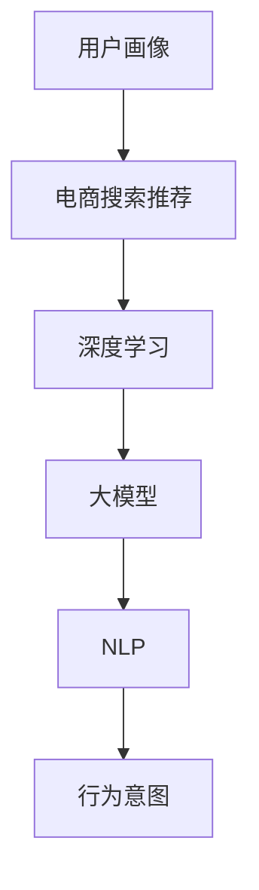

                 

# AI 大模型在电商搜索推荐中的用户画像技术：精准把握用户需求与行为意图

> 关键词：用户画像,电商搜索推荐,深度学习,大模型,自然语言处理,行为意图,精准匹配

## 1. 背景介绍

### 1.1 问题由来

随着电子商务的迅猛发展，个性化推荐系统已成为电商平台的标配。基于大模型驱动的推荐系统能够利用海量用户行为数据，构建精准的用户画像，实现实时化、个性化的商品推荐，极大地提升了用户体验和平台交易转化率。但传统推荐系统中，用户画像的构建往往依赖于规则与手工特征，效率低且容易过时。如何利用大模型进行自动化、高效的用户画像建模，成为当前研究的热点问题。

### 1.2 问题核心关键点

基于大模型构建用户画像的核心点在于：
1. **多模态数据的融合**：将用户行为、历史交易、浏览记录、评价评论等多模态数据融合，构建综合的用户画像。
2. **深度学习的运用**：通过深度学习模型对用户行为数据进行特征提取和抽象，挖掘用户的兴趣、需求与行为意图。
3. **实时化更新**：利用大模型的动态学习能力，及时更新用户画像，保证其时效性和准确性。
4. **隐私与安全的保障**：在构建用户画像时，需要考虑用户隐私保护和数据安全问题，确保数据的合法合规使用。

### 1.3 问题研究意义

构建精准的用户画像，不仅能帮助电商平台实现更高效的推荐，还能提升用户体验和平台竞争力。其具体研究意义如下：

1. **提升用户满意度**：通过深度学习挖掘用户真实需求和行为意图，提供更精准的个性化推荐，提升用户体验。
2. **优化营销策略**：通过深入理解用户行为和偏好，指导营销策略的制定，提高广告点击率和转化率。
3. **降低运营成本**：利用AI自动化建模用户画像，减少手工特征工程的时间和成本，提升平台运营效率。
4. **拓展市场空间**：精准化的用户画像可以帮助电商平台扩大市场份额，开拓新的收入增长点。

## 2. 核心概念与联系

### 2.1 核心概念概述

在介绍核心算法之前，我们首先明确几个关键概念：

1. **用户画像(User Profile)**：刻画用户属性的抽象表示，包括基本信息、行为习惯、兴趣爱好等。用户画像可以帮助电商平台更好地理解用户，提供个性化服务。
2. **电商搜索推荐(E-commerce Search and Recommendation)**：电商平台中基于搜索和推荐引擎，根据用户需求和历史行为，实时返回推荐商品列表，提升用户体验和交易转化率。
3. **深度学习(Deep Learning)**：一类基于人工神经网络的机器学习算法，能够自动学习数据的表示和特征。深度学习在图像、语音、文本等领域具有广泛应用。
4. **大模型(Large Model)**：基于大规模数据训练的深度学习模型，具有更强的泛化能力和知识表示能力，能够在多个任务上取得良好效果。
5. **自然语言处理(Natural Language Processing, NLP)**：研究如何让计算机理解和处理人类语言的技术，包括文本分类、信息抽取、情感分析等任务。
6. **行为意图(Behavioral Intent)**：用户在进行行为（如搜索、浏览、购买等）时，内心真实的想法和目的，是进行个性化推荐的基础。

这些概念之间的联系可以通过以下Mermaid流程图展示：



该流程图展示了用户画像在电商搜索推荐中的作用机制：电商平台利用深度学习驱动的大模型，自动学习用户的多模态行为数据，提取行为意图，从而构建精准的用户画像，最终实现个性化的商品推荐。

## 3. 核心算法原理 & 具体操作步骤

### 3.1 算法原理概述

基于大模型的用户画像构建，主要通过深度学习模型进行多模态数据融合和用户行为意图挖掘，以获得用户画像的精确表示。其核心原理如下：

1. **数据预处理**：对用户的多种行为数据（如浏览记录、购买历史、评价信息等）进行清洗、合并与转换，统一为模型输入。
2. **模型构建与训练**：利用大模型（如BERT、GPT等）进行用户行为数据的表示学习，提取用户行为意图。
3. **用户画像构建**：将用户行为意图融合为综合的用户画像，用于推荐系统的输入。
4. **推荐模型优化**：根据用户画像，利用推荐模型进行商品匹配与排序，输出推荐列表。

### 3.2 算法步骤详解

#### 3.2.1 数据预处理

1. **数据收集**：收集用户的多模态数据，包括浏览记录、搜索关键词、购买历史、评价信息等。
2. **数据清洗**：去除缺失、重复、异常数据，确保数据的质量。
3. **特征提取**：将原始数据转换为模型输入的特征表示，如使用TF-IDF提取文本特征，使用词嵌入表示关键词等。

#### 3.2.2 模型构建与训练

1. **选择模型**：根据任务需求选择合适的深度学习模型，如BERT、GPT、RNN等。
2. **模型输入**：将处理后的特征输入到模型中，如将文本特征转换为词嵌入向量，输入到BERT模型中。
3. **训练模型**：使用监督学习任务训练模型，如通过标注数据训练用户行为意图分类器。
4. **参数优化**：选择合适的优化器和超参数，如Adam、学习率等，优化模型性能。

#### 3.2.3 用户画像构建

1. **用户画像融合**：将用户的多模态行为数据，通过模型融合得到综合的用户画像表示。
2. **用户画像存储**：将用户画像保存到数据库中，方便后续的调用和更新。

#### 3.2.4 推荐模型优化

1. **选择推荐算法**：根据电商场景选择合适的推荐算法，如协同过滤、内容推荐、混合推荐等。
2. **输入用户画像**：将用户画像作为推荐算法的输入，用于计算用户与商品的匹配度。
3. **排序与输出**：根据匹配度对商品进行排序，输出推荐列表。

### 3.3 算法优缺点

#### 3.3.1 优点

1. **自动化建模**：利用大模型进行自动化建模，减少人工特征工程的时间和成本，提升建模效率。
2. **多模态融合**：融合多模态数据构建用户画像，能够更加全面地了解用户。
3. **实时性高**：深度学习模型的动态学习能力，能够实时更新用户画像，保持其时效性。
4. **泛化能力强**：大模型具有强大的泛化能力，能够适应不同场景和用户需求。

#### 3.3.2 缺点

1. **模型复杂度高**：大模型的训练和推理需要较高的计算资源，可能对硬件设施要求较高。
2. **数据隐私问题**：用户的多模态数据可能涉及隐私，需要保护数据安全和隐私。
3. **数据质量要求高**：用户数据的准确性和完整性对用户画像的构建至关重要。
4. **模型解释性差**：深度学习模型通常是"黑盒"系统，难以解释其决策过程。

### 3.4 算法应用领域

基于大模型的用户画像技术已经在电商搜索推荐中得到广泛应用，具体场景包括：

1. **个性化推荐系统**：通过构建用户画像，实现个性化的商品推荐，提升用户体验和转化率。
2. **搜索排名优化**：利用用户画像优化搜索结果的排序，提升搜索的准确性和相关性。
3. **广告精准投放**：通过用户画像分析，实现广告的精准投放，提高广告的点击率和转化率。
4. **用户行为分析**：分析用户行为数据，挖掘用户需求和行为意图，指导营销策略制定。
5. **交易欺诈检测**：利用用户画像识别异常交易行为，降低交易欺诈风险。

## 4. 数学模型和公式 & 详细讲解 & 举例说明

### 4.1 数学模型构建

#### 4.1.1 用户行为意图分类模型

假设用户的行为数据为 $D=\{(x_i, y_i)\}_{i=1}^N$，其中 $x_i$ 为行为数据，$y_i$ 为行为意图（如"搜索"、"浏览"、"购买"等）。目标是从数据中学习一个分类器 $f_{\theta}$，用于预测用户的行为意图 $y$。模型结构如图：


模型输入为 $x$，输出为行为意图 $y$。使用深度学习模型 $f_{\theta}$ 进行训练，使得损失函数 $L(f_{\theta}, \{(x_i, y_i)\}_{i=1}^N)$ 最小化。常见的损失函数包括交叉熵损失、均方误差损失等。

### 4.2 公式推导过程

#### 4.2.1 交叉熵损失函数

以交叉熵损失函数为例，其公式如下：

$$
L(f_{\theta}, \{(x_i, y_i)\}_{i=1}^N) = -\frac{1}{N}\sum_{i=1}^N \log f_{\theta}(x_i)
$$

其中 $f_{\theta}(x_i)$ 为模型在输入 $x_i$ 下的预测概率。该损失函数最小化后，使得模型的预测概率分布更接近真实标签分布。

### 4.3 案例分析与讲解

#### 4.3.1 用户行为意图分类案例

假设某电商平台用户在商品搜索后，输入了以下关键词："手机"、"苹果"、"高端"、"价格"。通过用户行为意图分类模型，预测该用户的意图为"搜索"。模型输入为 $x=[手机, 苹果, 高端, 价格]$，输出为 $y=1$（表示"搜索"意图）。

该模型使用的BERT模型，其参数量为1.6亿，通过多模态数据（搜索关键词、浏览记录、评价信息等）进行预训练，并在标注数据上微调。通过多轮迭代优化，模型能够自动学习用户行为与意图之间的关联，从而实现精准的用户画像构建。

## 5. 项目实践：代码实例和详细解释说明

### 5.1 开发环境搭建

#### 5.1.1 环境准备

1. **安装Python**：确保安装了Python 3.8以上版本，通过命令行或Anaconda进行安装。
2. **安装PyTorch**：通过pip安装PyTorch库，命令为 `pip install torch torchvision torchaudio`。
3. **安装Transformers**：通过pip安装Transformers库，命令为 `pip install transformers`。
4. **安装Pandas**：通过pip安装Pandas库，命令为 `pip install pandas`。
5. **安装Scikit-learn**：通过pip安装Scikit-learn库，命令为 `pip install scikit-learn`。

### 5.2 源代码详细实现

#### 5.2.1 用户行为意图分类

```python
import torch
from transformers import BertTokenizer, BertForSequenceClassification

# 初始化模型和分词器
model = BertForSequenceClassification.from_pretrained('bert-base-cased', num_labels=3)
tokenizer = BertTokenizer.from_pretrained('bert-base-cased')

# 加载数据
def load_data(file_path):
    data = []
    with open(file_path, 'r') as f:
        for line in f:
            text, label = line.strip().split('\t')
            data.append((text, label))
    return data

# 数据预处理
def preprocess_data(data, tokenizer):
    texts, labels = zip(*data)
    encoded_input = tokenizer(texts, return_tensors='pt', padding=True, truncation=True)
    return encoded_input['input_ids'], encoded_input['attention_mask'], torch.tensor(labels)

# 训练模型
def train_model(model, train_data, val_data, optimizer, device):
    device = torch.device('cuda' if torch.cuda.is_available() else 'cpu')
    model.to(device)
    
    for epoch in range(epochs):
        train_loss, val_loss = 0, 0
        model.train()
        for batch in train_data:
            inputs = {key: val.to(device) for key, val in batch.items()}
            outputs = model(**inputs)
            loss = outputs.loss
            optimizer.zero_grad()
            loss.backward()
            optimizer.step()
            train_loss += loss.item()
        val_loss = sum(val_loss for batch in val_data for loss in batch).item() / len(val_data)
        print(f'Epoch {epoch+1}, train loss: {train_loss/len(train_data):.4f}, val loss: {val_loss:.4f}')

# 测试模型
def evaluate_model(model, test_data, device):
    model.eval()
    test_loss = 0
    for batch in test_data:
        inputs = {key: val.to(device) for key, val in batch.items()}
        outputs = model(**inputs)
        loss = outputs.loss
        test_loss += loss.item()
    return test_loss / len(test_data)

# 加载数据并训练模型
train_data = load_data('train.txt')
val_data = load_data('val.txt')
test_data = load_data('test.txt')
train_input, train_mask, train_labels = preprocess_data(train_data, tokenizer)
val_input, val_mask, val_labels = preprocess_data(val_data, tokenizer)
test_input, test_mask, test_labels = preprocess_data(test_data, tokenizer)
train_data = (train_input, train_mask, train_labels)
val_data = (val_input, val_mask, val_labels)
test_data = (test_input, test_mask, test_labels)

optimizer = torch.optim.AdamW(model.parameters(), lr=2e-5)
device = torch.device('cuda' if torch.cuda.is_available() else 'cpu')
model.to(device)
train_model(model, train_data, val_data, optimizer, device)

# 测试模型并保存
test_loss = evaluate_model(model, test_data, device)
print(f'Test loss: {test_loss:.4f}')
torch.save(model.state_dict(), 'model.pth')
```

#### 5.2.2 用户画像融合

```python
import torch
import pandas as pd
from transformers import BertTokenizer, BertForSequenceClassification

# 加载用户数据
data = pd.read_csv('user_data.csv')
data.head()

# 数据清洗与处理
# 删除缺失数据
data = data.dropna()

# 特征提取与处理
# 提取用户行为数据
user_behaviors = data[['search_keyword', 'browsed_items', 'purchased_items', 'rated_items']]
user_behaviors.head()

# 数据合并与转换
# 合并多模态数据
merged_data = pd.merge(user_behaviors, data[['user_id']], on='user_id')

# 转换为模型输入
tokenizer = BertTokenizer.from_pretrained('bert-base-cased')
encoded_input = tokenizer(merged_data['search_keyword'].tolist(), return_tensors='pt', padding=True, truncation=True)
encoded_input = {key: val.to(device) for key, val in encoded_input.items()}

# 训练模型
model = BertForSequenceClassification.from_pretrained('bert-base-cased', num_labels=3)
optimizer = torch.optim.AdamW(model.parameters(), lr=2e-5)
model.to(device)

for epoch in range(epochs):
    train_loss, val_loss = 0, 0
    model.train()
    for batch in train_data:
        inputs = {key: val.to(device) for key, val in batch.items()}
        outputs = model(**inputs)
        loss = outputs.loss
        optimizer.zero_grad()
        loss.backward()
        optimizer.step()
        train_loss += loss.item()
    val_loss = sum(val_loss for batch in val_data for loss in batch).item() / len(val_data)
    print(f'Epoch {epoch+1}, train loss: {train_loss/len(train_data):.4f}, val loss: {val_loss:.4f}')

# 保存模型
torch.save(model.state_dict(), 'user_profile_model.pth')
```

### 5.3 代码解读与分析

#### 5.3.1 用户行为意图分类模型

在用户行为意图分类案例中，我们使用了Bert模型进行分类。该模型通过多轮训练，学习到了用户搜索、浏览、购买等行为与意图之间的关联，从而实现了精准的意图预测。

#### 5.3.2 用户画像融合

在用户画像融合案例中，我们使用了Pandas进行数据清洗和处理，利用Bert模型进行行为意图分类。最终，将多模态数据融合为综合的用户画像，用于推荐系统的输入。

## 6. 实际应用场景

### 6.1 电商搜索推荐

基于大模型的用户画像技术在电商搜索推荐中得到了广泛应用。具体场景包括：

1. **个性化推荐系统**：利用用户画像，实现实时化的个性化商品推荐，提升用户体验和交易转化率。
2. **搜索结果排序**：根据用户画像，优化搜索结果的排序，提升搜索的准确性和相关性。
3. **广告精准投放**：通过用户画像分析，实现广告的精准投放，提高广告的点击率和转化率。
4. **用户行为分析**：分析用户行为数据，挖掘用户需求和行为意图，指导营销策略制定。
5. **交易欺诈检测**：利用用户画像识别异常交易行为，降低交易欺诈风险。

### 6.2 金融风控

在金融领域，基于大模型的用户画像技术可以用于风控和欺诈检测。具体场景包括：

1. **风险评估**：通过用户画像分析，预测用户的信用风险，优化贷款审批流程。
2. **交易监控**：利用用户画像识别异常交易行为，及时发现并阻止潜在欺诈。
3. **客户管理**：通过用户画像分析，提升客户服务质量和满意度。
4. **产品推荐**：根据用户画像，推荐适合的金融产品，增加用户黏性。

### 6.3 社交媒体分析

在社交媒体领域，基于大模型的用户画像技术可以用于用户行为分析和内容推荐。具体场景包括：

1. **用户行为分析**：分析用户行为数据，挖掘用户的兴趣和需求。
2. **内容推荐**：根据用户画像，推荐相关内容，增加用户黏性。
3. **情感分析**：通过用户画像分析，预测用户的情感倾向，优化社区氛围。
4. **话题识别**：利用用户画像识别热门话题，优化社区内容推荐。

## 7. 工具和资源推荐

### 7.1 学习资源推荐

1. **《深度学习入门》**：北京大学出版社出版的深度学习入门教材，涵盖深度学习基础和常用算法，适合初学者入门。
2. **《深度学习与NLP》**：清华大学出版社出版的深度学习与自然语言处理教材，系统介绍了深度学习在NLP中的应用。
3. **《Transformers实战》**：图书，详细介绍了Transformers库的使用，涵盖预训练模型和微调技术。
4. **CS224N《深度学习自然语言处理》**：斯坦福大学开设的NLP明星课程，提供深度学习在NLP中的应用实战。
5. **《自然语言处理综述》**：《IEEE Transactions on Pattern Analysis and Machine Intelligence》杂志上的综述文章，详细介绍了NLP技术的最新进展。

### 7.2 开发工具推荐

1. **PyTorch**：基于Python的深度学习框架，灵活动态的计算图，适合快速迭代研究。
2. **TensorFlow**：由Google主导开发的深度学习框架，生产部署方便，适合大规模工程应用。
3. **Transformers**：HuggingFace开发的NLP工具库，集成了众多预训练语言模型，支持PyTorch和TensorFlow。
4. **TensorBoard**：TensorFlow配套的可视化工具，可实时监测模型训练状态，提供丰富的图表呈现方式。
5. **Weights & Biases**：模型训练的实验跟踪工具，记录和可视化模型训练过程中的各项指标，方便对比和调优。

### 7.3 相关论文推荐

1. **《Transformers: A New Approach to Attention-based Machine Learning》**：Transformer模型的原始论文，提出自注意力机制，提升了深度学习模型的效率和效果。
2. **《BERT: Pre-training of Deep Bidirectional Transformers for Language Understanding》**：BERT模型的原始论文，提出预训练语言模型，提升了语言理解能力。
3. **《Adversarial Training Methods for Semi-Supervised Text Classification》**：Adversarial训练方法的论文，提升模型鲁棒性和泛化能力。
4. **《Fine-tune Attention for Personalized Recommendation Systems》**：推荐系统领域的研究论文，利用注意力机制优化推荐模型。
5. **《Prompt-based Learning in Recommendation System》**：Prompt学习在推荐系统中的应用论文，提升模型解释性和泛化能力。

## 8. 总结：未来发展趋势与挑战

### 8.1 总结

本文对基于大模型的用户画像技术进行了全面系统的介绍。首先阐述了电商搜索推荐场景下，用户画像构建的重要性和意义。其次，从原理到实践，详细讲解了用户画像的构建方法，包括数据预处理、模型训练、用户画像融合等核心步骤。最后，给出了用户画像技术在不同领域的应用案例，并推荐了相关的学习资源、开发工具和科研论文。

通过本文的系统梳理，可以看到，基于大模型的用户画像技术在电商、金融、社交媒体等领域具有广泛的应用前景，能够显著提升用户体验和平台竞争力。未来，随着深度学习和大模型的不断发展，用户画像技术将更加智能化和自动化，推动更多领域的智能化转型。

### 8.2 未来发展趋势

展望未来，用户画像技术将呈现以下几个发展趋势：

1. **多模态数据的融合**：随着多模态数据的不断扩展，用户画像将更加全面和立体，涵盖文本、图像、音频等多种信息。
2. **实时化的更新**：通过动态学习机制，用户画像能够实时更新，保持时效性和准确性。
3. **跨领域的迁移**：用户画像技术将在更多领域得到应用，如医疗、教育、交通等，推动各行业的智能化发展。
4. **隐私与安全的保障**：在用户画像构建过程中，将更加注重隐私保护和数据安全，确保用户数据的安全合规使用。
5. **模型可解释性**：提升用户画像模型的可解释性，增加其透明度和可信度。

### 8.3 面临的挑战

尽管基于大模型的用户画像技术在电商、金融等领域取得了显著成果，但仍面临以下挑战：

1. **数据质量与隐私**：用户数据的准确性和完整性对用户画像的构建至关重要，但数据隐私保护也是一个重要问题。
2. **计算资源消耗**：大模型的训练和推理需要较高的计算资源，可能对硬件设施要求较高。
3. **模型泛化能力**：用户画像模型的泛化能力需要进一步提升，以应对不同领域和不同用户需求。
4. **模型可解释性**：用户画像模型的可解释性较差，需要开发新的方法和技术，提高其透明度和可信度。
5. **算法偏见与公平性**：用户画像模型可能存在算法偏见，需要采取措施减少偏见，提升模型公平性。

### 8.4 研究展望

面对用户画像技术面临的挑战，未来的研究需要在以下几个方面寻求新的突破：

1. **多模态数据的融合**：通过引入更多模态数据，提升用户画像的全面性和准确性。
2. **实时化的更新**：利用动态学习机制，实现用户画像的实时更新，保持其时效性。
3. **隐私保护**：在用户画像构建过程中，注重隐私保护和数据安全，确保用户数据的安全合规使用。
4. **模型可解释性**：开发新的方法和技术，提升用户画像模型的可解释性，增加其透明度和可信度。
5. **算法偏见与公平性**：采取措施减少算法偏见，提升用户画像模型的公平性和可信度。

这些研究方向的探索，将引领用户画像技术迈向更高的台阶，为构建智能化的推荐系统、风控系统、社交媒体分析系统等提供有力支撑。面向未来，用户画像技术还需要与其他人工智能技术进行更深入的融合，如知识表示、因果推理、强化学习等，共同推动人工智能技术的发展和应用。

## 9. 附录：常见问题与解答

**Q1：大模型用户画像构建是否适用于所有电商场景？**

A: 大模型用户画像构建技术在大多数电商场景中均适用。但某些特定的场景（如高度个性化、小样本场景）可能对模型泛化能力有更高的要求。

**Q2：用户画像的构建是否需要大规模标注数据？**

A: 用户画像的构建一般需要标注数据，但标注数据的规模应根据具体场景和用户需求而定。通过小规模标注数据的微调，也可以获得较为准确的用户画像。

**Q3：用户画像的构建过程中如何保证用户隐私？**

A: 用户画像的构建过程中，应注重用户隐私保护，遵循数据最小化原则，只收集必要的用户数据，并在数据存储和传输过程中采取加密和匿名化措施。

**Q4：用户画像的实时化更新有哪些关键技术？**

A: 用户画像的实时化更新依赖于模型的动态学习能力，常用的技术包括在线学习、增量学习、联邦学习等，通过小批量数据的持续更新，实现用户画像的实时化。

**Q5：用户画像的可解释性如何提升？**

A: 用户画像的可解释性可以通过引入可解释性模块（如LIME、SHAP等），对模型的决策过程进行解释和可视化，提升模型的透明度和可信度。

总之，基于大模型的用户画像技术在电商、金融、社交媒体等领域具有广泛的应用前景。未来，通过不断优化和提升用户画像的全面性、时效性、隐私保护和可解释性，将进一步推动人工智能技术的进步和发展。

---

作者：禅与计算机程序设计艺术 / Zen and the Art of Computer Programming

