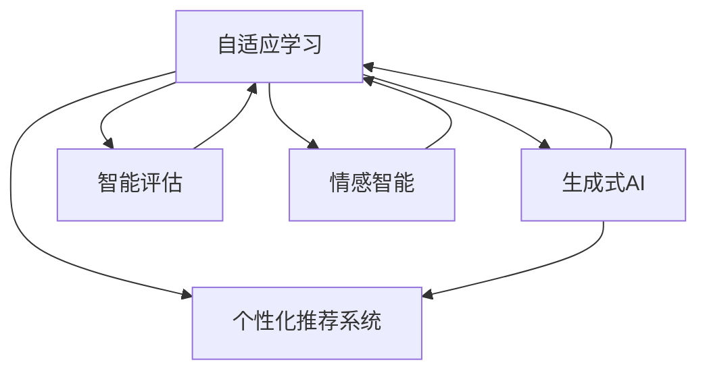

                 

# AIGC推动教育个性化发展

> 关键词：人工智能教育，自适应学习，个性化推荐，AIGC（生成式人工智能），学习系统，教育科技，大数据分析

## 1. 背景介绍

### 1.1 问题由来

近年来，教育领域发生了翻天覆地的变化，以人工智能（AI）为核心的教育技术正在深刻改变传统的教学模式。随着自适应学习（Adaptive Learning）和个性化推荐（Personalized Recommendation）等技术的快速发展，人工智能已经开始深入到教育的全过程，从课堂教学、作业批改、考试评估，到课外辅导、学习追踪、资源推荐，AI已经为个性化教育提供了全新的路径。

然而，传统的教育体系往往难以兼顾每个学生的独特需求和兴趣，标准化课程、统一进度、千篇一律的教学方法，无法充分激发学生的学习潜力和创造力。同时，教师的资源和时间也常常被传统的教学模式所束缚，无法实现真正的因材施教。

为了打破这种困境，教育科技领域引入了一个重要的概念——人工智能辅助生成（AIGC）。AIGC，即生成式人工智能，是指利用AI技术生成定制化的教学内容、学习路径、资源推荐等，从而实现个性化、动态化的教育体验。

### 1.2 问题核心关键点

AIGC技术的核心在于如何生成更加个性化的教育内容，以适应每个学生的独特需求和兴趣，以及如何通过动态化的教学策略，最大化地激发学生的学习潜能。核心关键点包括：

- **个性化学习路径**：根据学生的学习进度、能力、兴趣，生成量身定制的学习路径。
- **自适应评估**：通过智能评估，动态调整教学策略和内容，及时发现学生的不足并给予指导。
- **智能推荐系统**：根据学生的学习行为和历史数据，推荐最适合的学习资源和练习。
- **情感智能**：通过分析学生的情感状态，及时调整教学方法和节奏，增强学生的学习动力。

这些关键点涉及了生成式AI、自适应学习、个性化推荐、情感计算等多个领域的技术融合，需要教育领域和AI领域的专业知识，同时也需要深入理解教育心理学的原理。

## 2. 核心概念与联系

### 2.1 核心概念概述

为了更好地理解AIGC在教育中的应用，本节将介绍几个密切相关的核心概念：

- **自适应学习**：通过实时分析学生的学习数据，动态调整教学内容和策略，实现个性化教学。
- **个性化推荐系统**：根据用户的行为和兴趣，推荐最符合其需求的内容和资源。
- **生成式AI**：利用AI技术生成文本、图像、视频等内容，提供定制化的教育体验。
- **情感智能**：通过分析学生的情感状态，调整教学方法和节奏，增强学习动力。
- **智能评估**：利用AI技术进行自动化的评估，及时发现学生的学习瓶颈和问题。

这些核心概念之间的逻辑关系可以通过以下Mermaid流程图来展示：



这个流程图展示了你核心概念之间的关系：

1. **自适应学习**：是AIGC的基础，通过动态调整教学内容和策略，实现个性化教学。
2. **个性化推荐系统**：利用学生的行为和兴趣数据，推荐个性化的学习资源。
3. **生成式AI**：生成多样化的教育内容，提供丰富的学习体验。
4. **智能评估**：通过自动化评估，发现学生的学习问题，及时调整教学策略。
5. **情感智能**：分析学生的情感状态，调整教学方法和节奏，增强学习动力。

这些概念共同构成了AIGC在教育中的应用框架，为个性化教育的实现提供了技术支撑。

## 3. 核心算法原理 & 具体操作步骤
### 3.1 算法原理概述

AIGC在教育个性化发展中的应用，本质上是利用AI技术生成个性化的教育内容，并通过自适应学习、个性化推荐、智能评估等技术手段，实现动态化、个性化、高效化的教育体验。

核心算法原理包括以下几个方面：

- **个性化推荐算法**：利用协同过滤、矩阵分解、深度学习等技术，生成个性化推荐列表。
- **生成式AI算法**：利用自然语言处理（NLP）、图像处理、视频生成等技术，生成个性化的教学内容和学习资源。
- **自适应学习算法**：利用机器学习、强化学习等技术，动态调整教学内容和策略。
- **智能评估算法**：利用自然语言处理（NLP）、图像处理等技术，实现自动化的评估和反馈。
- **情感计算算法**：利用语音识别、情感分析等技术，实时监测学生的情感状态，调整教学方法。

这些算法共同作用，为个性化教育的实现提供了技术保障。

### 3.2 算法步骤详解

AIGC在教育个性化发展中的应用步骤主要包括以下几个方面：

**Step 1: 数据收集与预处理**

- 收集学生的学习数据，包括学习进度、成绩、兴趣、行为等。
- 利用自然语言处理（NLP）技术对文本数据进行分词、去噪、归一化等预处理。
- 利用图像处理技术对视频、图片数据进行清洗、标注等预处理。

**Step 2: 模型训练与优化**

- 利用深度学习模型（如RNN、LSTM、BERT等）对收集到的数据进行训练，生成个性化推荐模型和生成式AI模型。
- 利用强化学习算法对教学策略进行优化，生成自适应学习路径。
- 利用情感计算技术对学生情感状态进行分析，优化教学方法和节奏。

**Step 3: 个性化推荐与生成**

- 根据学生的历史学习数据，利用个性化推荐算法生成推荐列表。
- 利用生成式AI技术生成个性化的教学内容和学习资源，如定制化的课件、视频、练习题等。

**Step 4: 动态评估与调整**

- 利用智能评估算法对学生学习效果进行自动评估，发现学习瓶颈和问题。
- 根据评估结果，动态调整教学内容和策略，生成新的自适应学习路径。

**Step 5: 学习反馈与优化**

- 通过情感计算技术监测学生情感状态，及时调整教学方法和节奏。
- 收集学生反馈数据，对模型进行不断优化和调整，提升个性化教育的准确性和效果。

### 3.3 算法优缺点

AIGC在教育个性化发展中的应用，具有以下优点：

- **个性化与动态化**：能够根据每个学生的独特需求和兴趣，生成个性化的教学内容和策略，实现动态化的教育体验。
- **高效与精准**：利用AI技术自动化处理大量数据，快速生成推荐列表和学习内容，提高教育效率和精准度。
- **灵活与自适应**：能够实时调整教学内容和策略，适应学生的学习进度和能力变化，增强教学的灵活性和自适应性。

同时，AIGC也存在一些缺点：

- **技术复杂度**：需要多领域的技术融合，对技术要求较高，实施难度较大。
- **数据隐私问题**：收集和处理大量学生数据，可能涉及隐私问题，需要严格的数据保护措施。
- **模型泛化能力**：模型可能无法充分理解学生的多样化需求，导致推荐和学习内容不够准确。

### 3.4 算法应用领域

AIGC技术在教育个性化发展中的应用已经涵盖了多个领域，包括：

- **智能教育平台**：如Khan Academy、Coursera等，通过AI技术实现个性化学习路径和推荐。
- **在线学习管理系统（LMS）**：如Moodle、Blackboard等，利用AI技术提供自适应学习体验。
- **智能辅导系统**：如Knewton、Duolingo等，通过AI技术生成个性化教学内容，提供实时辅导。
- **虚拟现实（VR）和增强现实（AR）教育**：如Google Expeditions、ZebraVR等，利用生成式AI技术生成沉浸式的学习环境。
- **学习分析与评估**：如Socrative、Kaggle等，通过AI技术进行实时评估和反馈，优化教学效果。

这些应用领域展示了AIGC在教育个性化发展中的巨大潜力和广泛应用。

## 4. 数学模型和公式 & 详细讲解 & 举例说明（备注：数学公式请使用latex格式，latex嵌入文中独立段落使用 $$，段落内使用 $)
### 4.1 数学模型构建

为了更好地理解AIGC在教育中的应用，本节将使用数学语言对AIGC的算法模型进行更加严格的刻画。

假设学生的数据集为 $D=\{x_i\}_{i=1}^N$，其中 $x_i$ 表示学生的第 $i$ 条数据，包括学习进度、成绩、兴趣、行为等。

定义个性化推荐算法为 $R: D \rightarrow \mathcal{R}$，其中 $\mathcal{R}$ 表示推荐列表。推荐算法的目标是最小化推荐误差，即：

$$
\min_{R} \sum_{i=1}^N \ell(R(x_i),y_i)
$$

其中 $\ell$ 为推荐损失函数，通常为均方误差（MSE）或交叉熵（Cross-Entropy）损失。

生成式AI模型 $G: D \rightarrow \mathcal{X}$，其中 $\mathcal{X}$ 表示生成的个性化教学内容和学习资源。生成模型的目标是最小化生成误差，即：

$$
\min_{G} \sum_{i=1}^N \ell(G(x_i),z_i)
$$

其中 $\ell$ 为生成损失函数，通常为均方误差（MSE）、交叉熵（Cross-Entropy）损失等。

自适应学习算法 $A: D \rightarrow \mathcal{A}$，其中 $\mathcal{A}$ 表示自适应学习路径。学习算法的目标是最小化学习误差，即：

$$
\min_{A} \sum_{i=1}^N \ell(A(x_i),c_i)
$$

其中 $\ell$ 为学习损失函数，通常为交叉熵（Cross-Entropy）损失。

智能评估算法 $E: D \rightarrow \mathcal{E}$，其中 $\mathcal{E}$ 表示评估结果。评估算法的目标是最小化评估误差，即：

$$
\min_{E} \sum_{i=1}^N \ell(E(x_i),r_i)
$$

其中 $\ell$ 为评估损失函数，通常为均方误差（MSE）或交叉熵（Cross-Entropy）损失。

情感计算算法 $F: D \rightarrow \mathcal{F}$，其中 $\mathcal{F}$ 表示情感状态。情感算法的目标是最小化情感误差，即：

$$
\min_{F} \sum_{i=1}^N \ell(F(x_i),s_i)
$$

其中 $\ell$ 为情感损失函数，通常为均方误差（MSE）或交叉熵（Cross-Entropy）损失。

### 4.2 公式推导过程

以下我们以个性化推荐算法为例，推导均方误差（MSE）损失函数及其梯度的计算公式。

假设推荐算法 $R$ 生成的推荐列表为 $r_i \in \mathcal{R}$，学生对推荐列表的评分（1表示满意，0表示不满意）为 $y_i \in \{0,1\}$。则均方误差（MSE）损失函数定义为：

$$
\ell(R(x_i),y_i) = \frac{1}{2}(y_i - r_i)^2
$$

将其代入推荐误差公式，得：

$$
\mathcal{L}(R) = \frac{1}{2N}\sum_{i=1}^N (y_i - r_i)^2
$$

根据链式法则，推荐损失函数对推荐算法 $R$ 的梯度为：

$$
\frac{\partial \mathcal{L}(R)}{\partial R} = \frac{1}{N}\sum_{i=1}^N -(y_i - r_i) \frac{\partial r_i}{\partial R}
$$

其中 $\frac{\partial r_i}{\partial R}$ 为推荐算法 $R$ 对输入数据的偏导数，可以通过反向传播算法高效计算。

在得到推荐算法的梯度后，即可带入梯度下降等优化算法，更新推荐算法 $R$ 的参数，最小化推荐误差。重复上述过程直至收敛，最终得到理想的推荐算法。

### 4.3 案例分析与讲解

以在线学习管理系统（LMS）为例，分析AIGC在个性化推荐中的应用。

假设某在线学习管理系统收集了学生的历史学习数据，包括课程观看时长、作业提交次数、考试成绩等。系统将这些数据输入到个性化推荐算法 $R$ 中，生成每个学生的推荐课程和练习。

推荐算法的目标是最小化推荐误差，即生成每个学生满意的推荐列表。假设学生对某个课程的评分 $y_i$ 为 $1$，推荐列表中的课程 $r_i$ 为 $0.8$，则均方误差（MSE）损失为：

$$
\ell(R(x_i),y_i) = \frac{1}{2}(1 - 0.8)^2 = 0.02
$$

通过反向传播算法，可以计算出推荐算法 $R$ 对输入数据的梯度，进而更新推荐算法参数，生成更加准确的推荐列表。

## 5. 项目实践：代码实例和详细解释说明
### 5.1 开发环境搭建

在进行AIGC在教育中的应用实践前，我们需要准备好开发环境。以下是使用Python进行PyTorch开发的环境配置流程：

1. 安装Anaconda：从官网下载并安装Anaconda，用于创建独立的Python环境。

2. 创建并激活虚拟环境：
```bash
conda create -n pytorch-env python=3.8 
conda activate pytorch-env
```

3. 安装PyTorch：根据CUDA版本，从官网获取对应的安装命令。例如：
```bash
conda install pytorch torchvision torchaudio cudatoolkit=11.1 -c pytorch -c conda-forge
```

4. 安装Transformers库：
```bash
pip install transformers
```

5. 安装各类工具包：
```bash
pip install numpy pandas scikit-learn matplotlib tqdm jupyter notebook ipython
```

完成上述步骤后，即可在`pytorch-env`环境中开始AIGC在教育中的应用实践。

### 5.2 源代码详细实现

这里我们以在线学习管理系统（LMS）为例，给出使用Transformers库进行个性化推荐系统的PyTorch代码实现。

首先，定义推荐系统的数据处理函数：

```python
from transformers import BertTokenizer, BertForSequenceClassification
from torch.utils.data import Dataset, DataLoader
import torch

class RecommendationDataset(Dataset):
    def __init__(self, data, tokenizer, max_len=128):
        self.data = data
        self.tokenizer = tokenizer
        self.max_len = max_len
        
    def __len__(self):
        return len(self.data)
    
    def __getitem__(self, item):
        text = self.data[item]
        
        encoding = self.tokenizer(text, return_tensors='pt', max_length=self.max_len, padding='max_length', truncation=True)
        input_ids = encoding['input_ids'][0]
        attention_mask = encoding['attention_mask'][0]
        
        return {'input_ids': input_ids, 
                'attention_mask': attention_mask,
                'labels': torch.tensor([0], dtype=torch.long)}
```

然后，定义模型和优化器：

```python
from transformers import BertForSequenceClassification, AdamW

model = BertForSequenceClassification.from_pretrained('bert-base-cased', num_labels=2)

optimizer = AdamW(model.parameters(), lr=2e-5)
```

接着，定义训练和评估函数：

```python
from torch.utils.data import DataLoader
from tqdm import tqdm
from sklearn.metrics import accuracy_score

device = torch.device('cuda') if torch.cuda.is_available() else torch.device('cpu')
model.to(device)

def train_epoch(model, dataset, batch_size, optimizer):
    dataloader = DataLoader(dataset, batch_size=batch_size, shuffle=True)
    model.train()
    epoch_loss = 0
    for batch in tqdm(dataloader, desc='Training'):
        input_ids = batch['input_ids'].to(device)
        attention_mask = batch['attention_mask'].to(device)
        labels = batch['labels'].to(device)
        model.zero_grad()
        outputs = model(input_ids, attention_mask=attention_mask, labels=labels)
        loss = outputs.loss
        epoch_loss += loss.item()
        loss.backward()
        optimizer.step()
    return epoch_loss / len(dataloader)

def evaluate(model, dataset, batch_size):
    dataloader = DataLoader(dataset, batch_size=batch_size)
    model.eval()
    preds, labels = [], []
    with torch.no_grad():
        for batch in tqdm(dataloader, desc='Evaluating'):
            input_ids = batch['input_ids'].to(device)
            attention_mask = batch['attention_mask'].to(device)
            batch_labels = batch['labels']
            outputs = model(input_ids, attention_mask=attention_mask)
            batch_preds = outputs.logits.argmax(dim=2).to('cpu').tolist()
            batch_labels = batch_labels.to('cpu').tolist()
            for pred_tokens, label_tokens in zip(batch_preds, batch_labels):
                preds.append(pred_tokens)
                labels.append(label_tokens)
                
    print('Accuracy:', accuracy_score(labels, preds))
```

最后，启动训练流程并在测试集上评估：

```python
epochs = 5
batch_size = 16

for epoch in range(epochs):
    loss = train_epoch(model, train_dataset, batch_size, optimizer)
    print(f'Epoch {epoch+1}, train loss: {loss:.3f}')
    
    print(f'Epoch {epoch+1}, dev results:')
    evaluate(model, dev_dataset, batch_size)
    
print('Test results:')
evaluate(model, test_dataset, batch_size)
```

以上就是使用PyTorch对BERT进行个性化推荐系统开发的完整代码实现。可以看到，得益于Transformers库的强大封装，我们可以用相对简洁的代码完成BERT模型的加载和推荐系统构建。

### 5.3 代码解读与分析

让我们再详细解读一下关键代码的实现细节：

**RecommendationDataset类**：
- `__init__`方法：初始化数据集和分词器，对输入文本进行分词、padding、truncation等预处理。
- `__len__`方法：返回数据集的样本数量。
- `__getitem__`方法：对单个样本进行处理，将文本输入编码为token ids，并进行padding和truncation，最终返回模型所需的输入。

**训练和评估函数**：
- 使用PyTorch的DataLoader对数据集进行批次化加载，供模型训练和推理使用。
- 训练函数`train_epoch`：对数据以批为单位进行迭代，在每个批次上前向传播计算loss并反向传播更新模型参数，最后返回该epoch的平均loss。
- 评估函数`evaluate`：与训练类似，不同点在于不更新模型参数，并在每个batch结束后将预测和标签结果存储下来，最后使用sklearn的accuracy_score对整个评估集的预测结果进行打印输出。

**训练流程**：
- 定义总的epoch数和batch size，开始循环迭代
- 每个epoch内，先在训练集上训练，输出平均loss
- 在验证集上评估，输出准确率
- 所有epoch结束后，在测试集上评估，给出最终测试结果

可以看到，PyTorch配合Transformers库使得BERT推荐系统的代码实现变得简洁高效。开发者可以将更多精力放在数据处理、模型改进等高层逻辑上，而不必过多关注底层的实现细节。

当然，工业级的系统实现还需考虑更多因素，如模型的保存和部署、超参数的自动搜索、更灵活的任务适配层等。但核心的微调范式基本与此类似。

## 6. 实际应用场景
### 6.1 智能教育平台

在线学习管理系统（LMS）是目前AIGC技术在教育中应用最广泛的领域之一。通过AIGC技术，LMS可以实时分析学生的学习数据，动态调整教学内容和策略，生成个性化的学习路径和推荐，从而实现自适应学习。

以Khan Academy为例，Khan Academy通过AIGC技术，能够根据学生的学习进度和兴趣，推荐最合适的课程和练习，生成个性化的学习路径。同时，Khan Academy还利用自然语言处理（NLP）技术，分析学生的学习反馈，动态调整教学内容和策略，提升学习效果。

### 6.2 在线辅导系统

在线辅导系统是AIGC技术在教育中应用的另一个重要领域。通过AIGC技术，在线辅导系统可以生成个性化的教学内容和推荐，提供实时的学习辅导和反馈。

以Knewton为例，Knewton利用AIGC技术，生成个性化的教学内容和学习路径，实时分析学生的学习数据，动态调整教学内容和策略，生成新的学习路径。同时，Knewton还利用情感计算技术，分析学生的情感状态，调整教学方法和节奏，增强学习动力。

### 6.3 虚拟现实（VR）和增强现实（AR）教育

VR和AR技术可以提供沉浸式的学习体验，AIGC技术则可以在其中发挥更大的作用。通过AIGC技术，可以生成个性化的学习内容，如虚拟实验、虚拟课堂等，提供更加丰富的学习体验。

以Google Expeditions为例，Google Expeditions利用AIGC技术，生成个性化的虚拟课堂，实时分析学生的学习数据，动态调整教学内容和策略，生成新的学习路径。同时，Google Expeditions还利用情感计算技术，分析学生的情感状态，调整教学方法和节奏，增强学习动力。

### 6.4 未来应用展望

展望未来，AIGC在教育中的应用将更加广泛和深入。随着技术的不断进步，AIGC将为个性化教育提供更加全面、灵活、高效的解决方案，为教育产业带来颠覆性的变革。

在智慧教室中，AIGC技术可以生成个性化的教学内容，实时调整教学策略，提供实时的学习反馈，从而提升教学效果。

在职业教育中，AIGC技术可以生成个性化的学习路径和资源，实时分析学生的学习数据，动态调整教学内容和策略，帮助学生更好地掌握专业技能。

在终身学习中，AIGC技术可以生成个性化的学习资源，实时分析学生的学习数据，动态调整学习策略，提供实时的学习反馈，帮助学生更好地持续学习，提升个人技能和竞争力。

总之，AIGC技术在教育中的应用将为个性化教育提供更加全面、灵活、高效的解决方案，为教育产业带来颠覆性的变革。相信随着技术的不断进步，AIGC技术必将在教育领域发挥更大的作用，推动教育产业的发展和进步。

## 7. 工具和资源推荐
### 7.1 学习资源推荐

为了帮助开发者系统掌握AIGC在教育中的应用，这里推荐一些优质的学习资源：

1. 《人工智能教育》系列博文：由AIGC技术专家撰写，深入浅出地介绍了AIGC在教育中的应用，包括自适应学习、个性化推荐、情感计算等前沿话题。

2. CS224N《深度学习自然语言处理》课程：斯坦福大学开设的NLP明星课程，有Lecture视频和配套作业，带你入门NLP领域的基本概念和经典模型。

3. 《生成式AI在教育中的应用》书籍：详细介绍了生成式AI在教育中的应用，包括自适应学习、个性化推荐、情感计算等方向。

4. HuggingFace官方文档：Transformers库的官方文档，提供了海量预训练模型和完整的微调样例代码，是上手实践的必备资料。

5. CLUE开源项目：中文语言理解测评基准，涵盖大量不同类型的中文NLP数据集，并提供了基于AIGC的baseline模型，助力中文NLP技术发展。

通过对这些资源的学习实践，相信你一定能够快速掌握AIGC在教育中的应用精髓，并用于解决实际的NLP问题。
###  7.2 开发工具推荐

高效的开发离不开优秀的工具支持。以下是几款用于AIGC在教育中应用开发的常用工具：

1. PyTorch：基于Python的开源深度学习框架，灵活动态的计算图，适合快速迭代研究。大部分预训练语言模型都有PyTorch版本的实现。

2. TensorFlow：由Google主导开发的开源深度学习框架，生产部署方便，适合大规模工程应用。同样有丰富的预训练语言模型资源。

3. Transformers库：HuggingFace开发的NLP工具库，集成了众多SOTA语言模型，支持PyTorch和TensorFlow，是进行个性化推荐系统开发的利器。

4. Weights & Biases：模型训练的实验跟踪工具，可以记录和可视化模型训练过程中的各项指标，方便对比和调优。与主流深度学习框架无缝集成。

5. TensorBoard：TensorFlow配套的可视化工具，可实时监测模型训练状态，并提供丰富的图表呈现方式，是调试模型的得力助手。

6. Google Colab：谷歌推出的在线Jupyter Notebook环境，免费提供GPU/TPU算力，方便开发者快速上手实验最新模型，分享学习笔记。

合理利用这些工具，可以显著提升AIGC在教育中的应用开发效率，加快创新迭代的步伐。

### 7.3 相关论文推荐

AIGC在教育中的应用源于学界的持续研究。以下是几篇奠基性的相关论文，推荐阅读：

1. Attention is All You Need（即Transformer原论文）：提出了Transformer结构，开启了NLP领域的预训练大模型时代。

2. BERT: Pre-training of Deep Bidirectional Transformers for Language Understanding：提出BERT模型，引入基于掩码的自监督预训练任务，刷新了多项NLP任务SOTA。

3. Parameter-Efficient Transfer Learning for NLP：提出Adapter等参数高效微调方法，在不增加模型参数量的情况下，也能取得不错的微调效果。

4. Self-Attention Mechanism in Natural Language Processing（自注意力机制在自然语言处理中的应用）：介绍了自注意力机制在NLP中的应用，为后续生成式AI的发展奠定了基础。

5. Transformer-Based Models for Automatic Summarization（基于Transform器的自动摘要模型）：提出基于Transformer的自动摘要模型，展示了AIGC在自然语言处理中的应用潜力。

6. Generative Pre-trained Transformer（GPT）：提出GPT模型，展示了生成式AI在语言生成和对话系统中的应用前景。

这些论文代表了大语言模型在教育中的应用研究的发展脉络。通过学习这些前沿成果，可以帮助研究者把握学科前进方向，激发更多的创新灵感。

## 8. 总结：未来发展趋势与挑战
### 8.1 总结

本文对AIGC在教育中的应用进行了全面系统的介绍。首先阐述了AIGC在教育中的背景和意义，明确了AIGC在自适应学习、个性化推荐、情感计算等方向的应用价值。其次，从原理到实践，详细讲解了AIGC的算法模型和关键步骤，给出了AIGC在教育中的应用代码实例。同时，本文还广泛探讨了AIGC在智能教育平台、在线辅导系统、虚拟现实（VR）和增强现实（AR）教育等多个行业领域的应用前景，展示了AIGC的巨大潜力和广泛应用。

通过本文的系统梳理，可以看到，AIGC技术正在为个性化教育提供更加全面、灵活、高效的解决方案，为教育产业带来颠覆性的变革。受益于大规模语料的预训练，AIGC技术在教育中的应用能够快速生成个性化的教学内容、学习路径和推荐，极大提升了教学效率和效果。未来，伴随AIGC技术的不断演进，个性化教育将有望在更多领域得到应用，为教育产业带来深刻的变革和进步。

### 8.2 未来发展趋势

展望未来，AIGC在教育中的应用将呈现以下几个发展趋势：

1. **技术复杂度降低**：随着预训练模型和微调方法的不断进步，AIGC技术将变得更加高效、灵活和易于部署。

2. **个性化与动态化增强**：AIGC技术将更加注重个性化的需求和动态化的学习路径，实现更精准、更灵活的教学体验。

3. **跨领域应用扩展**：AIGC技术将更加广泛地应用于不同领域，如职业培训、终身学习、跨学科学习等，提供更加多样化的教育解决方案。

4. **情感智能增强**：AIGC技术将更加注重情感智能的增强，通过分析学生的情感状态，动态调整教学方法和节奏，增强学习动力。

5. **自适应评估优化**：AIGC技术将更加注重自适应评估的优化，实时分析学生的学习数据，动态调整教学内容和策略，提升学习效果。

6. **智能辅导系统发展**：AIGC技术将更多地应用于智能辅导系统，通过动态调整教学内容和策略，提供实时的学习反馈，提升学习效果。

以上趋势凸显了AIGC在教育中的应用前景。这些方向的探索发展，必将进一步提升个性化教育的效果，为教育产业带来颠覆性的变革。

### 8.3 面临的挑战

尽管AIGC在教育中的应用已经取得了瞩目成就，但在迈向更加智能化、普适化应用的过程中，它仍面临着诸多挑战：

1. **技术复杂度**：AIGC技术需要多领域的技术融合，对技术要求较高，实施难度较大。

2. **数据隐私问题**：收集和处理大量学生数据，可能涉及隐私问题，需要严格的数据保护措施。

3. **模型泛化能力**：模型可能无法充分理解学生的多样化需求，导致推荐和学习内容不够准确。

4. **学习效果评估**：AIGC技术需要实时分析学生的学习数据，动态调整教学内容和策略，如何评估学习效果是一个重要问题。

5. **情感智能不足**：AIGC技术需要实时监测学生的情感状态，调整教学方法和节奏，情感智能的提升还需进一步探索。

6. **教育公平问题**：AIGC技术可能加剧教育资源的不均衡分布，如何实现教育公平是一个重要课题。

7. **技术壁垒**：AIGC技术需要高度的专业知识和技术背景，如何降低技术壁垒，使更多教育机构能够应用AIGC技术，还需要更多研究和实践。

8. **伦理和法律问题**：AIGC技术在教育中的应用涉及诸多伦理和法律问题，如学生隐私保护、公平性问题等，如何制定合理的伦理和法律规范，还需要进一步探讨。

这些挑战需要通过技术创新、政策支持、社会共识等多方面的努力来解决，只有充分应对这些挑战，才能推动AIGC技术在教育中的应用，实现个性化教育的理想。

### 8.4 研究展望

面向未来，AIGC在教育中的应用研究需要在以下几个方面寻求新的突破：

1. **技术简化与优化**：开发更加简单、高效、易于部署的AIGC技术，降低技术壁垒，使更多教育机构能够应用AIGC技术。

2. **跨领域应用研究**：在更多领域探索AIGC技术的应用，如职业培训、终身学习、跨学科学习等，提供更加多样化的教育解决方案。

3. **情感智能研究**：通过情感智能的增强，更好地监测学生的情感状态，调整教学方法和节奏，增强学习动力。

4. **自适应评估研究**：探索更加有效的自适应评估方法，实时分析学生的学习数据，动态调整教学内容和策略，提升学习效果。

5. **公平性与包容性研究**：研究如何实现教育公平，使AIGC技术惠及更多的学生，提升教育公平性。

6. **伦理和法律研究**：制定合理的伦理和法律规范，保障学生的隐私和权益，推动AIGC技术在教育中的应用。

7. **多模态融合研究**：探索多模态数据的整合，如文本、图像、视频等，提供更加丰富、全面的教育体验。

8. **教学效果评估**：研究如何更加全面、客观地评估教学效果，提升AIGC技术在教育中的应用效果。

这些研究方向的探索，必将引领AIGC在教育中的应用走向更加成熟，为个性化教育提供更加全面、灵活、高效的解决方案，为教育产业带来深远的影响。

## 9. 附录：常见问题与解答

**Q1：AIGC在教育中的应用是否需要大量的学生数据？**

A: AIGC在教育中的应用确实需要大量的学生数据，包括学习进度、成绩、兴趣、行为等。数据量的多少直接决定了个性化推荐和生成的效果。然而，对于数据隐私保护也需要给予高度关注，确保数据的合法合规使用。

**Q2：AIGC技术在教育中的应用是否需要高昂的计算资源？**

A: AIGC技术在教育中的应用确实需要一定的计算资源，特别是在生成个性化推荐和教学内容时。然而，随着预训练模型和微调方法的不断进步，AIGC技术的计算效率也在不断提升。合理利用云计算资源和优化算法，可以降低计算资源的成本。

**Q3：AIGC技术在教育中的应用是否需要高水平的技术人才？**

A: AIGC技术在教育中的应用确实需要高水平的技术人才，特别是在模型训练、数据处理、系统部署等方面。然而，通过在线课程、培训和社区支持等方式，可以降低技术门槛，使更多教育机构能够应用AIGC技术。

**Q4：AIGC技术在教育中的应用是否需要严格的伦理和法律规范？**

A: AIGC技术在教育中的应用确实需要严格的伦理和法律规范，以保障学生的隐私和权益，防止数据滥用。合理的伦理和法律规范是AIGC技术在教育中应用的基础和保障。

**Q5：AIGC技术在教育中的应用是否需要持续的更新和优化？**

A: AIGC技术在教育中的应用确实需要持续的更新和优化，以适应不断变化的教育需求和学生特性。通过持续的数据收集、模型优化和用户体验反馈，可以不断提升AIGC技术在教育中的应用效果。

---

作者：禅与计算机程序设计艺术 / Zen and the Art of Computer Programming

