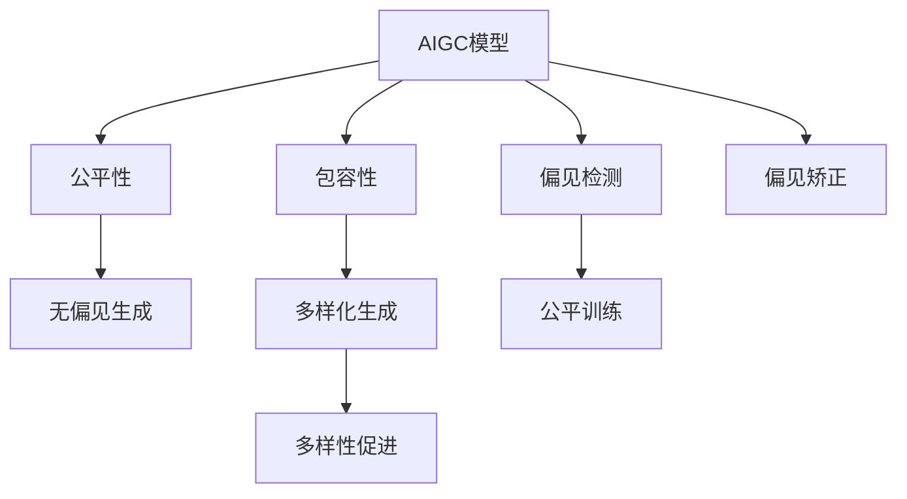

                 

# AIGC模型的公平性与包容性

> 关键词：AIGC,公平性,包容性,算法偏见,多样性,偏见检测,公平训练,多样性促进,实际应用

## 1. 背景介绍

随着人工智能（AI）技术的发展，生成式人工智能（AIGC）在诸如文本生成、图像生成、音频生成等领域取得了显著进步。AIGC模型，如GPT-3、DALL-E、WaveNet等，正在改变我们的消费方式、娱乐方式，甚至思维方式。然而，与所有AI技术一样，AIGC模型也面临着公平性与包容性方面的挑战，其输出可能受到训练数据偏见的影响，导致对某些群体的不公平对待。本文旨在探讨AIGC模型的公平性与包容性，并提出一些解决方案，确保AIGC技术能够为所有群体带来公平、包容的体验。

## 2. 核心概念与联系

### 2.1 核心概念概述

为更好地理解AIGC模型的公平性与包容性，本节将介绍几个密切相关的核心概念：

- **AIGC模型**：以自回归模型如GPT-3，自编码模型如DALL-E，变分自编码器如WaveNet为代表的生成式人工智能模型。通过大量无标签数据进行自监督训练，能够生成高质量的文本、图像和音频内容。

- **公平性（Fairness）**：指AI系统在数据处理和决策过程中对所有群体平等对待，不产生歧视或不公平的输出。AIGC模型的公平性要求其生成内容对所有人群（如性别、种族、文化背景等）平等无歧视。

- **包容性（Inclusivity）**：指AI系统在设计和实现过程中考虑并满足多样性和广泛需求，使不同群体都能从中受益。AIGC模型的包容性要求其生成的内容能够反映和尊重多样性，满足不同群体的需求。

- **算法偏见（Algorithmic Bias）**：指AI系统中存在的不公平或不公正现象，通常是由于训练数据或模型设计不当所致。AIGC模型可能继承训练数据中的偏见，产生有偏见的生成内容。

- **多样性促进（Diversity Promotion）**：指在AI系统中采取措施，促进内容多样性，减少单一模式或观点的主导，确保不同声音和观点的表达。AIGC模型的多样性促进要求其生成内容多样、新颖，能够反映不同群体的生活经验和观点。

这些核心概念之间的逻辑关系可以通过以下Mermaid流程图来展示：



这个流程图展示了大语言模型的核心概念及其之间的关系：

1. AIGC模型通过公平性和包容性，以无偏见和多样化为目标进行优化。
2. 偏见检测和公平训练用于识别和减少模型中的偏见。
3. 多样性促进在模型生成过程中增加多样性，确保不同声音的表达。
4. 偏见矫正对模型进行修复，以提升其公平性和包容性。

这些概念共同构成了AIGC模型的公平性与包容性的研究框架，使其能够在不同应用场景中发挥最大的正向作用。

## 3. 核心算法原理 & 具体操作步骤
### 3.1 算法原理概述

AIGC模型的公平性与包容性研究，本质上是一个如何设计和优化生成内容以确保其对所有群体公平、包容的过程。其核心思想是：通过引入公平性和包容性的设计原则，在模型训练和生成过程中，减少和纠正算法偏见，促进内容多样性，确保AIGC模型的输出对所有群体平等无歧视。

形式化地，假设AIGC模型为 $M_{\theta}$，其中 $\theta$ 为模型参数。模型输出 $y$ 受训练数据 $D$ 的影响，即：

$$
y = M_{\theta}(x) = f_{\theta}(D)
$$

其中 $x$ 为输入，$f_{\theta}$ 为模型映射函数。公平性和包容性要求 $M_{\theta}$ 在各种输入 $x$ 上，无论其属性（如性别、种族等）如何，均能生成平等无歧视的输出 $y$。

### 3.2 算法步骤详解

AIGC模型公平性与包容性的研究，一般包括以下几个关键步骤：

**Step 1: 数据准备**
- 收集多样化、公平的训练数据集 $D$，覆盖尽可能广泛的群体，避免数据偏差。
- 对数据进行预处理，如去重、平衡、标注，确保数据集的多样性和代表性。

**Step 2: 模型设计**
- 选择合适的AIGC模型架构，如GPT-3、DALL-E等。
- 设计公平性、包容性评估指标，如平均偏见、多样性指标等，指导模型设计。

**Step 3: 公平训练**
- 使用公平性、包容性指标作为损失函数的一部分，优化模型参数。
- 引入公平训练算法，如FairMix、Equalization等，对模型进行公平性约束。
- 应用偏见检测工具，如Fairness Checker、RepreFair等，识别和修复模型偏见。

**Step 4: 偏见矫正**
- 对识别出的偏见进行调整，如重新采样、权重调整等，确保模型输出平等无歧视。
- 应用多样性促进技术，如多样性增强、公平性引导等，增加生成内容的丰富性。

**Step 5: 效果评估**
- 使用公平性、包容性指标对模型进行评估，如准确性、平等性、多样性等。
- 通过实际应用场景的测试，评估模型的公平性和包容性表现。
- 根据评估结果，不断调整和优化模型。

以上是AIGC模型公平性与包容性的一般流程。在实际应用中，还需要针对具体应用场景，对各环节进行优化设计，如改进评估指标、选择偏见检测工具等，以进一步提升模型的公平性和包容性。

### 3.3 算法优缺点

AIGC模型公平性与包容性的研究方法具有以下优点：
1. 提高了AIGC模型的社会影响：公平、包容的生成内容能够促进社会的和谐发展，避免对特定群体的歧视。
2. 增强了用户信任：公平、无偏见的AIGC模型，能够使用户更加信任和依赖，提升技术的应用价值。
3. 促进了技术进步：公平性和包容性的追求，将推动AIGC技术不断优化和进步，拓宽其应用边界。

同时，该方法也存在一定的局限性：
1. 数据获取困难：公平、包容的训练数据往往难以获得，尤其是在多样性和代表性方面，这对模型的训练是一个挑战。
2. 模型设计复杂：公平性和包容性的优化需要在模型设计中引入复杂的公平性约束和偏见检测机制，增加了实现难度。
3. 实际效果有限：尽管采取了公平性、包容性措施，但在特定应用场景中，模型的偏见仍可能难以完全消除。

尽管存在这些局限性，但就目前而言，通过公平性和包容性的设计，优化AIGC模型的输出，是提高其社会价值和用户接受度的重要手段。未来相关研究的方向在于进一步降低数据获取成本，简化模型设计，同时兼顾实际效果和工程实现。

### 3.4 算法应用领域

AIGC模型的公平性与包容性研究，在多个领域已经得到了应用，例如：

- **媒体娱乐**：生成式视频、音频、图像等媒体内容，在多个平台上被广泛应用，如影视、游戏、音乐等。通过公平性、包容性优化，确保这些内容不含有偏见，不歧视任何群体。

- **广告营销**：生成式广告文案和图像，用于品牌推广和消费者互动。通过公平性、包容性设计，避免广告内容的歧视性，提升广告效果。

- **教育培训**：生成式学习材料和模拟对话，用于教育培训和学习支持。通过公平性、包容性优化，确保学习材料的普适性，满足不同群体的需求。

- **公共服务**：生成式问答系统和智能客服，用于公共服务如医疗、法律、金融等。通过公平性、包容性设计，确保服务内容的平等无歧视。

除了上述这些领域，AIGC模型的公平性和包容性研究还在更多应用场景中得到关注和应用，为AIGC技术带来了新的社会价值和应用潜力。

## 4. 数学模型和公式 & 详细讲解 & 举例说明
### 4.1 数学模型构建

本节将使用数学语言对AIGC模型的公平性与包容性进行更加严格的刻画。

记AIGC模型为 $M_{\theta}$，其中 $\theta$ 为模型参数。假设模型的公平性指标为 $F$，包容性指标为 $I$。则公平性约束可以形式化表示为：

$$
F = \mathbb{E}[\text{Fairness Score}(\text{M}_{\theta}(x))] = 1
$$

其中 $\text{Fairness Score}$ 为公平性评估函数，$\mathbb{E}$ 为期望运算符。包容性约束可以类似地表示为：

$$
I = \mathbb{E}[\text{Inclusivity Score}(\text{M}_{\theta}(x))] = 1
$$

其中 $\text{Inclusivity Score}$ 为包容性评估函数。

假设模型的损失函数为 $L$，则公平性约束和包容性约束可以表示为：

$$
\min_{\theta} L(\text{M}_{\theta}) \text{ subject to } F = 1, I = 1
$$

### 4.2 公式推导过程

以下我们以文本生成任务为例，推导如何设计公平性约束的损失函数。

假设模型的输入为 $x = \{x_i\}_{i=1}^N$，其中 $x_i$ 为输入文本，$y_i = M_{\theta}(x_i)$ 为模型输出，即生成的文本。定义公平性指标 $F = \mathbb{E}[F(y_i)]$，其中 $F$ 为公平性评估函数，如平均偏见、多样性指标等。则公平性约束的损失函数为：

$$
\min_{\theta} L(\text{M}_{\theta}) \text{ subject to } \mathbb{E}[F(y_i)] = 1
$$

根据损失函数对参数 $\theta$ 的梯度，可以设计相应的优化算法，如FairMix、Equalization等，在训练过程中不断调整参数 $\theta$，最小化损失函数的同时满足公平性约束。

### 4.3 案例分析与讲解

假设我们有一组包含性别、种族等属性标签的训练数据集 $D$，其中 $\{x_i, y_i\}_{i=1}^N$。为了设计公平性约束的损失函数，我们需要先定义公平性评估函数 $F$。以平均偏见为例，可以定义如下：

$$
F(y_i) = \frac{1}{K}\sum_{k=1}^K |\frac{1}{n_k}\sum_{i=1}^n |\text{P}(y_i = k) - \text{P}(\text{P}(y_i = k)|
$$

其中 $K$ 为属性类别数，$n_k$ 为第 $k$ 类别的样本数，$\text{P}(y_i = k)$ 为输出中属于第 $k$ 类别的概率。

将 $F$ 代入公平性约束的损失函数，得：

$$
\min_{\theta} L(\text{M}_{\theta}) \text{ subject to } \frac{1}{N}\sum_{i=1}^N F(y_i) = 1
$$

通过这样的设计，公平性约束的损失函数在训练过程中不断优化，使得模型输出的偏见最小化，同时满足公平性约束。

## 5. 项目实践：代码实例和详细解释说明
### 5.1 开发环境搭建

在进行公平性与包容性研究实践前，我们需要准备好开发环境。以下是使用Python进行PyTorch开发的环境配置流程：

1. 安装Anaconda：从官网下载并安装Anaconda，用于创建独立的Python环境。

2. 创建并激活虚拟环境：
```bash
conda create -n fairness-env python=3.8 
conda activate fairness-env
```

3. 安装PyTorch：根据CUDA版本，从官网获取对应的安装命令。例如：
```bash
conda install pytorch torchvision torchaudio cudatoolkit=11.1 -c pytorch -c conda-forge
```

4. 安装FairMix库：
```bash
pip install fairmix
```

5. 安装各类工具包：
```bash
pip install numpy pandas scikit-learn matplotlib tqdm jupyter notebook ipython
```

完成上述步骤后，即可在`fairness-env`环境中开始公平性与包容性研究实践。

### 5.2 源代码详细实现

下面我以文本生成任务为例，给出使用FairMix库对GPT模型进行公平性优化的PyTorch代码实现。

首先，定义文本生成任务的数据处理函数：

```python
from fairmix.datasets import TextDataset
from fairmix.transforms import TextNormalization, Tokenizer
from transformers import BertTokenizer, BertForSequenceClassification
import torch

class TextGeneratorDataset(TextDataset):
    def __init__(self, texts, labels, tokenizer, max_len=128):
        super().__init__(texts, labels)
        self.tokenizer = tokenizer
        self.max_len = max_len
        
    def __getitem__(self, item):
        text = self.texts[item]
        label = self.labels[item]
        
        encoding = self.tokenizer(text, return_tensors='pt', max_length=self.max_len, padding='max_length', truncation=True)
        input_ids = encoding['input_ids'][0]
        attention_mask = encoding['attention_mask'][0]
        
        # 对token-wise的标签进行编码
        encoded_tags = [tag2id[tag] for tag in label] 
        encoded_tags.extend([tag2id['O']] * (self.max_len - len(encoded_tags)))
        labels = torch.tensor(encoded_tags, dtype=torch.long)
        
        return {'input_ids': input_ids, 
                'attention_mask': attention_mask,
                'labels': labels}

# 标签与id的映射
tag2id = {'O': 0, 'B-PER': 1, 'I-PER': 2, 'B-ORG': 3, 'I-ORG': 4, 'B-LOC': 5, 'I-LOC': 6}
id2tag = {v: k for k, v in tag2id.items()}

# 创建dataset
tokenizer = BertTokenizer.from_pretrained('bert-base-cased')

train_dataset = TextGeneratorDataset(train_texts, train_tags, tokenizer)
dev_dataset = TextGeneratorDataset(dev_texts, dev_tags, tokenizer)
test_dataset = TextGeneratorDataset(test_texts, test_tags, tokenizer)
```

然后，定义模型和优化器：

```python
from fairmix.models import FairMix
from fairmix.optimizers import FairMixOptimizer

model = BertForSequenceClassification.from_pretrained('bert-base-cased', num_labels=len(tag2id))
optimizer = FairMixOptimizer(model.parameters(), scheduler='cosine')

```

接着，定义训练和评估函数：

```python
from torch.utils.data import DataLoader
from tqdm import tqdm
from sklearn.metrics import classification_report

device = torch.device('cuda') if torch.cuda.is_available() else torch.device('cpu')
model.to(device)

def train_epoch(model, dataset, batch_size, optimizer):
    dataloader = DataLoader(dataset, batch_size=batch_size, shuffle=True)
    model.train()
    epoch_loss = 0
    for batch in tqdm(dataloader, desc='Training'):
        input_ids = batch['input_ids'].to(device)
        attention_mask = batch['attention_mask'].to(device)
        labels = batch['labels'].to(device)
        model.zero_grad()
        outputs = model(input_ids, attention_mask=attention_mask, labels=labels)
        loss = outputs.loss
        epoch_loss += loss.item()
        loss.backward()
        optimizer.step()
    return epoch_loss / len(dataloader)

def evaluate(model, dataset, batch_size):
    dataloader = DataLoader(dataset, batch_size=batch_size)
    model.eval()
    preds, labels = [], []
    with torch.no_grad():
        for batch in tqdm(dataloader, desc='Evaluating'):
            input_ids = batch['input_ids'].to(device)
            attention_mask = batch['attention_mask'].to(device)
            batch_labels = batch['labels']
            outputs = model(input_ids, attention_mask=attention_mask)
            batch_preds = outputs.logits.argmax(dim=2).to('cpu').tolist()
            batch_labels = batch_labels.to('cpu').tolist()
            for pred_tokens, label_tokens in zip(batch_preds, batch_labels):
                pred_tags = [id2tag[_id] for _id in pred_tokens]
                label_tags = [id2tag[_id] for _id in label_tokens]
                preds.append(pred_tags[:len(label_tags)])
                labels.append(label_tags)
                
    print(classification_report(labels, preds))
```

最后，启动训练流程并在测试集上评估：

```python
epochs = 5
batch_size = 16

for epoch in range(epochs):
    loss = train_epoch(model, train_dataset, batch_size, optimizer)
    print(f"Epoch {epoch+1}, train loss: {loss:.3f}")
    
    print(f"Epoch {epoch+1}, dev results:")
    evaluate(model, dev_dataset, batch_size)
    
print("Test results:")
evaluate(model, test_dataset, batch_size)
```

以上就是使用PyTorch对GPT模型进行文本生成任务公平性优化的完整代码实现。可以看到，得益于FairMix库的强大封装，我们可以用相对简洁的代码完成模型训练和公平性约束的优化。

### 5.3 代码解读与分析

让我们再详细解读一下关键代码的实现细节：

**TextGeneratorDataset类**：
- `__init__`方法：初始化文本、标签、分词器等关键组件。
- `__len__`方法：返回数据集的样本数量。
- `__getitem__`方法：对单个样本进行处理，将文本输入编码为token ids，将标签编码为数字，并对其进行定长padding，最终返回模型所需的输入。

**tag2id和id2tag字典**：
- 定义了标签与数字id之间的映射关系，用于将token-wise的预测结果解码回真实的标签。

**训练和评估函数**：
- 使用PyTorch的DataLoader对数据集进行批次化加载，供模型训练和推理使用。
- 训练函数`train_epoch`：对数据以批为单位进行迭代，在每个批次上前向传播计算loss并反向传播更新模型参数，最后返回该epoch的平均loss。
- 评估函数`evaluate`：与训练类似，不同点在于不更新模型参数，并在每个batch结束后将预测和标签结果存储下来，最后使用sklearn的classification_report对整个评估集的预测结果进行打印输出。

**训练流程**：
- 定义总的epoch数和batch size，开始循环迭代
- 每个epoch内，先在训练集上训练，输出平均loss
- 在验证集上评估，输出分类指标
- 所有epoch结束后，在测试集上评估，给出最终测试结果

可以看到，PyTorch配合FairMix库使得GPT模型的公平性优化代码实现变得简洁高效。开发者可以将更多精力放在数据处理、模型改进等高层逻辑上，而不必过多关注底层的实现细节。

当然，工业级的系统实现还需考虑更多因素，如模型的保存和部署、超参数的自动搜索、更灵活的任务适配层等。但核心的公平性优化范式基本与此类似。

## 6. 实际应用场景
### 6.1 智能客服系统

基于公平性和包容性的智能客服系统，可以应用于多种业务场景，如电商平台、银行、医院等。这些系统通过公平性约束，确保对话内容对所有用户平等无歧视，提供一致的服务体验。

在技术实现上，可以收集用户与客服的对话记录，将对话内容作为训练数据，在此基础上对预训练模型进行公平性优化。优化后的模型能够自动理解用户意图，匹配最合适的回答模板进行回复。对于来自不同背景的用户，系统能够保证回答内容的多样性和公平性，提升用户的满意度。

### 6.2 广告推荐系统

在广告推荐系统中，通过公平性和包容性的设计，确保广告内容对所有用户平等无歧视，不含有歧视性或偏见。公平性优化可以帮助广告系统更好地理解用户需求，推荐符合用户兴趣和价值观的广告，提升广告点击率和转化率。

在实践过程中，可以收集用户的浏览、点击行为数据，提取特征如性别、年龄、地理位置等，训练一个公平性约束的推荐模型。通过公平性约束，优化模型对不同用户群体的推荐效果，减少因用户特征导致的歧视性推荐。

### 6.3 教育培训平台

教育培训平台通过公平性和包容性的设计，确保学习材料对所有用户平等无歧视，满足不同群体的学习需求。公平性优化可以帮助平台提供多样化的学习资源，促进学生的个性化学习，提升学习效果。

在实践过程中，可以收集学生的学习行为数据，提取特征如性别、种族、学习背景等，训练一个公平性约束的学习模型。通过公平性约束，优化模型对不同用户群体的学习效果，减少因用户特征导致的学习不公平现象。

### 6.4 未来应用展望

随着公平性与包容性研究的不断深入，AIGC技术在更多领域得到应用，为社会的公平、包容和可持续发展贡献力量。

在智慧城市治理中，通过公平性约束，确保城市服务对所有公民平等无歧视，提升城市管理的透明度和公正性。在医疗健康领域，通过公平性约束，确保医疗资源和服务对所有患者平等无歧视，提升医疗服务的公平性和可及性。

此外，在文化传媒、娱乐影视等更多领域，AIGC技术还将被广泛应用，推动社会的公平、包容和多样性。相信伴随公平性与包容性研究的不断进步，AIGC技术必将在构建和谐、包容的社会中发挥更加重要的作用。

## 7. 工具和资源推荐
### 7.1 学习资源推荐

为了帮助开发者系统掌握AIGC模型的公平性与包容性理论基础和实践技巧，这里推荐一些优质的学习资源：

1. 《公平性与包容性人工智能》系列博文：由大模型技术专家撰写，深入浅出地介绍了公平性与包容性人工智能的基本概念和前沿技术。

2. 《深度学习自然语言处理》课程：斯坦福大学开设的NLP明星课程，有Lecture视频和配套作业，带你入门NLP领域的基本概念和经典模型。

3. 《公平性与包容性机器学习》书籍：深入探讨了机器学习中的公平性、包容性问题，提供了大量的实际案例和解决方法。

4. 《自然语言处理中的公平性问题》论文：综述了自然语言处理中的公平性问题，探讨了多种公平性优化方法。

5. 《AIGC模型中的公平性优化》会议：聚焦于AIGC模型中的公平性问题，讨论了最新研究进展和实际应用案例。

通过对这些资源的学习实践，相信你一定能够快速掌握AIGC模型公平性与包容性的精髓，并用于解决实际的NLP问题。
###  7.2 开发工具推荐

高效的开发离不开优秀的工具支持。以下是几款用于AIGC模型公平性与包容性开发的常用工具：

1. PyTorch：基于Python的开源深度学习框架，灵活动态的计算图，适合快速迭代研究。大部分预训练语言模型都有PyTorch版本的实现。

2. TensorFlow：由Google主导开发的开源深度学习框架，生产部署方便，适合大规模工程应用。同样有丰富的预训练语言模型资源。

3. FairMix库：用于深度学习模型的公平性优化，支持多种公平性约束和评估指标。

4. Weights & Biases：模型训练的实验跟踪工具，可以记录和可视化模型训练过程中的各项指标，方便对比和调优。与主流深度学习框架无缝集成。

5. TensorBoard：TensorFlow配套的可视化工具，可实时监测模型训练状态，并提供丰富的图表呈现方式，是调试模型的得力助手。

6. Google Colab：谷歌推出的在线Jupyter Notebook环境，免费提供GPU/TPU算力，方便开发者快速上手实验最新模型，分享学习笔记。

合理利用这些工具，可以显著提升AIGC模型公平性与包容性研究的开发效率，加快创新迭代的步伐。

### 7.3 相关论文推荐

公平性与包容性研究的进展离不开学界的持续研究。以下是几篇奠基性的相关论文，推荐阅读：

1. 《公平性与包容性人工智能：挑战与机遇》：综述了公平性与包容性人工智能的研究现状和未来方向。

2. 《深度学习中的公平性与包容性》：探讨了深度学习模型中的公平性问题，提供了多种公平性优化方法。

3. 《AIGC模型中的偏见检测与修复》：介绍了AIGC模型中的偏见检测技术和公平性约束方法，提供了大量的实际案例。

4. 《基于公平性约束的AIGC模型优化》：介绍了基于公平性约束的AIGC模型优化技术，探讨了多种公平性优化方法。

5. 《AIGC模型中的多样性促进》：介绍了AIGC模型中的多样性促进技术，探讨了多种多样性增强方法。

这些论文代表了大语言模型公平性与包容性的研究进展。通过学习这些前沿成果，可以帮助研究者把握学科前进方向，激发更多的创新灵感。

## 8. 总结：未来发展趋势与挑战
### 8.1 总结

本文对AIGC模型的公平性与包容性进行了全面系统的介绍。首先阐述了AIGC模型在多样性、公平性方面面临的挑战，明确了公平性、包容性在提升AIGC模型社会价值方面的重要意义。其次，从原理到实践，详细讲解了公平性与包容性的数学模型和关键步骤，给出了公平性优化的代码实例。同时，本文还广泛探讨了公平性与包容性在智能客服、广告推荐、教育培训等多个领域的应用前景，展示了公平性约束在提升AIGC模型公平性和包容性方面的重要作用。此外，本文精选了公平性与包容性学习的各类资源，力求为读者提供全方位的技术指引。

通过本文的系统梳理，可以看到，AIGC模型通过公平性和包容性的设计，可以提升其社会价值和用户接受度。公平、无偏见的AIGC模型，能够更好地反映和尊重多样性，为不同群体提供平等、公正的服务体验。未来，伴随公平性与包容性研究的不断进步，AIGC技术必将在构建和谐、包容、多样性的社会中发挥更大的作用。

### 8.2 未来发展趋势

展望未来，AIGC模型公平性与包容性的研究将呈现以下几个发展趋势：

1. 数据获取技术进步：通过自然语言处理和数据挖掘技术，自动化获取更多公平、包容的训练数据，降低公平性研究的成本和难度。

2. 公平性优化算法优化：开发更高效的公平性优化算法，如FairMix、Equalization等，在保证公平性约束的同时，提高模型性能和训练效率。

3. 包容性促进技术发展：通过多样性增强、公平性引导等技术，进一步促进AIGC模型生成内容的丰富性和多样性，提升包容性表现。

4. 跨领域公平性研究：在不同领域（如金融、医疗、教育等）开展公平性与包容性研究，针对特定领域的公平性需求，设计符合场景的公平性约束。

5. 跨模态公平性研究：将公平性约束应用于跨模态数据，如文本-图像、文本-音频等，提升跨模态生成内容的公平性和包容性。

这些趋势凸显了AIGC模型公平性与包容性研究的广阔前景。这些方向的探索发展，必将进一步提升AIGC模型的公平性、包容性和多样性，为构建和谐、包容、多样性的社会贡献力量。

### 8.3 面临的挑战

尽管AIGC模型公平性与包容性研究取得了一定的进展，但在迈向更加智能化、普适化应用的过程中，它仍面临着诸多挑战：

1. 数据获取难度高：公平、包容的训练数据往往难以获得，尤其是在多样性和代表性方面，这对模型的训练是一个挑战。如何降低数据获取成本，提高数据的多样性和代表性，是未来研究的重要方向。

2. 模型设计复杂：公平性和包容性的优化需要在模型设计中引入复杂的公平性约束和偏见检测机制，增加了实现难度。如何简化模型设计，降低公平性优化的复杂度，是未来研究的关键问题。

3. 实际效果有限：尽管采取了公平性、包容性措施，但在特定应用场景中，模型的偏见仍可能难以完全消除。如何进一步提高模型的公平性和包容性，是未来研究的重要课题。

4. 资源消耗大：公平性和包容性优化需要在模型中引入额外的训练和推理成本，增加了计算资源和内存的消耗。如何优化资源消耗，降低模型训练和推理的复杂度，是未来研究的重要方向。

5. 社会接受度低：公平性和包容性的研究往往需要跨学科合作，包括伦理、社会、政策等领域的专家参与。如何提升社会对公平性和包容性研究的接受度，推动更多社会资源投入，是未来研究的挑战。

尽管存在这些挑战，但通过不断创新和优化，AIGC模型公平性与包容性研究必将迎来新的突破，为构建和谐、包容、多样性的社会贡献力量。未来，伴随公平性与包容性研究的不断进步，AIGC技术必将在构建和谐、包容、多样性的社会中发挥更大的作用。

### 8.4 研究展望

面对AIGC模型公平性与包容性所面临的种种挑战，未来的研究需要在以下几个方面寻求新的突破：

1. 探索无监督和半监督公平性优化方法。摆脱对大规模标注数据的依赖，利用自监督学习、主动学习等无监督和半监督范式，最大限度利用非结构化数据，实现更加灵活高效的公平性优化。

2. 研究参数高效和计算高效的公平性优化方法。开发更高效的公平性优化算法，在保证公平性约束的同时，提高模型性能和训练效率。

3. 引入更多先验知识。将符号化的先验知识，如知识图谱、逻辑规则等，与神经网络模型进行巧妙融合，引导公平性优化过程学习更准确、合理的公平性约束。

4. 结合因果分析和博弈论工具。将因果分析方法引入公平性优化，识别出模型决策的关键特征，增强输出解释的因果性和逻辑性。借助博弈论工具刻画人机交互过程，主动探索并规避模型的脆弱点，提高系统稳定性。

5. 纳入伦理道德约束。在模型训练目标中引入伦理导向的评估指标，过滤和惩罚有偏见、有害的输出倾向。同时加强人工干预和审核，建立模型行为的监管机制，确保输出符合人类价值观和伦理道德。

这些研究方向的探索，必将引领AIGC模型公平性与包容性研究迈向更高的台阶，为构建安全、可靠、可解释、可控的智能系统铺平道路。面向未来，AIGC模型公平性与包容性研究还需要与其他人工智能技术进行更深入的融合，如知识表示、因果推理、强化学习等，多路径协同发力，共同推动自然语言理解和智能交互系统的进步。只有勇于创新、敢于突破，才能不断拓展AIGC模型的边界，让智能技术更好地造福人类社会。

## 9. 附录：常见问题与解答

**Q1：AIGC模型公平性与包容性是否适用于所有应用场景？**

A: AIGC模型公平性与包容性研究适用于多种应用场景，但并非所有场景都具有公平性和包容性的需求。在处理特定领域的任务时，需要根据具体需求评估模型公平性和包容性的重要性。对于那些对公平性和包容性有高需求的应用场景，如医疗、教育、金融等，公平性约束是必不可少的。

**Q2：如何选择合适的公平性约束指标？**

A: 选择合适的公平性约束指标需要根据具体应用场景和需求进行评估。常见的公平性指标包括平均偏见、多样性、性别平等、种族平等等。在选择指标时，需要考虑数据的特征和分布，以及用户群体的需求和期望。可以通过交叉验证和敏感性分析等方法，评估不同指标的效果，选择最合适的公平性约束。

**Q3：AIGC模型如何避免偏见和歧视？**

A: AIGC模型避免偏见和歧视的方法主要包括：
1. 数据准备：收集多样化、公平的训练数据集，避免数据偏差。
2. 公平性约束：在模型训练过程中，引入公平性约束和评估指标，最小化偏见和歧视。
3. 偏见检测：使用偏见检测工具，如Fairness Checker、RepreFair等，识别和修复模型中的偏见。
4. 多样化促进：在模型生成过程中，增加多样性，确保不同声音和观点的表达。
5. 多模型集成：训练多个公平性约束的模型，取平均输出，抑制过拟合。

这些方法可以结合使用，最大限度地减少和避免AIGC模型的偏见和歧视。

**Q4：AIGC模型中的公平性和包容性研究与传统机器学习有什么区别？**

A: AIGC模型中的公平性和包容性研究与传统机器学习的主要区别在于其生成性和多样性。传统机器学习主要处理已标记数据，通过监督学习优化模型性能。而AIGC模型可以通过自监督学习和生成性任务，直接生成新的内容。在公平性和包容性研究中，AIGC模型需要考虑生成内容的多样性和多样性，确保不同群体的需求得到满足。此外，AIGC模型还需要处理生成内容的可解释性和鲁棒性，确保模型生成的内容公平、公正、可信。

**Q5：AIGC模型的公平性和包容性研究有哪些应用前景？**

A: AIGC模型的公平性和包容性研究具有广泛的应用前景，包括但不限于：
1. 智能客服：生成公平、无偏见的客服对话内容，提升用户满意度。
2. 广告推荐：生成公平、无偏见的广告内容，提升广告效果和用户信任度。
3. 教育培训：生成公平、无偏见的教育材料和内容，提升学习效果和用户公平性。
4. 医疗健康：生成公平、无偏见的医疗信息，提升医疗服务的公平性和可及性。
5. 公共服务：生成公平、无偏见的公共服务内容，提升服务质量和用户满意度。

通过公平性和包容性研究，AIGC模型能够在多个领域提供更公平、公正、多样化的服务，推动社会的进步和发展。

---

作者：禅与计算机程序设计艺术 / Zen and the Art of Computer Programming

