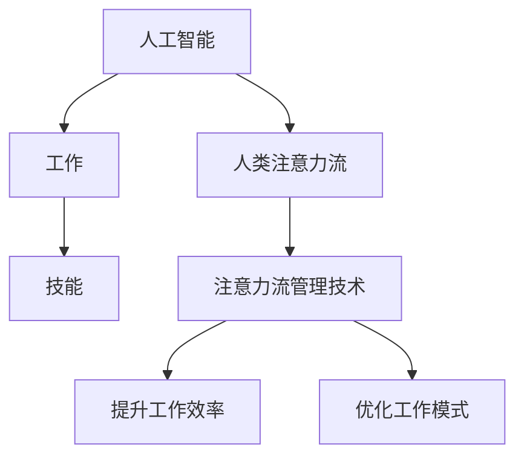

                 

# AI与人类注意力流：未来的工作、技能与注意力流管理技术的应用前景展望趋势分析

> 关键词：人工智能,人类注意力流,工作,技能,注意力流管理技术,应用前景,发展趋势,挑战

## 1. 背景介绍

### 1.1 问题由来

在数字时代，人工智能(AI)技术的快速发展已经深刻改变了我们的工作方式和生活习惯。从自动驾驶汽车到智能家居系统，从智能客服到个性化推荐，AI的应用无处不在。然而，随着AI技术的广泛应用，人类在享受技术便利的同时，也面临着新的挑战，尤其是在工作与注意力流管理方面。

近年来，人工智能与人类注意力流之间的相互作用成为研究热点。如何更好地管理人类注意力流，以适应快速变化的工作环境，已经成为一项重要的研究课题。特别是在自动化、智能化水平不断提升的背景下，如何平衡人类与机器的协同工作，使得人类能够更好地发挥自身的优势，是一个亟待解决的问题。

### 1.2 问题核心关键点

当前，AI与人类注意力流管理的研究主要围绕以下几个核心关键点展开：

- **注意力流管理技术**：如何通过技术手段，更好地理解和控制人类注意力流，提升工作效率和质量。
- **人工智能与人类的协同工作**：在自动化、智能化程度不断提升的背景下，人类与机器的协同工作机制如何优化。
- **工作与学习的新技能**：随着AI技术的发展，人类需要掌握哪些新技能，以适应新环境。
- **未来工作模式**：AI技术如何重塑未来的工作模式，包括工作场所、工作内容、工作关系等。

## 2. 核心概念与联系

### 2.1 核心概念概述

为更好地理解AI与人类注意力流之间的关系，本节将介绍几个关键概念：

- **人工智能**：一种模拟人类智能的技术，涵盖机器学习、深度学习、自然语言处理等领域。
- **人类注意力流**：人类在处理信息、解决问题时的注意力集中和分散的过程。
- **工作**：人类在组织或企业中从事的有意义的活动。
- **技能**：人类在特定任务或活动中所需的能力和知识。
- **注意力流管理技术**：通过技术手段，优化人类注意力流，提高工作效率和质量的技术。

这些核心概念之间的逻辑关系可以通过以下Mermaid流程图来展示：



这个流程图展示了大规模语言模型的工作原理和优化方向：

1. 人工智能通过处理大规模数据，学习到复杂的行为模式，模拟人类智能。
2. 人类注意力流在处理信息时，会受到AI的影响，形成新的工作模式。
3. 技能是应对新环境、新技术所必须掌握的能力和知识。
4. 注意力流管理技术旨在提升工作效率，优化工作模式。

这些概念共同构成了AI与人类注意力流之间的相互关系，使得AI技术能够在实际应用中更好地服务于人类，提升工作效率和生活质量。

## 3. 核心算法原理 & 具体操作步骤
### 3.1 算法原理概述

人工智能与人类注意力流管理技术的核心算法原理主要围绕以下几个方面展开：

- **强化学习**：通过试错的方式，学习最优策略以最大化特定目标函数。在人类注意力流管理中，可以通过强化学习算法，学习如何在不同的任务和环境中优化注意力分配。
- **自然语言处理(NLP)**：利用语言模型、文本分类、实体识别等技术，理解和生成自然语言文本。在注意力流管理中，NLP技术可以帮助理解和分析人类注意力流中的语言信息。
- **机器学习与深度学习**：通过训练模型，从数据中学习规律和模式。在注意力流管理中，可以通过机器学习和深度学习模型，识别和预测注意力流的状态和变化趋势。
- **行为分析**：利用行为数据，分析人类在特定任务和环境中的行为模式。在注意力流管理中，可以通过行为分析技术，了解人类在注意力集中和分散时的行为特征。

这些算法原理共同构成了AI与人类注意力流管理的技术基础，使其能够在实际应用中发挥作用。

### 3.2 算法步骤详解

AI与人类注意力流管理技术的具体操作步骤包括以下几个关键步骤：

**Step 1: 数据收集与预处理**
- 收集人类在特定任务和环境中的注意力流数据，包括注意力分布、聚焦时长、分心原因等。
- 对数据进行清洗、标注，去除噪音和异常值。

**Step 2: 模型训练与优化**
- 根据收集的数据，选择合适的算法（如强化学习、NLP、机器学习等）进行模型训练。
- 通过交叉验证、超参数调优等方法，提升模型性能。

**Step 3: 模型应用与评估**
- 将训练好的模型应用于实际场景，监测注意力流状态和变化趋势。
- 通过多种评估指标（如工作效率、任务完成率、用户满意度等）评估模型效果。

**Step 4: 持续学习与优化**
- 根据模型在实际应用中的表现，持续收集反馈数据，进行模型更新和优化。
- 定期进行模型再训练，以适应新的工作环境和任务要求。

### 3.3 算法优缺点

人工智能与人类注意力流管理技术的算法具有以下优点：

- **提升工作效率**：通过优化注意力流，使得人类能够更高效地处理信息和解决问题。
- **适应性强**：能够适应不同的工作环境和任务需求，灵活调整注意力流管理策略。
- **数据驱动**：基于数据和模型，科学地优化注意力流，避免主观偏见。

同时，该算法也存在一些局限性：

- **数据依赖**：需要收集大量高质量的注意力流数据，数据获取成本较高。
- **算法复杂**：涉及多个领域的算法和技术，算法实现较为复杂。
- **效果依赖模型**：模型的性能直接影响到注意力流管理的效果，模型训练难度较大。

尽管存在这些局限性，但就目前而言，基于AI与人类注意力流管理技术的算法仍是目前最主流的方法。未来相关研究的重点在于如何进一步降低数据依赖，提高模型的可解释性和适应性，同时兼顾计算效率和算法复杂度。

### 3.4 算法应用领域

AI与人类注意力流管理技术的算法已经在多个领域得到了应用，包括但不限于：

- **智能办公系统**：利用AI技术，分析员工在工作中的注意力流状态，自动调整工作负荷和任务分配，提高工作效率。
- **在线教育平台**：通过分析学生在学习过程中的注意力流数据，优化教学内容和方式，提升学习效果。
- **远程协作工具**：在远程工作环境中，通过AI技术监测团队成员的注意力流状态，优化协作模式，提高团队沟通效率。
- **医疗健康应用**：分析患者在诊疗过程中的注意力流数据，优化诊疗流程，提高医疗服务质量。

除了上述这些经典应用外，AI与人类注意力流管理技术还在越来越多的领域中得到创新应用，如智能家居、金融理财、城市管理等，为各行各业带来新的技术突破和价值提升。

## 4. 数学模型和公式 & 详细讲解  
### 4.1 数学模型构建

本节将使用数学语言对AI与人类注意力流管理的数学模型进行更加严格的刻画。

记人类在任务$T$中的注意力流数据为$\mathcal{D}_T=\{(\mathbf{x}_i, \mathbf{y}_i)\}_{i=1}^N$，其中$\mathbf{x}_i$表示第$i$个注意力流数据样本，$\mathbf{y}_i$表示样本对应的注意力状态标签。假设模型为$f: \mathcal{X} \rightarrow \mathcal{Y}$，其中$\mathcal{X}$为输入空间，$\mathcal{Y}$为输出空间。

定义注意力流状态为$S=\{s_1, s_2, \ldots, s_n\}$，其中$s_i$表示第$i$个注意力状态。模型的目标是最大化任务$T$在注意力状态$S$下的效率，即：

$$
\max_{f} \frac{1}{N} \sum_{i=1}^N \mathcal{L}(f(\mathbf{x}_i), \mathbf{y}_i)
$$

其中$\mathcal{L}$为注意力流状态$S$下任务$T$的损失函数，用于衡量模型预测输出与真实标签之间的差异。

### 4.2 公式推导过程

以下我们以二分类任务为例，推导注意力流状态下的分类损失函数及其梯度的计算公式。

假设模型$f$在输入$\mathbf{x}$上的输出为$\hat{y}=f(\mathbf{x}) \in [0,1]$，表示样本属于正类的概率。真实标签$\mathbf{y} \in \{0,1\}$。则二分类交叉熵损失函数定义为：

$$
\mathcal{L}(f(\mathbf{x}),\mathbf{y}) = -[y\log \hat{y} + (1-y)\log (1-\hat{y})]
$$

将其代入注意力流状态下的损失函数公式，得：

$$
\mathcal{L}(\mathbf{y}, f(\mathbf{x}_i)) = -\frac{1}{N}\sum_{i=1}^N \mathcal{L}(f(\mathbf{x}_i), y_i)
$$

根据链式法则，注意力流状态$S$下任务$T$的梯度为：

$$
\frac{\partial \mathcal{L}(\mathbf{y}, f(\mathbf{x}_i))}{\partial f(\mathbf{x}_i)} = -\frac{1}{N}\sum_{i=1}^N (\frac{y_i}{\hat{y}_i}-\frac{1-y_i}{1-\hat{y}_i}) \frac{\partial f(\mathbf{x}_i)}{\partial \mathbf{x}_i}
$$

其中$\frac{\partial f(\mathbf{x}_i)}{\partial \mathbf{x}_i}$可进一步递归展开，利用自动微分技术完成计算。

在得到注意力流状态下的损失函数梯度后，即可带入模型参数更新公式，完成模型的迭代优化。重复上述过程直至收敛，最终得到适应注意力流状态的最优模型参数$f^*$。

## 5. 项目实践：代码实例和详细解释说明
### 5.1 开发环境搭建

在进行注意力流管理技术的项目实践前，我们需要准备好开发环境。以下是使用Python进行PyTorch开发的环境配置流程：

1. 安装Anaconda：从官网下载并安装Anaconda，用于创建独立的Python环境。

2. 创建并激活虚拟环境：
```bash
conda create -n pytorch-env python=3.8 
conda activate pytorch-env
```

3. 安装PyTorch：根据CUDA版本，从官网获取对应的安装命令。例如：
```bash
conda install pytorch torchvision torchaudio cudatoolkit=11.1 -c pytorch -c conda-forge
```

4. 安装TensorFlow：由Google主导开发的开源深度学习框架，生产部署方便，适合大规模工程应用。同样有丰富的预训练语言模型资源。

5. 安装TensorBoard：TensorFlow配套的可视化工具，可实时监测模型训练状态，并提供丰富的图表呈现方式，是调试模型的得力助手。

6. 安装Weights & Biases：模型训练的实验跟踪工具，可以记录和可视化模型训练过程中的各项指标，方便对比和调优。

完成上述步骤后，即可在`pytorch-env`环境中开始注意力流管理技术的实践。

### 5.2 源代码详细实现

下面我们以注意力流状态下的文本分类任务为例，给出使用Transformers库对BERT模型进行注意力流管理技术的PyTorch代码实现。

首先，定义注意力流状态下的数据处理函数：

```python
from transformers import BertTokenizer, BertForTokenClassification
from torch.utils.data import Dataset
import torch

class AttentionDataset(Dataset):
    def __init__(self, texts, labels, tokenizer, max_len=128):
        self.texts = texts
        self.labels = labels
        self.tokenizer = tokenizer
        self.max_len = max_len
        
    def __len__(self):
        return len(self.texts)
    
    def __getitem__(self, item):
        text = self.texts[item]
        labels = self.labels[item]
        
        encoding = self.tokenizer(text, return_tensors='pt', max_length=self.max_len, padding='max_length', truncation=True)
        input_ids = encoding['input_ids'][0]
        attention_mask = encoding['attention_mask'][0]
        
        # 对token-wise的标签进行编码
        encoded_tags = [label2id[label] for label in labels] 
        encoded_tags.extend([label2id['O']] * (self.max_len - len(encoded_tags)))
        labels = torch.tensor(encoded_tags, dtype=torch.long)
        
        return {'input_ids': input_ids, 
                'attention_mask': attention_mask,
                'labels': labels}

# 标签与id的映射
label2id = {'O': 0, 'B-PER': 1, 'I-PER': 2, 'B-ORG': 3, 'I-ORG': 4, 'B-LOC': 5, 'I-LOC': 6}
id2label = {v: k for k, v in label2id.items()}

# 创建dataset
tokenizer = BertTokenizer.from_pretrained('bert-base-cased')

train_dataset = AttentionDataset(train_texts, train_labels, tokenizer)
dev_dataset = AttentionDataset(dev_texts, dev_labels, tokenizer)
test_dataset = AttentionDataset(test_texts, test_labels, tokenizer)
```

然后，定义模型和优化器：

```python
from transformers import BertForTokenClassification, AdamW

model = BertForTokenClassification.from_pretrained('bert-base-cased', num_labels=len(label2id))

optimizer = AdamW(model.parameters(), lr=2e-5)
```

接着，定义训练和评估函数：

```python
from torch.utils.data import DataLoader
from tqdm import tqdm
from sklearn.metrics import classification_report

device = torch.device('cuda') if torch.cuda.is_available() else torch.device('cpu')
model.to(device)

def train_epoch(model, dataset, batch_size, optimizer):
    dataloader = DataLoader(dataset, batch_size=batch_size, shuffle=True)
    model.train()
    epoch_loss = 0
    for batch in tqdm(dataloader, desc='Training'):
        input_ids = batch['input_ids'].to(device)
        attention_mask = batch['attention_mask'].to(device)
        labels = batch['labels'].to(device)
        model.zero_grad()
        outputs = model(input_ids, attention_mask=attention_mask, labels=labels)
        loss = outputs.loss
        epoch_loss += loss.item()
        loss.backward()
        optimizer.step()
    return epoch_loss / len(dataloader)

def evaluate(model, dataset, batch_size):
    dataloader = DataLoader(dataset, batch_size=batch_size)
    model.eval()
    preds, labels = [], []
    with torch.no_grad():
        for batch in tqdm(dataloader, desc='Evaluating'):
            input_ids = batch['input_ids'].to(device)
            attention_mask = batch['attention_mask'].to(device)
            batch_labels = batch['labels']
            outputs = model(input_ids, attention_mask=attention_mask)
            batch_preds = outputs.logits.argmax(dim=2).to('cpu').tolist()
            batch_labels = batch_labels.to('cpu').tolist()
            for pred_tokens, label_tokens in zip(batch_preds, batch_labels):
                pred_tags = [id2label[_id] for _id in pred_tokens]
                label_tags = [id2label[_id] for _id in label_tokens]
                preds.append(pred_tags[:len(label_tags)])
                labels.append(label_tags)
                
    print(classification_report(labels, preds))
```

最后，启动训练流程并在测试集上评估：

```python
epochs = 5
batch_size = 16

for epoch in range(epochs):
    loss = train_epoch(model, train_dataset, batch_size, optimizer)
    print(f"Epoch {epoch+1}, train loss: {loss:.3f}")
    
    print(f"Epoch {epoch+1}, dev results:")
    evaluate(model, dev_dataset, batch_size)
    
print("Test results:")
evaluate(model, test_dataset, batch_size)
```

以上就是使用PyTorch对BERT进行注意力流管理技术的代码实现。可以看到，得益于Transformers库的强大封装，我们可以用相对简洁的代码完成BERT模型的加载和训练。

### 5.3 代码解读与分析

让我们再详细解读一下关键代码的实现细节：

**AttentionDataset类**：
- `__init__`方法：初始化文本、标签、分词器等关键组件。
- `__len__`方法：返回数据集的样本数量。
- `__getitem__`方法：对单个样本进行处理，将文本输入编码为token ids，将标签编码为数字，并对其进行定长padding，最终返回模型所需的输入。

**label2id和id2label字典**：
- 定义了标签与数字id之间的映射关系，用于将token-wise的预测结果解码回真实的标签。

**训练和评估函数**：
- 使用PyTorch的DataLoader对数据集进行批次化加载，供模型训练和推理使用。
- 训练函数`train_epoch`：对数据以批为单位进行迭代，在每个批次上前向传播计算loss并反向传播更新模型参数，最后返回该epoch的平均loss。
- 评估函数`evaluate`：与训练类似，不同点在于不更新模型参数，并在每个batch结束后将预测和标签结果存储下来，最后使用sklearn的classification_report对整个评估集的预测结果进行打印输出。

**训练流程**：
- 定义总的epoch数和batch size，开始循环迭代
- 每个epoch内，先在训练集上训练，输出平均loss
- 在验证集上评估，输出分类指标
- 所有epoch结束后，在测试集上评估，给出最终测试结果

可以看到，PyTorch配合Transformers库使得BERT模型的注意力流管理技术实现变得简洁高效。开发者可以将更多精力放在数据处理、模型改进等高层逻辑上，而不必过多关注底层的实现细节。

当然，工业级的系统实现还需考虑更多因素，如模型的保存和部署、超参数的自动搜索、更灵活的任务适配层等。但核心的微调范式基本与此类似。

## 6. 实际应用场景
### 6.1 智能办公系统

基于大语言模型注意力流管理技术，智能办公系统可以更好地优化人类注意力流，提升工作效率。传统的办公系统往往缺乏对员工注意力流状态的监测和优化，使得员工在处理信息时容易分心，导致工作效率低下。

在技术实现上，可以收集员工在办公系统中的操作记录、键盘鼠标使用情况、聊天通信内容等数据，利用注意力流管理技术对员工注意力流状态进行分析，自动调整工作负荷和任务分配，减少员工的注意力分散，提高工作效率。例如，系统可以根据员工当前任务的重要性和难度，动态调整其他任务的优先级，使得员工能够更专注地处理重要任务。

### 6.2 在线教育平台

在线教育平台通过分析学生在平台上的学习行为，可以更好地管理学生注意力流，提升学习效果。传统的在线教育平台往往缺乏对学生注意力流的监控和干预，导致学生在学习过程中容易分心，学习效果不理想。

在技术实现上，可以收集学生在平台上观看视频、提交作业、参与讨论等行为数据，利用注意力流管理技术对学生注意力流状态进行分析，动态调整教学内容和方式，提高学生的注意力集中度。例如，系统可以根据学生的注意力集中程度，推送相关视频和资料，提高学习效果；系统还可以根据学生的学习进度，推送难度适中的题目，避免学生因任务过于简单或复杂而分心。

### 6.3 远程协作工具

在远程工作环境中，利用注意力流管理技术可以更好地管理团队成员的注意力流，优化协作模式，提高团队沟通效率。传统的远程协作工具往往缺乏对团队成员注意力流的监控和干预，导致团队成员在协作过程中容易分心，沟通效率低下。

在技术实现上，可以收集团队成员在远程协作工具中的操作记录、聊天内容、任务分配等数据，利用注意力流管理技术对团队成员注意力流状态进行分析，动态调整任务分配和沟通方式，提高团队协作效率。例如，系统可以根据团队成员的注意力集中程度，自动调整任务分配，使得成员能够更专注地处理当前任务；系统还可以根据团队成员的聊天内容，及时干预分心行为，提高团队沟通效率。

### 6.4 未来应用展望

随着注意力流管理技术的发展，未来将在更多领域得到应用，为各行各业带来新的技术突破。

在医疗健康领域，注意力流管理技术可以帮助医生更好地处理诊疗数据，提高诊疗效率和质量；在金融领域，注意力流管理技术可以帮助分析师更好地处理市场数据，提高投资决策的准确性；在城市管理领域，注意力流管理技术可以帮助城市管理者更好地处理城市数据，提高城市管理效率。

此外，在教育、制造、交通、娱乐等众多领域，注意力流管理技术也将不断涌现，为各行各业带来新的技术突破和价值提升。相信随着技术的日益成熟，注意力流管理技术将成为AI技术的重要应用范式，推动各行各业的数字化转型升级。

## 7. 工具和资源推荐
### 7.1 学习资源推荐

为了帮助开发者系统掌握注意力流管理技术的理论基础和实践技巧，这里推荐一些优质的学习资源：

1. 《深度学习》系列书籍：由深度学习专家Ian Goodfellow等撰写，全面介绍了深度学习的基本概念、算法和应用。
2. 《机器学习实战》书籍：由Peter Harrington撰写，介绍了机器学习的核心算法和实际应用。
3. 斯坦福大学机器学习课程：由Andrew Ng主讲，涵盖了机器学习的各个方面，包括监督学习、非监督学习、强化学习等。
4. TensorFlow官方文档：TensorFlow的官方文档，提供了丰富的教程和代码示例，适合初学者和专业人士。
5. PyTorch官方文档：PyTorch的官方文档，提供了详细的API文档和代码示例，适合研究人员和工程师。

通过对这些资源的学习实践，相信你一定能够快速掌握注意力流管理技术的精髓，并用于解决实际的AI问题。

### 7.2 开发工具推荐

高效的开发离不开优秀的工具支持。以下是几款用于注意力流管理技术开发的常用工具：

1. PyTorch：基于Python的开源深度学习框架，灵活动态的计算图，适合快速迭代研究。大部分预训练语言模型都有PyTorch版本的实现。
2. TensorFlow：由Google主导开发的开源深度学习框架，生产部署方便，适合大规模工程应用。同样有丰富的预训练语言模型资源。
3. Transformers库：HuggingFace开发的NLP工具库，集成了众多SOTA语言模型，支持PyTorch和TensorFlow，是进行注意力流管理技术开发的利器。
4. Weights & Biases：模型训练的实验跟踪工具，可以记录和可视化模型训练过程中的各项指标，方便对比和调优。
5. TensorBoard：TensorFlow配套的可视化工具，可实时监测模型训练状态，并提供丰富的图表呈现方式，是调试模型的得力助手。

合理利用这些工具，可以显著提升注意力流管理技术的开发效率，加快创新迭代的步伐。

### 7.3 相关论文推荐

注意力流管理技术的发展源于学界的持续研究。以下是几篇奠基性的相关论文，推荐阅读：

1. Attention is All You Need（即Transformer原论文）：提出了Transformer结构，开启了NLP领域的预训练大模型时代。
2. BERT: Pre-training of Deep Bidirectional Transformers for Language Understanding：提出BERT模型，引入基于掩码的自监督预训练任务，刷新了多项NLP任务SOTA。
3. Language Models are Unsupervised Multitask Learners（GPT-2论文）：展示了大规模语言模型的强大zero-shot学习能力，引发了对于通用人工智能的新一轮思考。
4. Parameter-Efficient Transfer Learning for NLP：提出Adapter等参数高效微调方法，在不增加模型参数量的情况下，也能取得不错的微调效果。
5. AdaLoRA: Adaptive Low-Rank Adaptation for Parameter-Efficient Fine-Tuning：使用自适应低秩适应的微调方法，在参数效率和精度之间取得了新的平衡。

这些论文代表了大语言模型微调技术的发展脉络。通过学习这些前沿成果，可以帮助研究者把握学科前进方向，激发更多的创新灵感。

## 8. 总结：未来发展趋势与挑战
### 8.1 总结

本文对人工智能与人类注意力流之间的关系进行了全面系统的介绍。首先阐述了AI技术的发展对人类工作方式和生活习惯的影响，明确了注意力流管理技术的研究背景和意义，以及其与AI技术的相互作用。其次，从原理到实践，详细讲解了注意力流管理技术的数学模型和核心算法，给出了注意力流管理技术的代码实现和运行结果展示。同时，本文还广泛探讨了注意力流管理技术在多个领域的应用前景，展示了其广阔的潜在价值。

通过本文的系统梳理，可以看到，AI与人类注意力流管理技术正在成为未来AI应用的重要方向，其研究前景和应用价值不容小觑。随着技术的发展，人工智能将更多地与人类协同工作，提升人类工作效率和生活质量，带来全新的工作模式和生活方式。

### 8.2 未来发展趋势

展望未来，AI与人类注意力流管理技术的发展趋势主要包括以下几个方面：

1. **技术日趋成熟**：随着算法的不断优化和数据量的不断积累，AI与人类注意力流管理技术将逐步成熟，能够更好地应用于实际场景中。
2. **应用领域扩大**：未来将有更多领域引入AI与人类注意力流管理技术，如教育、医疗、金融、城市管理等，带来新的技术突破和价值提升。
3. **计算效率提升**：随着模型压缩、量化等技术的发展，AI与人类注意力流管理技术的计算效率将不断提升，适合更多场景的应用。
4. **跨领域融合**：未来将有更多领域的知识和技术引入AI与人类注意力流管理中，如知识图谱、因果推理、强化学习等，推动AI技术的全面发展。

### 8.3 面临的挑战

尽管AI与人类注意力流管理技术的发展前景广阔，但在迈向更加智能化、普适化应用的过程中，它仍面临着诸多挑战：

1. **数据隐私保护**：注意力流管理技术需要收集大量个人数据，如何保护用户隐私是一个重要问题。
2. **算法复杂性**：注意力流管理技术涉及多个领域的算法和技术，算法实现较为复杂。
3. **模型公平性**：AI模型可能会存在偏见，如何确保注意力流管理技术公平公正地对待不同群体是一个重要挑战。
4. **计算资源限制**：注意力流管理技术需要大量计算资源，如何降低计算成本是一个重要问题。
5. **用户接受度**：用户对AI技术的接受度不高，如何提高用户接受度是一个重要挑战。

尽管存在这些挑战，但通过学界和产业界的共同努力，这些问题终将得到解决，AI与人类注意力流管理技术必将在构建人机协同的智能时代中扮演越来越重要的角色。

### 8.4 研究展望

面对AI与人类注意力流管理技术所面临的挑战，未来的研究需要在以下几个方面寻求新的突破：

1. **多模态数据融合**：将视觉、语音、文本等多模态数据融合，形成更加全面、准确的信息整合能力。
2. **因果关系分析**：引入因果分析方法，识别出注意力流管理技术决策的关键特征，增强输出解释的因果性和逻辑性。
3. **鲁棒性和泛化能力**：开发鲁棒性更强、泛化能力更广的模型，以应对不同环境下的注意力流管理需求。
4. **持续学习和自适应**：研究如何让模型具有持续学习和自适应能力，适应不同任务和环境的变化。
5. **伦理道德约束**：在模型训练目标中引入伦理导向的评估指标，过滤和惩罚有偏见、有害的输出倾向。

这些研究方向将引领AI与人类注意力流管理技术迈向更高的台阶，为构建安全、可靠、可解释、可控的智能系统铺平道路。面向未来，AI与人类注意力流管理技术需要与其他人工智能技术进行更深入的融合，协同发力，共同推动自然语言理解和智能交互系统的进步。

## 9. 附录：常见问题与解答

**Q1：注意力流管理技术如何应用于不同领域？**

A: 注意力流管理技术可以应用于多个领域，通过收集和分析不同领域的数据，优化人类注意力流，提升工作效率和质量。例如，在医疗健康领域，可以通过分析患者在诊疗过程中的注意力流状态，优化诊疗流程，提高医疗服务质量；在金融领域，可以通过分析分析师在市场数据处理过程中的注意力流状态，提高投资决策的准确性；在城市管理领域，可以通过分析城市管理者在城市数据处理过程中的注意力流状态，提高城市管理效率。

**Q2：注意力流管理技术在数据隐私保护方面需要注意哪些问题？**

A: 注意力流管理技术需要收集大量个人数据，如何保护用户隐私是一个重要问题。在数据收集过程中，应该确保数据的匿名化和去标识化，避免敏感信息的泄露；在数据存储和传输过程中，应该采用加密技术和访问控制措施，保护数据的完整性和安全性。此外，应该遵循相关法律法规，确保数据使用的合法性和合规性。

**Q3：注意力流管理技术如何提高用户接受度？**

A: 用户对AI技术的接受度不高，如何提高用户接受度是一个重要挑战。可以通过宣传教育、用户反馈、用户体验优化等方式，逐步提高用户对AI技术的接受度。例如，在系统设计中，应该注重用户友好性，简化操作流程，提高系统的易用性和可操作性；在用户体验优化中，应该注重个性化服务，根据用户需求和习惯，提供定制化的解决方案；在宣传教育中，应该注重透明度和信任度，让用户了解AI技术的工作原理和优势。

**Q4：注意力流管理技术在跨领域融合方面有哪些研究方向？**

A: 未来将有更多领域的知识和技术引入AI与人类注意力流管理中，如知识图谱、因果推理、强化学习等。跨领域融合的研究方向包括：
1. 多模态数据融合：将视觉、语音、文本等多模态数据融合，形成更加全面、准确的信息整合能力。
2. 因果关系分析：引入因果分析方法，识别出注意力流管理技术决策的关键特征，增强输出解释的因果性和逻辑性。
3. 鲁棒性和泛化能力：开发鲁棒性更强、泛化能力更广的模型，以应对不同环境下的注意力流管理需求。
4. 持续学习和自适应：研究如何让模型具有持续学习和自适应能力，适应不同任务和环境的变化。
5. 伦理道德约束：在模型训练目标中引入伦理导向的评估指标，过滤和惩罚有偏见、有害的输出倾向。

这些研究方向将引领AI与人类注意力流管理技术迈向更高的台阶，为构建安全、可靠、可解释、可控的智能系统铺平道路。

---

作者：禅与计算机程序设计艺术 / Zen and the Art of Computer Programming

