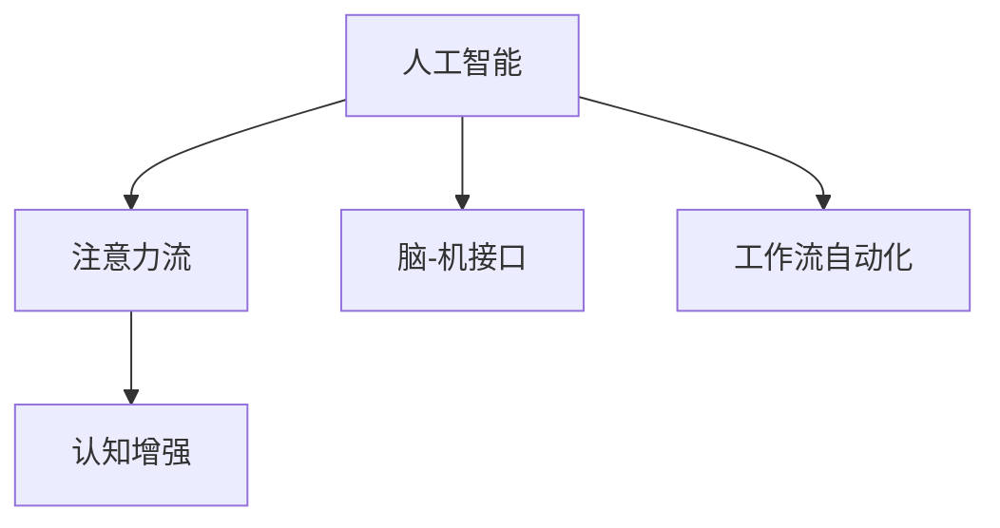

                 

# AI与人类注意力流：未来的工作、技能与注意力流管理技术的应用前景预测分析

## 1. 背景介绍

### 1.1 问题由来
随着人工智能（AI）技术的迅速发展，其在诸多领域，尤其是工作与技能提升方面的潜力引起了广泛关注。AI不仅在自动化流程、数据处理、决策支持等方面展现了巨大能力，也逐渐在提升人类工作效率、扩展人类认知能力方面展现出广阔前景。其中，注意力流（Attention Flow）作为一个新兴概念，在AI与人类协作中占据了核心地位。

### 1.2 问题核心关键点
注意力流是指信息处理过程中的注意力分配和转移机制，涵盖了从认知科学到计算科学的广泛领域。AI与注意力流的结合，通过模拟和增强人类注意力流，可以在理解人类认知模式的基础上，提升工作效率、学习效果，甚至在脑-机接口等领域开辟新的应用方向。

注意力流管理技术，尤其是基于AI的注意力流管理，正成为提升人类工作与技能的关键手段。本文旨在深入探讨AI与人类注意力流的结合，预测其在未来工作、技能提升及注意力流管理技术领域的应用前景。

## 2. 核心概念与联系

### 2.1 核心概念概述

为更好地理解AI与人类注意力流的结合，首先需要介绍几个核心概念：

- **人工智能（AI）**：通过算法、数据和计算，使计算机系统模拟人类智能，执行各种复杂任务的技术。
- **注意力流（Attention Flow）**：指信息处理过程中注意力分配和转移的机制，涵盖视觉、听觉、语言等多个维度。
- **脑-机接口（BCI）**：通过将脑信号转化为机器指令，实现人机互动的技术，是AI与人类注意力流结合的重要应用方向。
- **认知增强（Cognitive Enhancement）**：通过AI技术，增强人类的认知能力，如记忆力、注意力、决策能力等。
- **工作流自动化（Workflow Automation）**：利用AI自动化工作流程，提升工作效率，减少人为干预。

这些概念之间的逻辑关系可以通过以下Mermaid流程图来展示：



这个流程图展示了AI、注意力流管理与多个应用领域之间的联系：

1. 人工智能通过模拟人类注意力流，提升认知能力。
2. 脑-机接口利用AI技术，将脑信号转化为机器指令，实现人机互动。
3. 认知增强技术通过AI提升记忆力、注意力等认知功能。
4. 工作流自动化通过AI自动化工作流程，提升工作效率。

## 3. 核心算法原理 & 具体操作步骤

### 3.1 算法原理概述

基于AI的注意力流管理技术，其核心原理是通过模拟人类注意力流的机制，利用AI算法优化注意力分配，提升信息处理效率。具体来说，通过以下步骤实现：

1. **数据采集**：收集人类注意力流数据，包括眼球追踪数据、脑电波数据、行为数据等。
2. **模型训练**：利用收集到的数据训练AI模型，模拟人类注意力流机制。
3. **注意力分配优化**：通过AI模型，自动调整注意力分配，优化信息处理效率。
4. **应用部署**：将训练好的模型部署到实际工作场景中，提升工作效率、学习效果等。

### 3.2 算法步骤详解

基于AI的注意力流管理技术的具体操作步骤如下：

**Step 1: 数据收集与预处理**
- 收集人类注意力流数据，如眼球追踪数据、脑电波数据等。
- 对数据进行清洗、归一化处理，确保数据质量和一致性。

**Step 2: 模型训练与优化**
- 选择合适的AI模型，如深度神经网络、支持向量机等。
- 利用标注好的注意力流数据，训练AI模型，并根据需求调整模型参数。
- 使用交叉验证等技术，评估模型性能并进行优化。

**Step 3: 注意力流分析与应用**
- 利用训练好的AI模型，对新的注意力流数据进行分析，自动调整注意力分配。
- 根据分析结果，调整工作流程，优化任务分配，提升工作效率。
- 持续监控注意力流数据，不断优化模型，提升应用效果。

### 3.3 算法优缺点

基于AI的注意力流管理技术具有以下优点：

1. **高效性**：通过模拟人类注意力流机制，自动调整注意力分配，提升信息处理效率。
2. **灵活性**：可以根据不同工作场景的需求，灵活调整模型参数，适应多种应用场景。
3. **可扩展性**：能够快速扩展到多个领域，如学习、工作、医疗等，具有广泛的应用前景。

同时，也存在以下缺点：

1. **数据依赖**：需要大量的高质量标注数据，获取数据成本较高。
2. **模型复杂性**：训练和优化过程较为复杂，需要专业的知识和资源。
3. **隐私风险**：涉及个人隐私数据，需注意数据保护和隐私问题。

### 3.4 算法应用领域

基于AI的注意力流管理技术在多个领域具有广泛应用：

- **教育培训**：通过分析学生的注意力流数据，优化教学内容和方式，提升学习效果。
- **医疗健康**：通过分析病人的注意力流数据，优化诊疗流程，提升医疗服务质量。
- **企业生产**：通过优化工作流程和任务分配，提升工作效率，降低生产成本。
- **人机交互**：通过脑-机接口，实现人机互动，提升用户体验。

## 4. 数学模型和公式 & 详细讲解 & 举例说明

### 4.1 数学模型构建

基于AI的注意力流管理技术，其数学模型主要包括以下几个部分：

- **注意力流数据采集模型**：
  $$
  \mathcal{D} = \{(x_i, y_i)\}_{i=1}^N
  $$
  其中，$x_i$为输入的注意力流数据，$y_i$为标注结果。

- **AI模型训练损失函数**：
  $$
  \mathcal{L}(\theta) = -\frac{1}{N}\sum_{i=1}^N L(\theta, y_i | x_i)
  $$
  其中，$\theta$为AI模型的参数，$L$为损失函数，如交叉熵损失、均方误差损失等。

- **注意力流分析模型**：
  $$
  A(x) = \text{softmax}(W x + b)
  $$
  其中，$W$和$b$为模型参数，$\text{softmax}$为注意力分配函数。

### 4.2 公式推导过程

以注意力流数据采集模型为例，其推导过程如下：

假设收集到的注意力流数据为$(x_i, y_i)$，其中$x_i$为第$i$个样本的注意力流数据，$y_i$为标注结果，即注意力分配的概率分布。

利用深度神经网络，将注意力流数据映射为注意力分配概率，模型的输出为：
$$
\hat{A}(x_i) = \text{softmax}(W x_i + b)
$$
其中，$W$和$b$为模型参数。

通过最小化损失函数$\mathcal{L}(\theta)$，优化模型参数$\theta$，使得模型能够准确预测注意力分配结果：
$$
\theta^* = \mathop{\arg\min}_{\theta} \mathcal{L}(\theta)
$$

### 4.3 案例分析与讲解

以教育培训领域的应用为例，假设教师想要优化课堂教学内容，提升学生的学习效果。通过收集学生在学习过程中的注意力流数据，如眼球追踪数据、脑电波数据，训练AI模型，分析学生的注意力分配情况，进而调整教学内容和方式，提升学习效果。

具体步骤如下：

1. 收集学生在课堂上的注意力流数据，包括眼球追踪数据、脑电波数据等。
2. 利用深度神经网络，训练AI模型，预测学生的注意力分配情况。
3. 根据AI模型的输出，调整教学内容和时间安排，提升学生的学习效果。
4. 持续收集学生的注意力流数据，不断优化AI模型，提升教学效果。

## 5. 项目实践：代码实例和详细解释说明

### 5.1 开发环境搭建

在进行AI与注意力流结合的实践前，我们需要准备好开发环境。以下是使用Python进行TensorFlow开发的环境配置流程：

1. 安装Anaconda：从官网下载并安装Anaconda，用于创建独立的Python环境。

2. 创建并激活虚拟环境：
```bash
conda create -n tf-env python=3.8 
conda activate tf-env
```

3. 安装TensorFlow：根据CUDA版本，从官网获取对应的安装命令。例如：
```bash
conda install tensorflow
```

4. 安装其他必要工具包：
```bash
pip install numpy pandas sklearn matplotlib tqdm jupyter notebook ipython
```

完成上述步骤后，即可在`tf-env`环境中开始AI与注意力流结合的实践。

### 5.2 源代码详细实现

以下是一个基于TensorFlow的注意力流管理技术的代码实现示例：

```python
import tensorflow as tf
import numpy as np
from tensorflow.keras import layers

# 定义注意力流数据采集模型
class AttentionFlowData(tf.keras.Model):
    def __init__(self, input_dim):
        super(AttentionFlowData, self).__init__()
        self.dense1 = layers.Dense(64, activation='relu', input_shape=(input_dim,))
        self.dense2 = layers.Dense(2, activation='softmax')

    def call(self, inputs):
        x = self.dense1(inputs)
        x = self.dense2(x)
        return x

# 定义AI模型训练损失函数
def calculate_loss(model, x, y):
    y_pred = model(x)
    return tf.reduce_mean(tf.keras.losses.categorical_crossentropy(y, y_pred))

# 定义注意力流分析模型
class AttentionFlowAnalyzer(tf.keras.Model):
    def __init__(self, input_dim):
        super(AttentionFlowAnalyzer, self).__init__()
        self.dense1 = layers.Dense(64, activation='relu', input_shape=(input_dim,))
        self.dense2 = layers.Dense(2, activation='softmax')

    def call(self, inputs):
        x = self.dense1(inputs)
        x = self.dense2(x)
        return x

# 训练AI模型
def train_model(model, x_train, y_train, x_test, y_test, batch_size, epochs):
    model.compile(optimizer='adam', loss=calculate_loss)
    model.fit(x_train, y_train, batch_size=batch_size, epochs=epochs, validation_data=(x_test, y_test))
    return model

# 测试AI模型
def test_model(model, x_test, y_test):
    loss = model.evaluate(x_test, y_test)
    return loss

# 使用模型进行注意力流分析
def analyze_attention_flow(model, x_test):
    y_pred = model.predict(x_test)
    return y_pred
```

这个代码实现包括了数据采集模型、AI模型训练和注意力流分析模型，可以用于实际应用场景中的注意力流管理。

### 5.3 代码解读与分析

让我们再详细解读一下关键代码的实现细节：

**AttentionFlowData类**：
- `__init__`方法：初始化注意力流数据采集模型，包括两个全连接层。
- `call`方法：定义模型前向传播过程，将输入数据通过全连接层，最终输出注意力分配概率。

**AttentionFlowAnalyzer类**：
- `__init__`方法：初始化注意力流分析模型，包括两个全连接层。
- `call`方法：定义模型前向传播过程，将输入数据通过全连接层，最终输出注意力分配概率。

**train_model函数**：
- 定义AI模型的训练过程，包括损失函数、优化器、训练批次和轮数。
- 利用训练集和测试集，训练AI模型，并返回训练好的模型。

**test_model函数**：
- 使用训练好的AI模型，在测试集上计算模型损失。

**analyze_attention_flow函数**：
- 使用训练好的AI模型，对新的注意力流数据进行分析，预测注意力分配情况。

这些代码实现能够帮助开发者在实际应用场景中快速搭建注意力流管理模型，并进行优化和测试。

## 6. 实际应用场景

### 6.1 智能教育

基于AI的注意力流管理技术，可以在教育领域实现个性化教学。通过分析学生的注意力流数据，教师可以优化教学内容，提升学生的学习效果。例如，通过收集学生在课堂上的注意力流数据，如眼球追踪数据、脑电波数据，训练AI模型，预测学生的注意力分配情况，进而调整教学内容和时间安排，提升学生的学习效果。

### 6.2 医疗诊断

在医疗诊断领域，基于AI的注意力流管理技术可以帮助医生更精准地诊断疾病。通过分析病人的注意力流数据，如脑电波数据、心电图数据等，训练AI模型，预测病人的注意力状态，进而调整诊疗流程，提升医疗服务质量。例如，通过收集病人的注意力流数据，训练AI模型，预测病人的注意力状态，进而调整诊疗流程，提升医疗服务质量。

### 6.3 企业生产

在企业生产领域，基于AI的注意力流管理技术可以优化工作流程，提升工作效率。通过分析员工在工作中的注意力流数据，如鼠标操作数据、键盘操作数据等，训练AI模型，预测员工的注意力分配情况，进而调整工作流程和任务分配，提升工作效率。例如，通过收集员工在工作中的注意力流数据，训练AI模型，预测员工的注意力分配情况，进而调整工作流程和任务分配，提升工作效率。

### 6.4 未来应用展望

随着AI与注意力流结合技术的不断进步，未来在更多领域将有更广阔的应用前景：

- **脑-机接口**：利用AI技术，将脑信号转化为机器指令，实现人机互动，提升用户体验。
- **认知增强**：通过AI技术，增强人类的认知能力，如记忆力、注意力、决策能力等。
- **工作流自动化**：利用AI技术，自动化工作流程，提升工作效率，减少人为干预。

## 7. 工具和资源推荐

### 7.1 学习资源推荐

为了帮助开发者系统掌握AI与注意力流结合的理论基础和实践技巧，这里推荐一些优质的学习资源：

1. **TensorFlow官方文档**：详细介绍了TensorFlow的使用方法、API、模型训练等，是TensorFlow初学者必备的参考资料。
2. **Attention is All You Need**：Transformer原论文，介绍了注意力机制的基本原理和应用，是AI与注意力流结合的重要理论基础。
3. **Cognitive Neuroscience**：介绍了认知科学的最新进展，涵盖注意力流机制、脑-机接口等内容，对理解AI与注意力流的结合具有重要参考价值。
4. **Coursera AI课程**：由斯坦福大学开设的AI课程，涵盖深度学习、自然语言处理、计算机视觉等多个方面，适合深度学习初学者。
5. **ArXiv预印本**：汇集了最新的AI与注意力流结合论文，是了解最新研究动态的重要渠道。

通过对这些资源的学习实践，相信你一定能够快速掌握AI与注意力流结合的精髓，并用于解决实际的AI与注意力流管理问题。

### 7.2 开发工具推荐

高效的开发离不开优秀的工具支持。以下是几款用于AI与注意力流结合开发的常用工具：

1. **TensorFlow**：基于Python的开源深度学习框架，灵活的计算图，适合快速迭代研究。
2. **PyTorch**：由Facebook开发的高性能深度学习框架，支持动态图和静态图，适合研究和生产应用。
3. **Keras**：高层次的深度学习API，易于上手，适合快速构建和调试模型。
4. **Jupyter Notebook**：交互式数据科学平台，支持Python、R等多种语言，适合数据分析和模型训练。
5. **Scikit-learn**：Python数据科学库，提供多种机器学习算法和工具，适合数据处理和模型评估。

合理利用这些工具，可以显著提升AI与注意力流结合任务的开发效率，加快创新迭代的步伐。

### 7.3 相关论文推荐

AI与注意力流结合技术的发展源于学界的持续研究。以下是几篇奠基性的相关论文，推荐阅读：

1. **Attention is All You Need**：Transformer原论文，提出了注意力机制，奠定了AI与注意力流结合的基础。
2. **Deep Learning for Cognitive Enhancement**：介绍了AI技术在认知增强中的应用，探讨了AI与注意力流结合的潜力。
3. **Attention-Based Cognitive Enhancement**：提出了一种基于注意力机制的认知增强模型，展示了AI与注意力流结合的效果。
4. **Neuro-Inspired Attention Flow**：通过研究人类注意力流机制，提出了基于神经科学的注意力流模型，为AI与注意力流结合提供了新思路。
5. **Attention-Flow Driven Decision-Making**：研究了注意力流在决策过程中的作用，提出了基于注意力流的决策模型，为AI与注意力流结合提供了新视角。

这些论文代表了大语言模型微调技术的发展脉络。通过学习这些前沿成果，可以帮助研究者把握学科前进方向，激发更多的创新灵感。

## 8. 总结：未来发展趋势与挑战

### 8.1 总结

本文对基于AI的注意力流管理技术进行了全面系统的介绍。首先阐述了AI与注意力流结合的研究背景和意义，明确了注意力流管理在提升人类工作效率、学习效果等方面的独特价值。其次，从原理到实践，详细讲解了注意力流管理技术的数学原理和关键步骤，给出了AI与注意力流结合任务开发的完整代码实例。同时，本文还广泛探讨了注意力流管理技术在智能教育、医疗诊断、企业生产等多个领域的应用前景，展示了AI与注意力流结合技术的巨大潜力。

通过本文的系统梳理，可以看到，基于AI的注意力流管理技术正在成为提升人类工作效率、学习效果的关键手段，具有广阔的应用前景。未来，伴随AI技术的不断发展，注意力流管理技术将在更多领域发挥重要作用，为人类认知智能的提升提供重要支持。

### 8.2 未来发展趋势

展望未来，AI与注意力流结合技术将呈现以下几个发展趋势：

1. **模型复杂度提升**：随着深度学习模型的不断进步，AI与注意力流结合技术将越来越复杂，能够模拟和增强人类注意力流的机制也将更加精细。
2. **跨领域应用扩展**：AI与注意力流结合技术将拓展到更多领域，如医疗、金融、工业等，为不同领域的认知智能提升提供有力支持。
3. **多模态数据融合**：未来的AI与注意力流结合技术将能够处理多种模态的数据，如文本、图像、声音等，提升信息处理的多样性和全面性。
4. **伦理和安全考量**：随着AI技术的广泛应用，对伦理和安全问题的关注将不断增加，AI与注意力流结合技术也将更加注重隐私保护和伦理问题。
5. **个性化与普适化结合**：未来的AI与注意力流结合技术将更加注重个性化和普适化的结合，既能够提供个性化的服务，又能够满足大众化的需求。

以上趋势凸显了AI与注意力流结合技术的广阔前景。这些方向的探索发展，必将进一步提升AI与注意力流结合技术的性能和应用范围，为人类认知智能的提升带来深远影响。

### 8.3 面临的挑战

尽管AI与注意力流结合技术已经取得了瞩目成就，但在迈向更加智能化、普适化应用的过程中，它仍面临着诸多挑战：

1. **数据获取难度**：获取高质量的注意力流数据，如脑电波数据、眼球追踪数据等，成本较高，数据获取难度大。
2. **模型复杂度**：深度学习模型复杂度较高，训练和优化过程较为复杂，需要专业的知识和资源。
3. **伦理和安全问题**：涉及个人隐私数据，需注意数据保护和隐私问题，避免伦理和安全风险。
4. **技术落地难度**：将AI与注意力流结合技术转化为实际应用，需要考虑技术落地和系统部署的问题。
5. **多模态数据融合**：不同模态数据的信息融合难度较大，需要高效的算法和工具支持。

正视AI与注意力流结合技术面临的这些挑战，积极应对并寻求突破，将是大语言模型微调走向成熟的必由之路。相信随着学界和产业界的共同努力，这些挑战终将一一被克服，AI与注意力流结合技术必将在构建人机协同的智能时代中扮演越来越重要的角色。

### 8.4 研究展望

面向未来，AI与注意力流结合技术需要在以下几个方面寻求新的突破：

1. **多模态数据融合**：探索更加高效的多模态数据融合算法，提升信息处理的全面性和准确性。
2. **跨领域应用拓展**：将AI与注意力流结合技术拓展到更多领域，提升不同领域的认知智能水平。
3. **个性化服务优化**：研究更加高效的个性化服务算法，提升用户体验和满意度。
4. **伦理和安全保障**：建立完善的伦理和安全保障机制，保护用户隐私和数据安全。
5. **技术落地加速**：推动AI与注意力流结合技术的产业化应用，加速技术落地和推广。

这些研究方向的探索，必将引领AI与注意力流结合技术迈向更高的台阶，为构建安全、可靠、可解释、可控的智能系统铺平道路。面向未来，AI与注意力流结合技术还需要与其他人工智能技术进行更深入的融合，如知识表示、因果推理、强化学习等，多路径协同发力，共同推动自然语言理解和智能交互系统的进步。只有勇于创新、敢于突破，才能不断拓展认知智能的边界，让智能技术更好地造福人类社会。

## 9. 附录：常见问题与解答

**Q1：AI与注意力流结合技术是否适用于所有应用场景？**

A: AI与注意力流结合技术在大多数应用场景上都能取得不错的效果，尤其是那些需要高精度、高效率处理的信息处理场景。但对于一些特定领域的任务，如情感分析、行为预测等，可能需要进一步优化模型，以适应具体的任务需求。

**Q2：AI与注意力流结合技术如何确保数据隐私和伦理安全？**

A: 确保数据隐私和伦理安全是AI与注意力流结合技术应用的关键。可以通过以下措施保障数据隐私和伦理安全：
1. 数据匿名化处理：在数据采集和处理过程中，去除个人标识信息，保护用户隐私。
2. 差分隐私保护：在数据使用过程中，采用差分隐私算法，保护用户隐私。
3. 数据访问控制：对数据访问进行严格的控制，确保数据只能被授权人员访问。
4. 透明度和可解释性：增强模型的透明度和可解释性，使用户能够理解和信任模型的决策过程。
5. 伦理审查和监督：建立伦理审查和监督机制，确保技术应用符合伦理要求。

**Q3：AI与注意力流结合技术的未来发展方向是什么？**

A: AI与注意力流结合技术的未来发展方向包括：
1. 多模态数据融合：探索更加高效的多模态数据融合算法，提升信息处理的全面性和准确性。
2. 跨领域应用拓展：将AI与注意力流结合技术拓展到更多领域，提升不同领域的认知智能水平。
3. 个性化服务优化：研究更加高效的个性化服务算法，提升用户体验和满意度。
4. 伦理和安全保障：建立完善的伦理和安全保障机制，保护用户隐私和数据安全。
5. 技术落地加速：推动AI与注意力流结合技术的产业化应用，加速技术落地和推广。

**Q4：AI与注意力流结合技术如何应用于实际工作场景？**

A: AI与注意力流结合技术可以应用于多个实际工作场景，包括：
1. 智能教育：通过分析学生的注意力流数据，优化教学内容和方式，提升学习效果。
2. 医疗诊断：通过分析病人的注意力流数据，调整诊疗流程，提升医疗服务质量。
3. 企业生产：通过优化工作流程和任务分配，提升工作效率。
4. 脑-机接口：利用AI技术，将脑信号转化为机器指令，实现人机互动，提升用户体验。

这些应用场景展示了AI与注意力流结合技术在实际工作中的广泛应用前景。

作者：禅与计算机程序设计艺术 / Zen and the Art of Computer Programming

