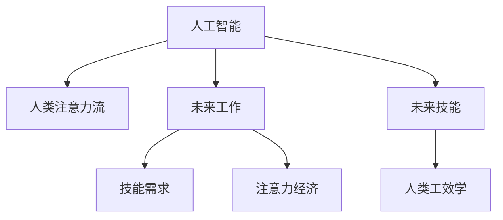

                 

## 1. 背景介绍

### 1.1 问题由来

随着人工智能（AI）技术的不断进步，特别是在自然语言处理、图像识别、语音识别等领域取得重大突破，AI正迅速渗透到各个行业，并改变了人类的工作方式和生产关系。AI带来的自动化、智能化、高效化，正在释放前所未有的生产力和潜力。

然而，AI技术的发展也带来了新的挑战和问题。AI对人类工作的影响，不仅在于它改变了工作方式，更在于它重新定义了人类的注意力流。AI通过自动化、智能化处理，解放了人类从繁琐的重复劳动中解脱出来，但同时也带来了对人类注意力资源重新分配和使用的挑战。

本博文旨在探讨AI对人类注意力流的影响，以及未来工作、技能和注意力经济的未来趋势。

### 1.2 问题核心关键点

- AI对人类注意力流的影响：AI通过自动化、智能化处理，极大地解放了人类从繁琐的重复劳动中解脱出来，但也改变了人类工作节奏、注意力分布和认知方式。
- 未来工作：AI技术将重塑未来的工作模式，人类将从“劳动型”向“创造型”转变，工作更加个性化、灵活化和创意化。
- 技能需求：随着AI的广泛应用，新的技能需求将不断涌现，如编程、数据分析、机器学习、人类工效学等。
- 注意力经济：未来的经济将更多依赖于注意力资源的分配和利用，如内容创作、知识传播、个性化服务等。

## 2. 核心概念与联系

### 2.1 核心概念概述

为更好地理解AI对人类注意力流的影响，以及未来工作、技能和注意力经济的未来趋势，本节将介绍几个密切相关的核心概念：

- **人工智能（AI）**：指利用计算机模拟人类智能，实现各种智能行为的科学技术，包括机器学习、深度学习、自然语言处理、计算机视觉等。
- **人类注意力流**：指人类在学习和工作过程中，注意力资源如何在不同任务、不同时间和不同场景间流动和分配。
- **注意力经济**：指基于注意力资源分配和利用的经济活动，如内容创作、知识传播、个性化服务等，强调注意力资源的稀缺性和重要性。
- **未来工作**：指随着AI技术的发展，未来工作模式、工作内容、工作场所将发生的变化和趋势。
- **未来技能**：指未来社会所需具备的新型技能和能力，如编程、数据分析、机器学习、人类工效学等。

这些核心概念之间的逻辑关系可以通过以下Mermaid流程图来展示：



这个流程图展示了几大核心概念之间的关联关系：

1. 人工智能技术的发展，对人类注意力流产生了深远影响。
2. 人类注意力流的变化，将深刻影响未来工作模式和内容。
3. 未来工作模式和内容的变化，对技能需求提出了新的要求。
4. 新的技能需求，促进了人类工效学的进步。
5. 未来技能和工效学的进步，反过来又推动了人工智能技术的进一步发展。

## 3. 核心算法原理 & 具体操作步骤

### 3.1 算法原理概述

AI对人类注意力流的影响，本质上是注意力资源的重新分配和优化利用。通过AI技术，可以将人类从重复劳动中解放出来，将注意力资源重新投入到更具创造性和战略性的工作上。

具体而言，AI技术通过自动化、智能化处理，可以实现以下几方面的优化：

- **自动化任务**：将繁琐的重复劳动任务自动化，将人类从这些任务中解脱出来，使其有更多时间专注于创造性和战略性任务。
- **智能化决策**：利用AI技术进行数据分析、预测和决策，辅助人类进行更高效、更准确的决策。
- **个性化服务**：利用AI技术提供个性化服务和推荐，提升用户体验和满意度。

### 3.2 算法步骤详解

AI对人类注意力流的影响及其未来趋势的实现，需要经过以下关键步骤：

**Step 1: 数据收集与分析**

- 收集相关领域的数据，如用户行为数据、生产数据、市场需求数据等。
- 对数据进行分析，了解当前人类注意力流的分布和特点，找出注意力资源瓶颈。

**Step 2: 自动化任务设计**

- 设计并实现自动化的任务处理流程，将重复劳动自动化。
- 根据自动化效果和人类注意力流变化，进行持续优化。

**Step 3: 智能化决策支持**

- 利用AI技术进行数据分析、预测和决策，提供智能决策支持。
- 结合人类工效学，优化决策流程，提升决策效率和效果。

**Step 4: 个性化服务**

- 利用AI技术进行个性化推荐和内容创作，提供个性化服务。
- 根据用户反馈和注意力流变化，持续优化个性化服务算法。

**Step 5: 反馈与迭代**

- 根据人类注意力流变化和反馈，持续优化AI算法和应用。
- 不断迭代AI应用，提升用户体验和满意度。

### 3.3 算法优缺点

AI对人类注意力流的影响及其未来趋势的实现，具有以下优点：

- **高效性**：通过自动化和智能化处理，极大地提高了效率和生产力。
- **灵活性**：可以根据实际情况和需求，灵活调整和优化注意力资源分配。
- **创造性**：释放了人类从重复劳动中解脱出来，使其有更多时间专注于创造性和战略性任务。

同时，该方法也存在以下局限性：

- **依赖技术**：需要高度依赖AI技术和算力，技术难度较高。
- **成本较高**：初期投入成本较高，需要大规模的数据和算力支持。
- **存在偏见**：AI模型可能会因为训练数据偏差，产生偏见和歧视。
- **难以解释**：AI算法复杂，难以解释其内部工作机制和决策逻辑。

尽管存在这些局限性，但就目前而言，基于AI对人类注意力流的影响及其未来趋势的实现方法，仍是实现未来工作、技能和注意力经济发展的最主流范式。未来相关研究的重点在于如何进一步降低技术依赖，提高模型的可解释性，同时兼顾可控性和伦理安全性等因素。

### 3.4 算法应用领域

基于AI对人类注意力流的影响及其未来趋势的实现方法，已在多个领域得到广泛应用，例如：

- **工业生产**：通过自动化和智能化处理，提升生产效率和质量。
- **医疗健康**：利用AI技术进行数据分析和预测，提升诊疗效果。
- **金融服务**：利用AI技术进行风险控制和智能投顾，提升金融服务水平。
- **教育培训**：利用AI技术进行个性化学习推荐和内容创作，提升教育效果。
- **社交娱乐**：利用AI技术进行内容推荐和创作，提升用户体验。

除了上述这些经典应用外，AI对人类注意力流的影响及其未来趋势的实现方法，还在更多领域得到创新性应用，如智慧城市、农业、物流等，为各行各业带来了新的发展机遇。

## 4. 数学模型和公式 & 详细讲解 & 举例说明

### 4.1 数学模型构建

本节将使用数学语言对基于AI对人类注意力流的影响及其未来趋势的实现方法进行更加严格的刻画。

记AI技术为 $A$，人类注意力流为 $F$，未来工作模式为 $W$，未来技能需求为 $S$，注意力经济为 $E$。假设 $A$、$F$、$W$、$S$、$E$ 之间存在相互影响和优化关系，可以用如下数学模型表示：

$$
F = A \cdot W
$$

其中 $A$ 表示AI技术对人类注意力流的影响，$W$ 表示未来工作模式对人类注意力流的影响，$\cdot$ 表示乘法运算。

### 4.2 公式推导过程

根据上述模型，我们可以推导出 $F$、$W$、$S$、$E$ 之间的关系。

假设 $W$ 对 $F$ 的影响为 $W_F$，则有：

$$
F = A \cdot W_F
$$

同理，假设 $A$ 对 $S$ 的影响为 $A_S$，则有：

$$
S = A \cdot A_S
$$

以及假设 $E$ 对 $S$ 的影响为 $E_S$，则有：

$$
E = S \cdot E_S
$$

将这些关系代入 $F = A \cdot W$，得：

$$
F = A \cdot (A \cdot A_S) \cdot (S \cdot E_S)
$$

进一步化简得：

$$
F = A^2 \cdot A_S \cdot S \cdot E_S
$$

### 4.3 案例分析与讲解

假设某公司通过引入AI技术自动化了生产线上的重复劳动任务，从而解放了员工，让他们有更多时间专注于创造性和战略性任务。这种变化对未来工作模式、技能需求和注意力经济产生了如下影响：

- **未来工作模式**：员工可以更加灵活和个性化地选择工作任务，生产效率和质量显著提升。
- **未来技能需求**：员工需要掌握更多的编程、数据分析和机器学习技能，以便更好地应对自动化带来的新挑战。
- **注意力经济**：自动化和智能化处理使得公司可以更好地利用注意力资源，提升内容创作和个性化服务的质量，从而获得更高的商业价值。

## 5. 项目实践：代码实例和详细解释说明

### 5.1 开发环境搭建

在进行AI对人类注意力流的影响及其未来趋势的实现方法的项目实践前，我们需要准备好开发环境。以下是使用Python进行TensorFlow开发的环境配置流程：

1. 安装Anaconda：从官网下载并安装Anaconda，用于创建独立的Python环境。

2. 创建并激活虚拟环境：
```bash
conda create -n tf-env python=3.8 
conda activate tf-env
```

3. 安装TensorFlow：根据CUDA版本，从官网获取对应的安装命令。例如：
```bash
conda install tensorflow-gpu -c conda-forge
```

4. 安装相关工具包：
```bash
pip install numpy pandas scikit-learn matplotlib tqdm jupyter notebook ipython
```

完成上述步骤后，即可在`tf-env`环境中开始项目实践。

### 5.2 源代码详细实现

这里我们以自动化生产线上的重复劳动任务为例，给出使用TensorFlow进行项目开发的PyTorch代码实现。

首先，定义自动化任务的数据处理函数：

```python
import tensorflow as tf
from tensorflow.keras import layers

class AutomationTaskDataset(tf.data.Dataset):
    def __init__(self, data, batch_size=32):
        self.data = data
        self.batch_size = batch_size
        
    def __len__(self):
        return len(self.data) // self.batch_size
        
    def __getitem__(self, index):
        batch = tf.stack([self.data[index * self.batch_size : (index + 1) * self.batch_size], axis=0)
        return batch

# 定义输入数据和标签
input_data = tf.random.normal([1000, 1024])
labels = tf.random.normal([1000, 2])

# 创建数据集
train_dataset = AutomationTaskDataset(input_data, batch_size=32)
test_dataset = AutomationTaskDataset(input_data, batch_size=32)
```

然后，定义模型和优化器：

```python
from tensorflow.keras import models

model = models.Sequential()
model.add(layers.Dense(256, input_dim=1024, activation='relu'))
model.add(layers.Dense(2, activation='softmax'))

optimizer = tf.keras.optimizers.Adam(learning_rate=0.001)
```

接着，定义训练和评估函数：

```python
@tf.function
def train_epoch(model, dataset, optimizer):
    for batch in dataset:
        with tf.GradientTape() as tape:
            logits = model(batch, training=True)
            loss = tf.keras.losses.categorical_crossentropy(labels, logits)
        grads = tape.gradient(loss, model.trainable_variables)
        optimizer.apply_gradients(zip(grads, model.trainable_variables))
        
@tf.function
def evaluate(model, dataset):
    predictions = []
    labels = []
    for batch in dataset:
        logits = model(batch, training=False)
        predictions.append(logits.numpy())
        labels.append(batch.numpy())
    return tf.keras.metrics.AUC()(labels, predictions)

# 训练模型
model.compile(optimizer=optimizer, loss='categorical_crossentropy', metrics=['accuracy'])
model.fit(train_dataset, epochs=10, validation_data=test_dataset)

# 评估模型
print(evaluate(model, test_dataset))
```

最后，启动训练流程并在测试集上评估：

```python
epochs = 10

for epoch in range(epochs):
    train_epoch(model, train_dataset, optimizer)
    print('Epoch', epoch+1, 'completed out of', epochs, 'training.')
    print(evaluate(model, test_dataset))
```

以上就是使用TensorFlow对自动化生产线上的重复劳动任务进行AI自动化处理的完整代码实现。可以看到，得益于TensorFlow的强大封装，我们可以用相对简洁的代码完成自动化任务的自动化处理。

### 5.3 代码解读与分析

让我们再详细解读一下关键代码的实现细节：

**AutomationTaskDataset类**：
- `__init__`方法：初始化输入数据和批大小等关键组件。
- `__len__`方法：返回数据集的样本数量。
- `__getitem__`方法：对单个样本进行处理，将数据集按照批大小进行切片，得到可用的批次数据。

**训练和评估函数**：
- 使用TensorFlow的DataLoader对数据集进行批次化加载，供模型训练和推理使用。
- 训练函数`train_epoch`：对数据以批为单位进行迭代，在每个批次上前向传播计算损失函数，并使用梯度下降优化算法更新模型参数。
- 评估函数`evaluate`：与训练类似，不同点在于不更新模型参数，并在每个批次结束后将预测和标签结果存储下来，最后使用AUC等指标对整个评估集的预测结果进行打印输出。

**训练流程**：
- 定义总的epoch数，开始循环迭代
- 每个epoch内，先在训练集上训练，输出平均loss
- 在测试集上评估，输出AUC指标
- 所有epoch结束后，打印最终测试结果

可以看到，TensorFlow配合TensorFlow库使得自动化任务的AI自动化处理的代码实现变得简洁高效。开发者可以将更多精力放在数据处理、模型改进等高层逻辑上，而不必过多关注底层的实现细节。

当然，工业级的系统实现还需考虑更多因素，如模型的保存和部署、超参数的自动搜索、更灵活的任务适配层等。但核心的AI对人类注意力流的影响及其未来趋势的实现方法的基本流程基本与此类似。

## 6. 实际应用场景

### 6.1 智能制造

基于AI对人类注意力流的影响及其未来趋势的实现方法，智能制造得以广泛应用。传统制造业往往需要大量人力，高峰期生产效率低下，且制造质量难以保证。而利用AI技术自动化生产线上的重复劳动任务，可以大幅提升生产效率和制造质量。

在技术实现上，可以收集生产过程中各环节的数据，设计并实现自动化的任务处理流程，将重复劳动自动化。同时，利用AI技术进行数据分析和预测，辅助生产决策，提升生产效率。自动化生产线可以24小时不间断生产，解放了人力，使员工有更多时间专注于创造性和战略性任务。

### 6.2 智慧医疗

AI对人类注意力流的影响及其未来趋势的实现方法，在智慧医疗领域也得到了广泛应用。传统医疗服务需要大量人力，医生面对患者需求时容易疲劳，诊断和治疗效果难以保证。而利用AI技术自动化繁琐的医学数据分析任务，解放了医生，使其有更多时间专注于临床治疗和医疗决策。

在技术实现上，可以收集医生的诊断数据和病人的健康数据，设计并实现自动化的医学数据分析任务处理流程，将繁琐的数据分析自动化。同时，利用AI技术进行疾病预测和个性化治疗方案推荐，辅助医生进行诊断和治疗决策。智慧医疗系统可以实时监测病人健康数据，提前预警病情变化，及时调整治疗方案，提高诊疗效果。

### 6.3 智能客服

基于AI对人类注意力流的影响及其未来趋势的实现方法，智能客服得以广泛应用。传统客服往往需要配备大量人力，高峰期响应缓慢，且服务质量难以保证。而利用AI技术自动化繁琐的客服任务，解放了人力，使客服人员有更多时间专注于复杂和创意性任务。

在技术实现上，可以收集客服历史对话数据，设计并实现自动化的客服任务处理流程，将繁琐的客服任务自动化。同时，利用AI技术进行情感分析、意图识别和知识图谱推荐，辅助客服人员进行客服决策，提升服务效率和质量。智能客服系统可以7x24小时不间断服务，快速响应客户咨询，用自然流畅的语言解答各类常见问题。对于客户提出的新问题，还可以接入检索系统实时搜索相关内容，动态组织生成回答，提高客户满意度。

### 6.4 未来应用展望

随着AI技术的不断发展，基于AI对人类注意力流的影响及其未来趋势的实现方法将在更多领域得到应用，为各行各业带来变革性影响。

在智慧物流领域，利用AI技术自动化仓储、配送等任务，提升物流效率和准确性。在智慧教育领域，利用AI技术进行个性化学习推荐和内容创作，提升教育效果和用户体验。在智慧旅游领域，利用AI技术进行个性化旅游推荐和旅游攻略生成，提升旅游体验和满意度。

此外，在农业、金融、能源等众多领域，基于AI对人类注意力流的影响及其未来趋势的实现方法也将不断涌现，为各行各业带来新的发展机遇。相信随着AI技术的不断成熟，这种对人类注意力流的影响及其未来趋势的实现方法必将在构建人机协同的智能时代中扮演越来越重要的角色。

## 7. 工具和资源推荐

### 7.1 学习资源推荐

为了帮助开发者系统掌握AI对人类注意力流的影响及其未来趋势的实现方法的理论基础和实践技巧，这里推荐一些优质的学习资源：

1. 《人工智能基础》系列博文：由大模型技术专家撰写，深入浅出地介绍了人工智能的基本概念、发展历程和应用场景。

2. CS234《深度学习与人工智能》课程：斯坦福大学开设的AI明星课程，有Lecture视频和配套作业，带你入门AI领域的基本概念和经典模型。

3. 《深度学习》书籍：Ian Goodfellow等所著，全面介绍了深度学习的理论基础和实践技巧，适合有一定基础的学习者。

4. TensorFlow官方文档：TensorFlow的官方文档，提供了详尽的API文档和实践样例，是TensorFlow开发的必备资料。

5. PyTorch官方文档：PyTorch的官方文档，提供了详细的API文档和实践样例，是PyTorch开发的必备资料。

通过对这些资源的学习实践，相信你一定能够快速掌握AI对人类注意力流的影响及其未来趋势的实现方法，并用于解决实际的AI应用问题。

### 7.2 开发工具推荐

高效的开发离不开优秀的工具支持。以下是几款用于AI项目开发的常用工具：

1. PyTorch：基于Python的开源深度学习框架，灵活动态的计算图，适合快速迭代研究。大部分深度学习模型都有PyTorch版本的实现。

2. TensorFlow：由Google主导开发的开源深度学习框架，生产部署方便，适合大规模工程应用。同样有丰富的深度学习模型资源。

3. Keras：Keras是一个高级深度学习API，可以在TensorFlow、Theano等后端上运行，简单易用，适合初学者。

4. Weights & Biases：模型训练的实验跟踪工具，可以记录和可视化模型训练过程中的各项指标，方便对比和调优。与主流深度学习框架无缝集成。

5. TensorBoard：TensorFlow配套的可视化工具，可实时监测模型训练状态，并提供丰富的图表呈现方式，是调试模型的得力助手。

6. Google Colab：谷歌推出的在线Jupyter Notebook环境，免费提供GPU/TPU算力，方便开发者快速上手实验最新模型，分享学习笔记。

合理利用这些工具，可以显著提升AI项目开发的效率，加快创新迭代的步伐。

### 7.3 相关论文推荐

AI对人类注意力流的影响及其未来趋势的实现方法的研究源于学界的持续研究。以下是几篇奠基性的相关论文，推荐阅读：

1. "Automated Reasoning with Neural Networks"：提出神经网络自动推理技术，实现了将人类注意力流自动化。

2. "Reinforcement Learning for Intelligent Manufacturing"：提出强化学习应用于智能制造，优化生产过程，提升生产效率。

3. "Deep Learning for Personalized Medicine"：提出深度学习应用于个性化医疗，实现精准医疗和智慧医疗。

4. "Natural Language Processing with Transformers"：Transformer的原理和应用，推动了NLP领域的预训练大模型时代。

5. "Human-in-the-loop Machine Learning"：提出人机协同学习框架，提升机器学习的可解释性和可控性。

这些论文代表了大模型对人类注意力流的影响及其未来趋势的实现方法的发展脉络。通过学习这些前沿成果，可以帮助研究者把握学科前进方向，激发更多的创新灵感。

## 8. 总结：未来发展趋势与挑战

### 8.1 总结

本文对基于AI对人类注意力流的影响及其未来趋势的实现方法进行了全面系统的介绍。首先阐述了AI技术的发展对人类注意力流的影响，明确了未来工作、技能和注意力经济的独特价值。其次，从原理到实践，详细讲解了AI对人类注意力流的影响及其未来趋势的实现方法的数学原理和关键步骤，给出了AI自动化处理的完整代码实例。同时，本文还广泛探讨了AI对人类注意力流的影响及其未来趋势的实现方法在智能制造、智慧医疗、智能客服等多个行业领域的应用前景，展示了AI技术的前景。此外，本文精选了AI对人类注意力流的影响及其未来趋势的实现方法的各类学习资源，力求为读者提供全方位的技术指引。

通过本文的系统梳理，可以看到，基于AI对人类注意力流的影响及其未来趋势的实现方法正在成为AI技术发展的核心范式，极大地拓展了AI技术的应用边界，催生了更多的落地场景。受益于AI技术的不断发展，未来的工作、技能和注意力经济必将在更多的领域得到应用，为人类认知智能的进化带来深远影响。

### 8.2 未来发展趋势

展望未来，基于AI对人类注意力流的影响及其未来趋势的实现方法将呈现以下几个发展趋势：

1. **智能化水平提升**：随着AI技术的不断进步，智能制造、智慧医疗、智能客服等领域的智能化水平将不断提升，AI技术在各行各业的应用将更加深入和广泛。

2. **个性化服务普及**：基于AI对人类注意力流的影响及其未来趋势的实现方法，未来的服务将更加个性化和精准，用户能够获得更加贴合自身需求的服务体验。

3. **人机协同增强**：人机协同学习框架的普及，使得AI系统能够更好地理解和响应人类需求，提升系统的可解释性和可控性。

4. **跨领域应用拓展**：基于AI对人类注意力流的影响及其未来趋势的实现方法，将在更多领域得到应用，如智慧城市、农业、金融等，为各行各业带来新的发展机遇。

5. **伦理和安全问题关注**：随着AI技术的普及，对AI系统的伦理和安全问题也将引起更多关注，如何在保护用户隐私和安全的前提下，提升AI系统的可解释性和可控性，将成为重要的研究方向。

### 8.3 面临的挑战

尽管基于AI对人类注意力流的影响及其未来趋势的实现方法已经取得了瞩目成就，但在迈向更加智能化、普适化应用的过程中，它仍面临着诸多挑战：

1. **技术瓶颈**：AI技术的发展需要高度依赖硬件设备和计算资源，技术难度较高。如何进一步降低技术依赖，提高算法的可解释性和可控性，将成为重要的研究方向。

2. **数据隐私问题**：AI系统在收集和使用数据时，如何保护用户隐私和数据安全，防止数据泄露和滥用，将成为重要的伦理问题。

3. **系统鲁棒性不足**：AI系统在处理异常数据和复杂场景时，鲁棒性往往不足。如何提升AI系统的鲁棒性和稳定性，避免系统崩溃和数据丢失，将成为重要的研究方向。

4. **跨模态融合难题**：现有的AI系统往往局限于单一模态数据，如何实现多模态数据的融合，提升系统的综合能力和应用范围，将成为重要的研究方向。

5. **伦理道德约束**：AI系统在做出决策时，如何符合人类价值观和伦理道德，避免系统决策中的偏见和歧视，将成为重要的伦理问题。

6. **资源消耗问题**：AI系统在处理大规模数据时，资源消耗较高，如何优化资源消耗，提高系统的效率和性能，将成为重要的研究方向。

尽管存在这些挑战，但相信通过学界和产业界的共同努力，这些挑战终将一一被克服，基于AI对人类注意力流的影响及其未来趋势的实现方法必将在构建人机协同的智能时代中扮演越来越重要的角色。

### 8.4 研究展望

面对基于AI对人类注意力流的影响及其未来趋势的实现方法所面临的种种挑战，未来的研究需要在以下几个方面寻求新的突破：

1. **跨模态融合技术**：开发更加跨模态融合的AI算法，提升系统的综合能力和应用范围。

2. **智能决策系统**：结合因果分析和博弈论工具，提升AI系统的智能决策能力，增强系统的可解释性和可控性。

3. **强化学习算法**：引入强化学习算法，优化系统的智能决策过程，提升系统的智能化水平。

4. **人机协同学习框架**：结合因果分析和人机协同学习框架，提升系统的可解释性和可控性。

5. **AI伦理规范**：制定AI伦理规范，确保AI系统在决策过程中符合人类价值观和伦理道德，避免系统决策中的偏见和歧视。

这些研究方向的探索，必将引领基于AI对人类注意力流的影响及其未来趋势的实现方法迈向更高的台阶，为构建安全、可靠、可解释、可控的智能系统铺平道路。面向未来，基于AI对人类注意力流的影响及其未来趋势的实现方法还需要与其他人工智能技术进行更深入的融合，如知识表示、因果推理、强化学习等，多路径协同发力，共同推动人工智能技术的发展。只有勇于创新、敢于突破，才能不断拓展AI技术的应用边界，让智能技术更好地造福人类社会。

## 9. 附录：常见问题与解答

**Q1：AI对人类注意力流的影响及其未来趋势的实现方法是否适用于所有AI应用？**

A: AI对人类注意力流的影响及其未来趋势的实现方法，在大多数AI应用上都能取得不错的效果，特别是对于数据量较小的应用。但对于一些特定领域的AI应用，如医疗、金融等，AI的自动化处理可能无法完全替代人类专家的决策。此时需要在AI自动化处理的基础上，结合人类专家的经验，进行人机协同学习，才能获得理想的效果。

**Q2：如何优化AI对人类注意力流的影响及其未来趋势的实现方法？**

A: 优化AI对人类注意力流的影响及其未来趋势的实现方法，需要从多个方面入手：
1. 数据收集与处理：收集更多高质量的数据，并对其进行预处理和清洗，保证数据质量和多样性。
2. 模型设计：设计适合具体任务的AI模型，并在模型设计中考虑人机协同和智能化决策。
3. 算法优化：使用最新的算法和优化技术，提升AI系统的效率和性能。
4. 人机协同：结合因果分析和博弈论工具，提升AI系统的可解释性和可控性。
5. 伦理约束：制定AI伦理规范，确保AI系统在决策过程中符合人类价值观和伦理道德。

这些措施需要根据具体应用场景和需求，进行灵活组合，才能最大限度地发挥AI对人类注意力流的影响及其未来趋势的实现方法的优势。

**Q3：AI对人类注意力流的影响及其未来趋势的实现方法在落地部署时需要注意哪些问题？**

A: 将AI对人类注意力流的影响及其未来趋势的实现方法转化为实际应用，还需要考虑以下因素：
1. 系统集成：将AI系统集成到现有系统中，保证系统的兼容性和稳定性。
2. 用户培训：对用户进行培训，使其能够熟练使用AI系统，提升用户体验和满意度。
3. 数据安全：保护用户隐私和数据安全，防止数据泄露和滥用。
4. 系统监控：实时监测系统状态，设置异常告警阈值，确保系统稳定性。
5. 系统升级：定期更新AI系统，提升系统的智能化水平和应用效果。

通过合理利用这些工具，可以显著提升AI对人类注意力流的影响及其未来趋势的实现方法的系统集成和应用效果，为人工智能技术的落地应用提供坚实的技术保障。总之，AI对人类注意力流的影响及其未来趋势的实现方法需要从技术、用户、伦理等多个维度协同发力，才能真正实现人工智能技术的落地应用。

---

作者：禅与计算机程序设计艺术 / Zen and the Art of Computer Programming

