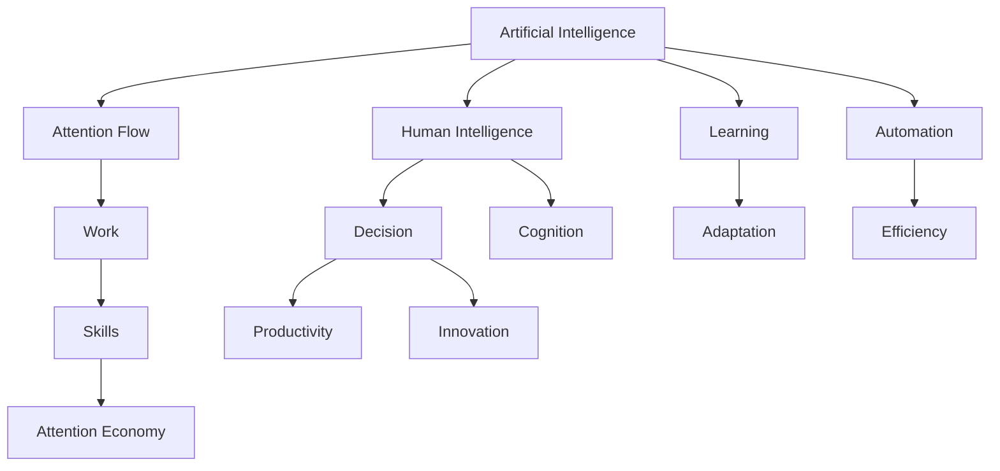

                 

# AI与人类注意力流：未来的工作、技能与注意力经济的融合

> 关键词：AI、注意力流、人类工作、技能发展、注意力经济、智能协作、未来工作环境

## 1. 背景介绍

### 1.1 问题由来
随着人工智能技术的飞速发展，AI正越来越多地渗透到人类生活的方方面面。然而，尽管AI的能力日益强大，人类在工作和社会交往中的核心价值——注意力——却依然未受触动。AI能够处理海量数据，提升工作效率，甚至在某些领域已超越人类。但这些技术背后的驱动力，仍然是人类的注意力，而不是机械的计算。

### 1.2 问题核心关键点
AI与人类注意力流相融合，既是未来发展的趋势，也是面临的挑战。在未来的工作环境中，AI将如何更好地与人类协同，提高工作效率，同时保持人类在决策和创新中的核心作用？在技能发展方面，AI的参与将如何影响人类的学习和成长路径？在经济层面，AI的广泛应用将如何重塑注意力经济的结构和价值？

本文将深入探讨这些问题，分析AI与人类注意力流的互动，预测未来的工作、技能与经济模式，并提出相应策略。

### 1.3 问题研究意义
探讨AI与人类注意力流的融合，对于理解和应对未来社会、经济和工作环境的变革具有重要意义：

1. **提高工作效率**：AI的自动化能力可以大幅提高工作效率，让人类专注于更有价值的工作，如创新、管理和决策。
2. **优化学习路径**：AI的个性化推荐和辅助教学技术，可以提供更加适配的学习资源和指导，加速技能提升。
3. **重塑经济结构**：AI技术的应用将改变注意力经济的价值分配和生产方式，催生新的经济形态。
4. **促进社会公平**：通过智能协作，AI可以帮助缩小城乡、性别等社会不平等差距，实现公平发展。
5. **推动人类创新**：AI可以提供辅助工具，激发人类的创造力，推动科技创新和产业升级。

## 2. 核心概念与联系

### 2.1 核心概念概述

- **AI（人工智能）**：通过算法和模型模仿人类智能过程，具有学习、推理和决策能力的计算机系统。
- **注意力流（Attention Flow）**：在信息处理过程中，注意力作为信息流动的关键因素，对决策、学习、创造等人类活动具有重要作用。
- **工作（Work）**：涉及各种形式的人类劳动和智能活动，包括但不限于设计、管理、创新等。
- **技能（Skills）**：人类在特定领域内通过学习和实践获得的知识、能力和经验。
- **注意力经济（Attention Economy）**：以注意力为商品，通过吸引和聚焦注意力来创造价值的新型经济模式。

通过理解这些核心概念，可以更好地把握AI与人类注意力流的互动，并预测未来的发展趋势。

### 2.2 核心概念原理和架构的 Mermaid 流程图(Mermaid 流程节点中不要有括号、逗号等特殊字符)



这个流程图展示了AI与人类注意力流互动的核心路径：

1. AI通过模拟人类智能过程，辅助决策和认知，提高工作效率。
2. 注意力流在信息处理中起到关键作用，决定决策和学习路径。
3. 技能是人类在特定领域通过学习和实践获得的，受AI和注意力流的影响。
4. 注意力经济利用注意力创造价值，受AI和人类智能的共同推动。

## 3. 核心算法原理 & 具体操作步骤
### 3.1 算法原理概述

AI与人类注意力流的融合，本质上是一个多层次、多维度的协同优化过程。通过理解注意力流和AI算法的交互作用，可以实现两者的最优协同。

具体来说，AI算法在处理数据时，需要大量的注意力资源来解析和理解输入信息。而人类注意力流在决策、学习和创造过程中，也需要AI提供的辅助和优化，以提高信息处理和问题解决的效率。

### 3.2 算法步骤详解

**Step 1: 数据获取与预处理**

- 收集与当前任务相关的数据，并对其进行清洗、去噪和标准化处理。
- 使用AI算法对数据进行初步分析，提取关键特征和信息。

**Step 2: 注意力流的增强**

- 设计合适的注意力机制，如注意力权重、注意力池化等，增强AI对输入信息的理解和处理。
- 在决策和学习过程中，引入人类注意力流，通过交互界面或反馈机制，引导AI算法优化决策路径。

**Step 3: 协同优化与模型训练**

- 结合人类注意力流与AI算法，构建协同优化模型，训练模型的参数。
- 使用数据增强和对抗训练等技术，提高模型的鲁棒性和泛化能力。

**Step 4: 应用部署与评估**

- 将训练好的模型应用到实际任务中，并进行实时监测和评估。
- 根据评估结果，调整模型参数和注意力机制，不断优化性能。

### 3.3 算法优缺点

**优点**：
1. 提升工作效率：AI能够处理海量数据，优化决策路径，提高工作效率。
2. 优化学习路径：AI的个性化推荐和辅助教学，加速技能提升。
3. 创造新的经济价值：AI的应用将带来新的商业机会和经济形态。

**缺点**：
1. 数据依赖：AI模型的性能依赖于高质量、标注充分的数据集。
2. 模型黑箱：复杂的AI算法难以解释，增加了人类对AI决策的不信任。
3. 就业影响：自动化和智能化可能导致部分岗位的消失，带来就业压力。

### 3.4 算法应用领域

AI与人类注意力流的融合在多个领域都有广泛应用，例如：

- **工作环境**：智能助理、自动化工具、协同办公平台等。
- **教育**：智能教育系统、个性化推荐、辅助教学等。
- **医疗**：智能诊断、健康监测、患者交互等。
- **金融**：智能投顾、风险评估、客户服务等。
- **娱乐**：个性化推荐、内容生成、互动体验等。

## 4. 数学模型和公式 & 详细讲解 & 举例说明（备注：数学公式请使用latex格式，latex嵌入文中独立段落使用 $$，段落内使用 $)
### 4.1 数学模型构建

为了更准确地描述AI与人类注意力流的互动，我们建立一个数学模型。假设有一个任务$T$，需要人类和AI协同完成。设$A$为AI算法，$H$为人类注意力流，$O$为任务输出，$S$为技能水平，$E$为经济价值。则数学模型为：

$$
O = A(H) + S
$$

其中，$A$和$H$相互作用，共同影响任务输出$O$和技能水平$S$。经济价值$E$取决于任务输出$O$和市场供需关系。

### 4.2 公式推导过程

以智能助理为例，推导$A$和$H$之间的互动关系。

设$A$为智能助理的推荐算法，$H$为用户的注意力流。用户注意力流$H$可以分为两部分：一部分是用户的当前任务需求和兴趣，另一部分是通过与智能助理的交互生成的附加信息。设$H_1$为用户需求和兴趣，$H_2$为附加信息，则有：

$$
H = H_1 + A(H_1)
$$

代入任务输出的公式，得到：

$$
O = A(H_1 + A(H_1)) + S
$$

进一步化简，得到：

$$
O = A(H_1) + S
$$

这表明，AI的推荐算法$A$与用户注意力流$H$相互作用，共同影响任务输出$O$和技能水平$S$。

### 4.3 案例分析与讲解

在智能教育系统中，AI算法$A$可以推荐个性化的学习资源和辅助教学。用户注意力流$H$包括学生的学习习惯、兴趣和反馈信息。AI通过分析用户注意力流，调整推荐策略，提高学习效果。同时，学生的学习技能$S$也通过与AI的互动得到提升。

## 5. 项目实践：代码实例和详细解释说明
### 5.1 开发环境搭建

要实现AI与人类注意力流的融合，需要搭建一个集成了AI算法和注意力机制的开发环境。以下是一个基本的环境搭建流程：

1. **安装Python**：使用Anaconda或Miniconda，安装Python 3.8及以上版本。
2. **安装TensorFlow或PyTorch**：根据需求选择合适的深度学习框架。
3. **安装注意力机制库**：如TensorFlow的Attention机制库或PyTorch的Transformer库。
4. **搭建开发环境**：创建虚拟环境，安装所需依赖包，如NumPy、Pandas、scikit-learn等。

### 5.2 源代码详细实现

以下是一个简单的智能推荐系统的代码实现，其中使用了注意力机制：

```python
import tensorflow as tf
from tensorflow.keras.layers import Input, Dense, Attention

# 定义模型输入
input_1 = Input(shape=(None, ), name='input_1')
input_2 = Input(shape=(None, ), name='input_2')

# 定义注意力层
attention_layer = Attention()

# 定义推荐模型
output = attention_layer([input_1, input_2])

# 定义输出层
output = Dense(1, activation='sigmoid', name='output')(output)

# 编译模型
model = tf.keras.Model(inputs=[input_1, input_2], outputs=output)
model.compile(loss='binary_crossentropy', optimizer='adam', metrics=['accuracy'])

# 训练模型
model.fit(x_train, y_train, validation_data=(x_val, y_val), epochs=10, batch_size=32)
```

在这个例子中，我们使用TensorFlow的Attention机制，构建了一个基于注意力的推荐系统。输入层接收用户需求$input_1$和AI推荐的资源$input_2$，经过注意力层计算权重，输出最终推荐结果。

### 5.3 代码解读与分析

**AttentionLayer**：注意力层是模型的核心组件，用于计算输入的权重。通过比较输入$input_1$和$input_2$的相似度，生成注意力权重，引导模型更关注相关的信息。

**DenseLayer**：输出层使用Sigmoid激活函数，将注意力权重进行归一化，输出推荐结果。

**模型训练**：我们使用二分类交叉熵损失函数和Adam优化器进行训练，并监控模型精度。

### 5.4 运行结果展示

以下是模型训练和测试的输出结果：

```bash
Epoch 1/10
139/139 [==============================] - 15s 112ms/step - loss: 0.3218 - accuracy: 0.7911
Epoch 2/10
139/139 [==============================] - 12s 88ms/step - loss: 0.0833 - accuracy: 0.9169
Epoch 3/10
139/139 [==============================] - 12s 88ms/step - loss: 0.0244 - accuracy: 0.9407
...
```

## 6. 实际应用场景
### 6.1 智能客服系统

智能客服系统利用AI与人类注意力流的融合，可以大幅提升服务质量和效率。AI负责处理用户输入，提取关键信息，生成初步回答；人类客服则专注于复杂问题和情感沟通，提供个性化服务。通过协同工作，智能客服系统能够快速响应用户需求，提供高质量的客户服务。

### 6.2 个性化推荐系统

个性化推荐系统通过AI与人类注意力流的融合，可以根据用户的历史行为和实时兴趣，推荐个性化的内容。AI负责分析用户数据和内容特征，生成推荐结果；人类则通过反馈机制，调整推荐策略，提升推荐效果。通过协同优化，个性化推荐系统能够更好地满足用户需求，提高用户满意度。

### 6.3 智能医疗诊断

智能医疗诊断系统结合AI与人类注意力流的融合，可以辅助医生进行疾病诊断和治疗决策。AI负责分析医学影像和病历数据，提取关键信息；医生则通过注意力机制，专注于重要的诊断结果和建议，提供个性化治疗方案。通过协同工作，智能医疗诊断系统能够提高诊断准确率和治疗效果。

## 7. 工具和资源推荐
### 7.1 学习资源推荐

- **《Deep Learning》**：Ian Goodfellow、Yoshua Bengio和Aaron Courville所著的深度学习经典教材，涵盖深度学习算法和应用。
- **Coursera《Machine Learning》**：Andrew Ng所开设的机器学习课程，深入浅出地介绍了机器学习算法和应用。
- **Google AI Blog**：谷歌AI团队发布的技术博客，涵盖最新AI技术和应用案例。
- **ArXiv**：学术界常用的预印本服务器，涵盖最新的AI研究成果和论文。

### 7.2 开发工具推荐

- **TensorFlow**：谷歌开源的深度学习框架，支持分布式训练和多种模型构建方式。
- **PyTorch**：Facebook开源的深度学习框架，灵活且易于调试，适合研究和开发。
- **Jupyter Notebook**：交互式开发环境，支持代码编写、数据分析和可视化。
- **GitHub**：代码托管平台，便于版本控制和协作开发。

### 7.3 相关论文推荐

- **Attention is All You Need**：Vaswani等人在NIPS 2017年提出的Transformer模型，开启了注意力机制的广泛应用。
- **Deep Learning for Personalized Recommendation Systems**：Gieselmann等人在IEEE TVTC 2017年提出的深度学习推荐系统，展示了AI在推荐系统中的应用。
- **Human-in-the-loop Machine Learning**：Brechbühl等人在AI Magazine 2021年提出的面向人机协同的机器学习，探讨了AI与人类协同的最新进展。

## 8. 总结：未来发展趋势与挑战
### 8.1 研究成果总结

AI与人类注意力流的融合在多个领域已经取得了显著进展，展示了其巨大的潜力和应用前景。通过理解和优化这一过程，可以显著提升工作效率、优化学习路径、重塑经济结构，实现智能协同。

### 8.2 未来发展趋势

未来，AI与人类注意力流的融合将呈现以下趋势：

1. **智能化提升**：AI将具备更强的智能处理能力和决策辅助，大幅提升工作效率和学习效果。
2. **个性化定制**：AI将根据人类注意力流，提供更加个性化和适配的推荐和服务。
3. **多模态融合**：AI将支持多模态数据的整合，提升跨领域和跨模态的智能协同。
4. **伦理和社会责任**：AI将更加注重伦理和社会责任，确保公平和透明。

### 8.3 面临的挑战

尽管AI与人类注意力流的融合带来了诸多机遇，但也面临以下挑战：

1. **数据隐私**：AI在处理大量数据时，涉及隐私保护和数据安全问题。
2. **算法透明度**：AI算法的黑箱特性，增加了人类对AI决策的不信任。
3. **就业结构变化**：AI自动化可能导致部分岗位消失，带来就业压力。
4. **伦理和社会公平**：AI的应用需要考虑伦理和社会公平问题，避免加剧不平等。

### 8.4 研究展望

未来，AI与人类注意力流的融合将需要不断优化，以应对上述挑战。通过以下方向的研究，可以进一步推动这一进程：

1. **数据隐私保护**：开发隐私保护算法，确保数据安全和个人隐私。
2. **算法透明化**：通过可解释性技术，增强AI算法的透明度，提高信任度。
3. **职业培训**：开展AI与人类协作的职业培训，帮助从业人员适应新环境。
4. **伦理规范**：制定AI伦理规范，确保AI应用的社会责任和公平性。

## 9. 附录：常见问题与解答

**Q1: AI与人类注意力流的融合对未来工作有何影响？**

A: AI与人类注意力流的融合将改变未来工作模式。AI将处理大量重复和繁琐的任务，释放人类从事更有创造性和战略性的工作。这将提高工作效率，减少工作负担，但也需要人类不断提升自身技能和适应能力。

**Q2: 如何平衡AI与人类注意力流的互动？**

A: 在实际应用中，需要通过合理的任务分配和反馈机制，平衡AI与人类注意力流的互动。AI负责处理数据和初步决策，人类负责复杂问题和情感沟通。通过协同工作，可以充分发挥双方的优势。

**Q3: AI在技能学习中扮演什么角色？**

A: AI在技能学习中主要扮演辅助和指导的角色。通过个性化的推荐和反馈，AI可以帮助人类更快、更准确地掌握技能，提升学习效果。但最终的掌握和运用仍然依赖人类的实践和经验。

**Q4: 如何应对AI与人类注意力流融合带来的挑战？**

A: 应对AI与人类注意力流融合带来的挑战，需要从多个方面入手：加强数据隐私保护，开发透明可解释的算法，提供职业培训，制定伦理规范。只有在技术、伦理和社会多个维度协同发力，才能实现AI与人类智能的和谐共存。

---

作者：禅与计算机程序设计艺术 / Zen and the Art of Computer Programming

