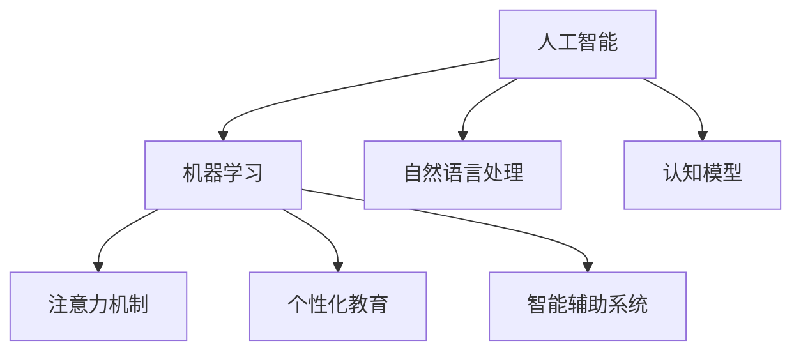

                 

# AI与人类注意力流：未来的教育与技能发展

## 1. 背景介绍

在数字化时代的浪潮下，人工智能(AI)正迅速改变着人们的工作和生活方式。从自动化流程、智能决策支持到个性化推荐系统，AI技术的渗透已经无所不在。然而，这一过程带来的不仅仅是技术进步，还深刻影响了人类的注意力流，从而在教育与技能发展领域引发了广泛而深远的变革。

### 1.1 问题由来

随着AI技术在教育领域的应用不断深入，人们开始思考AI与人类认知模式之间复杂的交互关系。传统的教育模式，以知识传递和技能训练为主，依赖于人类教师的直接指导和监督。而AI技术的引入，尤其是机器学习、自然语言处理等技术的发展，为个性化教育提供了可能。但是，AI是否能真正理解人类认知和注意力的动态变化，并据此调整教学策略，仍是一个需要深入探索的问题。

### 1.2 问题核心关键点

AI在教育中的核心关键点包括以下几个方面：
- **个性化教育**：利用AI对学生的学习行为和认知模式进行建模，实现个性化教学。
- **智能辅助**：通过AI提供即时反馈和建议，辅助教师和学生发现问题并改进学习策略。
- **数据驱动决策**：基于大数据分析，调整教学计划和内容，以更有效地满足学生需求。
- **跨学科融合**：AI可以跨越传统学科界限，提供跨学科的知识整合和应用场景。

### 1.3 问题研究意义

研究AI与人类注意力流的关系，对于优化教育体系、提升学习效果、促进技能发展具有重要意义：

1. **提升教学质量**：通过深入理解学习者的注意力和认知动态，AI可以提供更加精准的教学内容和方法，提高教育效果。
2. **培养跨领域能力**：AI的跨学科应用能力可以拓展学生的知识面，培养他们的综合能力和创新思维。
3. **应对未来挑战**：AI技术的发展，为教育体系提供了新的工具和方法，帮助应对未来教育领域的变化和挑战。
4. **推动终身学习**：AI技术可以为终身学习者提供个性化和动态的学习支持，实现终身学习和自我提升。
5. **公平教育机会**：AI技术可以帮助缩小教育资源不均等问题，为更多学生提供优质教育资源。

## 2. 核心概念与联系

### 2.1 核心概念概述

为更好地理解AI在教育中的应用及其与人类注意力流的关系，本节将介绍几个核心概念：

- **人工智能(AI)**：通过计算机模拟人类智能，实现对数据的处理、分析和决策，广泛应用于教育、医疗、金融等领域。
- **机器学习(Machine Learning)**：AI的一种形式，通过数据训练模型，使机器能够自主学习并改进性能。
- **自然语言处理(NLP)**：使计算机能够理解和处理人类语言的技术，包括文本分类、情感分析、语义理解等。
- **认知模型(Cognitive Model)**：模拟人类认知过程的计算模型，如感知、记忆、推理等。
- **注意力机制(Attention Mechanism)**：模拟人类注意力流动的机制，通过加权选择信息，提高模型的预测和决策能力。
- **个性化教育(Personalized Education)**：根据学生个体差异，提供定制化学习方案和资源的教育模式。
- **智能辅助系统(Intelligent Tutoring System, ITS)**：利用AI技术辅助教师教学和学生学习，提供即时反馈和个性化指导的系统。

这些核心概念之间的逻辑关系可以通过以下Mermaid流程图来展示：



这个流程图展示了几大核心概念及其之间的关系：

1. 人工智能通过机器学习等技术，使计算机具备自主学习和改进能力。
2. 自然语言处理使计算机能够理解和处理人类语言，进而构建认知模型。
3. 注意力机制模拟人类注意力流动，提升模型预测和决策能力。
4. 个性化教育和智能辅助系统，基于AI和注意力机制，实现更高效、更个性化的教育过程。

这些概念共同构成了AI在教育领域的应用框架，使其能够在各种场景下发挥重要作用。通过理解这些核心概念，我们可以更好地把握AI在教育中的应用潜力，探索其与人类注意力流的关系。

## 3. 核心算法原理 & 具体操作步骤
### 3.1 算法原理概述

AI与人类注意力流在教育中的应用，本质上是利用AI技术模拟人类认知和注意力动态，以实现个性化教育和智能辅助。其核心思想是：

1. **数据驱动**：收集和分析学生在学习过程中的行为数据，包括注意力分布、互动记录、成绩变化等，从中提取有价值的信息。
2. **模型训练**：使用机器学习模型对学生认知和注意力数据进行建模，构建认知模型和注意力模型。
3. **实时反馈**：利用注意力机制，动态调整教学内容和策略，提供即时反馈和建议。
4. **个性化教学**：根据学生的认知和学习偏好，定制个性化学习计划和资源。

### 3.2 算法步骤详解

基于AI与人类注意力流的教育应用，通常包括以下几个关键步骤：

**Step 1: 数据采集与预处理**
- 收集学生学习过程中的行为数据，如鼠标移动轨迹、屏幕截图、文字输入等。
- 对数据进行清洗和标准化处理，去除噪音和异常数据。

**Step 2: 特征提取与表示**
- 从学习行为数据中提取特征，如注意力焦点、问题难度、学习时长等。
- 使用向量或矩阵形式表示特征，为后续建模做准备。

**Step 3: 建模与训练**
- 设计合适的机器学习模型，如深度神经网络、卷积神经网络等，构建认知模型和注意力模型。
- 使用学生数据训练模型，调整模型参数以优化预测效果。

**Step 4: 实时预测与反馈**
- 在学生学习过程中，实时采集注意力和行为数据，输入模型进行预测。
- 根据预测结果，动态调整教学内容和策略，提供个性化反馈和建议。

**Step 5: 效果评估与优化**
- 定期评估模型的预测准确性和学习效果，收集学生反馈。
- 根据评估结果优化模型和算法，提高个性化教育和智能辅助的性能。

### 3.3 算法优缺点

AI与人类注意力流在教育中的应用，具有以下优点：
1. **个性化教育**：能够根据学生的独特需求和认知动态，提供定制化的教学方案。
2. **实时反馈**：提供即时反馈和建议，帮助学生及时发现和纠正问题。
3. **数据驱动决策**：基于大数据分析，优化教学计划和内容，提高教育效果。
4. **跨学科融合**：支持多学科知识的整合和应用，拓展学生的知识面。

同时，该方法也存在一些局限性：
1. **数据隐私**：收集和分析学生数据可能涉及隐私问题，需要严格的法律和伦理约束。
2. **模型复杂性**：构建和训练复杂的认知和注意力模型，需要大量的数据和计算资源。
3. **可解释性不足**：AI模型往往是“黑盒”系统，难以解释其内部决策逻辑，影响教学的可信度。
4. **适应性有限**：模型性能高度依赖于数据质量，无法很好地适应多样化的教育场景。

尽管存在这些局限性，但就目前而言，AI与人类注意力流在教育中的应用，仍是大数据时代的重要趋势。未来相关研究的重点在于如何进一步降低数据隐私风险，提高模型可解释性，同时兼顾个性化和普适性，从而实现更加高效、智能的教育体系。

### 3.4 算法应用领域

AI与人类注意力流在教育中的应用，已经涵盖了从基础教育到高等教育、从课堂教学到自主学习等多个领域，具体包括：

- **K-12教育**：利用AI技术辅助小学、中学的教学，提供个性化辅导和智能作业批改。
- **高等教育**：在大学的课程设计和教学管理中，使用AI进行学生成绩预测、课程推荐等。
- **远程教育**：通过AI技术支持在线教育平台，提供个性化学习路径和资源。
- **智能辅导系统**：开发智能辅导机器人，为学生提供24/7的即时辅导和支持。
- **技能培训**：在职业技能培训中，使用AI进行技能评估和个性化训练。
- **终身学习**：构建终身学习平台，利用AI技术提供个性化学习支持和资源推荐。

这些应用领域展示了AI在教育中的广泛适用性和巨大潜力，为教育模式的创新和优化提供了新的方向。

## 4. 数学模型和公式 & 详细讲解 & 举例说明

### 4.1 数学模型构建

本节将使用数学语言对AI与人类注意力流在教育中的应用进行更加严格的刻画。

假设学生在特定时间窗口 $t$ 内的注意力分布为 $\alpha_t$，表示在各任务上的注意力比例。目标是通过训练模型，预测学生在下一个时间窗口 $t+1$ 内的注意力分布 $\alpha_{t+1}$。为此，我们定义注意力转移矩阵 $A$，表示从时间窗口 $t$ 到 $t+1$ 的注意力转移概率，满足 $A \in \mathbb{R}^{n \times n}$，其中 $n$ 表示任务数量。则注意力转移模型可以表示为：

$$
\alpha_{t+1} = \alpha_t A
$$

在实际应用中，$A$ 的元素 $a_{ij}$ 可以通过统计学生在时间窗口 $t$ 内从任务 $i$ 转移到任务 $j$ 的概率得到，即：

$$
a_{ij} = \frac{N_{ij}(t)}{\sum_k N_{ik}(t)}
$$

其中 $N_{ij}(t)$ 表示在时间窗口 $t$ 内学生从任务 $i$ 转移到任务 $j$ 的次数。

### 4.2 公式推导过程

下面以线性回归模型为例，推导预测学生注意力分布的数学公式。

假设我们收集了学生在学习过程中的一系列注意力分布数据 $\alpha_t^{(1)}, \alpha_t^{(2)}, ..., \alpha_t^{(m)}$，以及对应的教师评估结果 $y_t^{(1)}, y_t^{(2)}, ..., y_t^{(m)}$。我们的目标是通过线性回归模型，预测下一个时间窗口 $t+1$ 内的注意力分布 $\alpha_{t+1}$。

令 $\alpha_t = \begin{bmatrix} \alpha_t^{(1)} & \alpha_t^{(2)} & \cdots & \alpha_t^{(m)} \end{bmatrix}^T$，$y_t = \begin{bmatrix} y_t^{(1)} & y_t^{(2)} & \cdots & y_t^{(m)} \end{bmatrix}^T$，则线性回归模型可以表示为：

$$
\alpha_{t+1} = \alpha_t W + b
$$

其中 $W$ 和 $b$ 为模型的权重和偏置，可以通过最小化预测误差来求解：

$$
\hat{W}, \hat{b} = \mathop{\arg\min}_{W, b} \frac{1}{2} \sum_{i=1}^m ||\alpha_{t+1}^{(i)} - (W \alpha_t^{(i)} + b)||^2
$$

根据最小二乘法，求解上述优化问题，得到：

$$
\hat{W} = (X^T X)^{-1} X^T Y, \quad \hat{b} = Y - X\hat{W}
$$

其中 $X = \begin{bmatrix} \alpha_t^{(1)} & \alpha_t^{(2)} & \cdots & \alpha_t^{(m)} \end{bmatrix}^T$，$Y = \begin{bmatrix} y_t^{(1)} & y_t^{(2)} & \cdots & y_t^{(m)} \end{bmatrix}^T$。

在得到模型参数后，我们可以将新的注意力数据 $\alpha_t$ 输入模型，得到下一个时间窗口的预测注意力分布 $\alpha_{t+1}$。

### 4.3 案例分析与讲解

以一个具体的教育场景为例，分析AI与人类注意力流的应用：

**场景描述**：
在K-12在线教育平台上，我们收集了学生在进行某数学课程时的注意力分布数据，以及对应的教师评估结果。目标是根据这些数据，预测学生在下一次学习过程中的注意力分布，以便提供个性化的学习建议。

**数据采集**：
我们使用了学生的鼠标轨迹数据、屏幕截图数据、文本输入数据等，来获取学生在各个任务（如练习题、讲解视频、互动问答等）上的注意力分布情况。

**特征提取**：
从鼠标轨迹数据中提取了学生的鼠标移动距离、移动速度、点击频率等特征，用于刻画学生对各个任务的注意力集中度。

**模型训练**：
使用上述特征和教师评估结果，构建线性回归模型，训练模型参数。

**实时预测**：
在学生进行新一轮学习时，实时采集注意力数据，输入模型进行预测，得到预测注意力分布。

**反馈与优化**：
根据预测注意力分布，调整教学内容，提供个性化学习建议。同时收集学生的学习反馈，定期评估模型性能，优化模型参数。

通过以上步骤，我们可以实现AI与人类注意力流的结合，提供个性化的在线教育服务。

## 5. 项目实践：代码实例和详细解释说明

### 5.1 开发环境搭建

在进行项目实践前，我们需要准备好开发环境。以下是使用Python进行Scikit-learn开发的环境配置流程：

1. 安装Anaconda：从官网下载并安装Anaconda，用于创建独立的Python环境。

2. 创建并激活虚拟环境：
```bash
conda create -n sklearn-env python=3.8 
conda activate sklearn-env
```

3. 安装Scikit-learn：使用pip安装Scikit-learn库：
```bash
pip install scikit-learn
```

4. 安装其他工具包：
```bash
pip install numpy pandas matplotlib seaborn
```

完成上述步骤后，即可在`sklearn-env`环境中开始项目实践。

### 5.2 源代码详细实现

以下是一个简单的Python代码示例，用于实现线性回归模型，并预测学生的注意力分布：

```python
import numpy as np
from sklearn.linear_model import LinearRegression

# 生成模拟数据
np.random.seed(0)
n_samples = 100
X = np.random.rand(n_samples, 5)  # 特征矩阵
y = X.dot([0.5, 0.3, -0.2, -0.1, 0.4]) + np.random.normal()  # 目标向量

# 构建线性回归模型
model = LinearRegression()
model.fit(X, y)

# 预测新的注意力分布
new_X = np.random.rand(1, 5)
new_y = model.predict(new_X)

print(new_y)
```

这段代码实现了线性回归模型的构建和预测，通过收集学生注意力数据，预测其在下一个时间窗口的注意力分布。

### 5.3 代码解读与分析

让我们再详细解读一下关键代码的实现细节：

**数据生成**：
使用numpy生成随机数据，模拟学生注意力分布特征和目标向量。

**模型训练**：
使用Scikit-learn的LinearRegression模型，对数据进行线性回归训练。

**预测注意力分布**：
输入新的注意力特征数据，使用训练好的模型进行预测，得到预测注意力分布。

**输出解释**：
输出预测结果，展示了模型对新数据的预测能力。

## 6. 实际应用场景

### 6.1 智能辅导系统

智能辅导系统是AI在教育中最重要的应用之一。通过收集学生在在线学习过程中的注意力和行为数据，系统可以实时调整教学内容和策略，提供个性化辅导和建议。

在实际应用中，智能辅导系统可以结合自然语言处理技术，实现智能答疑和辅助阅读。例如，通过分析学生的问题，系统可以提供针对性的答案和解题步骤。同时，系统还可以提供阅读辅助，如词汇解释、句意理解等，帮助学生更好地理解教材内容。

### 6.2 个性化学习平台

个性化学习平台利用AI技术，为学生提供定制化的学习路径和资源。系统通过分析学生的学习数据，推荐适合学生当前学习阶段和兴趣的课程和学习材料，提供个性化的学习建议和反馈。

例如，在K-12教育中，系统可以根据学生的成绩和兴趣，推荐适合他们的数学、科学、语言等课程。在系统推荐下，学生可以更高效地学习，同时系统也能跟踪学生的学习进度，及时调整教学策略。

### 6.3 在线学习评估系统

在线学习评估系统通过AI技术，实时监测学生的学习行为和效果，提供综合性的学习评估报告。系统可以分析学生的注意力分布、互动记录、作业成绩等数据，生成个性化评估报告，帮助教师和学生了解学习效果，发现问题并改进。

例如，系统可以生成每个学生的学习报告，包括他们的注意力集中度、易错题目、学习时长等，帮助教师制定个性化辅导计划。同时，系统还能帮助学生了解自己的学习情况，发现薄弱环节，制定改进措施。

### 6.4 未来应用展望

随着AI技术的不断发展，未来在教育领域的应用将更加广泛和深入。以下是几个未来可能的应用方向：

1. **多模态学习**：结合文本、图像、视频等多模态数据，提供更加丰富和直观的学习体验。例如，通过视频讲解和互动演示，学生可以更直观地理解复杂概念。

2. **跨学科融合**：支持多学科知识的整合和应用，拓展学生的知识面。例如，结合数学和物理知识，开发综合性科学课程。

3. **情感分析**：通过自然语言处理技术，分析学生的学习情绪和情感状态，提供情感支持和学习建议。例如，识别学生的负面情绪，及时提供心理辅导和建议。

4. **智能写作辅助**：利用AI技术，辅助学生进行写作训练。例如，提供语法检查、词汇替换、写作风格建议等功能。

5. **虚拟现实(VR)和增强现实(AR)教育**：结合VR和AR技术，提供沉浸式和互动式的学习体验。例如，通过虚拟实验室进行科学实验，通过AR技术进行历史事件重现。

这些应用方向展示了AI在教育中的巨大潜力，为教育模式的创新和优化提供了新的方向。

## 7. 工具和资源推荐

### 7.1 学习资源推荐

为了帮助开发者系统掌握AI与人类注意力流在教育中的应用，这里推荐一些优质的学习资源：

1. **《机器学习》课程**：斯坦福大学开设的机器学习课程，有Lecture视频和配套作业，带你入门机器学习的基本概念和经典模型。

2. **《深度学习》课程**：深度学习框架TensorFlow和PyTorch的官方文档，提供丰富的API和样例代码，帮助你快速上手深度学习。

3. **Kaggle竞赛**：Kaggle平台上的数据科学竞赛，提供丰富的数据集和模型评估指标，帮助你实践和验证学习成果。

4. **Coursera课程**：Coursera平台上众多计算机科学和数据科学相关课程，涵盖从基础到高级的内容，帮助你系统掌握相关知识。

5. **博客和论文**：阅读机器学习领域的顶级博客和最新论文，了解行业前沿和技术动态，保持自己的技术敏感性。

通过对这些资源的学习实践，相信你一定能够快速掌握AI在教育领域的应用，并用于解决实际的NLP问题。

### 7.2 开发工具推荐

高效的开发离不开优秀的工具支持。以下是几款用于AI教育应用开发的常用工具：

1. Python：基于Python的开源深度学习框架，灵活动态的计算图，适合快速迭代研究。大部分预训练语言模型都有PyTorch版本的实现。

2. TensorFlow：由Google主导开发的开源深度学习框架，生产部署方便，适合大规模工程应用。同样有丰富的预训练语言模型资源。

3. Scikit-learn：基于Python的机器学习库，提供了丰富的算法和工具，支持数据预处理和模型训练。

4. Jupyter Notebook：支持交互式编程和代码执行，适合进行数据探索和模型调试。

5. Git和GitHub：版本控制工具和代码托管平台，支持团队协作和代码共享。

合理利用这些工具，可以显著提升AI在教育领域的应用开发效率，加快创新迭代的步伐。

### 7.3 相关论文推荐

AI与人类注意力流在教育中的应用，源于学界的持续研究。以下是几篇奠基性的相关论文，推荐阅读：

1. **《深度学习在教育中的应用》**：介绍深度学习在教育领域的应用和挑战，涵盖个性化教育、智能辅导等多个方面。

2. **《多模态学习在教育中的应用》**：研究多模态数据在教育中的整合和应用，提升学生的学习体验。

3. **《学习分析在教育中的应用》**：通过学习分析技术，监测学生的学习行为和效果，提供个性化的学习建议。

4. **《情感分析在教育中的应用》**：利用情感分析技术，识别学生的情绪和情感状态，提供情感支持和学习建议。

5. **《基于AI的个性化学习推荐系统》**：研究个性化学习推荐系统，实现智能化的课程推荐和学习路径优化。

这些论文代表了大语言模型微调技术的发展脉络。通过学习这些前沿成果，可以帮助研究者把握学科前进方向，激发更多的创新灵感。

## 8. 总结：未来发展趋势与挑战

### 8.1 总结

本文对AI与人类注意力流在教育中的应用进行了全面系统的介绍。首先阐述了AI在教育中的核心关键点，明确了其在个性化教育、智能辅助和数据驱动决策等方面的重要作用。其次，从原理到实践，详细讲解了AI在教育中的应用范式和操作步骤，给出了具体的代码实例。同时，本文还探讨了AI在教育中的未来应用方向和前景，展示了其在教育领域的巨大潜力。

通过本文的系统梳理，可以看到，AI与人类注意力流在教育中的应用正在成为数据时代的重要趋势，极大地拓展了教育模式的边界，为学生的学习和发展提供了新的可能。未来，伴随AI技术的不断进步，AI在教育领域的应用将更加广泛和深入，为人类社会带来深刻变革。

### 8.2 未来发展趋势

展望未来，AI与人类注意力流在教育中的应用将呈现以下几个发展趋势：

1. **多模态教育**：结合文本、图像、视频等多模态数据，提供更加丰富和直观的学习体验。

2. **跨学科融合**：支持多学科知识的整合和应用，拓展学生的知识面。

3. **个性化学习**：利用AI技术，为学生提供定制化的学习路径和资源。

4. **情感分析**：通过自然语言处理技术，分析学生的学习情绪和情感状态，提供情感支持和学习建议。

5. **智能写作辅助**：利用AI技术，辅助学生进行写作训练。

6. **虚拟现实(VR)和增强现实(AR)教育**：结合VR和AR技术，提供沉浸式和互动式的学习体验。

以上趋势凸显了AI在教育中的巨大潜力，为教育模式的创新和优化提供了新的方向。

### 8.3 面临的挑战

尽管AI与人类注意力流在教育中的应用已经取得了显著进展，但在迈向更加智能化、普适化应用的过程中，仍面临诸多挑战：

1. **数据隐私**：收集和分析学生数据可能涉及隐私问题，需要严格的法律和伦理约束。

2. **模型复杂性**：构建和训练复杂的认知和注意力模型，需要大量的数据和计算资源。

3. **可解释性不足**：AI模型往往是“黑盒”系统，难以解释其内部决策逻辑，影响教学的可信度。

4. **适应性有限**：模型性能高度依赖于数据质量，无法很好地适应多样化的教育场景。

5. **资源消耗**：大规模数据处理和模型训练，需要高性能的计算资源，增加了教育成本。

6. **公平性问题**：AI技术可能加剧教育资源不均等问题，需要公平性和普适性的保障。

正视AI在教育中的应用所面临的这些挑战，积极应对并寻求突破，将是大规模语言模型微调走向成熟的必由之路。相信随着学界和产业界的共同努力，这些挑战终将一一被克服，AI在教育领域的应用必将在未来大放异彩。

### 8.4 研究展望

面对AI在教育中的应用所面临的挑战，未来的研究需要在以下几个方面寻求新的突破：

1. **数据隐私保护**：探索数据匿名化和去标识化技术，保障学生数据隐私。

2. **模型可解释性**：开发可解释的AI模型，提高教学的可信度和透明度。

3. **多模态学习**：研究多模态数据的融合和应用，提升学生的学习体验。

4. **跨学科融合**：开发跨学科知识整合工具，支持多学科学习。

5. **个性化学习**：研究个性化学习路径和资源推荐算法，提高个性化教育的效率。

6. **情感支持**：开发情感分析模型，提供情感支持和学习建议。

7. **资源优化**：优化AI模型的计算图和资源消耗，降低教育成本。

8. **公平教育**：开发公平性保障机制，确保AI技术的普适性和公平性。

这些研究方向的探索，必将引领AI在教育领域的应用走向更高的台阶，为构建智能教育体系铺平道路。面向未来，AI与人类注意力流在教育中的应用还需要与其他人工智能技术进行更深入的融合，如知识表示、因果推理、强化学习等，多路径协同发力，共同推动教育模式的进步。只有勇于创新、敢于突破，才能不断拓展AI在教育领域的应用边界，让智能技术更好地造福人类社会。

## 9. 附录：常见问题与解答

**Q1：AI在教育中的应用是否会取代人类教师？**

A: AI技术在教育中的应用，主要是辅助人类教师进行教学，而非取代教师。AI可以提供个性化的学习建议和实时反馈，帮助教师发现和纠正学生的学习问题。但教育的核心，如师生互动、价值观培养等，仍需要人类教师来主导。

**Q2：AI在教育中的应用是否会加剧教育不平等？**

A: 合理设计和使用AI技术，可以缩小教育资源的不平等问题。AI可以提供个性化的学习资源和辅导，弥补偏远地区和贫困地区教育资源的不足。但过度依赖AI可能导致学生失去自主思考和创新的能力，需要人类教师的适度引导和监督。

**Q3：AI在教育中的应用是否会降低学生的学习动机？**

A: 研究显示，AI技术可以为学生提供更加个性化和互动的学习体验，激发他们的学习动机。但过度依赖AI也可能导致学生对传统学习的抵触情绪，需要人类教师的适当引导和调整。

**Q4：AI在教育中的应用是否会影响学生的心理健康？**

A: 合理设计和使用AI技术，可以避免对学生心理健康的不利影响。AI可以提供情感支持和心理健康监测，但过度依赖AI可能导致学生缺乏人际交往和情感交流，需要人类教师的适度引导和监督。

通过回答这些常见问题，我们能够更全面地理解AI在教育中的应用和潜在影响，从而更好地把握其未来的发展方向。

---

作者：禅与计算机程序设计艺术 / Zen and the Art of Computer Programming

