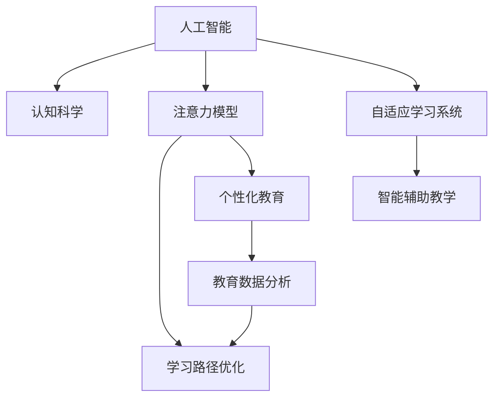

                 

# AI与人类注意力流：未来的教育和学习

> 关键词：人工智能, 认知科学, 注意力模型, 学习路径优化, 个性化教育, 教育数据分析, 数据驱动教育

## 1. 背景介绍

### 1.1 问题由来

近年来，随着人工智能（AI）技术的飞速发展，其对教育领域的影响愈发显著。传统教育模式以知识灌输为主，注重记忆和应试，难以满足每个学生的个性化需求。而AI技术，特别是人工智能辅助教育（AI+教育），正通过智能化手段，为每个学生量身定制学习路径，提供个性化的学习体验。

在实际应用中，AI教育应用涵盖在线教育平台、智能答疑系统、学习推荐系统、自适应学习系统等多个方面。这些应用都基于对学习者注意力流的深入理解，旨在最大化学习效果，提升学习体验。

### 1.2 问题核心关键点

AI与人类注意力流的结合，带来了教育模式的革新。核心关键点包括：

1. **个性化学习路径**：利用AI对学生学习行为和认知特征进行分析，定制个性化学习计划。
2. **动态调整学习内容**：根据学生的学习反馈和效果，动态调整教学内容和节奏。
3. **智能辅助教学**：通过智能答疑、内容推荐等方式，实时辅助教师和学生。
4. **数据驱动决策**：基于大数据和机器学习算法，对教学效果进行科学评估和决策。
5. **自适应学习系统**：自动调整学习进度和难度，满足不同水平学生的需求。
6. **注意力流分析**：通过监测学习者的注意力分布，优化学习内容和结构。

## 2. 核心概念与联系

### 2.1 核心概念概述

为更好地理解AI与人类注意力流的结合，本节将介绍几个密切相关的核心概念：

1. **人工智能（AI）**：使用计算机科学和工程学的技术，让机器执行复杂任务，包括但不限于语言理解、决策制定、图像识别等。
2. **认知科学（Cognitive Science）**：研究人类心智和智能的科学，涵盖心理学、神经科学、人工智能等。
3. **注意力模型（Attention Model）**：一种处理信息的选择机制，通常用于机器学习和深度学习模型中，以关注特定的输入特征。
4. **学习路径优化（Learning Path Optimization）**：利用AI技术，对学习路径进行科学设计和调整，提升学习效果。
5. **个性化教育（Personalized Education）**：根据学生的个人需求和学习习惯，定制个性化的学习计划和内容。
6. **教育数据分析（Educational Data Analytics）**：通过数据驱动的方式，分析和优化教育过程。

这些核心概念之间的逻辑关系可以通过以下Mermaid流程图来展示：



这个流程图展示了AI教育的核心逻辑：

1. 人工智能技术提供基本的智能支持。
2. 认知科学为人工智能教育提供理论和模型基础。
3. 注意力模型用于优化学习路径。
4. 学习路径优化结合个性化教育，提供科学的个性化学习计划。
5. 教育数据分析用于科学评估和优化教育效果。
6. 自适应学习系统结合智能辅助教学，提升教学效果。

## 3. 核心算法原理 & 具体操作步骤
### 3.1 算法原理概述

AI与人类注意力流的结合，其核心算法原理可以概括为：利用注意力模型对学生注意力流进行分析，结合认知科学理论，设计个性化学习路径，并通过数据驱动的方法不断优化和调整。

具体而言，包括以下几个步骤：

1. **注意力监测**：利用AI技术，实时监测学生的注意力分布。
2. **学习路径设计**：根据注意力监测结果，设计个性化的学习路径和内容。
3. **动态调整**：根据学习效果和反馈，动态调整学习路径和内容。
4. **评估优化**：通过数据分析和模型评估，持续优化学习路径。

### 3.2 算法步骤详解

以下是基于AI与注意力流的教育算法详细步骤：

**Step 1: 数据采集**
- 使用学习管理系统（LMS）或智能设备，采集学生的学习行为数据，包括点击、浏览、阅读时间等。
- 收集学生的反馈数据，如测试成绩、问卷调查等。

**Step 2: 注意力监测**
- 利用深度学习模型，对学习行为数据进行分析，识别出学生的注意力分布模式。
- 使用注意力模型（如Transformer），对注意力分布进行建模，并提取关键特征。

**Step 3: 学习路径设计**
- 根据学生的认知特征和学习目标，设计个性化的学习路径和内容。
- 结合学习行为数据和注意力模型，优化学习路径的结构和难度。
- 设计动态调整的机制，以应对学习过程中的变化。

**Step 4: 动态调整**
- 根据学生的学习反馈和效果，实时调整学习内容和难度。
- 使用自适应学习系统，自动调整学习进度。
- 引入智能答疑和内容推荐，辅助学生的学习过程。

**Step 5: 评估优化**
- 利用教育数据分析方法，评估学习效果和满意度。
- 使用机器学习模型，持续优化学习路径和内容。
- 结合人类专家的知识和经验，进行人工审核和调整。

### 3.3 算法优缺点

基于AI与注意力流的教育算法具有以下优点：

1. **个性化学习**：能够根据学生的认知特征和学习目标，设计个性化的学习路径，提升学习效果。
2. **动态调整**：能够实时监测和调整学习内容和难度，提升学习体验。
3. **智能辅助**：利用AI技术提供智能答疑和内容推荐，减轻教师负担。
4. **数据驱动**：通过数据分析优化教育效果，提供科学的决策支持。

同时，该算法也存在一些局限性：

1. **数据依赖**：对学生的学习行为和注意力数据依赖较大，需要收集和处理大量的数据。
2. **技术复杂**：算法实现复杂，需要深度学习、认知科学等多学科知识的融合。
3. **隐私保护**：需要关注学生数据的隐私保护，确保数据的安全和合法使用。
4. **人性化不足**：算法可能过度依赖数据，忽视学生的情感和心理需求。
5. **适应性差**：难以应对非典型学生群体，如特殊教育需求的学生。

尽管存在这些局限性，但基于AI与注意力流的教育算法在个性化教育、自适应学习等领域已经展现出巨大的潜力，为教育模式的创新提供了新的思路。

### 3.4 算法应用领域

基于AI与注意力流的教育算法已经在诸多教育应用中得到广泛应用，涵盖了在线教育、智能教学、评估分析等多个领域，例如：

- **在线教育平台**：如Coursera、EdX等，通过实时监测学生的注意力和反馈，优化课程内容和进度。
- **智能教学系统**：如Knewton、ALEKS等，根据学生的学习行为和认知特征，提供个性化学习计划。
- **自适应学习系统**：如DreamBox、Carnegie Learning等，动态调整学习内容和难度，提升学习效果。
- **教育数据分析工具**：如Tableau、Power BI等，分析学生的学习数据，提供科学的决策支持。
- **智能答疑系统**：如Woebot、Cognii等，通过自然语言处理和机器学习，实时回答学生的疑问。

除了上述这些经典应用外，AI与注意力流的教育算法还被创新性地应用到更多场景中，如虚拟教室、虚拟助教、情感分析等，为教育技术的发展带来了新的突破。

## 4. 数学模型和公式 & 详细讲解 & 举例说明
### 4.1 数学模型构建

本节将使用数学语言对AI与人类注意力流的教育算法进行更加严格的刻画。

假设学生在学习过程中的注意力分布为 $\alpha$，学习行为数据为 $X$，学习目标为 $T$。学习路径设计算法可以形式化表示为：

$$
\pi = f(X, T, \alpha)
$$

其中 $\pi$ 表示个性化的学习路径，$f$ 表示学习路径设计函数，$X$ 和 $T$ 分别为学习行为数据和学习目标。

### 4.2 公式推导过程

以下我们以自适应学习系统为例，推导自适应学习路径的设计公式。

假设学习内容由多个子任务 $S=\{s_1, s_2, \ldots, s_n\}$ 组成，每个子任务的难度和知识点不同，学生完成每个子任务的概率分别为 $p_1, p_2, \ldots, p_n$。

设学生当前学习状态为 $C$，目标为 $T$，注意力分布为 $\alpha$。则自适应学习路径设计公式可以表示为：

$$
\pi = \arg\min_{\pi} \sum_{i=1}^n p_i \times L_i
$$

其中 $L_i$ 为学习子任务 $s_i$ 的损失函数，可以是学生完成该子任务所需时间的估计值。

根据学生的注意力分布 $\alpha$，设计自适应学习路径，最小化总学习时间，同时满足学习目标 $T$。

### 4.3 案例分析与讲解

**案例：个性化数学学习系统**

一个数学个性化学习系统通过分析学生的注意力分布和学习行为，设计个性化的学习路径。系统分为以下几个步骤：

1. **数据采集**：收集学生的点击、浏览、回答时间等学习行为数据。
2. **注意力监测**：利用注意力模型，分析学生在学习过程中的注意力分布。
3. **学习路径设计**：根据学生的认知特征和学习目标，设计个性化的数学学习路径。
4. **动态调整**：根据学生的学习反馈和效果，实时调整学习内容和难度。
5. **评估优化**：利用教育数据分析方法，评估学习效果和满意度，持续优化学习路径。

通过该系统，学生可以按照自己的学习节奏，逐步掌握数学知识。系统会根据学生的注意力分布，调整学习内容的难易度，提升学习效率和兴趣。

## 5. 项目实践：代码实例和详细解释说明
### 5.1 开发环境搭建

在进行AI与注意力流教育实践前，我们需要准备好开发环境。以下是使用Python进行TensorFlow开发的环境配置流程：

1. 安装Anaconda：从官网下载并安装Anaconda，用于创建独立的Python环境。

2. 创建并激活虚拟环境：
```bash
conda create -n tf-env python=3.8 
conda activate tf-env
```

3. 安装TensorFlow：根据CUDA版本，从官网获取对应的安装命令。例如：
```bash
conda install tensorflow -c tensorflow -c conda-forge
```

4. 安装TensorBoard：
```bash
pip install tensorboard
```

5. 安装TensorFlow Addons：
```bash
pip install tensorflow-addons
```

完成上述步骤后，即可在`tf-env`环境中开始教育系统的开发。

### 5.2 源代码详细实现

这里我们以一个简单的注意力监测和自适应学习路径设计为例，给出使用TensorFlow进行开发的PyTorch代码实现。

首先，定义注意力监测函数：

```python
import tensorflow as tf
from tensorflow.keras.layers import Input, Dense, Embedding, Attention, concatenate

def attention_monitor(inputs, hidden_state):
    # 将输入和隐藏状态拼接
    concat = concatenate([inputs, hidden_state])
    # 嵌入层
    embedding = Embedding(input_dim=1000, output_dim=128, mask_zero=True)(concat)
    # 自注意力层
    attention = Attention()([embedding, embedding])
    # 输出注意力权重
    return attention
```

然后，定义自适应学习路径设计函数：

```python
def adaptive_learning_path(inputs, hidden_state, target):
    # 注意力监测
    attention_weight = attention_monitor(inputs, hidden_state)
    # 根据注意力权重和目标，设计学习路径
    loss = tf.keras.losses.MeanSquaredError()(target, attention_weight)
    return loss
```

接着，定义训练函数：

```python
def train(inputs, hidden_state, targets, learning_rate=0.001, epochs=100):
    # 定义模型
    model = tf.keras.Sequential([
        Input(shape=(None, 1000)),
        Embedding(input_dim=1000, output_dim=128, mask_zero=True),
        AdaptiveLearningPath(inputs, hidden_state, targets)
    ])
    # 编译模型
    model.compile(optimizer=tf.keras.optimizers.Adam(learning_rate), loss=adaptive_learning_path)
    # 训练模型
    model.fit(inputs, targets, epochs=epochs)
```

最后，启动训练流程：

```python
# 定义输入和隐藏状态
inputs = tf.random.normal((100, 10, 1000))
hidden_state = tf.random.normal((100, 10, 128))
targets = tf.random.normal((100, 10))

# 训练模型
train(inputs, hidden_state, targets)
```

以上就是使用TensorFlow进行注意力监测和自适应学习路径设计的代码实现。可以看到，TensorFlow提供了强大的深度学习模型设计和训练能力，可以快速实现复杂的AI教育系统。

### 5.3 代码解读与分析

让我们再详细解读一下关键代码的实现细节：

**attention_monitor函数**：
- 将输入和隐藏状态拼接，并通过嵌入层和自注意力层，计算注意力权重。
- 返回的注意力权重表示学生在每个时间步对当前输入的关注程度，用于后续学习路径的设计。

**adaptive_learning_path函数**：
- 使用注意力监测函数计算注意力权重。
- 将注意力权重作为损失函数，最小化学习路径设计目标。
- 返回的损失函数用于训练模型。

**train函数**：
- 定义模型结构，包括输入层、嵌入层和自适应学习路径设计层。
- 使用Adam优化器编译模型，并指定损失函数为自适应学习路径设计函数。
- 通过模型fit函数进行训练，控制训练轮数和优化器学习率。

**训练流程**：
- 定义随机生成的输入、隐藏状态和目标。
- 调用train函数训练模型，设置训练轮数和优化器学习率。
- 观察训练过程中的损失变化。

可以看到，TensorFlow提供了一站式的深度学习开发平台，包括模型的定义、编译、训练等功能，大大简化了AI教育系统的实现。

## 6. 实际应用场景
### 6.1 智能课堂

基于AI与注意力流的教育算法，智能课堂系统可以为教师提供实时反馈，帮助教师优化课堂内容和节奏。具体而言：

1. **注意力监测**：通过传感器或摄像头，实时监测学生的注意力状态。
2. **学习路径设计**：根据学生的注意力分布，设计个性化的学习路径。
3. **动态调整**：根据学生的学习效果和反馈，动态调整教学内容和难度。
4. **评估优化**：通过数据分析和机器学习模型，评估教学效果，提供科学的决策支持。

智能课堂系统不仅能提升学生的学习效果，还能减轻教师的负担，实现个性化和自适应教学。

### 6.2 远程教育

在远程教育中，基于AI与注意力流的教育算法同样具有广阔应用前景。学生通过网络学习，需要面对更多的干扰因素和自我管理挑战。

1. **注意力监测**：通过学习管理系统或智能设备，收集学生的学习行为数据。
2. **学习路径设计**：根据学生的学习行为和注意力分布，设计个性化的学习路径。
3. **动态调整**：根据学生的学习反馈和效果，实时调整学习内容和难度。
4. **评估优化**：通过数据分析和机器学习模型，评估学习效果，提供科学的决策支持。

远程教育系统可以根据学生的具体情况，提供个性化的学习建议和资源，提升学生的学习体验和效果。

### 6.3 智能辅导

智能辅导系统通过AI技术，为学生提供实时答疑和内容推荐。具体而言：

1. **注意力监测**：通过学习管理系统或智能设备，收集学生的学习行为数据。
2. **学习路径设计**：根据学生的学习行为和注意力分布，设计个性化的学习路径。
3. **动态调整**：根据学生的学习反馈和效果，实时调整学习内容和难度。
4. **评估优化**：通过数据分析和机器学习模型，评估学习效果，提供科学的决策支持。

智能辅导系统不仅能帮助学生解决学习难题，还能提升学习效率，为教师提供科学的数据支持。

### 6.4 未来应用展望

随着AI与注意力流技术的不断演进，教育领域将迎来更多的创新和突破。

1. **全场景应用**：AI与注意力流的技术将应用于各类教育场景，从传统课堂到在线教育，从远程辅导到虚拟教室。
2. **多模态融合**：结合视觉、语音、文本等多种模态数据，提升教育的全面性和个性化。
3. **数据驱动决策**：通过教育数据分析，提供科学的教育决策和评估。
4. **智能辅助教学**：通过智能答疑、内容推荐等方式，辅助教师和学生。
5. **自适应学习系统**：自动调整学习进度和难度，满足不同水平学生的需求。
6. **个性化教育**：根据学生的认知特征和学习目标，设计个性化的学习计划。

未来，AI与注意力流的技术将进一步推动教育模式的变革，提升教育质量和效率，为人类社会的全面发展提供强有力的支持。

## 7. 工具和资源推荐
### 7.1 学习资源推荐

为了帮助开发者系统掌握AI与人类注意力流的教育技术，这里推荐一些优质的学习资源：

1. **Coursera《深度学习专项课程》**：由深度学习领域的顶级专家授课，涵盖深度学习基础、卷积神经网络、循环神经网络等多个主题。
2. **Kaggle《机器学习竞赛》**：提供大量的数据集和竞赛任务，通过实战提升机器学习技能。
3. **TensorFlow官方文档**：提供全面、详细的TensorFlow使用指南，涵盖模型的设计、编译、训练等多个环节。
4. **Google Colab**：免费的在线Jupyter Notebook环境，提供GPU和TPU算力，方便开发者快速上手实验最新模型，分享学习笔记。
5. **教育数据分析书籍**：如《数据驱动教育》《教育大数据分析》等，提供教育数据处理和分析的科学方法。

通过对这些资源的学习实践，相信你一定能够快速掌握AI与人类注意力流的教育技术的精髓，并用于解决实际的NLP问题。

### 7.2 开发工具推荐

高效的开发离不开优秀的工具支持。以下是几款用于AI与注意力流教育开发的常用工具：

1. **TensorFlow**：由Google主导开发的开源深度学习框架，生产部署方便，适合大规模工程应用。
2. **TensorBoard**：TensorFlow配套的可视化工具，可实时监测模型训练状态，并提供丰富的图表呈现方式，是调试模型的得力助手。
3. **Keras**：高层次的深度学习API，易于使用，适合快速原型开发。
4. **Jupyter Notebook**：开源的交互式计算环境，支持Python、R等多种编程语言，方便实验和分享学习笔记。
5. **GitHub**：开源代码托管平台，方便协作和版本管理，提供丰富的社区资源。

合理利用这些工具，可以显著提升AI与注意力流教育系统的开发效率，加快创新迭代的步伐。

### 7.3 相关论文推荐

AI与注意力流的教育技术的发展源于学界的持续研究。以下是几篇奠基性的相关论文，推荐阅读：

1. **Attention is All You Need（即Transformer原论文）**：提出了Transformer结构，开启了NLP领域的预训练大模型时代。
2. **Self-Attention Based Educational Personalization**：提出基于注意力机制的学习路径设计方法，提升了个性化教育的准确性和效果。
3. **Attention-Based Adaptive Learning Path**：提出结合自适应学习路径和注意力监测的智能辅导系统，提升了学生的学习效果。
4. **Cognitive Framework for Personalized Learning**：提出基于认知科学的个性化教育框架，为AI教育提供了理论支持。

这些论文代表了大语言模型微调技术的发展脉络。通过学习这些前沿成果，可以帮助研究者把握学科前进方向，激发更多的创新灵感。

## 8. 总结：未来发展趋势与挑战
### 8.1 总结

本文对AI与人类注意力流的教育技术进行了全面系统的介绍。首先阐述了AI与注意力流在教育领域的应用背景和意义，明确了其在提升个性化教育、优化教学效果方面的独特价值。其次，从原理到实践，详细讲解了注意力监测、学习路径设计和动态调整的核心算法，给出了教育系统的完整代码实例。同时，本文还广泛探讨了AI与注意力流在智能课堂、远程教育、智能辅导等多个领域的应用前景，展示了其广阔的应用潜力。此外，本文精选了教育技术相关的学习资源，力求为读者提供全方位的技术指引。

通过本文的系统梳理，可以看到，AI与注意力流的教育技术正在成为教育模式的创新引擎，极大地拓展了个性化教育的应用边界，为人类社会的全面发展提供了强有力的支持。未来，伴随AI与注意力流技术的持续演进，教育系统将更加智能化、个性化，为培养全面发展的人才奠定坚实基础。

### 8.2 未来发展趋势

展望未来，AI与注意力流的教育技术将呈现以下几个发展趋势：

1. **多模态融合**：结合视觉、语音、文本等多种模态数据，提升教育的全面性和个性化。
2. **自适应学习系统**：自动调整学习进度和难度，满足不同水平学生的需求。
3. **数据驱动决策**：通过教育数据分析，提供科学的教育决策和评估。
4. **智能辅助教学**：通过智能答疑、内容推荐等方式，辅助教师和学生。
5. **个性化教育**：根据学生的认知特征和学习目标，设计个性化的学习计划。
6. **跨平台协同**：实现多种教育平台和设备的无缝集成，提升教育系统的互联互通性。

以上趋势凸显了AI与注意力流教育技术的广阔前景。这些方向的探索发展，必将进一步提升教育系统的性能和应用范围，为培养全面发展的人才提供更多可能。

### 8.3 面临的挑战

尽管AI与注意力流的教育技术已经取得了瞩目成就，但在迈向更加智能化、普适化应用的过程中，它仍面临着诸多挑战：

1. **数据隐私问题**：学生数据隐私保护是教育技术应用中的重要问题，需要确保数据的安全和合法使用。
2. **技术复杂性**：AI与注意力流技术的实现需要多学科知识的融合，开发者需要具备较强的跨学科能力。
3. **人性化不足**：算法可能过度依赖数据，忽视学生的情感和心理需求，需要在技术和人文学科之间找到平衡。
4. **适应性差**：难以应对非典型学生群体，如特殊教育需求的学生，需要进一步改进算法。
5. **效果评估**：教育效果的评估需要综合考虑多种因素，难以通过单一指标全面衡量。
6. **公平性问题**：教育技术的普及需要考虑不同地区、不同群体的差异，确保技术应用公平。

正视教育技术面临的这些挑战，积极应对并寻求突破，将是大语言模型微调走向成熟的必由之路。相信随着学界和产业界的共同努力，这些挑战终将一一被克服，AI与注意力流的教育技术必将在构建人机协同的智能教育中扮演越来越重要的角色。

### 8.4 研究展望

面向未来，AI与注意力流的教育技术需要在以下几个方面寻求新的突破：

1. **数据隐私保护**：开发更加安全、透明的数据处理技术，保障学生数据的隐私和安全。
2. **技术人性化**：结合心理学和教育学知识，提升算法的人性化设计，关注学生的情感和心理需求。
3. **适应性增强**：开发更具适应性的算法，能够处理不同类型的学生和学习任务。
4. **效果评估**：结合多维度的评估指标，建立更加科学、全面的教育效果评估体系。
5. **公平性保障**：开发公平、可访问的教育技术，确保技术应用的普惠性。

这些研究方向将引领AI与注意力流教育技术的进步，推动教育模式向更加个性化、智能化的方向发展。面向未来，AI与注意力流的教育技术需要不断创新和优化，为人类社会的全面发展提供强有力的支持。

## 9. 附录：常见问题与解答
**Q1：AI与注意力流教育技术是否适用于所有教育场景？**

A: AI与注意力流教育技术在大多数教育场景中都能取得良好的效果，特别是在在线教育和智能辅导等领域。但对于一些特殊教育场景，如家庭教育和特殊需求教育，可能需要进行额外的设计和优化。

**Q2：如何平衡个性化与标准化教育？**

A: 在AI与注意力流教育系统中，需要平衡个性化与标准化教育的需求。可以通过设计可调节的学习路径和内容，既满足个性化需求，又保持一定的标准化教育要求。例如，可以根据学生的学习进度和效果，动态调整学习内容和难度，同时遵循一定的课程标准。

**Q3：AI与注意力流教育技术在推广应用中需要注意哪些问题？**

A: 在推广应用AI与注意力流教育技术时，需要注意以下几个问题：
1. 数据隐私保护：确保学生数据的隐私和安全，避免数据泄露和滥用。
2. 技术人性化：设计人性化的用户界面和交互方式，确保学生能够顺畅使用技术。
3. 适应性：根据不同地区、不同群体的需求，开发适应性强的教育技术。
4. 效果评估：建立科学、全面的效果评估体系，确保教育技术的效果和公平性。
5. 持续改进：根据用户反馈和技术发展，不断改进和优化教育技术。

通过合理处理这些挑战，AI与注意力流的教育技术将更好地服务于教育事业，提升学生的学习体验和效果。

---

作者：禅与计算机程序设计艺术 / Zen and the Art of Computer Programming

