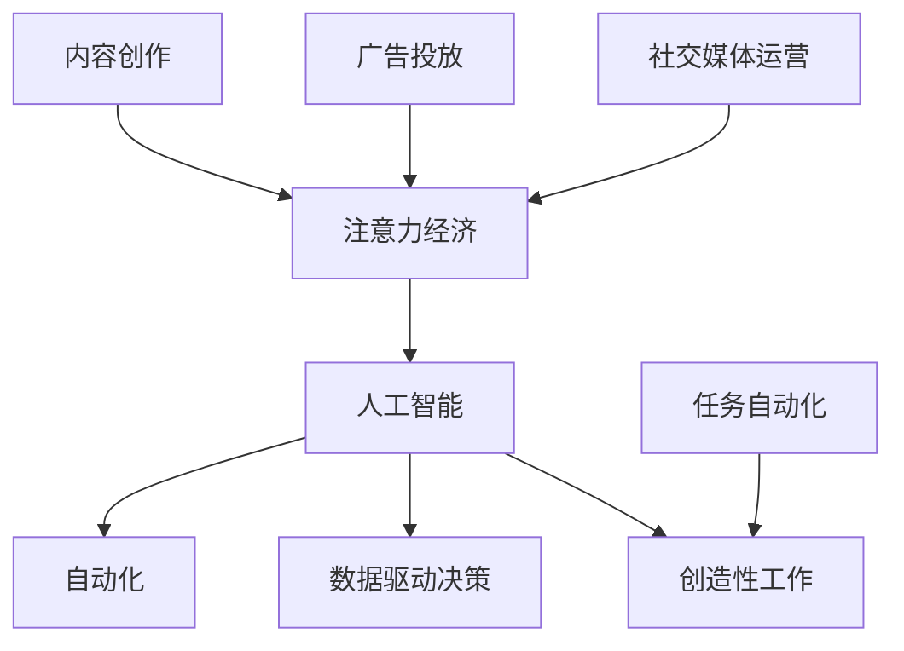

                 

# AI与人类注意力经济：未来的工作和收入

> 关键词：人工智能,注意力经济,未来工作,收入分配,技术赋能

## 1. 背景介绍

### 1.1 问题由来

随着科技的进步，人工智能（AI）技术正迅速渗透到各个行业，改变着人们的工作方式和收入结构。AI的广泛应用，尤其是在自动化、数据分析和决策支持等领域，引发了对未来工作和收入分配模式的深思。一方面，AI提高了生产效率，创造了新的经济价值；另一方面，AI也可能改变工作性质，影响劳动力市场，甚至导致部分工作岗位的消失。如何平衡AI的发展与人类社会经济结构的稳定，成为当前亟待解决的问题。

### 1.2 问题核心关键点

未来工作和收入的核心在于如何理解和应对AI在人类注意力经济中的作用。AI的智能系统通过学习数据、预测趋势、优化决策等，不断吸引和利用人类的注意力资源，从而在经济活动中占据重要位置。这种以注意力为核心的经济模式，被称为注意力经济（Attention Economy），是未来工作与收入分配的重要驱动因素。理解AI与人类注意力经济的互动关系，是探讨未来工作和收入的关键。

## 2. 核心概念与联系

### 2.1 核心概念概述

为了深入探讨AI与人类注意力经济的互动关系，本文将介绍几个关键概念：

- **人工智能（AI）**：利用机器学习、深度学习等技术，使机器能够模拟人类的智能行为，执行复杂的决策和任务。
- **注意力经济（Attention Economy）**：以人类注意力为关键资源的经济模式，AI通过吸引和利用人类注意力，在内容创作、广告投放、社交媒体运营等领域创造价值。
- **自动化**：利用AI技术实现的任务自动化，减少了人工干预，提高了效率。
- **数据驱动决策**：AI通过分析海量数据，辅助人类做出更科学的决策。
- **创造性工作**：需要人类创新、创造力的工作，如艺术创作、教育、科研等，这些工作难以完全被AI替代。

这些概念之间的逻辑关系可以通过以下Mermaid流程图来展示：



这个流程图展示了AI与注意力经济之间的互动关系：

1. AI通过自动化和数据驱动决策，在各行各业提升效率，创造经济价值。
2. 注意力经济通过AI吸引人类注意力，在内容创作、广告投放等领域创造更多价值。
3. 创造性工作在AI的辅助下，可能获得更高效率和更多创新成果。

这些概念共同构成了AI与人类注意力经济的相互作用框架，有助于我们理解未来工作和收入的演变趋势。

## 3. 核心算法原理 & 具体操作步骤
### 3.1 算法原理概述

AI与人类注意力经济的核心在于AI如何利用注意力资源，通过数据分析和优化决策，创造新的经济价值。这涉及以下几个核心步骤：

1. **数据收集与处理**：通过传感器、网络爬虫等手段，收集人类行为数据（如点击率、浏览时间、社交互动等）。
2. **注意力分配**：利用机器学习算法，分析数据并预测哪些内容、产品或服务能够吸引更多的注意力。
3. **优化决策**：基于预测结果，优化广告投放、内容创作、用户互动等策略，提升注意力利用效率。
4. **价值创造**：通过优化决策，吸引和利用更多注意力，创造新的经济价值，如广告收入、会员订阅等。

### 3.2 算法步骤详解

1. **数据收集与预处理**：
   - 使用API获取社交媒体上的用户行为数据（如Twitter、Facebook）。
   - 对数据进行清洗，去除噪声和异常值。
   - 将数据转换为可用于机器学习模型训练的格式。

2. **模型训练与选择**：
   - 选择适合的机器学习模型（如随机森林、神经网络）进行训练。
   - 使用交叉验证等技术评估模型性能，选择最优模型。

3. **注意力分配与优化**：
   - 对数据进行特征工程，提取重要的特征（如用户兴趣、行为时间等）。
   - 使用训练好的模型预测哪些内容、产品或服务将吸引更多的注意力。
   - 根据预测结果，优化广告投放策略、内容推荐算法等。

4. **价值创造与评估**：
   - 监测广告点击率、用户留存率等关键指标，评估注意力利用效果。
   - 分析注意力经济对收入的影响，如广告收入、用户付费等。
   - 根据分析结果，调整注意力分配策略，提高经济效益。

### 3.3 算法优缺点

AI与人类注意力经济的应用具有以下优点：

- **效率提升**：通过自动化和数据驱动决策，显著提升生产效率，降低人力成本。
- **精准营销**：利用AI分析用户行为，实现精准广告投放和内容推荐，提高广告转化率。
- **创造新价值**：AI吸引和利用注意力，创造新的经济价值，如广告收入、用户订阅等。

同时，该方法也存在一些局限性：

- **数据隐私**：AI在收集和分析用户行为数据时，涉及隐私保护问题，需合理处理用户数据。
- **算法偏见**：AI模型可能继承人类偏见，导致不公正的决策，需注意算法的公平性和透明性。
- **技术依赖**：过度依赖AI技术，可能削弱人类的自主创新能力和判断力。

### 3.4 算法应用领域

AI与人类注意力经济的应用已覆盖多个行业，例如：

- **电子商务**：通过AI分析用户行为，优化商品推荐和广告投放，提升转化率和销售额。
- **社交媒体**：利用AI分析用户互动数据，优化内容推送和广告投放策略，提高用户粘性。
- **金融服务**：通过AI分析市场数据，预测金融趋势，辅助投资决策，提升资产管理效率。
- **娱乐产业**：使用AI分析用户观看行为，推荐影视内容，提升用户满意度和平台收益。
- **健康医疗**：利用AI分析患者数据，提供个性化诊疗方案，提升医疗服务质量。

这些领域展示了AI与注意力经济结合的广泛应用，为未来工作与收入分配提供了更多可能性。

## 4. 数学模型和公式 & 详细讲解  
### 4.1 数学模型构建

本节将使用数学语言对AI与人类注意力经济的过程进行严格刻画。

记用户行为数据集为 $D=\{(x_i,y_i)\}_{i=1}^N, x_i \in \mathcal{X}, y_i \in \mathcal{Y}$，其中 $\mathcal{X}$ 为特征空间，$\mathcal{Y}$ 为标签空间。假设用户对内容的兴趣可以通过标签 $y_i$ 来表示，$y_i \in \{0,1\}$，1表示感兴趣，0表示不感兴趣。

定义AI模型 $M_{\theta}$ 在数据集 $D$ 上的注意力分配概率为 $p(y_i|x_i,\theta)$。通过最大化似然函数 $\mathcal{L}(\theta)$ 进行模型训练，即：

$$
\theta^* = \mathop{\arg\max}_{\theta} \sum_{i=1}^N \log p(y_i|x_i,\theta)
$$

其中，$p(y_i|x_i,\theta)$ 为模型在给定特征 $x_i$ 和模型参数 $\theta$ 下的预测概率，可以通过训练得到。

### 4.2 公式推导过程

以线性回归模型为例，推导注意力分配概率的计算公式。

假设模型 $M_{\theta}$ 为线性回归模型，其预测概率为：

$$
p(y_i|x_i,\theta) = \sigma(\langle x_i, \theta \rangle)
$$

其中，$\langle x_i, \theta \rangle$ 为特征向量与模型参数的内积，$\sigma(\cdot)$ 为逻辑回归函数。

根据最大似然估计，注意力分配概率 $p(y_i|x_i,\theta)$ 的计算公式为：

$$
p(y_i|x_i,\theta) = \frac{\exp(\langle x_i, \theta \rangle)}{\sum_{k=1}^N \exp(\langle x_k, \theta \rangle)}
$$

### 4.3 案例分析与讲解

考虑一个简单的电商广告点击率预测问题。假设广告点击率为 $y_i$，其中 $y_i \in \{0,1\}$。广告特征包括广告ID、用户ID、广告内容、用户历史行为等，记特征向量为 $x_i$。

首先，使用线性回归模型 $M_{\theta}$ 预测每个用户对广告的兴趣概率 $p(y_i|x_i,\theta)$。然后，将模型应用于实际广告投放，计算广告点击率预测准确率，优化广告投放策略。

通过案例分析，可以看到AI与人类注意力经济在电商领域的实际应用，以及如何通过优化决策提升广告效益。

## 5. 项目实践：代码实例和详细解释说明
### 5.1 开发环境搭建

在进行AI与注意力经济实践前，我们需要准备好开发环境。以下是使用Python进行Scikit-Learn和TensorFlow开发的环境配置流程：

1. 安装Anaconda：从官网下载并安装Anaconda，用于创建独立的Python环境。

2. 创建并激活虚拟环境：
```bash
conda create -n attention-env python=3.8 
conda activate attention-env
```

3. 安装Scikit-Learn：
```bash
pip install scikit-learn
```

4. 安装TensorFlow：
```bash
pip install tensorflow
```

5. 安装各类工具包：
```bash
pip install numpy pandas scikit-learn matplotlib tqdm jupyter notebook ipython
```

完成上述步骤后，即可在`attention-env`环境中开始实践。

### 5.2 源代码详细实现

这里我们以广告点击率预测为例，给出使用Scikit-Learn对线性回归模型进行注意力经济分析的PyTorch代码实现。

首先，定义广告数据处理函数：

```python
from sklearn.preprocessing import StandardScaler
from sklearn.model_selection import train_test_split

def preprocess_data(df):
    features = df.drop(['click', 'id'], axis=1)
    labels = df['click']
    features = StandardScaler().fit_transform(features)
    return train_test_split(features, labels, test_size=0.2, random_state=42)
```

然后，定义模型和优化器：

```python
from sklearn.linear_model import LinearRegression

model = LinearRegression()
optimizer = SGD(model.parameters(), lr=0.01, momentum=0.9)
```

接着，定义训练和评估函数：

```python
from sklearn.metrics import mean_squared_error

def train_epoch(model, train_data, optimizer):
    features, labels = train_data
    optimizer.zero_grad()
    predictions = model(features)
    loss = mean_squared_error(labels, predictions)
    loss.backward()
    optimizer.step()

def evaluate(model, test_data):
    features, labels = test_data
    predictions = model(features)
    mse = mean_squared_error(labels, predictions)
    return mse
```

最后，启动训练流程并在测试集上评估：

```python
epochs = 10
train_data, test_data = preprocess_data(df)

for epoch in range(epochs):
    train_epoch(model, train_data, optimizer)
    mse = evaluate(model, test_data)
    print(f"Epoch {epoch+1}, MSE: {mse:.3f}")

print(f"Test MSE: {evaluate(model, test_data):.3f}")
```

以上就是使用Scikit-Learn对线性回归模型进行注意力经济分析的完整代码实现。可以看到，Scikit-Learn提供了丰富的机器学习算法，方便快速搭建和评估模型。

### 5.3 代码解读与分析

让我们再详细解读一下关键代码的实现细节：

**preprocess_data函数**：
- 去除标签和广告ID，保留其他特征。
- 对特征进行标准化处理，使其均值为0，方差为1。
- 使用train_test_split将数据集划分为训练集和测试集。

**train_epoch函数**：
- 对训练集进行前向传播，计算预测结果。
- 计算预测结果与真实标签的均方误差（MSE）。
- 反向传播计算梯度，使用优化器更新模型参数。

**evaluate函数**：
- 对测试集进行前向传播，计算预测结果。
- 计算预测结果与真实标签的均方误差（MSE）。
- 返回测试集上的MSE值。

**训练流程**：
- 定义总迭代次数，循环迭代
- 每个epoch内，在训练集上进行一次梯度下降
- 在测试集上评估模型性能
- 输出训练和测试的MSE值

可以看到，Scikit-Learn提供的高阶接口，使得模型构建和评估过程变得简洁高效。开发者可以将更多精力放在特征工程和模型调参等高层逻辑上，而不必过多关注底层实现细节。

当然，工业级的系统实现还需考虑更多因素，如模型的保存和部署、超参数的自动搜索、更灵活的任务适配层等。但核心的AI与注意力经济分析过程基本与此类似。

## 6. 实际应用场景
### 6.1 电子商务

基于AI与注意力经济的广告点击率预测模型，可以广泛应用于电子商务平台的广告投放优化。传统的广告投放策略依赖于历史点击率数据，无法充分利用实时用户行为数据。使用AI与注意力经济模型，可以实时分析用户行为，动态调整广告投放策略，提升广告效果和转化率。

在技术实现上，可以收集用户在平台上的浏览、点击、购买等行为数据，使用广告点击率预测模型进行预测，指导广告投放。对于点击率低的内容，可以自动调整广告位，优化广告效果。对于新兴内容，可以提前进行预判，增加曝光机会。如此构建的电商广告系统，能大幅提升广告投放的精准度和效果，为平台带来更多的用户和收益。

### 6.2 社交媒体

AI与注意力经济在社交媒体中的应用，主要体现在用户互动数据的分析与优化上。通过分析用户的行为、兴趣、互动等数据，社交媒体平台可以优化内容推送、广告投放等策略，提升用户粘性和活跃度。

具体而言，社交媒体平台可以收集用户点赞、评论、分享等互动数据，使用注意力经济模型进行预测。对于点击率高的内容，可以优先推送，增加曝光率。对于互动频繁的用户，可以提供更多个性化推荐，提升用户满意度。通过AI与注意力经济的结合，社交媒体平台可以实现更加智能的内容推荐和广告投放，提升用户体验和平台收益。

### 6.3 金融服务

在金融服务领域，AI与注意力经济的应用主要体现在风险评估和市场预测上。通过分析用户的历史交易数据、市场行情等，AI可以预测用户的风险偏好、市场趋势等，辅助金融机构做出更科学的决策。

具体而言，金融机构可以收集用户的交易数据、市场行情、新闻资讯等，使用AI与注意力经济模型进行预测。对于风险高的用户，可以提前进行预警，减少金融风险。对于市场趋势，可以提前做出预测，优化投资策略。通过AI与注意力经济的结合，金融机构可以实现更加精准的风险评估和市场预测，提升投资回报率和市场竞争力。

### 6.4 未来应用展望

随着AI与注意力经济的不断发展，其在未来工作和收入分配中的应用将更加广泛，带来更多的可能性：

- **自动化生产**：在制造业、农业等传统行业，AI与注意力经济可以优化生产流程，提高效率，减少人力成本。
- **智慧城市**：在城市管理、交通控制等领域，AI与注意力经济可以实现智能调度、预测优化，提升城市管理水平。
- **教育培训**：在在线教育、职业技能培训等领域，AI与注意力经济可以实现个性化教学、智能推荐，提升教学效果和学习效率。
- **医疗健康**：在医疗诊断、健康管理等领域，AI与注意力经济可以实现智能辅助诊断、个性化健康建议，提升医疗服务质量。

AI与注意力经济的结合，不仅提高了生产效率和经济效益，还带来了更多创新性和灵活性，为未来工作与收入分配提供了更多可能性。

## 7. 工具和资源推荐
### 7.1 学习资源推荐

为了帮助开发者系统掌握AI与注意力经济的应用理论基础和实践技巧，这里推荐一些优质的学习资源：

1. 《深度学习与人工智能基础》系列博文：由深度学习专家撰写，详细介绍了深度学习算法、注意力机制、AI应用等核心内容。

2. Coursera《深度学习与神经网络》课程：由斯坦福大学教授Andrew Ng主讲，全面讲解深度学习原理和实践，适合初学者。

3. 《注意力机制与深度学习》书籍：介绍注意力机制的原理、应用及未来发展方向，是了解AI注意力经济的基础读物。

4. TensorFlow官方文档：TensorFlow的详细文档和示例代码，帮助开发者快速上手实践。

5. HuggingFace官方文档：提供丰富的预训练模型和微调样例，适合深入学习和研究。

通过对这些资源的学习实践，相信你一定能够快速掌握AI与注意力经济的精髓，并用于解决实际的AI应用问题。

### 7.2 开发工具推荐

高效的开发离不开优秀的工具支持。以下是几款用于AI与注意力经济开发的常用工具：

1. Scikit-Learn：基于Python的开源机器学习库，提供丰富的机器学习算法，适合快速搭建和评估模型。

2. TensorFlow：由Google主导开发的开源深度学习框架，生产部署方便，适合大规模工程应用。

3. Keras：高层次的深度学习框架，易于使用，适合快速开发原型和试验新想法。

4. Jupyter Notebook：基于Web的交互式编程环境，适合数据探索和模型实验。

5. PyTorch：基于Python的开源深度学习框架，灵活的计算图，适合快速迭代研究。

合理利用这些工具，可以显著提升AI与注意力经济项目的开发效率，加快创新迭代的步伐。

### 7.3 相关论文推荐

AI与注意力经济的研究源于学界的持续研究。以下是几篇奠基性的相关论文，推荐阅读：

1. Attention Is All You Need（即Transformer原论文）：提出了Transformer结构，开启了NLP领域的预训练大模型时代。

2. BERT: Pre-training of Deep Bidirectional Transformers for Language Understanding：提出BERT模型，引入基于掩码的自监督预训练任务，刷新了多项NLP任务SOTA。

3. Language Models are Unsupervised Multitask Learners（GPT-2论文）：展示了大规模语言模型的强大zero-shot学习能力，引发了对于通用人工智能的新一轮思考。

4. Revisiting Deep Attention Networks for Attention Based Models（Reformer论文）：提出Reformer模型，优化了Transformer的自注意力机制，提升了注意力经济模型的效率和效果。

5. Causal Attention Mechanism in Transformer Based Models：详细介绍了注意力机制的原理和应用，为AI与注意力经济的应用提供了理论基础。

这些论文代表了大模型注意力经济的最新进展，通过学习这些前沿成果，可以帮助研究者把握学科前进方向，激发更多的创新灵感。

## 8. 总结：未来发展趋势与挑战

### 8.1 总结

本文对AI与人类注意力经济进行了全面系统的介绍。首先阐述了AI与注意力经济的研究背景和意义，明确了AI在注意力经济中的作用及其对未来工作和收入分配的影响。其次，从原理到实践，详细讲解了注意力经济模型的数学原理和关键步骤，给出了AI与注意力经济任务开发的完整代码实例。同时，本文还广泛探讨了注意力经济在电子商务、社交媒体、金融服务等多个行业领域的应用前景，展示了AI与注意力经济技术的广泛应用。

通过本文的系统梳理，可以看到，AI与注意力经济正在成为当前人工智能领域的重要范式，极大地拓展了AI的应用边界，推动了经济模式的创新。未来，伴随AI技术的不断演进和优化，AI与注意力经济必将在更广泛的领域发挥其作用，为人类社会的进步带来深远影响。

### 8.2 未来发展趋势

展望未来，AI与注意力经济的应用将呈现以下几个发展趋势：

1. **自动化程度的提升**：AI与注意力经济将更加深入到自动化生产、智能调度等领域，提升效率，减少人工干预。
2. **个性化服务的普及**：AI与注意力经济将带来更加个性化的服务体验，如智能推荐、个性化广告等，提升用户满意度。
3. **跨领域应用的拓展**：AI与注意力经济的应用将跨越更多领域，如医疗、教育、智慧城市等，带来更多创新性和灵活性。
4. **伦理和社会影响的研究**：伴随AI与注意力经济的普及，如何平衡技术进步与社会伦理，成为一个重要课题。

以上趋势凸显了AI与注意力经济的广阔前景，这些方向的探索发展，必将进一步提升AI的经济价值和应用范围，为人类社会的进步提供新的动力。

### 8.3 面临的挑战

尽管AI与注意力经济的应用已经取得了显著成效，但在迈向更加智能化、普适化应用的过程中，仍面临诸多挑战：

1. **数据隐私**：AI在收集和分析用户数据时，涉及隐私保护问题，需合理处理用户数据，保护用户隐私。
2. **算法公平性**：AI模型可能继承人类偏见，导致不公正的决策，需注意算法的公平性和透明性。
3. **技术依赖**：过度依赖AI技术，可能削弱人类的自主创新能力和判断力，需注意技术与人类的平衡。
4. **伦理和社会影响**：AI与注意力经济的普及可能带来伦理和社会问题，如就业替代、收入分配不均等，需加强伦理研究和监管。

这些挑战需要从数据、算法、社会伦理等多个层面进行综合治理，才能实现AI与注意力经济的可持续发展。

### 8.4 研究展望

面对AI与注意力经济面临的诸多挑战，未来的研究需要在以下几个方面寻求新的突破：

1. **隐私保护技术**：开发更加高效的隐私保护算法，保护用户隐私，同时提高数据利用效率。
2. **公平性算法**：研究公平性算法，确保AI模型的决策过程公正透明，减少偏见和歧视。
3. **技术与人类的平衡**：探索技术与人类的协同工作模式，提高人类的自主创新能力和判断力，避免技术替代人类的风险。
4. **伦理和社会影响研究**：加强AI与社会伦理的结合研究，确保技术进步与社会伦理的协调发展。

这些研究方向的探索，必将引领AI与注意力经济的进步，为构建安全、可靠、可解释、可控的智能系统铺平道路。面向未来，AI与注意力经济必将与更多技术进行协同，共同推动人类社会的进步。

## 9. 附录：常见问题与解答

**Q1：AI与注意力经济的应用是否只适用于大型企业？**

A: AI与注意力经济的应用不仅仅局限于大型企业，小型企业和个人也可以通过AI技术实现更加精准的决策和优化。例如，个人可以通过AI推荐系统，提升电子商务和社交媒体的使用体验。小型企业也可以利用AI优化生产流程，提高效率。

**Q2：AI与注意力经济的应用是否会导致就业替代？**

A: AI与注意力经济的应用确实会替代部分低技能、重复性的工作岗位，但同时也会创造新的工作机会，如数据科学家、算法工程师、AI产品经理等。关键在于如何平衡技术进步与社会就业的协调发展，加强职业培训和技能转型，提升劳动者的适应能力。

**Q3：AI与注意力经济的应用是否会造成收入不平等？**

A: AI与注意力经济的应用有可能加剧收入不平等，特别是在数据和算法资源分配不均的情况下。为避免这一问题，需要加强数据的开放共享，确保算法的透明和公平，避免过度依赖数据和技术资源。

**Q4：AI与注意力经济的应用是否会影响人类决策的自主性？**

A: AI与注意力经济的应用确实会增强数据驱动决策的能力，但人类仍然具有自主决策的权力。关键在于如何平衡AI的辅助和人类的自主决策，确保人类在决策过程中的主导地位。

**Q5：AI与注意力经济的应用是否会影响人类的创造性？**

A: AI与注意力经济的应用可以提升数据处理和决策的效率，但人类的创造性仍然难以被完全替代。关键在于如何利用AI技术，激发人类的创造力和创新精神，促进技术的进步和社会的发展。

这些问题的探讨和回答，帮助我们更全面地理解AI与注意力经济的应用，为未来研究和实践提供方向。

---

作者：禅与计算机程序设计艺术 / Zen and the Art of Computer Programming

